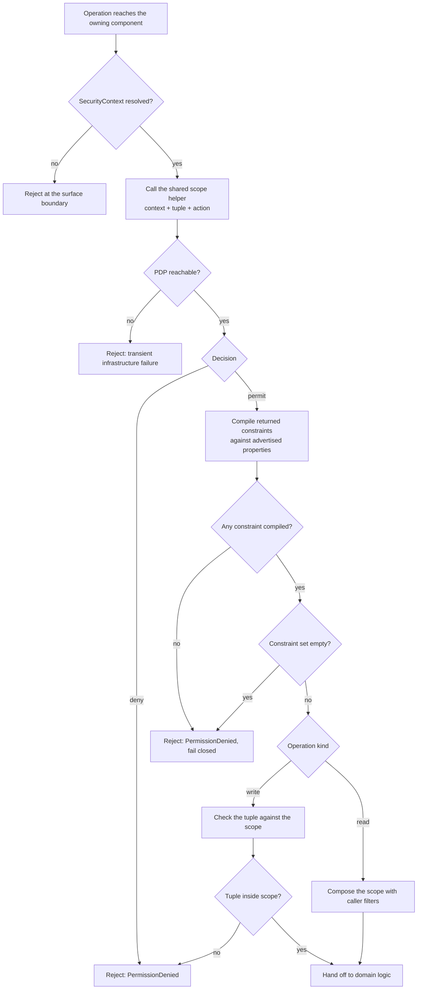

Created:  2026-09-25 by Virtuozzo International GmbH
Updated:  2026-09-25 by Virtuozzo International GmbH

# Feature: Attribution, Authorization & Tenant Isolation

- [ ] `p1` - **ID**: `cpt-cf-usage-collector-featstatus-attribution-authorization-implemented`

- [ ] `p1` - `cpt-cf-usage-collector-feature-attribution-authorization`

Specifies the PDP-anchored security gate that authorizes the caller-supplied
attribution tuple on every Usage Collector ingestion, query, and feed
operation, enforces tenant isolation per tenant scope, and fails closed on
denial or PDP unavailability across all four gated surfaces.

<!-- toc -->

- [1. Feature Context](#1-feature-context)
  - [1.1 Overview](#11-overview)
  - [1.2 Purpose](#12-purpose)
  - [1.3 Actors](#13-actors)
  - [1.4 References](#14-references)
- [2. Actor Flows (CDSL)](#2-actor-flows-cdsl)
  - [Authorize a Usage Submission](#authorize-a-usage-submission)
  - [Authorize a Usage Query](#authorize-a-usage-query)
  - [Authorize a Feed Read](#authorize-a-feed-read)
  - [Read Across Tenants as a Parent Tenant Administrator](#read-across-tenants-as-a-parent-tenant-administrator)
- [3. Processes / Business Logic (CDSL)](#3-processes--business-logic-cdsl)
  - [Validate the Attribution Tuple](#validate-the-attribution-tuple)
  - [Evaluate the PDP Scope](#evaluate-the-pdp-scope)
  - [Admit a Write Against the Scope](#admit-a-write-against-the-scope)
  - [Compose the Scope With Caller Filters](#compose-the-scope-with-caller-filters)
  - [Map a Gate Failure to an Outcome](#map-a-gate-failure-to-an-outcome)
- [4. States (CDSL)](#4-states-cdsl)
- [5. Definitions of Done](#5-definitions-of-done)
  - [One Shared Scope Helper](#one-shared-scope-helper)
  - [Structural Validation of Caller-Supplied Attribution](#structural-validation-of-caller-supplied-attribution)
  - [Post-Permit Write Admission](#post-permit-write-admission)
  - [Read Scope Applied Before Caller Filters](#read-scope-applied-before-caller-filters)
  - [Feed Scope Evaluated Per Request](#feed-scope-evaluated-per-request)
  - [Advertised Scopable Properties](#advertised-scopable-properties)
  - [Fail-Closed Outcomes on Every Surface](#fail-closed-outcomes-on-every-surface)
  - [Independent Per-Tenant Scope Evaluation](#independent-per-tenant-scope-evaluation)
- [6. Acceptance Criteria](#6-acceptance-criteria)

<!-- /toc -->

## 1. Feature Context

### 1.1 Overview

The security gate every Usage Collector operation passes before it reaches
domain logic. The caller supplies an attribution tuple — tenant, resource, an
optional subject, and the referenced GTS type — the gate validates that tuple
structurally, authorizes it at the platform Policy Decision Point (PDP,
`authz-resolver`), and then checks the operation against the scope the PDP
returned. Writes are admitted only when the returned scope admits the whole
tuple. Reads carry that scope as a filter applied before any caller-supplied
filter narrows the result further.

### 1.2 Purpose

The gear must let one caller emit and read usage for many tenants — a metering
forwarder reporting for several tenants, a parent tenant administrator reading
its subtenants, a platform-administrative role spanning tenants — without ever
granting access the platform's own policy does not grant. Deriving identity
from the caller's `SecurityContext` would make forwarding impossible without a
second, impersonating code path. Keeping a gear-local access table would create
a second authorization store that can drift from platform policy and silently
over-permit. This feature therefore takes attribution from the wire and the
decision from the PDP, and holds every operation inside the returned scope.

Because it is the gate, it is also the gear's single fail-closed choke point:
no deny, no PDP outage, and no uncompilable constraint set ever resolves to an
admitted operation. Eight of the gear's other thirteen features sit behind this
gate.

**Requirements**: `cpt-cf-usage-collector-fr-tenant-attribution`,
`cpt-cf-usage-collector-fr-resource-attribution`,
`cpt-cf-usage-collector-fr-subject-attribution`,
`cpt-cf-usage-collector-fr-tenant-isolation`,
`cpt-cf-usage-collector-fr-ingestion-authorization`

**Principles**: `cpt-cf-usage-collector-principle-pdp-centric-authorization`,
`cpt-cf-usage-collector-principle-fail-closed`

The gate is implemented inside three components rather than beside them:
`cpt-cf-usage-collector-component-ingestion-gateway` guards every submitted
entry, `cpt-cf-usage-collector-component-query-gateway` guards the raw and
aggregated reads, and `cpt-cf-usage-collector-component-feed-gateway` guards
feed pages. Each calls one shared helper inline, so the in-process SDK caller
and the REST caller travel the same authorization path
([DESIGN.md](../DESIGN.md) §3.2, "PDP Authorization Posture").

**Scope boundary.** This feature owns the gate and nothing behind it. Period
bounds, quantity range, metadata shape, identity derivation, and the
invalidation rules run after the gate clears and belong to the usage record
ingestion, record invalidation, and usage query features. The ingestion quota
charge runs *before* the gate — the entry cap first, then the quota, then the
PDP call — and belongs to the rate limiting and reconciliation feature. The
backfill route's distinct `backfill` action, granted independently of `create`,
belongs to the backfill import and retention governance feature; this feature
states only that the action follows the route rather than the entry's covered
period or kind.

### 1.3 Actors

| Actor | Role in Feature |
|-------|-----------------|
| `cpt-cf-usage-collector-actor-usage-source` | Submits entries carrying a caller-supplied attribution tuple; every submission is authorized per entry before any domain validation runs |
| `cpt-cf-usage-collector-actor-usage-consumer` | Reads raw, aggregated, and feed data; the PDP-returned scope bounds every page and every bucket it receives |
| `cpt-cf-usage-collector-actor-tenant-admin` | Queries usage for its own tenant and, where the PDP grants it, for subtenants; each tenant scope is evaluated on its own |
| `cpt-cf-usage-collector-actor-platform-developer` | Integrates through the in-process SDK trait, which runs the identical gate — the trait implementation, not a REST handler or middleware, is the single enforcement site |

### 1.4 References

- **PRD**: [PRD.md](../PRD.md) — §5.3 Attribution & Isolation
  (`cpt-cf-usage-collector-fr-tenant-attribution`,
  `cpt-cf-usage-collector-fr-resource-attribution`,
  `cpt-cf-usage-collector-fr-subject-attribution`,
  `cpt-cf-usage-collector-fr-tenant-isolation`,
  `cpt-cf-usage-collector-fr-ingestion-authorization`)
- **Design**: [DESIGN.md](../DESIGN.md) — §2.1 (PDP-centric authorization,
  Fail-closed behavior), §3.2 Component Model and its "PDP Authorization
  Posture" subsection, §3.3 API Contracts (surface rules and error contract),
  §3.5 External Dependencies (Platform PDP), §3.9.6 Authorization Architecture
- **ADR**:
  [PDP-centric authorization](../ADR/0001-cpt-cf-usage-collector-adr-pdp-centric-authorization.md)
  (`cpt-cf-usage-collector-adr-pdp-centric-authorization`),
  [Caller-supplied attribution](../ADR/0003-cpt-cf-usage-collector-adr-caller-supplied-attribution.md)
  (`cpt-cf-usage-collector-adr-caller-supplied-attribution`)
- **Decomposition**: [DECOMPOSITION.md](../DECOMPOSITION.md) §2.1
- **Sequences**: none of its own. The gate is a step inside the emit, invalidate,
  aggregate-query, raw-query, feed-read, and backfill sequences that the
  ingestion, invalidation, query, feed, and backfill features own. It is
  specified here once and referenced there rather than drawn as a sequence of
  this feature.
- **Dependencies**: none. This feature depends on no other feature of the gear
  and is a direct prerequisite for eight of them: usage record ingestion,
  record invalidation, usage query, usage feed, backfill import and retention
  governance, rate limiting and reconciliation, data classification, and
  operational visibility.

## 2. Actor Flows (CDSL)

Actor-initiated interactions. Each flow stops at the point the gate hands
control to the feature that owns the operation behind it, because everything
past that point is out of scope here.

### Authorize a Usage Submission

- [ ] `p1` - **ID**: `cpt-cf-usage-collector-flow-authorize-ingestion`

**Actor**: `cpt-cf-usage-collector-actor-usage-source`

**Success Scenarios**:
- Every entry's tuple is structurally complete and falls inside the scope the
  PDP returned; the gate hands each entry to domain validation
- A batch mixes tenants, and every one of those tenants is separately inside
  the returned scope; all entries clear the gate through one uniform path, with
  no forwarder mode and no "on behalf of" flag
- An entry carries no subject; subject authorization is skipped for it, and the
  remaining three dimensions are still checked

**Error Scenarios**:
- The request arrives with no resolved `SecurityContext` — rejected at the
  surface boundary, before any domain component runs
- An entry omits `tenant_id`, `resource_id`, `resource_type`, or `gts_type_id`,
  or carries a subject type with no subject id — `InvalidArgument` naming the
  field
- The PDP denies the caller for an entry's tuple — `PermissionDenied` in that
  entry's outcome slot; the entry is never persisted
- The PDP permits but returns a constraint set that does not admit the entry's
  tenant, resource, GTS type, or supplied subject — `PermissionDenied`
- The PDP permits and returns an empty constraint set — fail-closed
  `PermissionDenied`, never read as an unrestricted grant
- The PDP is unreachable or errors — the entry is rejected as a transient
  infrastructure failure; there is no shadow-allow path and no degraded
  admission

**Steps**:
1. [ ] - `p1` - Usage source submits one or more entries to the ingestion surface, each carrying its own attribution tuple: `tenant_id`, `resource_id`, `resource_type`, optional `subject_id` and `subject_type`, and `gts_type_id` - `inst-auth-ingest-submit`
2. [ ] - `p1` - API: POST /usage-collector/v1/records (batch of entries in, per-entry outcomes out) — the surface boundary requires a `SecurityContext` the platform gateway already resolved, and rejects the request outright when none is present - `inst-auth-ingest-surface`
3. [ ] - `p1` - The per-request entry cap and the ingestion quota charge run ahead of this gate and are owned by the rate limiting and reconciliation feature; an over-cap or over-quota submission never reaches step 4 - `inst-auth-ingest-preconditions`
4. [ ] - `p1` - **FOR EACH** entry in the submission - `inst-auth-ingest-loop`
   1. [ ] - `p1` - Run `cpt-cf-usage-collector-algo-attribution-structural-validation` over the entry's tuple - `inst-auth-ingest-structural`
   2. [ ] - `p1` - Run `cpt-cf-usage-collector-algo-pdp-scope-evaluation` with the caller's `SecurityContext`, the entry's tuple, and the action the route selects (`create` on this endpoint) - `inst-auth-ingest-pdp`
   3. [ ] - `p1` - Run `cpt-cf-usage-collector-algo-write-scope-admission` to check the entry's tuple against the returned scope - `inst-auth-ingest-admission`
   4. [ ] - `p1` - **IF** any of the three steps rejects - `inst-auth-ingest-reject-branch`
      1. [ ] - `p1` - Record the deterministic error from `cpt-cf-usage-collector-algo-fail-closed-outcome-mapping` in this entry's outcome slot and move to the next entry; no state change and no plugin dispatch has occurred for it - `inst-auth-ingest-reject`
   5. [ ] - `p1` - **ELSE** - `inst-auth-ingest-pass-branch`
      1. [ ] - `p1` - Hand the entry to domain validation and identity derivation, which the usage record ingestion feature owns - `inst-auth-ingest-handoff`
5. [ ] - `p1` - **RETURN** per-entry outcomes in input order, denials included, so one denied entry never hides the fate of the rest - `inst-auth-ingest-return`

The gate does not vary by entry kind. A correction travels the same check as
the measurement it withdraws, under the same tuple, which is what lets the
append-only ledger treat a correction as an ordinary submission.

### Authorize a Usage Query

- [ ] `p1` - **ID**: `cpt-cf-usage-collector-flow-authorize-query`

**Actor**: `cpt-cf-usage-collector-actor-usage-consumer`

**Success Scenarios**:
- The consumer receives rows or buckets drawn only from the scope the PDP
  returned for this request
- The consumer supplies a filter narrower than its scope and receives the
  narrower result
- The consumer supplies a filter wider than its scope and still receives only
  what the scope admits

**Error Scenarios**:
- The PDP denies the read — `PermissionDenied`, before any plugin read runs
- The PDP permits and returns an empty constraint set — fail-closed rejection
- Every returned constraint names a property the gear does not advertise, so
  none compiles — fail-closed rejection
- The PDP is unreachable — rejection as a transient infrastructure failure; the
  reader must not invent usage state

**Steps**:
1. [ ] - `p1` - Consumer issues a read naming one GTS type and a mandatory time range, plus optional attribution filters - `inst-auth-query-request`
2. [ ] - `p1` - API: GET /usage-collector/v1/records (raw, cursor-paginated) or POST /usage-collector/v1/records/aggregate (declared fold, optional grouping) - `inst-auth-query-surface`
3. [ ] - `p1` - Run `cpt-cf-usage-collector-algo-pdp-scope-evaluation` for the read, obtaining the compiled scope - `inst-auth-query-pdp`
4. [ ] - `p1` - Run `cpt-cf-usage-collector-algo-read-scope-composition` to compose the compiled scope with the caller's filters - `inst-auth-query-compose`
5. [ ] - `p1` - **IF** the scope evaluation rejected - `inst-auth-query-reject-branch`
   1. [ ] - `p1` - **RETURN** the deterministic error from `cpt-cf-usage-collector-algo-fail-closed-outcome-mapping`; no read reaches the storage plugin - `inst-auth-query-reject`
6. [ ] - `p1` - **ELSE** - `inst-auth-query-pass-branch`
   1. [ ] - `p1` - Hand the composed filter set to the read path, which the usage query feature owns, together with the type resolution and dispatch it performs - `inst-auth-query-handoff`
7. [ ] - `p1` - **RETURN** the result the read path produced, bounded by the composed filter set - `inst-auth-query-return`

The scope is recomputed on every request. Nothing about a previous decision is
carried forward in a cursor, a session, or a cache.

### Authorize a Feed Read

- [ ] `p1` - **ID**: `cpt-cf-usage-collector-flow-authorize-feed`

**Actor**: `cpt-cf-usage-collector-actor-usage-consumer`

**Success Scenarios**:
- Each page carries only entries the caller's freshly evaluated scope admits,
  for the GTS types the subscription declares
- The caller's scope widens between two reads; later pages start admitting the
  newly granted entries at positions ahead of the cursor
- The caller's scope narrows between two reads; entries the caller may no
  longer read are skipped as the cursor advances, and the read still succeeds

**Error Scenarios**:
- The PDP denies the read for a subscribed type — `PermissionDenied`
- The PDP returns an empty or wholly uncompilable constraint set — fail-closed
  rejection
- The PDP is unreachable — rejection as a transient infrastructure failure,
  with no page served

**Steps**:
1. [ ] - `p1` - Consumer issues a feed read naming its subscription, an optional cursor, and an optional bounded-replay end position - `inst-auth-feed-request`
2. [ ] - `p1` - API: GET /usage-collector/v1/feed (subscription plus optional cursor in, page plus next cursor out) - `inst-auth-feed-surface`
3. [ ] - `p1` - Run `cpt-cf-usage-collector-algo-pdp-scope-evaluation` for the read scope covering each subscribed GTS type - `inst-auth-feed-pdp`
4. [ ] - `p1` - **IF** the evaluation rejected for any subscribed type - `inst-auth-feed-reject-branch`
   1. [ ] - `p1` - **RETURN** the deterministic error from `cpt-cf-usage-collector-algo-fail-closed-outcome-mapping`; no page is served and no partial page is substituted - `inst-auth-feed-reject`
5. [ ] - `p1` - Apply the compiled scope as a page filter for this request only, and do not encode any part of it into the cursor the caller receives - `inst-auth-feed-filter`
6. [ ] - `p1` - Hand the filtered page request to the feed path, which the usage feed feature owns together with ordering, cursor minting, and the retention refusal - `inst-auth-feed-handoff`
7. [ ] - `p1` - **RETURN** the page, whose entries are the intersection of the subscription and the scope evaluated for this request - `inst-auth-feed-return`

Because scope lives outside the cursor, a widening admits history behind the
consumer's position that the feed neither delivers nor signals; bootstrapping
the newly admitted scope is the consumer's obligation. A narrowing skips
entries silently for the same reason: serving them would carry out a read the
scope no longer permits. Detecting a gap an unintended narrowing left is the
reconciliation surface's job, not the cursor's.

### Read Across Tenants as a Parent Tenant Administrator

- [ ] `p1` - **ID**: `cpt-cf-usage-collector-flow-cross-tenant-read`

**Actor**: `cpt-cf-usage-collector-actor-tenant-admin`

**Success Scenarios**:
- A parent tenant administrator whose PDP grant carries a tenant-subtree
  constraint reads usage attributed to its subtenants, without the subtenants
  being enumerated in the request
- A platform-administrative role holding grants for several unrelated tenants
  reads each of them, because the PDP returned a constraint covering each one
- The same caller reads its own tenant; that grant is unaffected by whether any
  cross-tenant grant exists

**Error Scenarios**:
- The caller filters on a sibling tenant it holds no grant for — the composed
  filter set admits nothing from that tenant, so the read returns no rows from
  it rather than widening
- The caller holds a grant for a parent tenant only, and no subtree constraint
  accompanies it — subtenant data stays outside the scope, and no hierarchy is
  inferred inside the gear
- The PDP returns no constraint covering any requested tenant — fail-closed
  rejection

**Steps**:
1. [ ] - `p1` - Tenant administrator issues a read whose tenant filter names one tenant, several tenants, or no tenant at all - `inst-auth-xtenant-request`
2. [ ] - `p1` - API: GET /usage-collector/v1/records or POST /usage-collector/v1/records/aggregate - `inst-auth-xtenant-surface`
3. [ ] - `p1` - Run `cpt-cf-usage-collector-algo-pdp-scope-evaluation`; the tenant dimension compiles from the PDP's tenant property, and a subtree constraint authorizes a tenant subtree rather than an enumerated list - `inst-auth-xtenant-pdp`
4. [ ] - `p1` - Treat each tenant the result touches as its own scope decision: no grant for one tenant implies a grant for its sibling, its parent, or its child - `inst-auth-xtenant-independence`
5. [ ] - `p1` - Run `cpt-cf-usage-collector-algo-read-scope-composition`, so the caller's own tenant filter can only narrow the authorized set - `inst-auth-xtenant-compose`
6. [ ] - `p1` - **RETURN** rows or buckets drawn only from tenants the returned scope covers - `inst-auth-xtenant-return`

The same independence rule governs writes. A forwarder authorized to emit for
one tenant gains nothing for a second tenant, whatever the two tenants'
relationship in the platform hierarchy.

## 3. Processes / Business Logic (CDSL)

Internal routines the flows above call. All four run inside the domain trait
implementation of the owning component, never in a REST handler and never as
framework middleware, so in-process and REST callers reach identical behavior.

### Validate the Attribution Tuple

- [ ] `p1` - **ID**: `cpt-cf-usage-collector-algo-attribution-structural-validation`

**Input**: the caller-supplied attribution tuple of one operation — `tenant_id`,
`resource_id`, `resource_type`, optional `subject_id` and `subject_type`, and
`gts_type_id`

**Output**: `Ok`, or an `InvalidArgument` rejection naming the offending field

**Steps**:
1. [ ] - `p1` - Require `tenant_id` to be present and non-empty; this check is deliberately redundant with the PDP decision, and stands as the defense-in-depth tenant validation the tenant attribution requirement calls for - `inst-attrval-tenant`
2. [ ] - `p1` - Require both `resource_id` and `resource_type`; reject when either is absent, because resource attribution is mandatory and downstream consumers must never handle its absence - `inst-attrval-resource`
3. [ ] - `p1` - **IF** `subject_type` is supplied and `subject_id` is not - `inst-attrval-subject-branch`
   1. [ ] - `p1` - Reject: a subject type without a subject id names no principal - `inst-attrval-subject-reject`
4. [ ] - `p1` - Accept an absent subject as valid, and record for the caller of this routine that subject authorization is to be skipped for this operation - `inst-attrval-subject-optional`
5. [ ] - `p1` - Require `gts_type_id` to be present; resolving it to a declaration is the type resolution feature's job and is not attempted here - `inst-attrval-type`
6. [ ] - `p1` - Populate no field of the tuple from the caller's `SecurityContext`, under any condition, including when the field is absent - `inst-attrval-no-derivation`
7. [ ] - `p1` - Treat every identifier as an opaque platform string: no parsing, no interpretation, no classification, and no normalization beyond what the wire type already requires - `inst-attrval-opaque`
8. [ ] - `p1` - **RETURN** `Ok` with the validated tuple and the subject-present flag - `inst-attrval-return`

### Evaluate the PDP Scope

- [ ] `p1` - **ID**: `cpt-cf-usage-collector-algo-pdp-scope-evaluation`

**Input**: the caller's resolved `SecurityContext`, a validated attribution
tuple, and the action the operation's route selects

**Output**: a compiled access scope, or a fail-closed rejection

**Steps**:
1. [ ] - `p1` - Call one shared helper, a thin wrapper over the platform policy enforcer's scope call, from the component that owns the operation; define that helper exactly once and route every guarded operation through it - `inst-pdp-helper`
2. [ ] - `p1` - Pass the caller's `SecurityContext` and the full tuple — tenant, resource, referenced GTS type, and subject where one is supplied - `inst-pdp-inputs`
3. [ ] - `p1` - **TRY** the PDP call - `inst-pdp-try`
   1. [ ] - `p1` - Obtain a permit or a deny, and on a permit the constraint set the decision carries - `inst-pdp-decision`
4. [ ] - `p1` - **CATCH** an unreachable or erroring PDP - `inst-pdp-catch`
   1. [ ] - `p1` - Reject fail-closed; do not retry into a permissive default, do not substitute a previous decision, and do not admit the operation - `inst-pdp-catch-reject`
5. [ ] - `p1` - **IF** the decision is a deny - `inst-pdp-deny-branch`
   1. [ ] - `p1` - Reject before any state change and before any plugin read or write - `inst-pdp-deny-reject`
6. [ ] - `p1` - Compile the returned constraints into an access scope, mapping each constraint's property onto the fixed attribution dimension it addresses: the attributed tenant (carrying subtree semantics, so nested tenants authorize a subtree rather than an enumerated set), the attributed resource id and type, the attributed subject id and type, and the GTS type - `inst-pdp-compile`
7. [ ] - `p1` - Advertise exactly those properties as the resource type's supported set; a constraint naming a property outside it fails to compile - `inst-pdp-advertise`
8. [ ] - `p1` - **IF** every constraint failed to compile, or the constraint set is empty - `inst-pdp-empty-branch`
   1. [ ] - `p1` - Reject fail-closed; an empty constraint set is never read as an unrestricted grant, on the read path or the write path - `inst-pdp-empty-reject`
9. [ ] - `p1` - Discard the compiled scope when the operation completes; persist it nowhere, cache it nowhere, and encode it into no cursor - `inst-pdp-no-cache`
10. [ ] - `p1` - **RETURN** the compiled scope - `inst-pdp-return`

A permit alone is not the decision. The PDP says which scope the caller may act
in; the two routines below hold the operation inside it. Both halves are part of
the authorization, not an extra safeguard layered over it.

### Admit a Write Against the Scope

- [ ] `p1` - **ID**: `cpt-cf-usage-collector-algo-write-scope-admission`

**Input**: a compiled access scope and one entry's validated attribution tuple

**Output**: `Ok`, or a `PermissionDenied` rejection naming the dimension that
fell outside the scope

**Steps**:
1. [ ] - `p1` - Check the entry's `tenant_id` against the scope's tenant dimension; membership of an authorized subtree counts as inside - `inst-writeadm-tenant`
2. [ ] - `p1` - Check `resource_id` and `resource_type` against the scope's resource dimension - `inst-writeadm-resource`
3. [ ] - `p1` - Check `gts_type_id` against the scope's type dimension, which the PDP narrows independently of the typed parameter the caller supplied - `inst-writeadm-type`
4. [ ] - `p1` - **IF** the entry supplies a subject - `inst-writeadm-subject-branch`
   1. [ ] - `p1` - Check `subject_id`, and `subject_type` where supplied, against the scope's subject dimension - `inst-writeadm-subject`
5. [ ] - `p1` - **IF** any checked dimension falls outside the scope - `inst-writeadm-outside-branch`
   1. [ ] - `p1` - Reject the entry, naming the dimension, before any plugin dispatch; a permit that does not cover the tuple admits nothing - `inst-writeadm-outside-reject`
6. [ ] - `p1` - **RETURN** `Ok` - `inst-writeadm-return`

This is the check that stops an authorized caller from attributing a
measurement to a tenant, resource, or subject outside its grant, and it is the
same check a correction passes, since a correction carries its target's full
attribution.

### Compose the Scope With Caller Filters

- [ ] `p1` - **ID**: `cpt-cf-usage-collector-algo-read-scope-composition`

**Input**: a compiled access scope and the caller's filters for one read

**Output**: one effective filter set, never wider than the scope

**Steps**:
1. [ ] - `p1` - Start from the compiled scope as the base predicate of the read - `inst-readcomp-base`
2. [ ] - `p1` - **FOR EACH** caller-supplied filter - `inst-readcomp-loop`
   1. [ ] - `p1` - Conjoin it with the base predicate, so the two compose by intersection and never by union - `inst-readcomp-conjoin`
3. [ ] - `p1` - Where a caller filter names a value the scope excludes, let the intersection select nothing for that value rather than widening the scope to admit it - `inst-readcomp-narrow-only`
4. [ ] - `p1` - Compose before dispatch, so the storage plugin never receives a predicate wider than the authorized scope - `inst-readcomp-before-dispatch`
5. [ ] - `p1` - Leave field-name validation of the caller's filters and grouping to the read path that owns them; this routine composes, it does not check names - `inst-readcomp-name-boundary`
6. [ ] - `p1` - **RETURN** the composed filter set - `inst-readcomp-return`

### Map a Gate Failure to an Outcome

- [ ] `p1` - **ID**: `cpt-cf-usage-collector-algo-fail-closed-outcome-mapping`

**Input**: the condition on which the gate rejected

**Output**: one deterministic error from the gear's published taxonomy

**Steps**:
1. [ ] - `p1` - Map a missing `SecurityContext` to rejection at the surface boundary, before any domain component runs - `inst-failmap-nocontext`
2. [ ] - `p1` - Map a structurally invalid tuple to `InvalidArgument`, naming the field - `inst-failmap-invalid`
3. [ ] - `p1` - Map a PDP deny to `PermissionDenied` - `inst-failmap-deny`
4. [ ] - `p1` - Map an empty or wholly uncompilable constraint set to `PermissionDenied`, because it is an authorization outcome and not a caller input error - `inst-failmap-empty`
5. [ ] - `p1` - Map a tuple outside the returned scope to `PermissionDenied`, naming the dimension - `inst-failmap-outside`
6. [ ] - `p1` - Map an unreachable or erroring PDP to `ServiceUnavailable`, the one infrastructure-retryable class, so a caller can tell an outage from a denial and retry only the former - `inst-failmap-unavailable`
7. [ ] - `p1` - Surface every one of these to the caller immediately rather than discarding the operation silently, and change no state on any of them - `inst-failmap-surface`
8. [ ] - `p1` - **RETURN** the mapped error - `inst-failmap-return`

Nothing in this mapping is reachable from the storage plugin's own error
vocabulary. Authorization is decided entirely at the gateway, so a plugin that
reports an authorization condition has reported a breach of its host contract.

## 4. States (CDSL)

**Not applicable.** The gate holds no entity and no lifecycle. Each decision is
computed from the caller's `SecurityContext` and one attribution tuple, used
for that one operation, and discarded — no decision is cached, no access table
is kept, and no scope is bound into a cursor or a session. There is therefore
no entity whose states could be enumerated and no transition that could be
guarded.

## 5. Definitions of Done

### One Shared Scope Helper

- [ ] `p1` - **ID**: `cpt-cf-usage-collector-dod-shared-scope-helper`

The system **MUST** define exactly one helper that wraps the platform policy
enforcer's scope call, and every guarded operation **MUST** reach the PDP
through it. The helper **MUST** be called inline from the domain trait
implementation of the owning component, not from a REST handler and not from
framework middleware, so that an in-process SDK caller and a REST caller run the
same check. The framework layer **MUST** do nothing beyond resolving bearer
authentication and injecting the `SecurityContext`.

**Implements**:
- `cpt-cf-usage-collector-algo-pdp-scope-evaluation`

**Touches**:
- API: `POST /usage-collector/v1/records`, `GET /usage-collector/v1/records`,
  `POST /usage-collector/v1/records/aggregate`, `GET /usage-collector/v1/feed`
- Components: `cpt-cf-usage-collector-component-ingestion-gateway`,
  `cpt-cf-usage-collector-component-query-gateway`,
  `cpt-cf-usage-collector-component-feed-gateway`
- Entities: `SecurityContext`

### Structural Validation of Caller-Supplied Attribution

- [ ] `p1` - **ID**: `cpt-cf-usage-collector-dod-attribution-structural-validation`

The system **MUST** validate the attribution tuple structurally on every
operation, before the PDP call: tenant mandatory, resource id and resource type
both mandatory, subject optional but never a subject type without a subject id,
and GTS type mandatory. It **MUST NOT** derive tenant, resource, or subject
from the caller's `SecurityContext` under any condition, and **MUST** keep every
identifier opaque through validation, authorization, and dispatch.

**Implements**:
- `cpt-cf-usage-collector-algo-attribution-structural-validation`
- `cpt-cf-usage-collector-flow-authorize-ingestion`

**Touches**:
- API: `POST /usage-collector/v1/records`
- Components: `cpt-cf-usage-collector-component-ingestion-gateway`
- Entities: `ResourceRef`, `SubjectRef`

### Post-Permit Write Admission

- [ ] `p1` - **ID**: `cpt-cf-usage-collector-dod-write-scope-admission`

The system **MUST** treat a PDP permit as insufficient on its own. After a
permit, it **MUST** check the entry's tenant, resource, referenced GTS type,
and supplied subject against the returned scope, and **MUST** reject any entry
falling outside it before plugin dispatch. The action **MUST** follow the route
the caller used, never the entry's covered period or kind.

**Implements**:
- `cpt-cf-usage-collector-algo-write-scope-admission`
- `cpt-cf-usage-collector-flow-authorize-ingestion`

**Touches**:
- API: `POST /usage-collector/v1/records`
- Components: `cpt-cf-usage-collector-component-ingestion-gateway`
- Entities: `SecurityContext`, `ResourceRef`, `SubjectRef`

### Read Scope Applied Before Caller Filters

- [ ] `p1` - **ID**: `cpt-cf-usage-collector-dod-read-scope-composition`

The system **MUST** compose the compiled scope with the caller's filters by
intersection, before dispatching any read, on both the raw and the aggregated
path. A caller-supplied filter **MUST** only be able to narrow the result set.
No read **MUST** reach the storage plugin carrying a predicate wider than the
authorized scope.

**Implements**:
- `cpt-cf-usage-collector-algo-read-scope-composition`
- `cpt-cf-usage-collector-flow-authorize-query`
- `cpt-cf-usage-collector-flow-cross-tenant-read`

**Touches**:
- API: `GET /usage-collector/v1/records`,
  `POST /usage-collector/v1/records/aggregate`
- Components: `cpt-cf-usage-collector-component-query-gateway`

### Feed Scope Evaluated Per Request

- [ ] `p1` - **ID**: `cpt-cf-usage-collector-dod-feed-scope-per-request`

The system **MUST** evaluate the feed reader's scope on every request and
**MUST NOT** encode any part of it into the cursor it returns. Every page
**MUST** be filtered by the scope evaluated for that request. A narrowing
**MUST** skip entries the caller may no longer read as the cursor advances,
without raising an error, and a widening **MUST** raise no signal either.

**Implements**:
- `cpt-cf-usage-collector-algo-pdp-scope-evaluation`
- `cpt-cf-usage-collector-flow-authorize-feed`

**Touches**:
- API: `GET /usage-collector/v1/feed`
- Components: `cpt-cf-usage-collector-component-feed-gateway`

### Advertised Scopable Properties

- [ ] `p1` - **ID**: `cpt-cf-usage-collector-dod-advertised-scope-properties`

The system **MUST** advertise, on its resource type, exactly the attribution
dimensions it can compile a PDP constraint against: the attributed tenant with
subtree semantics, the attributed resource id and type, the attributed subject
id and type, and the GTS type. A constraint naming any other property **MUST**
fail to compile, and a read whose constraints all fail to compile **MUST** fail
closed. The GTS type dimension **MUST** stay scopable even though no caller can
filter on it, so the PDP narrows it independently of the typed parameter.

**Implements**:
- `cpt-cf-usage-collector-algo-pdp-scope-evaluation`

**Touches**:
- API: `GET /usage-collector/v1/records`,
  `POST /usage-collector/v1/records/aggregate`, `GET /usage-collector/v1/feed`
- Components: `cpt-cf-usage-collector-component-query-gateway`,
  `cpt-cf-usage-collector-component-feed-gateway`

### Fail-Closed Outcomes on Every Surface

- [ ] `p1` - **ID**: `cpt-cf-usage-collector-dod-fail-closed-outcomes`

The system **MUST** resolve every gate failure to an immediate, deterministic
error on all four gated surfaces, with no anonymous bypass, no cached decision,
no synthesized identity, and no silent discard. A PDP outage **MUST** produce
rejection rather than degraded admission. A denial **MUST** be distinguishable
from an outage by error class, so that only the outage is retryable.

**Implements**:
- `cpt-cf-usage-collector-algo-fail-closed-outcome-mapping`
- `cpt-cf-usage-collector-flow-authorize-ingestion`
- `cpt-cf-usage-collector-flow-authorize-query`
- `cpt-cf-usage-collector-flow-authorize-feed`

**Touches**:
- API: `POST /usage-collector/v1/records`, `GET /usage-collector/v1/records`,
  `POST /usage-collector/v1/records/aggregate`, `GET /usage-collector/v1/feed`
- Components: `cpt-cf-usage-collector-component-ingestion-gateway`,
  `cpt-cf-usage-collector-component-query-gateway`,
  `cpt-cf-usage-collector-component-feed-gateway`

### Independent Per-Tenant Scope Evaluation

- [ ] `p1` - **ID**: `cpt-cf-usage-collector-dod-tenant-scope-independence`

The system **MUST** treat every tenant scope independently. No caller **MUST**
be implicitly authorized for any tenant, and authorization for one tenant
**MUST NOT** be inferred from authorization for a sibling, parent, or child.
Cross-tenant access **MUST** be admitted only where the returned scope covers
the target tenant, which the tenant-subtree constraint expresses for
parent-to-subtenant grants without enumerating the subtenants.

**Implements**:
- `cpt-cf-usage-collector-flow-cross-tenant-read`
- `cpt-cf-usage-collector-algo-write-scope-admission`
- `cpt-cf-usage-collector-algo-read-scope-composition`

**Touches**:
- API: `POST /usage-collector/v1/records`, `GET /usage-collector/v1/records`,
  `POST /usage-collector/v1/records/aggregate`, `GET /usage-collector/v1/feed`
- Components: `cpt-cf-usage-collector-component-ingestion-gateway`,
  `cpt-cf-usage-collector-component-query-gateway`,
  `cpt-cf-usage-collector-component-feed-gateway`

## 6. Acceptance Criteria

- [ ] An operation arriving on any of the four gated surfaces without a resolved
  `SecurityContext` is rejected at the surface boundary, and no domain component
  runs for it
- [ ] An entry missing `tenant_id`, `resource_id`, `resource_type`, or
  `gts_type_id` is rejected with an error naming the missing field, before the
  PDP is called (`cpt-cf-usage-collector-fr-tenant-attribution`,
  `cpt-cf-usage-collector-fr-resource-attribution`)
- [ ] An entry carrying `subject_type` with no `subject_id` is rejected, while
  an entry carrying neither is accepted by the gate and skips subject
  authorization (`cpt-cf-usage-collector-fr-subject-attribution`)
- [ ] No accepted entry's tenant, resource, or subject ever equals a value taken
  from the caller's `SecurityContext` when the caller did not supply it: a test
  in which the context's tenant differs from the supplied tenant shows the
  supplied value authorized and persisted
  (`cpt-cf-usage-collector-adr-caller-supplied-attribution`)
- [ ] A PDP deny on ingestion yields `PermissionDenied` for that entry, and the
  entry reaches no storage plugin
  (`cpt-cf-usage-collector-fr-ingestion-authorization`)
- [ ] A PDP permit whose returned scope does not admit the entry's tuple still
  denies the entry, and the denial names the dimension that fell outside
- [ ] A PDP permit carrying an empty constraint set fails closed on both the
  write path and the read path, and is never treated as an unrestricted grant
- [ ] A read whose returned constraints all name properties the gear does not
  advertise fails closed rather than dispatching unconstrained
- [ ] With the PDP unreachable, every one of the four gated surfaces rejects
  with the infrastructure-retryable class, and none admits, queues, or
  shadow-allows the operation
  (`cpt-cf-usage-collector-principle-fail-closed`)
- [ ] A caller-supplied query filter naming a tenant, resource, or subject
  outside the returned scope returns no rows from that value instead of widening
  the result, on both the raw and the aggregated path
  (`cpt-cf-usage-collector-fr-tenant-isolation`)
- [ ] A parent tenant administrator holding a tenant-subtree grant reads
  subtenant usage without enumerating the subtenants, while a caller holding a
  grant for one tenant alone reads nothing from a sibling, parent, or child
  tenant
- [ ] A caller authorized to emit for one tenant is denied when it attributes an
  entry in the same batch to a second tenant it holds no grant for, and the
  remaining entries of that batch still return their own outcomes
- [ ] The feed's scope is recomputed on every page read: after a mid-scan
  narrowing, subsequent pages omit the newly excluded entries and still return a
  page and a next cursor, with no error and no scope value recoverable from the
  cursor
- [ ] A single shared helper is the only call site of the platform policy
  enforcer in the gear, and an inspection of the ingestion, query, and feed
  components shows each reaching the PDP through it, with no second definition
  and no middleware-layer check
  (`cpt-cf-usage-collector-principle-pdp-centric-authorization`)
- [ ] No PDP decision is observable after the operation that produced it: a
  repeated identical operation issues a fresh PDP call, and a grant revoked
  between two calls takes effect on the second with no gear-side invalidation
  step
