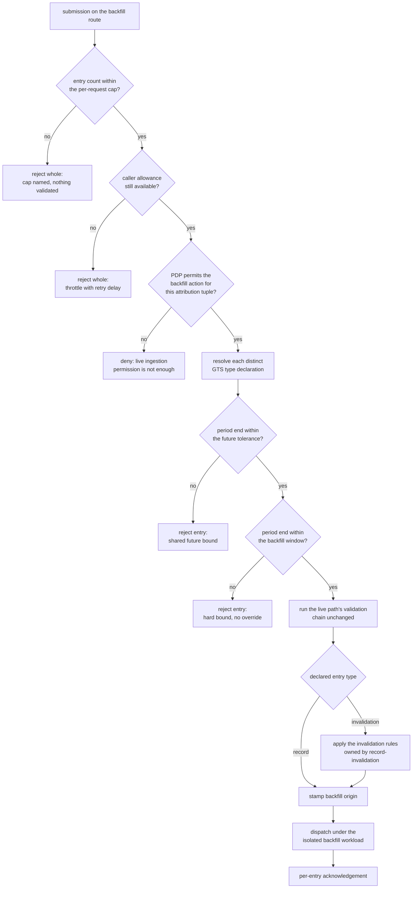
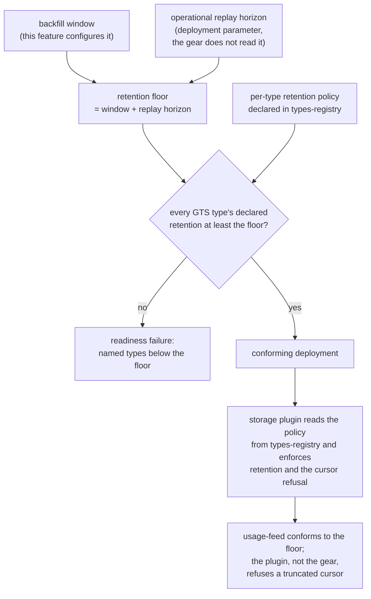

Created:  2026-09-25 by Virtuozzo International GmbH
Updated:  2026-09-25 by Virtuozzo International GmbH

# Feature: Backfill Import & Retention Governance

- [ ] `p2` - **ID**: `cpt-cf-usage-collector-featstatus-backfill-retention-implemented`

- [ ] `p2` - `cpt-cf-usage-collector-feature-backfill-retention`

Owns the dedicated historical-import route: its hard window bound, its own
permission, its isolation from live ingestion workload, and the origin marker it
stamps on every entry it admits. It also owns the retention floor that keeps the
configured window strictly inside what every meter retains.

<!-- toc -->

- [1. Feature Context](#1-feature-context)
  - [1.1 Overview](#11-overview)
  - [1.2 Purpose](#12-purpose)
  - [1.3 Actors](#13-actors)
  - [1.4 References](#14-references)
- [2. Actor Flows (CDSL)](#2-actor-flows-cdsl)
  - [Import Historical Usage Records](#import-historical-usage-records)
  - [Withdraw a Usage Record of a Closed Period](#withdraw-a-usage-record-of-a-closed-period)
  - [Escalate a Correction the Live Route Refuses](#escalate-a-correction-the-live-route-refuses)
  - [Widen the Backfill Window](#widen-the-backfill-window)
- [3. Processes / Business Logic (CDSL)](#3-processes--business-logic-cdsl)
  - [Admit a Backfill Submission](#admit-a-backfill-submission)
  - [Check the Backfill Window Bound](#check-the-backfill-window-bound)
  - [Validate a Backfilled Entry](#validate-a-backfilled-entry)
  - [Mark the Origin of an Admitted Entry](#mark-the-origin-of-an-admitted-entry)
  - [Isolate the Backfill Workload](#isolate-the-backfill-workload)
  - [Evaluate the Retention Floor](#evaluate-the-retention-floor)
- [4. States (CDSL)](#4-states-cdsl)
  - [Retention Floor Conformance State Machine](#retention-floor-conformance-state-machine)
- [5. Definitions of Done](#5-definitions-of-done)
  - [Dedicated Backfill Route on Both Surfaces](#dedicated-backfill-route-on-both-surfaces)
  - [Permission Distinct from Live Ingestion](#permission-distinct-from-live-ingestion)
  - [Hard Backfill Window Bound](#hard-backfill-window-bound)
  - [Validation Parity with the Live Path](#validation-parity-with-the-live-path)
  - [Invalidation Entries Admitted on the Route](#invalidation-entries-admitted-on-the-route)
  - [Origin Marker on Every Admitted Entry](#origin-marker-on-every-admitted-entry)
  - [Gear-Level Workload Isolation](#gear-level-workload-isolation)
  - [Retention Floor as a Sum of Two Terms](#retention-floor-as-a-sum-of-two-terms)
  - [Every Admissible Submission Inside Its Own Horizon](#every-admissible-submission-inside-its-own-horizon)
  - [Feed Conformance to the Floor](#feed-conformance-to-the-floor)
- [6. Acceptance Criteria](#6-acceptance-criteria)

<!-- /toc -->

## 1. Feature Context

### 1.1 Overview

This feature is the second of the two ingestion routes. A platform operator or a
migration job submits entries whose covered periods are older than the live path
accepts, and the Ingestion Gateway admits them under a different permission, a
different past bound, and a different workload budget. Everything else about the
submission is treated exactly as the live route treats it.

The feature owns the route, not a kind of entry. The route admits **Usage
Records** and invalidation entries alike, and every admission rule below applies
to both: the window bound, the permission, the workload isolation, and the
origin marker. The rules that make an invalidation entry an invalidation —
target resolution, faithful copy, reason code, and at most one withdrawal per
record — belong to `cpt-cf-usage-collector-feature-record-invalidation` and are
referenced here rather than restated. What this feature contributes to a
backfilled invalidation is the period bound it is checked against, because that
bound is a property of the path the entry travelled and not of the entry's kind.

The second half of the feature is governance rather than a code path. The
retention floor is the configured backfill window plus one operational replay
horizon. This feature owns the formula and the obligation to revalidate
retention whenever either term widens. It does not own the enforcement: the
gear reads neither the replay horizon nor any type's retention policy, and the
storage plugin reads the per-type policy directly from `types-registry`.

The owning component is `cpt-cf-usage-collector-component-ingestion-gateway`,
the same synchronous choke point the live route passes through.

### 1.2 Purpose

Two pressures make a separate route necessary. A meter onboarded late, or an
emitter that was down for longer than the live past tolerance, has real usage to
import for periods already closed. At the same time an unbounded retroactive
reach places an unbounded recomputation obligation on any materialised
aggregate, and a bulk import competes with live traffic for the same capacity.
A dedicated route bounds both without widening what the live path accepts.

The permission split is what protects billable history. Live emission is granted
widely, to every gear that meters something. Historical import is granted
narrowly, because a caller able to reach back ninety days can rewrite a tenant's
charged consumption. The origin marker serves the consumer side of the same
concern: a charging pipeline that has already raised a charge for a period needs
to tell imported history from current consumption, and the marker is what lets
it route a backfilled entry to batch catch-up instead.

The retention floor exists because the window and retention are otherwise free
to drift apart. Retention runs from the end of the covered period rather than
from the acceptance instant, so an entry imported at the far edge of a window
merely equal to retention is eligible for purge on arrival. Summing the window
with one replay horizon is what leaves every admitted entry a full replay
horizon from the moment it first becomes readable, and a full horizon of
deduplication with it.

**Requirements**: `cpt-cf-usage-collector-fr-backfill`,
`cpt-cf-usage-collector-fr-billing-retention-floor`

**Principles**: none of its own. This feature is governed by the principles
`cpt-cf-usage-collector-feature-usage-record-ingestion` and
`cpt-cf-usage-collector-feature-pluggable-storage` already carry — idempotency
by key, the canonical error envelope, and the pluggable-storage seam. It
introduces no principle, and it introduces no design constraint: the two
requirements above bind it entirely.

**Component**: `cpt-cf-usage-collector-component-ingestion-gateway`

**Sequences**: `cpt-cf-usage-collector-seq-backfill-import`. DESIGN owns that
sequence and fixes the call order across the gateway, the PDP and the Plugin
Host. This feature defines the behavior of the steps that belong to it and
restates no part of the sequence.

**Use cases**: `cpt-cf-usage-collector-usecase-backfill`

**API**:

- REST: `POST /usage-collector/v1/records/backfill`, operation
  `usage_collector.backfill_usage_records`. Batch only, under the same
  per-request entry cap the live route applies.
- SDK: `cpt-cf-usage-collector-interface-sdk-client`, the in-process backfill
  import. The route is on the trait because its gate is the permission rather
  than the absence of a surface, and because operator tooling may itself run
  in-process.

This feature adds no endpoint. The live route,
`POST /usage-collector/v1/records`, belongs to
`cpt-cf-usage-collector-feature-usage-record-ingestion`.

**ADRs**: `cpt-cf-usage-collector-adr-backfill-isolation`,
`cpt-cf-usage-collector-adr-mandatory-idempotency`

**Entities**: `RecordOrigin`, and the `CreateUsageRecord` input shape both
routes share.

**Data**: none. The gear declares no `db` or `dbtable` component identifier for
this feature. The entry ledger is wholly plugin-owned and reached only through
the Plugin SPI, and retention over it is a plugin deployment obligation rather
than a gear-owned table.

### 1.3 Actors

| Actor | Role in Feature |
|-------|-----------------|
| `cpt-cf-usage-collector-actor-platform-operator` | Holds the backfill permission, runs the import or the bulk withdrawal, configures the window, and revalidates retention against the floor before a wider window takes effect. |
| `cpt-cf-usage-collector-actor-platform-developer` | Builds the migration job or operator tool against the REST route or the SDK trait, and reads the per-entry acknowledgements it returns. |
| `cpt-cf-usage-collector-actor-usage-source` | Cannot reach this route: emitting usage carries the live permission alone. A source whose data has aged past the live past tolerance escalates to an operator, following the route the live rejection names. |
| `cpt-cf-usage-collector-actor-types-registry` | Serves the GTS type declaration that backfill validation resolves for unit binding and metadata validation, and holds the per-type retention policy the storage plugin reads. |
| `cpt-cf-usage-collector-actor-storage-backend` | Persists imported entries under the route's isolation, retains every GTS type to at least the floor, and enforces the feed's cursor refusal from what it still holds. |
| `cpt-cf-usage-collector-actor-usage-consumer` | Reads the origin marker on every read path and treats a backfilled entry as batch catch-up rather than current consumption. Depends on the floor for the replay window it codes against. |
| `cpt-cf-usage-collector-actor-tenant-admin` | Sees the origin marker on the tenant's own raw and aggregated reads, and holds no permission that reaches this route. |

### 1.4 References

- **PRD**: [PRD.md](../PRD.md) — §5.9 the dedicated backfill requirement and
  the retention floor; §5.6 the path-owned period bounds an invalidation is
  checked against; §5.5 aggregate stability past the backfill horizon; §7 the
  backfill use case.
- **Design**: [DESIGN.md](../DESIGN.md) — §1.2 the functional drivers for
  backfill and the retention floor, including the per-type policy the plugin
  reads from `types-registry`; §3.1 the `RecordOrigin` marker and the
  idempotency horizon; §3.2 the Ingestion Gateway and the two ingestion actions;
  §3.3 the SDK trait, the endpoint table and the two-route note; §3.6 the
  backfill-import sequence; §3.8 the configuration values and the replay horizon
  the gear does not read; §3.11 workload isolation and the per-origin
  instruments.
- **ADRs**:
  [0012](../ADR/0012-cpt-cf-usage-collector-adr-backfill-isolation.md),
  [0004](../ADR/0004-cpt-cf-usage-collector-adr-mandatory-idempotency.md)
- **Dependencies**: `cpt-cf-usage-collector-feature-usage-record-ingestion`,
  `cpt-cf-usage-collector-feature-usage-type-resolution`,
  `cpt-cf-usage-collector-feature-attribution-authorization`, and
  `cpt-cf-usage-collector-feature-pluggable-storage`. This feature is in turn
  consumed by `cpt-cf-usage-collector-feature-usage-feed`, whose cursor-refusal
  behavior must conform to the retention floor, and by
  `cpt-cf-usage-collector-feature-record-invalidation`, which owns the
  invalidation variant this route admits.

## 2. Actor Flows (CDSL)

Every flow below enters through the backfill route. The authorization step, the
type-resolution step and the dispatch step appear as single steps, because the
features that own them define their behavior.

### Import Historical Usage Records

- [ ] `p2` - **ID**: `cpt-cf-usage-collector-flow-backfill-import`

**Actor**: `cpt-cf-usage-collector-actor-platform-operator`

**Success Scenarios**:
- A batch of entries whose covered periods end inside the configured window is
  validated, stamped with the backfill origin marker, persisted, and returned as
  per-entry acknowledgements in input order.
- An entry whose covered period ends exactly at the window bound is admitted,
  because the bound refuses only what lies past it.
- An entry whose covered period the live route would also have taken is admitted
  here as well, and its marker records the route it arrived on rather than its
  age.
- A re-run of an import the window still admits is deduplicated on the dedup
  identity, and the stored entry comes back with its original acceptance instant
  and its original marker.

**Error Scenarios**:
- The caller holds the live ingestion permission alone. The request is denied on
  both surfaces, whatever the age of the periods it carries.
- An entry's covered period ends further back than the configured window. It is
  rejected with an error naming the offending instant and the bound, and no
  surface accepts an override for it.
- An entry's covered period ends further ahead than the future tolerance. It is
  rejected on the same bound the live route applies, which this route does not
  replace.
- The submission is empty or carries more entries than the per-request cap. It
  is rejected whole, before any entry is validated.
- The caller's ingestion allowance is exhausted. The submission is rejected
  whole with a retry delay, because backfill draws the same allowance live
  emission draws.

**Steps**:
1. [ ] - `p2` - Platform operator submits a batch of historical entries on the backfill route, on REST or on the SDK trait - `inst-backfill-import-submit`
2. [ ] - `p2` - Gateway admits the submission through `cpt-cf-usage-collector-algo-backfill-request-admission` - `inst-backfill-import-admit`
3. [ ] - `p2` - **IF** the submission is empty, over the entry cap, over the caller's allowance, or unauthorized for the backfill action - `inst-backfill-import-reject-branch`
   1. [ ] - `p2` - **RETURN** a request-wide rejection, with no entry validated and none persisted - `inst-backfill-import-reject-return`
4. [ ] - `p2` - Gateway resolves each distinct GTS type reference through `cpt-cf-usage-collector-algo-resolve-declaration` - `inst-backfill-import-resolve`
5. [ ] - `p2` - **FOR EACH** entry of the submission, in input order - `inst-backfill-import-foreach`
   1. [ ] - `p2` - Run `cpt-cf-usage-collector-algo-backfill-entry-validation` over the entry against the resolved declaration - `inst-backfill-import-validate`
   2. [ ] - `p2` - **IF** validation rejects the entry - `inst-backfill-import-invalid`
      1. [ ] - `p2` - Record a per-entry validation outcome naming the offending field or bound, and continue with the next entry - `inst-backfill-import-invalid-outcome`
   3. [ ] - `p2` - Derive the dedup identity and the entry identifier through `cpt-cf-usage-collector-algo-entry-identity-derivation` - `inst-backfill-import-derive`
   4. [ ] - `p2` - Stamp the backfill origin marker through `cpt-cf-usage-collector-algo-backfill-origin-marking`, and the acceptance instant through `cpt-cf-usage-collector-algo-server-field-stamping` - `inst-backfill-import-stamp`
   5. [ ] - `p2` - Dispatch the entry through `cpt-cf-usage-collector-algo-plugin-dispatch`, under the isolation `cpt-cf-usage-collector-algo-backfill-workload-isolation` establishes - `inst-backfill-import-dispatch`
   6. [ ] - `p2` - Map the storage outcome to a per-entry acknowledgement through `cpt-cf-usage-collector-algo-idempotency-outcome` - `inst-backfill-import-outcome`
6. [ ] - `p2` - **RETURN** the per-entry acknowledgements in input order, each carrying either the persisted entry or its own error - `inst-backfill-import-return`

### Withdraw a Usage Record of a Closed Period

- [ ] `p2` - **ID**: `cpt-cf-usage-collector-flow-backfill-withdraw`

**Actor**: `cpt-cf-usage-collector-actor-platform-operator`

**Success Scenarios**:
- An invalidation entry copying a period older than the live past tolerance is
  admitted here, checked against the window, and persisted carrying the backfill
  origin marker.
- A bulk withdrawal following an emitter defect runs under this route's workload
  isolation, so the live path keeps its service-level objectives while it runs.
- The withdrawal appears on every read path carrying its marker, so a consumer
  can tell a correction of history from a correction of current consumption.

**Error Scenarios**:
- The invalidation copies a period that ends further back than the window. It is
  rejected on the bound, and the target can no longer be withdrawn at all,
  because no route admits the period a faithful copy would have to carry.
- The caller holds the live permission alone. The route denies the request, and
  the correction needs an operator escalation.
- The copy diverges from the target, carries no reason code, or names a target
  that is not yet converged. Each of those outcomes belongs to
  `cpt-cf-usage-collector-feature-record-invalidation`, which owns the
  invalidation semantics on this route.

**Steps**:
1. [ ] - `p2` - Platform operator submits an entry declaring the invalidation entry type on the backfill route - `inst-backfill-withdraw-submit`
2. [ ] - `p2` - Gateway admits the submission through `cpt-cf-usage-collector-algo-backfill-request-admission`, applying the backfill permission whatever the entry kind - `inst-backfill-withdraw-admit`
3. [ ] - `p2` - Gateway checks the copied covered period through `cpt-cf-usage-collector-algo-backfill-window-bound`, exactly as it checks a measurement's own period - `inst-backfill-withdraw-window`
4. [ ] - `p2` - **IF** the copied period ends further back than the window - `inst-backfill-withdraw-out-of-window`
   1. [ ] - `p2` - **RETURN** a rejection naming the instant and the bound, and the target stays withdrawable on no surface - `inst-backfill-withdraw-refused`
5. [ ] - `p2` - Gateway applies the invalidation rules owned by `cpt-cf-usage-collector-feature-record-invalidation` - `inst-backfill-withdraw-invalidation-rules`
6. [ ] - `p2` - Gateway stamps the backfill origin marker through `cpt-cf-usage-collector-algo-backfill-origin-marking` - `inst-backfill-withdraw-stamp`
7. [ ] - `p2` - **RETURN** the persisted invalidation entry, carrying its marker on every later read - `inst-backfill-withdraw-return`

### Escalate a Correction the Live Route Refuses

- [ ] `p2` - **ID**: `cpt-cf-usage-collector-flow-backfill-escalate`

**Actor**: `cpt-cf-usage-collector-actor-usage-source`

**Success Scenarios**:
- The live rejection names the backfill route, so the source learns where the
  submission belongs without reading the contract again.
- The source hands the submission to an operator, who replays it on the backfill
  route under the backfill permission.
- Data that is merely late, rather than historical, still succeeds on the live
  route, because the live past tolerance covers emitter outage and retry lag.

**Error Scenarios**:
- The source calls the backfill route itself. The request is denied, because the
  permission gates the route rather than the data's age.
- The gap the source found is older than the configured window. No route admits
  it, and the remedy is to widen the window before the import rather than to
  escalate after the fact.

**Steps**:
1. [ ] - `p2` - Usage source submits an entry whose covered period ends further back than the live past tolerance - `inst-backfill-escalate-submit`
2. [ ] - `p2` - Live route rejects it, naming the offending instant, the bound, and the backfill route - `inst-backfill-escalate-live-reject`
3. [ ] - `p2` - **IF** the source calls the backfill route under its own credentials - `inst-backfill-escalate-self-attempt`
   1. [ ] - `p2` - **RETURN** a denial, because the source holds the live ingestion permission alone - `inst-backfill-escalate-denied`
4. [ ] - `p2` - Usage source hands the submission to a platform operator holding the backfill permission - `inst-backfill-escalate-handoff`
5. [ ] - `p2` - Platform operator replays it through `cpt-cf-usage-collector-flow-backfill-import` - `inst-backfill-escalate-replay`
6. [ ] - `p2` - **RETURN** the accepted entry, marked as backfilled rather than live - `inst-backfill-escalate-return`

### Widen the Backfill Window

- [ ] `p2` - **ID**: `cpt-cf-usage-collector-flow-backfill-widen-window`

**Actor**: `cpt-cf-usage-collector-actor-platform-operator`

**Success Scenarios**:
- The operator computes the raised floor from the intended window and the
  deployment's replay horizon, raises every GTS type's retention policy to meet
  it, and only then puts the wider window into effect.
- Readiness review confirms the active storage plugin retains every declared GTS
  type to at least the raised floor, with no meter exempted.
- The wider window takes effect at gear restart, since the value is read once at
  initialization.

**Error Scenarios**:
- The window is widened before retention is raised. Entries imported at the far
  edge of the new window are purge-eligible on arrival, which the revalidation
  step exists to prevent.
- Startup refuses a configuration whose window is shorter than the live past
  tolerance, because the live rejection would otherwise name a route that
  refuses the same entry.
- A single GTS type is left below the raised floor. The deployment is
  non-conforming, because the floor admits no exemption.

**Steps**:
1. [ ] - `p2` - Platform operator states the intended window and reads the deployment's operational replay horizon from the active plugin's configuration - `inst-backfill-widen-inputs`
2. [ ] - `p2` - Operator computes the raised floor through `cpt-cf-usage-collector-algo-retention-floor-evaluation` - `inst-backfill-widen-compute`
3. [ ] - `p2` - Operator checks every declared GTS type's retention policy against the raised floor - `inst-backfill-widen-check`
4. [ ] - `p2` - **IF** any GTS type retains for less than the raised floor - `inst-backfill-widen-shortfall`
   1. [ ] - `p2` - Raise that type's declared retention policy in `types-registry` before the wider window takes effect - `inst-backfill-widen-raise`
5. [ ] - `p2` - Operator sets the wider window in the gear's deployment configuration and restarts the gear - `inst-backfill-widen-apply`
6. [ ] - `p2` - **RETURN** a deployment whose window and retention both satisfy the floor, recorded at storage-plugin readiness review - `inst-backfill-widen-return`

## 3. Processes / Business Logic (CDSL)

The backfill route reuses the live route's per-entry work almost entirely. Four
things differ, and only these four: the authorization action, the past bound,
the origin marker, and the workload the dispatch runs under. The ingestion quota
is deliberately not among them — both routes draw the same per-subject
allowance, and isolation rather than a separate budget is what keeps a bulk
import off the live path's capacity.

The diagram below states the admission path from the arriving submission to the
point where a per-entry outcome is produced.

### Admit a Backfill Submission

- [ ] `p2` - **ID**: `cpt-cf-usage-collector-algo-backfill-request-admission`

**Input**: one submission arriving on the backfill route, on REST or on the SDK
trait, plus the caller's security context.

**Output**: either a request-wide rejection, or a submission admitted to
per-entry processing under the backfill origin and the isolated workload.

**Steps**:
1. [ ] - `p2` - Reject an empty submission whole, and one carrying more entries than the configured per-request cap, naming the cap - `inst-backfill-admit-cap`
2. [ ] - `p2` - Apply the same cap the live route applies, so choosing this route widens nothing - `inst-backfill-admit-cap-parity`
3. [ ] - `p2` - Charge the caller's ingestion allowance from the same per-subject bucket live emission draws, which `cpt-cf-usage-collector-feature-rate-limiting-reconciliation` owns - `inst-backfill-admit-quota`
4. [ ] - `p2` - **IF** the allowance is exhausted - `inst-backfill-admit-throttled`
   1. [ ] - `p2` - **RETURN** a request-wide throttle outcome carrying a retry delay, with no entry accepted - `inst-backfill-admit-throttle-return`
5. [ ] - `p2` - Authorize each distinct attribution tuple through `cpt-cf-usage-collector-algo-pdp-scope-evaluation`, requesting the backfill action rather than the live create action - `inst-backfill-admit-authorize`
6. [ ] - `p2` - Select that action from the route the submission arrived on, never from an entry's covered period and never from its declared entry type - `inst-backfill-admit-action-source`
7. [ ] - `p2` - Check each entry's attribution tuple against the returned scope through `cpt-cf-usage-collector-algo-write-scope-admission` - `inst-backfill-admit-scope`
8. [ ] - `p2` - **IF** the PDP denies, or the tuple falls outside the returned scope - `inst-backfill-admit-denied`
   1. [ ] - `p2` - **RETURN** the deterministic denial `cpt-cf-usage-collector-algo-fail-closed-outcome-mapping` produces, with nothing persisted - `inst-backfill-admit-deny-return`
9. [ ] - `p2` - Mark the admitted submission as backfill-originated, so later steps read the route from the submission rather than re-deriving it - `inst-backfill-admit-mark`
10. [ ] - `p2` - **RETURN** the admitted submission, with per-entry processing to follow in input order - `inst-backfill-admit-return`

### Check the Backfill Window Bound

- [ ] `p2` - **ID**: `cpt-cf-usage-collector-algo-backfill-window-bound`

**Input**: one entry's normalized covered period, the configured backfill
window, and the configured future tolerance both routes share.

**Output**: either admission of the period, or a rejection naming the offending
instant and the bound it breached.

**Steps**:
1. [ ] - `p2` - Read the end of the covered period, and read neither its start nor its length - `inst-backfill-window-read-end`
2. [ ] - `p2` - Apply the shared future tolerance unchanged, rejecting a period ending further ahead than it - `inst-backfill-window-future`
3. [ ] - `p2` - Replace the live past tolerance with the configured backfill window, and apply no other change to period validation - `inst-backfill-window-replace-past`
4. [ ] - `p2` - **IF** the period ends further back than the window - `inst-backfill-window-too-old`
   1. [ ] - `p2` - **RETURN** a validation rejection naming the offending instant and the configured window - `inst-backfill-window-reject`
5. [ ] - `p2` - Admit a period ending exactly at the window, since the bound refuses only what lies past it - `inst-backfill-window-boundary`
6. [ ] - `p2` - Admit a period the live route would also have taken, because the window is a ceiling on age rather than a floor - `inst-backfill-window-overlap`
7. [ ] - `p2` - Accept no override of the bound on either surface, and read no caller-supplied field that could relax it - `inst-backfill-window-hard`
8. [ ] - `p2` - Apply every step above to an invalidation entry over the period it copies, exactly as to a measurement - `inst-backfill-window-both-kinds`
9. [ ] - `p2` - **RETURN** the admitted period, with the remaining validation unchanged - `inst-backfill-window-return`

### Validate a Backfilled Entry

- [ ] `p2` - **ID**: `cpt-cf-usage-collector-algo-backfill-entry-validation`

**Input**: one entry arriving on the backfill route and the resolved declaration
of its GTS type.

**Output**: either a per-entry validation rejection, or an entry cleared for
identity derivation and dispatch.

**Steps**:
1. [ ] - `p2` - Run `cpt-cf-usage-collector-algo-entry-structural-validation` over the entry, unchanged from the live route - `inst-backfill-validate-structural`
2. [ ] - `p2` - Run `cpt-cf-usage-collector-algo-covered-period-validation` for well-formedness, ordering and time-zone normalization - `inst-backfill-validate-period`
3. [ ] - `p2` - Substitute `cpt-cf-usage-collector-algo-backfill-window-bound` for that algorithm's live past tolerance, and for nothing else - `inst-backfill-validate-window`
4. [ ] - `p2` - Run `cpt-cf-usage-collector-algo-quantity-validation` against the published range and precision, unchanged - `inst-backfill-validate-quantity`
5. [ ] - `p2` - Run `cpt-cf-usage-collector-algo-metadata-validation` against the declaration's closed surface and the configured size cap, unchanged - `inst-backfill-validate-metadata`
6. [ ] - `p2` - Reject an entry whose resolved declaration binds no metering unit, through `cpt-cf-usage-collector-algo-meter-admissibility` - `inst-backfill-validate-unit`
7. [ ] - `p2` - **IF** the entry declares the invalidation entry type - `inst-backfill-validate-invalidation`
   1. [ ] - `p2` - Apply the target resolution, faithful-copy, reason-code and at-most-one rules owned by `cpt-cf-usage-collector-feature-record-invalidation`, adding none of its own - `inst-backfill-validate-invalidation-rules`
8. [ ] - `p2` - **RETURN** the cleared entry, or the first rejection encountered, in either case for this entry alone - `inst-backfill-validate-return`

### Mark the Origin of an Admitted Entry

- [ ] `p2` - **ID**: `cpt-cf-usage-collector-algo-backfill-origin-marking`

**Input**: one admitted entry and the route its submission arrived on.

**Output**: the entry carrying a closed origin marker, ready for dispatch.

**Steps**:
1. [ ] - `p2` - Set the origin marker to the backfill value for every entry the route admits - `inst-backfill-origin-set`
2. [ ] - `p2` - Read the route and never the age of the covered period, so an entry the live route would have taken is still marked as backfilled here - `inst-backfill-origin-source`
3. [ ] - `p2` - Apply the marker to an invalidation entry exactly as to a measurement - `inst-backfill-origin-both-kinds`
4. [ ] - `p2` - Reject or ignore any caller-supplied origin value, so the marker is never caller-controlled - `inst-backfill-origin-server-owned`
5. [ ] - `p2` - **IF** the storage outcome absorbs the entry as a repeat of a converged one - `inst-backfill-origin-absorbed`
   1. [ ] - `p2` - Return the stored entry's original marker, and overwrite nothing - `inst-backfill-origin-keep-stored`
6. [ ] - `p2` - Persist the marker with the entry and surface it on every read path, raw query, point lookup and feed alike - `inst-backfill-origin-readable`
7. [ ] - `p2` - **RETURN** the marked entry - `inst-backfill-origin-return`

### Isolate the Backfill Workload

- [ ] `p2` - **ID**: `cpt-cf-usage-collector-algo-backfill-workload-isolation`

**Input**: an admitted backfill submission ready for dispatch, and the live
path's published latency and throughput objectives.

**Output**: dispatch of the submission under a workload budget separate from
live ingestion.

**Steps**:
1. [ ] - `p2` - Dispatch backfill entries through a concurrency and scheduling budget held apart from the live route's - `inst-backfill-isolate-budget`
2. [ ] - `p2` - Keep that separation at the gear, since it is this feature's obligation rather than the plugin-facing workload-isolation objective - `inst-backfill-isolate-gear-level`
3. [ ] - `p2` - Leave backend connection-pool separation to the active plugin's deployment profile, which `cpt-cf-usage-collector-feature-pluggable-storage` owns - `inst-backfill-isolate-plugin-pools`
4. [ ] - `p2` - Share the per-subject ingestion allowance with live emission, isolating workload rather than budget - `inst-backfill-isolate-shared-quota`
5. [ ] - `p2` - Label the ingestion counter and the duration histogram by origin, so the two routes are separable in the instruments `cpt-cf-usage-collector-dod-ingestion-telemetry` defines - `inst-backfill-isolate-telemetry`
6. [ ] - `p2` - **RETURN** the dispatched submission, with live-path latency held inside its published envelope while the import runs - `inst-backfill-isolate-return`

### Evaluate the Retention Floor

- [ ] `p2` - **ID**: `cpt-cf-usage-collector-algo-retention-floor-evaluation`

**Input**: the configured backfill window, the deployment's operational replay
horizon, and the retention policy declared for each GTS type.

**Output**: a conforming deployment, or a named readiness failure listing every
GTS type below the floor.

This evaluation runs at operator onboarding and at storage-plugin readiness
review. It is not a gear-side sweep: the gear reads neither the replay horizon
nor any type's retention policy at runtime.

**Steps**:
1. [ ] - `p2` - Sum the configured backfill window and the operational replay horizon to obtain the floor - `inst-retention-floor-sum`
2. [ ] - `p2` - Sum the two terms rather than taking the larger, because retention runs from the end of the covered period rather than from the acceptance instant - `inst-retention-floor-why-sum`
3. [ ] - `p2` - **FOR EACH** declared GTS type - `inst-retention-floor-foreach`
   1. [ ] - `p2` - Compare the retention policy the type declares against the floor - `inst-retention-floor-compare`
   2. [ ] - `p2` - **IF** the declared retention is below the floor - `inst-retention-floor-short`
      1. [ ] - `p2` - Record a readiness failure naming that type, exempting no meter on the grounds that no charging consumer reads it - `inst-retention-floor-fail`
4. [ ] - `p2` - Recompute the floor whenever either term widens, and revalidate every type against the new value before the wider window takes effect - `inst-retention-floor-revalidate`
5. [ ] - `p2` - Leave enforcement of retention, archival and purging to the active storage plugin, which reads each type's policy from `types-registry` directly - `inst-retention-floor-plugin-enforced`
6. [ ] - `p2` - Leave the feed's cursor refusal to the same plugin, which reads what it still holds rather than a cursor's age - `inst-retention-floor-feed-refusal`
7. [ ] - `p2` - **RETURN** the conformance result, as a readiness condition rather than a runtime outcome - `inst-retention-floor-return`

## 4. States (CDSL)

### Retention Floor Conformance State Machine

- [ ] `p2` - **ID**: `cpt-cf-usage-collector-state-retention-floor-conformance`

This machine describes a deployment's conformance to the retention floor across
a change to the backfill window. It is an operator and readiness-review
lifecycle rather than a gear-enforced one: the gear holds no conformance state
and performs no sweep.

**States**: Conforming, FloorRaised, Remediating, Nonconforming

**Initial State**: Conforming

**Transitions**:
1. [ ] - `p2` - **FROM** Conforming **TO** FloorRaised **WHEN** an operator intends to widen the backfill window, or the deployment widens the operational replay horizon - `inst-floor-state-raise`
2. [ ] - `p2` - **FROM** FloorRaised **TO** Remediating **WHEN** revalidation finds at least one GTS type retaining for less than the recomputed floor - `inst-floor-state-remediate`
3. [ ] - `p2` - **FROM** FloorRaised **TO** Conforming **WHEN** every declared GTS type already retains for at least the recomputed floor, and the wider window may take effect - `inst-floor-state-already-clear`
4. [ ] - `p2` - **FROM** Remediating **TO** Conforming **WHEN** every short type's declared retention has been raised to meet the floor, and only then is the wider window applied - `inst-floor-state-raised-clear`
5. [ ] - `p2` - **FROM** Remediating **TO** Nonconforming **WHEN** the wider window is put into effect while any type remains below the floor - `inst-floor-state-premature`
6. [ ] - `p2` - **FROM** Nonconforming **TO** Conforming **WHEN** retention is raised to the floor for every type, or the window is narrowed back to a value the existing retention satisfies - `inst-floor-state-recover`

## 5. Definitions of Done

### Dedicated Backfill Route on Both Surfaces

- [ ] `p2` - **ID**: `cpt-cf-usage-collector-dod-backfill-route`

The system **MUST** expose historical import as a route distinct from live
ingestion, on REST and on the in-process SDK trait alike. Both surfaces **MUST**
accept **Usage Records** and invalidation entries in the same submission,
discriminated only by each entry's declared entry type. The route **MUST** apply
the same per-request entry cap the live route applies, and **MUST** return the
same per-entry acknowledgement model in input order. The system **MUST NOT**
add any endpoint beyond the one the design contract defines, and **MUST NOT**
offer a correction-specific route on either surface.

**Implements**:
- `cpt-cf-usage-collector-flow-backfill-import`
- `cpt-cf-usage-collector-algo-backfill-request-admission`

**Touches**:
- API: `POST /usage-collector/v1/records/backfill`
- Interface: `cpt-cf-usage-collector-interface-sdk-client`
- Component: `cpt-cf-usage-collector-component-ingestion-gateway`
- Entities: `CreateUsageRecord`, `RecordOrigin`

### Permission Distinct from Live Ingestion

- [ ] `p2` - **ID**: `cpt-cf-usage-collector-dod-backfill-permission`

The system **MUST** authorize the backfill route with an action distinct from
the one live ingestion uses, grantable independently of it. It **MUST** require
that action on every surface carrying the route, for every entry the route
admits, whatever the entry's declared kind and whatever the age of the period it
carries. The system **MUST** select the action from the route the submission
arrived on, and **MUST NOT** derive it from an entry's covered period or entry
type. A caller holding only the live ingestion permission **MUST** be denied on
this route, and the denial **MUST** be fail-closed.

**Implements**:
- `cpt-cf-usage-collector-algo-backfill-request-admission`
- `cpt-cf-usage-collector-flow-backfill-escalate`

**Touches**:
- API: `POST /usage-collector/v1/records/backfill`
- Interface: `cpt-cf-usage-collector-interface-sdk-client`
- Contract: `cpt-cf-usage-collector-contract-authz-resolver`

### Hard Backfill Window Bound

- [ ] `p2` - **ID**: `cpt-cf-usage-collector-dod-backfill-window-bound`

The system **MUST** bound how far back a covered period may end on this route,
using a configurable window, and **MUST** enforce that window as a hard bound
before persistence. It **MUST** reject a period ending further back than the
window with an actionable error naming the offending instant and the bound, and
**MUST** admit a period ending exactly at the window. It **MUST** read the end
of the covered period and neither its start nor its length. It **MUST** keep the
future tolerance the live route applies, replacing the live past tolerance
alone. The system **MUST NOT** expose any override reaching past the window, on
either surface, and **MUST NOT** accept a caller-supplied field that relaxes it.
Startup configuration validation of the window against the live past tolerance
belongs to `cpt-cf-usage-collector-dod-live-time-bounds`.

**Implements**:
- `cpt-cf-usage-collector-algo-backfill-window-bound`
- `cpt-cf-usage-collector-flow-backfill-import`

**Touches**:
- API: `POST /usage-collector/v1/records/backfill`
- Component: `cpt-cf-usage-collector-component-ingestion-gateway`

### Validation Parity with the Live Path

- [ ] `p2` - **ID**: `cpt-cf-usage-collector-dod-backfill-validation-parity`

The system **MUST** apply the live route's validation to every entry this route
admits, with exactly one substitution: the backfill window in place of the live
past tolerance. Structural validation, covered-period well-formedness and
normalization, quantity range and precision, closed-shape metadata validation
against the resolved declaration, the metadata size cap, the metering-unit
requirement, identity derivation and the idempotency outcome model **MUST** all
behave identically on both routes. The system **MUST** resolve each entry's GTS
type reference to its declaration before validating unit binding and metadata,
through `cpt-cf-usage-collector-feature-usage-type-resolution`. It **MUST NOT**
introduce a backfill-only validation rule beyond the window bound.

**Implements**:
- `cpt-cf-usage-collector-algo-backfill-entry-validation`

**Constraints**: `cpt-cf-usage-collector-constraint-no-business-logic`

**Touches**:
- API: `POST /usage-collector/v1/records/backfill`
- Component: `cpt-cf-usage-collector-component-ingestion-gateway`
- Entities: `CreateUsageRecord`

### Invalidation Entries Admitted on the Route

- [ ] `p2` - **ID**: `cpt-cf-usage-collector-dod-backfill-invalidation-admission`

The system **MUST** admit an invalidation entry on this route on the same terms
it admits a **Usage Record**: the backfill permission, the window bound over the
period the entry copies, the origin marker, and the isolated workload. It
**MUST** treat the covered-period bounds as a property of the route rather than
of the entry kind, so an invalidation gains no wider retroactive reach than a
measurement. It **MUST** refuse a withdrawal whose copied period ends further
back than the window, leaving such a target withdrawable on no surface. The
invalidation semantics themselves — target resolution, faithful copy, mandatory
reason code, and at most one withdrawal per record — **MUST** be those
`cpt-cf-usage-collector-feature-record-invalidation` defines, and this feature
**MUST NOT** vary them.

**Implements**:
- `cpt-cf-usage-collector-flow-backfill-withdraw`
- `cpt-cf-usage-collector-algo-backfill-window-bound`

**Touches**:
- API: `POST /usage-collector/v1/records/backfill`
- Component: `cpt-cf-usage-collector-component-ingestion-gateway`
- Entities: `RecordOrigin`

### Origin Marker on Every Admitted Entry

- [ ] `p2` - **ID**: `cpt-cf-usage-collector-dod-backfill-origin-marker`

The system **MUST** stamp a closed origin marker on every entry this route
admits, recording the route the entry arrived on rather than the age of its
covered period. The marker **MUST** be server-assigned, never caller-supplied,
and **MUST** be persisted with the entry and returned on every read path that
exposes the entry. An absorbed retry **MUST** return the stored entry's original
marker rather than the marker of the route the retry travelled. The system
**MUST** apply the marker to invalidation entries as it does to **Usage
Records**, so a correction of history is distinguishable from a correction of
current consumption.

**Implements**:
- `cpt-cf-usage-collector-algo-backfill-origin-marking`

**Touches**:
- API: `POST /usage-collector/v1/records/backfill`
- Component: `cpt-cf-usage-collector-component-ingestion-gateway`
- Entities: `RecordOrigin`

### Gear-Level Workload Isolation

- [ ] `p2` - **ID**: `cpt-cf-usage-collector-dod-backfill-workload-isolation`

The system **MUST** run backfill dispatch under a workload budget held separate
from live ingestion at the gear, so a bulk import does not push live-path
latency or throughput outside their published envelope. That separation
**MUST** be a gear obligation rather than a plugin-facing one; backend pool
separation stays the active plugin's deployment obligation. The system **MUST**
charge both routes against one per-subject ingestion allowance, isolating
workload rather than budget. The per-origin labelling that makes the two routes
separable in telemetry is defined by
`cpt-cf-usage-collector-dod-ingestion-telemetry`.

**Implements**:
- `cpt-cf-usage-collector-algo-backfill-workload-isolation`

**Touches**:
- API: `POST /usage-collector/v1/records/backfill`
- Component: `cpt-cf-usage-collector-component-ingestion-gateway`

### Retention Floor as a Sum of Two Terms

- [ ] `p2` - **ID**: `cpt-cf-usage-collector-dod-retention-floor-formula`

The system's deployment contract **MUST** state the retention floor as the
configured backfill window plus one operational replay horizon, and **MUST**
require every declared GTS type to retain for at least that floor. The floor
**MUST** be a sum rather than the larger of the two terms, because retention
runs from the end of the covered period rather than from the acceptance instant.
It **MUST** admit no exemption, since no declared attribute records whether a
charging consumer reads a meter. The deployment **MUST** recompute the floor
whenever either term widens and **MUST** revalidate every type's retention
against the new value before the wider window takes effect. Conformance
**MUST** be surfaced as an operator-onboarding and storage-plugin readiness
condition; the gear **MUST NOT** read the replay horizon or any type's retention
policy, and **MUST NOT** run a retention sweep of its own.

**Implements**:
- `cpt-cf-usage-collector-algo-retention-floor-evaluation`
- `cpt-cf-usage-collector-flow-backfill-widen-window`
- `cpt-cf-usage-collector-state-retention-floor-conformance`

**Touches**:
- Component: `cpt-cf-usage-collector-component-ingestion-gateway`
- Contract: `cpt-cf-usage-collector-contract-storage-plugin`

### Every Admissible Submission Inside Its Own Horizon

- [ ] `p2` - **ID**: `cpt-cf-usage-collector-dod-retention-horizon-containment`

The system **MUST** hold the backfill window strictly inside the retention every
meter guarantees, so that no submission it admits falls outside its own
idempotency horizon. It **MUST** refuse a covered period older than the window
on the bound, before deduplication is consulted, so a re-run of an import either
lands and is deduplicated or is refused, and never lands as a silent duplicate
under an already-purged identity. The contract **MUST** state that an imported
entry arrives with its horizon already partly spent, retaining one full replay
horizon at the far edge of the window rather than the whole floor.

**Implements**:
- `cpt-cf-usage-collector-algo-backfill-window-bound`
- `cpt-cf-usage-collector-algo-retention-floor-evaluation`

**Touches**:
- API: `POST /usage-collector/v1/records/backfill`
- Component: `cpt-cf-usage-collector-component-ingestion-gateway`

### Feed Conformance to the Floor

- [ ] `p2` - **ID**: `cpt-cf-usage-collector-dod-retention-feed-conformance`

The deployment **MUST** satisfy the retention floor for every GTS type a feed
subscription can name, so that a cursor no older than the operational replay
horizon is servable. The active storage plugin, not the gear, **MUST** enforce
both retention and the cursor refusal, reading what it still holds rather than a
cursor's age. The feed's servable-cursor and refusal behavior at the retention
boundary is defined by `cpt-cf-usage-collector-feature-usage-feed`, which
depends on this feature for the window term of the floor; this feature **MUST
NOT** restate that behavior. A deployment that widens the window without raising
retention **MUST** be treated as a readiness failure for the feed as well as for
ingestion.

**Implements**:
- `cpt-cf-usage-collector-algo-retention-floor-evaluation`
- `cpt-cf-usage-collector-state-retention-floor-conformance`

**Touches**:
- Component: `cpt-cf-usage-collector-component-ingestion-gateway`
- Contract: `cpt-cf-usage-collector-contract-storage-plugin`

## 6. Acceptance Criteria

- [ ] A batch of entries whose covered periods end inside the configured window is accepted on the backfill route, on REST and on the SDK trait alike, and each accepted entry comes back carrying the backfill origin marker.
- [ ] An entry whose covered period ends exactly at the window is admitted, and one ending a single instant further back is rejected with an error naming the instant and the bound.
- [ ] The backfill route rejects a covered period ending beyond the future tolerance, which it shares unchanged with the live route.
- [ ] A covered period the live route would also have accepted is admitted on the backfill route and stamped as backfilled, confirming the marker records the route rather than the age.
- [ ] The backfill route refuses a caller holding only the live ingestion permission, on REST and on the SDK trait, and the refusal is fail-closed.
- [ ] The backfill route admits a caller holding the backfill permission, and that permission is grantable without granting live ingestion.
- [ ] A caller holding the backfill permission alone is refused on the live ingestion route, confirming the two actions are independent in both directions.
- [ ] No override reaching past the window is accepted on either surface, verified by a request that attempts to supply one and is rejected on the bound.
- [ ] An invalidation entry copying a period older than the live past tolerance is rejected on the live route with an error naming the backfill route, and accepted on the backfill route carrying the backfill marker.
- [ ] An invalidation entry whose copied period ends beyond the window is rejected on the bound, and no surface admits a withdrawal of that target.
- [ ] A submission mixing **Usage Records** and invalidation entries is accepted on one backfill call, with per-entry acknowledgements in input order.
- [ ] A backfilled invalidation whose copy diverges from its target is rejected by the invalidation rules, confirming this route varies none of them.
- [ ] An entry rejected on the backfill route for a bad quantity, an undeclared metadata key, oversized metadata, a missing idempotency key or a missing entry type draws the same error the live route produces for the same input.
- [ ] An entry whose GTS type binds no metering unit is rejected on the backfill route exactly as on the live route.
- [ ] An imported entry carries its origin marker on raw query, point lookup and the feed, and the marker is present as persisted.
- [ ] A caller-supplied origin value on the wire is ignored or rejected and never reaches a persisted entry.
- [ ] Re-running an identical import while the window still admits it is deduplicated, returns the stored entry, and returns the original acceptance instant and marker rather than a fresh pair.
- [ ] Re-running that import once the window no longer admits it is refused on the bound rather than resolved by deduplication, so no re-run creates a second entry under the same derived identifier.
- [ ] An empty backfill submission and one over the per-request entry cap are each rejected whole, with no entry validated and none persisted.
- [ ] A maximal backfill batch draws the same per-subject ingestion allowance a maximal live batch draws, and exhausting that allowance on one route throttles the other.
- [ ] A concurrent load test running a bulk import against sustained live ingestion keeps live-path latency and throughput inside the published envelope.
- [ ] The ingestion counter and the ingestion duration histogram separate the two routes by their origin label during that concurrent test.
- [ ] Computing the floor from the configured window and the deployment's replay horizon yields the sum of the two terms, and a deployment whose retention equals the window alone is reported as a readiness failure.
- [ ] Readiness review reports every GTS type retaining for less than the floor, exempting no meter on the grounds that no charging consumer reads it.
- [ ] Widening the window without first raising retention is caught at readiness review as a non-conforming deployment, naming the types that fall short.
- [ ] Narrowing the window back to a value the existing retention satisfies returns the deployment to conformance without any change to retention.
- [ ] The gear performs no retention sweep and reads neither the replay horizon nor any type's retention policy at runtime, verified by the absence of any such read on the ingestion path.
- [ ] A cursor no older than the operational replay horizon is servable against a deployment that meets the floor, with the refusal decision taken by the storage plugin rather than by the gear.
