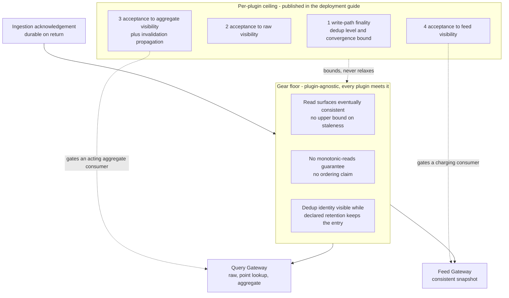

Created:  2026-09-25 by Virtuozzo International GmbH
Updated:  2026-09-25 by Virtuozzo International GmbH

# Feature: Read-Path Consistency & Freshness Contract

- [ ] `p1` - **ID**: `cpt-cf-usage-collector-featstatus-consistency-freshness-contract-implemented`

- [ ] `p1` - `cpt-cf-usage-collector-feature-consistency-freshness-contract`

Publishes the one plugin-agnostic staleness contract between the synchronous
ingestion acknowledgement and the raw, aggregated, point-lookup, and feed read
surfaces: a gear floor every bound plugin honours under default deployment, and
a four-dimension ceiling each plugin must publish for itself.

<!-- toc -->

- [1. Feature Context](#1-feature-context)
  - [1.1 Overview](#11-overview)
  - [1.2 Purpose](#12-purpose)
  - [1.3 Actors](#13-actors)
  - [1.4 References](#14-references)
- [2. Actor Flows (CDSL)](#2-actor-flows-cdsl)
- [3. Processes / Business Logic (CDSL)](#3-processes--business-logic-cdsl)
  - [Choose the Surface a Read-After-Write Flow Consumes](#choose-the-surface-a-read-after-write-flow-consumes)
  - [Qualify a Published Plugin Consistency Profile](#qualify-a-published-plugin-consistency-profile)
  - [Gate an Aggregate Consumer on Published Freshness](#gate-an-aggregate-consumer-on-published-freshness)
  - [Read Defensively Under Unbounded Staleness](#read-defensively-under-unbounded-staleness)
- [4. States (CDSL)](#4-states-cdsl)
- [5. Definitions of Done](#5-definitions-of-done)
  - [The Consistency Floor Is Published Once, in One Place](#the-consistency-floor-is-published-once-in-one-place)
  - [No Read Surface Claims More Than the Floor](#no-read-surface-claims-more-than-the-floor)
  - [Every Bound Plugin Publishes a Four-Dimension Consistency Profile](#every-bound-plugin-publishes-a-four-dimension-consistency-profile)
  - [Aggregate Freshness Is a Readiness Gate, Not a Gear Bound](#aggregate-freshness-is-a-readiness-gate-not-a-gear-bound)
  - [Read-After-Write Flows Consume the Acknowledgement](#read-after-write-flows-consume-the-acknowledgement)
  - [Dedup-Identity Visibility Is Bounded by Declared Retention](#dedup-identity-visibility-is-bounded-by-declared-retention)
  - [A Consumer Coupled to a Ceiling Records the Coupling](#a-consumer-coupled-to-a-ceiling-records-the-coupling)
- [6. Acceptance Criteria](#6-acceptance-criteria)

<!-- /toc -->

## 1. Feature Context

### 1.1 Overview

A contract rather than a code path. It states how far behind an ingestion
acknowledgement a later read may legitimately be, and it states that in two
layers. The **floor** is the weakest guarantee every storage plugin meets under
its default deployment posture, and it is what a consumer may code against
without reading any plugin document. The **ceiling** is the stronger, numeric
profile a particular plugin actually achieves, published in that plugin's
deployment guide rather than promised by the gear.

*Staleness* here means the delay between an entry being acknowledged and that
same entry becoming visible on a read surface. The contract bounds nothing else.
It is not a durability guarantee, which the acknowledgement itself carries, and
it is not an ordering guarantee: the floor makes no claim about the sequence in
which two entries become visible.

This feature owns no component, no endpoint, and no sequence of its own. The
obligations it states are asserted inside surfaces that
`cpt-cf-usage-collector-feature-usage-query`,
`cpt-cf-usage-collector-feature-usage-feed`, and
`cpt-cf-usage-collector-feature-pluggable-storage` already own. Each Definition
of Done below therefore names the feature whose surface carries it.

### 1.2 Purpose

The gear routes writes and reads through separate Plugin SPI (storage-plugin
service provider interface) methods, so a plugin may place them on isolated
backend pools (`cpt-cf-usage-collector-nfr-workload-isolation`). That isolation
is the structural source of queryability lag. Acknowledgement latency and
queryability are two different mechanisms with two different bounds, and one
combined freshness figure would describe neither.

Two failure modes are being prevented. The first is the silent read-after-write
assumption: a calling gear emits an entry, immediately queries it back for an
admission decision, and works in test against a single-node backend before
failing in production against a replicated one. The second is the unstated
ceiling: an operator swaps the bound plugin, staleness quietly grows from
seconds to minutes, and no consumer finds out until a charge is wrong.

Naming the floor once, requiring a published ceiling per plugin, and directing
same-request outcomes onto the acknowledgement closes both. The decision itself
is recorded in `cpt-cf-usage-collector-adr-consistency-contract` and elaborated
in `cpt-cf-usage-collector-design-consistency-contract`; this feature carries
neither the decision nor a new number, only the obligations that make them
checkable.

**Requirements**: `cpt-cf-usage-collector-nfr-query-freshness`,
`cpt-cf-usage-collector-nfr-aggregate-freshness`

**No Design Component of its own.** The DECOMPOSITION entry declares no
component, no API, no sequence, and no gear-owned data. The contract binds every
component's read and write paths at once instead of living inside one, so the
obligation lands on the read surfaces:
`cpt-cf-usage-collector-component-query-gateway` for the raw, point-lookup, and
aggregate paths, `cpt-cf-usage-collector-component-feed-gateway` for the feed,
and `cpt-cf-usage-collector-component-plugin-host` for the seam behind which the
bound plugin's actual profile lives.

**Scope boundary.** Three neighbouring concerns are deliberately not here. The
numeric performance envelope — ingestion throughput, ingestion latency, query
latency, availability — belongs to
`cpt-cf-usage-collector-feature-throughput-latency-availability`; this contract
says how current an answer is, never how fast it arrives. The feed's
recovery-time and bulk-read-rate objectives belong to
`cpt-cf-usage-collector-feature-usage-feed`
(`cpt-cf-usage-collector-nfr-replay-throughput`). The retention floor, `backfill
window + operational replay horizon`, belongs to
`cpt-cf-usage-collector-feature-backfill-retention`
(`cpt-cf-usage-collector-fr-billing-retention-floor`). Retention governs how far
back a surface can still reach; staleness governs how far behind its leading
edge sits. The two are separate bounds and this document conflates neither.

**Type declarations sit outside the floor.** They are resolved from
`types-registry` through the Type Resolver cache, so their propagation delay is
a property of that resolution path rather than of any storage plugin
(`cpt-cf-usage-collector-adr-registry-owned-typing`).
`cpt-cf-usage-collector-feature-usage-type-resolution` owns it.

### 1.3 Actors

| Actor | Role in Feature |
|-------|-----------------|
| `cpt-cf-usage-collector-actor-platform-developer` | Codes a calling gear against the floor; takes any same-request outcome from the ingestion acknowledgement rather than from a query surface |
| `cpt-cf-usage-collector-actor-usage-source` | Receives the acknowledgement, which is the only surface the floor binds for write-derived state |
| `cpt-cf-usage-collector-actor-usage-consumer` | Reads under indeterminate lag; defends against an entry observed once and missing from a later page; reads the feed where it must miss no entry |
| `cpt-cf-usage-collector-actor-platform-operator` | Selects the plugin whose published ceiling the deployment inherits; checks the qualifying ceiling at storage-plugin readiness review before a charging or acting consumer is connected |
| `cpt-cf-usage-collector-actor-storage-backend` | Owns the actual ceiling; its deployment guide publishes the four-dimension consistency profile the gear never measures for it |
| `cpt-cf-usage-collector-actor-tenant-admin` | Reads dashboards and aggregates whose currency is bounded by the active plugin's published ceiling, not by any gear-wide promise |
| `cpt-cf-usage-collector-actor-types-registry` | Holds the declarations whose propagation is explicitly outside this floor, together with the retention policy that bounds dedup-identity visibility |

### 1.4 References

- **PRD**: [PRD.md](../PRD.md) — §7 Query Freshness
  (`cpt-cf-usage-collector-nfr-query-freshness`), the floor, the four ceiling
  dimensions, and the consumer rule; §7 Aggregate Freshness
  (`cpt-cf-usage-collector-nfr-aggregate-freshness`), the aggregate readiness
  gate; §7 Billing Feed Freshness
  (`cpt-cf-usage-collector-nfr-billing-feed-freshness`), the parallel feed gate
  this contract does not restate
- **Design**: [DESIGN.md](../DESIGN.md) — §3.10 Consistency Contract
  (`cpt-cf-usage-collector-design-consistency-contract`), the primary source for
  the floor, the consumer rules, the feed carve-out, and the nine items every
  plugin deployment guide must state; §3.2 Component Model for the three
  components the obligation lands on; §3.11 Performance and Operations
  Architecture for the latency envelope this contract is deliberately separate
  from
- **ADR**:
  [Consistency contract](../ADR/0006-cpt-cf-usage-collector-adr-consistency-contract.md)
  (`cpt-cf-usage-collector-adr-consistency-contract`) — the floor-and-ceiling
  split, and why monotonic reads, bounded staleness, and read-your-writes were
  each rejected as floors;
  [Pluggable storage](../ADR/0002-cpt-cf-usage-collector-adr-pluggable-storage.md)
  (`cpt-cf-usage-collector-adr-pluggable-storage`) — the plugin pluralism the
  floor exists to preserve;
  [Mandatory idempotency](../ADR/0004-cpt-cf-usage-collector-adr-mandatory-idempotency.md)
  (`cpt-cf-usage-collector-adr-mandatory-idempotency`) — the dedup levels and the
  convergence bound the write-path-finality dimension reports
- **Decomposition**: [DECOMPOSITION.md](../DECOMPOSITION.md) §2.11
- **Entities**: none of its own. The contract governs cross-cutting visibility
  behaviour rather than introducing a domain entity
- **Sequences**: none of its own. [DESIGN.md](../DESIGN.md) §3.6 defines six
  sequences — emit, invalidate, query-aggregated, query-raw, read-feed, and
  backfill — and none is dedicated to this contract. It is asserted across all
  six, inside the features that own them
- **Data**: none. The entry ledger is wholly plugin-owned and reached only
  through the Plugin SPI (`cpt-cf-usage-collector-principle-pluggable-storage`)
- **Dependencies**: `cpt-cf-usage-collector-feature-usage-query` and
  `cpt-cf-usage-collector-feature-usage-feed`, because they own the read
  surfaces the floor and ceiling bind, and each already reserves its hook —
  `cpt-cf-usage-collector-dod-read-consistency-posture` and
  `cpt-cf-usage-collector-dod-feed-freshness-gate` both defer their numbers to
  this feature. Also `cpt-cf-usage-collector-feature-pluggable-storage`, because
  the ceiling is a property the bound plugin publishes, not one the gear derives

## 2. Actor Flows (CDSL)

**Not applicable.** This feature exposes no endpoint and no SDK method, so no
actor can send it a request and it can return no response. Every interaction in
which its rules bind is a flow another feature already specifies end to end: a
calling gear taking its outcome from the acknowledgement in
`cpt-cf-usage-collector-flow-emit-usage-record`, a dashboard tolerating lag in
`cpt-cf-usage-collector-flow-query-aggregated-usage`, and a charging consumer
draining a backlog in `cpt-cf-usage-collector-flow-feed-resume-after-outage`.
Restating any of those here would duplicate its steps while adding no decision
point of this feature's own.

## 3. Processes / Business Logic (CDSL)

Four routines. The first two are design-time and review-time decisions applied
once per consumer and once per plugin release. The third is a deployment
admission check run before an acting consumer is connected. The fourth is the
defensive posture a read path must present to a consumer that lives with the
floor.

### Choose the Surface a Read-After-Write Flow Consumes

- [ ] `p1` - **ID**: `cpt-cf-usage-collector-algo-consistency-read-after-write-routing`

**Input**: one calling-gear flow that emits an entry and then needs state
derived from that same entry

**Output**: the surface that flow must read — the ingestion acknowledgement, a
query surface, or the feed — together with the reason the other two are not
admissible for it

**Steps**:
1. [ ] - `p1` - Establish what the flow needs from the entry it just emitted, and when it needs it: within the same request, within seconds, or eventually - `inst-cfr-rw-need`
2. [ ] - `p1` - **IF** the flow needs the outcome within the same request — admission control, a post-emit summary, or an immediate-readback dashboard - `inst-cfr-rw-same-request`
   1. [ ] - `p1` - Take the outcome from the ingestion acknowledgement, which returns the persisted entry synchronously and is the only surface the floor binds for write-derived state - `inst-cfr-rw-take-ack`
   2. [ ] - `p1` - Read back no query surface to confirm it: the floor places no upper bound on when that entry becomes visible there, so a confirming read can legitimately find nothing - `inst-cfr-rw-no-readback`
3. [ ] - `p1` - **ELSE IF** the flow must observe every accepted entry exactly once or more, and may miss none - `inst-cfr-rw-completeness`
   1. [ ] - `p1` - Read the feed, whose completeness and snapshot guarantees close the gap the raw path leaves open - `inst-cfr-rw-take-feed`
   2. [ ] - `p1` - Treat a forward scan of the raw path as best-effort tailing rather than a change feed, because an entry can be inserted behind a cursor that has already passed its event-time position - `inst-cfr-rw-raw-not-a-feed`
4. [ ] - `p1` - **ELSE** the flow observes near-real-time state and tolerates lag - `inst-cfr-rw-observer`
   1. [ ] - `p1` - Poll a query surface within the query-latency envelope `cpt-cf-usage-collector-nfr-query-latency` sets, and accept lag bounded only by the active plugin's published ceiling - `inst-cfr-rw-poll`
5. [ ] - `p1` - **IF** the chosen surface is a query surface and the flow nonetheless assumes a tighter bound than the floor - `inst-cfr-rw-coupling-check`
   1. [ ] - `p1` - Record the coupling to that one plugin's ceiling in the consuming design document, so a plugin substitution surfaces as a known impact rather than a latent regression - `inst-cfr-rw-record-coupling`
6. [ ] - `p1` - **RETURN** the chosen surface and the recorded coupling, where one was taken - `inst-cfr-rw-return`

Step 2 is the rule the contract exists to make unavoidable. The acknowledgement
already carries the durable outcome, so routing read-after-write onto it costs a
consumer nothing and removes a whole class of latent defects.

### Qualify a Published Plugin Consistency Profile

- [ ] `p1` - **ID**: `cpt-cf-usage-collector-algo-consistency-profile-qualification`

**Input**: the consistency profile published in a candidate plugin's deployment
guide, presented at storage-plugin readiness review

**Output**: a verdict per dimension — published and complete, or missing — plus
the set of consumer classes the deployment is thereby fit to serve

**Steps**:
1. [ ] - `p1` - Read the candidate plugin's deployment guide and locate its published consistency profile - `inst-cfr-prof-locate`
2. [ ] - `p1` - Confirm the guide states whether writes and reads land on the same backend pool or on isolated pools, and states the upper bound it publishes on query-path lag - `inst-cfr-prof-topology`
3. [ ] - `p1` - **FOR EACH** of the four dimensions — write-path finality, acceptance to raw visibility, acceptance to aggregate visibility, acceptance to feed visibility - `inst-cfr-prof-each-dimension`
   1. [ ] - `p1` - Confirm the dimension is published as its own value rather than folded into a single combined figure, since the four vary independently - `inst-cfr-prof-separate`
   2. [ ] - `p1` - Record a missing dimension as a review failure, because a consumer cannot defend against a bound nobody wrote down - `inst-cfr-prof-missing`
4. [ ] - `p1` - Confirm the write-path-finality dimension names the dedup level, `linearizable` or `eventual`, and states the convergence bound that level implies - `inst-cfr-prof-finality`
5. [ ] - `p1` - Confirm the aggregate dimension states, separately from its visibility bound, how an accepted invalidation reaches any materialised representation, since withdrawal obliges recomputation rather than an added term - `inst-cfr-prof-invalidation-reach`
6. [ ] - `p1` - Confirm the feed dimension is no shorter than the plugin's own convergence bound, the feed serving only converged entries - `inst-cfr-prof-feed-vs-convergence`
7. [ ] - `p1` - Confirm no dimension claims to weaken the floor: a profile may only be at or above it, and nothing a plugin does relaxes what every plugin owes - `inst-cfr-prof-floor-parity`
8. [ ] - `p1` - Derive the consumer classes the deployment is fit to serve from the qualifying dimensions, and name the classes it is not fit to serve - `inst-cfr-prof-derive-fitness`
9. [ ] - `p1` - **RETURN** the per-dimension verdict and the derived fitness - `inst-cfr-prof-return`

The gear runs none of these steps at runtime. There is no profile-advertisement
method on the Plugin SPI in v1, so discovery is by document and the check happens
at review (`cpt-cf-usage-collector-adr-consistency-contract`).

### Gate an Aggregate Consumer on Published Freshness

- [ ] `p1` - **ID**: `cpt-cf-usage-collector-algo-aggregate-freshness-gate`

**Input**: a deployment's qualified profile, and one consumer proposing to read
the aggregate query path

**Output**: admit the consumer, or refuse it and name the missing bound

**Steps**:
1. [ ] - `p1` - Classify the consumer: it acts on the aggregate where it evaluates a quota, drives an operator dashboard carrying a service-level objective, or otherwise takes a decision from the value - `inst-cfr-agg-classify`
2. [ ] - `p1` - **IF** the consumer does not act on the value, reading it for exploration or reporting only - `inst-cfr-agg-passive`
   1. [ ] - `p1` - Admit it under the floor alone, since an unbounded but disclosed staleness is adequate for a consumer that takes no decision from the answer - `inst-cfr-agg-admit-passive`
3. [ ] - `p1` - **ELSE** - `inst-cfr-agg-acting`
   1. [ ] - `p1` - Require the acceptance to aggregate visibility dimension to be published and finite, an absent or open-ended bound being a refusal - `inst-cfr-agg-finite`
   2. [ ] - `p1` - Require that bound to be at or below 5 minutes at the 95th percentile, measured under the throughput envelope `cpt-cf-usage-collector-nfr-throughput-profile` states, over a steady-state window of at least 30 minutes - `inst-cfr-agg-five-minutes`
   3. [ ] - `p1` - Require the separately published bound on how an accepted invalidation reaches the materialised representation, a stale `MAX` after a withdrawal being the failure this catches - `inst-cfr-agg-invalidation-bound`
   4. [ ] - `p1` - **IF** the plugin declares the `eventual` dedup level - `inst-cfr-agg-eventual`
      1. [ ] - `p1` - Require the guide to state how a converged dedup identity reaches the aggregate, so that a discarded submission never leaves a contribution behind - `inst-cfr-agg-converged-reach`
   5. [ ] - `p1` - **IF** any requirement above is unmet - `inst-cfr-agg-refuse-branch`
      1. [ ] - `p1` - Refuse the consumer, naming the unpublished dimension, and record the refusal in the readiness review rather than admitting it with a caveat - `inst-cfr-agg-refuse`
4. [ ] - `p1` - Leave the gear floor unchanged whatever the verdict: this gate qualifies a deployment, and it never becomes a gear-wide promise of bounded staleness - `inst-cfr-agg-floor-unchanged`
5. [ ] - `p1` - **RETURN** the admission verdict and the dimensions it rested on - `inst-cfr-agg-return`

The parallel gate for a charging consumer reading the feed is the same shape
against the feed dimension, and it belongs to
`cpt-cf-usage-collector-feature-usage-feed` under
`cpt-cf-usage-collector-dod-feed-freshness-gate`.

### Read Defensively Under Unbounded Staleness

- [ ] `p1` - **ID**: `cpt-cf-usage-collector-algo-staleness-defensive-read`

**Input**: one read a consumer issues against the raw path, the point lookup, or
the aggregate path

**Output**: the response as the plugin returned it, together with the
expectations the consumer must hold about what it does and does not prove

**Steps**:
1. [ ] - `p1` - Issue the read and return whatever the bound plugin answers, adding no retry that would mask replica lag behind an apparently fresher result - `inst-cfr-def-no-retry`
2. [ ] - `p1` - Add no read-after-write guarantee of the gear's own: no session pinning, no wait for a replication watermark, and no re-dispatch to the pool that served the write - `inst-cfr-def-no-affinity`
3. [ ] - `p1` - Treat an empty answer for a recently acknowledged entry as admissible under the floor rather than as an error condition - `inst-cfr-def-empty-ok`
4. [ ] - `p1` - Expect observed-then-disappeared across two reads: an entry seen on one page may be absent from a later page served by a different replica, the floor carrying no monotonic-reads guarantee - `inst-cfr-def-disappear`
5. [ ] - `p1` - Make no ordering claim between two entries on the basis of when each became visible, the floor claiming none - `inst-cfr-def-no-order`
6. [ ] - `p1` - Scope every expectation above per tenant and GTS type, which is the granularity the floor is stated at - `inst-cfr-def-scope`
7. [ ] - `p1` - Direct a consumer that must miss no entry to the feed, in the published interface documentation for the raw path, rather than leaving it to discover the gap - `inst-cfr-def-point-to-feed`
8. [ ] - `p1` - **RETURN** the response unchanged, with no freshness marker the gear cannot substantiate - `inst-cfr-def-return`

Step 1 and step 2 are refusals, and deliberate ones. A gear-side retry or an
affinity trick would make the floor look stronger than every plugin can actually
meet, and a consumer would then code against a guarantee that disappears on the
next plugin substitution.

## 4. States (CDSL)

**Not applicable.** Nothing this feature governs has a lifecycle with guarded
transitions. The floor is a fixed property of the gear, decided once and
restated nowhere else. A plugin's ceiling is a published document value that
changes by release rather than by runtime event, and the qualification verdict
in `cpt-cf-usage-collector-algo-consistency-profile-qualification` is recomputed
from scratch at each readiness review rather than carried as stored state. The
ledger entry itself is append-only, so it has no status to move between. Where
the neighbouring features do hold a lifecycle —
`cpt-cf-usage-collector-state-feed-cursor-servability` and
`cpt-cf-usage-collector-state-retention-floor-conformance` — those machines are
about retention reach, not about staleness, and they stay with their owners.

## 5. Definitions of Done

Each entry names the feature whose surface carries the obligation, because this
feature has no surface of its own, and states the assertion that proves it.

### The Consistency Floor Is Published Once, in One Place

- [ ] `p1` - **ID**: `cpt-cf-usage-collector-dod-consistency-floor-published`

The system **MUST** publish exactly one statement of the gear-level consistency
floor, covering four claims: an ingestion acknowledgement is durable on return;
visibility of that entry through the raw, point-lookup, aggregate, and feed
surfaces is eventually consistent with no upper bound; no monotonic-reads
guarantee and no ordering claim hold at the floor; and the floor is scoped per
tenant and GTS type. The statement **MUST** appear in the published interface
documentation for each read surface and in the Plugin SPI documentation, and it
**MUST** be worded identically in each place. No other document **MUST** state a
second, differing floor.

**Carried by**: `cpt-cf-usage-collector-feature-usage-query`, whose
`cpt-cf-usage-collector-dod-read-consistency-posture` already defers the numbers
here, and `cpt-cf-usage-collector-feature-pluggable-storage` for the SPI
documentation, whose `cpt-cf-usage-collector-dod-plugin-spi-sole-seam` makes the
SPI the one place a plugin reads its obligations.

**Assertion**: a documentation review over the generated interface description
for the three query endpoints, the feed endpoint, and the SPI finds the four
claims present and consistently worded, and finds no competing floor statement
elsewhere in the gear's published surface.

**Implements**:
- `cpt-cf-usage-collector-algo-staleness-defensive-read`

**Requirements**: `cpt-cf-usage-collector-nfr-query-freshness`

**Touches**:
- API: `GET /usage-collector/v1/records`,
  `GET /usage-collector/v1/records/{id}`,
  `POST /usage-collector/v1/records/aggregate`, `GET /usage-collector/v1/feed`
- Interface: `cpt-cf-usage-collector-interface-plugin`

### No Read Surface Claims More Than the Floor

- [ ] `p1` - **ID**: `cpt-cf-usage-collector-dod-consistency-no-stronger-read-claim`

The system **MUST NOT** implement any gear-side mechanism that makes a read
surface appear fresher than the bound plugin made it. It **MUST NOT** retry a
read to hide replica lag, **MUST NOT** pin a caller to the connection or pool
that served its write, **MUST NOT** wait on a replication watermark before
answering, and **MUST NOT** attach a freshness marker or timestamp it cannot
substantiate. An empty answer for a recently acknowledged entry **MUST** be
returned as a valid result rather than raised as an error.

**Carried by**: `cpt-cf-usage-collector-feature-usage-query` on the raw, point-
lookup, and aggregate paths, under
`cpt-cf-usage-collector-dod-read-consistency-posture`, and
`cpt-cf-usage-collector-feature-pluggable-storage` at the dispatch seam, whose
`cpt-cf-usage-collector-dod-plugin-dispatch-neutrality` already forbids the host
from reshaping what a plugin returns.

**Assertion**: a source review of the Query Gateway and the Plugin Host finds no
retry loop, no session-affinity routing, and no watermark wait on any read path;
and a test that reads immediately after an acknowledgement, against a plugin
configured to lag, receives an empty result with a success status rather than an
error.

**Implements**:
- `cpt-cf-usage-collector-algo-staleness-defensive-read`

**Requirements**: `cpt-cf-usage-collector-nfr-query-freshness`

**Touches**:
- API: `GET /usage-collector/v1/records`,
  `GET /usage-collector/v1/records/{id}`,
  `POST /usage-collector/v1/records/aggregate`
- Component: `cpt-cf-usage-collector-component-query-gateway`,
  `cpt-cf-usage-collector-component-plugin-host`

### Every Bound Plugin Publishes a Four-Dimension Consistency Profile

- [ ] `p1` - **ID**: `cpt-cf-usage-collector-dod-plugin-consistency-profile-published`

Each storage plugin's deployment guide **MUST** publish that plugin's actual
consistency profile as four separately stated dimensions: write-path finality,
including the dedup level and the convergence bound; acceptance to raw
visibility; acceptance to aggregate visibility, with the invalidation
propagation bound stated separately from it; and acceptance to feed visibility,
which **MUST NOT** be shorter than the published convergence bound. The guide
**MUST** also state whether writes and reads land on the same backend pool or on
isolated pools. A single combined freshness figure **MUST NOT** be published in
place of the four. No profile **MUST** claim anything weaker than the floor.

**Carried by**: `cpt-cf-usage-collector-feature-pluggable-storage`, which owns
the plugin contract `cpt-cf-usage-collector-contract-storage-plugin` and the
conformance obligation under
`cpt-cf-usage-collector-dod-plugin-conformance-suite`; the profile is a
documentation deliverable of that contract rather than an SPI method, since v1
adds no profile-advertisement call.

**Assertion**: the storage-plugin readiness review runs
`cpt-cf-usage-collector-algo-consistency-profile-qualification` against the
candidate guide and records a per-dimension verdict; a guide missing any of the
four dimensions, or stating fewer than the separate invalidation-propagation
bound requires, fails the review and the plugin is not declared conforming.

**Implements**:
- `cpt-cf-usage-collector-algo-consistency-profile-qualification`

**Requirements**: `cpt-cf-usage-collector-nfr-query-freshness`

**Touches**:
- Interface: `cpt-cf-usage-collector-interface-plugin`
- Contract: `cpt-cf-usage-collector-contract-storage-plugin`
- Component: `cpt-cf-usage-collector-component-plugin-host`

### Aggregate Freshness Is a Readiness Gate, Not a Gear Bound

- [ ] `p1` - **ID**: `cpt-cf-usage-collector-dod-aggregate-freshness-readiness-gate`

A deployment **MUST NOT** serve the aggregate query path to a consumer that acts
on the result unless the active plugin's published profile bounds acceptance to
aggregate visibility at a finite value, and at 5 minutes or less at the 95th
percentile, under the envelope `cpt-cf-usage-collector-nfr-throughput-profile`
states and measured over a steady-state window of at least 30 minutes. The
plugin **MUST** also publish, separately, how an accepted invalidation reaches
any materialised representation. The gear **MUST NOT** enforce, measure, or
advertise this bound at runtime, and the gear floor **MUST** remain unchanged by
it.

**Carried by**: `cpt-cf-usage-collector-feature-usage-query`, whose aggregate
endpoint is the surface a refused deployment must not serve to an acting
consumer, and `cpt-cf-usage-collector-feature-pluggable-storage`, whose
readiness review is where the verdict is recorded.

**Assertion**: for a candidate deployment, the readiness review records the
published aggregate bound, the measurement window, and the invalidation
propagation bound; a deployment lacking any of the three is recorded as unfit
for quota evaluation and for any operator dashboard carrying a service-level
objective, and the refusal names the missing dimension.

**Implements**:
- `cpt-cf-usage-collector-algo-aggregate-freshness-gate`
- `cpt-cf-usage-collector-algo-consistency-profile-qualification`

**Requirements**: `cpt-cf-usage-collector-nfr-aggregate-freshness`

**Touches**:
- API: `POST /usage-collector/v1/records/aggregate`
- Component: `cpt-cf-usage-collector-component-query-gateway`
- Contract: `cpt-cf-usage-collector-contract-storage-plugin`

### Read-After-Write Flows Consume the Acknowledgement

- [ ] `p1` - **ID**: `cpt-cf-usage-collector-dod-consistency-read-after-write-rule`

The published documentation of the ingestion surface and of the three query
surfaces **MUST** state that a same-request outcome is taken from the ingestion
acknowledgement and never from a query surface, naming admission control,
post-emit summary, and immediate-readback dashboards as the flows this covers.
The raw path **MUST** be documented as best-effort tailing rather than a change
feed, and its documentation **MUST** direct a consumer that must miss no entry
to the feed. No gear-side helper, SDK convenience method, or example **MUST**
perform an emit followed by a confirming query read.

**Carried by**: `cpt-cf-usage-collector-feature-usage-record-ingestion` on the
acknowledgement side, whose
`cpt-cf-usage-collector-dod-ingestion-choke-point` makes one surface carry every
write outcome, and `cpt-cf-usage-collector-feature-usage-query` on the read side
under `cpt-cf-usage-collector-dod-read-consistency-posture`.

**Assertion**: the generated interface description for the ingestion endpoint
and the three query endpoints carries the rule; and a review of the SDK crate
and its examples finds no emit-then-read-back pattern, with every documented
same-request outcome taken from the returned acknowledgement.

**Implements**:
- `cpt-cf-usage-collector-algo-consistency-read-after-write-routing`

**Requirements**: `cpt-cf-usage-collector-nfr-query-freshness`

**Touches**:
- API: `POST /usage-collector/v1/records`, `GET /usage-collector/v1/records`,
  `GET /usage-collector/v1/records/{id}`,
  `POST /usage-collector/v1/records/aggregate`
- Component: `cpt-cf-usage-collector-component-ingestion-gateway`,
  `cpt-cf-usage-collector-component-query-gateway`

### Dedup-Identity Visibility Is Bounded by Declared Retention

- [ ] `p1` - **ID**: `cpt-cf-usage-collector-dod-dedup-visibility-consistency-horizon`

The floor **MUST** state that an accepted entry's dedup identity becomes visible
to later ingestion attempts no later than convergence, and stays visible for at
least as long as the referenced GTS type's declared retention policy keeps that
entry. The statement **MUST** be worded as a per-meter floor rather than an
exact boundary or a gear-wide window, and **MUST NOT** oblige a deployment to
retain identities beyond the data they protect. It **MUST** be documented that a
retry arriving after the target has aged out draws no guaranteed outcome.

**Carried by**: `cpt-cf-usage-collector-feature-usage-record-ingestion`, whose
`cpt-cf-usage-collector-dod-dedup-identity-derivation` and
`cpt-cf-usage-collector-dod-mandatory-idempotency-key` own the identity itself
under `cpt-cf-usage-collector-fr-idempotency`, and
`cpt-cf-usage-collector-feature-pluggable-storage`, since the plugin enforces
retention and therefore decides when the identity is released.

**Assertion**: the published documentation of the ingestion surface states the
horizon as a floor tied to the referenced type's retention policy; and a
conformance run resubmits an identical entry inside that horizon and observes
the idempotent outcome, while a resubmission after the entry has been purged is
documented as drawing no guaranteed outcome rather than asserted to duplicate or
to absorb.

**Implements**:
- `cpt-cf-usage-collector-algo-consistency-profile-qualification`

**Requirements**: `cpt-cf-usage-collector-nfr-query-freshness`

**Touches**:
- API: `POST /usage-collector/v1/records`
- Component: `cpt-cf-usage-collector-component-ingestion-gateway`
- Contract: `cpt-cf-usage-collector-contract-storage-plugin`

### A Consumer Coupled to a Ceiling Records the Coupling

- [ ] `p1` - **ID**: `cpt-cf-usage-collector-dod-staleness-coupling-recorded`

A consumer that depends on a bound tighter than the floor **MUST** record that
dependency in its own design document, naming the plugin, the dimension, and the
value it relies on. The gear's published documentation **MUST** state this
obligation where the floor is stated, and **MUST** state that weakening a
published bound is a breaking change for every coupled consumer. The gear
**MUST NOT** offer any runtime mechanism for discovering the ceiling, since the
Plugin SPI carries no profile-advertisement method in v1.

**Carried by**: `cpt-cf-usage-collector-feature-pluggable-storage`, where the
absence of a profile-advertisement method on the SPI is checkable, and
`cpt-cf-usage-collector-feature-contract-stability`, which owns the published
surface and the meaning of a breaking change on it.

**Assertion**: a review of the Plugin SPI finds no method returning a
consistency profile; the published floor statement carries the coupling
obligation and the breaking-change rule; and each consuming design document that
assumes a tighter bound names the plugin, dimension, and value it couples to.

**Implements**:
- `cpt-cf-usage-collector-algo-consistency-read-after-write-routing`
- `cpt-cf-usage-collector-algo-consistency-profile-qualification`

**Requirements**: `cpt-cf-usage-collector-nfr-query-freshness`

**Touches**:
- Interface: `cpt-cf-usage-collector-interface-plugin`
- Contract: `cpt-cf-usage-collector-contract-storage-plugin`

## 6. Acceptance Criteria

Each criterion is asserted inside the surface its Definition of Done names,
since this feature runs no code path of its own. The measuring party is named in
each case.

- [ ] The four floor claims — acknowledgement durability, unbounded eventual
  visibility on every read surface, no monotonic-reads and no ordering claim,
  and per tenant and GTS type scoping — appear in the generated interface
  description for the raw, point-lookup, aggregate, and feed endpoints, worded
  identically, verified by a specification reviewer against
  `cpt-cf-usage-collector-nfr-query-freshness`
- [ ] A search of the gear's published documentation and of the Plugin SPI
  documentation finds exactly one floor statement and no second, differing one,
  verified by the same reviewer
- [ ] A read issued immediately after an ingestion acknowledgement, against a
  test plugin configured to delay visibility, returns an empty page with a
  success status, and the gear issues exactly one call to the plugin for it,
  observed on the plugin dispatch counter by the integration test
- [ ] A source review of the Query Gateway and the Plugin Host finds no read
  retry, no session-affinity routing, and no replication-watermark wait,
  performed by a code reviewer against
  `cpt-cf-usage-collector-dod-consistency-no-stronger-read-claim`
- [ ] No read response carries a freshness or as-of marker the gear did not
  receive from the plugin, verified by comparing the response shape against the
  persisted entry shape in an integration test
- [ ] Each candidate plugin's deployment guide states all four consistency
  dimensions separately, plus the pool-topology statement, recorded as a
  per-dimension verdict by the storage-plugin readiness review
- [ ] A deployment guide whose feed dimension is shorter than its own published
  convergence bound fails the readiness review, and the failure names that
  dimension, recorded by the reviewing operator
- [ ] A deployment whose plugin publishes no finite acceptance to aggregate
  visibility bound is recorded as unfit to serve quota evaluation or an
  objective-carrying dashboard, with the refusal naming the missing dimension
  (`cpt-cf-usage-collector-nfr-aggregate-freshness`)
- [ ] A qualifying deployment publishes an aggregate bound of 5 minutes or less
  at the 95th percentile under the throughput envelope, measured by the plugin
  author over a steady-state window of at least 30 minutes and quoted with that
  window in the guide
- [ ] A plugin serving aggregates from a materialised representation publishes
  its invalidation propagation bound separately from its aggregate visibility
  bound, and a readiness reviewer rejects a guide that quotes one number for
  both (`cpt-cf-usage-collector-fr-record-invalidation`)
- [ ] The ingestion endpoint documentation and the three query endpoint
  descriptions each state that a same-request outcome comes from the
  acknowledgement and never from a query read, verified by a specification
  reviewer
- [ ] The raw path documentation states that it is best-effort tailing rather
  than a change feed, and directs a consumer that must miss no entry to the
  feed, verified by the same reviewer
  (`cpt-cf-usage-collector-fr-billing-usage-feed`)
- [ ] A review of the SDK crate and every published example finds no
  emit-followed-by-confirming-read sequence, performed by a code reviewer
- [ ] An identical resubmission inside the referenced type's retention horizon
  draws the idempotent outcome, and the documented horizon is stated as a floor
  tied to that type's retention policy rather than as a fixed gear-wide window,
  exercised by the plugin conformance suite
  (`cpt-cf-usage-collector-fr-idempotency`)
- [ ] The Plugin SPI declares no method returning a consistency profile in v1,
  verified by a reviewer against the published interface
- [ ] Every consuming design document that assumes a bound tighter than the
  floor names the plugin, the dimension, and the value it couples to, checked at
  that consumer's own design review
- [ ] A reviewer asked how stale an answer from this gear may be can derive the
  floor from this document alone, and the ceiling from the bound plugin's
  deployment guide alone, without reading the implementation
