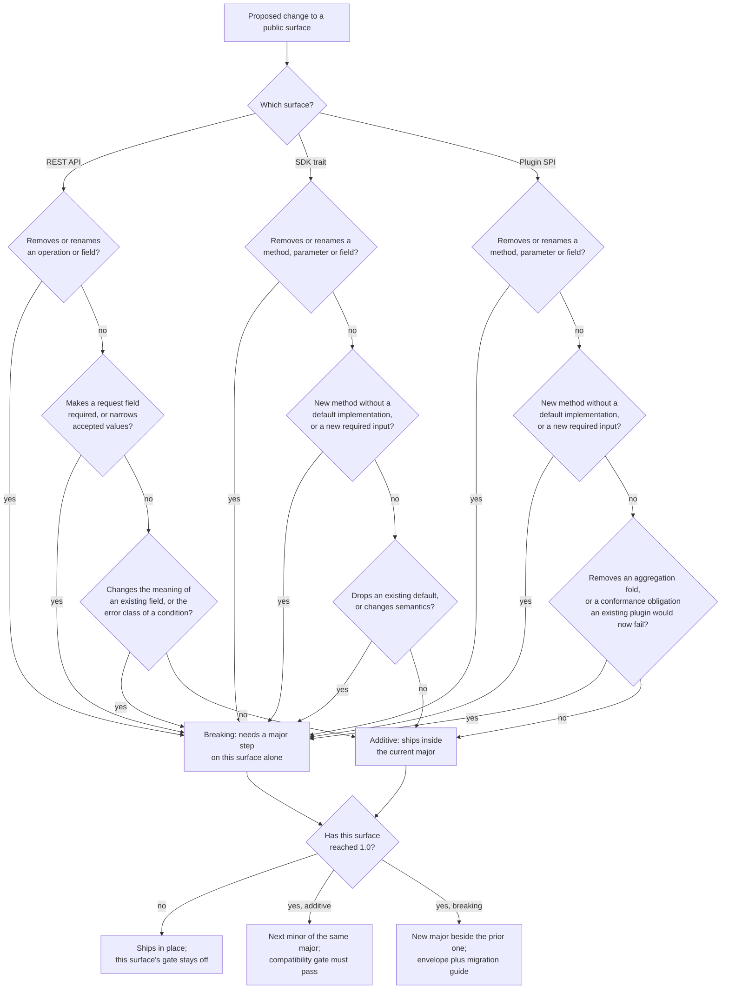

Created:  2026-09-25 by Virtuozzo International GmbH
Updated:  2026-09-25 by Virtuozzo International GmbH

# Feature: Public Surface Contract Stability & Versioning

- [ ] `p2` - **ID**: `cpt-cf-usage-collector-featstatus-contract-stability-implemented`

- [ ] `p2` - `cpt-cf-usage-collector-feature-contract-stability`

States the one rule that binds all three Usage Collector public surfaces — the
REST API, the SDK trait, and the Plugin SPI. Each versions independently, each
admits only additive change inside a major version from its 1.0 release onward,
each keeps at most one prior major supported for a migration window, and each
carries its own machine-checkable compatibility gate.

<!-- toc -->

- [1. Feature Context](#1-feature-context)
  - [1.1 Overview](#11-overview)
  - [1.2 Purpose](#12-purpose)
  - [1.3 Actors](#13-actors)
  - [1.4 References](#14-references)
- [2. Actor Flows (CDSL)](#2-actor-flows-cdsl)
  - [Remote Integrator Migrates Across a REST Major Version](#remote-integrator-migrates-across-a-rest-major-version)
  - [Plugin Author Adopts a New Plugin SPI Major](#plugin-author-adopts-a-new-plugin-spi-major)
- [3. Processes / Business Logic (CDSL)](#3-processes--business-logic-cdsl)
  - [Per-Surface Change Compatibility Classification](#per-surface-change-compatibility-classification)
  - [Major-Version Step on One Surface](#major-version-step-on-one-surface)
  - [Deprecation Window Before Removal](#deprecation-window-before-removal)
  - [Per-Surface Compatibility Gate Execution](#per-surface-compatibility-gate-execution)
- [4. States (CDSL)](#4-states-cdsl)
  - [Public Surface Version Lifecycle](#public-surface-version-lifecycle)
- [5. Definitions of Done](#5-definitions-of-done)
  - [Independent Major Versioning Per Surface](#independent-major-versioning-per-surface)
  - [Additive-Only Evolution of the REST Surface](#additive-only-evolution-of-the-rest-surface)
  - [Additive-Only Evolution of the SDK Trait](#additive-only-evolution-of-the-sdk-trait)
  - [Additive-Only Evolution of the Plugin SPI](#additive-only-evolution-of-the-plugin-spi)
  - [Structural Encoding of a Surface's Major Version](#structural-encoding-of-a-surfaces-major-version)
  - [One Prior Major Supported Per Surface](#one-prior-major-supported-per-surface)
  - [Deprecation Marking Precedes Every Removal](#deprecation-marking-precedes-every-removal)
  - [Contract Begins at Each Surface's 1.0 Release](#contract-begins-at-each-surfaces-10-release)
  - [A Compatibility Gate Per Surface on Every Change Set](#a-compatibility-gate-per-surface-on-every-change-set)
  - [Opaque Continuation Tokens Across a Version Boundary](#opaque-continuation-tokens-across-a-version-boundary)
- [6. Acceptance Criteria](#6-acceptance-criteria)

<!-- /toc -->

## 1. Feature Context

### 1.1 Overview

The Usage Collector exposes three public surfaces, and a different ecosystem
sits behind each one. The REST API serves remote usage sources, operator
tooling, and downstream consumers. The SDK trait (the in-process asynchronous
Rust client trait) serves platform gears compiled into the same process. The
Plugin SPI (**service provider interface**: the Rust trait a storage extension
implements) serves plugin authors, who are often not platform staff at all.

This feature owns the evolution rule those three surfaces obey. From the 1.0
release of a surface onward, that surface admits only additive change within a
major version, a breaking change arrives as a new major published beside the
prior one, and at most one prior major stays supported. The three surfaces step
their major versions independently: a break on one forces no break on the other
two.

It owns no endpoint, no trait method, and no domain behavior. What each surface
*does* belongs to the feature that exposes it. What may change about it, when,
and under which version number belongs here.

**Traces to**: `cpt-cf-usage-collector-nfr-plugin-contract-stability`

### 1.2 Purpose

Plugin authors, in-process consumer gears, and remote usage sources each run
their own release train. If every Usage Collector release could break them,
each would have to recompile or redeploy in lockstep with a gear they do not
own. That coordination cost discourages exactly the ecosystem reuse the gear
was built for — a third-party storage backend, or a billing consumer shipping
on its own schedule.

The contract removes that coupling by making compatibility a published,
testable property of each surface rather than a per-release judgement call. A
consumer wired against major version `N` of one surface keeps working unchanged
across every `N.x` release of the gear. When a break is genuinely needed, it
arrives as a new major with a published compatibility envelope, a migration
guide, and a bounded window during which the prior major still answers.

This is a **cross-cutting contract feature**, in the sense DECOMPOSITION §1
Overview gives that term: it states a rule that binds every component at once
instead of living inside one. Its acceptance criteria are therefore checked as
assertions embedded in the endpoints, trait methods, and SPI methods owned by
the five features it constrains, plus the per-surface compatibility gates
defined here.

**Requirements**: `cpt-cf-usage-collector-nfr-plugin-contract-stability`

**Principles**: `cpt-cf-usage-collector-principle-contract-stability`

**Constraints**: `cpt-cf-usage-collector-constraint-plugin-contract-stability`

**Components**: None. The contract spans the REST surface, the SDK trait, and
the Plugin SPI rather than any one domain component.

**Data**: None. The gear declares no database or table for this feature. A
versioning rule is a contract-evolution policy, not a stored entity, and no
gear-side schema records it.

### 1.3 Actors

| Actor | Role in Feature |
|-------|-----------------|
| `cpt-cf-usage-collector-actor-storage-backend` | Its plugin implements the Plugin SPI. The plugin author is the ecosystem participant the SPI half of this contract exists for: a plugin built against SPI major `N` must keep working across every `N.x` gear release |
| `cpt-cf-usage-collector-actor-platform-developer` | Builds and maintains an in-process consumer gear against the SDK trait. Reads the per-surface compatibility envelope and migrates across an SDK major step on its own release schedule |
| `cpt-cf-usage-collector-actor-usage-source` | Emits usage over the REST API or the SDK trait. A remote emitter is pinned to a REST major version by the path it calls, and migrates when that major is superseded |
| `cpt-cf-usage-collector-actor-usage-consumer` | Reads the query, point-lookup, and feed surfaces. Depends on response shapes staying stable inside a major, and on cursors it holds staying usable across minor releases |
| `cpt-cf-usage-collector-actor-platform-operator` | Runs the deployment. Must be able to operate two concurrent major versions of one surface for the length of a migration window, and retires the superseded major when the window closes |

### 1.4 References

- **PRD**: [PRD.md](../PRD.md) — §6.1 `nfr-plugin-contract-stability`, §7.1
  Public API Surface (the three interfaces and their per-surface breaking-change
  policies), §7.2 Storage Plugin Contract
- **Design**: [DESIGN.md](../DESIGN.md) — §2.1 Contract stability principle,
  §2.2 Plugin contract stability constraint, §3.1 Additive schema evolution
  invariant, §3.3 API Contracts (the three surface declarations and the plugin
  contract-test suite), §3.12.1 Testing (the Contract test category), §3.12.4
  Versioning and Deprecation Policy
- **ADR**:
  [ADR-0005](../ADR/0005-cpt-cf-usage-collector-adr-contract-stability.md)
  (`cpt-cf-usage-collector-adr-contract-stability`) — independent major-version
  stability per surface, chosen over one shared version and over a
  calendar-versioned release train
- **REST contract**: [usage-collector-v1.yaml](../usage-collector-v1.yaml) — the
  authoritative machine-readable REST surface this feature stabilizes, carrying
  its own contract-status marker
- **DECOMPOSITION**: [DECOMPOSITION.md](../DECOMPOSITION.md) — entry 2.13
- **Dependencies**: `cpt-cf-usage-collector-feature-usage-record-ingestion`,
  `cpt-cf-usage-collector-feature-usage-query`,
  `cpt-cf-usage-collector-feature-usage-feed`, and
  `cpt-cf-usage-collector-feature-backfill-retention` own the REST endpoints and
  SDK trait methods this feature stabilizes.
  `cpt-cf-usage-collector-feature-pluggable-storage` owns the Plugin SPI, which
  is the third surface covered. This is a tier-4 leaf feature: nothing depends
  on it.

**Division with pluggable storage.** `pluggable-storage` owns the Plugin SPI as
a *dispatch mechanism* — resolution, dispatch, error classification, and the
conformance harness (`cpt-cf-usage-collector-dod-plugin-spi-sole-seam`,
`cpt-cf-usage-collector-dod-plugin-conformance-suite`). This feature owns the
same trait as a *versioned public surface*: what may be added to it inside a
major, what forces a major step, and how long the prior major answers. That
document already states the split from its side; this one matches it.

**Out of scope.** The functional content of any surface belongs to the feature
exposing it. Performance envelopes over those surfaces belong to
`cpt-cf-usage-collector-feature-throughput-latency-availability`. The
reconciliation endpoint's own content belongs to
`cpt-cf-usage-collector-feature-rate-limiting-reconciliation`, though the
versioning rule below binds it like every other REST operation.

## 2. Actor Flows (CDSL)

Two ecosystem participants cross a version boundary in materially different
ways, because a remote caller is pinned by a URL path while a plugin author is
pinned by a compiled trait. Both flows are real and both are modelled.

### Remote Integrator Migrates Across a REST Major Version

- [ ] `p2` - **ID**: `cpt-cf-usage-collector-flow-integrator-rest-compat-migration`

**Actor**: `cpt-cf-usage-collector-actor-usage-source`

**Success Scenarios**:
- The integrator's client keeps calling the current major for every minor and
  patch release of the gear, reacting to nothing, because only additive change
  shipped inside that major.
- A new major is published beside the prior one. The integrator reads the
  published compatibility envelope and migration guide, repoints its client at
  the new path version, and verifies against both majors while the window is
  open.
- The integrator finishes early and retires its use of the prior major before
  the window closes. Nothing forces it to wait.

**Error Scenarios**:
- The integrator ignores the deprecation markers published at least one minor
  release ahead and discovers the removal only at the major step. The prior
  major still answers for the whole window, so this is a schedule problem rather
  than an outage.
- The integrator lets the migration window close while still calling the prior
  major. That major is withdrawn and its calls stop being served; only two
  concurrent majors of a surface are ever supported.
- The integrator treats an opaque continuation token as parseable and reads a
  field out of it. The token's internal encoding is not part of the contract, so
  the client breaks on a change no compatibility gate reports as breaking.

**Steps**:
1. [ ] - `p2` - Integrator pins its client to a REST major version by the version segment in the request path, which is the only place that major is declared - `inst-compat-rest-pin`
2. [ ] - `p2` - Integrator consumes minor and patch releases of the gear without reacting, because every change inside the major was classified additive by `cpt-cf-usage-collector-algo-change-compat-classification` - `inst-compat-rest-quiet-minors`
3. [ ] - `p2` - **WHEN** an element of the surface is scheduled for removal, it is marked deprecated in the published REST contract at least one minor release before the next major - `inst-compat-rest-deprecation-notice`
4. [ ] - `p2` - Gear publishes the next major beside the prior one, together with that major's compatibility envelope and migration guide - `inst-compat-rest-major-published`
5. [ ] - `p2` - **IF** the integrator has migrated, it repoints its client at the new version segment and reruns its own conformance checks - `inst-compat-rest-repoint`
6. [ ] - `p2` - **ELSE** the integrator keeps calling the prior major, which stays served for the length of the migration window - `inst-compat-rest-stay-on-prior`
7. [ ] - `p2` - Operator runs both majors concurrently for the window's duration, then withdraws the prior major once it closes - `inst-compat-rest-dual-run`
8. [ ] - `p2` - **RETURN** an integrator on the current major, having migrated on its own schedule rather than the gear's - `inst-compat-rest-return`

### Plugin Author Adopts a New Plugin SPI Major

- [ ] `p2` - **ID**: `cpt-cf-usage-collector-flow-plugin-author-spi-compat-adoption`

**Actor**: `cpt-cf-usage-collector-actor-storage-backend`

**Success Scenarios**:
- A plugin compiled against SPI major `N` builds and passes the published
  conformance suite unchanged against every `N.x` release of the gear.
- A new SPI method ships inside the major carrying a default implementation. The
  plugin compiles untouched, and the author overrides the method later when it
  suits the plugin's own release train.
- At a major step the author implements the new obligations, reruns the
  conformance suite against the new major, and publishes a plugin build for it
  while the build for the prior major stays available.

**Error Scenarios**:
- The author relies on an element already marked deprecated in the trait
  documentation. It is removed at the next major step, and the plugin fails to
  build against that major while continuing to build against the prior one.
- The plugin is asked for an aggregation fold it does not implement. It reports
  an internal error rather than substituting a different fold, so a missing
  implementation never silently changes a metering answer.
- The author publishes only a build for the prior major after the window closes.
  The plugin is no longer selectable by a deployment on the current major, which
  is a plugin packaging matter rather than a gear condition.

**Steps**:
1. [ ] - `p2` - Plugin author implements the Plugin SPI trait against major version `N`, whose major is declared by the version suffix in the trait's own name - `inst-compat-spi-implement`
2. [ ] - `p2` - Author runs the conformance suite published in the SDK crate, owned by `cpt-cf-usage-collector-dod-plugin-conformance-suite`, and publishes the plugin - `inst-compat-spi-conformance-run`
3. [ ] - `p2` - Gear ships minor releases inside major `N`; each added method carries a default implementation, so the plugin keeps building with no author action - `inst-compat-spi-quiet-minors`
4. [ ] - `p2` - **WHEN** an SPI element is scheduled for removal, it is marked deprecated in the trait documentation at least one minor release ahead - `inst-compat-spi-deprecation-notice`
5. [ ] - `p2` - Gear publishes SPI major `N` plus one beside major `N`, with a compatibility envelope naming every breaking change and a migration guide - `inst-compat-spi-major-published`
6. [ ] - `p2` - Author implements the new obligations, reruns the conformance suite against the new major, and publishes a second plugin build - `inst-compat-spi-adopt-new-major`
7. [ ] - `p2` - **IF** the author has not yet adopted the new major, the existing build stays usable against the prior major for the whole migration window - `inst-compat-spi-window-grace`
8. [ ] - `p2` - **RETURN** a conforming plugin on the current SPI major, released on the author's schedule and not the gear's - `inst-compat-spi-return`

## 3. Processes / Business Logic (CDSL)

The rule is enforced by four internal procedures: classify a proposed change,
take a major step when the classification says breaking, run the deprecation
window ahead of a removal, and gate every change set on the per-surface
compatibility checks.

Classification is the step worth drawing, because the answer genuinely differs
by surface: the same change is additive on one surface and breaking on another.
A new required field is breaking everywhere, but a new trait method is additive
only when it carries a default implementation, and a new REST operation is
always additive because a caller that does not know it never calls it. The
diagram traces one proposed change through the per-surface tests.

### Per-Surface Change Compatibility Classification

- [ ] `p2` - **ID**: `cpt-cf-usage-collector-algo-change-compat-classification`

**Input**: A proposed change, and the public surface it lands on — the REST API
(`cpt-cf-usage-collector-interface-rest-api`), the SDK trait
(`cpt-cf-usage-collector-interface-sdk-client`), or the Plugin SPI
(`cpt-cf-usage-collector-interface-plugin`).

**Output**: The verdict additive or breaking, for that surface alone, plus the
version step the verdict obliges.

**Steps**:
1. [ ] - `p2` - Identify the surface the change lands on; a change touching more than one surface is classified once per surface, independently - `inst-classify-identify-surface`
2. [ ] - `p2` - **IF** the change removes or renames an operation, a method, a parameter, a field, or an enumeration value, classify it breaking on that surface - `inst-classify-removal`
3. [ ] - `p2` - **IF** the change adds a required input, narrows the set of accepted values, or alters the meaning or unit of an existing element, classify it breaking - `inst-classify-narrowing`
4. [ ] - `p2` - **IF** the surface is the REST API and the change adds an operation, an optional request field, an optional response field, or a variant of an open response enumeration, classify it additive - `inst-classify-rest-additive`
5. [ ] - `p2` - **IF** the surface is one of the two Rust traits and the change adds a method carrying a default implementation, an optional input field, or a non-required output variant, classify it additive - `inst-classify-rust-additive`
6. [ ] - `p2` - **IF** the change drops an existing default implementation from a trait method, classify it breaking, because every implementation that relied on the default stops compiling - `inst-classify-drop-default`
7. [ ] - `p2` - **IF** the surface is the Plugin SPI and the change adds an aggregation fold, classify it additive; removing a fold is breaking - `inst-classify-fold-addition`
8. [ ] - `p2` - **IF** the change adds a conformance obligation that a plugin conforming to the current major would now fail, classify it breaking on the Plugin SPI even when the trait shape is untouched - `inst-classify-conformance-tightening`
9. [ ] - `p2` - **IF** the change alters only the internal encoding of an opaque continuation token, classify it additive, unless a token issued by the current major stops being accepted, which is breaking - `inst-classify-opaque-token`
10. [ ] - `p2` - **IF** the verdict is breaking and the surface has not reached its 1.0 release, record that the change ships in place with no version step - `inst-classify-pre-release`
11. [ ] - `p2` - **RETURN** the verdict, and for a released surface the obliged step: the next minor of the same major when additive, a new major when breaking - `inst-classify-return`

### Major-Version Step on One Surface

- [ ] `p2` - **ID**: `cpt-cf-usage-collector-algo-surface-versioning-step`

**Input**: One surface, and a change set classified breaking for it.

**Output**: A published new major for that surface, coexisting with the prior
major, with the other two surfaces unmoved.

**Steps**:
1. [ ] - `p2` - Confirm the deprecation window ran for every element the step removes, per `cpt-cf-usage-collector-algo-deprecation-window` - `inst-step-confirm-deprecation`
2. [ ] - `p2` - Increment the major version of this surface alone, leaving the other two surfaces at their current majors - `inst-step-increment-one`
3. [ ] - `p2` - Encode the new major structurally: the version segment of the REST path, the version suffix in the SDK trait's name, the version suffix in the SPI trait's name - `inst-step-encode-major`
4. [ ] - `p2` - Publish the new major beside the prior one rather than in place of it, so both answer for the migration window - `inst-step-publish-beside`
5. [ ] - `p2` - Publish the compatibility envelope for the step, naming every breaking change and the element each one replaces - `inst-step-publish-envelope`
6. [ ] - `p2` - Publish the migration guide for the step, addressed to that surface's ecosystem and no other - `inst-step-publish-guide`
7. [ ] - `p2` - Open the migration window and confirm the deployment supports both majors of this surface concurrently - `inst-step-open-window`
8. [ ] - `p2` - **IF** a major two steps back is still published, withdraw it, because at most one prior major stays supported per surface - `inst-step-retire-oldest`
9. [ ] - `p2` - Start the new major's compatibility gate against the prior major, per `cpt-cf-usage-collector-algo-compat-gate-execution` - `inst-step-start-gate`
10. [ ] - `p2` - **RETURN** two concurrent majors of the stepped surface, and no change to either other surface's version - `inst-step-return`

### Deprecation Window Before Removal

- [ ] `p2` - **ID**: `cpt-cf-usage-collector-algo-deprecation-window`

**Input**: An element of a public surface that is scheduled for removal.

**Output**: The element marked deprecated for at least one minor release, then
removed at the next major step of its own surface.

**Steps**:
1. [ ] - `p2` - Mark the element deprecated where its surface publishes documentation: the REST contract document for the REST API, the trait documentation for the SDK trait and the Plugin SPI - `inst-deprecation-mark`
2. [ ] - `p2` - Record in the mark what replaces the element, so a consumer reading only the mark can act on it - `inst-deprecation-record-successor`
3. [ ] - `p2` - Keep the element fully functional while it is marked; a deprecation mark changes no behavior and breaks no consumer - `inst-deprecation-keep-working`
4. [ ] - `p2` - Ship at least one minor release of that surface carrying the mark before the next major step - `inst-deprecation-minimum-window`
5. [ ] - `p2` - **IF** the next major step arrives before a minor release carried the mark, defer the removal to the following major step - `inst-deprecation-defer`
6. [ ] - `p2` - Remove the element at the major step, never inside a major - `inst-deprecation-remove-at-major`
7. [ ] - `p2` - **RETURN** a removal that no consumer of that surface met without a published warning - `inst-deprecation-return`

### Per-Surface Compatibility Gate Execution

- [ ] `p2` - **ID**: `cpt-cf-usage-collector-algo-compat-gate-execution`

**Input**: A proposed change set, and the released state of each of the three
surfaces.

**Output**: A pass or fail verdict per surface, blocking the change set where a
gate fails.

**Steps**:
1. [ ] - `p2` - **FOR EACH** of the three public surfaces - `inst-gate-for-each-surface`
   1. [ ] - `p2` - **IF** that surface has not reached its 1.0 release, skip its gate, because no prior major exists to compare against - `inst-gate-skip-pre-release`
   2. [ ] - `p2` - **ELSE** compare the change set's surface against the prior major of the same surface - `inst-gate-compare-prior-major`
2. [ ] - `p2` - For the REST API, run a schema difference check of the published contract document against the prior major, reporting every removed operation, removed field, newly required field, and narrowed value set - `inst-gate-rest-schema-diff`
3. [ ] - `p2` - For the SDK trait, run a compile-time check: a fixture consumer written against the prior major must build unchanged against the change set - `inst-gate-sdk-compile`
4. [ ] - `p2` - For the Plugin SPI, run the same compile-time check against a fixture plugin, then run the published conformance suite against that fixture unchanged - `inst-gate-spi-compile-and-conformance`
5. [ ] - `p2` - **IF** any gate reports a breaking difference and the change set declares no major step for that surface, fail the change set and name the surface and the difference - `inst-gate-fail-undeclared-break`
6. [ ] - `p2` - **IF** a gate reports a breaking difference and the change set does declare a major step for that surface, require the difference to appear in that step's published compatibility envelope - `inst-gate-require-envelope-entry`
7. [ ] - `p2` - **RETURN** a per-surface verdict, so a break on one surface never blocks an unrelated change on another - `inst-gate-return`

## 4. States (CDSL)

A public surface has an explicit lifecycle. DESIGN §3.12.4 and
`cpt-cf-usage-collector-adr-contract-stability` together give it four states and
a fixed direction of travel, and the state a surface is in decides whether its
compatibility gate runs at all. The lifecycle is modelled here because the
question "may this change ship in place?" is answered by the state and by
nothing else.

### Public Surface Version Lifecycle

- [ ] `p2` - **ID**: `cpt-cf-usage-collector-state-surface-versioning-lifecycle`

**States**: PreRelease, Current, Superseded, Withdrawn

**Initial State**: PreRelease

**Transitions**:
1. [ ] - `p2` - **FROM** PreRelease **TO** Current **WHEN** the surface reaches its 1.0 release, at which point its stability contract begins and its compatibility gate is switched on - `inst-lifecycle-reach-release`
2. [ ] - `p2` - **FROM** PreRelease **TO** PreRelease **WHEN** a breaking change ships in place, which is permitted only here, because the surface has no consumer to protect - `inst-lifecycle-break-in-place`
3. [ ] - `p2` - **FROM** Current **TO** Current **WHEN** an additive change ships as a minor or patch release of the same major, and the compatibility gate passes - `inst-lifecycle-additive-minor`
4. [ ] - `p2` - **FROM** Current **TO** Superseded **WHEN** a new major of the same surface is published beside it, opening the migration window - `inst-lifecycle-superseded`
5. [ ] - `p2` - **FROM** Superseded **TO** Withdrawn **WHEN** the migration window closes, after which that major serves no caller - `inst-lifecycle-withdrawn`
6. [ ] - `p2` - **FROM** Superseded **TO** Superseded **WHEN** a patch release fixes a defect without adding to the superseded major, which stays open to corrections and closed to additions - `inst-lifecycle-superseded-patch`
7. [ ] - `p2` - A major never returns from Withdrawn, and never moves from Superseded back to Current; at most two majors of one surface are live at any moment, one Current and one Superseded - `inst-lifecycle-no-return`
8. [ ] - `p2` - Each of the three surfaces holds its own position in this lifecycle, so one surface being Superseded says nothing about the other two - `inst-lifecycle-per-surface`

## 5. Definitions of Done

Each entry names the surface that carries the obligation, the feature that owns
that surface, and the assertion that proves the obligation held.

### Independent Major Versioning Per Surface

- [ ] `p2` - **ID**: `cpt-cf-usage-collector-dod-independent-surface-versioning`

The system **MUST** version the REST API, the SDK trait, and the Plugin SPI
independently. A breaking change on one surface **MUST** advance that surface's
major version alone and **MUST** leave the other two majors unchanged. Each
surface's stability contract **MUST** begin at that surface's own 1.0 release,
which each reaches on its own schedule. No release artifact may impose a single
shared major version across the three.

The surfaces themselves are owned elsewhere: the REST endpoints and SDK trait
methods belong to `cpt-cf-usage-collector-feature-usage-record-ingestion`,
`cpt-cf-usage-collector-feature-usage-query`,
`cpt-cf-usage-collector-feature-usage-feed`, and
`cpt-cf-usage-collector-feature-backfill-retention`; the Plugin SPI belongs to
`cpt-cf-usage-collector-feature-pluggable-storage`.

**Assertion**: A change set that steps one surface's major leaves the other two
surfaces byte-identical to the prior release on their respective gates.

**Implements**:
- `cpt-cf-usage-collector-algo-surface-versioning-step`

**Requirements**: `cpt-cf-usage-collector-nfr-plugin-contract-stability`

**Principles**: `cpt-cf-usage-collector-principle-contract-stability`

**Touches**:
- Interface: `cpt-cf-usage-collector-interface-rest-api`
- Interface: `cpt-cf-usage-collector-interface-sdk-client`
- Interface: `cpt-cf-usage-collector-interface-plugin`

### Additive-Only Evolution of the REST Surface

- [ ] `p2` - **ID**: `cpt-cf-usage-collector-dod-rest-additive-compat-rule`

The system **MUST** admit, inside a released REST major version, only a new
operation, a new optional request field, a new optional response field, or a new
variant of an open response enumeration. It **MUST** treat as breaking the
removal or renaming of an operation or field, the promotion of an optional
request field to required, a narrowing of the accepted values of an existing
field, a change to the meaning or unit of an existing field, and a change to
which error class an existing condition maps to.

The obligation is carried by the operations those four capability features own:
the ingestion and invalidation routes and their per-entry batch outcomes
(`cpt-cf-usage-collector-dod-ingestion-choke-point`,
`cpt-cf-usage-collector-dod-batch-outcome-model`), the raw, aggregated, and
point-lookup reads (`cpt-cf-usage-collector-dod-canonical-page-envelope`,
`cpt-cf-usage-collector-dod-no-aggregation-parameter`), the feed
(`cpt-cf-usage-collector-dod-feed-next-cursor-always`), and the backfill route
(`cpt-cf-usage-collector-dod-backfill-route`). This feature adds no operation to
any of them.

**Assertion**: The schema difference check of the published REST contract
against the prior major reports no removal, no newly required request field, and
no narrowed value set, on every change set.

**Implements**:
- `cpt-cf-usage-collector-algo-change-compat-classification`
- `cpt-cf-usage-collector-flow-integrator-rest-compat-migration`

**Constraints**: `cpt-cf-usage-collector-constraint-plugin-contract-stability`

**Touches**:
- Interface: `cpt-cf-usage-collector-interface-rest-api`
- API: `POST /usage-collector/v1/records`
- API: `GET /usage-collector/v1/records`
- API: `GET /usage-collector/v1/records/{id}`
- API: `POST /usage-collector/v1/records/aggregate`
- API: `POST /usage-collector/v1/records/backfill`
- API: `GET /usage-collector/v1/feed`

### Additive-Only Evolution of the SDK Trait

- [ ] `p2` - **ID**: `cpt-cf-usage-collector-dod-sdk-trait-compat-rule`

The system **MUST** admit, inside a released SDK trait major version, only a new
method carrying a default implementation, a new optional input field, or a new
non-required output variant. It **MUST** treat as breaking the removal or
renaming of a method, parameter, or field, the addition of a method without a
default implementation, the addition of a required input, the removal of an
existing default implementation, and any change to the documented semantics of
an existing method.

The trait's methods belong to the four capability features that expose them —
ingestion and invalidation, raw and aggregated query with point lookup, the
feed, and backfill. This feature defines no method and changes none.

**Assertion**: A fixture in-process consumer written against the prior major
compiles and runs unchanged against the change set, on every change set after
the trait's 1.0 release.

**Implements**:
- `cpt-cf-usage-collector-algo-change-compat-classification`
- `cpt-cf-usage-collector-algo-compat-gate-execution`

**Requirements**: `cpt-cf-usage-collector-nfr-plugin-contract-stability`

**Touches**:
- Interface: `cpt-cf-usage-collector-interface-sdk-client`
- Contract: `cpt-cf-usage-collector-contract-downstream-usage-reader`

### Additive-Only Evolution of the Plugin SPI

- [ ] `p2` - **ID**: `cpt-cf-usage-collector-dod-plugin-spi-compat-rule`

The system **MUST** keep a plugin built against Plugin SPI major version `N`
working unchanged against every `N.x` release of the gear, from the SPI's 1.0
release onward. Inside a major it **MUST** admit only a new method carrying a
default implementation, a new optional input field, a new non-required output
variant, or a new aggregation fold. Removing a fold, removing or renaming any
element, adding a required input, dropping a default implementation, or
tightening a conformance obligation an existing conforming plugin would now fail
**MUST** each force a major step. A plugin asked for a fold it does not
implement **MUST** report an internal error rather than substitute another.

`cpt-cf-usage-collector-feature-pluggable-storage` owns this trait as the
dispatch seam (`cpt-cf-usage-collector-dod-plugin-spi-sole-seam`) and owns the
conformance harness (`cpt-cf-usage-collector-dod-plugin-conformance-suite`).
This feature owns only its versioning.

**Assertion**: A fixture plugin built against the prior major compiles unchanged
and passes the published conformance suite unchanged against the change set.

**Implements**:
- `cpt-cf-usage-collector-flow-plugin-author-spi-compat-adoption`
- `cpt-cf-usage-collector-algo-change-compat-classification`

**Constraints**: `cpt-cf-usage-collector-constraint-plugin-contract-stability`

**Touches**:
- Interface: `cpt-cf-usage-collector-interface-plugin`
- Contract: `cpt-cf-usage-collector-contract-storage-plugin`

### Structural Encoding of a Surface's Major Version

- [ ] `p2` - **ID**: `cpt-cf-usage-collector-dod-versioning-encoding-structural`

The system **MUST** encode each surface's major version structurally, in the
surface itself, rather than only in release notes. The REST API **MUST** carry
its major in the version segment of every request path. The SDK trait **MUST**
carry its major in the version suffix of the trait's name. The Plugin SPI
**MUST** carry its major in the version suffix of its own trait name and of the
plugin specification type that publishes an implementation. A consumer **MUST**
be able to read the major it is bound to from the surface alone, with no
external lookup.

**Assertion**: For each surface, an inspection of the published artifact
recovers the major version without consulting any document, and two concurrent
majors of one surface are distinguishable by that encoding alone.

**Implements**:
- `cpt-cf-usage-collector-algo-surface-versioning-step`

**Constraints**: `cpt-cf-usage-collector-constraint-plugin-contract-stability`

**Touches**:
- Interface: `cpt-cf-usage-collector-interface-rest-api`
- Interface: `cpt-cf-usage-collector-interface-sdk-client`
- Interface: `cpt-cf-usage-collector-interface-plugin`

### One Prior Major Supported Per Surface

- [ ] `p2` - **ID**: `cpt-cf-usage-collector-dod-one-prior-major-compat-window`

The system **MUST** keep exactly one prior major of a surface supported after a
major step, for one migration window, and **MUST NOT** keep two or more prior
majors alive at once. The superseded major **MUST** stay servable and **MUST**
accept defect corrections, while accepting no additions. Deployment tooling
**MUST** support running two concurrent majors of one surface for the window's
length. When the window closes the superseded major is withdrawn.

**Assertion**: A release-process review shows the deployment running the current
and the prior major of one surface at the same time, and an inventory of
published majors per surface never exceeds two.

**Implements**:
- `cpt-cf-usage-collector-state-surface-versioning-lifecycle`
- `cpt-cf-usage-collector-algo-surface-versioning-step`

**Requirements**: `cpt-cf-usage-collector-nfr-plugin-contract-stability`

**Touches**:
- Interface: `cpt-cf-usage-collector-interface-rest-api`
- Interface: `cpt-cf-usage-collector-interface-sdk-client`
- Interface: `cpt-cf-usage-collector-interface-plugin`

### Deprecation Marking Precedes Every Removal

- [ ] `p2` - **ID**: `cpt-cf-usage-collector-dod-deprecation-before-removal`

The system **MUST** mark any element scheduled for removal as deprecated, in the
published documentation of its own surface, at least one minor release before
the major step that removes it. The REST contract document carries the mark for
the REST API; the trait documentation carries it for the SDK trait and the
Plugin SPI. A marked element **MUST** keep working for as long as it is marked.
Removal **MUST** happen only at a major step, never inside a major.

**Assertion**: For every element removed at a major step, a preceding minor
release of the same surface published that element carrying a deprecation mark
and naming its successor.

**Implements**:
- `cpt-cf-usage-collector-algo-deprecation-window`

**Constraints**: `cpt-cf-usage-collector-constraint-plugin-contract-stability`

**Touches**:
- Interface: `cpt-cf-usage-collector-interface-rest-api`
- Interface: `cpt-cf-usage-collector-interface-sdk-client`
- Interface: `cpt-cf-usage-collector-interface-plugin`

### Contract Begins at Each Surface's 1.0 Release

- [ ] `p2` - **ID**: `cpt-cf-usage-collector-dod-pre-1-0-stability-start`

The system **MUST** apply the stability contract to a surface only from that
surface's 1.0 release onward. Before that release a breaking change **MUST**
ship in place rather than beside the prior shape, and that surface's
compatibility gate **MUST** stay switched off, because no prior major exists to
compare against and no consumer exists to migrate. Each surface **MUST** publish
its own release state, so a consumer can tell a pre-release surface from a
contracted one without asking. No surface has reached 1.0 at the time of
writing, and the REST contract document carries a machine-readable status marker
saying so.

**Assertion**: Each surface publishes a release-state marker; switching a
surface's marker to released switches its compatibility gate on in the same
change, and a gate is never reported as passing while its surface is
pre-release.

**Implements**:
- `cpt-cf-usage-collector-state-surface-versioning-lifecycle`
- `cpt-cf-usage-collector-algo-compat-gate-execution`

**Principles**: `cpt-cf-usage-collector-principle-contract-stability`

**Touches**:
- Interface: `cpt-cf-usage-collector-interface-rest-api`
- Interface: `cpt-cf-usage-collector-interface-sdk-client`
- Interface: `cpt-cf-usage-collector-interface-plugin`

### A Compatibility Gate Per Surface on Every Change Set

- [ ] `p2` - **ID**: `cpt-cf-usage-collector-dod-compat-gate-per-surface`

The system **MUST** run a compatibility check per released surface on every
proposed change set, before release: a schema difference check for the REST API,
a compile-time check against a fixture consumer for the SDK trait, and a
compile-time check plus a conformance-suite run against a fixture plugin for the
Plugin SPI. A gate reporting a breaking difference **MUST** block the change set
unless that change set declares a major step for that surface and lists the
difference in the step's published compatibility envelope. Each gate **MUST**
report independently, so a break on one surface blocks nothing on another. Every
major step **MUST** publish a compatibility envelope and a migration guide for
its own surface.

**Assertion**: Introducing a deliberate breaking change on one surface fails
exactly that surface's gate, names the removed or narrowed element, and leaves
the other two gates passing.

**Implements**:
- `cpt-cf-usage-collector-algo-compat-gate-execution`
- `cpt-cf-usage-collector-algo-surface-versioning-step`

**Requirements**: `cpt-cf-usage-collector-nfr-plugin-contract-stability`

**Touches**:
- Interface: `cpt-cf-usage-collector-interface-rest-api`
- Interface: `cpt-cf-usage-collector-interface-sdk-client`
- Interface: `cpt-cf-usage-collector-interface-plugin`

### Opaque Continuation Tokens Across a Version Boundary

- [ ] `p2` - **ID**: `cpt-cf-usage-collector-dod-cursor-opacity-compat`

The system **MUST** treat the internal encoding of an opaque continuation token
as outside every surface's contract, because the gateway alone mints, decodes,
and validates it and a caller only threads back what it read
(`cpt-cf-usage-collector-dod-gateway-owned-cursor`,
`cpt-cf-usage-collector-principle-cursor-gateway-ownership`). Re-encoding a
token inside a major is therefore additive. Rendering a token issued by the
current major undecodable **MUST** be classified breaking on the surfaces that
issue it, since a consumer holding a saved position would silently lose it. The
page envelope and cursor semantics themselves are owned by
`cpt-cf-usage-collector-feature-usage-query`
(`cpt-cf-usage-collector-dod-canonical-page-envelope`) and by
`cpt-cf-usage-collector-feature-usage-feed`; this entry adds only the
cross-version rule.

**Assertion**: A token issued before a minor release is accepted after it, and a
change that invalidates previously issued tokens is reported by the REST gate as
a breaking difference rather than shipped inside the major.

**Implements**:
- `cpt-cf-usage-collector-algo-change-compat-classification`

**Principles**: `cpt-cf-usage-collector-principle-cursor-gateway-ownership`,
`cpt-cf-usage-collector-principle-canonical-page`

**Touches**:
- Interface: `cpt-cf-usage-collector-interface-rest-api`
- Interface: `cpt-cf-usage-collector-interface-sdk-client`
- API: `GET /usage-collector/v1/records`
- API: `GET /usage-collector/v1/feed`

## 6. Acceptance Criteria

- [ ] A change set that steps the Plugin SPI major leaves the REST major and the SDK trait major unchanged, verified by inspecting the published version encoding of all three surfaces before and after.
- [ ] A change set that steps the REST major leaves both Rust trait names unchanged, verified the same way.
- [ ] The REST major version is recoverable from a request path alone, the SDK trait major from the trait's name alone, and the Plugin SPI major from its trait name and plugin specification type alone, with no document consulted.
- [ ] Two concurrent majors of one surface are distinguishable by that structural encoding alone, and a deployment can run both at once.
- [ ] Adding a new REST operation, a new optional request field, a new optional response field, or a new variant of an open response enumeration passes the REST schema difference check against the prior major.
- [ ] Removing a REST operation, removing a response field, promoting an optional request field to required, or narrowing a field's accepted value set each fails the REST schema difference check, and the failure names the offending element.
- [ ] Changing which error class an existing REST condition maps to fails the REST schema difference check, since callers branch on that class.
- [ ] A fixture in-process consumer written against the prior SDK major compiles and runs unchanged against the current change set.
- [ ] Adding an SDK trait method with a default implementation leaves that fixture consumer compiling; adding one without a default breaks the compile and fails the SDK gate.
- [ ] Removing an existing default implementation from an SDK trait method fails the SDK gate, even though no method was removed.
- [ ] A fixture plugin built against the prior Plugin SPI major compiles unchanged and passes the published conformance suite unchanged against the current change set.
- [ ] Adding an aggregation fold leaves that fixture plugin compiling and conforming; removing a fold fails the Plugin SPI gate.
- [ ] A plugin asked for an aggregation fold it does not implement returns an internal error, and the conformance suite asserts that it substitutes no other fold.
- [ ] Adding a conformance obligation that the prior-major fixture plugin fails is reported by the Plugin SPI gate as a breaking difference, even when the trait shape is unchanged.
- [ ] Each of the three gates reports independently: a deliberate break introduced on one surface fails that surface's gate alone and leaves the other two passing.
- [ ] A change set carrying a breaking difference on a released surface without declaring a major step for that surface is blocked, and the block names the surface and the difference.
- [ ] A change set declaring a major step is accepted only when every breaking difference its gate reported appears in that step's published compatibility envelope.
- [ ] Every major step publishes a compatibility envelope and a migration guide addressed to its own surface's ecosystem.
- [ ] Every element removed at a major step appeared, carrying a deprecation mark that named its successor, in at least one minor release of the same surface beforehand.
- [ ] An element carrying a deprecation mark behaves exactly as it did before the mark, verified by running that surface's own behavioral tests against it unchanged.
- [ ] No element is removed inside a major version, verified by the schema difference check for the REST API and by the compile-time checks for the two Rust surfaces.
- [ ] After a major step, exactly two majors of that surface are published: the current one and the immediately prior one.
- [ ] A superseded major accepts a defect correction and rejects an addition, verified by running the gate for that major against both kinds of change.
- [ ] Once a migration window closes, the withdrawn major serves no caller, and the published inventory for that surface lists one major again.
- [ ] While a surface is pre-release, its compatibility gate does not run and reports no verdict, and a breaking change on it ships in place with no second shape published.
- [ ] Flipping a surface's release-state marker to released switches that surface's compatibility gate on in the same change set, so the two cannot drift apart.
- [ ] A continuation token issued before a minor release is still accepted after it, across the raw-read path and the feed path alike.
- [ ] A change that would render previously issued continuation tokens undecodable is reported as a breaking difference rather than shipped inside the major.
