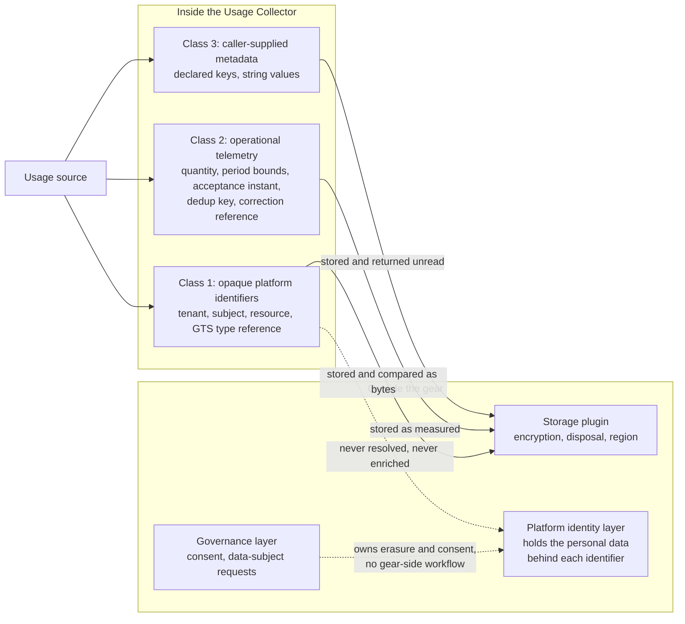

Created:  2026-09-25 by Virtuozzo International GmbH
Updated:  2026-09-25 by Virtuozzo International GmbH

# Feature: Data Classification & Privacy Boundary

- [ ] `p3` - **ID**: `cpt-cf-usage-collector-featstatus-data-classification-implemented`

- [ ] `p3` - `cpt-cf-usage-collector-feature-data-classification`

Specifies the three-class treatment of everything the Usage Collector
persists — opaque platform identifiers, operational telemetry, and
caller-supplied metadata — and the handling rule each class carries, so that
personal-data obligations stay with the platform identity layer and never
become this gear's to interpret.

<!-- toc -->

- [1. Feature Context](#1-feature-context)
  - [1.1 Overview](#11-overview)
  - [1.2 Purpose](#12-purpose)
  - [1.3 Actors](#13-actors)
  - [1.4 References](#14-references)
- [2. Actor Flows (CDSL)](#2-actor-flows-cdsl)
- [3. Processes / Business Logic (CDSL)](#3-processes--business-logic-cdsl)
  - [Classify a Persisted Field](#classify-a-persisted-field)
  - [Handle an Identifier Without Interpreting It](#handle-an-identifier-without-interpreting-it)
  - [Carry Caller-Supplied Metadata Unread](#carry-caller-supplied-metadata-unread)
- [4. States (CDSL)](#4-states-cdsl)
- [5. Definitions of Done](#5-definitions-of-done)
  - [Identifiers Stay Opaque on Every Surface](#identifiers-stay-opaque-on-every-surface)
  - [No Identity Resolution and No Response Enrichment](#no-identity-resolution-and-no-response-enrichment)
  - [Operational Telemetry Is Non-Personal by Construction](#operational-telemetry-is-non-personal-by-construction)
  - [Metadata Is Stored and Returned Unread](#metadata-is-stored-and-returned-unread)
  - [The No-Personal-Data Obligation Is Published Where Integrators Read It](#the-no-personal-data-obligation-is-published-where-integrators-read-it)
  - [No Gear-Local Consent, Request, or Erasure Path](#no-gear-local-consent-request-or-erasure-path)
- [6. Acceptance Criteria](#6-acceptance-criteria)

<!-- /toc -->

## 1. Feature Context

### 1.1 Overview

A data-handling contract rather than a code path. It sorts every field the gear
stores into exactly one of three classes, and states what the gear must and must
not do with each class. The identifier class — tenant, subject, resource, and
the GTS type reference — is carried, stored, and compared as an opaque string
and is never decoded, enriched, or correlated to a natural person. The
telemetry class holds the measurement itself and is non-personal by
construction. The metadata class is opaque to the gear, and its contents are
governed by a product-level obligation on the usage sources that supply them.

This feature owns no component, no endpoint, and no sequence. Its obligations
are carried by the surfaces other features own, and each Definition of Done
below names the surface that carries it.

### 1.2 Purpose

A gear that stores metering data for every tenant on the platform attracts a
predictable question from reviewers and auditors: what personal data does it
hold, and who answers a data-subject request against it? The answer this gear
gives is that it holds none, because it never learns what an identifier means.
That answer only holds if the rule is written down and checked, rather than
left as an emergent property of code that happens not to parse identifiers
today.

Two failure modes are being prevented. The first is convenience enrichment: a
future read path resolves a subject identifier to a display name so that a
dashboard reads better, and the gear silently becomes a processor of personal
data. The second is metadata drift: a usage source starts putting an email
address or an account number into the metadata map, and the prohibition is
nowhere a reviewer can find it. Naming the three classes, and naming where each
prohibition is asserted, closes both.

**Requirements**: `cpt-cf-usage-collector-fr-data-classification`

**Constraints**: `cpt-cf-usage-collector-constraint-pii-identity-layer`

**Constraint ownership.** This feature owns
`cpt-cf-usage-collector-constraint-pii-identity-layer` outright. The constraint
states that subject and tenant identifiers are opaque platform identifiers,
that personal-data management belongs to the platform identity layer, and that
the gear neither interprets, redacts, nor classifies them.
`cpt-cf-usage-collector-feature-attribution-authorization` deliberately does not
claim it: that feature consumes the opaque identifiers this one defines,
authorizing them at the platform Policy Decision Point (PDP, the platform
service that answers authorization questions) without ever asking what they
denote. The identifier-versus-personal-data distinction is stated here and
nowhere else in the feature set.

**Scope boundary.** This feature states the classes and their handling rules. It
does not validate metadata structurally: rejecting an undeclared key, and
enforcing the configured size cap, belong to
`cpt-cf-usage-collector-feature-usage-record-ingestion` under
`cpt-cf-usage-collector-fr-record-metadata`. It defines no consent workflow, no
data-subject-request workflow, and no purge or erasure path. Those belong to the
platform identity and governance layers, and erasure at rest is a property of
the bound storage plugin. Invalidation is explicitly not an erasure path: it
withdraws a measurement from the fold while both entries stay persisted and
readable (`cpt-cf-usage-collector-fr-record-invalidation`). Where an identifier
may appear in telemetry is settled in [DESIGN.md](../DESIGN.md) §3.11.5 and
owned by `cpt-cf-usage-collector-feature-operational-visibility`; this feature
does not restate that rule.

One caller-supplied field sits outside the three named classes: the reason code
an invalidation entry carries (`cpt-cf-usage-collector-fr-invalidation-reason-code`).
It is caller-supplied text the gear stores and returns without reading, so the
identifier-class handling rule covers it, and the published no-personal-data
obligation on usage sources is written to cover every caller-supplied free-text
field rather than the metadata map alone.

### 1.3 Actors

| Actor | Role in Feature |
|-------|-----------------|
| `cpt-cf-usage-collector-actor-usage-source` | Supplies the identifiers, the metadata map, and the reason code; carries the product-level obligation to keep personal data, payment data, regulated health data, and credentials out of every field it fills |
| `cpt-cf-usage-collector-actor-platform-developer` | Integrates against the documented surface, where the metadata prohibition is published; is the reader the obligation has to reach before the first emission is written |
| `cpt-cf-usage-collector-actor-platform-operator` | Selects the storage plugin whose deployment region, encryption at rest, and disposal mechanism carry the residency and erasure obligations this gear delegates |
| `cpt-cf-usage-collector-actor-usage-consumer` | Reads entries back and receives identifiers and metadata exactly as supplied, with no enrichment, resolution, or redaction applied on the way out |

### 1.4 References

- **PRD**: [PRD.md](../PRD.md) — §5.8 Data Classification
  (`cpt-cf-usage-collector-fr-data-classification`); §5.1 for the metadata
  surface this feature treats as opaque
  (`cpt-cf-usage-collector-fr-record-metadata`)
- **Design**: [DESIGN.md](../DESIGN.md) — §2.2 Constraints, "PII handled by
  identity layer (not collector)"
  (`cpt-cf-usage-collector-constraint-pii-identity-layer`); §3.1 Domain Model,
  modeling conventions and the `RecordMetadata` entity; §3.9.2 Data Protection;
  §3.9.3 Security Boundaries
- **ADR**:
  [Caller-supplied attribution](../ADR/0003-cpt-cf-usage-collector-adr-caller-supplied-attribution.md)
  (`cpt-cf-usage-collector-adr-caller-supplied-attribution`) — the decision that
  attribution arrives on the wire rather than being derived from the caller's
  identity, which is what keeps the gear from ever resolving an identity
- **Decomposition**: [DECOMPOSITION.md](../DECOMPOSITION.md) §2.10
- **Entities**: `RecordMetadata`
- **Sequences**: none of its own. [DESIGN.md](../DESIGN.md) §3.6 defines six
  sequences — emit, invalidate, query-aggregated, query-raw, read-feed, and
  backfill — and none is dedicated to this boundary. It is asserted inside each
  of them, in the features that own them.
- **Dependencies**: `cpt-cf-usage-collector-feature-attribution-authorization`
  alone. Its opaque-identifier boundary is the foundation this feature builds
  on, and its `cpt-cf-usage-collector-algo-attribution-structural-validation`
  already requires every identifier to pass the gate unparsed and
  uninterpreted. This is the one non-foundation feature that does not depend on
  `cpt-cf-usage-collector-feature-pluggable-storage`: it constrains what crosses
  the storage seam, not how the seam is reached.

## 2. Actor Flows (CDSL)

**Not applicable.** No actor initiates this feature. It exposes no endpoint and
no SDK method, so there is no request an actor can send to it and no response it
can return. Every interaction in which its rules bind — submitting an entry,
reading one back, reading a feed page — is a flow another feature already owns
and specifies end to end, such as
`cpt-cf-usage-collector-flow-authorize-ingestion`. Restating one of those flows
here would duplicate its steps without adding a decision point of its own.

## 3. Processes / Business Logic (CDSL)

Three routines. The first is a design-time sorting rule applied once per field
of the persisted shape. The second and third are handling rules that run
wherever the classified data is read, written, or passed on, inside the
components other features own.

### Classify a Persisted Field

- [ ] `p3` - **ID**: `cpt-cf-usage-collector-algo-classify-persisted-field`

**Input**: one field of the persisted entry shape, as
[DESIGN.md](../DESIGN.md) §3.1 defines it

**Output**: exactly one of the three classes — opaque platform identifier,
operational telemetry, or caller-supplied metadata — together with the handling
rule that class carries

**Steps**:
1. [ ] - `p3` - **IF** the field names a tenant, a subject, a resource, or the referenced GTS type - `inst-class-identifier-branch`
   1. [ ] - `p3` - Assign it to the opaque platform identifier class, and apply `cpt-cf-usage-collector-algo-opaque-identifier-handling` to it - `inst-class-identifier-assign`
2. [ ] - `p3` - **ELSE IF** the field is the measured quantity, a bound of the covered period, the acceptance instant, the idempotency key, the entry type, the origin marker, or the reference to a withdrawn entry - `inst-class-telemetry-branch`
   1. [ ] - `p3` - Assign it to the operational telemetry class: it describes a measurement rather than a person, and it is non-personal whatever the identifiers beside it denote - `inst-class-telemetry-assign`
3. [ ] - `p3` - **ELSE IF** the field is the caller-supplied metadata map, or the reason code an invalidation entry carries - `inst-class-metadata-branch`
   1. [ ] - `p3` - Assign it to the caller-supplied class, and apply `cpt-cf-usage-collector-algo-metadata-opacity` to it - `inst-class-metadata-assign`
4. [ ] - `p3` - **ELSE** - `inst-class-unclassified-branch`
   1. [ ] - `p3` - Treat the absence of a class as a defect in this specification rather than as a free choice: a new persisted field is classified here before it ships, and no field is persisted unclassified - `inst-class-unclassified-reject`
5. [ ] - `p3` - Record the assignment as a fixed property of the field, decided once for the shape, not recomputed per entry and not varied per tenant, per GTS type, or per deployment - `inst-class-fixed`
6. [ ] - `p3` - **RETURN** the class and its handling rule - `inst-class-return`

The three classes are exhaustive for the shape [DESIGN.md](../DESIGN.md) §3.1
defines. Step 4 exists so that widening the shape forces a classification
decision rather than allowing one by omission.

### Handle an Identifier Without Interpreting It

- [ ] `p3` - **ID**: `cpt-cf-usage-collector-algo-opaque-identifier-handling`

**Input**: one value of the opaque platform identifier class, arriving on a
write, a read filter, a grouping dimension, or a response

**Output**: the same value, unchanged, forwarded to the next step of whichever
path is running

**Steps**:
1. [ ] - `p3` - Treat the value as an uninterpreted string: store it, return it, and compare it for equality or for membership of an authorized set, and do nothing else with it - `inst-opaque-treat`
2. [ ] - `p3` - Parse no internal structure: extract no prefix, no suffix, no separator-delimited segment, and no embedded region, account, or type marker, even where one is visibly present - `inst-opaque-no-parse`
3. [ ] - `p3` - Decode nothing: apply no base decoding, no decryption, no token unpacking, and no lookup table that would turn the value into a name, an address, or any other attribute of a person - `inst-opaque-no-decode`
4. [ ] - `p3` - Issue no reverse lookup: make no call to an identity, directory, account, or profile service to resolve what the identifier denotes, on any path, including error reporting and support tooling - `inst-opaque-no-reverse-lookup`
5. [ ] - `p3` - Enrich no response: return the identifier exactly as persisted, and add no resolved display name, no contact detail, and no derived attribute beside it - `inst-opaque-no-enrich`
6. [ ] - `p3` - Correlate nothing across entries beyond equality: joining two entries because they carry the same identifier is ordinary grouping, while inferring that an identifier belongs to a particular person is out of bounds - `inst-opaque-no-correlate`
7. [ ] - `p3` - Classify nothing: assign the value no sensitivity label, no personal-data marker, and no regional category, because classifying it would require knowing what it denotes - `inst-opaque-no-classify`
8. [ ] - `p3` - Redact nothing and mask nothing: masking is a personal-data control, and applying it here would assert a judgement about the value that the gear is not entitled to make - `inst-opaque-no-redact`
9. [ ] - `p3` - Normalize nothing beyond what the wire type already requires, so that the stored bytes equal the submitted bytes and a comparison never depends on a gear-side transformation - `inst-opaque-no-normalize`
10. [ ] - `p3` - **RETURN** the unchanged value - `inst-opaque-return`

Steps 4 and 5 are the ones that keep the gear outside the scope of personal-data
processing. An identifier the gear cannot resolve is a reference, not personal
data held by this gear, and the rule holds only while both steps do.

### Carry Caller-Supplied Metadata Unread

- [ ] `p3` - **ID**: `cpt-cf-usage-collector-algo-metadata-opacity`

**Input**: the caller-supplied metadata map of one entry, after the structural
checks that `cpt-cf-usage-collector-feature-usage-record-ingestion` owns have
already passed, plus the reason code where the entry carries one

**Output**: the same map and reason code, byte for byte, forwarded to
persistence or to a response

**Steps**:
1. [ ] - `p3` - Accept the structural verdict as given: which keys are admissible and how large the map may be were settled upstream, and this routine neither repeats nor relaxes those checks - `inst-meta-structural-boundary`
2. [ ] - `p3` - Read no value: branch on no value, derive no behaviour from any value, and let no value influence validation, routing, dispatch, or the fold - `inst-meta-no-read`
3. [ ] - `p3` - Scan no value for patterns that look like personal data, payment data, health data, or credentials: such a scan would be the interpretation this boundary forbids, and it would give a false assurance the gear cannot back - `inst-meta-no-scan`
4. [ ] - `p3` - Store and return every value exactly as supplied, with no trimming, no casing change, no re-encoding, and no substitution - `inst-meta-verbatim`
5. [ ] - `p3` - Treat a metadata key used as a grouping dimension or an equality filter as a name and a comparison only, which needs no reading of what the value means - `inst-meta-query-use`
6. [ ] - `p3` - Apply the same handling to an invalidation entry's reason code, which is caller-supplied text the gear stores, returns, and never inspects - `inst-meta-reason-code`
7. [ ] - `p3` - Rely on the published obligation for what may be placed here: a usage source must keep personal data, payment data, regulated health data, and credentials out of these fields, and that obligation is a product contract on the source rather than a check the gear performs - `inst-meta-contract`
8. [ ] - `p3` - **RETURN** the map and the reason code unchanged - `inst-meta-return`

Step 3 is a deliberate refusal. A pattern scan would find some cases, miss
others, and leave consumers believing the gear guarantees something it does not.
The honest contract is that the gear does not look, and that the source is
answerable for what it writes.

## 4. States (CDSL)

**Not applicable.** A class is a fixed property of a field, assigned once for
the persisted shape by
`cpt-cf-usage-collector-algo-classify-persisted-field` and never reassigned. No
field moves between classes, so there is no transition to guard. The one
persisted entity, the ledger entry, is append-only: after acceptance it is never
rewritten, and an invalidation appends a second entry rather than changing the
first. There is therefore no lifecycle this feature could attach a rule to.

## 5. Definitions of Done

Each entry below names the feature whose surface carries the obligation, because
this feature has no surface of its own.

### Identifiers Stay Opaque on Every Surface

- [ ] `p3` - **ID**: `cpt-cf-usage-collector-dod-opaque-identifier-treatment`

The system **MUST** carry the tenant identifier, subject identifier, resource
identifier, and GTS type reference as opaque strings on the ingestion, query,
feed, and backfill surfaces alike. It **MUST NOT** parse, decode, split,
normalize, classify, mask, or redact any of them, and **MUST** store and return
each one byte for byte as supplied. The only operations admitted on these values
are equality comparison, membership of an authorized scope, and grouping by
equality.

**Carried by**: `cpt-cf-usage-collector-feature-usage-record-ingestion` on the
write surfaces, `cpt-cf-usage-collector-feature-usage-query` and
`cpt-cf-usage-collector-feature-usage-feed` on the read surfaces, and
`cpt-cf-usage-collector-feature-attribution-authorization` at the gate, whose
`cpt-cf-usage-collector-dod-attribution-structural-validation` already binds the
gate to the same treatment.

**Implements**:
- `cpt-cf-usage-collector-algo-opaque-identifier-handling`
- `cpt-cf-usage-collector-algo-classify-persisted-field`

**Constraints**: `cpt-cf-usage-collector-constraint-pii-identity-layer`

**Touches**:
- API: `POST /usage-collector/v1/records`, `GET /usage-collector/v1/records`,
  `GET /usage-collector/v1/records/{id}`,
  `POST /usage-collector/v1/records/aggregate`,
  `POST /usage-collector/v1/records/backfill`, `GET /usage-collector/v1/feed`
- Entities: `ResourceRef`, `SubjectRef`

### No Identity Resolution and No Response Enrichment

- [ ] `p3` - **ID**: `cpt-cf-usage-collector-dod-no-identity-enrichment`

The system **MUST NOT** call any identity, directory, account, or profile
service to resolve what an identifier denotes, on any path, including error
messages and operator tooling. Its outbound dependency set **MUST** stay limited
to the platform PDP, the type registry, and the bound storage plugin. A read
response **MUST** carry the identifiers exactly as persisted, with no resolved
name, contact detail, or other derived attribute added beside them.

**Carried by**: `cpt-cf-usage-collector-feature-usage-query` and
`cpt-cf-usage-collector-feature-usage-feed`, whose responses are the only place
an enrichment could surface, and
`cpt-cf-usage-collector-feature-attribution-authorization`, whose
caller-supplied attribution decision
(`cpt-cf-usage-collector-adr-caller-supplied-attribution`) is what removes the
gear's reason to resolve an identity at all.

**Implements**:
- `cpt-cf-usage-collector-algo-opaque-identifier-handling`

**Constraints**: `cpt-cf-usage-collector-constraint-pii-identity-layer`

**Touches**:
- API: `GET /usage-collector/v1/records`,
  `GET /usage-collector/v1/records/{id}`,
  `POST /usage-collector/v1/records/aggregate`, `GET /usage-collector/v1/feed`

### Operational Telemetry Is Non-Personal by Construction

- [ ] `p3` - **ID**: `cpt-cf-usage-collector-dod-operational-telemetry-class`

The system **MUST** keep the operational telemetry class free of caller-supplied
free text. The quantity, the period bounds, the acceptance instant, the entry
type, the origin marker, and the reference to a withdrawn entry **MUST** each be
a number, an instant, a closed discriminator, or a gear-derived reference. The
idempotency key **MUST** stay an opaque caller-supplied string the gear compares
and never reads, and no prefix or segment of it **MUST** be given meaning.

**Carried by**: `cpt-cf-usage-collector-feature-usage-record-ingestion`, which
validates and derives every field in this class at the single ingestion choke
point.

**Implements**:
- `cpt-cf-usage-collector-algo-classify-persisted-field`

**Touches**:
- API: `POST /usage-collector/v1/records`,
  `POST /usage-collector/v1/records/backfill`
- Entities: `IdempotencyKey`, `EntryType`, `RecordOrigin`

### Metadata Is Stored and Returned Unread

- [ ] `p3` - **ID**: `cpt-cf-usage-collector-dod-metadata-opacity`

The system **MUST** treat metadata values, and an invalidation entry's reason
code, as opaque. It **MUST NOT** branch on a value, derive behaviour from one,
scan one for personal, payment, health, or credential patterns, or alter one on
the way in or out. Structural validation of the map — declared keys and the
configured size cap — stays with the ingestion feature and **MUST NOT** be
repeated, relaxed, or extended into content inspection here.

**Carried by**: `cpt-cf-usage-collector-feature-usage-record-ingestion` for the
write path and the structural checks it owns, and
`cpt-cf-usage-collector-feature-usage-query` for the grouping and filtering
surface, where a declared key is used as a name and a comparison only.

**Implements**:
- `cpt-cf-usage-collector-algo-metadata-opacity`

**Constraints**: `cpt-cf-usage-collector-constraint-pii-identity-layer`

**Touches**:
- API: `POST /usage-collector/v1/records`,
  `POST /usage-collector/v1/records/aggregate`,
  `GET /usage-collector/v1/records`
- Entities: `RecordMetadata`

### The No-Personal-Data Obligation Is Published Where Integrators Read It

- [ ] `p3` - **ID**: `cpt-cf-usage-collector-dod-metadata-contract-published`

The system's published interface documentation **MUST** state that a usage
source may not place personal data, payment data, regulated health data, or
credentials into any caller-supplied free-text field. The statement **MUST**
appear on the metadata field and on the invalidation reason code in the
generated interface description, and in the documentation of the in-process SDK
method that submits an entry, so that an integrator meets it before writing the
first emission. It **MUST** be worded as an obligation on the source, not as a
guarantee the gear enforces.

**Carried by**: `cpt-cf-usage-collector-feature-usage-record-ingestion`, whose
submission surface and SDK method are where the obligation has to be read, and
`cpt-cf-usage-collector-feature-contract-stability`, which owns the published
surface these descriptions belong to.

**Implements**:
- `cpt-cf-usage-collector-algo-metadata-opacity`

**Touches**:
- API: `POST /usage-collector/v1/records`,
  `POST /usage-collector/v1/records/backfill`
- Entities: `RecordMetadata`

### No Gear-Local Consent, Request, or Erasure Path

- [ ] `p3` - **ID**: `cpt-cf-usage-collector-dod-no-gear-local-privacy-workflow`

The system **MUST NOT** expose a consent workflow, a data-subject-request
workflow, or an erasure, purge, anonymization, or masking operation on any
surface. The storage plugin interface **MUST** carry no erasure or redaction
method, so that disposal, encryption at rest, key management, and deployment
region stay plugin-owned and operator-selected. Invalidation **MUST NOT** be
documented or implemented as an erasure path: it withdraws a measurement from
the fold while both entries remain persisted and readable.

**Carried by**: `cpt-cf-usage-collector-feature-pluggable-storage` at the plugin
seam, where the absence of such a method is checkable, and
`cpt-cf-usage-collector-feature-record-invalidation`, whose semantics must stay
stated as withdrawal rather than deletion.

**Implements**:
- `cpt-cf-usage-collector-algo-classify-persisted-field`

**Constraints**: `cpt-cf-usage-collector-constraint-pii-identity-layer`

**Touches**:
- API: `POST /usage-collector/v1/records`
- Interface: `cpt-cf-usage-collector-interface-plugin`

## 6. Acceptance Criteria

Each criterion below is asserted inside the surface named in its Definition of
Done, since this feature runs no code path of its own.

- [ ] An entry submitted with identifiers that carry no recognizable internal
  structure — an arbitrary opaque string in each of the tenant, subject,
  resource, and GTS type fields — is accepted, persisted, and returned with
  those fields byte-identical to what was submitted
  (`cpt-cf-usage-collector-fr-data-classification`)
- [ ] A source scan of the gear's non-plugin crates finds no parsing, splitting,
  decoding, casing change, or masking applied to any of the four identifier
  fields, and finds every use of them to be storage, equality comparison, scope
  membership, or grouping
  (`cpt-cf-usage-collector-constraint-pii-identity-layer`)
- [ ] The gear's outbound dependency set contains only the platform PDP, the
  type registry, and the bound storage plugin: an ingestion, query, feed, and
  backfill run under network observation issues no call to any identity,
  directory, account, or profile service
- [ ] A read response for an entry contains exactly the persisted fields, with
  no display name, contact detail, or other resolved attribute added beside any
  identifier, on the raw path, the point lookup, the aggregate path, and the
  feed page alike
- [ ] An error message produced on a rejected submission or a denied read
  contains no attribute of a natural person, and where it names an identifier it
  reproduces the submitted value rather than anything resolved from it
- [ ] Every field of the persisted entry shape maps to exactly one of the three
  classes, verified by a review checklist that enumerates the shape from
  [DESIGN.md](../DESIGN.md) §3.1 and leaves no field unassigned
  (`cpt-cf-usage-collector-fr-data-classification`)
- [ ] No field of the operational telemetry class accepts caller-supplied free
  text: the quantity is numeric, the period bounds and the acceptance instant
  are instants, the entry type and the origin marker are closed discriminators,
  and the withdrawn-entry reference is gear-derived
- [ ] Two entries whose idempotency keys differ only in a leading segment are
  treated as distinct, which shows that no segment of the key is given meaning
- [ ] Metadata values round-trip unchanged: a value submitted with leading and
  trailing spaces, mixed casing, and punctuation is returned identical on the
  raw read path
- [ ] No code path branches on a metadata value or on a reason code: a source
  scan finds them read only for storage, for equality comparison in a filter,
  and for grouping by a declared key
- [ ] No content inspection of metadata exists: a submission whose declared keys
  and size are valid is accepted whatever its values contain, and no rejection,
  warning, or log line is produced on the basis of a value's content
- [ ] The generated interface description for the metadata field and for the
  invalidation reason code states the no-personal-data obligation, and the
  in-process SDK submission method carries the same statement in its
  documentation (`cpt-cf-usage-collector-fr-record-metadata`)
- [ ] The published surface exposes no consent, data-subject-request, erasure,
  purge, anonymization, or masking operation, and the storage plugin interface
  declares no such method
- [ ] An invalidated entry and its invalidation are both still returned by the
  raw read path, the point lookup, and the feed after the withdrawal is
  accepted, which shows that invalidation is not implemented as erasure
  (`cpt-cf-usage-collector-fr-record-invalidation`)
- [ ] A reviewer answering "what personal data does this gear hold" can trace
  every persisted field to its class and its handling rule from this document
  alone, without reading the implementation
  (`cpt-cf-usage-collector-constraint-pii-identity-layer`)
