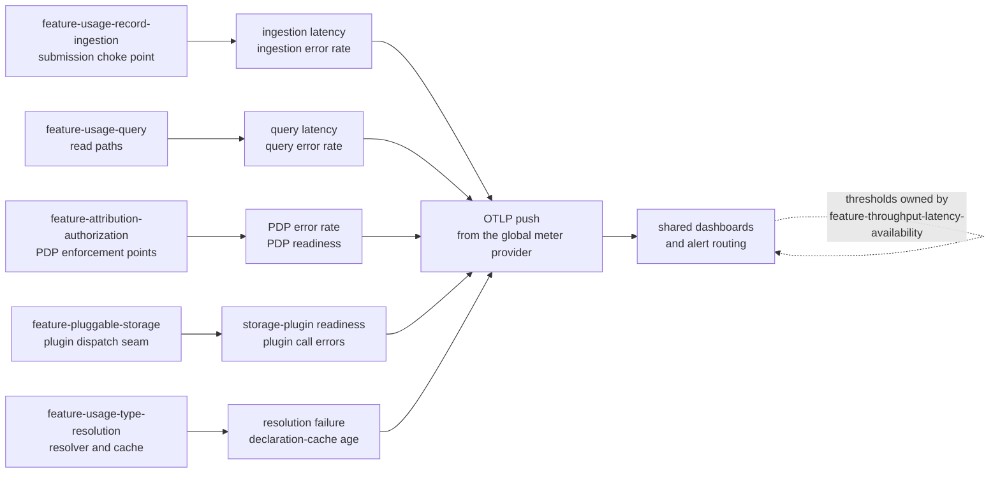

Created:  2026-09-25 by Virtuozzo International GmbH
Updated:  2026-09-25 by Virtuozzo International GmbH

# Feature: Operational Visibility & Telemetry

- [ ] `p2` - **ID**: `cpt-cf-usage-collector-featstatus-operational-visibility-implemented`

- [ ] `p2` - `cpt-cf-usage-collector-feature-operational-visibility`

Names the operational signal set the Usage Collector emits — the metrics for
ingestion latency and error rate, query latency, Policy Decision Point error
rate, storage-plugin readiness, and type resolution failure and cache staleness,
plus a structured log entry for every accepted and rejected operation — and
fixes how those signals are labelled, pushed, and routed to operators.

<!-- toc -->

- [1. Feature Context](#1-feature-context)
  - [1.1 Overview](#11-overview)
  - [1.2 Purpose](#12-purpose)
  - [1.3 Actors](#13-actors)
  - [1.4 References](#14-references)
- [2. Actor Flows (CDSL)](#2-actor-flows-cdsl)
  - [Diagnose a Degraded Gear From the Emitted Telemetry](#diagnose-a-degraded-gear-from-the-emitted-telemetry)
- [3. Processes / Business Logic (CDSL)](#3-processes--business-logic-cdsl)
  - [Bind a Completed Operation to Its Instruments](#bind-a-completed-operation-to-its-instruments)
  - [Emit the Structured Log Entry for an Operation](#emit-the-structured-log-entry-for-an-operation)
  - [Admit or Refuse a Proposed Metric Label](#admit-or-refuse-a-proposed-metric-label)
  - [Derive the Readiness Gauges](#derive-the-readiness-gauges)
- [4. States (CDSL)](#4-states-cdsl)
  - [Readiness Signal State Machine](#readiness-signal-state-machine)
- [5. Definitions of Done](#5-definitions-of-done)
  - [The Mandated Operator Treatments All Have a Backing Instrument](#the-mandated-operator-treatments-all-have-a-backing-instrument)
  - [Emission Is Pushed Over OTLP, With No Scrape Surface](#emission-is-pushed-over-otlp-with-no-scrape-surface)
  - [Instrument Names, Buckets, and Label Sets Are a Published Contract](#instrument-names-buckets-and-label-sets-are-a-published-contract)
  - [No Unbounded Identifier Is Ever a Metric Label](#no-unbounded-identifier-is-ever-a-metric-label)
  - [Every Accepted and Rejected Operation Emits a Correlated Log Entry](#every-accepted-and-rejected-operation-emits-a-correlated-log-entry)
  - [Readiness Is Published as a Structural Fact, Not a Probe](#readiness-is-published-as-a-structural-fact-not-a-probe)
  - [The Signals Reach Shared Dashboards and Alert Routing](#the-signals-reach-shared-dashboards-and-alert-routing)
- [6. Acceptance Criteria](#6-acceptance-criteria)

<!-- /toc -->

## 1. Feature Context

### 1.1 Overview

A cross-cutting contract feature. It owns the metric set as a set: the instrument
names, what each instrument observes, the closed label vocabularies, the rule
that emission is pushed rather than scraped, and the obligation that the signals
reach shared dashboards and alert routing. It owns no component, no endpoint, and
no gear-side table.

The code paths that produce the underlying events belong elsewhere. Ingestion
counts and times its own submissions, the query gateway counts and times its own
reads, every authorization point counts its own Policy Decision Point outcomes,
the plugin host derives its own readiness, and the type resolver counts its own
resolutions. Three of those features already declare their emission obligations,
and this document cites them rather than restating them. What this document adds
is coherence: one place where the whole set is named, so a reviewer can tell
whether every failure and latency mode the gear has is observable at all.

### 1.2 Purpose

Six operator treatments are mandated by name: ingestion latency, ingestion error
rate, query latency, Policy Decision Point (PDP, the platform service that
answers authorization questions) error rate, storage-plugin readiness, and GTS
(Global Type System) type resolution failure together with declaration-cache
staleness. Each of the six is a failure or latency mode of a specific sibling
feature. None of them is observable unless that feature emits the event, and none
of them is useful unless the emitted signal is named, labelled, and routed the
same way everywhere.

Two failure modes are being prevented. The first is a blind spot: a feature ships
its behaviour and its error paths, nobody writes down which instrument carries
its failures, and the gap only surfaces during an incident when the dashboard has
no series to draw. The second is unbounded label cardinality: a well-meant
`tenant_id` label turns a bounded counter into one series per tenant, the metric
pipeline degrades, and an opaque identifier becomes a per-person data point in a
telemetry store. Naming the set once, with its labels closed, closes both.

**Requirements**: `cpt-cf-usage-collector-nfr-operational-visibility`

**Principles**: `cpt-cf-usage-collector-principle-otlp-push-emission`

**Scope boundary.** This feature defines what is emitted and what is observable.
It does not define what must be true of the numbers. Every numeric target —
ingestion latency and throughput budgets, query latency budgets, the availability
objective, and the workload-isolation bound — belongs to
`cpt-cf-usage-collector-feature-throughput-latency-availability`. Every read-path
staleness floor and per-plugin ceiling belongs to
`cpt-cf-usage-collector-feature-consistency-freshness-contract`. The distinction
matters most for cache staleness. Publishing the age of the oldest served
declaration as a signal is this feature's obligation. Deciding what age is
tolerable is not. Quota-rejection and reconciliation counters are instruments in
the shared inventory, but the behaviour they observe, and the operator surface
they serve, belong to `cpt-cf-usage-collector-feature-rate-limiting-reconciliation`.

**Classification boundary.** What may appear in telemetry is bounded by
`cpt-cf-usage-collector-dod-operational-telemetry-class` and by
`cpt-cf-usage-collector-constraint-pii-identity-layer`. Telemetry must not turn
an opaque identifier into personal data. The rule this feature adds is narrower
and mechanical: an unbounded identifier is never a metric label, and where an
identifier is needed for diagnosis it goes into a structured log line or a trace,
where it is read by a human under access control rather than fanned out into a
permanent time series.

### 1.3 Actors

| Actor | Role in Feature |
|-------|-----------------|
| `cpt-cf-usage-collector-actor-platform-operator` | The central actor. Reads the dashboards, receives the routed alerts, and diagnoses a degraded gear from the emitted signals alone, without shell access to the process |
| `cpt-cf-usage-collector-actor-platform-developer` | Adds an instrument when adding a code path, and is bound by the naming and label rules this document fixes |
| `cpt-cf-usage-collector-actor-storage-backend` | The subject of the readiness gauge and of the plugin call duration and error instruments; its own backend-internal metrics stay under the plugin's own prefix and are not owned here |
| `cpt-cf-usage-collector-actor-types-registry` | The subject of the resolution-result counter and the declaration-cache age gauge; a sustained restore or error share is a statement about the registry rather than about this gear |
| `cpt-cf-usage-collector-actor-usage-source` | Supplies the correlation identifier on its inbound request and sees its own submissions counted by outcome and error category |
| `cpt-cf-usage-collector-actor-usage-consumer` | Sees its reads counted and timed by query kind, and its feed replay refusals surfaced as a distinct error category |
| `cpt-cf-usage-collector-actor-tenant-admin` | Reads no telemetry: the signals are gear-wide and carry no tenant label, so there is no per-tenant view to expose |

### 1.4 References

- **PRD**: [PRD.md](../PRD.md) — §6 Non-Functional Requirements,
  operational visibility (`cpt-cf-usage-collector-nfr-operational-visibility`);
  the type-resolution requirement whose failures the resolution instruments
  observe (`cpt-cf-usage-collector-fr-usage-type-resolution`)
- **Design**: [DESIGN.md](../DESIGN.md) — §2.1 Design Principles, OTLP push
  emission (`cpt-cf-usage-collector-principle-otlp-push-emission`); §3.11.4
  Observability Architecture Applicability; §3.11.5 Operational Metric
  Inventory, which is the normative instrument table this feature binds to;
  §3.11.6 Alerting and Error-Budget Architecture; §3.2 Component Model for the
  emitting components; §3.8 Deployment Topology for the collector endpoint and
  the replica-local nature of the per-instance gauges
- **ADR**:
  [Declaration rehydration](../ADR/0015-cpt-cf-usage-collector-adr-declaration-rehydration.md)
  (`cpt-cf-usage-collector-adr-declaration-rehydration`) — the decision that
  makes a restored resolution a distinct, separately countable result rather
  than an ordinary cache miss
- **Decomposition**: [DECOMPOSITION.md](../DECOMPOSITION.md) §2.14
- **Entities**: none. Telemetry is emitted about domain operations rather than
  modelled as a domain entity, so this feature adds no persisted shape and no
  gear-owned table.
- **Sequences**: none of its own. [DESIGN.md](../DESIGN.md) §3.6 defines six
  sequences — emit, invalidate, query-aggregated, query-raw, read-feed, and
  backfill — and none is dedicated to telemetry. Emission is a step inside each
  of them, in the features that own them.
- **Dependencies**: `cpt-cf-usage-collector-feature-usage-record-ingestion`,
  `cpt-cf-usage-collector-feature-usage-query`,
  `cpt-cf-usage-collector-feature-attribution-authorization`,
  `cpt-cf-usage-collector-feature-pluggable-storage`, and
  `cpt-cf-usage-collector-feature-usage-type-resolution`. Each metric is named
  after a failure or latency mode one of those five features owns, so each one
  has to be defined before the signal observing it can be specified.

**Metric-to-source mapping.** The diagram below maps each mandated operator
treatment to the sibling feature whose surface produces the event, and to the
single push path all of them share.

## 2. Actor Flows (CDSL)

One flow. It starts with the operator, adds no endpoint, and stops where a
threshold judgement begins, since thresholds belong to a sibling feature. The
flow is included because it is the acceptance test for the metric set as a whole:
if an operator cannot reach the responsible seam from the signals alone, the
inventory has a gap.

### Diagnose a Degraded Gear From the Emitted Telemetry

- [ ] `p2` - **ID**: `cpt-cf-usage-collector-flow-diagnose-from-telemetry`

**Actor**: `cpt-cf-usage-collector-actor-platform-operator`

**Success Scenarios**:
- A routed alert fires, and the operator separates a gear-side fault from a
  storage-backend fault by reading the readiness gauge and the plugin error
  counter beside the ingestion duration histogram.
- A rise in rejected submissions resolves to one error category, which names the
  responsible seam without any log reading.
- Ingestion is slow while the plugin call duration is flat, which places the
  delay inside the gear rather than behind the plugin seam.

**Error Scenarios**:
- The rise is in a category the gear does not own, such as an unresolved type,
  so the diagnosis ends at the type registry and the operator escalates outward.
- Every instrument is healthy while a consumer reports missing data, so the
  signals exonerate the gear and the investigation moves to the consumer.
- The readiness gauge reads zero at bootstrap because no submission has bound a
  plugin yet, which is an expected cold state rather than a fault.

**Steps**:
1. [ ] - `p2` - Operator receives an alert routed from the shared platform alerting surface, naming the breached signal and the gear - `inst-diagnose-alert`
2. [ ] - `p2` - Operator opens the gear dashboard and reads the readiness gauges for the storage plugin and for the authorization client - `inst-diagnose-readiness`
3. [ ] - `p2` - **IF** the storage-plugin readiness gauge reads zero - `inst-diagnose-unready`
   1. [ ] - `p2` - Read the plugin error counter by error category to separate an unready dispatch from a backend error or a timeout - `inst-diagnose-plugin-errors`
   2. [ ] - `p2` - **RETURN** a diagnosis pointing at the plugin binding or the storage backend, which `cpt-cf-usage-collector-feature-pluggable-storage` owns - `inst-diagnose-return-plugin`
4. [ ] - `p2` - **ELSE IF** the authorization failure counter is rising against total requests - `inst-diagnose-pdp`
   1. [ ] - `p2` - **RETURN** a diagnosis pointing at the Policy Decision Point, corroborated by its readiness gauge, which `cpt-cf-usage-collector-feature-attribution-authorization` owns - `inst-diagnose-return-pdp`
5. [ ] - `p2` - **ELSE IF** the resolution counter shows a rising unresolved or registry-error share, or the declaration-cache age gauge is climbing - `inst-diagnose-resolution`
   1. [ ] - `p2` - **RETURN** a diagnosis pointing at the type registry, which `cpt-cf-usage-collector-feature-usage-type-resolution` observes and the registry actor owns - `inst-diagnose-return-registry`
6. [ ] - `p2` - **ELSE** read the ingestion and query duration histograms beside the plugin call duration histogram to place the delay on one side of the plugin seam - `inst-diagnose-durations`
7. [ ] - `p2` - Read the per-entry ingestion counter by outcome and error category to see whether the load itself changed, and read the in-flight query gauge to see whether reads and writes are contending - `inst-diagnose-load`
8. [ ] - `p2` - Pick one affected operation, take its correlation identifier from the structured log entry the gear emitted for it, and follow it into the platform gateway access log - `inst-diagnose-correlate`
9. [ ] - `p2` - **RETURN** the responsible seam and the correlated operation. Judging the numbers against a target belongs to `cpt-cf-usage-collector-feature-throughput-latency-availability` - `inst-diagnose-return`

## 3. Processes / Business Logic (CDSL)

Four routines. The first two run on every completed operation, inside the
components the sibling features own. The third is a design-time admission rule
applied once per proposed label. The fourth derives the readiness gauges from
structural facts rather than from a probe.

### Bind a Completed Operation to Its Instruments

- [ ] `p2` - **ID**: `cpt-cf-usage-collector-algo-metric-emission-binding`

**Input**: one completed operation — a submission request, a submitted entry, a
query attempt, a feed page request, an authorization decision, a plugin
dispatch, or a declaration resolution — together with its outcome and its
elapsed time

**Output**: the counter and histogram observations that operation owes, each
carrying labels drawn only from the closed vocabularies fixed for it

**Steps**:
1. [ ] - `p2` - Identify the emitting component from the seam the operation completed at, since each instrument has exactly one emitting component in the inventory - `inst-bind-component`
2. [ ] - `p2` - **IF** the operation is a submission or a submitted entry - `inst-bind-ingestion`
   1. [ ] - `p2` - Emit the observations `cpt-cf-usage-collector-dod-ingestion-telemetry` already requires, and add nothing to them here - `inst-bind-ingestion-emit`
3. [ ] - `p2` - **ELSE IF** the operation is a declaration resolution or a mirror write - `inst-bind-resolution`
   1. [ ] - `p2` - Emit the observations `cpt-cf-usage-collector-dod-resolution-telemetry` already requires, and add nothing to them here - `inst-bind-resolution-emit`
4. [ ] - `p2` - **ELSE IF** the operation is a query attempt or a feed page request - `inst-bind-read`
   1. [ ] - `p2` - Increment the matching request counter, labelled with the query kind where the surface has kinds, with the outcome, and with an error category that is the neutral value on success - `inst-bind-read-counter`
   2. [ ] - `p2` - Record the elapsed time on the matching duration histogram, whose buckets bracket the published query budget - `inst-bind-read-duration`
   3. [ ] - `p2` - Record the response size on the matching result-size histogram, so an unexpected latency can be separated from an unexpected result volume - `inst-bind-read-size`
5. [ ] - `p2` - **ELSE IF** the operation is an authorization decision - `inst-bind-authz`
   1. [ ] - `p2` - Record exactly one outcome per authorization: either one effective decision of permit or deny, or one failure, never both and never neither - `inst-bind-authz-exclusive`
   2. [ ] - `p2` - Treat a denial as a decision rather than a failure, and reserve the failure counter for an unreachable or timed-out Policy Decision Point - `inst-bind-authz-deny-not-failure`
   3. [ ] - `p2` - Record the elapsed time on the authorization duration histogram, labelled by the operation being authorized - `inst-bind-authz-duration`
6. [ ] - `p2` - **ELSE IF** the operation is a plugin dispatch - `inst-bind-plugin`
   1. [ ] - `p2` - Record the elapsed time on the plugin call duration histogram, labelled by the dispatched operation, so the time spent behind the plugin seam is separable from the gear's own time - `inst-bind-plugin-duration`
   2. [ ] - `p2` - **IF** the dispatch failed - `inst-bind-plugin-failed`
      1. [ ] - `p2` - Increment the plugin error counter, labelled by the dispatched operation and by an error category that separates an unready seam, a backend error, and a timeout - `inst-bind-plugin-error`
7. [ ] - `p2` - Emit every observation on the path that produced the outcome, including the rejection paths, so a refusal is as visible as an acceptance - `inst-bind-cover-rejections`
8. [ ] - `p2` - Let no emission failure change the operation's outcome: a dropped observation is a lost signal, never a rejected request - `inst-bind-never-fail-caller`
9. [ ] - `p2` - **RETURN** the emitted observations - `inst-bind-return`

Step 8 is the rule that keeps telemetry off the critical path. Step 7 is the one
that keeps the error-category labels useful, because a category only separates
causes if every path reaching it is counted.

### Emit the Structured Log Entry for an Operation

- [ ] `p2` - **ID**: `cpt-cf-usage-collector-algo-telemetry-log-correlation`

**Input**: one completed API operation, accepted or rejected, together with the
correlation identifier carried on the inbound platform-resolved security context

**Output**: one structured log entry for that operation, carrying the
correlation identifier unchanged

**Steps**:
1. [ ] - `p2` - Take the correlation identifier from the inbound security context rather than generating one, so the gear's record and the platform gateway's record name the same operation - `inst-log-take-correlation`
2. [ ] - `p2` - Carry the identifier through unchanged: do not re-encode it, truncate it, prefix it, or replace it on an internal hop - `inst-log-unchanged`
3. [ ] - `p2` - Emit exactly one entry per completed operation, on the accepting path and on every rejecting path alike, so the log count matches the request counter - `inst-log-one-per-operation`
4. [ ] - `p2` - Record the operation name, the effective outcome, and the error category on a rejection, using the same closed vocabulary the counters use, so a log line and a metric point agree - `inst-log-shared-vocabulary`
5. [ ] - `p2` - Place the diagnostic identifiers that may not be metric labels — the tenant, the subject, the resource, and the referenced type — in the log entry instead, carried as the opaque strings `cpt-cf-usage-collector-algo-opaque-identifier-handling` requires - `inst-log-identifiers-here`
6. [ ] - `p2` - Include no caller-supplied metadata value and no invalidation reason text, since those are opaque to the gear and are not diagnostic of its own behaviour - `inst-log-no-metadata`
7. [ ] - `p2` - Attach the entry to the ambient trace context propagated with the request, so the log, the trace, and the metric point are reachable from one another - `inst-log-trace-context`
8. [ ] - `p2` - **RETURN** the emitted entry - `inst-log-return`

Step 5 is the deliberate split between the two signal kinds. An unbounded
identifier costs one field in a log entry and one permanent time series in a
metric store, which is why it is admitted in the first and refused in the second.

### Admit or Refuse a Proposed Metric Label

- [ ] `p2` - **ID**: `cpt-cf-usage-collector-algo-telemetry-label-admission`

**Input**: one proposed label for an instrument — its name and the set of values
it can take

**Output**: admitted with its closed value set recorded, or refused with the
place the value belongs instead

**Steps**:
1. [ ] - `p2` - Enumerate the values the label can take over the life of the deployment, counting every value the code can produce rather than the values seen so far - `inst-label-enumerate`
2. [ ] - `p2` - **IF** the enumeration is open, or grows with tenants, subjects, resources, declared types, requests, traces, or idempotency keys - `inst-label-unbounded`
   1. [ ] - `p2` - Refuse the label, and place the value in the structured log entry or on the trace instead, per `cpt-cf-usage-collector-algo-telemetry-log-correlation` - `inst-label-refuse`
3. [ ] - `p2` - **ELSE IF** the value is caller-supplied and reaches the instrument before validation has bounded it - `inst-label-unvalidated`
   1. [ ] - `p2` - Refuse the label on that instrument, and carry the affected volume on a separate unlabelled counter rather than guessing a value - `inst-label-separate-counter`
4. [ ] - `p2` - **ELSE** admit the label, and record its closed value set as part of the instrument's published contract - `inst-label-admit`
5. [ ] - `p2` - Include a neutral value in every error-category set, so a success and a failure of the same operation stay comparable on one series - `inst-label-neutral-value`
6. [ ] - `p2` - Treat the metric pipeline's own cardinality limit as a safety net for a rule breach, never as the mechanism that enforces this rule - `inst-label-limit-is-net`
7. [ ] - `p2` - Re-run this admission whenever a label's value set is widened, because widening a closed set changes the published contract - `inst-label-rerun-on-change`
8. [ ] - `p2` - **RETURN** the verdict and, on a refusal, the signal that carries the value instead - `inst-label-return`

Step 3 exists because one real case needs it. A submission rejected for exceeding
its allowance is refused before its entry type is known, so the per-entry counter
cannot carry it, and the throttled volume rides an unlabelled counter instead.

### Derive the Readiness Gauges

- [ ] `p2` - **ID**: `cpt-cf-usage-collector-algo-readiness-signal-derivation`

**Input**: the current binding state of the storage plugin selector and of the
authorization client, both held in the running replica

**Output**: the two readiness gauge values for that replica

**Steps**:
1. [ ] - `p2` - Derive storage-plugin readiness from two structural facts together: the selector has cached a plugin instance identifier, and a handle for that instance is currently obtainable - `inst-ready-plugin-derive`
2. [ ] - `p2` - Publish one when both facts hold and zero otherwise, treating the gauge as a statement about the binding rather than about the backend's health - `inst-ready-plugin-publish`
3. [ ] - `p2` - Issue no probe call to the plugin to compute this value: the plugin seam exposes no health operation, and inventing traffic to fill a gauge would change the behaviour it claims to observe - `inst-ready-no-probe`
4. [ ] - `p2` - Treat the cold state before the first binding as an expected zero rather than a fault, because the binding is established lazily on first use - `inst-ready-cold-state`
5. [ ] - `p2` - Derive authorization readiness from the bootstrap fact that the authorization client is bound in the enforcement helper the replica constructed at startup - `inst-ready-pdp-derive`
6. [ ] - `p2` - Publish the authorization readiness gauge as corroboration for the failure counter rather than as a substitute: a bound client can still fail every call - `inst-ready-pdp-corroborates`
7. [ ] - `p2` - Mark both gauges, and every other per-replica gauge, as replica-local, and require aggregation across replicas by a maximum or a last value rather than by a sum - `inst-ready-per-replica`
8. [ ] - `p2` - **RETURN** the two gauge values - `inst-ready-return`

Step 7 matters beyond readiness. The cached-declaration count and the
declaration-cache age gauge are per replica for the same reason, and summing
either one across replicas produces a number that describes no deployment.

## 4. States (CDSL)

### Readiness Signal State Machine

- [ ] `p2` - **ID**: `cpt-cf-usage-collector-state-readiness-signal`

The storage-plugin readiness signal has a genuine lifecycle, because its zero
value means two different things at two different times and an operator must
tell them apart. Before the first dispatch the binding is simply not yet
established, and after a successful binding a zero is a fault. The states below
are per replica and describe the signal, not the storage backend, whose own
health the gear does not probe.

**States**: `Unbound`, `Ready`, `Unready`

**Initial State**: `Unbound`

**Transitions**:
1. [ ] - `p2` - **FROM** `Unbound` **TO** `Ready` **WHEN** the first dispatch resolves a plugin instance identifier and a handle for it, and the gauge publishes one - `inst-ready-state-bind`
2. [ ] - `p2` - **FROM** `Unbound` **TO** `Unbound` **WHEN** a dispatch is attempted and no plugin resolves, which is counted as an unready dispatch while the gauge stays at zero - `inst-ready-state-still-unbound`
3. [ ] - `p2` - **FROM** `Ready` **TO** `Unready` **WHEN** a handle is no longer obtainable for the cached instance identifier, and the gauge falls to zero after having read one - `inst-ready-state-lost`
4. [ ] - `p2` - **FROM** `Unready` **TO** `Ready` **WHEN** a handle becomes obtainable again and the gauge returns to one - `inst-ready-state-recovered`
5. [ ] - `p2` - **FROM** `Ready` or `Unready` **TO** `Unbound` **WHEN** the replica restarts and the cached instance identifier is lost with it - `inst-ready-state-restart`

A backend error does not move this machine. A plugin whose backend is failing
every call is still bound, so the gauge stays at one while the plugin error
counter rises, and the two signals are read together rather than one standing in
for the other.

## 5. Definitions of Done

Each entry names the feature whose surface emits the signal, because this feature
emits nothing of its own. Three of the obligations below are already declared by
sibling features and are cited rather than restated.

### The Mandated Operator Treatments All Have a Backing Instrument

- [ ] `p2` - **ID**: `cpt-cf-usage-collector-dod-metric-inventory-completeness`

The system **MUST** carry a named instrument for each of the six mandated
operator treatments: ingestion latency, ingestion error rate, query latency,
Policy Decision Point error rate, storage-plugin readiness, and GTS type
resolution failure together with declaration-cache staleness. Each of the six
**MUST** be traceable from this feature to an instrument in the inventory and
from that instrument to the single component that emits it. A code path that
produces a new failure mode **MUST** either map onto an existing error category
or add one, so no failure mode is unobservable.

**Emitted by**: `cpt-cf-usage-collector-feature-usage-record-ingestion` under
`cpt-cf-usage-collector-dod-ingestion-telemetry` for the first two;
`cpt-cf-usage-collector-feature-usage-query` for query latency and the query
error categories; `cpt-cf-usage-collector-feature-attribution-authorization` at
every enforcement point for the Policy Decision Point signals;
`cpt-cf-usage-collector-feature-pluggable-storage` for readiness and plugin
errors; and `cpt-cf-usage-collector-feature-usage-type-resolution` under
`cpt-cf-usage-collector-dod-resolution-telemetry` for resolution failure and
cache age.

**Implements**:
- `cpt-cf-usage-collector-algo-metric-emission-binding`

**Touches**:
- API: none — telemetry is emitted alongside the existing endpoints rather than
  exposed as one
- Component: `cpt-cf-usage-collector-component-ingestion-gateway`,
  `cpt-cf-usage-collector-component-query-gateway`,
  `cpt-cf-usage-collector-component-plugin-host`,
  `cpt-cf-usage-collector-component-type-resolver`

### Emission Is Pushed Over OTLP, With No Scrape Surface

- [ ] `p2` - **ID**: `cpt-cf-usage-collector-dod-otlp-push-emission`

The system **MUST** construct every instrument through the platform's global
meter provider at bootstrap, under one instrumentation scope for the gear, and
**MUST** export them by pushing over OTLP (the OpenTelemetry Protocol) to the
configured collector endpoint. It **MUST NOT** expose a metrics scrape endpoint
on any of its own surfaces, and no route, port, or handler **MAY** be added for
one. It **MUST** propagate the inbound trace context on the ambient span, so a
trace spans the gateway, the gear core, the plugin, and the backend.

**Emitted by**: every emitting component, since the provider is bootstrap-wide.
`cpt-cf-usage-collector-feature-pluggable-storage` owns the span the plugin host
opens around each dispatch, which is what extends a trace past the plugin seam.

**Implements**:
- `cpt-cf-usage-collector-algo-metric-emission-binding`

**Touches**:
- API: none — the absence of a scrape endpoint is part of this obligation
- Component: `cpt-cf-usage-collector-component-plugin-host`

### Instrument Names, Buckets, and Label Sets Are a Published Contract

- [ ] `p2` - **ID**: `cpt-cf-usage-collector-dod-metric-naming-contract`

The system **MUST** treat every instrument name, every histogram bucket layout,
and every label value set as part of its published operational contract. Names
**MUST** share one substitutable prefix so a deployment can namespace the whole
set at once. Histogram buckets **MUST** bracket the published latency budgets, so
a breach falls inside the measurable range rather than in an open top bucket.
Renaming an instrument, removing a label, or narrowing a bucket layout **MUST**
be treated as a breaking change for the dashboards and alert rules built on it,
under `cpt-cf-usage-collector-feature-contract-stability`.

**Emitted by**: all five source features jointly. The contract is checked where
the instruments are constructed, which is the bootstrap path every component
shares.

**Implements**:
- `cpt-cf-usage-collector-algo-metric-emission-binding`
- `cpt-cf-usage-collector-algo-telemetry-label-admission`

**Touches**:
- API: none
- Component: `cpt-cf-usage-collector-component-ingestion-gateway`,
  `cpt-cf-usage-collector-component-query-gateway`

### No Unbounded Identifier Is Ever a Metric Label

- [ ] `p2` - **ID**: `cpt-cf-usage-collector-dod-metric-label-cardinality-bound`

The system **MUST** draw every metric label from a closed, enumerated value set
fixed at design time. It **MUST NOT** use a tenant identifier, subject
identifier, resource identifier, GTS type reference, request identifier, trace
identifier, or idempotency key as a metric label on any instrument. Where such a
value is needed for diagnosis it **MUST** be carried on the structured log entry
or the trace instead. The metric pipeline's cardinality limit **MUST** be
configured as a safety net and **MUST NOT** be relied on as the enforcement
mechanism. A plugin's own backend-internal series **MUST** stay under the
plugin's own prefix and are not covered by this rule.

**Emitted by**: every emitting component. The rule is enforced where the
instruments are declared, and it is what keeps
`cpt-cf-usage-collector-dod-operational-telemetry-class` true of the metric
signal: an opaque identifier never becomes a permanent per-subject series.

**Implements**:
- `cpt-cf-usage-collector-algo-telemetry-label-admission`

**Constraints**: `cpt-cf-usage-collector-constraint-pii-identity-layer`

**Touches**:
- API: none
- Component: `cpt-cf-usage-collector-component-ingestion-gateway`,
  `cpt-cf-usage-collector-component-query-gateway`,
  `cpt-cf-usage-collector-component-type-resolver`

### Every Accepted and Rejected Operation Emits a Correlated Log Entry

- [ ] `p2` - **ID**: `cpt-cf-usage-collector-dod-telemetry-log-correlation`

The system **MUST** emit exactly one structured log entry for every completed API
operation, accepted or rejected alike, carrying the correlation identifier
propagated unchanged from the inbound platform-resolved security context. The
entry **MUST** name the operation, its effective outcome, and its error category
on a rejection, drawn from the same closed vocabulary the counters use. It
**MUST** carry the opaque tenant, subject, and resource identifiers that the
metric labels may not carry, and **MUST NOT** carry caller-supplied metadata
values or invalidation reason text.

**Emitted by**: `cpt-cf-usage-collector-feature-usage-record-ingestion` on the
write surfaces, `cpt-cf-usage-collector-feature-usage-query` on the read
surfaces, and `cpt-cf-usage-collector-feature-attribution-authorization` at the
gate, whose decision determines the outcome a rejected operation logs.

**Implements**:
- `cpt-cf-usage-collector-algo-telemetry-log-correlation`

**Constraints**: `cpt-cf-usage-collector-constraint-pii-identity-layer`

**Touches**:
- API: none — the obligation binds every existing operation rather than adding
  one
- Component: `cpt-cf-usage-collector-component-ingestion-gateway`,
  `cpt-cf-usage-collector-component-query-gateway`,
  `cpt-cf-usage-collector-component-feed-gateway`

### Readiness Is Published as a Structural Fact, Not a Probe

- [ ] `p2` - **ID**: `cpt-cf-usage-collector-dod-readiness-signals`

The system **MUST** publish a storage-plugin readiness gauge derived from two
structural facts together — a cached plugin instance identifier and a currently
obtainable handle for it — and **MUST NOT** issue any probe call to the plugin to
compute it. It **MUST** publish an authorization readiness gauge derived from the
bootstrap binding of the authorization client. Both gauges, and every other
per-replica gauge, **MUST** be documented as replica-local and aggregated across
replicas by a maximum or a last value rather than by a sum.

**Emitted by**: `cpt-cf-usage-collector-feature-pluggable-storage`, whose lazy
binding under `cpt-cf-usage-collector-dod-plugin-lazy-binding` is exactly the
structural fact the plugin gauge reads, and
`cpt-cf-usage-collector-feature-attribution-authorization` for the authorization
gauge.

**Implements**:
- `cpt-cf-usage-collector-algo-readiness-signal-derivation`
- `cpt-cf-usage-collector-state-readiness-signal`

**Touches**:
- API: none
- Component: `cpt-cf-usage-collector-component-plugin-host`
- Interface: `cpt-cf-usage-collector-interface-plugin`

### The Signals Reach Shared Dashboards and Alert Routing

- [ ] `p2` - **ID**: `cpt-cf-usage-collector-dod-telemetry-dashboard-routing`

The system's operational signals **MUST** be integrated into the shared platform
dashboards and alert routing rather than into a gear-local view, so that an
operator on the platform rotation receives them without configuring this gear
specially. Each of the six mandated operator treatments **MUST** appear on the
dashboard and **MUST** have a routed alert defined over it. The alert
definitions **MUST** name the backing instruments this feature fixes, while the
numeric thresholds they compare against **MUST** come from
`cpt-cf-usage-collector-feature-throughput-latency-availability` for the latency,
throughput, and availability signals, and from
`cpt-cf-usage-collector-feature-consistency-freshness-contract` for the
freshness-related ones. This feature **MUST NOT** state a threshold value of its
own.

**Emitted by**: all five source features jointly, through the push path
`cpt-cf-usage-collector-dod-otlp-push-emission` establishes. Routing and
on-call assignment are platform-owned once the signals arrive.

**Implements**:
- `cpt-cf-usage-collector-algo-metric-emission-binding`
- `cpt-cf-usage-collector-algo-readiness-signal-derivation`

**Touches**:
- API: none
- Component: `cpt-cf-usage-collector-component-ingestion-gateway`,
  `cpt-cf-usage-collector-component-query-gateway`

## 6. Acceptance Criteria

Each criterion is asserted inside the surface named in its Definition of Done,
since this feature runs no code path of its own.

- [ ] Each of the six mandated operator treatments maps to a named instrument and
  to exactly one emitting component, verified by a review checklist that
  enumerates the inventory and leaves no treatment unmapped
  (`cpt-cf-usage-collector-nfr-operational-visibility`)
- [ ] A rejected submission increments the per-entry ingestion counter with the
  outcome set to rejected and a non-neutral error category, and a successful one
  increments the same counter with the neutral category, so the two are
  comparable on one series (`cpt-cf-usage-collector-dod-ingestion-telemetry`)
- [ ] A rejected aggregation query increments the query request counter with its
  query kind, the error outcome, and the error category naming the cause, and the
  same request also records a point on the query duration histogram
- [ ] An authorization that the Policy Decision Point denies increments the
  decision counter with a deny value and leaves the failure counter unchanged,
  while an unreachable Policy Decision Point increments the failure counter and
  leaves the decision counter unchanged
- [ ] Exactly one authorization outcome is recorded per enforcement point per
  request: a test that drives permit, deny, and unreachable in turn observes one
  increment in each case and never two
- [ ] A declaration resolved from the mirror after a registry restart is counted
  as a restored result, distinct from both a cache hit and a cache miss
  (`cpt-cf-usage-collector-adr-declaration-rehydration`)
- [ ] The declaration-cache age gauge reports the age of the oldest served
  declaration since its last successful refresh, rises while refreshes fail, and
  returns to a low value after a successful refresh
  (`cpt-cf-usage-collector-dod-resolution-telemetry`)
- [ ] A metric scrape attempt against every port the gear opens finds no metrics
  endpoint, while the configured collector receives the instruments over OTLP
  within one export interval
  (`cpt-cf-usage-collector-principle-otlp-push-emission`)
- [ ] All instruments are constructed through the global meter provider under one
  instrumentation scope, verified by asserting the scope name on the exported
  payload rather than by reading the construction site
- [ ] A test that exercises every code path emitting a metric observes only label
  values drawn from the enumerated sets, and a source scan finds no tenant,
  subject, resource, type reference, request identifier, trace identifier, or
  idempotency key passed as a label
  (`cpt-cf-usage-collector-constraint-pii-identity-layer`)
- [ ] A submission rejected for exceeding its allowance leaves the per-entry
  ingestion counter unchanged and increments the unlabelled throttled-volume
  counter by the submitted entry count, since the entry type is not yet validated
  at the charge point (`cpt-cf-usage-collector-fr-rate-limiting`)
- [ ] Every completed API operation produces exactly one structured log entry,
  verified by driving a mixed accepted and rejected workload and asserting that
  the log entry count equals the request counter total
  (`cpt-cf-usage-collector-nfr-operational-visibility`)
- [ ] The correlation identifier in each log entry is byte-identical to the one on
  the inbound security context, including for a rejected operation and for one
  rejected before any storage dispatch
- [ ] A log entry contains no caller-supplied metadata value and no invalidation
  reason text, verified on a submission whose metadata and reason code carry
  recognizable marker strings
  (`cpt-cf-usage-collector-dod-operational-telemetry-class`)
- [ ] The storage-plugin readiness gauge reads zero before the first dispatch
  binds a plugin, reads one after a successful binding, and returns to zero when a
  handle stops being obtainable for the cached instance identifier
  (`cpt-cf-usage-collector-dod-plugin-lazy-binding`)
- [ ] The readiness gauge stays at one while the plugin returns backend errors on
  every call, and the plugin error counter rises instead, which shows the gauge
  reports the binding rather than the backend
- [ ] No probe call reaches the plugin for the purpose of computing readiness: a
  dispatch-counting plugin double observes calls only from real operations
- [ ] Every per-replica gauge is documented as replica-local with a maximum or
  last aggregation, and a two-replica deployment shows that summing the
  cached-declaration count would misreport the cache size
- [ ] A histogram bucket boundary exists at each published latency budget, so a
  breach of that budget is measurable rather than falling into an unbounded top
  bucket (`cpt-cf-usage-collector-nfr-ingestion-latency`,
  `cpt-cf-usage-collector-nfr-query-latency`)
- [ ] Renaming an instrument, dropping a label, or narrowing a bucket layout is
  caught by the surface-compatibility gate as a breaking change rather than
  shipping silently (`cpt-cf-usage-collector-adr-contract-stability`)
- [ ] Each of the six mandated treatments appears on the shared platform dashboard
  and has a routed alert defined over the named backing instruments, verified by a
  dashboard and alert review before release
  (`cpt-cf-usage-collector-nfr-operational-visibility`)
- [ ] This document states no numeric threshold: a review finds every alert
  threshold defined in
  `cpt-cf-usage-collector-feature-throughput-latency-availability` or
  `cpt-cf-usage-collector-feature-consistency-freshness-contract`, and this
  document naming only what is emitted
- [ ] An operator given only the emitted signals reaches the responsible seam for
  a plugin outage, a Policy Decision Point outage, a registry outage, and a
  gear-side slowdown, without shell access to the running process
