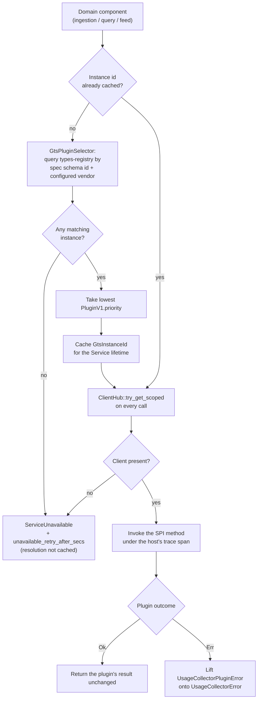

Created:  2026-09-25 by Virtuozzo International GmbH
Updated:  2026-09-25 by Virtuozzo International GmbH

# Feature: Pluggable Storage & Plugin Hosting

- [ ] `p1` - **ID**: `cpt-cf-usage-collector-featstatus-pluggable-storage-implemented`

- [ ] `p1` - `cpt-cf-usage-collector-feature-pluggable-storage`

Specifies the Plugin Host: the single seam through which every Usage Collector
component reaches durable state. Covers lazy, operator-configured resolution of
the active storage plugin, dispatch across the Plugin SPI, classification of
plugin errors, and fail-closed behavior when no plugin is bound.

<!-- toc -->

- [1. Feature Context](#1-feature-context)
  - [1.1 Overview](#11-overview)
  - [1.2 Purpose](#12-purpose)
  - [1.3 Actors](#13-actors)
  - [1.4 References](#14-references)
- [2. Actor Flows (CDSL)](#2-actor-flows-cdsl)
  - [Operator Selects the Active Storage Backend](#operator-selects-the-active-storage-backend)
  - [Storage Plugin Publishes Itself at Startup](#storage-plugin-publishes-itself-at-startup)
- [3. Processes / Business Logic (CDSL)](#3-processes--business-logic-cdsl)
  - [Lazy Plugin Binding Resolution](#lazy-plugin-binding-resolution)
  - [Storage Call Dispatch Through the Plugin SPI](#storage-call-dispatch-through-the-plugin-spi)
  - [Plugin Error Classification](#plugin-error-classification)
  - [Plugin Conformance Verification](#plugin-conformance-verification)
- [4. States (CDSL)](#4-states-cdsl)
- [5. Definitions of Done](#5-definitions-of-done)
  - [Plugin SPI as the Only Persistence and Query Route](#plugin-spi-as-the-only-persistence-and-query-route)
  - [Lazy Binding Resolution and Per-Call Scoped Lookup](#lazy-binding-resolution-and-per-call-scoped-lookup)
  - [Operator Backend Selection by Configuration](#operator-backend-selection-by-configuration)
  - [Fail-Closed Unavailability with No Substituted Binding](#fail-closed-unavailability-with-no-substituted-binding)
  - [Dispatch Without Re-Validation or Re-Interpretation](#dispatch-without-re-validation-or-re-interpretation)
  - [Plugin Error Taxonomy Mapping](#plugin-error-taxonomy-mapping)
  - [Published Plugin Conformance Suite](#published-plugin-conformance-suite)
- [6. Acceptance Criteria](#6-acceptance-criteria)

<!-- /toc -->

## 1. Feature Context

### 1.1 Overview

The Plugin Host is the single seam through which every domain component of the
Usage Collector reaches durable state. It resolves the operator-selected storage
plugin lazily, on the first dispatch, through `types-registry` and `ClientHub`,
then dispatches persistence, query, and feed calls to that plugin and maps the
plugin's errors onto the gear's error taxonomy. Where no plugin can be reached,
the call is refused rather than served from a substitute.

**Traces to**: `cpt-cf-usage-collector-fr-pluggable-storage`

### 1.2 Purpose

Usage Collector must run on whichever storage technology a deployment already
operates, and no operator may be locked into one backend. This feature makes
that possible by keeping the gear ignorant of storage: the core carries no
backend SQL dialect, no schema, no index assumption, and no client library, and
it has no compile-time dependency on any plugin crate. An operator changes the
active backend by changing one configuration value, with no Usage Collector
release and no change to product behavior.

The seam covers usage entries — the append-only ledger and the reads over it —
and nothing else. GTS type declarations (the registry-owned statements of a
meter's fold, unit, metadata surface, and retention) stay with `types-registry`
and reach the gear through the Type Resolver, so a plugin never persists,
serves, or enforces integrity against a declaration.

This feature owns the Plugin SPI (**service provider interface**: the Rust trait
a storage extension implements) as a *dispatch mechanism*. The versioning and
stability guarantees of that same trait as a public surface belong to
`cpt-cf-usage-collector-feature-contract-stability`, which this document
references and does not absorb.

**Requirements**: `cpt-cf-usage-collector-fr-pluggable-storage`

**Principles**: `cpt-cf-usage-collector-principle-pluggable-storage`,
`cpt-cf-usage-collector-principle-plugin-resolution-via-client-hub`

**Constraints**: `cpt-cf-usage-collector-constraint-vendor-pluggable`,
`cpt-cf-usage-collector-constraint-no-type-catalog`

**Component**: `cpt-cf-usage-collector-component-plugin-host`

### 1.3 Actors

| Actor | Role in Feature |
|-------|-----------------|
| `cpt-cf-usage-collector-actor-platform-operator` | Selects the active backend by setting `gears.usage-collector.config.vendor`, and operates the deployment that the bound plugin serves |
| `cpt-cf-usage-collector-actor-storage-backend` | The data store behind the bound plugin. Its plugin implements the Plugin SPI, publishes its GTS instance, and registers its scoped client at startup |
| `cpt-cf-usage-collector-actor-types-registry` | Holds the published plugin instances the host selects among, and answers the selector query that resolves the active binding |

### 1.4 References

- **PRD**: [PRD.md](../PRD.md) — §5.4 Pluggable Storage
- **Design**: [DESIGN.md](../DESIGN.md) — §3.2 Plugin Host, §3.3 Plugin SPI and
  Lazy plugin binding, §3.5 Storage Plugin SPI, §3.8 Gear configuration
- **ADR**: [ADR-0002](../ADR/0002-cpt-cf-usage-collector-adr-pluggable-storage.md)
  (`cpt-cf-usage-collector-adr-pluggable-storage`) — the storage plugin behind an
  SPI, chosen over an embedded backend and a compiled-in driver registry
- **DECOMPOSITION**: [DECOMPOSITION.md](../DECOMPOSITION.md) — entry 2.3
- **Dependencies**: None. This is a tier-0 foundation feature; it reads no other
  feature's output. Ten of the other thirteen features depend on it, all but its
  two foundation peers and data classification.

**Data**: None. The gear declares no database or table of its own for this
feature. The entry ledger is wholly plugin-owned and reached only through the
Plugin SPI, so there is no gear-side schema to specify here.

## 2. Actor Flows (CDSL)

### Operator Selects the Active Storage Backend

- [ ] `p1` - **ID**: `cpt-cf-usage-collector-flow-plugin-vendor-selection`

**Actor**: `cpt-cf-usage-collector-actor-platform-operator`

**Success Scenarios**:
- The operator sets `gears.usage-collector.config.vendor` to a vendor whose
  plugin is present in the deployment, restarts the gear, and the next dispatch
  binds to that vendor's plugin. No Usage Collector release is involved, and no
  product behavior changes.
- The operator leaves the value absent. Configuration defaults apply, and the
  gear behaves exactly as if the default vendor had been written out.

**Error Scenarios**:
- The configured vendor publishes no plugin instance. Startup still succeeds,
  because no registry query runs at `Gear::init`. The first dispatch that needs
  storage fails resolution and answers `ServiceUnavailable`, carrying
  `unavailable_retry_after_secs` as its retry delay.
- The operator edits the value while the gear is running. The change has no
  effect until restart, because configuration is read once at `Gear::init`.
- Two instances of the configured vendor publish the same priority. The ordering
  between them is not pinned, so the deployment must not rely on which one wins.

**Steps**:
1. [ ] - `p1` - Operator sets `gears.usage-collector.config.vendor` in the gear's typed configuration (`cpt-cf-usage-collector-topology-deployment-config`) - `inst-vendor-config-set`
2. [ ] - `p1` - Operator restarts the gear, since configuration is read once at `Gear::init` and no hot reload exists - `inst-vendor-restart`
3. [ ] - `p1` - Gear reads the vendor value at `Gear::init` and validates the configuration before anything is wired; a failure names the offending key and aborts startup - `inst-vendor-read-init`
4. [ ] - `p1` - Gear runs **no** `types-registry` query at `Gear::init`; the binding stays unresolved until a call needs it - `inst-vendor-no-init-query`
5. [ ] - `p1` - **ON** the first dispatch that needs storage, the host resolves the binding using `cpt-cf-usage-collector-algo-plugin-binding-resolution` - `inst-vendor-first-dispatch`
6. [ ] - `p1` - **IF** resolution succeeds, the resolved instance identifier is cached for the `Service`'s lifetime and every later call reuses it - `inst-vendor-cache-instance`
7. [ ] - `p1` - **ELSE** the call is answered `ServiceUnavailable`, the failure is **not** cached, and the next dispatch retries resolution - `inst-vendor-resolution-failed`
8. [ ] - `p1` - **RETURN** a running gear whose entry ledger is served by the selected backend, with no gear-side code aware of which one it is - `inst-vendor-return`

### Storage Plugin Publishes Itself at Startup

- [ ] `p1` - **ID**: `cpt-cf-usage-collector-flow-plugin-registration`

**Actor**: `cpt-cf-usage-collector-actor-storage-backend`

**Success Scenarios**:
- The plugin's `init()` publishes a `PluginV1<UsageCollectorPluginSpecV1>`
  instance to `types-registry` and registers a scoped
  `dyn UsageCollectorPluginV1` client on `ClientHub`. The host later resolves
  both and dispatches to it.
- A deployment links several storage plugins at the workspace level. Only the
  instance matching the configured vendor is selected, and the others stay
  published and unused.

**Error Scenarios**:
- The plugin publishes its instance but registers no scoped client. Selection
  succeeds, the per-call `ClientHub` lookup misses, and every dispatch answers
  `ServiceUnavailable`. The host invents no binding to cover the gap.
- The plugin registers its client under a scope other than its own published
  instance identifier. The lookup misses on the same terms, which is a plugin
  packaging defect rather than a host condition.

**Steps**:
1. [ ] - `p1` - Plugin crate implements the Plugin SPI trait (`cpt-cf-usage-collector-interface-plugin`), depending on `usage-collector-sdk` alone and never on the host crate - `inst-reg-implement-spi`
2. [ ] - `p1` - Plugin's startup hook publishes a plugin instance of the usage-collector plugin specification type, carrying its vendor identity and its priority - `inst-reg-publish-instance`
3. [ ] - `p1` - Plugin's `init()` registers its `dyn UsageCollectorPluginV1` client on `ClientHub`, scoped to that published instance identifier - `inst-reg-register-client`
4. [ ] - `p1` - Plugin establishes its own backend resources — connections, schema, retention mechanism, and any accelerating view — none of which the gear sees or names - `inst-reg-backend-resources`
5. [ ] - `p1` - Plugin drains any write buffer it keeps on its own `Gear::shutdown`; the host offers no flush call and no readiness probe - `inst-reg-shutdown-drain`
6. [ ] - `p1` - **RETURN** a plugin that is discoverable by selector and reachable by scoped lookup, with no compile-time edge from the host crate to it - `inst-reg-return`

## 3. Processes / Business Logic (CDSL)

The path from a domain component to the backend runs through three steps the
host owns: resolve the binding, dispatch the call, classify the outcome. The
diagram below traces one call through all three, including the two points where
the call is refused.

### Lazy Plugin Binding Resolution

- [ ] `p1` - **ID**: `cpt-cf-usage-collector-algo-plugin-binding-resolution`

**Input**: the configured vendor read at `Gear::init`, the plugin specification's
GTS schema identifier, and the host's cached instance identifier where one
exists.

**Output**: a usable `dyn UsageCollectorPluginV1` client for this call, or a
plugin-unavailable outcome carrying a retry delay.

**Steps**:
1. [ ] - `p1` - **IF** an instance identifier is already cached, skip to the scoped lookup; selection runs at most once per `Service` - `inst-bind-cache-hit`
2. [ ] - `p1` - **ELSE** run `GtsPluginSelector` against `types-registry`, matching exactly on the plugin specification's schema identifier plus the configured vendor - `inst-bind-selector-query`
3. [ ] - `p1` - **IF** the selector returns no instance, do not cache the failure, and **RETURN** plugin-unavailable; the next dispatch retries the query - `inst-bind-no-instance`
4. [ ] - `p1` - Among the matching instances, take the lowest `PluginV1.priority`; two instances sharing a vendor and a priority are left unordered, and the registry's listing order decides - `inst-bind-lowest-priority`
5. [ ] - `p1` - Cache the resolved `GtsInstanceId` — the instance identifier, never the client handle — for the `Service`'s lifetime - `inst-bind-cache-instance`
6. [ ] - `p1` - Perform `ClientHub::try_get_scoped` for `dyn UsageCollectorPluginV1`, scoped by the resolved instance identifier, on **every** call rather than once - `inst-bind-scoped-lookup`
7. [ ] - `p1` - **IF** the lookup misses, **RETURN** plugin-unavailable; never substitute a prior binding, a default plugin, or a gear-side persistence path - `inst-bind-lookup-miss`
8. [ ] - `p1` - Perform no version negotiation: the SPI major version is carried structurally in the specification's GTS identifier path suffix, not as a runtime field - `inst-bind-no-negotiation`
9. [ ] - `p1` - **RETURN** the resolved client for this one call - `inst-bind-return`

### Storage Call Dispatch Through the Plugin SPI

- [ ] `p1` - **ID**: `cpt-cf-usage-collector-algo-plugin-dispatch`

**Input**: a domain component's storage request — persist one entry or a batch,
read one entry by identifier, run an aggregated or raw query, read a feed page,
or read per-scope reconciliation metadata — already authorized and already
validated by its caller.

**Output**: the plugin's result, returned unchanged on success, or a
gear-taxonomy error on failure.

**Steps**:
1. [ ] - `p1` - Resolve the client with `cpt-cf-usage-collector-algo-plugin-binding-resolution`; a plugin-unavailable outcome ends the call here - `inst-dispatch-resolve`
2. [ ] - `p1` - Pass the request through untouched: the host does **not** authorize, validate, interpret, rewrite, or enrich domain content, because every such check already ran at the calling gateway - `inst-dispatch-no-revalidation`
3. [ ] - `p1` - Pass the compiled PDP scope and any filters as the caller supplied them; the plugin treats them as authoritative and may narrow a result set but never widen one - `inst-dispatch-scope-authoritative`
4. [ ] - `p1` - Pass the fold as a parameter where one is needed; a declaration never reaches the SPI, and the SPI carries no type-catalog method at all - `inst-dispatch-fold-as-parameter`
5. [ ] - `p1` - Pass the structured **Keyset** on the raw read path and the plugin's own **FeedPosition** on the feed path; the opaque wire cursor stays at the gateway and never crosses the seam - `inst-dispatch-keyset-and-position`
6. [ ] - `p1` - Continue the host's trace span over the backend dispatch, so the plugin's work appears under the caller's trace rather than as a detached one - `inst-dispatch-trace-span`
7. [ ] - `p1` - **TRY** the SPI method - `inst-dispatch-invoke`
8. [ ] - `p1` - **CATCH** `UsageCollectorPluginError` and classify it with `cpt-cf-usage-collector-algo-plugin-error-classification` - `inst-dispatch-catch`
9. [ ] - `p1` - **RETURN** the plugin's success value with no post-processing; the host adds no fold, no filter, and no reordering of its own - `inst-dispatch-return`

### Plugin Error Classification

- [ ] `p1` - **ID**: `cpt-cf-usage-collector-algo-plugin-error-classification`

**Input**: a `UsageCollectorPluginError` returned across the SPI boundary, or the
host's own plugin-unavailable outcome, plus the dispatched entry where the call
was a persist.

**Output**: one `UsageCollectorError` variant from the gear's public taxonomy,
carrying a retry delay where the outcome is retryable.

**Steps**:
1. [ ] - `p1` - **IF** the outcome is the host's own plugin-unavailable condition, lift it to `ServiceUnavailable` carrying `unavailable_retry_after_secs`, because no plugin was reached to supply a delay - `inst-err-host-unavailable`
2. [ ] - `p1` - **IF** the plugin returned a transient failure, lift it to `ServiceUnavailable`, carrying the plugin's own delay hint where it supplied one and the configured default otherwise - `inst-err-transient`
3. [ ] - `p1` - **IF** the plugin returned an idempotency conflict, lift it to the gear's conflict category, naming the existing entry; where the dispatched entry was an invalidation, report the already-invalidated reason instead - `inst-err-idempotency-conflict`
4. [ ] - `p1` - **IF** an idempotency conflict carries an existing entry whose entry type differs from the dispatched entry's, treat it as a plugin contract breach and lift it to the internal category rather than to already-invalidated - `inst-err-entry-type-mismatch`
5. [ ] - `p1` - **IF** the plugin reported the entry missing, lift it to the not-found category - `inst-err-not-found`
6. [ ] - `p1` - **IF** the plugin reported the entry not yet converged, lift it to the retryable target-not-converged conflict, stamping `target_not_converged_retry_after_secs` - `inst-err-not-converged`
7. [ ] - `p1` - **IF** the plugin refused a cursor whose continuation retention has removed, lift it to the invalid-argument category with the beyond-retention reason - `inst-err-cursor-retention`
8. [ ] - `p1` - **ELSE** lift the plugin's unclassified failure to the internal category, with a detail string redacted at its construction site and free of any connection string - `inst-err-internal`
9. [ ] - `p1` - Record the outcome's error category on the host's dispatch metrics, so a plugin failure is distinguishable from a gateway rejection - `inst-err-metric`
10. [ ] - `p1` - **RETURN** the classified error; the SPI carves no variant for validation, authorization, type resolution, or cursor decoding, because each of those is settled before dispatch - `inst-err-return`

### Plugin Conformance Verification

- [ ] `p1` - **ID**: `cpt-cf-usage-collector-algo-plugin-conformance`

**Input**: a candidate implementation of the Plugin SPI, from the platform or
from a third party.

**Output**: a pass or fail verdict on whether the implementation may be bound in
a deployment.

**Steps**:
1. [ ] - `p1` - Run the behavioural conformance suite the SDK crate publishes against the candidate plugin, driving it only through the SPI - `inst-conf-run-suite`
2. [ ] - `p1` - Assert that the suite reaches the plugin through the same host dispatch a running gear uses, so a passing result describes the bound path rather than a test-only path - `inst-conf-same-dispatch`
3. [ ] - `p1` - **FOR EACH** failing assertion, treat it as a plugin defect; the host must not add a compensating behavior on the gear side to mask it - `inst-conf-no-compensation`
4. [ ] - `p1` - Review the candidate for the ownership boundary: no gear-side change may accompany it, and it must add no vendor-specific dependency to the core - `inst-conf-ownership-review`
5. [ ] - `p1` - **RETURN** the verdict; a plugin that has not passed the suite is not a conforming plugin, whatever its backend - `inst-conf-return`

## 4. States (CDSL)

**Not applicable.** The binding deliberately holds no state machine. It is
recomputed on every call from exactly two structural facts — the cached
`GtsInstanceId` and the result of the scoped `ClientHub` lookup — so there is no
unresolved, resolving, bound, ready, or unavailable state to keep consistent
across replicas or across calls. The host retains no prior binding to fall back
to, caches no failed resolution, and exposes no readiness probe and no flush, so
availability is simply the conjunction of those two facts at the moment of the
call. Modelling a lifecycle here would introduce states the implementation must
then keep in step with a truth it already recomputes cheaply.

## 5. Definitions of Done

### Plugin SPI as the Only Persistence and Query Route

- [ ] `p1` - **ID**: `cpt-cf-usage-collector-dod-plugin-spi-sole-seam`

The system **MUST** reach durable entry state exclusively through the Plugin
SPI. No gear-side code may contain backend SQL, a storage schema, an index
assumption, a query dialect, a backend client library, or a licensing
assumption, and the host crate **MUST** carry no compile-time dependency on any
concrete plugin crate. Plugins are workspace members linked at build time; no
dynamic loading is involved. Any change that introduces a vendor-specific
dependency into the core requires a Plugin SPI major-version revision. The seam
covers usage entries and the reads over them only: no SPI method declares,
amends, withdraws, or reads a GTS type declaration.

**Implements**:
- `cpt-cf-usage-collector-flow-plugin-registration`
- `cpt-cf-usage-collector-algo-plugin-dispatch`

**Constraints**: `cpt-cf-usage-collector-constraint-vendor-pluggable`,
`cpt-cf-usage-collector-constraint-no-type-catalog`

**Touches**:
- Interface: `cpt-cf-usage-collector-interface-plugin`
- Contract: `cpt-cf-usage-collector-contract-storage-plugin`
- Component: `cpt-cf-usage-collector-component-plugin-host`
- Entities: `Keyset`, `FeedPosition`

### Lazy Binding Resolution and Per-Call Scoped Lookup

- [ ] `p1` - **ID**: `cpt-cf-usage-collector-dod-plugin-lazy-binding`

The system **MUST** resolve the active plugin lazily, on the first dispatch that
needs storage, and **MUST** run no `types-registry` query at `Gear::init`.
Selection **MUST** match exactly on the plugin specification's GTS schema
identifier plus the configured vendor, with the lowest `PluginV1.priority`
winning. The resolved `GtsInstanceId` **MUST** be cached for the `Service`'s
lifetime, and the client handle **MUST** be looked up per call through
`ClientHub::try_get_scoped`. A failed resolution **MUST NOT** be cached. Exactly
one active binding exists per configured GTS instance scope, and no version
negotiation runs at dispatch.

**Implements**:
- `cpt-cf-usage-collector-flow-plugin-vendor-selection`
- `cpt-cf-usage-collector-algo-plugin-binding-resolution`

**Principles**: `cpt-cf-usage-collector-principle-plugin-resolution-via-client-hub`

**Touches**:
- Component: `cpt-cf-usage-collector-component-plugin-host`

### Operator Backend Selection by Configuration

- [ ] `p1` - **ID**: `cpt-cf-usage-collector-dod-plugin-vendor-configuration`

The system **MUST** let an operator select the active backend through
`gears.usage-collector.config.vendor` alone, read once at `Gear::init`, with a
restart required for a change to take effect. Absent configuration **MUST**
behave identically to the written-out default. A backend change **MUST** require
no Usage Collector release and **MUST** change no product behavior visible on the
REST or SDK surfaces. Configuration validation **MUST** run before anything is
wired and **MUST** fail startup naming the offending key.

**Implements**:
- `cpt-cf-usage-collector-flow-plugin-vendor-selection`

**Requirements**: `cpt-cf-usage-collector-fr-pluggable-storage`

**Touches**:
- Component: `cpt-cf-usage-collector-component-plugin-host`
- Configuration: `cpt-cf-usage-collector-topology-deployment-config`

### Fail-Closed Unavailability with No Substituted Binding

- [ ] `p1` - **ID**: `cpt-cf-usage-collector-dod-plugin-fail-closed`

The system **MUST** answer any dispatch that reaches no plugin with a
plugin-unavailable error carrying `unavailable_retry_after_secs`, since no plugin
was reached to supply a delay. It **MUST NOT** invent a fallback binding, retain
a previously resolved client across a lookup miss, keep a parallel gear-side
persistence path, buffer the call for later, or silently discard it. The refusal
is per call, so a later call succeeds as soon as a plugin becomes reachable
again.

**Implements**:
- `cpt-cf-usage-collector-algo-plugin-binding-resolution`
- `cpt-cf-usage-collector-algo-plugin-error-classification`

**Principles**: `cpt-cf-usage-collector-principle-fail-closed`

**Touches**:
- Component: `cpt-cf-usage-collector-component-plugin-host`

### Dispatch Without Re-Validation or Re-Interpretation

- [ ] `p1` - **ID**: `cpt-cf-usage-collector-dod-plugin-dispatch-neutrality`

The system **MUST** dispatch each storage call without authorizing, validating,
interpreting, or rewriting its domain content, because the calling gateway
already settled authorization, type resolution, declaration validation, metadata
shape, quantity range, period ordering, quotas, and every invalidation rule. The
host **MUST** pass the compiled PDP scope and filters through unchanged, **MUST**
pass a fold as a parameter rather than a declaration, **MUST** keep the opaque
wire cursor on its own side of the seam while passing the structured keyset or
the plugin's feed position, and **MUST** continue its trace span over the backend
dispatch. A malformed call that reaches the SPI is a host-contract breach.

**Implements**:
- `cpt-cf-usage-collector-algo-plugin-dispatch`

**Touches**:
- Interface: `cpt-cf-usage-collector-interface-plugin`
- Entities: `Keyset`, `FeedPosition`

### Plugin Error Taxonomy Mapping

- [ ] `p1` - **ID**: `cpt-cf-usage-collector-dod-plugin-error-mapping`

The system **MUST** translate every SPI error at the dispatch boundary onto the
gear's public error taxonomy: transient to service-unavailable with a retry
delay, idempotency conflict to the conflict category (reported as
already-invalidated when the dispatched entry was an invalidation), record
not-found to not-found, record not-converged to the retryable target-not-converged
conflict, cursor-beyond-retention to invalid-argument, and anything unclassified
to internal. An idempotency conflict whose existing entry has the wrong entry
type **MUST** lift to internal rather than to already-invalidated. No SPI error
may reach a caller unclassified, and no internal detail may carry a connection
string.

**Implements**:
- `cpt-cf-usage-collector-algo-plugin-error-classification`

**Touches**:
- Component: `cpt-cf-usage-collector-component-plugin-host`

### Published Plugin Conformance Suite

- [ ] `p1` - **ID**: `cpt-cf-usage-collector-dod-plugin-conformance-suite`

The system **MUST** publish a behavioural conformance suite in the SDK crate that
any plugin author, inside or outside the platform, can run against a candidate
implementation through the SPI alone. The suite **MUST** exercise the plugin
through the same host dispatch path a running gear uses. A plugin that has not
passed the suite is not a conforming plugin, and a failing assertion **MUST** be
fixed in the plugin rather than compensated for on the gear side. The individual
behavioural assertions the suite makes are owned by the features that define the
behaviours; this feature owns the harness and the obligation to run it.

**Implements**:
- `cpt-cf-usage-collector-algo-plugin-conformance`

**Touches**:
- Interface: `cpt-cf-usage-collector-interface-plugin`
- Contract: `cpt-cf-usage-collector-contract-storage-plugin`

## 6. Acceptance Criteria

- [ ] A build-graph check shows the host crate has no compile-time dependency on any plugin crate, and each plugin crate depends on the SDK crate alone.
- [ ] A source scan of the gear's non-plugin crates finds no backend SQL, no storage schema definition, no backend client library, and no vendor-named dependency.
- [ ] No SPI method declares, amends, withdraws, or reads a GTS type declaration, and the SPI carries no type-catalog method of any kind.
- [ ] Starting the gear issues no `types-registry` query until the first dispatch that needs storage.
- [ ] The first dispatch resolves the binding by schema identifier plus the configured vendor, and a second dispatch reuses the cached instance identifier without a further selector query.
- [ ] Given two published instances of the configured vendor with different priorities, the lowest-priority instance is selected.
- [ ] A scoped `ClientHub` lookup runs on every dispatch, not once: removing the registered client after a successful call makes the next call fail rather than succeed from a retained handle.
- [ ] A dispatch that resolves no instance answers with a plugin-unavailable error carrying `unavailable_retry_after_secs`, and the next dispatch retries resolution rather than returning a cached failure.
- [ ] A dispatch whose scoped lookup misses answers with the same plugin-unavailable error, and no entry is persisted anywhere on the gear side.
- [ ] Changing the configured vendor and restarting the gear routes subsequent calls to the other plugin, with no change to any REST or SDK response shape and no Usage Collector release.
- [ ] Changing the configured vendor without restarting the gear changes nothing about which plugin serves calls.
- [ ] Configuration validation rejects an invalid gear configuration at startup, naming the offending key, before any component is wired.
- [ ] Each of the SPI's seven method contracts is reachable through the host and returns the plugin's result unmodified on success.
- [ ] The host passes the compiled PDP scope and filters to the plugin unchanged, and a plugin that widens a result set is detected by the conformance suite rather than corrected by the host.
- [ ] The opaque wire cursor never crosses the SPI boundary: the raw path carries a structured keyset and the feed path carries the plugin's own feed position.
- [ ] A trace of one ingestion call shows the plugin's backend work nested under the host's dispatch span.
- [ ] Each SPI error variant lifts to exactly the taxonomy variant its mapping names, verified by a test per variant.
- [ ] An idempotency conflict returned for a dispatched invalidation reports the already-invalidated reason, and one whose existing entry carries the wrong entry type lifts to the internal category instead.
- [ ] A transient plugin error with no delay hint yields `unavailable_retry_after_secs`, while one carrying a hint yields the plugin's own value.
- [ ] An internal error detail produced at the dispatch boundary contains no connection string or credential fragment.
- [ ] The conformance suite is published in the SDK crate and runs against a candidate plugin through the SPI alone, with no gear-side code change required to host it.
- [ ] A second, structurally different plugin implementation passes the same suite unchanged, which demonstrates that the seam encodes no assumption about one backend.
