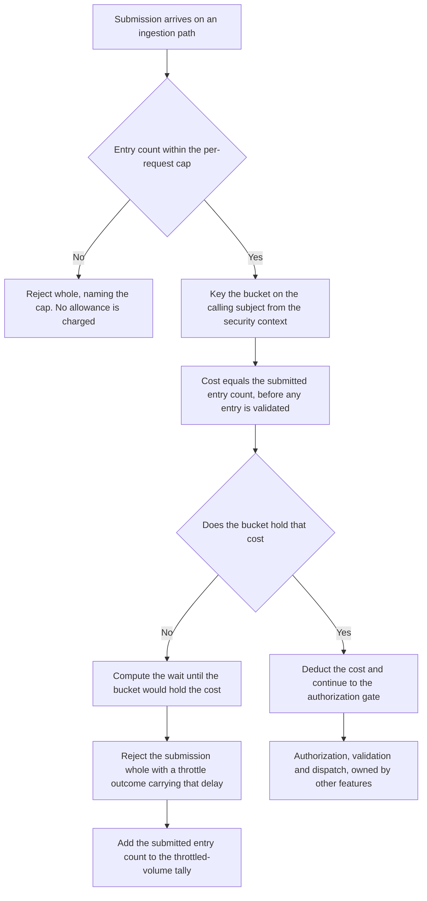

Created:  2026-09-25 by Virtuozzo International GmbH
Updated:  2026-09-25 by Virtuozzo International GmbH

# Feature: Ingestion Rate Limiting & Reconciliation Metadata

- [ ] `p2` - **ID**: `cpt-cf-usage-collector-featstatus-rate-limiting-reconciliation-implemented`

- [ ] `p2` - `cpt-cf-usage-collector-feature-rate-limiting-reconciliation`

Delivers two operator-facing capabilities layered on paths other features own: a
per-subject ingestion quota that bounds what one caller may submit, and a
per-scope reconciliation read that exposes accepted counts, a quantity summary,
and two watermarks so an external job can compare gear-side totals against a
consumer's processed totals without scanning the raw ledger.

<!-- toc -->

- [1. Feature Context](#1-feature-context)
  - [1.1 Overview](#11-overview)
  - [1.2 Purpose](#12-purpose)
  - [1.3 Actors](#13-actors)
  - [1.4 References](#14-references)
- [2. Actor Flows (CDSL)](#2-actor-flows-cdsl)
  - [Submit a Batch and Be Throttled](#submit-a-batch-and-be-throttled)
  - [Apportion an Allowance Across Replicas](#apportion-an-allowance-across-replicas)
  - [Compare Gear Totals Against Processed Totals](#compare-gear-totals-against-processed-totals)
  - [Detect an Emitter That Stopped Reporting](#detect-an-emitter-that-stopped-reporting)
  - [Request a Reserved Caller Granularity](#request-a-reserved-caller-granularity)
- [3. Processes / Business Logic (CDSL)](#3-processes--business-logic-cdsl)
  - [Charge the Ingestion Allowance](#charge-the-ingestion-allowance)
  - [Build the Throttle Outcome](#build-the-throttle-outcome)
  - [Maintain the Replica's Quota Buckets](#maintain-the-replicas-quota-buckets)
  - [Admit a Reconciliation Request](#admit-a-reconciliation-request)
  - [Assemble the Per-Scope Figures](#assemble-the-per-scope-figures)
- [4. States (CDSL)](#4-states-cdsl)
  - [Quota Bucket Lifecycle](#quota-bucket-lifecycle)
- [5. Definitions of Done](#5-definitions-of-done)
  - [One Bucket Per Calling Subject](#one-bucket-per-calling-subject)
  - [Cost and Charge Order](#cost-and-charge-order)
  - [Over-Quota Submissions Rejected Whole](#over-quota-submissions-rejected-whole)
  - [The Quota Reaches Every Ingestion Path](#the-quota-reaches-every-ingestion-path)
  - [Per-Replica, In-Memory Enforcement](#per-replica-in-memory-enforcement)
  - [Throttled Volume Is Countable](#throttled-volume-is-countable)
  - [One Scope Per Reconciliation Call](#one-scope-per-reconciliation-call)
  - [Accepted Count Reports Ingestion Activity](#accepted-count-reports-ingestion-activity)
  - [Fold-Appropriate Quantity Summary](#fold-appropriate-quantity-summary)
  - [Two Watermarks, Unbounded by the Range](#two-watermarks-unbounded-by-the-range)
  - [Operator-Only Surface Behind the Policy Gate](#operator-only-surface-behind-the-policy-gate)
  - [The Gear Evaluates No Watermark](#the-gear-evaluates-no-watermark)
  - [Caller Granularities Reserved, Not Served](#caller-granularities-reserved-not-served)
- [6. Acceptance Criteria](#6-acceptance-criteria)

<!-- /toc -->

## 1. Feature Context

### 1.1 Overview

This feature carries two capabilities that share no code, no component, and no
request. They are delivered together because both are operator-facing controls
added on top of paths other features already own, and neither is large enough to
stand alone.

**The first is an ingestion quota.** Every submission is charged against one
token bucket — an allowance that refills at a steady rate and holds a fixed
burst — keyed on the calling subject. The charge runs on the Ingestion Gateway,
`cpt-cf-usage-collector-component-ingestion-gateway`, after the per-request entry
cap and before the authorization call. A submission that exceeds the remaining
allowance is rejected whole, with an actionable throttle error carrying a retry
delay, and no entry of it is accepted.

**The second is reconciliation metadata.** A single read returns, for one
(tenant, GTS type) scope, the count of accepted entries in a range, a quantity
summary appropriate to the meter's declared fold, and two watermarks: the latest
acceptance instant and the latest covered-period end. It is served by the Query
Gateway, `cpt-cf-usage-collector-component-query-gateway`, as that component's
fourth read path ([DESIGN.md](../DESIGN.md) §3.5, External Dependencies). It is
operator-only and REST-only.

The two halves meet only in this document. A quota decision never reads a
reconciliation figure, and a reconciliation read is never charged a quota. The
sections below keep them apart: each flow, each algorithm, and each definition of
done belongs to one half, and none spans both.

Everything the quota check stands in front of belongs elsewhere. The per-request
entry cap, the admission routine the charge sits inside, and every per-entry rule
belong to `cpt-cf-usage-collector-feature-usage-record-ingestion`. The
authorization gate the charge precedes belongs to
`cpt-cf-usage-collector-feature-attribution-authorization`. The page shape,
cursor and scope composition of the read side belong to
`cpt-cf-usage-collector-feature-usage-query`. Dispatch to the storage plugin, and
the plugin-side counters and watermarks themselves, belong to
`cpt-cf-usage-collector-feature-pluggable-storage`.

### 1.2 Purpose

**The quota exists to keep one misbehaving emitter from consuming the ingestion
path.** A meter that feeds charging must not lose its ingestion budget because
another emitter entered a retry loop. An explicit throttle outcome, rather than a
silent drop, is what lets a well-behaved emitter apply backpressure and retry
data it cannot otherwise recover.

The quota keys on the calling subject because that is the identity the ingestion
security context carries. A subject is not a gear: one gear may present several
subjects, and one subject may serve several gears, so this allowance cannot be
read as gear-scoped. There is deliberately no per-tenant tier, because bounding a
tenant's share would need the *attributed* tenant, which travels per entry in the
request body rather than in the security context. The accepted consequence is
that one tenant's traffic can consume a caller's whole allowance.

**The quota is a separate control from authorization, and the distinction is
load-bearing.** The authorization gate answers whether this caller may write this
attribution tuple at all; the quota answers how much this caller may submit per
unit of time. They run at different points, key on different things, and fail
differently. The charge runs *before* the gate, so a submission is throttled
whether or not it would have been authorized. Entry 2.1 of
[DECOMPOSITION.md](../DECOMPOSITION.md) excludes rate limiting from attribution's
scope for exactly this reason, and
`cpt-cf-usage-collector-feature-attribution-authorization` states the ordering
from its own side. A reader must not treat a throttle outcome as a policy denial,
or a denial as backpressure: one is retryable after a stated delay, the other is
final.

**Reconciliation metadata exists because revenue assurance compares three
totals** — what an emitter believes it sent, what the gear accepted, and what a
consumer processed. Without cheap per-scope counters, that comparison is a full
raw scan over the range. Comparing the gear's acceptance-instant watermark
against the instants a consumer has processed also lets a job tell a stalled
emitter from a stalled consumer.

Stall detection stays with the consumer. A watermark alone identifies no stall:
the same silence is routine for a daily meter and alarming for a per-minute one,
so detection needs an expected cadence to compare against. The gear exposes the
watermarks and nothing more. It evaluates no threshold, raises no stalled-emitter
signal, and leaves the declared nominal sampling interval — the cadence a meter
is expected to report at — to `types-registry`, which the consumer reads for
itself.

**Requirements**: `cpt-cf-usage-collector-fr-rate-limiting`,
`cpt-cf-usage-collector-fr-reconciliation-metadata`,
`cpt-cf-usage-collector-fr-reconciliation-caller-scopes`

**Principles**: none of its own. Both halves are operator-facing capabilities
layered on the ingestion and read paths, and neither introduces a principle
beyond the fail-closed behavior
`cpt-cf-usage-collector-feature-attribution-authorization` already carries.

**Constraints**: none of its own. No design constraint binds rate limiting or
reconciliation uniquely; this feature inherits the constraints of the four
features it depends on.

**Components**: `cpt-cf-usage-collector-component-ingestion-gateway` hosts the
quota charge. `cpt-cf-usage-collector-component-query-gateway` hosts the
reconciliation read.

**Sequences**: none. The quota check and the reconciliation read are steps
embedded in sequences other features own — the quota charge in
`cpt-cf-usage-collector-seq-emit-usage`,
`cpt-cf-usage-collector-seq-invalidate-record` and
`cpt-cf-usage-collector-seq-backfill-import` — and this feature defines no
sequence of its own.

**API**: three routes, all defined in [DESIGN.md](../DESIGN.md) §3.3 and none
introduced here.

- `POST /usage-collector/v1/records`, operation
  `usage_collector.create_usage_records` — quota-gated.
- `POST /usage-collector/v1/records/backfill`, operation
  `usage_collector.backfill_usage_records` — quota-gated, drawing the same
  allowance as live emission.
- `GET /usage-collector/v1/reconciliation`, operation
  `usage_collector.get_reconciliation_metadata` — the reconciliation read. It has
  no in-process counterpart: the operator surface is REST-only.

The quota also applies to the in-process ingestion methods of
`cpt-cf-usage-collector-interface-sdk-client`, because the charge sits in the
domain service rather than in the REST handlers.

**ADRs**: `cpt-cf-usage-collector-adr-backfill-isolation` — backfill is
distinguished by workload isolation, not by a budget of its own.

**Entities**: `ReconciliationMetadata`, `ReconciliationScope`,
`AggregationFold`, `TimeRange`, `MeterTypeId`

**Data**: none. This feature declares no database or database-table component
identifier. The quota bucket is in-memory, per-replica state that survives no
restart, and the counters and watermarks live wholly inside the storage plugin,
reached only through the storage plugin interface.

### 1.3 Actors

| Actor | Role in Feature |
|-------|-----------------|
| `cpt-cf-usage-collector-actor-platform-operator` | Configures the refill rate, burst size and idle-eviction interval, apportioning the configured value across the replica count. Reads reconciliation metadata for a scope while investigating a billing discrepancy. |
| `cpt-cf-usage-collector-actor-usage-source` | Submits entries against the allowance, observes a throttle outcome, waits the delay it carries, and resubmits without losing data. |
| `cpt-cf-usage-collector-actor-usage-consumer` | Runs the external reconciliation job that compares gear-side accepted totals against its own processed totals, and compares an acceptance watermark against its expected cadence to detect an emitter that stopped. |
| `cpt-cf-usage-collector-actor-platform-developer` | Integrates a calling gear against the in-process ingestion methods, which carry the same charge as the REST route, and handles the throttle outcome the in-process error carries. |
| `cpt-cf-usage-collector-actor-storage-backend` | Holds and serves the per-scope counters, the quantity summary and both watermarks. The gear keeps none of them. |
| `cpt-cf-usage-collector-actor-types-registry` | Holds the declaration whose fold selects the quantity-summary branch, and the declared nominal sampling interval a consumer compares a watermark against. The gear performs neither comparison. |
| `cpt-cf-usage-collector-actor-tenant-admin` | Reads no surface this feature defines. Reconciliation is operator-only, and a tenant administrator reads usage through the query paths instead. |

### 1.4 References

- **PRD**: [PRD.md](../PRD.md) — §5 ingestion rate limiting, and reconciliation
  metadata and watermarks; §11 the platform identity assumption that defers the
  caller-scoped granularities.
- **Design**: [DESIGN.md](../DESIGN.md) — §3.2 Ingestion Admission Control and
  the Query Gateway's fourth read path; §3.3 the endpoint list, the error
  contract and the plugin obligation on a single reconciliation scope; §3.5 the
  policy decision point consumed by the reconciliation operation; §3.8 the
  ingestion quota configuration keys and their startup validation; §3.11 the
  throttled-volume and live-bucket instruments.
- **ADRs**:
  [0012](../ADR/0012-cpt-cf-usage-collector-adr-backfill-isolation.md)
- **Dependencies**:
  `cpt-cf-usage-collector-feature-usage-record-ingestion`,
  `cpt-cf-usage-collector-feature-usage-query`,
  `cpt-cf-usage-collector-feature-attribution-authorization`, and
  `cpt-cf-usage-collector-feature-pluggable-storage`. Nothing depends on this
  feature in turn.

**Owned elsewhere, referenced here.** Five seams matter, because each is easy to
absorb into this feature by mistake.

- The per-request entry cap that runs immediately before the quota charge, and
  the admission routine `cpt-cf-usage-collector-algo-ingestion-request-admission`
  the charge sits inside, belong to
  `cpt-cf-usage-collector-feature-usage-record-ingestion`. That routine names the
  charge as this feature's step and specifies nothing about it.
- The authorization gate the charge precedes, and the compiled scope the
  reconciliation read runs under, belong to
  `cpt-cf-usage-collector-feature-attribution-authorization`. Its rule that the
  authorized scope is applied ahead of any caller-supplied parameter reaches this
  feature as `cpt-cf-usage-collector-dod-scope-precedes-user-filter`, and it is
  why a tenant outside the caller's scope answers exactly as a tenant holding no
  entries.
- Dispatch to the plugin and the classification of a plugin error belong to
  `cpt-cf-usage-collector-algo-plugin-dispatch` and
  `cpt-cf-usage-collector-algo-plugin-error-classification`, owned by
  `cpt-cf-usage-collector-feature-pluggable-storage`. That feature also owns the
  plugin-side obligation to hold the counters and watermarks.
- The canonical page envelope,
  `cpt-cf-usage-collector-dod-canonical-page-envelope`, owned by
  `cpt-cf-usage-collector-feature-usage-query`, deliberately does **not** reach
  the reconciliation read. That read returns one typed body for one scope and is
  not a list read, so it carries no cursor and no page size. The three read paths
  it does bind are unaffected.
- Ingestion latency, ingestion throughput and query latency envelopes belong to
  `cpt-cf-usage-collector-feature-throughput-latency-availability`. This document
  states no numeric envelope of its own and defines no budget that feature owns.

## 2. Actor Flows (CDSL)

Two flows enter through an ingestion route and reach the quota; three enter
through the reconciliation route. Steps that belong to another feature appear as
single steps.

### Submit a Batch and Be Throttled

- [ ] `p2` - **ID**: `cpt-cf-usage-collector-flow-quota-throttled-submission`

**Actor**: `cpt-cf-usage-collector-actor-usage-source`

**Success Scenarios**:
- A well-behaved emitter submits a batch within its remaining allowance, the
  allowance is reduced by the submitted entry count, and the submission proceeds
  to authorization.
- An emitter that exhausts its allowance receives a throttle outcome naming a
  delay, waits that delay, resubmits the identical batch, and has it accepted.
- The resubmitted batch is accepted without duplication, because no entry of the
  throttled submission was persisted.

**Error Scenarios**:
- The submission exceeds the per-request entry cap. It is rejected whole against
  the cap and no allowance is charged, because the cap runs first.
- The submission exceeds the remaining allowance. It is rejected whole, before
  any entry is validated, and the authorization gate is never called.
- An emitter retries immediately instead of waiting. It is throttled again, and
  the outcome carries a fresh delay computed from the bucket's current level.

**Steps**:
1. [ ] - `p2` - Usage source submits a batch of entries on an ingestion route, carrying its security context - `inst-quota-submit`
2. [ ] - `p2` - Gateway applies the per-request entry cap, which is owned by `cpt-cf-usage-collector-feature-usage-record-ingestion` - `inst-quota-cap`
3. [ ] - `p2` - **IF** the entry count exceeds the cap - `inst-quota-over-cap`
   1. [ ] - `p2` - **RETURN** the cap rejection with no allowance charged - `inst-quota-over-cap-return`
4. [ ] - `p2` - Gateway charges the allowance through `cpt-cf-usage-collector-algo-quota-charge` - `inst-quota-charge`
5. [ ] - `p2` - **IF** the bucket does not hold the submitted entry count - `inst-quota-exhausted`
   1. [ ] - `p2` - Gateway builds the outcome through `cpt-cf-usage-collector-algo-quota-throttle-outcome` - `inst-quota-build`
   2. [ ] - `p2` - **RETURN** the throttle outcome carrying the retry delay, with no entry accepted and the authorization gate never called - `inst-quota-throttle-return`
6. [ ] - `p2` - Gateway deducts the submitted entry count from the bucket and continues - `inst-quota-deduct`
7. [ ] - `p2` - Gateway proceeds to authorization, validation and dispatch, all owned by other features - `inst-quota-proceed`
8. [ ] - `p2` - **RETURN** the per-entry outcomes that ingestion produces - `inst-quota-proceed-return`

### Apportion an Allowance Across Replicas

- [ ] `p2` - **ID**: `cpt-cf-usage-collector-flow-quota-apportion-replicas`

**Actor**: `cpt-cf-usage-collector-actor-platform-operator`

**Success Scenarios**:
- An operator decides a cluster-wide entries-per-second figure for a caller,
  divides it by the replica count, and sets the refill rate to that quotient.
- An operator sets the burst size at or above the per-request entry cap, and the
  gear starts.
- An operator shortens the idle-eviction interval to reduce the number of live
  buckets a replica holds, and a partially drained bucket still survives it.

**Error Scenarios**:
- An operator sets the burst size below the per-request entry cap. Startup fails
  naming the key, because a maximal batch could otherwise never be admitted.
- An operator sets a refill rate or burst size that is not positive. Startup
  fails naming the key.
- An operator expects the configured figure to bound the whole cluster. It bounds
  one replica, so the effective limit is that figure multiplied by the replica
  count.

**Steps**:
1. [ ] - `p2` - Platform operator states the cluster-wide entries-per-second figure one calling subject should get - `inst-apportion-target`
2. [ ] - `p2` - Operator divides that figure by the deployment's replica count and writes the quotient as the refill rate - `inst-apportion-divide`
3. [ ] - `p2` - Operator sets the burst size at or above the per-request entry cap - `inst-apportion-burst`
4. [ ] - `p2` - Gear validates the quota configuration at startup, before anything is wired - `inst-apportion-validate`
5. [ ] - `p2` - **IF** any quota value is not positive, or the burst size is below the entry cap - `inst-apportion-invalid`
   1. [ ] - `p2` - **RETURN** a startup failure naming the offending key - `inst-apportion-fail`
6. [ ] - `p2` - Each replica holds its own buckets in memory, independent of every other replica - `inst-apportion-per-replica`
7. [ ] - `p2` - **RETURN** a running deployment whose effective limit is the configured figure multiplied by the replica count - `inst-apportion-return`

### Compare Gear Totals Against Processed Totals

- [ ] `p2` - **ID**: `cpt-cf-usage-collector-flow-reconciliation-compare-totals`

**Actor**: `cpt-cf-usage-collector-actor-usage-consumer`

**Success Scenarios**:
- A reconciliation job requests one (tenant, GTS type) scope over a closed range
  and receives the accepted count and the quantity summary for exactly the
  entries that range selects.
- The job compares the accepted count against the number of entries it processed
  for the same scope and range, and the two agree.
- The job runs against a meter whose declared fold accrues and reads the accrued
  sum; against any other fold it reads the observation count together with the
  latest observation.
- A scope in which every selected entry belongs to a withdrawn pair reports those
  entries in the accepted count and excludes them from the quantity summary.

**Error Scenarios**:
- The request omits the range, the tenant or the GTS type. It is rejected with a
  validation error naming the parameter, before any dispatch.
- The caller holds no read permission for the scope. The read fails closed.
- The caller is authorized, but the requested tenant lies outside its compiled
  scope. The response is identical to one for a tenant holding no entries.
- The storage plugin is unavailable. The read surfaces a retryable unavailability
  outcome rather than a partial figure.

**Steps**:
1. [ ] - `p2` - Usage consumer requests reconciliation metadata naming the granularity, one tenant, one GTS type reference and one time range - `inst-recon-request`
2. [ ] - `p2` - Gateway runs `cpt-cf-usage-collector-algo-reconciliation-request-admission` over the request - `inst-recon-admit`
3. [ ] - `p2` - **IF** a required parameter is missing, or the granularity is a reserved one - `inst-recon-bad`
   1. [ ] - `p2` - **RETURN** a validation rejection naming the parameter, with nothing dispatched - `inst-recon-bad-return`
4. [ ] - `p2` - Gateway authorizes the read and composes the returned constraints, through `cpt-cf-usage-collector-algo-read-scope-composition` - `inst-recon-scope`
5. [ ] - `p2` - **IF** the decision denies, or the composed scope is empty - `inst-recon-denied`
   1. [ ] - `p2` - **RETURN** the fail-closed outcome that gate produced, with nothing dispatched - `inst-recon-denied-return`
6. [ ] - `p2` - Gateway assembles and dispatches the read through `cpt-cf-usage-collector-algo-reconciliation-figure-assembly` - `inst-recon-assemble`
7. [ ] - `p2` - Storage backend applies the compiled scope first, then the requested scope and range, and returns the figures - `inst-recon-plugin`
8. [ ] - `p2` - **RETURN** the accepted count, the quantity summary and both watermarks for the one requested scope - `inst-recon-return`

### Detect an Emitter That Stopped Reporting

- [ ] `p2` - **ID**: `cpt-cf-usage-collector-flow-reconciliation-stalled-emitter`

**Actor**: `cpt-cf-usage-collector-actor-usage-consumer`

**Success Scenarios**:
- A consumer reads the acceptance-instant watermark for a scope, compares it
  against the cadence it expects, and concludes that the emitter stopped.
- A consumer without an expectation of its own reads the declared nominal
  sampling interval from `types-registry` and compares against that instead.
- A consumer confirms that the gear raised no signal of its own and that the
  judgment was entirely its to make.

**Error Scenarios**:
- A consumer expects the gear to flag the stall. No such signal exists, on any
  surface, and the consumer's own comparison is the whole mechanism.
- A consumer treats a lowered watermark as an emitter fault. A retention sweep
  that dropped the scope's most recently accepted entry lowers it too, because
  neither watermark is monotonic.
- A consumer reads a fresh acceptance watermark and concludes that live emission
  continues. A backfill run advances that watermark while leaving the
  covered-period watermark where it stood, so the pair must be read together.

**Steps**:
1. [ ] - `p2` - Usage consumer reads reconciliation metadata for the scope it is watching - `inst-stall-read`
2. [ ] - `p2` - Consumer takes the acceptance-instant watermark and the covered-period-end watermark from the response - `inst-stall-take`
3. [ ] - `p2` - **IF** the GTS type declares a nominal sampling interval - `inst-stall-declared`
   1. [ ] - `p2` - Consumer reads that interval from `types-registry` and uses it as the expected cadence - `inst-stall-registry`
4. [ ] - `p2` - **ELSE** - `inst-stall-own`
   1. [ ] - `p2` - Consumer uses its own expected cadence for the meter - `inst-stall-own-cadence`
5. [ ] - `p2` - Consumer compares both watermarks against that cadence, reading the covered-period one to tell live emission from an import - `inst-stall-compare`
6. [ ] - `p2` - Gear performs no part of this comparison, holds no threshold, and emits no stalled-emitter signal - `inst-stall-gear-silent`
7. [ ] - `p2` - **RETURN** the consumer's own stall judgment, made wholly outside the gear - `inst-stall-return`

### Request a Reserved Caller Granularity

- [ ] `p3` - **ID**: `cpt-cf-usage-collector-flow-reconciliation-reserved-scope`

**Actor**: `cpt-cf-usage-collector-actor-platform-operator`

**Success Scenarios**:
- An operator requests the served granularity and receives figures for that one
  tenant and GTS type.
- An operator requesting a reserved caller granularity receives a validation
  error that names the granularity as unserved, rather than an empty or
  misleading figure.

**Error Scenarios**:
- An operator requests the calling-gear granularity. It is rejected, because the
  tenant plane carries no calling-gear identity to group by.
- An operator requests the calling-gear-and-tenant granularity. It is rejected
  for the same reason.
- An operator assumes the quota's subject key can substitute for a calling-gear
  identity. It cannot: a subject is not a gear, so quota scopes and
  reconciliation scopes are not interchangeable.

**Steps**:
1. [ ] - `p3` - Platform operator requests reconciliation metadata naming a granularity - `inst-reserved-request`
2. [ ] - `p3` - Gateway checks the granularity against the served set, which holds the tenant and GTS type pairing alone - `inst-reserved-check`
3. [ ] - `p3` - **IF** the granularity is one of the two reserved caller granularities - `inst-reserved-caller`
   1. [ ] - `p3` - **RETURN** a validation rejection stating that the granularity is not served, with nothing dispatched - `inst-reserved-return`
4. [ ] - `p3` - **ELSE** - `inst-reserved-served`
   1. [ ] - `p3` - Gateway continues through `cpt-cf-usage-collector-flow-reconciliation-compare-totals` - `inst-reserved-continue`
5. [ ] - `p3` - **RETURN** the figures for the served granularity - `inst-reserved-served-return`

## 3. Processes / Business Logic (CDSL)

Three routines carry the quota half and two carry the reconciliation half. None
of the five spans both.

### Charge the Ingestion Allowance

- [ ] `p2` - **ID**: `cpt-cf-usage-collector-algo-quota-charge`

**Input**: one submission whose entry count is already within the per-request
cap, plus the caller's ingestion security context.

**Output**: either a deduction from the caller's bucket and an admitted
submission, or an exhaustion verdict carrying the shortfall.

**Steps**:
1. [ ] - `p2` - Read the calling subject identifier from the security context and use it, alone, as the bucket key - `inst-charge-key`
2. [ ] - `p2` - Do not key on the attributed tenant, which travels per entry in the request body rather than in the security context - `inst-charge-no-attributed-tenant`
3. [ ] - `p2` - Do not key on the caller's home tenant either: it is constant per subject, so such a bucket would pair one-to-one with the subject bucket - `inst-charge-no-home-tenant`
4. [ ] - `p2` - Locate the caller's bucket among the replica's in-memory buckets, creating one at full capacity where none exists - `inst-charge-locate`
5. [ ] - `p2` - Refill the bucket from the time elapsed since it was last touched, up to its capacity and never beyond - `inst-charge-refill`
6. [ ] - `p2` - Set the cost to the submitted entry count on the batch paths, and to one on the single-entry in-process path - `inst-charge-cost`
7. [ ] - `p2` - Count submitted entries rather than valid, authorized or deduplicated ones, because the volume being bounded is what the caller sent - `inst-charge-submitted`
8. [ ] - `p2` - **IF** the refilled bucket holds at least the cost - `inst-charge-holds`
   1. [ ] - `p2` - Deduct the cost and **RETURN** the admitted submission - `inst-charge-deduct`
9. [ ] - `p2` - **ELSE** - `inst-charge-short`
   1. [ ] - `p2` - **RETURN** the exhaustion verdict, carrying the cost and the bucket's current level, with the bucket unchanged - `inst-charge-short-return`

### Build the Throttle Outcome

- [ ] `p2` - **ID**: `cpt-cf-usage-collector-algo-quota-throttle-outcome`

**Input**: an exhaustion verdict carrying the submission's cost and the bucket's
current level.

**Output**: a request-wide throttle outcome carrying a retry delay, plus an
increment to the throttled-volume tally.

**Steps**:
1. [ ] - `p2` - Compute the delay as the time the configured refill rate needs to bring the bucket up to the submission's cost - `inst-throttle-delay`
2. [ ] - `p2` - Rely on the cost never exceeding the bucket's capacity, which the per-request cap guarantees, so the delay is always finite - `inst-throttle-finite`
3. [ ] - `p2` - Raise the resource-exhausted outcome of the canonical error taxonomy, mapped to the too-many-requests response status - `inst-throttle-category`
4. [ ] - `p2` - Carry the delay in the violation's retry-delay field, and set the retry header explicitly, because the canonical envelope derives that header for the unavailable outcome alone - `inst-throttle-carriers`
5. [ ] - `p2` - Name the ingestion quota as the violation's subject, using a fixed value rather than the caller identifier - `inst-throttle-subject`
6. [ ] - `p2` - Carry the same delay in the in-process error payload, so a caller that never touches the wire reads it too - `inst-throttle-sdk`
7. [ ] - `p2` - Reject the submission whole: accept no entry, emit no per-entry outcome, and produce no partial result - `inst-throttle-whole`
8. [ ] - `p2` - Add the submitted entry count to the throttled-volume tally, which is the only place throttled volume is counted - `inst-throttle-volume`
9. [ ] - `p2` - **RETURN** the throttle outcome to the caller - `inst-throttle-return`

### Maintain the Replica's Quota Buckets

- [ ] `p2` - **ID**: `cpt-cf-usage-collector-algo-quota-bucket-maintenance`

**Input**: the replica's live bucket set and the configured idle-eviction
interval.

**Output**: a bounded bucket set from which no drained bucket has been removed.

**Steps**:
1. [ ] - `p2` - Hold every bucket in this replica's memory alone, with no shared store and no coordination with any other replica - `inst-maint-local`
2. [ ] - `p2` - Treat the absence of an external dependency as deliberate: the limiter has no failure mode, so it has no fail-open or fail-closed question - `inst-maint-no-dependency`
3. [ ] - `p2` - Consider a bucket for eviction once it has been untouched for the configured idle interval - `inst-maint-idle`
4. [ ] - `p2` - Evict a bucket only when it has refilled to capacity - `inst-maint-full-only`
5. [ ] - `p2` - Never evict a partially drained bucket, because dropping it would hand the caller free allowance - `inst-maint-never-drained`
6. [ ] - `p2` - Expose the live bucket count so an operator can watch the set grow and confirm eviction keeps pace - `inst-maint-count`
7. [ ] - `p2` - Lose every bucket on restart, which is accepted: a restart returns a full allowance to each caller and the limit is approximate by design - `inst-maint-restart`
8. [ ] - `p2` - **RETURN** the maintained bucket set - `inst-maint-return`

### Admit a Reconciliation Request

- [ ] `p2` - **ID**: `cpt-cf-usage-collector-algo-reconciliation-request-admission`

**Input**: one reconciliation request naming a granularity, a tenant, a GTS type
reference and a time range.

**Output**: either a validation rejection, or a request admitted to
authorization.

**Steps**:
1. [ ] - `p2` - Require the granularity parameter, and admit only the tenant and GTS type pairing - `inst-radmit-granularity`
2. [ ] - `p2` - Reject either reserved caller granularity with a validation error stating it is not served - `inst-radmit-reserved`
3. [ ] - `p2` - Require the tenant identifier and the GTS type reference, each as its own typed parameter - `inst-radmit-scope-params`
4. [ ] - `p2` - Require both bounds of the time range, and treat the lower bound as inclusive and the upper bound as exclusive - `inst-radmit-range`
5. [ ] - `p2` - Accept no filter, no grouping dimension, no ordering and no paging parameter: the scope parameters and the range are the whole request - `inst-radmit-no-extras`
6. [ ] - `p2` - Reject a request naming a GTS type reference that does not resolve, before anything is dispatched - `inst-radmit-unresolved`
7. [ ] - `p2` - Report every rejection through the canonical error envelope, in the validation category, naming the offending parameter - `inst-radmit-envelope`
8. [ ] - `p2` - **RETURN** the admitted request, or the rejection - `inst-radmit-return`

### Assemble the Per-Scope Figures

- [ ] `p2` - **ID**: `cpt-cf-usage-collector-algo-reconciliation-figure-assembly`

**Input**: an admitted, authorized reconciliation request and the compiled
authorization scope.

**Output**: one accepted count, one quantity summary and two watermarks for the
requested scope.

**Steps**:
1. [ ] - `p2` - Resolve the queried GTS type to its declaration and take the declared fold, which reaches the storage plugin as a parameter - `inst-assemble-fold`
2. [ ] - `p2` - Dispatch one storage call for the one requested scope, through `cpt-cf-usage-collector-algo-plugin-dispatch` - `inst-assemble-dispatch`
3. [ ] - `p2` - Pass the compiled authorization scope so the plugin applies it ahead of the requested tenant and GTS type - `inst-assemble-scope-first`
4. [ ] - `p2` - Select entries for the count and the summary by the end of the covered period, the same rule every read path applies - `inst-assemble-selection`
5. [ ] - `p2` - Count every accepted entry the range selects, invalidation entries included, and net no withdrawal from that count - `inst-assemble-count`
6. [ ] - `p2` - **IF** the declared fold accrues - `inst-assemble-sum-fold`
   1. [ ] - `p2` - Report the accrued sum as the quantity summary - `inst-assemble-accrued`
7. [ ] - `p2` - **ELSE** - `inst-assemble-other-fold`
   1. [ ] - `p2` - Report the observation count together with the latest observation, which is absent when the range selects no entry - `inst-assemble-observations`
8. [ ] - `p2` - Exclude both entries of every withdrawn pair from the quantity summary, which aggregates the meter, while leaving the accepted count untouched - `inst-assemble-pair`
9. [ ] - `p2` - Take the acceptance-instant watermark as the scope's latest acceptance instant, unbounded by the requested range - `inst-assemble-accepted-watermark`
10. [ ] - `p2` - Take the covered-period-end watermark as the scope's latest covered-period end, also unbounded by the range - `inst-assemble-window-watermark`
11. [ ] - `p2` - Report both watermarks as absent when the scope holds no entries at all - `inst-assemble-absent`
12. [ ] - `p2` - Report one entry per dedup identity throughout, as the read paths do, so a submission the plugin discarded contributes to nothing - `inst-assemble-dedup`
13. [ ] - `p2` - Evaluate no threshold and derive no verdict from any figure - `inst-assemble-no-verdict`
14. [ ] - `p2` - **RETURN** the four figures as one typed body, with no cursor and no page size - `inst-assemble-return`

## 4. States (CDSL)

### Quota Bucket Lifecycle

- [ ] `p2` - **ID**: `cpt-cf-usage-collector-state-quota-bucket`

A quota bucket is one of the few things in this gear that genuinely holds a
lifecycle. Its eviction rule reads its level, so the distinction between a full
bucket and a partially drained one is load-bearing rather than descriptive: the
replica may drop the first and must keep the second.

**States**: Absent, Full, Drained, Exhausted

**Initial State**: Absent

**Transitions**:
1. [ ] - `p2` - **FROM** Absent **TO** Full **WHEN** a submission arrives from a calling subject the replica holds no bucket for - `inst-bucket-create`
2. [ ] - `p2` - **FROM** Full **TO** Drained **WHEN** a submission is charged and the deduction leaves some allowance - `inst-bucket-drain`
3. [ ] - `p2` - **FROM** Drained **TO** Drained **WHEN** a further submission is charged and allowance still remains - `inst-bucket-drain-more`
4. [ ] - `p2` - **FROM** Drained **TO** Exhausted **WHEN** the next submission costs more than the bucket holds - `inst-bucket-exhaust`
5. [ ] - `p2` - **FROM** Exhausted **TO** Exhausted **WHEN** the caller retries before the refill has covered the submission's cost - `inst-bucket-retry-early`
6. [ ] - `p2` - **FROM** Exhausted **TO** Drained **WHEN** the refill brings the level up to the next submission's cost without reaching capacity - `inst-bucket-partial-refill`
7. [ ] - `p2` - **FROM** Drained **TO** Full **WHEN** the refill reaches capacity, where it stops - `inst-bucket-refilled`
8. [ ] - `p2` - **FROM** Full **TO** Absent **WHEN** the bucket has been untouched for the configured idle interval and is evicted - `inst-bucket-evict`
9. [ ] - `p2` - **FROM** Drained **TO** Drained **WHEN** the idle interval elapses but the bucket is not yet at capacity, so eviction is withheld - `inst-bucket-no-evict`
10. [ ] - `p2` - **FROM** Exhausted **TO** Absent **WHEN** the replica restarts, which returns a full allowance on the next submission - `inst-bucket-restart`

## 5. Definitions of Done

### One Bucket Per Calling Subject

- [ ] `p2` - **ID**: `cpt-cf-usage-collector-dod-quota-subject-keyed`

The system **MUST** key each ingestion quota bucket on the calling subject
identifier taken from the ingestion security context, and on nothing else. The
implementation **MUST NOT** offer a per-tenant tier, and **MUST NOT** key a
bucket on the attributed tenant carried per entry, on the caller's home tenant,
or on any calling-gear identity. The quota **MUST** be recognisable as a control
distinct from authorization: it is charged before the authorization gate, it
reads only the subject, and its outcome **MUST NOT** be reported as a policy
denial. A tenant-spanning batch **MUST** be charged once, against the submitting
subject.

**Implements**:
- `cpt-cf-usage-collector-algo-quota-charge`
- `cpt-cf-usage-collector-flow-quota-throttled-submission`

**Touches**:
- API: `POST /usage-collector/v1/records`,
  `POST /usage-collector/v1/records/backfill`
- Component: `cpt-cf-usage-collector-component-ingestion-gateway`

### Cost and Charge Order

- [ ] `p2` - **ID**: `cpt-cf-usage-collector-dod-quota-charge-order`

The system **MUST** charge the submitted entry count, not one unit per request,
so that batching cannot multiply a caller's effective budget. The charge **MUST**
run after the per-request entry cap and before the authorization call. That order
**MUST** be preserved: the cap bounds the cost below the bucket's capacity, which
is what keeps the retry delay finite and disposes of the empty submission. The
count charged **MUST** be the count submitted, before it is known how many
entries are valid, authorized, or collapsed by deduplication within the batch.

**Implements**:
- `cpt-cf-usage-collector-algo-quota-charge`
- `cpt-cf-usage-collector-flow-quota-throttled-submission`

**Touches**:
- API: `POST /usage-collector/v1/records`,
  `POST /usage-collector/v1/records/backfill`
- Component: `cpt-cf-usage-collector-component-ingestion-gateway`

### Over-Quota Submissions Rejected Whole

- [ ] `p2` - **ID**: `cpt-cf-usage-collector-dod-quota-whole-rejection`

The system **MUST** reject an over-quota submission whole, before any entry is
validated, and **MUST NOT** accept, defer, buffer or silently drop any entry of
it. The per-entry outcome model **MUST NOT** apply: the rejection is request-wide
and no partially throttled batch exists. The outcome **MUST** be the
resource-exhausted category of the canonical error taxonomy, served as the
too-many-requests response status, carrying the retry delay both in the
violation's retry-delay field and in the retry response header, which the gear
sets itself. The violation's subject **MUST** be a fixed value naming the
ingestion quota rather than the caller. The in-process error **MUST** carry the
same delay in its own payload. The delay **MUST** be the time the configured
refill rate needs to bring the bucket up to the submission's cost, so a caller
that waits it and resubmits the identical batch succeeds.

**Implements**:
- `cpt-cf-usage-collector-algo-quota-throttle-outcome`
- `cpt-cf-usage-collector-flow-quota-throttled-submission`

**Touches**:
- API: `POST /usage-collector/v1/records`,
  `POST /usage-collector/v1/records/backfill`
- Component: `cpt-cf-usage-collector-component-ingestion-gateway`

### The Quota Reaches Every Ingestion Path

- [ ] `p2` - **ID**: `cpt-cf-usage-collector-dod-quota-all-paths`

The system **MUST** charge the quota on every ingestion path: the live route, the
backfill route, and both in-process entry points — the batch one, charged the
entry count, and the single-entry one, charged one unit. The check **MUST** live
in the domain service rather than in the request handlers, because a
handler-side check would miss every in-process caller. Backfill **MUST** draw the
same allowance as live emission rather than a budget of its own; workload
isolation, owned by `cpt-cf-usage-collector-feature-backfill-retention`, is what
distinguishes the routes. The test suite **MUST** cover the single-entry
in-process path explicitly, because a suite exercising only the batch-shaped
routes would pass with that path unthrottled.

**Implements**:
- `cpt-cf-usage-collector-algo-quota-charge`

**Touches**:
- API: `POST /usage-collector/v1/records`,
  `POST /usage-collector/v1/records/backfill`
- Component: `cpt-cf-usage-collector-component-ingestion-gateway`

### Per-Replica, In-Memory Enforcement

- [ ] `p2` - **ID**: `cpt-cf-usage-collector-dod-quota-per-replica-state`

The system **MUST** hold quota state in each replica's memory, with no shared
store and no cross-replica coordination, and **MUST** document that the effective
limit for a deployment is the configured value multiplied by the replica count.
The limit is therefore approximate, and an operator apportions the configured
value across replicas. The refill rate, the burst size and the idle-eviction
interval **MUST** be deployment configuration read once at startup. Startup
**MUST** fail, naming the key, when any of the three is not positive or when the
burst size is below the per-request entry cap. A bucket **MUST** be evicted only
after the idle interval has elapsed *and* it has refilled to capacity; a
partially drained bucket **MUST NOT** be evicted, because dropping it would
return free allowance. The implementation **MUST NOT** introduce a
cluster-coordinating limiter, so the limiter has no external dependency and no
fail-open or fail-closed decision to make.

**Implements**:
- `cpt-cf-usage-collector-algo-quota-bucket-maintenance`
- `cpt-cf-usage-collector-state-quota-bucket`
- `cpt-cf-usage-collector-flow-quota-apportion-replicas`

**Touches**:
- Component: `cpt-cf-usage-collector-component-ingestion-gateway`

### Throttled Volume Is Countable

- [ ] `p2` - **ID**: `cpt-cf-usage-collector-dod-quota-rejected-volume-countable`

The system **MUST** make the entry count of every throttled submission
observable, by adding that count to a dedicated throttled-volume tally at the
point of rejection. The per-entry ingestion tally **MUST NOT** carry throttled
volume, because the charge happens before the entry kind is validated and the
label that tally requires would be unknown. The live bucket count **MUST** also
be observable, so an operator can confirm that idle eviction keeps pace with
bucket creation. Neither figure **MUST** be labelled with the calling subject or
a tenant. The catalogue these instruments belong to, and their naming, are owned
by `cpt-cf-usage-collector-feature-operational-visibility`; this feature owns only
the obligation that the two quantities exist and are attributable to the quota.

**Implements**:
- `cpt-cf-usage-collector-algo-quota-throttle-outcome`
- `cpt-cf-usage-collector-algo-quota-bucket-maintenance`

**Touches**:
- Component: `cpt-cf-usage-collector-component-ingestion-gateway`

### One Scope Per Reconciliation Call

- [ ] `p2` - **ID**: `cpt-cf-usage-collector-dod-reconciliation-single-scope`

The system **MUST** serve reconciliation metadata for exactly one (tenant, GTS
type) scope per call, named by two required typed parameters, together with one
required time range whose lower bound is inclusive and whose upper bound is
exclusive. The surface **MUST NOT** accept a filter, a grouping dimension, an
ordering, or any paging parameter, and **MUST NOT** enumerate scopes or tenants.
The response **MUST** be one typed body rather than a page: the canonical page
envelope of `cpt-cf-usage-collector-dod-canonical-page-envelope` binds the three
list-shaped read paths and deliberately does not reach this one, so no cursor and
no page size appear on it. A request missing any required parameter, or naming a
GTS type that does not resolve, **MUST** be rejected with a validation error
naming the parameter, before anything is dispatched.

**Implements**:
- `cpt-cf-usage-collector-algo-reconciliation-request-admission`
- `cpt-cf-usage-collector-flow-reconciliation-compare-totals`

**Touches**:
- API: `GET /usage-collector/v1/reconciliation`
- Component: `cpt-cf-usage-collector-component-query-gateway`
- Entities: `ReconciliationScope`, `TimeRange`, `MeterTypeId`

### Accepted Count Reports Ingestion Activity

- [ ] `p2` - **ID**: `cpt-cf-usage-collector-dod-reconciliation-accepted-count`

The system **MUST** report, as the accepted count, every accepted entry the
requested range selects — invalidation entries included — for every GTS type
irrespective of its declared fold. The count reports ingestion activity rather
than aggregating the meter, so it **MUST NOT** net a withdrawal: an invalidation
entry counts as its own acceptance, and the record it withdraws stays counted.
Selection **MUST** use the end of the covered period, the rule every read path
applies. The count **MUST** reflect one entry per deduplication identity, so a
submission the storage plugin discarded contributes nothing. The count **MUST**
be derivable without a full raw scan of the range.

**Implements**:
- `cpt-cf-usage-collector-algo-reconciliation-figure-assembly`
- `cpt-cf-usage-collector-flow-reconciliation-compare-totals`

**Touches**:
- API: `GET /usage-collector/v1/reconciliation`
- Component: `cpt-cf-usage-collector-component-query-gateway`
- Entities: `ReconciliationMetadata`

### Fold-Appropriate Quantity Summary

- [ ] `p2` - **ID**: `cpt-cf-usage-collector-dod-reconciliation-quantity-summary`

The system **MUST** select the quantity summary from the queried type's declared
fold, and **MUST** expose exactly one of two branches. For an accruing fold it
**MUST** report the accrued sum. For every other fold it **MUST** report the
observation count together with the latest observation, because quantities under
those folds are not summable; the latest observation **MUST** be absent when the
range selects no entry. The fold **MUST NOT** be a request parameter, and the
caller **MUST NOT** be able to select a branch. The summary aggregates the meter,
so both entries of every withdrawn pair **MUST** be excluded from it, even though
the accepted count keeps them. The summary **MUST** cover exactly the entries the
requested range selects.

**Implements**:
- `cpt-cf-usage-collector-algo-reconciliation-figure-assembly`

**Touches**:
- API: `GET /usage-collector/v1/reconciliation`
- Component: `cpt-cf-usage-collector-component-query-gateway`
- Entities: `ReconciliationMetadata`, `AggregationFold`

### Two Watermarks, Unbounded by the Range

- [ ] `p2` - **ID**: `cpt-cf-usage-collector-dod-reconciliation-watermarks`

The system **MUST** report two watermarks for the requested scope: the latest
acceptance instant and the latest covered-period end. Unlike the count and the
summary, both **MUST** be current as of the response and **MUST NOT** be bounded
by the requested range. Both **MUST** be absent when the scope holds no entries
at all, and a scope outside the caller's compiled authorization scope **MUST**
answer exactly as a scope holding no entries. Both **MUST** be computed over
retained entries, and the contract **MUST NOT** claim either is monotonic: a
retention sweep that drops the chunk holding a scope's most recently accepted
entry lowers the acceptance watermark, so a later read may return a lower value
than an earlier one. The published contract **MUST** also state that a backfill
run advances the acceptance watermark while leaving the covered-period watermark
unchanged whenever the imported periods end no later than it already does, so the
two are read together rather than singly.

**Implements**:
- `cpt-cf-usage-collector-algo-reconciliation-figure-assembly`
- `cpt-cf-usage-collector-flow-reconciliation-stalled-emitter`

**Touches**:
- API: `GET /usage-collector/v1/reconciliation`
- Component: `cpt-cf-usage-collector-component-query-gateway`
- Entities: `ReconciliationMetadata`

### Operator-Only Surface Behind the Policy Gate

- [ ] `p2` - **ID**: `cpt-cf-usage-collector-dod-reconciliation-operator-surface`

The system **MUST** expose reconciliation metadata on the REST surface alone and
**MUST NOT** give it an in-process counterpart, because it is an operator
operation. The read **MUST** run the same policy decision the other read paths
run: the counters and watermarks the storage plugin exposes **MUST NOT** be
reachable without clearing that gate. The compiled authorization scope **MUST**
be applied ahead of the requested tenant and GTS type, as
`cpt-cf-usage-collector-dod-scope-precedes-user-filter` requires, so no
combination of request parameters widens what the caller may read. A denial, and
a permit that compiles to an empty scope, **MUST** each fail closed with nothing
dispatched to the storage plugin.

**Implements**:
- `cpt-cf-usage-collector-flow-reconciliation-compare-totals`
- `cpt-cf-usage-collector-algo-reconciliation-figure-assembly`

**Touches**:
- API: `GET /usage-collector/v1/reconciliation`
- Component: `cpt-cf-usage-collector-component-query-gateway`

### The Gear Evaluates No Watermark

- [ ] `p2` - **ID**: `cpt-cf-usage-collector-dod-reconciliation-no-stall-verdict`

The system **MUST** expose the watermarks and stop there. It **MUST NOT** hold a
missed-interval threshold, **MUST NOT** read the declared nominal sampling
interval for any evaluation of its own, **MUST NOT** sweep scopes on a timer, and
**MUST NOT** emit a stalled-emitter signal on any surface. Comparing a watermark
against an expected cadence is the consumer's work, performed against the
declared interval `types-registry` serves where one exists and against the
consumer's own expectation where none does. The published contract **MUST** state
that this comparison is uncontracted and consumer-side, so no caller waits for a
signal the gear will never raise.

**Implements**:
- `cpt-cf-usage-collector-flow-reconciliation-stalled-emitter`
- `cpt-cf-usage-collector-algo-reconciliation-figure-assembly`

**Touches**:
- API: `GET /usage-collector/v1/reconciliation`
- Component: `cpt-cf-usage-collector-component-query-gateway`

### Caller Granularities Reserved, Not Served

- [ ] `p3` - **ID**: `cpt-cf-usage-collector-dod-reconciliation-caller-scopes-reserved`

The system **MUST** reserve the calling-gear and calling-gear-and-tenant
granularities on the reconciliation surface, and **MUST** reject a request naming
either with a validation error stating that the granularity is not served. It
**MUST NOT** return an empty figure, a zeroed count, or a figure computed from
some other identity in their place. The blocker **MUST** be recorded on the
contract: the platform plane carries the calling-gear name and never a tenant,
usage ingestion runs on the tenant plane whose security context names the caller
by opaque subject identifier alone, and no counter can be grouped by caller until
one plane carries both. The contract **MUST** state that the quota's subject key
is not a substitute, since a subject is not a gear, so quota scopes and
reconciliation scopes are not interchangeable. Serving either granularity later
**MUST** be an additive widening of the granularity parameter rather than a
breaking change.

**Implements**:
- `cpt-cf-usage-collector-flow-reconciliation-reserved-scope`
- `cpt-cf-usage-collector-algo-reconciliation-request-admission`

**Touches**:
- API: `GET /usage-collector/v1/reconciliation`
- Component: `cpt-cf-usage-collector-component-query-gateway`
- Entities: `ReconciliationScope`

## 6. Acceptance Criteria

- [ ] A submission whose entry count exceeds the remaining allowance is rejected whole with the resource-exhausted outcome at the too-many-requests status, and a per-entry inspection of the ledger shows no entry of it persisted.
- [ ] The throttle response carries the retry delay in the violation's retry-delay field and in the retry response header, and both values agree.
- [ ] An in-process caller receives the same delay in the error payload, verified by draining the allowance through the in-process batch method.
- [ ] A caller that waits the stated delay and resubmits the identical batch has it accepted, and a caller that retries immediately is throttled again with a freshly computed delay.
- [ ] A throttled submission never reaches the policy decision point, verified by a decision-point test double asserting it recorded no call.
- [ ] An over-cap submission is rejected against the cap with no allowance deducted, verified by charging a maximal batch afterwards and observing it admitted.
- [ ] A batch of one hundred entries reduces the allowance by one hundred, and one hundred single-entry in-process calls reduce it by the same total, confirming the cost is the entry count rather than one per request.
- [ ] The allowance is charged on submitted entries, verified by a batch in which every entry fails validation still reducing the bucket by the full submitted count.
- [ ] Two submissions naming different attributed tenants from one calling subject draw on one bucket, and two submissions from different subjects draw on separate buckets.
- [ ] No configuration key, request field or code path keys a bucket on a tenant identifier or on a calling-gear name.
- [ ] The backfill route draws down the same bucket as the live route, verified by exhausting the allowance on one route and observing a throttle on the other.
- [ ] The single-entry in-process ingestion path is throttled, verified by a test that drives that path alone.
- [ ] Two replicas each admit the configured burst independently, confirming the limit is per-replica and approximate.
- [ ] Startup fails naming the key when the refill rate, the burst size or the idle interval is not positive, and when the burst size is below the per-request entry cap.
- [ ] A bucket untouched for the idle interval and refilled to capacity is evicted, while a bucket untouched for the same interval with allowance still drawn down is retained.
- [ ] The throttled-volume tally increases by the submitted entry count on every throttled submission, and the per-entry ingestion tally does not move.
- [ ] The live bucket count rises as new subjects submit and falls as idle buckets are evicted, and neither quota figure carries a subject or tenant label.
- [ ] A reconciliation call naming one tenant, one GTS type and one range returns the accepted count, the quantity summary and both watermarks in one body, with no cursor and no page size present.
- [ ] A reconciliation request omitting the granularity, the tenant, the GTS type or either range bound is rejected with a validation error naming that parameter, and the storage plugin records no call.
- [ ] A reconciliation request carrying a filter, a grouping dimension, an ordering or a paging parameter is rejected, and no such parameter exists on the published contract.
- [ ] The accepted count over a range equals the number of entries a raw read of the same range and scope returns, including invalidation entries, verified against a scope holding a withdrawn pair.
- [ ] Accepting an invalidation entry increases the accepted count by one and does not reduce it, while the same acceptance removes both entries of the pair from the quantity summary.
- [ ] An accruing meter reports the accrued sum, and a meter under any other fold reports the observation count together with the latest observation, verified against two scopes differing only in declared fold.
- [ ] The latest observation is absent, rather than zero, for a range that selects no entry, while the accepted count for that range is zero.
- [ ] Both watermarks reflect entries outside the requested range, verified by requesting a range that excludes the scope's most recent entry and observing the watermark still name it.
- [ ] Both watermarks are absent for a scope holding no entries, and a scope the caller's compiled authorization scope excludes returns a body identical to that one.
- [ ] A backfill import whose covered periods end no later than the existing covered-period watermark advances the acceptance watermark alone, matching the documented limitation.
- [ ] A retention sweep that drops the scope's most recently accepted entry lowers the acceptance watermark, and the published contract claims no monotonicity for either watermark.
- [ ] A duplicate submission the storage plugin discards changes neither watermark, the accepted count, nor the quantity summary.
- [ ] A reconciliation read is refused when the policy decision denies, and when the decision permits with an empty compiled scope, with nothing dispatched in either case.
- [ ] The reconciliation operation appears on the REST contract and on no in-process trait, verified by a contract check over both surfaces.
- [ ] No reconciliation request is charged against any quota bucket, verified by issuing reads until well past the configured burst and observing the bucket unchanged.
- [ ] A request naming the calling-gear or calling-gear-and-tenant granularity is rejected with a validation error naming it as unserved, rather than answered with an empty or zeroed figure.
- [ ] The published granularity parameter lists the served pairing only, and the two reserved values are documented as additive widenings.
- [ ] No gear-side component reads a declared nominal sampling interval, holds a missed-interval threshold, sweeps scopes on a timer, or emits a stalled-emitter signal, verified by the absence of any such path and of any such surface.
- [ ] The reconciliation figures are produced without a full raw scan, verified by a storage plugin test double asserting it served the call from per-scope structures rather than by enumerating entries.
