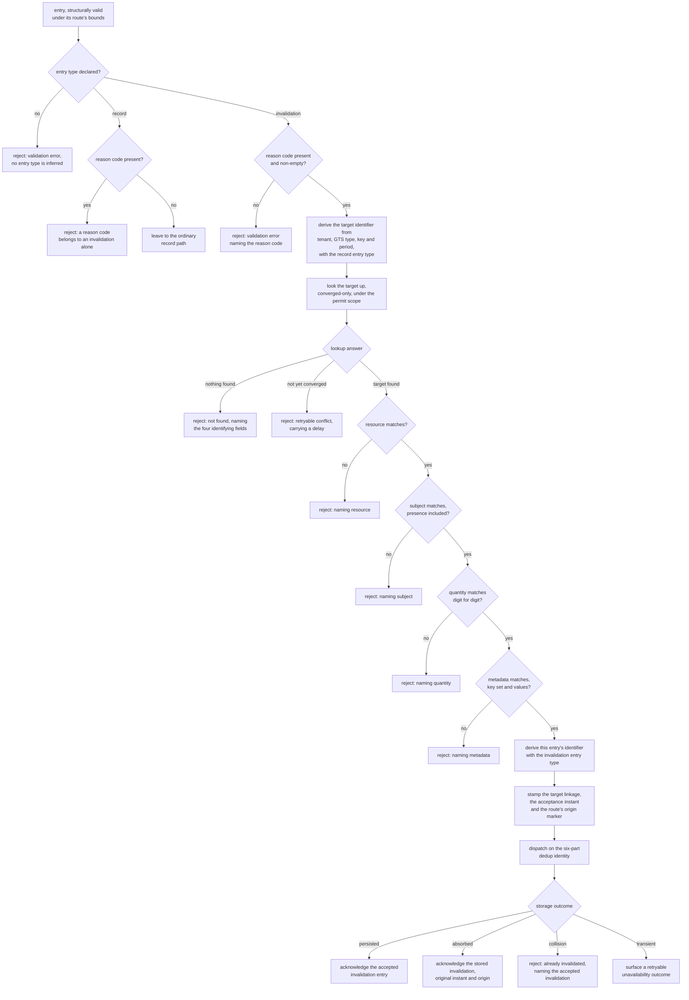

Created:  2026-09-25 by Virtuozzo International GmbH
Updated:  2026-09-25 by Virtuozzo International GmbH

# Feature: Record Invalidation & Corrections

- [ ] `p1` - **ID**: `cpt-cf-usage-collector-featstatus-record-invalidation-implemented`

- [ ] `p1` - `cpt-cf-usage-collector-feature-record-invalidation`

Delivers the ledger's only correction primitive: an appended invalidation entry
that copies its target faithfully, carries a reason code, and withdraws that
target from every fold, while both entries stay persisted and readable exactly
as they were accepted.

<!-- toc -->

- [1. Feature Context](#1-feature-context)
  - [1.1 Overview](#11-overview)
  - [1.2 Purpose](#12-purpose)
  - [1.3 Actors](#13-actors)
  - [1.4 References](#14-references)
- [2. Actor Flows (CDSL)](#2-actor-flows-cdsl)
  - [Withdraw a Usage Record on the Live Path](#withdraw-a-usage-record-on-the-live-path)
  - [Withdraw a Record Whose Period Predates the Live Past Tolerance](#withdraw-a-record-whose-period-predates-the-live-past-tolerance)
  - [Resubmit a Withdrawal After an Uncertain Outcome](#resubmit-a-withdrawal-after-an-uncertain-outcome)
  - [Replace a Mis-measured Quantity](#replace-a-mis-measured-quantity)
  - [Inspect the Linkage of a Withdrawn Pair](#inspect-the-linkage-of-a-withdrawn-pair)
- [3. Processes / Business Logic (CDSL)](#3-processes--business-logic-cdsl)
  - [Discriminate the Entry Type and Apply the Reason-Code Rule](#discriminate-the-entry-type-and-apply-the-reason-code-rule)
  - [Resolve the Withdrawal Target](#resolve-the-withdrawal-target)
  - [Validate the Faithful Copy](#validate-the-faithful-copy)
  - [Stamp the Withdrawal Linkage](#stamp-the-withdrawal-linkage)
  - [Map the Invalidation Collision Outcome](#map-the-invalidation-collision-outcome)
  - [Bind an Invalidation to the Bounds of Its Route](#bind-an-invalidation-to-the-bounds-of-its-route)
- [4. States (CDSL)](#4-states-cdsl)
- [5. Definitions of Done](#5-definitions-of-done)
  - [Explicit Entry-Type Discrimination](#explicit-entry-type-discrimination)
  - [Mandatory Reason Code on an Invalidation](#mandatory-reason-code-on-an-invalidation)
  - [Converged-Only Target Resolution](#converged-only-target-resolution)
  - [Faithful-Copy Validation Against the Resolved Target](#faithful-copy-validation-against-the-resolved-target)
  - [Server-Assigned Withdrawal Linkage](#server-assigned-withdrawal-linkage)
  - [At Most One Invalidation per Entry](#at-most-one-invalidation-per-entry)
  - [No Invalidation of an Invalidation](#no-invalidation-of-an-invalidation)
  - [Both Entries Persisted and Readable](#both-entries-persisted-and-readable)
  - [Invalidation on the Bulk Import Route](#invalidation-on-the-bulk-import-route)
  - [Typed Invalidation Outcomes](#typed-invalidation-outcomes)
- [6. Acceptance Criteria](#6-acceptance-criteria)

<!-- /toc -->

## 1. Feature Context

### 1.1 Overview

An emitter sometimes accepts a measurement that was never true. This feature is
the single answer the gear offers. The caller appends a second entry that
repeats every caller-supplied field of the entry it withdraws, declares the
invalidation entry type, and adds a reason code. The gear resolves the target
from the copied fields, checks the copy against it, and persists the new entry.
Nothing is rewritten and nothing is deleted.

The feature owns four rules enforced at the Ingestion Gateway and two that hold
by construction. The enforced ones are explicit entry-type discrimination,
converged-only target resolution, faithful-copy validation, and the reason-code
rule. The two that need no check of their own are that no invalidation can
withdraw another invalidation, and that one entry carries at most one accepted
invalidation. Both follow from the shared dedup identity, not from a store-side
rule.

It owns the invalidation variant of two routes: `POST
/usage-collector/v1/records` on the live path, and `POST
/usage-collector/v1/records/backfill` on the import path. The SDK ingestion and
backfill methods carry the same variant in process.

Everything an entry needs before the invalidation rules run belongs elsewhere.
The authorization decision belongs to
`cpt-cf-usage-collector-feature-attribution-authorization`. Resolving the GTS
type reference — the reference naming a registry-owned usage type declaration —
belongs to `cpt-cf-usage-collector-feature-usage-type-resolution`. Structural
validation of the period, the quantity and the metadata, plus the identity
derivation this feature reuses to find a target, belong to
`cpt-cf-usage-collector-feature-usage-record-ingestion`. Persisting the entry
belongs to `cpt-cf-usage-collector-feature-pluggable-storage`.

The component that hosts all of it is
`cpt-cf-usage-collector-component-ingestion-gateway`, the single synchronous
write choke point. There is no correction endpoint, no correction SDK method,
and no correction call on the storage plugin interface.

### 1.2 Purpose

A metering ledger that lets a stored measurement be edited cannot be audited,
and it cannot serve a paginated feed. A status flip on an already-delivered row
is a mutation a scan can observe, which would break the snapshot guarantee
downstream consumers read under. Expressing the correction as an appended entry
removes both problems at once, and it is what
`cpt-cf-usage-collector-principle-append-only-ledger` asserts.

Withdrawal is also the only correction whose meaning survives every declared
aggregation fold. A signed adjustment would have to mean one thing under an
accrued sum and another under a latest observation, and the write path reads no
fold at all. Withdrawing the whole entry needs no such interpretation.

The faithful copy exists so that no surface has to special-case a sparse
correction marker. The copied period keeps the withdrawal inside the same time
range an auditor scans. The copied metadata keeps it inside the same grouped and
filtered reads that surfaced the target. The copied key and period make the
entry's own identifier derivable. The copied quantity lets a consumer that reads
only the withdrawal know what is being withdrawn. The quantity is an echo and
never a negation, so no reader may infer a correction from a quantity's value or
sign.

The reason code exists so that a duplicate withdrawal, a mis-attribution fix and
a metering-bug fix stay distinguishable after the fact, without correlating
against whatever out-of-band process prompted the correction.

**Requirements**: `cpt-cf-usage-collector-fr-record-invalidation`,
`cpt-cf-usage-collector-fr-invalidation-reason-code`

**Principles**: `cpt-cf-usage-collector-principle-append-only-ledger`

**Constraints**: none. This feature is bound by the two requirements and the
principle above. It adds no design constraint beyond those
`cpt-cf-usage-collector-feature-usage-record-ingestion` already carries on the
write path.

**Component**: `cpt-cf-usage-collector-component-ingestion-gateway`

**Sequences**: `cpt-cf-usage-collector-seq-invalidate-record`. DESIGN owns that
sequence and fixes the call order across the gateway, the policy decision point,
the Type Resolver and the Plugin Host. This feature defines the behavior of the
steps that belong to it and restates no part of the sequence itself.

**Use cases**: `cpt-cf-usage-collector-usecase-invalidate-record`

**API**:

- REST live route: `POST /usage-collector/v1/records`, operation
  `usage_collector.create_usage_records`, for a submission declaring the
  invalidation entry type. Batch only, as on the ordinary record path.
- REST import route: `POST /usage-collector/v1/records/backfill`, operation
  `usage_collector.backfill_usage_records`, for a submission declaring the
  invalidation entry type.
- SDK: `cpt-cf-usage-collector-interface-sdk-client`, the in-process ingestion
  and bulk-import methods. Neither adds a correction method of its own.

This feature defines no endpoint. Both routes above are defined in DESIGN §3.3
and shared with other features.

**ADRs**: `cpt-cf-usage-collector-adr-append-only-invalidation`

**Entities**: `UsageRecord` in its invalidation form, `CreateUsageRecord`,
`EntryType`, `RecordOrigin`, `IdempotencyKey`, `RecordMetadata`

**Data**: none. The gear declares no database or table component identifier for
this feature. The ledger is wholly plugin-owned and reached only through the
storage plugin interface, so nothing here writes gear-owned schema.

### 1.3 Actors

| Actor | Role in Feature |
|-------|-----------------|
| `cpt-cf-usage-collector-actor-usage-source` | Submits the invalidation entry, repeating its target's caller-supplied fields and supplying the reason code. Reads the per-entry acknowledgement to learn whether the withdrawal landed. |
| `cpt-cf-usage-collector-actor-platform-operator` | Corrects bad data through this same path rather than through an operator-only surface. Routes a withdrawal whose period predates the live past tolerance onto the import route. |
| `cpt-cf-usage-collector-actor-platform-developer` | Integrates a calling gear against the SDK trait or the REST routes, and computes a target's identifier offline before submitting the withdrawal. |
| `cpt-cf-usage-collector-actor-storage-backend` | Answers the converged-only target lookup, enforces the six-part dedup identity with the entry type included, and persists the invalidation entry with its server-assigned linkage untouched. |
| `cpt-cf-usage-collector-actor-usage-consumer` | Reads both entries of a withdrawn pair as persisted, pairs them through the linkage the gear stamped, and reads the reason code the correction carries. |
| `cpt-cf-usage-collector-actor-tenant-admin` | Reconstructs correction history for the administered tenant from the pair of entries the ledger retains. |
| `cpt-cf-usage-collector-actor-types-registry` | Holds the declaration the withdrawal validates against, exactly as it does for the entry being withdrawn. |

### 1.4 References

- **PRD**: [PRD.md](../PRD.md) — §5.6 corrections, record invalidation and the
  invalidation reason code; §5.9 record identity and the path-owned time bounds;
  §7.3 the invalidate-record use case.
- **Design**: [DESIGN.md](../DESIGN.md) — §2.1 the append-only ledger principle;
  §3.1 the entity table, field ownership, and the invariants Target resolution,
  Faithful copy, Echo not compensation, Entry type and reason code, At most one
  invalidation, No invalidation of an invalidation, Permanence, and Append-only;
  §3.2 the Ingestion Gateway; §3.3 the error contract and the plugin obligation
  to decide a converged-only lookup; §3.6 the invalidate-record sequence.
- **ADRs**:
  [0010](../ADR/0010-cpt-cf-usage-collector-adr-append-only-invalidation.md)
- **Dependencies**:
  `cpt-cf-usage-collector-feature-usage-record-ingestion`,
  `cpt-cf-usage-collector-feature-attribution-authorization`,
  `cpt-cf-usage-collector-feature-usage-type-resolution`, and
  `cpt-cf-usage-collector-feature-pluggable-storage`. This feature is in turn
  consumed by `cpt-cf-usage-collector-feature-usage-query` and
  `cpt-cf-usage-collector-feature-usage-feed`, both of which read the entry type
  and the target linkage this feature establishes.

**Division of the import route with backfill and retention governance.** The
route `POST /usage-collector/v1/records/backfill` is shared, and the split is
settled here rather than left open.
`cpt-cf-usage-collector-feature-backfill-retention` owns the route itself: its
configurable hard window bound, the distinct permission every entry on it
requires whatever its kind, the workload isolation that keeps import traffic off
the live path, and the origin marker the gateway stamps on every entry the route
admits. This feature owns the invalidation variant travelling that route: the
entry-type discrimination, the reason-code rule, target resolution, the faithful
copy, and the collision outcomes. The period bounds applied to a backfilled
invalidation are path-owned, so this feature defers to
`cpt-cf-usage-collector-feature-backfill-retention` for the window and owns
everything else about the entry. That division mirrors the scope statement of
the backfill and retention decomposition entry, which assigns the invalidation
rules on the route to this feature.

**Owned elsewhere, referenced here.** The exclusion of a withdrawn pair from a
fold belongs to `cpt-cf-usage-collector-feature-usage-query`. Delivering the
correction at its own feed position, after the entry it withdraws, belongs to
`cpt-cf-usage-collector-feature-usage-feed`. This feature states only what it
guarantees to both: an accepted invalidation, a resolved and stamped target
linkage, and two entries that remain readable.

## 2. Actor Flows (CDSL)

Each flow below enters through an ingestion route and reaches the invalidation
rules only after admission, authorization, type resolution and structural
validation have run. Those four steps appear as single steps, because the
features that own them define their behavior.

### Withdraw a Usage Record on the Live Path

- [ ] `p1` - **ID**: `cpt-cf-usage-collector-flow-withdraw-usage-record`

**Actor**: `cpt-cf-usage-collector-actor-usage-source`

**Success Scenarios**:
- A well-formed invalidation entry resolves its target, matches it field for
  field, and is persisted carrying its own derived identifier, its own
  acceptance instant, the live origin marker, the reason code, and the resolved
  target linkage.
- A batch mixing ordinary entries and invalidation entries is decided per entry,
  and the acknowledgements come back in the order the entries were submitted.
- The caller computes the target's identifier offline from the fields it is
  about to copy, and the linkage the gear returns equals that identifier.

**Error Scenarios**:
- The submission declares no entry type. It is rejected, because the entry type
  has no default and is never inferred from any other field.
- The submission declares the invalidation entry type and carries an empty
  reason code, or none at all. It is rejected with a validation error naming the
  field.
- No entry carries the copied tenant, GTS type, idempotency key and covered
  period. The rejection states that those four fields identify the target.
- The target exists but its dedup identity has not converged, including a target
  submitted in the same request. The rejection is retryable and carries a delay.
- A copied field that did not resolve the target — resource, subject, quantity or
  metadata — differs from the target's. The rejection names the field.
- An accepted invalidation already withdraws the target under a different reason
  code. The rejection states that the target is already invalidated.
- The copied period ends further back than the live past tolerance. The
  rejection names the instant, the bound and the import route.

**Steps**:
1. [ ] - `p1` - Usage source reads the target's caller-supplied fields from its own emission, or from a point lookup or raw read - `inst-withdraw-read-target`
2. [ ] - `p1` - Usage source builds an entry copying those fields, declaring the invalidation entry type, and adding a non-empty reason code - `inst-withdraw-build`
3. [ ] - `p1` - Usage source submits the entry on the live ingestion route - `inst-withdraw-submit`
4. [ ] - `p1` - Gateway admits, authorizes and resolves the declaration through the features that own those steps - `inst-withdraw-preflight`
5. [ ] - `p1` - Gateway runs `cpt-cf-usage-collector-algo-entry-type-discrimination` over the entry - `inst-withdraw-discriminate`
6. [ ] - `p1` - **IF** the entry type is absent, or the reason code rule is broken - `inst-withdraw-type-bad`
   1. [ ] - `p1` - **RETURN** a per-entry validation rejection naming the offending field, with nothing persisted - `inst-withdraw-type-return`
7. [ ] - `p1` - Gateway validates the period, the quantity and the metadata through `cpt-cf-usage-collector-algo-entry-structural-validation`, under the live route's bounds - `inst-withdraw-structural`
8. [ ] - `p1` - Gateway runs `cpt-cf-usage-collector-algo-target-resolution` to obtain the target - `inst-withdraw-resolve`
9. [ ] - `p1` - **IF** target resolution yields no target, or an undecided one - `inst-withdraw-no-target`
   1. [ ] - `p1` - **RETURN** the outcome that resolution produced, not found or retryable, with nothing persisted - `inst-withdraw-no-target-return`
10. [ ] - `p1` - Gateway runs `cpt-cf-usage-collector-algo-faithful-copy-validation` against the resolved target - `inst-withdraw-copy-check`
11. [ ] - `p1` - **IF** any compared field differs - `inst-withdraw-mismatch`
    1. [ ] - `p1` - **RETURN** a validation rejection naming the single field that differs, with nothing persisted - `inst-withdraw-mismatch-return`
12. [ ] - `p1` - Gateway derives the entry's own identifier through `cpt-cf-usage-collector-algo-entry-identity-derivation`, with the entry type set to the invalidation literal - `inst-withdraw-derive`
13. [ ] - `p1` - Gateway runs `cpt-cf-usage-collector-algo-withdrawal-linkage-stamping` to stamp the resolved target linkage, then stamps the remaining server-assigned fields through `cpt-cf-usage-collector-algo-server-field-stamping` - `inst-withdraw-stamp`
14. [ ] - `p1` - Gateway dispatches the entry through `cpt-cf-usage-collector-algo-plugin-dispatch` - `inst-withdraw-dispatch`
15. [ ] - `p1` - Gateway maps the storage outcome through `cpt-cf-usage-collector-algo-invalidation-collision-outcome` - `inst-withdraw-outcome`
16. [ ] - `p1` - **RETURN** the per-entry acknowledgement, carrying either the persisted invalidation entry or its own error - `inst-withdraw-return`

### Withdraw a Record Whose Period Predates the Live Past Tolerance

- [ ] `p1` - **ID**: `cpt-cf-usage-collector-flow-invalidate-backfilled-record`

**Actor**: `cpt-cf-usage-collector-actor-platform-operator`

**Success Scenarios**:
- An operator correcting an emitter defect withdraws entries whose periods are
  weeks old, on the import route, and each withdrawal is accepted under exactly
  the invalidation rules the live route applies.
- The accepted withdrawal carries the import origin marker, because the marker
  records the route the entry arrived on rather than the age of its period.
- A target that was itself imported is withdrawn on the same route, and the
  target lookup reads the entry regardless of which route originally admitted
  it.

**Error Scenarios**:
- The caller holds the live ingestion permission but not the import one. The
  request is refused by the route, and this feature applies no invalidation rule
  to it.
- The copied period falls outside the configured import window. The route
  rejects the entry on its own bound, and no surface admits that period, so the
  target can no longer be withdrawn.
- The submission declares the invalidation entry type and copies its target
  incorrectly. It is rejected exactly as the live route would reject it, because
  the invalidation rules do not vary by route.
- The caller routes a recent withdrawal here to escape the live quota. The
  entry is admitted on the route's own terms, and its origin marker records the
  import route, which downstream consumers read.

**Steps**:
1. [ ] - `p1` - Platform operator establishes that one or more accepted entries were never true, and that their periods predate the live past tolerance - `inst-backdated-establish`
2. [ ] - `p1` - Platform operator builds one invalidation entry per target, each copying its own target and carrying its own reason code - `inst-backdated-build`
3. [ ] - `p1` - Platform operator submits the batch on the import route, under the permission that route requires - `inst-backdated-submit`
4. [ ] - `p1` - Route admits the submission under the rules `cpt-cf-usage-collector-feature-backfill-retention` owns: its permission, its window bound, its workload isolation, and its origin marker - `inst-backdated-route-admission`
5. [ ] - `p1` - **IF** the route refuses the submission or an entry of it - `inst-backdated-route-refuse`
   1. [ ] - `p1` - **RETURN** the route's own refusal, with no invalidation rule applied and nothing persisted - `inst-backdated-route-return`
6. [ ] - `p1` - **FOR EACH** admitted entry declaring the invalidation entry type - `inst-backdated-foreach`
   1. [ ] - `p1` - Gateway runs `cpt-cf-usage-collector-algo-invalidation-route-binding` to confirm which bounds the entry was checked against - `inst-backdated-binding`
   2. [ ] - `p1` - Gateway applies `cpt-cf-usage-collector-algo-entry-type-discrimination`, `cpt-cf-usage-collector-algo-target-resolution` and `cpt-cf-usage-collector-algo-faithful-copy-validation`, unchanged from the live route - `inst-backdated-rules`
   3. [ ] - `p1` - Gateway stamps the target linkage through `cpt-cf-usage-collector-algo-withdrawal-linkage-stamping` and dispatches the entry - `inst-backdated-stamp-dispatch`
   4. [ ] - `p1` - Gateway maps the storage outcome through `cpt-cf-usage-collector-algo-invalidation-collision-outcome` - `inst-backdated-outcome`
7. [ ] - `p1` - **RETURN** the per-entry acknowledgements in input order, each accepted entry carrying the import origin marker the route stamped - `inst-backdated-return`

### Resubmit a Withdrawal After an Uncertain Outcome

- [ ] `p1` - **ID**: `cpt-cf-usage-collector-flow-resubmit-withdrawal`

**Actor**: `cpt-cf-usage-collector-actor-usage-source`

**Success Scenarios**:
- The first withdrawal was persisted but its response was lost. The resubmission
  repeats every field, reason code included, is absorbed, and returns the stored
  invalidation with its original acceptance instant and origin marker.
- The first withdrawal never reached storage. The resubmission is a first write,
  and the caller cannot tell the two cases apart from the response shape.
- Two callers withdraw one target for the same reason. The second is absorbed,
  and the target stays withdrawn exactly once.

**Error Scenarios**:
- The resubmission changes the reason code. It is rejected with a conflict
  stating that the target is already invalidated, and it names the accepted
  invalidation.
- Two withdrawals of one target carrying different reason codes race before the
  identity has converged. They resolve at the plugin's declared deduplication
  level, and the target is withdrawn either way.
- The caller resubmits a withdrawal whose target the plugin discarded under an
  eventual deduplication level. The copy no longer matches the surviving entry,
  and the rejection names the field that differs.
- The caller resubmits after retention freed the identity. The period bound
  refuses the submission first, because the retention floor keeps the import
  window strictly inside retention.

**Steps**:
1. [ ] - `p1` - Usage source receives no response, or a retryable error, for a withdrawal it has already sent - `inst-resubmit-uncertain`
2. [ ] - `p1` - Usage source resubmits the identical entry, repeating the idempotency key, the covered period and the reason code exactly - `inst-resubmit-send`
3. [ ] - `p1` - Gateway derives the same dedup identity and the same identifier, because every derivation input is unchanged - `inst-resubmit-derive`
4. [ ] - `p1` - Gateway resolves the target again, which is unchanged and converged - `inst-resubmit-resolve`
5. [ ] - `p1` - Storage plugin compares the entry against the survivor under that identity, where one exists - `inst-resubmit-compare`
6. [ ] - `p1` - **IF** every caller-supplied field matches, reason code included - `inst-resubmit-equal`
   1. [ ] - `p1` - **RETURN** the stored invalidation as an acceptance, with its original acceptance instant and origin marker, and no second entry created - `inst-resubmit-absorb`
7. [ ] - `p1` - **ELSE** - `inst-resubmit-diverge`
   1. [ ] - `p1` - **RETURN** a conflict stating the target is already invalidated, naming the accepted invalidation and its reason code, with the resubmitted content not persisted - `inst-resubmit-conflict`

### Replace a Mis-measured Quantity

- [ ] `p1` - **ID**: `cpt-cf-usage-collector-flow-replace-mismeasured-quantity`

**Actor**: `cpt-cf-usage-collector-actor-platform-developer`

**Success Scenarios**:
- The developer withdraws the wrong measurement, then emits the right one under
  a fresh idempotency key with the same attribution and the same covered period,
  and both submissions are accepted in their own right.
- The replacement is an ordinary entry: it declares the record entry type,
  carries no reason code, and is validated exactly as any first emission is.
- A genuine decrease in consumption is emitted as an ordinary entry with a
  negative quantity instead, and withdraws nothing.

**Error Scenarios**:
- The developer submits the corrected quantity as the invalidation entry itself.
  The copy check rejects it, naming the quantity, because the correction echoes
  what it withdraws and never replaces it.
- The developer reuses the withdrawn entry's idempotency key for the
  replacement. That identity is taken by the withdrawn entry, so the submission
  is a divergent collision rather than a new measurement.
- The developer changes the attribution or the period on the replacement. That
  is a different measurement rather than a correction of the withdrawn one, and
  the gear accepts it as such without linking it to anything.
- A consumer reads the feed between the two submissions and treats the interval
  as a settled period. The gear guarantees no atomicity across the pair, and the
  consumer contract states so.

**Steps**:
1. [ ] - `p1` - Platform developer establishes that an accepted entry carries a wrong quantity - `inst-replace-establish`
2. [ ] - `p1` - Platform developer withdraws it through `cpt-cf-usage-collector-flow-withdraw-usage-record`, echoing the wrong quantity unchanged - `inst-replace-withdraw`
3. [ ] - `p1` - **IF** the withdrawal is not accepted - `inst-replace-not-accepted`
   1. [ ] - `p1` - **RETURN** the withdrawal's own outcome, and emit no replacement, since the wrong measurement still stands - `inst-replace-abort`
4. [ ] - `p1` - Platform developer emits the corrected measurement through `cpt-cf-usage-collector-flow-emit-usage-record`, under a fresh idempotency key - `inst-replace-emit`
5. [ ] - `p1` - Platform developer keeps the attribution and the covered period identical to the withdrawn entry's - `inst-replace-same-attribution`
6. [ ] - `p1` - **RETURN** three entries on the ledger: the withdrawn one, its invalidation, and the replacement, each readable and none rewritten - `inst-replace-return`

### Inspect the Linkage of a Withdrawn Pair

- [ ] `p1` - **ID**: `cpt-cf-usage-collector-flow-inspect-withdrawal-linkage`

**Actor**: `cpt-cf-usage-collector-actor-usage-consumer`

**Success Scenarios**:
- The consumer reads the invalidation entry and learns which entry it withdraws
  from the server-stamped linkage, with no derivation of its own.
- The consumer reads the reason code on every ledger read path that exposes the
  correction.
- The consumer reads the withdrawn entry itself and finds it byte-identical to
  the day it was accepted, with no status field and no lifecycle flag on it.

**Error Scenarios**:
- The consumer looks for a reverse pointer from the withdrawn entry to its
  invalidation. There is none: the linkage runs one way, and a consumer that
  needs the reverse direction derives the invalidation's identifier from the
  withdrawn entry's own fields.
- The consumer expects the withdrawn entry to disappear from a ledger read. It
  does not, and a consumer that wants withdrawal applied reads an aggregation
  instead.
- The consumer tries to reverse an accepted invalidation. No surface offers
  that, because an accepted correction is permanent.

**Steps**:
1. [ ] - `p1` - Usage consumer reads an invalidation entry on a ledger read path - `inst-inspect-read`
2. [ ] - `p1` - Usage consumer reads the target linkage the gateway stamped, together with the reason code and the entry type - `inst-inspect-fields`
3. [ ] - `p1` - Usage consumer fetches the withdrawn entry by that identifier - `inst-inspect-fetch`
4. [ ] - `p1` - **IF** the consumer instead holds the withdrawn entry and wants its correction - `inst-inspect-reverse`
   1. [ ] - `p1` - Usage consumer derives the invalidation's identifier from the withdrawn entry's own fields, through `cpt-cf-usage-collector-flow-reproduce-identity-offline` - `inst-inspect-derive`
5. [ ] - `p1` - **RETURN** both entries, each as persisted, the pair reconstructible in either direction - `inst-inspect-return`

## 3. Processes / Business Logic (CDSL)

The order of the steps below is load-bearing in three places. Entry-type
discrimination runs first, because every later rule is conditional on the entry
being an invalidation. Target resolution runs before the copy check, because the
copy is compared against the target it found. Linkage stamping runs after the
copy check and before dispatch, because the plugin persists the value the
gateway handed it and never derives one of its own.

The diagram states the whole invalidation-specific path, from the point where
admission, authorization, type resolution and structural validation have already
passed, to the point where an acknowledgement is produced.

### Discriminate the Entry Type and Apply the Reason-Code Rule

- [ ] `p1` - **ID**: `cpt-cf-usage-collector-algo-entry-type-discrimination`

**Input**: one submitted ingestion shape, before any invalidation rule runs.

**Output**: a decision that the entry is an ordinary record, that it is an
invalidation to be carried through the remaining rules, or a validation
rejection naming the offending field.

**Steps**:
1. [ ] - `p1` - Read the declared entry type from the submitted shape - `inst-discriminate-read`
2. [ ] - `p1` - **IF** no entry type is declared - `inst-discriminate-absent`
   1. [ ] - `p1` - **RETURN** a validation rejection naming the entry type, applying no default and reading no other field - `inst-discriminate-absent-return`
3. [ ] - `p1` - **IF** the declared value is outside the closed pair of admissible values - `inst-discriminate-unknown`
   1. [ ] - `p1` - **RETURN** a validation rejection naming the entry type and the admissible values - `inst-discriminate-unknown-return`
4. [ ] - `p1` - **IF** the entry declares the record entry type - `inst-discriminate-record`
   1. [ ] - `p1` - **IF** a reason code is present under any value, an empty one included - `inst-discriminate-record-reason`
      1. [ ] - `p1` - **RETURN** a validation rejection stating that a reason code accompanies an invalidation alone - `inst-discriminate-record-reject`
   2. [ ] - `p1` - **RETURN** the decision that the entry is an ordinary record, leaving it to the ingestion feature - `inst-discriminate-record-return`
5. [ ] - `p1` - **IF** the reason code is absent, empty, or blank after trimming surrounding whitespace - `inst-discriminate-reason-missing`
   1. [ ] - `p1` - **RETURN** a validation rejection naming the reason code - `inst-discriminate-reason-return`
6. [ ] - `p1` - Treat the reason code as an opaque caller-supplied value, matching it against no enumeration and interpreting none of its content - `inst-discriminate-opaque`
7. [ ] - `p1` - Read no quantity value and no quantity sign at any step of this process - `inst-discriminate-no-quantity`
8. [ ] - `p1` - **RETURN** the decision that the entry is an invalidation, to be carried through target resolution - `inst-discriminate-return`

### Resolve the Withdrawal Target

- [ ] `p1` - **ID**: `cpt-cf-usage-collector-algo-target-resolution`

**Input**: one invalidation entry whose structural validation has passed, and
the compiled authorization scope of the calling context.

**Output**: the resolved target entry, or a not-found rejection, or a retryable
not-converged rejection.

**Steps**:
1. [ ] - `p1` - Take the entry's own tenant, GTS type reference, idempotency key, period start and period end - `inst-resolve-take-fields`
2. [ ] - `p1` - Derive the target's identifier through `cpt-cf-usage-collector-algo-entry-identity-derivation`, supplying those five values with the record entry type as the sixth - `inst-resolve-derive`
3. [ ] - `p1` - Request the entry under that identifier from the storage plugin, under the compiled scope, asking for a converged answer only - `inst-resolve-lookup`
4. [ ] - `p1` - **IF** the plugin answers that the identity has not converged - `inst-resolve-unconverged`
   1. [ ] - `p1` - **RETURN** a retryable conflict carrying the configured retry delay, so the copy is never checked against a write the plugin may discard - `inst-resolve-unconverged-return`
5. [ ] - `p1` - **IF** the plugin answers that nothing is found, the target lying outside the compiled scope included - `inst-resolve-missing`
   1. [ ] - `p1` - **RETURN** a not-found rejection stating that the target is identified by tenant, GTS type, idempotency key and covered period - `inst-resolve-missing-return`
6. [ ] - `p1` - **IF** the returned entry declares the invalidation entry type - `inst-resolve-wrong-kind`
   1. [ ] - `p1` - **RETURN** an internal failure, since the derived identifier carried the record entry type and a plugin answering otherwise has breached its contract - `inst-resolve-wrong-kind-return`
7. [ ] - `p1` - **RETURN** the resolved target, together with the identifier that resolved it - `inst-resolve-return`

### Validate the Faithful Copy

- [ ] `p1` - **ID**: `cpt-cf-usage-collector-algo-faithful-copy-validation`

**Input**: one invalidation entry and the target it resolved.

**Output**: acceptance of the copy, or a validation rejection naming exactly one
field that differs.

**Steps**:
1. [ ] - `p1` - Skip tenant, GTS type reference, idempotency key, period start and period end, because those five resolved the target and cannot differ from it - `inst-copy-skip-identifying`
2. [ ] - `p1` - Compare the resource reference, both its identifier leaf and its type leaf - `inst-copy-resource`
3. [ ] - `p1` - **IF** either resource leaf differs - `inst-copy-resource-bad`
   1. [ ] - `p1` - **RETURN** a validation rejection naming the resource - `inst-copy-resource-return`
4. [ ] - `p1` - Compare the subject reference, treating presence on one entry against absence on the other as a difference - `inst-copy-subject`
5. [ ] - `p1` - **IF** the subject differs in presence, in its identifier leaf, or in its type leaf - `inst-copy-subject-bad`
   1. [ ] - `p1` - **RETURN** a validation rejection naming the subject - `inst-copy-subject-return`
6. [ ] - `p1` - Compare the quantity by exact decimal value, digit for digit and sign included, applying no scaling, rounding or normalization - `inst-copy-quantity`
7. [ ] - `p1` - **IF** the quantity differs - `inst-copy-quantity-bad`
   1. [ ] - `p1` - **RETURN** a validation rejection naming the quantity, and stating that the copy echoes what it withdraws rather than negating or replacing it - `inst-copy-quantity-return`
8. [ ] - `p1` - Compare the metadata as a whole: the same key set, and the same value under each key - `inst-copy-metadata`
9. [ ] - `p1` - **IF** the metadata differs by one key or one value - `inst-copy-metadata-bad`
   1. [ ] - `p1` - **RETURN** a validation rejection naming the metadata and the differing key - `inst-copy-metadata-return`
10. [ ] - `p1` - Compare no server-assigned value: neither identifier, acceptance instant, origin marker, nor target linkage takes part - `inst-copy-no-server-fields`
11. [ ] - `p1` - **RETURN** acceptance of the copy - `inst-copy-return`

### Stamp the Withdrawal Linkage

- [ ] `p1` - **ID**: `cpt-cf-usage-collector-algo-withdrawal-linkage-stamping`

**Input**: one invalidation entry whose copy has been validated, and the
identifier of the resolved target.

**Output**: the entry carrying the server-assigned target linkage.

**Steps**:
1. [ ] - `p1` - Reject the submission where the caller supplied a target linkage on the wire, since that value is server-assigned on every surface - `inst-linkage-reject-supplied`
2. [ ] - `p1` - Set the target linkage on the entry to the identifier that target resolution returned - `inst-linkage-set`
3. [ ] - `p1` - Exclude the linkage from the entry's own identity derivation, so the identifier depends on the six declared components alone - `inst-linkage-not-derivation-input`
4. [ ] - `p1` - Exclude the linkage from every collision comparison, since it is a consequence of the identity rather than caller content - `inst-linkage-not-compared`
5. [ ] - `p1` - Hand the stamped value to the storage plugin, which persists it rather than deriving one - `inst-linkage-handoff`
6. [ ] - `p1` - **RETURN** the entry, ready for the remaining server-field stamping and for dispatch - `inst-linkage-return`

### Map the Invalidation Collision Outcome

- [ ] `p1` - **ID**: `cpt-cf-usage-collector-algo-invalidation-collision-outcome`

**Input**: the storage outcome for one dispatched invalidation entry.

**Output**: one per-entry acknowledgement or one typed error.

**Steps**:
1. [ ] - `p1` - **IF** the plugin persisted the entry - `inst-collision-persisted`
   1. [ ] - `p1` - **RETURN** an acceptance carrying the persisted invalidation, its reason code and its target linkage - `inst-collision-persisted-return`
2. [ ] - `p1` - **IF** the plugin absorbed the entry against an identical stored invalidation - `inst-collision-absorbed`
   1. [ ] - `p1` - **RETURN** an acceptance carrying the stored invalidation, with its original acceptance instant and origin marker and no second entry created - `inst-collision-absorbed-return`
3. [ ] - `p1` - **IF** the plugin reported a collision on the dedup identity - `inst-collision-conflict`
   1. [ ] - `p1` - **IF** the stored entry the plugin named declares the record entry type - `inst-collision-wrong-kind`
      1. [ ] - `p1` - **RETURN** an internal failure, since the dedup identity includes the entry type and the plugin has breached its contract - `inst-collision-wrong-kind-return`
   2. [ ] - `p1` - **RETURN** an already-invalidated conflict naming the target, the accepted invalidation and its reason code, since only the reason code can differ under a faithful copy - `inst-collision-conflict-return`
4. [ ] - `p1` - **IF** the plugin reported a transient failure - `inst-collision-transient`
   1. [ ] - `p1` - **RETURN** a retryable unavailability outcome, never reported as a collision - `inst-collision-transient-return`
5. [ ] - `p1` - Resolve two entries of one submission sharing one identity the later against the earlier, by these same rules - `inst-collision-intra-batch`
6. [ ] - `p1` - **RETURN** the mapped outcome, carried in the acknowledgement position matching the entry's input order - `inst-collision-return`

### Bind an Invalidation to the Bounds of Its Route

- [ ] `p1` - **ID**: `cpt-cf-usage-collector-algo-invalidation-route-binding`

**Input**: one invalidation entry and the route it arrived on.

**Output**: the set of period bounds the entry is checked against, and the owner
of each.

**Steps**:
1. [ ] - `p1` - Read the route the submission arrived on, live ingestion or bulk import - `inst-binding-read-route`
2. [ ] - `p1` - **IF** the route is live ingestion - `inst-binding-live`
   1. [ ] - `p1` - Apply the two-sided live time bound through `cpt-cf-usage-collector-algo-covered-period-validation`, over the copied period - `inst-binding-live-bounds`
   2. [ ] - `p1` - Make the past-bound rejection name the import route, since a withdrawal reaching further back belongs there - `inst-binding-live-name-route`
3. [ ] - `p1` - **ELSE** - `inst-binding-import`
   1. [ ] - `p1` - Defer the window bound entirely to `cpt-cf-usage-collector-feature-backfill-retention`, which owns the route, its window, its permission and its isolation - `inst-binding-import-defer`
   2. [ ] - `p1` - Apply no additional period rule of this feature's own, since the entry kind confers no wider retroactive reach - `inst-binding-import-no-extra`
4. [ ] - `p1` - Apply every remaining invalidation rule identically on both routes - `inst-binding-rules-identical`
5. [ ] - `p1` - Take the origin marker from the route rather than from the entry's kind or the age of its period - `inst-binding-origin`
6. [ ] - `p1` - **RETURN** the bound entry, checked against its route's period rules and this feature's invalidation rules - `inst-binding-return`

## 4. States (CDSL)

**Not applicable.** This feature introduces no lifecycle of its own, for two
structural reasons.

An accepted entry has no states at all. The ledger is append-only, there is no
status field and no lifecycle flag, and an accepted invalidation is permanent.
Withdrawal is a property of the pair as read, never a transition on the
withdrawn entry.

The one lifecycle this feature does depend on is already modelled, in
`cpt-cf-usage-collector-state-dedup-identity`, owned by
`cpt-cf-usage-collector-feature-usage-record-ingestion`. Target resolution reads
the converged state of that machine, and the at-most-one rule follows from the
same machine applied to the invalidation's own identity. Restating those states
here would duplicate the model rather than add one.

## 5. Definitions of Done

### Explicit Entry-Type Discrimination

- [ ] `p1` - **ID**: `cpt-cf-usage-collector-dod-explicit-entry-type`

The system **MUST** require an explicitly declared entry type on every
submission on every ingestion route, and **MUST** apply no default when one is
absent. It **MUST** reject a submission carrying no entry type with an
actionable validation error naming the field. It **MUST NOT** infer the entry
type from any other field, and in particular **MUST NOT** read the value or the
sign of a quantity to decide it. A submission copying a target's fields while
declaring the record entry type **MUST** be treated as an ordinary record, so
that it is absorbed as a retry of the target and withdraws nothing. The
admissible values **MUST** stay a closed pair, and a third value **MUST** be
rejected rather than accepted as an extension.

**Implements**:
- `cpt-cf-usage-collector-algo-entry-type-discrimination`
- `cpt-cf-usage-collector-flow-withdraw-usage-record`

**Touches**:
- API: `POST /usage-collector/v1/records`,
  `POST /usage-collector/v1/records/backfill`
- Component: `cpt-cf-usage-collector-component-ingestion-gateway`
- Entities: `EntryType`, `CreateUsageRecord`

### Mandatory Reason Code on an Invalidation

- [ ] `p1` - **ID**: `cpt-cf-usage-collector-dod-mandatory-reason-code`

The system **MUST** require a non-empty reason code on every entry declaring the
invalidation entry type, and **MUST** reject an absent, empty or
whitespace-only one with an actionable validation error naming the field. It
**MUST** reject a reason code on an entry declaring the record entry type,
including one whose quantity is negative, since a negative measurement records
real consumption rather than a correction. The system **MUST** treat the reason
code as an opaque caller-supplied value: it **MUST NOT** match it against an
enumeration, derive behavior from its content, or alter any outcome by it. Every
ledger read path exposing a correction **MUST** return the reason code, and the
conflict raised against an already-invalidated target **MUST** carry the stored
one.

**Implements**:
- `cpt-cf-usage-collector-algo-entry-type-discrimination`
- `cpt-cf-usage-collector-algo-invalidation-collision-outcome`

**Touches**:
- API: `POST /usage-collector/v1/records`,
  `POST /usage-collector/v1/records/backfill`
- Component: `cpt-cf-usage-collector-component-ingestion-gateway`
- Entities: `UsageRecord`, `CreateUsageRecord`

### Converged-Only Target Resolution

- [ ] `p1` - **ID**: `cpt-cf-usage-collector-dod-converged-target-resolution`

The system **MUST** derive the withdrawal target's identifier from the
invalidation entry's own tenant, GTS type reference, idempotency key, period
start and period end, taken with the record entry type as the sixth derivation
component, and **MUST** use the same derivation
`cpt-cf-usage-collector-feature-usage-record-ingestion` defines. It **MUST NOT**
accept a caller-supplied target reference on any surface. The lookup **MUST**
run under the compiled authorization scope and **MUST** ask for a converged
answer only, so that a copy is never validated against a write the storage
plugin may later discard. An unresolved target **MUST** be rejected with an
actionable not-found error stating that tenant, GTS type, idempotency key and
covered period identify it, and a target outside the caller's scope **MUST**
draw exactly that answer. A target whose identity has not converged, one
submitted in the same request included, **MUST** be rejected with a retryable
conflict carrying the configured delay. The lookup **MUST NOT** report an
acknowledged, retained entry as absent, and **MUST** reach a definite answer
within the plugin's published convergence bound plus its published query-path
lag bound.

**Implements**:
- `cpt-cf-usage-collector-algo-target-resolution`
- `cpt-cf-usage-collector-flow-withdraw-usage-record`

**Touches**:
- API: `POST /usage-collector/v1/records`,
  `POST /usage-collector/v1/records/backfill`
- Component: `cpt-cf-usage-collector-component-ingestion-gateway`
- Entities: `UsageRecord`, `IdempotencyKey`

### Faithful-Copy Validation Against the Resolved Target

- [ ] `p1` - **ID**: `cpt-cf-usage-collector-dod-faithful-copy-validation`

The system **MUST** compare four caller-supplied fields of an invalidation entry
against the resolved target before persistence: resource reference, subject
reference, quantity and metadata. Presence of a subject on one entry against
absence on the other **MUST** count as a difference. The quantity **MUST** be
compared by exact decimal value including its sign, with no scaling, rounding or
normalization, and the copy **MUST NOT** be negated, adjusted or replaced by a
corrected value. Metadata **MUST** match on the whole key set and on every
value. Any difference **MUST** be rejected with an actionable validation error
naming the field that differs. The five identifying fields **MUST NOT** be
compared, since they resolved the target and cannot differ from it, and no
server-assigned value **MUST** take part in the comparison.

**Implements**:
- `cpt-cf-usage-collector-algo-faithful-copy-validation`
- `cpt-cf-usage-collector-flow-withdraw-usage-record`
- `cpt-cf-usage-collector-flow-replace-mismeasured-quantity`

**Touches**:
- API: `POST /usage-collector/v1/records`,
  `POST /usage-collector/v1/records/backfill`
- Component: `cpt-cf-usage-collector-component-ingestion-gateway`
- Entities: `UsageRecord`, `ResourceRef`, `SubjectRef`, `RecordMetadata`

### Server-Assigned Withdrawal Linkage

- [ ] `p1` - **ID**: `cpt-cf-usage-collector-dod-withdrawal-linkage`

The system **MUST** stamp the resolved target's identifier onto the accepted
invalidation entry as a read-only reference, at the Ingestion Gateway and
nowhere else. It **MUST** reject or ignore a caller-supplied value in that
position on every surface. The linkage **MUST NOT** be an input to the entry's
own identity derivation and **MUST NOT** take part in any collision comparison.
The storage plugin **MUST** persist the value it was handed and **MUST NOT**
re-derive, default or refresh it, and every read path exposing the entry
**MUST** return it unchanged. The linkage **MUST** be the only correction
reference in the model: no read path **MUST** carry a reverse pointer from a
withdrawn entry to its invalidation, which a consumer derives instead from the
withdrawn entry's own fields.

**Implements**:
- `cpt-cf-usage-collector-algo-withdrawal-linkage-stamping`
- `cpt-cf-usage-collector-flow-inspect-withdrawal-linkage`

**Touches**:
- API: `POST /usage-collector/v1/records`,
  `POST /usage-collector/v1/records/backfill`
- Component: `cpt-cf-usage-collector-component-ingestion-gateway`
- Entities: `UsageRecord`

### At Most One Invalidation per Entry

- [ ] `p1` - **ID**: `cpt-cf-usage-collector-dod-single-invalidation-per-entry`

The system **MUST** guarantee that an entry carries at most one accepted
invalidation, and **MUST** obtain that guarantee from the shared dedup identity
rather than from a store-side rule of its own. Every invalidation of one entry
repeats that entry's five shared identity components and declares the
invalidation entry type, so all of them land on one identity. A second
submission carrying the same reason code **MUST** be absorbed and return the
stored invalidation with its original acceptance instant and origin marker. A
second submission carrying a different reason code **MUST** be rejected with an
actionable conflict stating that the target is already invalidated, naming the
accepted invalidation and its reason code. Concurrent submissions **MUST**
resolve at the storage plugin's declared deduplication level, and the target
**MUST** end up withdrawn in either resolution. A plugin naming a stored entry
whose entry type differs from the dispatched one **MUST** surface as an internal
failure rather than as an already-invalidated conflict.

**Implements**:
- `cpt-cf-usage-collector-algo-invalidation-collision-outcome`
- `cpt-cf-usage-collector-flow-resubmit-withdrawal`

**Touches**:
- API: `POST /usage-collector/v1/records`,
  `POST /usage-collector/v1/records/backfill`
- Component: `cpt-cf-usage-collector-component-ingestion-gateway`
- Entities: `EntryType`, `IdempotencyKey`

### No Invalidation of an Invalidation

- [ ] `p1` - **ID**: `cpt-cf-usage-collector-dod-no-invalidation-of-invalidation`

The system **MUST** ensure that a withdrawal target is always an ordinary
record. The property **MUST** hold by construction: target resolution derives
the target identifier with the record entry type fixed as its sixth component,
so no identifier an invalidation resolves can belong to an invalidation. The
implementation **MUST NOT** add a separate check, a candidate-kind filter, or a
cascade of any depth. Where the storage plugin nonetheless returns an entry
declaring the invalidation entry type under that identifier, the system **MUST**
treat it as a plugin contract breach and surface an internal failure rather than
a caller error. No surface **MUST** offer reversal of an accepted invalidation.

**Implements**:
- `cpt-cf-usage-collector-algo-target-resolution`

**Touches**:
- API: `POST /usage-collector/v1/records`,
  `POST /usage-collector/v1/records/backfill`
- Component: `cpt-cf-usage-collector-component-ingestion-gateway`
- Entities: `EntryType`, `UsageRecord`

### Both Entries Persisted and Readable

- [ ] `p1` - **ID**: `cpt-cf-usage-collector-dod-pair-remains-readable`

The system **MUST** keep the ledger append-only in the strict sense when a
withdrawal is accepted. The withdrawn entry **MUST NOT** be updated, deleted,
flagged, superseded, tombstoned or moved, and the accepted invalidation
**MUST** be an additional persisted entry alongside it. No status field and no
lifecycle flag **MUST** exist on either entry. Both entries **MUST** be returned
by every ledger read path, as persisted, each with its own identifier,
acceptance instant, origin marker and idempotency key, and the invalidation with
its reason code and target linkage. No REST route, SDK method or storage plugin
call **MUST** modify an accepted entry, and the absence of such an operation
**MUST** be the mechanism rather than a runtime guard. The downstream features
that apply withdrawal — the fold exclusion in
`cpt-cf-usage-collector-feature-usage-query` and the correction ordering in
`cpt-cf-usage-collector-feature-usage-feed` — **MUST** be able to rely on this
guarantee without re-reading anything the gear mutated.

**Implements**:
- `cpt-cf-usage-collector-flow-withdraw-usage-record`
- `cpt-cf-usage-collector-flow-inspect-withdrawal-linkage`

**Touches**:
- API: `POST /usage-collector/v1/records`,
  `POST /usage-collector/v1/records/backfill`
- Component: `cpt-cf-usage-collector-component-ingestion-gateway`
- Entities: `UsageRecord`

### Invalidation on the Bulk Import Route

- [ ] `p1` - **ID**: `cpt-cf-usage-collector-dod-invalidation-on-import-route`

The system **MUST** accept an invalidation entry on
`POST /usage-collector/v1/records/backfill` and on the SDK bulk-import method,
and **MUST** apply to it every invalidation rule this feature owns, unchanged
from the live route: entry-type discrimination, the reason-code rule, target
resolution, faithful-copy validation, linkage stamping and the collision
outcomes. It **MUST NOT** vary any of those rules by route. The period bounds
applied to such an entry **MUST** be the route's own, owned by
`cpt-cf-usage-collector-feature-backfill-retention`, and this feature **MUST**
add no period rule of its own there, since the entry kind confers no wider
retroactive reach. The route's permission, its window bound, its workload
isolation and the origin marker it stamps **MUST** remain that feature's, and
**MUST** apply to an invalidation exactly as they apply to an ordinary record.
On the live route, the past-bound rejection of a copied period **MUST** name the
import route as the path such a withdrawal belongs on. Target resolution
**MUST** find a target regardless of which route originally admitted it.

**Implements**:
- `cpt-cf-usage-collector-algo-invalidation-route-binding`
- `cpt-cf-usage-collector-flow-invalidate-backfilled-record`

**Touches**:
- API: `POST /usage-collector/v1/records/backfill`
- Component: `cpt-cf-usage-collector-component-ingestion-gateway`
- Entities: `RecordOrigin`, `EntryType`

### Typed Invalidation Outcomes

- [ ] `p1` - **ID**: `cpt-cf-usage-collector-dod-typed-invalidation-outcomes`

The system **MUST** surface each invalidation-specific failure as its own typed
outcome, distinguishable by a caller without parsing a message: a validation
rejection for a missing entry type, for a misplaced or empty reason code, and
for each copy mismatch naming its field; a not-found rejection for an unresolved
target; a retryable conflict for a target that has not converged, carrying a
delay; an already-invalidated conflict for a second withdrawal under a different
reason code; and a retryable unavailability outcome for a transient storage
failure. Each **MUST** travel the gear's canonical error envelope, and the
feature **MUST** register no bespoke error schema of its own. A transient
failure **MUST NOT** be reported as a collision outcome, and a collision
**MUST NOT** be reported as a not-found one. In a batch, each entry **MUST**
carry its own outcome in the acknowledgement position matching its input order,
and one rejected withdrawal **MUST NOT** prevent the other entries of the
submission from being decided.

**Implements**:
- `cpt-cf-usage-collector-algo-invalidation-collision-outcome`
- `cpt-cf-usage-collector-algo-target-resolution`

**Touches**:
- API: `POST /usage-collector/v1/records`,
  `POST /usage-collector/v1/records/backfill`
- Component: `cpt-cf-usage-collector-component-ingestion-gateway`

## 6. Acceptance Criteria

- [ ] A well-formed invalidation entry copying an accepted, converged target is persisted and returned carrying its own identifier, its own acceptance instant, the route's origin marker, the reason code, and the resolved target linkage.
- [ ] The withdrawn entry is byte-identical before and after the withdrawal is accepted, on every field including its acceptance instant, and the persisted shape carries no status field and no lifecycle flag.
- [ ] Both entries of a withdrawn pair are returned by every ledger read path after acceptance, and neither is deleted, rewritten or suppressed.
- [ ] A submission carrying no entry type is rejected with a validation error naming the field, and no entry type is inferred from the quantity's value or sign.
- [ ] A submission copying a target exactly while declaring the record entry type and carrying no reason code is absorbed as a retry of the target, and withdraws nothing.
- [ ] A submission declaring the record entry type while carrying a reason code is rejected with a validation error, including when its quantity is negative.
- [ ] A submission declaring the invalidation entry type with an absent, empty or whitespace-only reason code is rejected with a validation error naming the field.
- [ ] Two invalidations of different targets carrying identical reason-code text are both accepted, confirming that the reason code is opaque and drives no outcome.
- [ ] The target linkage the gear returns equals the identifier computed offline from the target's own five identifying fields and the record entry type.
- [ ] A submission supplying a target linkage on the wire never reaches a persisted entry, on the live route and the import route alike.
- [ ] An invalidation whose copied tenant, GTS type, idempotency key or covered period matches no entry is rejected with a not-found error whose message names those four fields.
- [ ] An invalidation whose target lies outside the caller's authorized scope draws exactly the same not-found answer an absent target draws, revealing nothing about the target's existence.
- [ ] An invalidation whose target was submitted in the same request is rejected with a retryable conflict carrying a delay, and succeeds on resubmission once the target has converged.
- [ ] Against a plugin declaring a linearizable deduplication level, a target accepted in a prior request resolves immediately with no retryable conflict.
- [ ] The converged-only lookup never reports an acknowledged, retained entry as absent, and reaches a definite answer within the plugin's convergence bound plus its query-path lag bound.
- [ ] An invalidation differing from its target in the resource identifier, the resource type, the subject presence, the subject identifier, the subject type, the quantity, a metadata key or a metadata value is rejected in each case with an error naming that field.
- [ ] An invalidation carrying the negated quantity of its target is rejected, naming the quantity, confirming that the copy echoes rather than compensates.
- [ ] An invalidation carrying the corrected quantity instead of the withdrawn one is rejected, naming the quantity.
- [ ] An invalidation whose target has a zero-length covered period is accepted, since a point event is copied like any other period.
- [ ] Resubmitting an accepted invalidation with every field identical returns the stored invalidation with its original acceptance instant and origin marker, and creates no second entry.
- [ ] Resubmitting an accepted invalidation with a different reason code is rejected with an already-invalidated conflict naming the accepted invalidation and its stored reason code.
- [ ] Two concurrent invalidations of one target with different reason codes resolve at the plugin's declared deduplication level, and exactly one invalidation is visible on every read path afterwards.
- [ ] A record, its invalidation under the same key and period, and a retry of the record are all submitted: the retry is absorbed, and a read returns exactly two entries.
- [ ] No implementation path filters candidate targets by entry type, and a plugin returning an invalidation under a target identifier surfaces as an internal failure rather than a caller error.
- [ ] No REST route, SDK method or storage plugin call reverses, deletes or amends an accepted invalidation.
- [ ] An invalidation submitted on the live route whose copied period ends further back than the live past tolerance is rejected with an error naming the instant, the bound and the import route.
- [ ] The same invalidation resubmitted on the import route, within that route's window, is accepted and stamped with the import origin marker.
- [ ] An invalidation submitted on the import route is subjected to the identical entry-type, reason-code, target-resolution and faithful-copy rules the live route applies, verified by running one shared rule suite against both routes.
- [ ] An invalidation whose copied period falls outside the import window is refused by the route before any invalidation rule runs, and no surface admits that period.
- [ ] A caller holding the live ingestion permission but not the import permission is refused on the import route, and no invalidation rule is applied to the refused submission.
- [ ] An invalidation submitted on the import route resolves a target that was originally admitted on the live route, and the reverse case resolves as well.
- [ ] A batch mixing ordinary records and invalidation entries returns per-entry acknowledgements in input order, and one rejected withdrawal leaves the other entries decided on their own merits.
- [ ] Every invalidation failure — missing entry type, misplaced reason code, copy mismatch, unresolved target, unconverged target, already-invalidated target, transient storage failure — surfaces as its own typed outcome inside the canonical error envelope, distinguishable without parsing a message.
- [ ] A transient storage failure on a dispatched invalidation surfaces as a retryable unavailability outcome and never as an already-invalidated conflict.
- [ ] Withdrawing a mis-measured quantity and re-emitting it under a fresh idempotency key with the same attribution and period leaves three readable entries, with no link between the replacement and the withdrawn pair.
