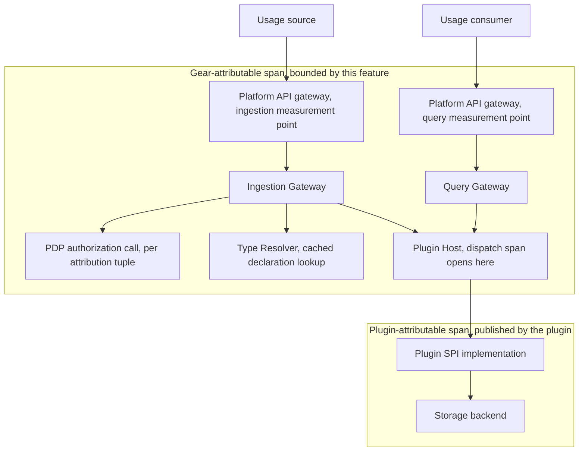

Created:  2026-09-25 by Virtuozzo International GmbH
Updated:  2026-09-25 by Virtuozzo International GmbH

# Feature: Throughput, Latency & Availability SLOs

- [ ] `p1` - **ID**: `cpt-cf-usage-collector-featstatus-throughput-latency-availability-implemented`

- [ ] `p1` - `cpt-cf-usage-collector-feature-throughput-latency-availability`

States the numeric performance envelope the Usage Collector is held to — one
shared load profile, an ingestion latency and throughput bound, an aggregation
query latency bound, a workload isolation bound, and a monthly ingestion
availability target — together with where each figure is measured, over what
window, and under what concurrent load it has to hold.

<!-- toc -->

- [1. Feature Context](#1-feature-context)
  - [1.1 Overview](#11-overview)
  - [1.2 Purpose](#12-purpose)
  - [1.3 Actors](#13-actors)
  - [1.4 References](#14-references)
- [2. Actor Flows (CDSL)](#2-actor-flows-cdsl)
- [3. Processes / Business Logic (CDSL)](#3-processes--business-logic-cdsl)
  - [Bind the Shared Load Envelope](#bind-the-shared-load-envelope)
  - [Place the Latency Measurement Point and Attribute the Spend](#place-the-latency-measurement-point-and-attribute-the-spend)
  - [Decide a Latency Bound from a Measurement Window](#decide-a-latency-bound-from-a-measurement-window)
  - [Evaluate the Isolation Bound Under Concurrent Query Load](#evaluate-the-isolation-bound-under-concurrent-query-load)
  - [Account for Monthly Ingestion Availability](#account-for-monthly-ingestion-availability)
- [4. States (CDSL)](#4-states-cdsl)
- [5. Definitions of Done](#5-definitions-of-done)
  - [One Shared Load Envelope for Every Numeric Bound](#one-shared-load-envelope-for-every-numeric-bound)
  - [Ingestion Latency Bounded at the Platform Gateway](#ingestion-latency-bounded-at-the-platform-gateway)
  - [Sustained Ingestion Throughput Floor](#sustained-ingestion-throughput-floor)
  - [Aggregation Query Latency Over a 30-Day Single-Tenant Range](#aggregation-query-latency-over-a-30-day-single-tenant-range)
  - [Query Load Does Not Degrade the Ingestion Path](#query-load-does-not-degrade-the-ingestion-path)
  - [Monthly Ingestion Availability and Its Error Budget](#monthly-ingestion-availability-and-its-error-budget)
  - [Where the Gear Stops and the Plugin Begins](#where-the-gear-stops-and-the-plugin-begins)
  - [Thresholds Come from the Product Requirements and Nowhere Else](#thresholds-come-from-the-product-requirements-and-nowhere-else)
- [6. Acceptance Criteria](#6-acceptance-criteria)

<!-- /toc -->

## 1. Feature Context

### 1.1 Overview

A quality-attribute contract rather than a code path. It owns the numbers and
the measurement rules; it owns none of the request handling those numbers
describe. The ingestion path belongs to
`cpt-cf-usage-collector-feature-usage-record-ingestion`, the read paths belong
to `cpt-cf-usage-collector-feature-usage-query`, and the persistence seam
belongs to `cpt-cf-usage-collector-feature-pluggable-storage`. This feature
says how fast those paths must be, how much they must carry, how often they
must answer at all, and how a reviewer decides whether they do.

Four bounds hold simultaneously, and they hold against one envelope rather
than four separate test conditions. That single envelope is the point: a
latency figure quoted at an unstated load is not a commitment, and four figures
quoted at four different loads cannot be checked in one run.

This feature exposes no endpoint, no plugin method, and no sequence of its
own. Each Definition of Done below therefore names the feature whose surface
carries the obligation, and states the assertion that proves it.

### 1.2 Purpose

The Usage Collector sits on the critical path of every billable operation on
the platform. Its highest-volume callers are the LLM Gateway and the API
Gateway, which emit continuously and cannot buffer indefinitely when the
collector slows down. Its readers are interactive: tenant dashboards and
billing-cycle reports that a person waits on. Those two populations pull in
opposite directions, because an analytical aggregation and a latency-sensitive
write compete for the same backend. Naming the envelope once, and naming what
each population is owed inside it, is what keeps the competition from being
settled by whichever workload happens to arrive first.

Three failure modes are being prevented.

The first is the unanchored number. "Ingestion completes in 200 ms" is not
testable until the sentence says at what arrival rate, with how many queries
running beside it, measured where, and over how long. Every bound below is
written with those four qualifiers attached.

The second is silent budget transfer. The gear and the bound storage plugin
share one end-to-end budget. Without a stated attribution boundary, a plugin
that spends 400 ms on an ingestion write and a gateway that spends 30 ms both
look compliant in isolation while the caller sees a breach. The boundary is
stated here, and the plugin's own share is published by the plugin rather than
assumed by the gear.

The third is threshold drift. A deployment under pressure has an obvious
escape: relax the number locally. `cpt-cf-usage-collector-constraint-nfr-thresholds`
exists to close that escape, and this feature honours it by treating PRD §6 as
the sole source of every figure it states.

**Requirements**: `cpt-cf-usage-collector-nfr-throughput-profile`,
`cpt-cf-usage-collector-nfr-throughput`,
`cpt-cf-usage-collector-nfr-ingestion-latency`,
`cpt-cf-usage-collector-nfr-query-latency`,
`cpt-cf-usage-collector-nfr-workload-isolation`,
`cpt-cf-usage-collector-nfr-availability`

**Constraints**: `cpt-cf-usage-collector-constraint-nfr-thresholds`

**Constraint ownership.** This feature owns
`cpt-cf-usage-collector-constraint-nfr-thresholds` outright. The constraint
states that four PRD §6 thresholds must be met at the same time, against the
throughput-profile envelope, and that meeting them constrains plugin selection,
workload isolation, and capacity planning at every deployment. No other feature
claims it: `cpt-cf-usage-collector-feature-pluggable-storage` owns the seam the
constraint bears on, not the figures it carries.

**Scope boundary.** Four divisions matter, and getting them wrong would
duplicate rules that already live elsewhere.

- **Latency is not freshness.** Latency is time to respond; freshness is how
  stale the answer is. A deployment can return an aggregate in 80 ms that
  reflects consumption from four minutes ago, and satisfy this feature while
  breaching nothing it owns. Staleness floors and per-plugin visibility
  ceilings belong to
  `cpt-cf-usage-collector-feature-consistency-freshness-contract`, which
  publishes them under `cpt-cf-usage-collector-nfr-query-freshness`. This
  feature makes no claim about how current a response is.
- **Workload isolation is stated twice, deliberately, at two altitudes.** This
  feature owns the service-level statement: aggregation query load must not push
  ingestion latency outside its bound. `cpt-cf-usage-collector-feature-backfill-retention`
  owns a different obligation under
  `cpt-cf-usage-collector-dod-backfill-workload-isolation` — that bulk import
  runs on a gear-side workload budget held apart from live ingestion, as
  `cpt-cf-usage-collector-adr-backfill-isolation` decided. That one is a route
  property and is not restated here.
- **Metric names and emission are not owned here.** Which instruments exist,
  what they are called, what labels they carry, and which alert fires at which
  threshold belong to `cpt-cf-usage-collector-feature-operational-visibility`
  under `cpt-cf-usage-collector-nfr-operational-visibility`. This feature
  defines what must be true; that one defines what is emitted. The two are
  matched on purpose: every bound below is observable through an instrument
  [DESIGN.md](../DESIGN.md) §3.11.5 already defines, so no bound here is
  unmeasurable in production.
- **The feed's replay objective is not here.** A consumer that has fallen a day
  behind reaching the head of the feed within a bounded recovery time is
  `cpt-cf-usage-collector-nfr-replay-throughput`, carried by
  `cpt-cf-usage-collector-feature-usage-feed`. It is a bulk-drain objective
  rather than a steady-state figure, and it is measured against a subscription
  rather than against the gear-wide envelope.

**What this feature does not extend.** It adds no threshold PRD §6 does not
state, no new endpoint, no new plugin method, and no per-deployment override.
Where an operator needs a figure the PRD does not carry — a per-region target,
a stricter internal goal — that figure is a deployment-local operating target
and is not part of this contract.

### 1.3 Actors

| Actor | Role in Feature |
|-------|-----------------|
| `cpt-cf-usage-collector-actor-usage-source` | Drives the sustained and burst arrival rate the envelope names; is the party that observes the ingestion latency bound, because the bound is measured where its submission enters the platform |
| `cpt-cf-usage-collector-actor-platform-developer` | Integrates a calling gear against the published ingestion bound, and sizes its own emission path against the acknowledgement latency this feature promises rather than against a locally measured best case |
| `cpt-cf-usage-collector-actor-usage-consumer` | Issues the concurrent aggregation queries the envelope counts, and observes the aggregation latency bound; is the workload the isolation bound protects the ingestion path from |
| `cpt-cf-usage-collector-actor-tenant-admin` | Reads dashboards served by the aggregation path, and is the interactive reader whose wait the 30-day single-tenant bound is written for |
| `cpt-cf-usage-collector-actor-platform-operator` | Sizes replica count and selects the storage plugin whose published performance makes the envelope reachable; owns the availability budget and the capacity plan derived from the daily volume figure |
| `cpt-cf-usage-collector-actor-storage-backend` | Carries the share of each latency budget the gear does not spend, and publishes its own measured persist and aggregate figures so that a deployment can be assessed before it is loaded |
| `cpt-cf-usage-collector-actor-types-registry` | Sits off the steady-state ingestion path by design: resolution is served from a cached declaration, so the registry contributes no round-trip to the ingestion budget except on a cold path |

### 1.4 References

- **PRD**: [PRD.md](../PRD.md) — §6.1, the six covered non-functional
  requirements: `cpt-cf-usage-collector-nfr-throughput-profile`,
  `cpt-cf-usage-collector-nfr-throughput`,
  `cpt-cf-usage-collector-nfr-ingestion-latency`,
  `cpt-cf-usage-collector-nfr-query-latency`,
  `cpt-cf-usage-collector-nfr-workload-isolation`, and
  `cpt-cf-usage-collector-nfr-availability`; §9, whose opening definitions of
  load envelope, steady-state measurement window, latency tolerance, and burst
  tolerance are the measurement rules this feature applies rather than restates
- **Design**: [DESIGN.md](../DESIGN.md) — §3.11 Performance and Operations
  Architecture, primarily §3.11.1 performance patterns, §3.11.2 latency budgets
  and the default SPI planning split, and §3.11.3 resource efficiency; §2.2
  Constraints, "NFR thresholds (from PRD §6)"
  (`cpt-cf-usage-collector-constraint-nfr-thresholds`); §3.2 Component Model
  for the four components the budgets are spent across; §3.8 Deployment
  Topology (`cpt-cf-usage-collector-topology-gear-runtime`) for the stateless
  replica model capacity rests on; §3.10 Consistency Contract
  (`cpt-cf-usage-collector-design-consistency-contract`) for the per-plugin
  publication obligation this feature reads its plugin-side figures from
- **ADR**:
  [Pluggable storage](../ADR/0002-cpt-cf-usage-collector-adr-pluggable-storage.md)
  (`cpt-cf-usage-collector-adr-pluggable-storage`) — the decision that puts the
  ledger behind a plugin seam, and therefore the decision that makes an
  attribution boundary necessary at all;
  [Consistency contract](../ADR/0006-cpt-cf-usage-collector-adr-consistency-contract.md)
  (`cpt-cf-usage-collector-adr-consistency-contract`) — records that workload
  isolation routes ingestion and query apart, which is the architectural cause
  of the queryability lag this feature is careful not to confuse with latency;
  [Backfill isolation](../ADR/0012-cpt-cf-usage-collector-adr-backfill-isolation.md)
  (`cpt-cf-usage-collector-adr-backfill-isolation`) — the separate, route-level
  isolation obligation this feature cites rather than duplicates
- **Decomposition**: [DECOMPOSITION.md](../DECOMPOSITION.md) §2.12
- **Components**: none of its own. The budgets are spent across
  `cpt-cf-usage-collector-component-ingestion-gateway`,
  `cpt-cf-usage-collector-component-query-gateway`,
  `cpt-cf-usage-collector-component-type-resolver`, and
  `cpt-cf-usage-collector-component-plugin-host`, each of which another feature
  owns
- **Entities**: none. This feature binds measured behaviour and introduces no
  persisted shape
- **Data**: none. The gear owns one durable table, the declaration mirror, and
  this feature neither reads nor writes it
- **Sequences**: none of its own. [DESIGN.md](../DESIGN.md) §3.6 defines six
  sequences, and the bounds below are asserted across all of them rather than
  owning any one
- **Dependencies**: `cpt-cf-usage-collector-feature-usage-record-ingestion` and
  `cpt-cf-usage-collector-feature-usage-query`, whose paths the envelope is
  measured directly against, and
  `cpt-cf-usage-collector-feature-pluggable-storage`, because the bound
  plugin's own performance is what the envelope ultimately bounds. Nothing in
  the decomposition depends on this feature, so it can be delivered last

## 2. Actor Flows (CDSL)

**Not applicable.** No actor can initiate this feature, because it accepts no
request. Every interaction in which its bounds are measured — a submission, an
aggregation query, a raw page, a feed read — is an end-to-end flow another
feature already owns and specifies, such as
`cpt-cf-usage-collector-flow-emit-usage-record` or
`cpt-cf-usage-collector-flow-query-aggregated-usage`. A flow here would restate
those steps and add no decision point of its own, because this feature changes
no step in any of them; it only states how long each is allowed to take and how
many may run at once.

The one activity that looks like a flow is running the conformance load test,
and that is an engineering procedure rather than a use case an actor exercises
against a running deployment. It is specified in [§3](#3-processes--business-logic-cdsl)
as a process, where its inputs and its pass criteria can be stated precisely.

## 3. Processes / Business Logic (CDSL)

Five routines. The first fixes the load condition every other one runs under.
The second decides where a measurement is taken and how much of it is the
gear's. The third turns a sample of latency observations into a pass or fail
verdict. The fourth and fifth do the same for the isolation bound and for
availability, which are evaluated differently because one is conditional on
concurrent load and the other accrues over a calendar month.

None of these routines runs on the request path. They describe how a load test,
a release-readiness review, and a production alert reach the same verdict from
the same definitions.

### Bind the Shared Load Envelope

- [ ] `p1` - **ID**: `cpt-cf-usage-collector-algo-slo-envelope-binding`

**Input**: a deployment under assessment, and the envelope
`cpt-cf-usage-collector-nfr-throughput-profile` publishes

**Output**: a fully specified load condition, held constant for the duration of
one measurement window, under which every other bound in this feature is
evaluated

**Steps**:
1. [ ] - `p1` - Drive sustained ingestion at 10,000 or more usage records per second, which is the profile's sustained term and the same figure `cpt-cf-usage-collector-nfr-throughput` is evaluated against - `inst-slo-envelope-sustained`
2. [ ] - `p1` - Run 100 or more aggregation queries concurrently against the same deployment for the whole window, so that ingestion is never measured on an idle backend - `inst-slo-envelope-concurrency`
3. [ ] - `p1` - Size the run so the offered load corresponds to 700,000,000 or more accepted ingestion calls across a 24-hour day at the sustained rate, which is the daily volume figure capacity planning uses - `inst-slo-envelope-daily-volume`
4. [ ] - `p1` - Hold no burst in progress unless the bound being evaluated names the burst case explicitly, because the profile separates steady state from burst and mixing them makes a p95 unattributable - `inst-slo-envelope-no-burst`
5. [ ] - `p1` - **IF** the bound under evaluation names the burst case - `inst-slo-envelope-burst-branch`
   1. [ ] - `p1` - Raise the arrival rate to 30,000 or more usage records per second for no more than five minutes, and admit at most one such burst in the trailing 60-minute window - `inst-slo-envelope-burst-apply`
6. [ ] - `p1` - Sustain the condition for a contiguous window of 30 minutes or more before any figure is computed, so that a cold cache, a cold connection pool, or a warming backend is outside the sample - `inst-slo-envelope-window`
7. [ ] - `p1` - Record the active storage plugin, its vendor selection, and the replica count alongside the run, because capacity is plugin-bound and a figure carries no meaning without the binding it was measured against - `inst-slo-envelope-record-binding`
8. [ ] - `p1` - Treat the monthly billing-cycle close as the highest concurrent-query period the profile anticipates, and plan capacity so the concurrency term is met at that point in the cycle rather than at its quietest - `inst-slo-envelope-seasonal`
9. [ ] - `p1` - **RETURN** the bound load condition together with the deployment facts recorded against it - `inst-slo-envelope-return`

One envelope, not four. Step 2 is the step most often dropped, and dropping it
is what turns a defensible ingestion figure into an unattainable one: the
ingestion bound is a bound under concurrent query load, and measuring it
without that load measures something else.

### Place the Latency Measurement Point and Attribute the Spend

- [ ] `p1` - **ID**: `cpt-cf-usage-collector-algo-slo-latency-attribution`

**Input**: one completed ingestion submission or one completed aggregation
query, and the component path it traversed

**Output**: an elapsed time attributed to the gear-plus-plugin whole, together
with the plugin-internal share, so a breach can be localised rather than merely
observed

**Steps**:
1. [ ] - `p1` - Take the ingestion measurement at the platform API gateway, where the submission enters the platform, so the figure matches what the calling usage source actually waits for - `inst-slo-latency-ingest-point`
2. [ ] - `p1` - Take the aggregation measurement at the same outer boundary, covering authorization, field validation, dispatch, and response assembly, rather than at the plugin call alone - `inst-slo-latency-query-point`
3. [ ] - `p1` - Count the whole elapsed interval against the bound, gear time and plugin time together, because a caller cannot observe the split and the bound is a promise to the caller - `inst-slo-latency-end-to-end`
4. [ ] - `p1` - Attribute separately the interval the Plugin Host's dispatch span covers, which is where the gear stops and the bound plugin begins - `inst-slo-latency-plugin-span`
5. [ ] - `p1` - Do not measure inside the plugin: how it batches, how it indexes, and how it replicates are its own concerns, and the gear observes only the duration of the call it made - `inst-slo-latency-no-internals`
6. [ ] - `p1` - Read the plugin's own measured persist and aggregate figures from what its deployment guide publishes under the consistency contract, rather than deriving them from the gear's observation - `inst-slo-latency-published-figures`
7. [ ] - `p1` - Treat the planning split of 75 milliseconds for ingestion and 425 milliseconds for aggregation as guidance for sizing a plugin, not as a conformance bound; only the totals of 200 and 500 milliseconds are conformance bounds - `inst-slo-latency-planning-split`
8. [ ] - `p1` - Expect a plugin to leave at least 25 milliseconds of the envelope for gateway, authorization, and core overhead on paths where no sub-allocation is carved, namely batched ingestion, raw paging, and feed reads - `inst-slo-latency-overhead-reserve`
9. [ ] - `p1` - Exclude a cache miss on declaration resolution from the steady-state budget, because it is a cold-path cost the profile's warm-up window already places outside the sample - `inst-slo-latency-cold-path`
10. [ ] - `p1` - **RETURN** the end-to-end interval and the plugin-attributed interval as two figures reported together - `inst-slo-latency-return`

Step 3 and step 4 are not in tension. The bound is end to end because that is
what a caller experiences; the split is recorded because a breach that is
entirely inside the dispatch span is a plugin selection problem, and one that
is not is a gear problem. Reporting one figure without the other leaves a
breach undiagnosable.

### Decide a Latency Bound from a Measurement Window

- [ ] `p1` - **ID**: `cpt-cf-usage-collector-algo-slo-latency-conformance`

**Input**: the latency observations collected across one steady-state window
under `cpt-cf-usage-collector-algo-slo-envelope-binding`, and the stated bound
for the path under test

**Output**: a pass or fail verdict for that bound, with the trailing-trend
figure that justifies it

**Steps**:
1. [ ] - `p1` - Compute the 95th-percentile elapsed time over the whole contiguous window, using the measurement points `cpt-cf-usage-collector-algo-slo-latency-attribution` fixes - `inst-slo-conformance-p95`
2. [ ] - `p1` - Compare it against 200 milliseconds for ingestion and against 500 milliseconds for an aggregation over a 30-day range for a single tenant - `inst-slo-conformance-compare`
3. [ ] - `p1` - **IF** the window figure is at or below its bound - `inst-slo-conformance-pass-branch`
   1. [ ] - `p1` - Record a pass for that window - `inst-slo-conformance-pass`
4. [ ] - `p1` - **ELSE IF** the window figure exceeds the bound by no more than a tenth, meaning at most 220 milliseconds for ingestion or at most 550 milliseconds for aggregation - `inst-slo-conformance-tolerance-branch`
   1. [ ] - `p1` - Accept the window only where the trailing 30-minute trend stays at or below the stated bound, and report both figures side by side - `inst-slo-conformance-tolerance-accept`
   2. [ ] - `p1` - Record a fail where the trailing trend has also moved above the bound, because a tolerance covers measurement noise rather than a sustained regression - `inst-slo-conformance-tolerance-reject`
5. [ ] - `p1` - **ELSE** - `inst-slo-conformance-fail-branch`
   1. [ ] - `p1` - Record a fail, and localise it using the plugin-attributed interval reported alongside the end-to-end one - `inst-slo-conformance-fail`
6. [ ] - `p1` - Evaluate the aggregation bound only against the shape it is written for, a 30-day range for a single tenant, and treat a wider range or a cross-tenant read as outside the stated bound rather than as a breach of it - `inst-slo-conformance-query-shape`
7. [ ] - `p1` - Apply the same bound to a burst window, holding the ingestion figure at 200 milliseconds with the same tolerance for the burst's duration - `inst-slo-conformance-burst`
8. [ ] - `p1` - Report the sustained throughput sample-mean for the same window, so a latency pass achieved by shedding load is visible rather than hidden - `inst-slo-conformance-throughput-guard`
9. [ ] - `p1` - **RETURN** the verdict, the window figure, and the trailing-trend figure - `inst-slo-conformance-return`

Step 8 closes the obvious way to pass this test dishonestly. Latency and
throughput are reported from the same window, because a system that rejects
half its offered load will show an excellent p95.

### Evaluate the Isolation Bound Under Concurrent Query Load

- [ ] `p1` - **ID**: `cpt-cf-usage-collector-algo-slo-workload-isolation`

**Input**: ingestion latency observations and the count of aggregation queries
in flight, taken over the same interval

**Output**: a verdict on whether analytical read load has degraded the
latency-sensitive write path

**Steps**:
1. [ ] - `p1` - Hold the ingestion arrival rate at the envelope's sustained term while raising concurrent aggregation queries to 100 or more - `inst-slo-isolation-load`
2. [ ] - `p1` - Observe the ingestion 95th-percentile figure continuously across that interval rather than only at its end - `inst-slo-isolation-observe`
3. [ ] - `p1` - **IF** ingestion stays at or below 200 milliseconds, with the same tolerance the latency conformance routine applies, for the whole interval - `inst-slo-isolation-pass-branch`
   1. [ ] - `p1` - Record the isolation bound as met - `inst-slo-isolation-pass`
4. [ ] - `p1` - **ELSE** - `inst-slo-isolation-fail-branch`
   1. [ ] - `p1` - Record a breach where ingestion stays above the bound for five minutes or more while 100 or more aggregation queries are in flight, which is the condition that distinguishes contention from an unrelated slowdown - `inst-slo-isolation-fail`
5. [ ] - `p1` - Attribute a breach to backend resource competition rather than to gear-side queueing, unless the gear-attributed interval has risen too, since the gear holds no entry state and its own cost does not scale with read volume - `inst-slo-isolation-attribute`
6. [ ] - `p1` - Treat isolated backend connection pools as the active plugin's deployment obligation, established by its deployment profile rather than by gear configuration - `inst-slo-isolation-plugin-pools`
7. [ ] - `p1` - Leave the separate gear-side budget that keeps bulk import away from live ingestion to `cpt-cf-usage-collector-algo-backfill-workload-isolation`, and do not re-derive it here - `inst-slo-isolation-backfill-boundary`
8. [ ] - `p1` - Draw no conclusion about how current an aggregation result is: routing the two workloads apart creates queryability lag, and that lag is the consistency and freshness contract's subject, not this one's - `inst-slo-isolation-not-freshness`
9. [ ] - `p1` - **RETURN** the verdict together with the peak concurrent query count observed while it held - `inst-slo-isolation-return`

### Account for Monthly Ingestion Availability

- [ ] `p1` - **ID**: `cpt-cf-usage-collector-algo-slo-availability-accounting`

**Input**: the outcomes of ingestion requests over one calendar month, and the
structural readiness of the bound plugin over the same period

**Output**: the achieved availability figure for the month and the share of the
error budget consumed

**Steps**:
1. [ ] - `p1` - Scope the target to the usage ingestion endpoints, since that is the surface a billable operation blocks on and the surface the requirement names - `inst-slo-avail-scope`
2. [ ] - `p1` - Count an interval as unavailable when a well-formed, authorized submission cannot be accepted for a reason the deployment owns - `inst-slo-avail-unavailable`
3. [ ] - `p1` - Count a rejection the caller caused as available service: a validation failure, an authorization denial, an idempotency conflict, and a quota rejection are all correct answers delivered on time - `inst-slo-avail-caller-errors`
4. [ ] - `p1` - Count a fail-closed refusal on dependency loss as unavailable, because refusing is the right behaviour and still denies the caller the service the target promises - `inst-slo-avail-fail-closed`
5. [ ] - `p1` - Treat the plugin readiness signal as a first-class input, since a deployment whose binding does not resolve cannot accept anything, however healthy its replicas look - `inst-slo-avail-plugin-ready`
6. [ ] - `p1` - Compare the month's achieved figure against 99.95 percent, which leaves an error budget of roughly 22 minutes across a 30-day month - `inst-slo-avail-target`
7. [ ] - `p1` - Track budget consumption continuously rather than only at month end, and treat a quarter of the monthly budget burned inside any 24-hour window as the point at which the month is at risk - `inst-slo-avail-burn`
8. [ ] - `p1` - Exclude no planned maintenance from the accounting, because the deployment model is stateless replicas behind the platform gateway and a rolling replacement is expected to cost no accepted submission - `inst-slo-avail-no-maintenance-exclusion`
9. [ ] - `p1` - Reset the accounting at each calendar-month boundary, and carry no unused budget forward - `inst-slo-avail-reset`
10. [ ] - `p1` - **RETURN** the achieved figure and the consumed share of the budget - `inst-slo-avail-return`

Steps 3 and 4 are the two that decide whether this figure means anything. A
deployment that counted every rejection as downtime would chase a number it
does not control, and one that counted a fail-closed refusal as uptime would
report a healthy month while accepting nothing.

## 4. States (CDSL)

**Not applicable.** This feature binds no entity and introduces none, so there
is no lifecycle to attach transitions to. The one candidate is the monthly
availability budget, and it is an accumulator rather than a state machine: it
consumes continuously against a fixed monthly allowance, has no discrete states
a transition could be guarded on, and resets on a calendar boundary rather than
on any observable event. Modelling it as a machine would invent states that
nothing in the system stores, reads, or acts on. The alerting thresholds that
do partition it into actionable bands are defined by
`cpt-cf-usage-collector-feature-operational-visibility`, which owns the alert
surface.

## 5. Definitions of Done

This feature has no surface of its own, so each entry below names the feature
whose surface carries the obligation, and states the assertion that proves it —
including where the measurement is taken and under what load it holds.

### One Shared Load Envelope for Every Numeric Bound

- [ ] `p1` - **ID**: `cpt-cf-usage-collector-dod-slo-shared-envelope`

The system **MUST** be assessed against a single published load envelope:
sustained ingestion of 10,000 or more usage records per second, a peak burst of
30,000 or more usage records per second for no longer than five minutes in any
60-minute window, 100 or more concurrent aggregation queries, and 700,000,000
or more accepted ingestion calls in a 24-hour day. Every latency, throughput,
isolation, and availability figure in this feature **MUST** be evaluated under
that one envelope, over a contiguous steady-state window of 30 minutes or more,
rather than under a condition chosen per bound. The conformance run **MUST**
record the active plugin binding and the replica count alongside the result,
because capacity is plugin-bound. Capacity planning **MUST** treat the monthly
billing-cycle close as the peak concurrent-query period.

**Carried by**: `cpt-cf-usage-collector-feature-usage-record-ingestion` supplies
the write load, `cpt-cf-usage-collector-feature-usage-query` supplies the
concurrent read load, and `cpt-cf-usage-collector-feature-pluggable-storage`
supplies the binding under test through
`cpt-cf-usage-collector-dod-plugin-vendor-configuration`.

**Assertion**: an envelope load test drives all four terms simultaneously for
30 minutes or more against a named plugin binding, and the run report states
every one of the four terms achieved, the binding, and the replica count. A run
missing any term is not a conformance run.

**Implements**:
- `cpt-cf-usage-collector-algo-slo-envelope-binding`

**Constraints**: `cpt-cf-usage-collector-constraint-nfr-thresholds`

**Touches**:
- API: `POST /usage-collector/v1/records`,
  `POST /usage-collector/v1/records/aggregate`
- Component: `cpt-cf-usage-collector-component-ingestion-gateway`,
  `cpt-cf-usage-collector-component-query-gateway`

### Ingestion Latency Bounded at the Platform Gateway

- [ ] `p1` - **ID**: `cpt-cf-usage-collector-dod-slo-ingestion-latency-bound`

The system **MUST** complete usage record ingestion within 200 milliseconds at
the 95th percentile, measured at the platform API gateway over a steady-state
window of 30 minutes or more inside the shared envelope. A single window
**MAY** read as high as 220 milliseconds, the stated tolerance of one tenth,
only while the trailing 30-minute trend stays at or below 200 milliseconds. The
same bound and the same tolerance **MUST** hold for the duration of a burst of
30,000 or more usage records per second lasting no more than five minutes, with
at most one such burst in the trailing 60-minute window. Steady-state ingestion
**MUST NOT** include a declaration resolution round-trip, because resolution is
served from the cached declaration.

**Carried by**: `cpt-cf-usage-collector-feature-usage-record-ingestion`, whose
`cpt-cf-usage-collector-dod-ingestion-choke-point` puts every write through one
component, and whose `cpt-cf-usage-collector-dod-ingestion-telemetry` emits the
per-origin duration observations the figure is computed from. The cached-lookup
premise is carried by `cpt-cf-usage-collector-dod-declaration-cache`.

**Assertion**: under the shared envelope with 100 or more aggregation queries in
flight, the 95th-percentile submission time observed at the platform gateway
across a 30-minute window is at or below 200 milliseconds, or at or below 220
milliseconds with the trailing 30-minute trend at or below 200 milliseconds. A
second assertion repeats the measurement across a five-minute burst at 30,000 or
more records per second and requires the same result. A third asserts that the
declaration-resolution cache-hit share over the window shows the steady state
was served from cache.

**Implements**:
- `cpt-cf-usage-collector-algo-slo-latency-conformance`
- `cpt-cf-usage-collector-algo-slo-latency-attribution`

**Constraints**: `cpt-cf-usage-collector-constraint-nfr-thresholds`

**Touches**:
- API: `POST /usage-collector/v1/records`
- Component: `cpt-cf-usage-collector-component-ingestion-gateway`,
  `cpt-cf-usage-collector-component-type-resolver`

### Sustained Ingestion Throughput Floor

- [ ] `p1` - **ID**: `cpt-cf-usage-collector-dod-slo-ingestion-throughput-floor`

The system **MUST** sustain ingestion of 10,000 or more usage records per
second as a sample-mean across a steady-state window of 30 minutes or more
inside the shared envelope, and every one-minute sample-mean inside that window
**MUST** stay at or above 9,500 records per second, which is nineteen twentieths
of the sustained rate. Sample-mean and 95th-percentile figures **MUST** be
reported separately. The throughput figure **MUST** be counted in accepted
entries rather than in requests, because a submission carries a batch and a
request count would overstate or understate the rate depending on batch size.
Bulk writing **MUST** be available to the plugin as a first-class capability so
each backend drives its native path, and the size of a backend write **MUST**
remain the plugin's choice rather than being pinned to the per-request cap.

**Carried by**: `cpt-cf-usage-collector-feature-usage-record-ingestion`, whose
`cpt-cf-usage-collector-dod-batch-outcome-model` defines the per-entry outcome
the count is taken from, and
`cpt-cf-usage-collector-feature-pluggable-storage`, whose
`cpt-cf-usage-collector-dod-plugin-spi-sole-seam` makes the bulk write path the
only route to the backend.

**Assertion**: across a 30-minute window under the shared envelope, accepted
entries per second average 10,000 or more, and no one-minute bucket inside the
window falls below 9,500. The same run reports the ingestion 95th-percentile
figure, so a throughput pass obtained by degrading latency is visible in the
same report.

**Implements**:
- `cpt-cf-usage-collector-algo-slo-envelope-binding`
- `cpt-cf-usage-collector-algo-slo-latency-conformance`

**Constraints**: `cpt-cf-usage-collector-constraint-nfr-thresholds`

**Touches**:
- API: `POST /usage-collector/v1/records`
- Component: `cpt-cf-usage-collector-component-ingestion-gateway`,
  `cpt-cf-usage-collector-component-plugin-host`

### Aggregation Query Latency Over a 30-Day Single-Tenant Range

- [ ] `p1` - **ID**: `cpt-cf-usage-collector-dod-slo-aggregation-latency-bound`

The system **MUST** complete an aggregation query covering a 30-day range for a
single tenant within 500 milliseconds at the 95th percentile, measured over a
steady-state window of 30 minutes or more inside the shared envelope. A single
window **MAY** read as high as 550 milliseconds, the stated tolerance of one
tenth, only while the trailing 30-minute trend stays at or below 500
milliseconds. The bound **MUST** be evaluated against that query shape alone; a
wider range or a cross-tenant read is outside the stated bound rather than a
breach of it. The fold and every grouping dimension **MUST** execute inside the
plugin's own acceleration structures, and the gear **MUST NOT** iterate result
rows, because row iteration in the gear would make the bound unreachable at the
result sizes the envelope implies.

**Carried by**: `cpt-cf-usage-collector-feature-usage-query`, whose
`cpt-cf-usage-collector-dod-mandatory-type-and-range` forces a single meter and
a bounded range onto every request, and whose
`cpt-cf-usage-collector-dod-aggregate-withdrawn-pair-exclusion` keeps the
withdrawn-pair exclusion inside the plugin rather than folding it in the gear.

**Assertion**: with 100 or more aggregation queries in flight and ingestion
sustained at the envelope rate, the 95th-percentile completion time for a
30-day single-tenant aggregation across a 30-minute window is at or below 500
milliseconds, or at or below 550 milliseconds with the trailing 30-minute trend
at or below 500 milliseconds. A companion assertion inspects the dispatched
request and confirms the fold and the grouping were pushed down, with no
row-level iteration in the gear.

**Implements**:
- `cpt-cf-usage-collector-algo-slo-latency-conformance`
- `cpt-cf-usage-collector-algo-slo-latency-attribution`

**Constraints**: `cpt-cf-usage-collector-constraint-nfr-thresholds`

**Touches**:
- API: `POST /usage-collector/v1/records/aggregate`
- Component: `cpt-cf-usage-collector-component-query-gateway`,
  `cpt-cf-usage-collector-component-plugin-host`

### Query Load Does Not Degrade the Ingestion Path

- [ ] `p1` - **ID**: `cpt-cf-usage-collector-dod-slo-workload-isolation`

The system **MUST** keep ingestion inside its 95th-percentile bound while
aggregation query workloads run concurrently at the envelope's concurrency
term. Ingestion and query **MUST** be routed to isolated backend resources so
that analytical reads and latency-sensitive writes do not compete, and
establishing that isolation — separate connection pools, separate replicas, or
whatever the backend offers — **MUST** be an obligation of the active plugin's
deployment profile rather than of gear configuration. A deployment whose plugin
cannot establish the separation **MUST** be treated as unable to meet this
bound rather than as meeting it by reducing query concurrency. The distinct,
gear-side budget that keeps bulk import away from live ingestion is defined by
`cpt-cf-usage-collector-dod-backfill-workload-isolation` and is not restated
here.

**Carried by**: `cpt-cf-usage-collector-feature-usage-query`, which generates
the competing load, and
`cpt-cf-usage-collector-feature-usage-record-ingestion`, whose latency is the
protected quantity. `cpt-cf-usage-collector-feature-pluggable-storage` carries
the deployment obligation, and its
`cpt-cf-usage-collector-dod-plugin-conformance-suite` is where a candidate
plugin demonstrates it.

**Assertion**: a concurrent load test holds ingestion at the envelope's
sustained rate while 100 or more aggregation queries execute, and ingestion's
95th-percentile figure stays at or below 200 milliseconds, with the stated
tolerance, for the whole interval. A breach is recorded when ingestion stays
above the bound for five minutes or more while 100 or more aggregation queries
are in flight. A second assertion reads the plugin's deployment guide and
confirms the resource separation is documented rather than assumed.

**Implements**:
- `cpt-cf-usage-collector-algo-slo-workload-isolation`

**Constraints**: `cpt-cf-usage-collector-constraint-nfr-thresholds`

**Touches**:
- API: `POST /usage-collector/v1/records`,
  `POST /usage-collector/v1/records/aggregate`
- Component: `cpt-cf-usage-collector-component-ingestion-gateway`,
  `cpt-cf-usage-collector-component-query-gateway`,
  `cpt-cf-usage-collector-component-plugin-host`

### Monthly Ingestion Availability and Its Error Budget

- [ ] `p1` - **ID**: `cpt-cf-usage-collector-dod-slo-ingestion-availability`

The system **MUST** maintain 99.95 percent availability of the usage ingestion
endpoints across each calendar month. A rejection the caller caused — failed
validation, an authorization denial, an idempotency conflict, a quota rejection
— **MUST** count as available service, because each is a correct answer
delivered on time. A fail-closed refusal caused by the loss of the policy
decision point, the type registry, or the storage plugin **MUST** count against
the budget, because the caller is denied the service regardless of the refusal
being correct. Availability **MUST** rest on stateless, horizontally scalable
replicas so that a rolling replacement costs no accepted submission, and no
planned-maintenance exclusion **MUST** be applied. Budget consumption **MUST**
be tracked continuously, and a quarter of the monthly budget consumed inside
any 24-hour window **MUST** be treated as the month being at risk. The budget
**MUST** reset on the calendar-month boundary with no carry-forward.

**Carried by**: `cpt-cf-usage-collector-feature-usage-record-ingestion` for the
endpoints themselves,
`cpt-cf-usage-collector-feature-pluggable-storage` for the readiness signal and
the fail-closed posture its
`cpt-cf-usage-collector-dod-plugin-fail-closed` establishes, and
`cpt-cf-usage-collector-feature-operational-visibility` for the alert that
surfaces the burn rate.

**Assertion**: over one calendar month, accepted-plus-caller-rejected ingestion
requests divided by total ingestion requests is 99.95 percent or higher, with
dependency-loss refusals counted in the denominator and excluded from the
numerator. A fault-injection test removes the plugin binding, confirms that the
resulting refusals are accounted as unavailable rather than as caller errors,
and confirms that a rolling replica replacement under envelope load produces no
such refusal.

**Implements**:
- `cpt-cf-usage-collector-algo-slo-availability-accounting`

**Constraints**: `cpt-cf-usage-collector-constraint-nfr-thresholds`

**Touches**:
- API: `POST /usage-collector/v1/records`,
  `POST /usage-collector/v1/records/backfill`
- Component: `cpt-cf-usage-collector-component-ingestion-gateway`,
  `cpt-cf-usage-collector-component-plugin-host`

### Where the Gear Stops and the Plugin Begins

- [ ] `p1` - **ID**: `cpt-cf-usage-collector-dod-slo-latency-attribution-boundary`

The system **MUST** hold the end-to-end interval against every latency bound,
gear time and plugin time together, because a caller cannot observe the split.
It **MUST** additionally attribute the interval covered by the Plugin Host's
dispatch span, so a breach can be localised to the gear or to the bound plugin.
The gear **MUST NOT** measure inside the plugin: how the plugin batches,
indexes, or replicates is its own concern, and the gear observes only the
duration of the call it issued. A plugin **MUST** publish its own measured
persist and aggregate figures in its deployment guide, and a deployment
**MUST** be assessed against those published figures rather than against
gear-side inference. The default planning split of 75 milliseconds for
ingestion and 425 milliseconds for aggregation **MUST NOT** be treated as a
conformance bound; only the totals are. On paths with no carved sub-allocation
— batched ingestion, raw paging, and feed reads — a plugin **SHOULD** reserve
25 milliseconds or more of the envelope for gateway, authorization, and core
overhead.

**Carried by**: `cpt-cf-usage-collector-feature-pluggable-storage`, whose
`cpt-cf-usage-collector-algo-plugin-dispatch` opens the span the boundary is
drawn at and whose
`cpt-cf-usage-collector-dod-plugin-conformance-suite` is where a candidate
demonstrates its share, together with
`cpt-cf-usage-collector-feature-usage-record-ingestion` and
`cpt-cf-usage-collector-feature-usage-query` on whose paths the end-to-end
figure is taken.

**Assertion**: for the same request population, the end-to-end figure and the
dispatch-span figure are both reported, and their difference is the
gear-attributed cost. An induced plugin slowdown moves the dispatch-span figure
and leaves the difference stable, which demonstrates the boundary is drawn
where the specification says. A review of the active plugin's deployment guide
finds its measured persist and aggregate figures published.

**Implements**:
- `cpt-cf-usage-collector-algo-slo-latency-attribution`

**Constraints**: `cpt-cf-usage-collector-constraint-nfr-thresholds`

**Touches**:
- API: `POST /usage-collector/v1/records`,
  `POST /usage-collector/v1/records/aggregate`,
  `GET /usage-collector/v1/records`, `GET /usage-collector/v1/records/{id}`
- Component: `cpt-cf-usage-collector-component-plugin-host`

### Thresholds Come from the Product Requirements and Nowhere Else

- [ ] `p1` - **ID**: `cpt-cf-usage-collector-dod-slo-threshold-provenance`

Every numeric threshold this feature states **MUST** be the figure PRD §6
publishes, and the four bounds — ingestion latency, aggregation latency,
isolation, and availability — **MUST** hold simultaneously against the shared
envelope rather than one at a time. A deployment **MUST NOT** weaken a
threshold locally, and gear configuration **MUST NOT** expose a knob that does
so; the configurable values a deployment carries are operational parameters
such as cache lifetime, batch cap, and quota, none of which restates a bound.
Changing a threshold **MUST** be a change to the PRD, propagated to this
document and to the deployment's capacity plan, rather than a local decision. A
stricter internal operating target an operator adopts **MUST** be recorded as
deployment-local and **MUST NOT** be presented as this contract.

**Carried by**: this feature states the rule, and it binds every deployment
through `cpt-cf-usage-collector-feature-pluggable-storage` at plugin selection,
through `cpt-cf-usage-collector-topology-deployment-config` at configuration,
and through `cpt-cf-usage-collector-feature-operational-visibility` where the
alert thresholds derived from these bounds are defined.

**Assertion**: each numeric figure in this document resolves to a PRD §6
statement, verified by a review that walks the two documents side by side. A
scan of the gear's typed configuration finds no key that sets or relaxes a
latency, throughput, concurrency, or availability bound. A single conformance
run produces verdicts for all four bounds from one envelope, rather than four
runs under four conditions.

**Implements**:
- `cpt-cf-usage-collector-algo-slo-envelope-binding`
- `cpt-cf-usage-collector-algo-slo-latency-conformance`

**Constraints**: `cpt-cf-usage-collector-constraint-nfr-thresholds`

**Touches**:
- Component: `cpt-cf-usage-collector-component-ingestion-gateway`,
  `cpt-cf-usage-collector-component-query-gateway`

## 6. Acceptance Criteria

- [ ] A conformance run drives sustained ingestion at 10,000 or more usage
  records per second, 100 or more concurrent aggregation queries, and an
  offered load equivalent to 700,000,000 or more accepted calls per 24-hour
  day, holds that condition for 30 contiguous minutes or more, and reports the
  active plugin binding and replica count with the result
  (`cpt-cf-usage-collector-nfr-throughput-profile`)
- [ ] Ingestion 95th-percentile latency measured at the platform API gateway
  across that window is at or below 200 milliseconds, or at or below 220
  milliseconds only while the trailing 30-minute trend is at or below 200
  milliseconds (`cpt-cf-usage-collector-nfr-ingestion-latency`)
- [ ] The same ingestion bound and tolerance hold across a burst of 30,000 or
  more usage records per second lasting no more than five minutes, with at most
  one burst in the trailing 60-minute window
  (`cpt-cf-usage-collector-nfr-throughput-profile`)
- [ ] Accepted entries per second average 10,000 or more across the 30-minute
  window, and no one-minute bucket inside it falls below 9,500, with sample-mean
  and 95th-percentile figures reported separately
  (`cpt-cf-usage-collector-nfr-throughput`)
- [ ] The throughput and latency figures for a run come from the same window, so
  a latency pass obtained by shedding offered load is visible in the report
- [ ] An aggregation query covering a 30-day range for a single tenant completes
  within 500 milliseconds at the 95th percentile under the same envelope, or
  within 550 milliseconds only while the trailing 30-minute trend is at or below
  500 milliseconds (`cpt-cf-usage-collector-nfr-query-latency`)
- [ ] A dispatched aggregation carries the fold and every grouping dimension to
  the plugin, and no gear-side row iteration is present on the path, verified by
  inspecting the dispatched request and the gear's result handling
- [ ] Ingestion 95th-percentile latency stays at or below 200 milliseconds, with
  the stated tolerance, for the whole interval during which 100 or more
  aggregation queries execute concurrently at the envelope's sustained ingestion
  rate (`cpt-cf-usage-collector-nfr-workload-isolation`)
- [ ] A breach of the isolation bound is recorded only when ingestion stays above
  the bound for five minutes or more while 100 or more aggregation queries are in
  flight, which separates contention from an unrelated slowdown
- [ ] The active plugin's deployment guide documents the backend resource
  separation between the ingestion and query workloads, rather than the
  separation being assumed from gear configuration
- [ ] Monthly ingestion availability is 99.95 percent or higher, computed with
  caller-caused rejections counted as available service and dependency-loss
  fail-closed refusals counted against the budget
  (`cpt-cf-usage-collector-nfr-availability`)
- [ ] A fault-injection test that removes the storage plugin binding produces
  refusals accounted as unavailable rather than as caller errors, and a rolling
  replica replacement under envelope load produces no such refusal
- [ ] Each latency observation is reported as two figures, the end-to-end
  interval and the interval inside the plugin dispatch span, and an induced
  plugin slowdown moves the second while the difference between them stays
  stable
- [ ] The gear issues no measurement of plugin internals, and the active
  plugin's deployment guide publishes its own measured persist and aggregate
  95th-percentile figures
- [ ] A cache miss on declaration resolution is excluded from the steady-state
  ingestion budget, and the resolution cache-hit share over a conformance window
  confirms the steady state was served from cache
- [ ] Every numeric figure in this document resolves to a PRD §6 statement,
  verified by a side-by-side review, and no gear configuration key sets or
  relaxes a latency, throughput, concurrency, or availability bound
  (`cpt-cf-usage-collector-constraint-nfr-thresholds`)
- [ ] One conformance run yields verdicts for ingestion latency, aggregation
  latency, workload isolation, and availability accounting together, rather than
  four runs under four load conditions
  (`cpt-cf-usage-collector-constraint-nfr-thresholds`)
- [ ] No criterion in this feature asserts anything about how current a returned
  aggregate is, which stays the subject of
  `cpt-cf-usage-collector-nfr-query-freshness` and the consistency and freshness
  contract
- [ ] No criterion in this feature names an instrument, a label, or an alert
  threshold, all of which stay with
  `cpt-cf-usage-collector-nfr-operational-visibility`, while every bound above
  remains observable through an instrument [DESIGN.md](../DESIGN.md) §3.11.5
  already defines
