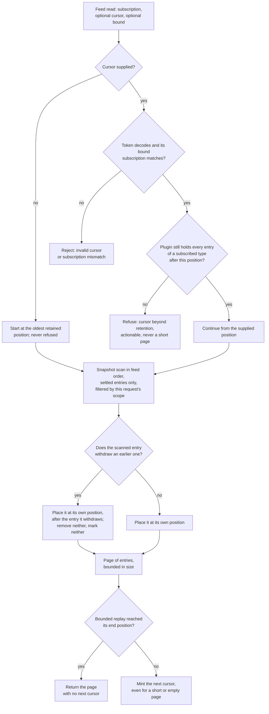

Created:  2026-09-25 by Virtuozzo International GmbH
Updated:  2026-09-25 by Virtuozzo International GmbH

# Feature: Usage Feed for Downstream Consumers

- [ ] `p1` - **ID**: `cpt-cf-usage-collector-featstatus-usage-feed-implemented`

- [ ] `p1` - `cpt-cf-usage-collector-feature-usage-feed`

Owns the pull-based read path a charging consumer rates from: a subscription to
a declared set of GTS types, an opaque bounded cursor, snapshot-consistent pages
in one deterministic order, and corrections delivered as ordinary entries at
their own feed position after the entries they withdraw.

<!-- toc -->

- [1. Feature Context](#1-feature-context)
  - [1.1 Overview](#11-overview)
  - [1.2 Purpose](#12-purpose)
  - [1.3 Actors](#13-actors)
  - [1.4 References](#14-references)
- [2. Actor Flows (CDSL)](#2-actor-flows-cdsl)
  - [First Connect and Drain Retained History](#first-connect-and-drain-retained-history)
  - [Resume After a Consumer Outage](#resume-after-a-consumer-outage)
  - [Replay a Bounded Range for a Re-rating](#replay-a-bounded-range-for-a-re-rating)
  - [Observe a Correction Arrive on the Feed](#observe-a-correction-arrive-on-the-feed)
  - [Recover From a Refused Cursor](#recover-from-a-refused-cursor)
  - [Bootstrap After an Authorization Scope Widens](#bootstrap-after-an-authorization-scope-widens)
- [3. Processes / Business Logic (CDSL)](#3-processes--business-logic-cdsl)
  - [Admit a Feed Read Request](#admit-a-feed-read-request)
  - [Bind and Decode the Feed Cursor](#bind-and-decode-the-feed-cursor)
  - [Assemble a Feed Page](#assemble-a-feed-page)
  - [Surface the Retention Refusal](#surface-the-retention-refusal)
  - [Apply an Authorization Scope Change Across Pages](#apply-an-authorization-scope-change-across-pages)
  - [Size a Replay Against the Subscribed Arrival Rate](#size-a-replay-against-the-subscribed-arrival-rate)
- [4. States (CDSL)](#4-states-cdsl)
  - [Feed Cursor Servability State Machine](#feed-cursor-servability-state-machine)
- [5. Definitions of Done](#5-definitions-of-done)
  - [Subscription Bound to the Cursor](#subscription-bound-to-the-cursor)
  - [Deterministic Feed Order With Corrections Behind Their Targets](#deterministic-feed-order-with-corrections-behind-their-targets)
  - [Completeness Behind Every Returned Cursor](#completeness-behind-every-returned-cursor)
  - [Snapshot-Consistent Pagination](#snapshot-consistent-pagination)
  - [Named Start at the Oldest Retained Entry](#named-start-at-the-oldest-retained-entry)
  - [Gateway-Owned, Opaque, Length-Bounded Cursor](#gateway-owned-opaque-length-bounded-cursor)
  - [A Next Cursor on Every Live Page](#a-next-cursor-on-every-live-page)
  - [Corrections Delivered as Ordinary Entries](#corrections-delivered-as-ordinary-entries)
  - [Retention Refusal Surfaced as an Actionable Error](#retention-refusal-surfaced-as-an-actionable-error)
  - [Asymmetric Handling of a Scope Change](#asymmetric-handling-of-a-scope-change)
  - [At-Least-Once Delivery With Consumer-Side Deduplication](#at-least-once-delivery-with-consumer-side-deduplication)
  - [Unstripped Entries on Every Page](#unstripped-entries-on-every-page)
  - [Freshness as a Plugin Readiness Gate](#freshness-as-a-plugin-readiness-gate)
  - [Bounded Replay Recovery Objective](#bounded-replay-recovery-objective)
- [6. Acceptance Criteria](#6-acceptance-criteria)

<!-- /toc -->

## 1. Feature Context

### 1.1 Overview

This feature is the Feed Gateway. A downstream consumer declares the GTS types
it rates — a GTS type is the platform-registered meter identity every entry
names — and then pulls pages of accepted entries, carrying an opaque cursor
from one page to the next. Everything outside the subscription is excluded from
the pages and from the cursor. The order is the storage plugin's, and the one
ordering promise the feed makes beyond determinism is that an invalidation
entry follows the entry it withdraws.

### 1.2 Purpose

A consumer that computes a charge cannot tolerate a read path that silently
skips an entry or silently repeats a page without saying so. The query paths
cannot give it that: they order by covered period, and a late arrival can land
behind a cursor that has already passed. The feed exists to close that hole for
exactly one audience, and it pays for the guarantee with a cursor whose
continuation the plugin must still hold.

The split between this entry stream and the derived aggregate view is the
decision recorded in `cpt-cf-usage-collector-adr-feed-aggregate-split`. The
consistency asymmetry it rests on is
`cpt-cf-usage-collector-adr-consistency-contract`.

**Requirements**: `cpt-cf-usage-collector-fr-billing-usage-feed`,
`cpt-cf-usage-collector-nfr-billing-feed-freshness`,
`cpt-cf-usage-collector-nfr-replay-throughput`

**Principles**: `cpt-cf-usage-collector-principle-cursor-gateway-ownership`

`cpt-cf-usage-collector-principle-cursor-gateway-ownership` is shared with
`cpt-cf-usage-collector-feature-usage-query`. This document covers only the
feed side of it: the wire cursor the gateway mints over the plugin's own opaque
`FeedPosition`. The raw-query keyset side belongs to that feature.

**Components**: `cpt-cf-usage-collector-component-feed-gateway`

**Sequence**: `cpt-cf-usage-collector-seq-read-feed`, which DESIGN owns. This
document refines the steps of that sequence rather than redefining it.

### 1.3 Actors

| Actor | Role in Feature |
|-------|-----------------|
| `cpt-cf-usage-collector-actor-usage-consumer` | The central actor. A charging consumer declares its subscription, pulls pages, persists the cursor it received, resumes from it, replays from an earlier one, and deduplicates on entry identifier. |
| `cpt-cf-usage-collector-actor-platform-developer` | Integrates an in-process consumer against the SDK trait, which takes the same start mode and cursor the REST route takes. |
| `cpt-cf-usage-collector-actor-platform-operator` | Selects a storage plugin whose published freshness ceiling qualifies the deployment to feed a charging consumer, and watches the replay-refusal signal that shows a consumer falling behind the retention floor. |
| `cpt-cf-usage-collector-actor-storage-backend` | Realises the feed order, issues and interprets every `FeedPosition`, serves only settled entries, and decides the retention refusal from what it still holds. |
| `cpt-cf-usage-collector-actor-tenant-admin` | Does not read the feed. A tenant administrator reads its own tenant's usage through the raw and aggregated query paths, which promise no snapshot and no replay. |
| `cpt-cf-usage-collector-actor-types-registry` | Holds the per-type retention policy the storage plugin reads directly. This feature resolves no declaration of its own. |
| `cpt-cf-usage-collector-actor-usage-source` | Writes the entries the feed later replays. It touches no feed surface. |

### 1.4 References

- **PRD**: [PRD.md](../PRD.md) — §5.9 the usage feed, the unstripped field set
  returned on a feed page, and the retention floor with its two zones and one
  refusal; §6.1 the feed freshness gate and the replay recovery objective; §7.2
  the downstream usage reader contract; §9 the feed acceptance criteria; §11
  the at-least-once delivery and subscribed-rate assumptions.
- **Design**: [DESIGN.md](../DESIGN.md) — §2.1 cursor gateway ownership, the
  canonical page envelope, and the append-only ledger that buys the snapshot;
  §3.1 the `FeedSubscription`, `FeedPage`, `FeedPosition` and `FeedStart`
  entities and the Feed order invariant; §3.2 the Feed Gateway; §3.3 the cursor
  and pagination contract and the plugin error taxonomy; §3.6 the read-feed
  sequence; §3.10 the consistency contract and the plugin deployment-guide
  obligations; §3.11 the replay recovery objective and the feed instruments.
- **ADRs**:
  [0011](../ADR/0011-cpt-cf-usage-collector-adr-feed-aggregate-split.md),
  [0006](../ADR/0006-cpt-cf-usage-collector-adr-consistency-contract.md)
- **Dependencies**:
  `cpt-cf-usage-collector-feature-usage-record-ingestion`,
  `cpt-cf-usage-collector-feature-record-invalidation`,
  `cpt-cf-usage-collector-feature-attribution-authorization`,
  `cpt-cf-usage-collector-feature-pluggable-storage`, and
  `cpt-cf-usage-collector-feature-backfill-retention`. This feature is in turn
  consumed by `cpt-cf-usage-collector-feature-consistency-freshness-contract`
  and `cpt-cf-usage-collector-feature-contract-stability`.

**The one ordering irregularity in the decomposition.** This feature is
numbered ahead of `cpt-cf-usage-collector-feature-backfill-retention` and still
depends on it. The decomposition calls that out in its overview and in this
entry's own dependency list, and the reason is worth stating plainly here. The
retention floor is `backfill window + operational replay horizon`. The backfill
window is a value backfill and retention governance configures, and the
operational replay horizon is a deployment parameter this gear never reads. The
feed's cursor-refusal behavior has to conform to that floor, so it depends
forward on the feature that owns the window term. The refusal itself is
nonetheless enforced by the active storage plugin, from what it still holds
(DESIGN §3.2, Feed Gateway). The gear does not police retention, runs no sweep,
and reads no type's retention policy at request time. The floor's formula and
its readiness evaluation stay with
`cpt-cf-usage-collector-dod-retention-floor-formula` and
`cpt-cf-usage-collector-algo-retention-floor-evaluation`, and the seam between
the two features is stated from the other side in
`cpt-cf-usage-collector-dod-retention-feed-conformance`.

**A deliberate non-dependency on type resolution.** This feature does not
depend on `cpt-cf-usage-collector-feature-usage-type-resolution`, and that is a
decision rather than an omission. Every other read and write path resolves an
entry's GTS type to its declaration, because it needs the declared fold, the
metering unit, or the metadata surface. The feed needs none of them. A
subscription is a caller-declared set of type identifiers, matched as
identifiers, and a page is returned as persisted with no fold applied and no
shaping performed. The identifiers are opaque to this feature, so no
declaration lookup stands on the page-serving path and a registry outage
degrades nothing here.

**Owned elsewhere, referenced here.**

- Entry shape, identity derivation and the server-assigned fields belong to
  `cpt-cf-usage-collector-feature-usage-record-ingestion`. The feed replays the
  entries that feature writes and restates none of its rules. Consumer-side
  deduplication uses the identifier
  `cpt-cf-usage-collector-dod-dedup-identity-derivation` defines.
- The target-and-withdrawal semantics that let a correction be placed after the
  entry it withdraws belong to
  `cpt-cf-usage-collector-feature-record-invalidation`, specifically
  `cpt-cf-usage-collector-dod-withdrawal-linkage` and
  `cpt-cf-usage-collector-dod-pair-remains-readable`. This feature places the
  pair; it does not decide what an invalidation is or when one is valid.
- Per-request scope evaluation and the policy decision point gating every page
  belong to `cpt-cf-usage-collector-feature-attribution-authorization`,
  specifically `cpt-cf-usage-collector-dod-feed-scope-per-request` and
  `cpt-cf-usage-collector-flow-authorize-feed`. This document does not
  redeclare them.
- Reaching the plugin is
  `cpt-cf-usage-collector-feature-pluggable-storage`, through
  `cpt-cf-usage-collector-dod-plugin-dispatch-neutrality` and
  `cpt-cf-usage-collector-algo-plugin-dispatch`. The plugin error taxonomy this
  feature surfaces is mapped by
  `cpt-cf-usage-collector-dod-plugin-error-mapping`.
- The plugin-agnostic staleness floor and the numeric ceiling a deployment must
  publish belong to
  `cpt-cf-usage-collector-feature-consistency-freshness-contract`, which
  depends on this feature. This document names the readiness gate and the seam;
  it fixes no consistency number of its own.
- Detecting an unintended narrowing of a consumer's authorization scope belongs
  to `cpt-cf-usage-collector-feature-rate-limiting-reconciliation`, on an
  operator surface the consumer's own scope does not bound.

## 2. Actor Flows (CDSL)

Each flow below enters through the feed route and reaches this feature's logic
only after admission and authorization have run. Those steps appear as single
steps, because the features that own them define their behavior.

### First Connect and Drain Retained History

- [ ] `p1` - **ID**: `cpt-cf-usage-collector-flow-feed-first-connect`

**Actor**: `cpt-cf-usage-collector-actor-usage-consumer`

**Success Scenarios**:
- A consumer that has never read starts at the oldest entry its subscription
  retains, drains the retained history page by page, reaches the head, and
  keeps the cursor it was handed.
- A subscription that retains nothing yet returns an empty page carrying a
  cursor at the head, which the consumer polls from.

**Error Scenarios**:
- A subscription naming a GTS type the caller's scope does not admit is refused
  whole, with no partial page substituted.
- A request supplying both a cursor and a start mode of its own is rejected as
  an invalid argument.

**Steps**:
1. [ ] - `p1` - Consumer declares the set of GTS types it rates and issues a feed read carrying no cursor - `inst-feed-first-declare`
2. [ ] - `p1` - API: GET /usage-collector/v1/feed (subscription in, page plus next cursor out) - `inst-feed-first-surface`
3. [ ] - `p1` - Gateway authorizes the read per `cpt-cf-usage-collector-flow-authorize-feed`, refusing the whole request if any subscribed type is denied - `inst-feed-first-authorize`
4. [ ] - `p1` - Gateway compiles the absent cursor to the named start mode `FeedStart::Oldest` rather than passing an absent position down - `inst-feed-first-oldest`
5. [ ] - `p1` - Gateway runs `cpt-cf-usage-collector-algo-feed-page-assembly` and returns entries in feed order - `inst-feed-first-assemble`
6. [ ] - `p1` - **IF** the subscription retains no entry the caller's scope admits - `inst-feed-first-empty-branch`
   1. [ ] - `p1` - **RETURN** an empty page carrying a cursor at the head, which the consumer polls from thereafter - `inst-feed-first-empty-return`
7. [ ] - `p1` - Consumer processes the page, deduplicating on entry identifier, and persists the returned cursor before acting on the next page - `inst-feed-first-persist`
8. [ ] - `p1` - Consumer repeats with the persisted cursor until a page returns fewer entries than requested and its cursor stops advancing - `inst-feed-first-drain`
9. [ ] - `p1` - **RETURN** a consumer holding a cursor at the head of its subscription, with every retained entry processed exactly once after deduplication - `inst-feed-first-return`

### Resume After a Consumer Outage

- [ ] `p1` - **ID**: `cpt-cf-usage-collector-flow-feed-resume-after-outage`

**Actor**: `cpt-cf-usage-collector-actor-usage-consumer`

**Success Scenarios**:
- A consumer down longer than its own buffer resumes from its persisted cursor
  and misses no entry its scope admitted while it was down.
- A consumer that resumes from a cursor it had already advanced past receives
  the overlapping entries again and absorbs them by deduplication.

**Error Scenarios**:
- A consumer down long enough for retention to have removed an entry of a
  subscribed type after its cursor is refused with an actionable error rather
  than served a truncated range.

**Steps**:
1. [ ] - `p1` - Consumer returns to service and loads the last cursor it persisted - `inst-feed-resume-load`
2. [ ] - `p1` - API: GET /usage-collector/v1/feed (subscription plus cursor in, page plus next cursor out) - `inst-feed-resume-surface`
3. [ ] - `p1` - Gateway authorizes the read and decodes the cursor per `cpt-cf-usage-collector-algo-feed-cursor-binding` - `inst-feed-resume-decode`
4. [ ] - `p1` - Gateway dispatches the read, continuing from the position the cursor carries - `inst-feed-resume-dispatch`
5. [ ] - `p1` - **IF** the plugin refuses the continuation because retention has already removed an entry of a subscribed type after that position - `inst-feed-resume-refusal-branch`
   1. [ ] - `p1` - **RETURN** the actionable refusal defined by `cpt-cf-usage-collector-algo-feed-retention-refusal`, and the consumer proceeds by `cpt-cf-usage-collector-flow-feed-recover-refused-cursor` - `inst-feed-resume-refusal-return`
6. [ ] - `p1` - Consumer drains the accumulated backlog at the read rate `cpt-cf-usage-collector-algo-feed-replay-sizing` derives - `inst-feed-resume-drain`
7. [ ] - `p1` - Consumer deduplicates every entry on its identifier, since delivery is at-least-once and an overlapping resume is expected - `inst-feed-resume-dedup`
8. [ ] - `p1` - **RETURN** a consumer back at the head of its subscription, having processed the same set a consumer that never went down would hold - `inst-feed-resume-return`

### Replay a Bounded Range for a Re-rating

- [ ] `p1` - **ID**: `cpt-cf-usage-collector-flow-feed-bounded-replay`

**Actor**: `cpt-cf-usage-collector-actor-usage-consumer`

**Success Scenarios**:
- A consumer re-rates a closed stretch by replaying from an earlier cursor,
  bounded by a cursor it recorded later, and obtains the same entries in the
  same order it obtained live.
- The last page of the bounded replay carries no next cursor, so the replay has
  a definite end.

**Error Scenarios**:
- A bound whose cursor was minted under a different subscription is rejected as
  an invalid argument on the bound rather than silently ignored.
- A start cursor whose continuation retention has truncated is refused, so no
  partial re-rating runs.

**Steps**:
1. [ ] - `p1` - Consumer selects an earlier cursor it retained and the later cursor that bounds the stretch it re-rates - `inst-feed-replay-select`
2. [ ] - `p1` - API: GET /usage-collector/v1/feed (subscription, start cursor and bounding cursor in, page plus next cursor out) - `inst-feed-replay-surface`
3. [ ] - `p1` - Gateway validates both cursors on the same terms, rejecting a mismatched subscription on whichever cursor carries it - `inst-feed-replay-validate`
4. [ ] - `p1` - Gateway dispatches the bounded read and returns pages in the same feed order the live read returned - `inst-feed-replay-dispatch`
5. [ ] - `p1` - **IF** the page reaches the bounding position - `inst-feed-replay-end-branch`
   1. [ ] - `p1` - **RETURN** that page with no next cursor, marking the end of the bounded replay - `inst-feed-replay-end-return`
6. [ ] - `p1` - **ELSE** - `inst-feed-replay-more-branch`
   1. [ ] - `p1` - **RETURN** the page with a next cursor and continue - `inst-feed-replay-more-return`
7. [ ] - `p1` - Consumer recomputes the period from the replayed entries and compares it against what it charged - `inst-feed-replay-recompute`
8. [ ] - `p1` - **RETURN** a replay identical entry for entry to the original scan, since adding or dropping the bound changes no entry the start cursor admits - `inst-feed-replay-return`

### Observe a Correction Arrive on the Feed

- [ ] `p1` - **ID**: `cpt-cf-usage-collector-flow-feed-observe-correction`

**Actor**: `cpt-cf-usage-collector-actor-usage-consumer`

**Success Scenarios**:
- A consumer that has already rated an entry later receives the invalidation
  entry that withdraws it, at its own feed position, and reverses the charge
  downstream.
- A consumer replaying across the same stretch sees both entries again, in the
  same relative order.

**Error Scenarios**:
- No error scenario belongs to the consumer here. An accepted invalidation
  never removes an entry from the feed and never changes one already delivered,
  so there is no failure for a reader to handle.

**Steps**:
1. [ ] - `p1` - Consumer reads a page, rates an entry it contains, and advances its cursor past that entry - `inst-feed-correction-rate`
2. [ ] - `p1` - A correction for that entry is later accepted on an ingestion route, which `cpt-cf-usage-collector-feature-record-invalidation` owns - `inst-feed-correction-accepted`
3. [ ] - `p1` - Gateway serves the invalidation entry on a later page, at its own feed position, after the entry it withdraws - `inst-feed-correction-position`
4. [ ] - `p1` - Gateway leaves both entries in the stream, applies no fold, and marks neither - `inst-feed-correction-no-fold`
5. [ ] - `p1` - Consumer reads the entry type to recognise the invalidation, and the target linkage to find the entry it withdraws - `inst-feed-correction-linkage`
6. [ ] - `p1` - Consumer reverses the charge in its own domain, since the gear performs no compensation - `inst-feed-correction-reverse`
7. [ ] - `p1` - **RETURN** a consumer whose processed set reflects the withdrawal, reached without any entry it already read having changed - `inst-feed-correction-return`

### Recover From a Refused Cursor

- [ ] `p1` - **ID**: `cpt-cf-usage-collector-flow-feed-recover-refused-cursor`

**Actor**: `cpt-cf-usage-collector-actor-usage-consumer`

**Success Scenarios**:
- A consumer whose cursor is refused restarts from the oldest position its
  subscription retains, which is never refused, and rebuilds its position by
  deduplication.
- A platform operator sees the refusal on the feed request instrument and
  treats it as a consumer falling behind the retention floor.

**Error Scenarios**:
- A consumer that retries the same refused cursor is refused again, since the
  refusal reads what the store holds and no retry changes that.
- A consumer that treats the refusal as an empty page would under-bill, which
  the actionable error exists to prevent.

**Steps**:
1. [ ] - `p1` - Consumer issues a read with a cursor whose continuation retention has truncated - `inst-feed-refused-issue`
2. [ ] - `p1` - Gateway surfaces the plugin's refusal as an actionable invalid-argument error naming the cursor, never as a short or empty page - `inst-feed-refused-surface`
3. [ ] - `p1` - Gateway counts the refusal under the replay-refusal category of the feed request instrument DESIGN §3.11 defines - `inst-feed-refused-signal`
4. [ ] - `p1` - Consumer discards the refused cursor rather than retrying it, since the condition does not clear on its own - `inst-feed-refused-discard`
5. [ ] - `p1` - Consumer re-reads from the start position by issuing a request carrying no cursor, which is never refused - `inst-feed-refused-restart`
6. [ ] - `p1` - Consumer deduplicates the replayed history on entry identifier and resumes normal polling - `inst-feed-refused-dedup`
7. [ ] - `p1` - Operator treats a sustained refusal rate as a signal that the consumer's drain rate is below the objective `cpt-cf-usage-collector-nfr-replay-throughput` states - `inst-feed-refused-operator`
8. [ ] - `p1` - **RETURN** a consumer reading again from a servable position, with the entries retention removed acknowledged as unrecoverable from this gear - `inst-feed-refused-return`

### Bootstrap After an Authorization Scope Widens

- [ ] `p1` - **ID**: `cpt-cf-usage-collector-flow-feed-bootstrap-after-widening`

**Actor**: `cpt-cf-usage-collector-actor-usage-consumer`

**Success Scenarios**:
- A consumer granted a wider scope bootstraps it by reading from the start
  position and deduplicating, exactly as for any replay.
- A consumer granted scope over a tenant that begins emitting only after the
  grant has nothing behind its cursor and needs no bootstrap at all.

**Error Scenarios**:
- A consumer that waits for the feed to signal the widening waits forever: the
  gear raises no such signal and must not be relied on to.
- A consumer that assumes a narrowing was intended misses the gap, which is
  reconciliation's to detect rather than the cursor's.

**Steps**:
1. [ ] - `p1` - Consumer's authorization scope widens over entries older than its current cursor, by a grant made in the consumer's own domain - `inst-feed-widen-grant`
2. [ ] - `p1` - Gateway continues serving pages under the scope compiled for each request and delivers nothing behind the cursor - `inst-feed-widen-no-backfill`
3. [ ] - `p1` - Gateway raises no signal for the widening, since the scope is platform state the feed cannot observe a change in - `inst-feed-widen-no-signal`
4. [ ] - `p1` - Consumer issues a fresh read carrying no cursor, which begins at the oldest retained position under the wider scope - `inst-feed-widen-bootstrap`
5. [ ] - `p1` - Consumer deduplicates the entries it had already processed and absorbs the newly admitted ones - `inst-feed-widen-dedup`
6. [ ] - `p1` - **IF** the widening is a re-grant after an earlier narrowing - `inst-feed-widen-regrant-branch`
   1. [ ] - `p1` - Consumer recovers the entries skipped while narrowed by the same bootstrap, for as long as retention still holds them - `inst-feed-widen-regrant-recover`
7. [ ] - `p1` - **RETURN** a consumer whose processed set covers the wider scope, reached at the cost of a full replay, since this version offers no partial bootstrap - `inst-feed-widen-return`

## 3. Processes / Business Logic (CDSL)

### Admit a Feed Read Request

- [ ] `p1` - **ID**: `cpt-cf-usage-collector-algo-feed-request-admission`

**Input**: a subscription naming one or more GTS types, an optional cursor, an
optional bounding cursor, an optional page size, and the caller's security
context.

**Output**: a dispatchable read carrying a named start mode and a compiled
scope, or a deterministic refusal.

**Steps**:
1. [ ] - `p1` - Reject a subscription naming no GTS type, and one naming more types than the published subscription cap admits - `inst-feed-admit-subscription-shape`
2. [ ] - `p1` - Treat each subscribed identifier as opaque, resolving no declaration for it, since the feed shapes nothing by type - `inst-feed-admit-opaque-types`
3. [ ] - `p1` - Run the per-request authorization of `cpt-cf-usage-collector-dod-feed-scope-per-request` for the read scope covering every subscribed type - `inst-feed-admit-authorize`
4. [ ] - `p1` - **IF** authorization refuses for any subscribed type - `inst-feed-admit-deny-branch`
   1. [ ] - `p1` - **RETURN** the deterministic refusal, serving no page and substituting no partial one - `inst-feed-admit-deny-return`
5. [ ] - `p1` - Clamp the requested page size to the published maximum, so a page stays bounded however broad the subscription is - `inst-feed-admit-clamp-size`
6. [ ] - `p1` - Run `cpt-cf-usage-collector-algo-feed-cursor-binding` over the supplied cursor and bounding cursor - `inst-feed-admit-cursors`
7. [ ] - `p1` - **RETURN** the admitted read, carrying the named start mode, the decoded positions, the clamped size and the scope compiled for this request alone - `inst-feed-admit-return`

### Bind and Decode the Feed Cursor

- [ ] `p1` - **ID**: `cpt-cf-usage-collector-algo-feed-cursor-binding`

**Input**: an optional wire cursor, an optional bounding wire cursor, and the
subscription declared on this request.

**Output**: a named start mode and an optional bounding position, or a field
violation naming the offending token.

The gateway owns every wire cursor on this path. The plugin never mints,
encodes, or interprets one; it receives and returns only its own opaque
`FeedPosition`.

**Steps**:
1. [ ] - `p1` - **IF** no cursor is supplied - `inst-feed-cursor-absent-branch`
   1. [ ] - `p1` - Compile the start mode to the named oldest-position mode rather than to an absent position, so the plugin is never asked to infer a start - `inst-feed-cursor-absent-oldest`
2. [ ] - `p1` - **ELSE** - `inst-feed-cursor-present-branch`
   1. [ ] - `p1` - **TRY** decoding and validating the token - `inst-feed-cursor-decode-try`
      1. [ ] - `p1` - Compare the subscription the token was minted under against the one this request declares - `inst-feed-cursor-compare-subscription`
      2. [ ] - `p1` - Extract the plugin position the token carries and compile the start mode to continue from it - `inst-feed-cursor-extract`
   2. [ ] - `p1` - **CATCH** a malformed token or a subscription that differs - `inst-feed-cursor-decode-catch`
      1. [ ] - `p1` - **RETURN** an invalid-argument violation on the cursor field, naming which of the two guards failed - `inst-feed-cursor-decode-reject`
3. [ ] - `p1` - Validate a supplied bounding cursor on the same terms, reporting a violation on the bound's own field - `inst-feed-cursor-bound-validate`
4. [ ] - `p1` - Treat adding or dropping the bound alongside a resent cursor as valid, since the bound is not part of what the cursor binds - `inst-feed-cursor-bound-optional`
5. [ ] - `p1` - Bind no part of the compiled authorization scope into any token, so a policy edit invalidates no cursor and a scope change is never reported as a mismatch - `inst-feed-cursor-no-scope`
6. [ ] - `p1` - Reject a caller order supplied alongside a cursor, the feed admitting no caller order at all - `inst-feed-cursor-no-order`
7. [ ] - `p1` - **RETURN** the named start mode and the optional bounding position - `inst-feed-cursor-return`

### Assemble a Feed Page

- [ ] `p1` - **ID**: `cpt-cf-usage-collector-algo-feed-page-assembly`

**Input**: an admitted read carrying a start mode, an optional bounding
position, a clamped page size, and the scope compiled for this request.

**Output**: a page of entries in feed order with a next cursor, or a page with
no next cursor at the end of a bounded replay, or a refusal.

The diagram below traces one page from the request through the cursor decision,
the correction-position rule, and the retention refusal.

**Steps**:
1. [ ] - `p1` - Dispatch the read through the storage plugin seam, passing the subscription, the compiled scope, the start mode, the optional bound and the size - `inst-feed-page-dispatch`
2. [ ] - `p1` - Require the plugin to scan a consistent snapshot in its own feed order, carrying only settled entries — entries that have converged, with nothing further able to become visible before them - `inst-feed-page-settled`
3. [ ] - `p1` - Require the plugin to place an invalidation entry after the entry it withdraws, and to remove neither entry of the pair from the stream - `inst-feed-page-correction-order`
4. [ ] - `p1` - Apply no fold, filter no withdrawn pair, and mark no entry, the page carrying every field as persisted - `inst-feed-page-no-fold`
5. [ ] - `p1` - **IF** the plugin refuses the continuation - `inst-feed-page-refusal-branch`
   1. [ ] - `p1` - **RETURN** the refusal shaped by `cpt-cf-usage-collector-algo-feed-retention-refusal` - `inst-feed-page-refusal-return`
6. [ ] - `p1` - **IF** the read is bounded and the scan reached the bounding position - `inst-feed-page-bound-branch`
   1. [ ] - `p1` - **RETURN** the page with no next cursor, the bounded replay having a definite end - `inst-feed-page-bound-return`
7. [ ] - `p1` - **ELSE** - `inst-feed-page-live-branch`
   1. [ ] - `p1` - Mint a next cursor over the position the plugin returned, including for a page shorter than requested and for an empty page at the head - `inst-feed-page-mint`
8. [ ] - `p1` - Keep the minted token inside its published length bound, whatever breadth of subscription it positions - `inst-feed-page-bounded-token`
9. [ ] - `p1` - **RETURN** the page in the canonical page envelope, with the entries and the cursor - `inst-feed-page-return`

### Surface the Retention Refusal

- [ ] `p1` - **ID**: `cpt-cf-usage-collector-algo-feed-retention-refusal`

**Input**: a caller-supplied cursor and the plugin's decision on whether the
continuation after its position is intact.

**Output**: a served page, or an actionable refusal naming the cursor.

The decision is the plugin's alone, and it reads what the store still holds
rather than the cursor's age. A retention sweep clamps the age of a stale
cursor to the retention boundary, so age cannot detect the loss this refusal
exists to catch. The deployment-level conformance that keeps a cursor inside
the operational replay horizon servable belongs to
`cpt-cf-usage-collector-dod-retention-feed-conformance`, whose floor
`cpt-cf-usage-collector-algo-retention-floor-evaluation` computes.

**Steps**:
1. [ ] - `p1` - Apply this evaluation only to a caller-supplied cursor - `inst-feed-refusal-supplied-only`
2. [ ] - `p1` - Never refuse a request carrying no cursor, its start position being by construction the oldest one served - `inst-feed-refusal-never-oldest`
3. [ ] - `p1` - **IF** retention has already removed an entry of a subscribed GTS type after the supplied position - `inst-feed-refusal-removed-branch`
   1. [ ] - `p1` - **RETURN** an actionable invalid-argument refusal naming the cursor, never a silently truncated range - `inst-feed-refusal-return-error`
4. [ ] - `p1` - **ELSE** - `inst-feed-refusal-intact-branch`
   1. [ ] - `p1` - Serve the page however old the cursor is, including where the deployment retains longer than the floor requires - `inst-feed-refusal-serve-old`
5. [ ] - `p1` - Read the removal at the granularity of the subscription's GTS types rather than the caller's authorization scope, since no plugin records which scopes a removed entry fell in - `inst-feed-refusal-granularity`
6. [ ] - `p1` - Accept that this admits a refusal for a removed entry the caller's own scope excluded, which is the price of not requiring that record - `inst-feed-refusal-accept-overrefusal`
7. [ ] - `p1` - Perform no retention read of any kind in the gear, neither a type's policy nor the deployment's replay horizon - `inst-feed-refusal-no-gear-read`
8. [ ] - `p1` - Count the refusal under the replay-refusal category of the feed request instrument, so a consumer falling behind is visible to an operator - `inst-feed-refusal-count`
9. [ ] - `p1` - **RETURN** either the served page or the refusal, with no third outcome - `inst-feed-refusal-return`

### Apply an Authorization Scope Change Across Pages

- [ ] `p1` - **ID**: `cpt-cf-usage-collector-algo-feed-scope-change`

**Input**: the scope compiled for this request and the cursor the caller
carried from a request compiled under a possibly different scope.

**Output**: a page filtered by the current scope, with no signal for either
direction of change.

**Steps**:
1. [ ] - `p1` - Filter every page by the scope compiled for this request, never by one recorded in the cursor - `inst-feed-scope-per-request`
2. [ ] - `p1` - **IF** the scope has narrowed since the cursor was minted - `inst-feed-scope-narrow-branch`
   1. [ ] - `p1` - Skip the entries the caller may no longer read as the cursor advances, serving them being a read the scope no longer permits - `inst-feed-scope-narrow-skip`
   2. [ ] - `p1` - Raise no error and withhold nothing already delivered, the processed set staying valid - `inst-feed-scope-narrow-silent`
3. [ ] - `p1` - **IF** the scope has widened since the cursor was minted - `inst-feed-scope-widen-branch`
   1. [ ] - `p1` - Deliver nothing behind the cursor, completeness binding the scope each read ran under rather than one acquired later - `inst-feed-scope-widen-no-backfill`
   2. [ ] - `p1` - Leave the bootstrap of the newly admitted scope to the consumer, by the start-position read of `cpt-cf-usage-collector-flow-feed-bootstrap-after-widening` - `inst-feed-scope-widen-bootstrap`
4. [ ] - `p1` - Treat a re-grant after a narrowing as an ordinary widening, recovered by the same bootstrap while retention holds the entries - `inst-feed-scope-regrant`
5. [ ] - `p1` - Invalidate no cursor on either change, and report neither as a subscription mismatch - `inst-feed-scope-cursor-survives`
6. [ ] - `p1` - Leave detection of an unintended narrowing to `cpt-cf-usage-collector-feature-rate-limiting-reconciliation`, on a surface the consumer's own scope does not bound - `inst-feed-scope-reconciliation`
7. [ ] - `p1` - **RETURN** the page, whose entries are the intersection of the subscription and this request's scope - `inst-feed-scope-return`

### Size a Replay Against the Subscribed Arrival Rate

- [ ] `p2` - **ID**: `cpt-cf-usage-collector-algo-feed-replay-sizing`

**Input**: the arrival rate of the GTS types a given subscription names, the
age of the backlog a consumer has accumulated, and the recovery time the
objective allows.

**Output**: the sustained read rate the deployment must serve that subscription
at, and a pass or fail against the objective.

This sizing is a load-test and capacity procedure rather than a request-path
computation. The gear enforces no rate of its own.

**Steps**:
1. [ ] - `p2` - Measure the arrival rate over the subscribed GTS types alone, never over the gear-wide ingestion envelope - `inst-feed-sizing-subscribed-rate`
2. [ ] - `p2` - Derive the required read rate as the subscribed arrival rate multiplied by one plus the ratio of backlog age to recovery time - `inst-feed-sizing-formula`
3. [ ] - `p2` - Anchor the obligation on the subscription, so a consumer rating a handful of meters is not sized against traffic it never reads - `inst-feed-sizing-bounded-obligation`
4. [ ] - `p2` - Hold ingestion latency inside its published envelope for the whole drain, the read path not being permitted to starve the write path - `inst-feed-sizing-isolation`
5. [ ] - `p2` - **IF** the observed read rate falls below the derived requirement - `inst-feed-sizing-fail-branch`
   1. [ ] - `p2` - Report a readiness failure against `cpt-cf-usage-collector-nfr-replay-throughput`, naming the subscription under test - `inst-feed-sizing-fail-report`
6. [ ] - `p2` - Revalidate the subscribed arrival rate as new meters are onboarded, the requirement scaling directly with it - `inst-feed-sizing-revalidate`
7. [ ] - `p2` - **RETURN** the required rate and the pass or fail result - `inst-feed-sizing-return`

## 4. States (CDSL)

### Feed Cursor Servability State Machine

- [ ] `p2` - **ID**: `cpt-cf-usage-collector-state-feed-cursor-servability`

A cursor genuinely has a lifecycle here, and it is not the same as an entry's.
The gear holds none of it: the states below are properties of a token a
consumer holds, evaluated afresh on each request against what the plugin still
retains. The machine is worth writing down because the transitions are what a
consumer codes against — in particular that the refused state is terminal for
that token and is escaped only by returning to the start position.

**States**: NoCursor, Trailing, AtHead, Exhausted, Refused

**Initial State**: NoCursor

**Transitions**:
1. [ ] - `p2` - **FROM** NoCursor **TO** Trailing **WHEN** a read carrying no cursor begins at the oldest retained position and returns a page whose continuation still holds entries - `inst-feed-cursor-state-start`
2. [ ] - `p2` - **FROM** NoCursor **TO** AtHead **WHEN** the subscription retains no entry the caller's scope admits, so the empty page carries a cursor already at the head - `inst-feed-cursor-state-start-empty`
3. [ ] - `p2` - **FROM** Trailing **TO** Trailing **WHEN** a page is served and its next cursor still trails entries the plugin holds - `inst-feed-cursor-state-advance`
4. [ ] - `p2` - **FROM** Trailing **TO** AtHead **WHEN** a page reaches the settled head and its cursor is minted there, whether or not that page carried entries - `inst-feed-cursor-state-caught-up`
5. [ ] - `p2` - **FROM** AtHead **TO** Trailing **WHEN** entries settle after the cursor, which is the ordinary result of continued ingestion - `inst-feed-cursor-state-fall-behind`
6. [ ] - `p2` - **FROM** Trailing **TO** Refused **WHEN** retention removes an entry of a subscribed GTS type after the cursor's position, whatever the cursor's own age - `inst-feed-cursor-state-refused`
7. [ ] - `p2` - **FROM** Refused **TO** Refused **WHEN** the same token is retried, the condition reading the store rather than elapsed time and therefore never clearing - `inst-feed-cursor-state-refused-sticky`
8. [ ] - `p2` - **FROM** Refused **TO** NoCursor **WHEN** the consumer discards the token and re-reads from the start position, which is never refused - `inst-feed-cursor-state-recover`
9. [ ] - `p2` - **FROM** Trailing **TO** Exhausted **WHEN** a bounded replay reaches its bounding position, and the final page carries no next cursor - `inst-feed-cursor-state-exhausted`
10. [ ] - `p2` - **FROM** AtHead **TO** NoCursor **WHEN** the consumer elects a full bootstrap after its authorization scope widens over entries behind the cursor - `inst-feed-cursor-state-bootstrap`

## 5. Definitions of Done

### Subscription Bound to the Cursor

- [ ] `p1` - **ID**: `cpt-cf-usage-collector-dod-feed-subscription-binding`

The system **MUST** accept a caller-declared set of GTS types on every feed read
and **MUST** exclude every other type from the page and from the cursor it
returns. The cursor **MUST** bind the subscription it was minted under, and a
read whose declared subscription differs from the bound one **MUST** be
rejected as an invalid argument on the cursor field rather than served. The
system **MUST** treat each subscribed identifier as opaque and **MUST NOT**
resolve any declaration for it, the feed shaping nothing by type.

**Implements**:
- `cpt-cf-usage-collector-flow-feed-first-connect`
- `cpt-cf-usage-collector-algo-feed-request-admission`
- `cpt-cf-usage-collector-algo-feed-cursor-binding`

**Touches**:
- API: `GET /usage-collector/v1/feed`
- Component: `cpt-cf-usage-collector-component-feed-gateway`
- Entities: `FeedSubscription`

### Deterministic Feed Order With Corrections Behind Their Targets

- [ ] `p1` - **ID**: `cpt-cf-usage-collector-dod-feed-deterministic-order`

The system **MUST** deliver one deterministic order over a subscription, chosen
and realised by the active storage plugin. The same cursor **MUST** yield the
same entries in the same order, extended only by entries settled since. Beyond
determinism the system **MUST** promise exactly one ordering property: an
invalidation entry is delivered after the entry it withdraws. The system **MUST
NOT** promise acceptance-instant order, and a consumer detecting late arrival
**MUST** read the acceptance instant rather than infer it from position. No
position value **MUST** be part of the public contract.

**Implements**:
- `cpt-cf-usage-collector-algo-feed-page-assembly`

**Touches**:
- API: `GET /usage-collector/v1/feed`
- Component: `cpt-cf-usage-collector-component-feed-gateway`
- Contract: `cpt-cf-usage-collector-contract-storage-plugin`
- Entities: `FeedPosition`

### Completeness Behind Every Returned Cursor

- [ ] `p1` - **ID**: `cpt-cf-usage-collector-dod-feed-completeness`

The system **MUST** guarantee that everything before a returned cursor has been
delivered and is final under the authorization scope that read ran under. No
entry that scope admits **MUST** become visible behind a returned cursor,
however many writers accept concurrently and in whatever commit order. A page
**MUST** therefore carry only settled entries, and the active plugin **MUST**
establish settledness from its own commit or replication state rather than from
elapsed time or a gateway-stamped instant.

**Implements**:
- `cpt-cf-usage-collector-algo-feed-page-assembly`
- `cpt-cf-usage-collector-flow-feed-resume-after-outage`

**Touches**:
- API: `GET /usage-collector/v1/feed`
- Component: `cpt-cf-usage-collector-component-feed-gateway`
- Contract: `cpt-cf-usage-collector-contract-storage-plugin`

### Snapshot-Consistent Pagination

- [ ] `p1` - **ID**: `cpt-cf-usage-collector-dod-feed-snapshot-pagination`

The system **MUST** serve a paginated scan over a consistent snapshot. Such a
scan **MUST NOT** observe entries appearing, disappearing, or changing
mid-scan, with one exception: append-only arrivals, which always land ahead of
the cursor. This guarantee rests on the append-only ledger
`cpt-cf-usage-collector-dod-pair-remains-readable` maintains, so the system
**MUST NOT** introduce any status field, lifecycle flag or in-place update that
a scan could observe flipping.

**Implements**:
- `cpt-cf-usage-collector-algo-feed-page-assembly`
- `cpt-cf-usage-collector-flow-feed-bounded-replay`

**Touches**:
- API: `GET /usage-collector/v1/feed`
- Component: `cpt-cf-usage-collector-component-feed-gateway`
- Entities: `FeedPage`

### Named Start at the Oldest Retained Entry

- [ ] `p1` - **ID**: `cpt-cf-usage-collector-dod-feed-oldest-start`

The system **MUST** begin a read carrying no cursor at the oldest entry the
subscription retains, compiling it to a named start mode rather than passing an
absent position to the plugin. The system **MUST NOT** offer a read that begins
at the head, on either the REST route or the in-process trait: skipping
retained history is never a correct start for a consumer that computes a
charge, so the choice is not the consumer's to make. The start mode **MUST** be
extensible, so that a further start mode admitted later is a new variant rather
than another argument.

**Implements**:
- `cpt-cf-usage-collector-flow-feed-first-connect`
- `cpt-cf-usage-collector-algo-feed-cursor-binding`

**Touches**:
- API: `GET /usage-collector/v1/feed`
- Component: `cpt-cf-usage-collector-component-feed-gateway`
- Entities: `FeedStart`

### Gateway-Owned, Opaque, Length-Bounded Cursor

- [ ] `p1` - **ID**: `cpt-cf-usage-collector-dod-feed-cursor-ownership`

The system **MUST** keep ownership of the wire cursor at the gateway: the
gateway alone mints, encodes, decodes and validates it, and the storage plugin
**MUST NOT** mint, encode or interpret one. The plugin **MUST** receive and
return only its own opaque `FeedPosition`. The wire cursor **MUST** be opaque
to the consumer and **MUST** stay inside a published length bound, and that
bound **MUST** cover the plugin position it carries. A position's encoded size
**MUST NOT** grow with the number of tenants, GTS types or entries the
subscription spans, so a consumer reading every tenant it is authorized for
carries a token no larger than one reading a handful. Each plugin **MUST** show
in its deployment guide how its position stays inside the bound.

**Implements**:
- `cpt-cf-usage-collector-algo-feed-cursor-binding`
- `cpt-cf-usage-collector-algo-feed-page-assembly`

**Touches**:
- API: `GET /usage-collector/v1/feed`
- Component: `cpt-cf-usage-collector-component-feed-gateway`
- Contract: `cpt-cf-usage-collector-contract-storage-plugin`
- Entities: `FeedPosition`

### A Next Cursor on Every Live Page

- [ ] `p1` - **ID**: `cpt-cf-usage-collector-dod-feed-next-cursor-always`

The system **MUST** return a next cursor with every page of a live read,
including a page carrying fewer entries than requested and an empty page at the
head: the feed has no end, and a later request with that cursor returns only
what settled since. A read bounded by a later cursor **MUST** reach an end, and
its final page **MUST** carry no next cursor. The feed **MUST** read forward
only, and **MUST NOT** accept a caller-supplied order on any surface.

**Implements**:
- `cpt-cf-usage-collector-algo-feed-page-assembly`
- `cpt-cf-usage-collector-flow-feed-bounded-replay`

**Touches**:
- API: `GET /usage-collector/v1/feed`
- Component: `cpt-cf-usage-collector-component-feed-gateway`
- Entities: `FeedPage`

### Corrections Delivered as Ordinary Entries

- [ ] `p1` - **ID**: `cpt-cf-usage-collector-dod-feed-corrections-as-entries`

The system **MUST** deliver every correction as an ordinary entry at its own
feed position, immediately after the entry it withdraws. No feed entry **MUST**
represent a change to an already-delivered entry. An accepted invalidation
**MUST NOT** remove either entry of the pair from the feed: withdrawal is
expressed by the arrival of the later entry, never by the disappearance of the
earlier one. The feed **MUST** apply no fold, filter no withdrawn pair and mark
no entry, leaving the consumer to read the entry type and the target linkage
that `cpt-cf-usage-collector-dod-withdrawal-linkage` stamps. A negative
quantity **MUST** likewise arrive as an ordinary entry, being a measurement
rather than a correction.

**Implements**:
- `cpt-cf-usage-collector-flow-feed-observe-correction`
- `cpt-cf-usage-collector-algo-feed-page-assembly`

**Touches**:
- API: `GET /usage-collector/v1/feed`
- Component: `cpt-cf-usage-collector-component-feed-gateway`
- Entities: `FeedPage`

### Retention Refusal Surfaced as an Actionable Error

- [ ] `p1` - **ID**: `cpt-cf-usage-collector-dod-feed-retention-refusal`

The system **MUST** surface the plugin's refusal of a cursor after which
retention has already removed an entry of a subscribed GTS type as an
actionable error, and **MUST NOT** serve such a cursor as a silently truncated
range. The decision **MUST** be the plugin's, taken from what it still holds,
and the plugin **MUST NOT** refuse a cursor on its age: a cursor whose
continuation is intact **MUST** be served however old it is, including where
the deployment retains longer than the floor. The refusal **MUST** read a
caller-supplied cursor only; a request carrying no cursor **MUST NOT** be
refused. Removal **MUST** be read at the granularity of the subscription's GTS
types rather than of the caller's scope, so a cursor **MAY** be refused for a
removed entry that caller's scope excluded. The gear **MUST** perform no
retention read of its own. Conformance of the deployment to the floor that
makes a cursor inside the operational replay horizon servable is
`cpt-cf-usage-collector-dod-retention-feed-conformance`, and this feature
**MUST NOT** restate the floor's formula.

**Implements**:
- `cpt-cf-usage-collector-algo-feed-retention-refusal`
- `cpt-cf-usage-collector-flow-feed-recover-refused-cursor`
- `cpt-cf-usage-collector-state-feed-cursor-servability`

**Touches**:
- API: `GET /usage-collector/v1/feed`
- Component: `cpt-cf-usage-collector-component-feed-gateway`
- Contract: `cpt-cf-usage-collector-contract-storage-plugin`

### Asymmetric Handling of a Scope Change

- [ ] `p1` - **ID**: `cpt-cf-usage-collector-dod-feed-scope-change-asymmetry`

The system **MUST** treat the two directions of an authorization scope change
differently and **MUST** raise no signal for either. A narrowed scope **MUST**
skip the entries the caller may no longer read as the cursor advances, with no
error raised and nothing already delivered withheld. A widened scope **MUST
NOT** be expected to deliver entries sitting behind the consumer's cursor;
bootstrapping the newly admitted scope is the consumer's obligation, performed
as a start-position read and a deduplication, and this version **MUST NOT**
offer a way to read only the newly admitted part. A re-grant after a narrowing
**MUST** be treated as an ordinary widening. No cursor **MUST** be invalidated
by either change, since the compiled scope is not bound into the cursor —
that per-request evaluation being
`cpt-cf-usage-collector-dod-feed-scope-per-request`.

**Implements**:
- `cpt-cf-usage-collector-algo-feed-scope-change`
- `cpt-cf-usage-collector-flow-feed-bootstrap-after-widening`

**Touches**:
- API: `GET /usage-collector/v1/feed`
- Component: `cpt-cf-usage-collector-component-feed-gateway`
- Contract: `cpt-cf-usage-collector-contract-downstream-usage-reader`

### At-Least-Once Delivery With Consumer-Side Deduplication

- [ ] `p1` - **ID**: `cpt-cf-usage-collector-dod-feed-at-least-once`

The system **MUST** state delivery as at-least-once rather than exactly-once,
and **MUST NOT** hold per-consumer delivery state that would be needed to claim
otherwise. An overlapping replay, a resumed cursor and a redelivered page
**MUST** each be expected to present an entry a consumer may already have
rated. The system **MUST** make that safe by returning each entry with the
stable identifier `cpt-cf-usage-collector-dod-dedup-identity-derivation`
derives, on which the consumer deduplicates. Reaching effectively-once
processing **MUST** remain the consumer's responsibility, in its own domain.

**Implements**:
- `cpt-cf-usage-collector-flow-feed-resume-after-outage`
- `cpt-cf-usage-collector-flow-feed-bounded-replay`

**Touches**:
- API: `GET /usage-collector/v1/feed`
- Component: `cpt-cf-usage-collector-component-feed-gateway`
- Contract: `cpt-cf-usage-collector-contract-downstream-usage-reader`

### Unstripped Entries on Every Page

- [ ] `p1` - **ID**: `cpt-cf-usage-collector-dod-feed-unstripped-entries`

The system **MUST** return each feed entry as persisted, carrying its
identifier, GTS type reference, covered period, acceptance instant, idempotency
key, declared metadata, signed quantity, entry type, origin marker, and, on an
invalidation, the withdrawn-entry reference with its reason code. The system
**MUST NOT** strip any of that set on this path and **MUST NOT** denormalize
type-level attributes onto an entry. Responses **MUST** use the canonical page
envelope rather than a paging schema of the gear's own.

**Implements**:
- `cpt-cf-usage-collector-algo-feed-page-assembly`
- `cpt-cf-usage-collector-flow-feed-observe-correction`

**Touches**:
- API: `GET /usage-collector/v1/feed`
- Component: `cpt-cf-usage-collector-component-feed-gateway`
- Entities: `FeedPage`

### Freshness as a Plugin Readiness Gate

- [ ] `p1` - **ID**: `cpt-cf-usage-collector-dod-feed-freshness-gate`

The system **MUST** treat feed freshness as a storage-plugin readiness gate
rather than as a gear-enforced bound. A deployment **MUST NOT** feed a charging
consumer unless its active plugin publishes a consistency ceiling bounding
acceptance to feed visibility at the level
`cpt-cf-usage-collector-nfr-billing-feed-freshness` requires, and unless that
plugin's published convergence bound fits inside that ceiling, the feed serving
only converged submissions. The condition **MUST** be checked at plugin
readiness review alongside the retention floor. Feed consistency, unlike feed
freshness, **MUST** remain a gear-level guarantee. The plugin-agnostic staleness
floor and ceiling themselves belong to
`cpt-cf-usage-collector-feature-consistency-freshness-contract`, and this
feature **MUST NOT** restate their numbers.

**Implements**:
- `cpt-cf-usage-collector-algo-feed-page-assembly`

**Touches**:
- Component: `cpt-cf-usage-collector-component-feed-gateway`
- Contract: `cpt-cf-usage-collector-contract-storage-plugin`

### Bounded Replay Recovery Objective

- [ ] `p1` - **ID**: `cpt-cf-usage-collector-dod-feed-replay-recovery`

The system **MUST** let a consumer that has fallen behind reach the head of its
subscription within the recovery time
`cpt-cf-usage-collector-nfr-replay-throughput` sets, without breaching the
ingestion latency envelope while it drains. The obligation **MUST** be computed
per subscription, against the arrival rate of the subscribed GTS types, and
**MUST NOT** be sized against the gear-wide ingestion envelope. The required
read rate **MUST** be derived from the subscribed arrival rate, the backlog age
and the recovery time rather than fixed as a bare constant. The subscribed
arrival rate **MUST** be recorded as a planning assumption and revalidated as
meters are onboarded.

**Implements**:
- `cpt-cf-usage-collector-algo-feed-replay-sizing`
- `cpt-cf-usage-collector-flow-feed-resume-after-outage`

**Touches**:
- API: `GET /usage-collector/v1/feed`
- Component: `cpt-cf-usage-collector-component-feed-gateway`

## 6. Acceptance Criteria

- [ ] A read carrying no cursor begins at the oldest entry the subscription retains rather than at the head, verified by comparing the first entry returned against the oldest retained entry of a subscribed type.
- [ ] A subscription that retains no entry the caller's scope admits returns an empty page carrying a cursor at the head, and polling that cursor later returns entries that settled since.
- [ ] No surface accepts a request to begin at the head, verified by an attempt on the REST route and on the in-process trait, both of which offer no such start.
- [ ] A subscription naming a subset of GTS types returns pages containing no entry of any other type, and the cursor it returns positions only within that subset.
- [ ] Resending a cursor under a different declared subscription is rejected as an invalid argument naming the cursor field, rather than served against the new subscription.
- [ ] A malformed cursor and a caller-supplied order presented alongside a cursor are each rejected as invalid arguments naming the offending field.
- [ ] Replaying from one cursor twice yields the same entries in the same order, extended only by entries settled between the two reads.
- [ ] A replay bounded by a later cursor is identical entry for entry to the original scan over that stretch, and its final page carries no next cursor.
- [ ] Adding or dropping the bounding cursor alongside a resent start cursor is accepted, and is never reported as a subscription mismatch.
- [ ] An invalidation entry is delivered after the entry it withdraws, under concurrent ingestion of records and invalidations through several gateway replicas.
- [ ] Neither entry of a withdrawn pair disappears from the feed after the invalidation is accepted, and the entry already delivered is byte-identical on a replay across it.
- [ ] A page applies no fold and marks no entry, so a consumer distinguishes a record from its invalidation by the entry type and locates the target by the linkage carried on the invalidation.
- [ ] A negative-quantity entry is delivered as an ordinary entry with no invalidation semantics attached.
- [ ] A paginated scan run against sustained concurrent ingestion observes no entry appearing behind the cursor, disappearing, or changing, other than arrivals ahead of the cursor.
- [ ] Every page of a live read returns a next cursor, including a page shorter than the requested size and an empty page at the head.
- [ ] A subscription that stays quiet while its consumer keeps polling is never refused, and its cursor stays at the head.
- [ ] A cursor issued for a subscription spanning many tenants encodes to the same size as one spanning few, and both stay inside the published cursor length bound.
- [ ] A cursor whose continuation the plugin still holds is served however old it is, including one older than the retention floor against a plugin that retains longer.
- [ ] A cursor after which retention has removed an entry of a subscribed GTS type is refused with an actionable error rather than served as a short page, whatever that cursor's own age.
- [ ] That refusal also occurs where the removed entry fell outside the caller's own authorization scope, confirming the granularity is the subscription's types.
- [ ] Retrying the same refused cursor is refused again, and re-reading from the start position succeeds, confirming the recovery path.
- [ ] A request carrying no cursor is never refused on retention, verified against a deployment that has just swept entries away.
- [ ] Each refusal increments the replay-refusal category of the feed request instrument, so a sustained refusal rate is visible to an operator.
- [ ] The gear reads no type's retention policy and no replay horizon on the feed path, verified by the absence of any such read during a page request.
- [ ] Narrowing a consumer's scope mid-consumption causes later pages to omit the entries it may no longer read, with no error raised and the cursor still valid.
- [ ] Widening a consumer's scope delivers nothing behind its cursor, and a fresh start-position read returns the newly admitted entries, which deduplicate against those already processed.
- [ ] A re-grant after a narrowing recovers the skipped entries through that same start-position read, for as long as retention holds them.
- [ ] A policy edit changes no cursor's validity, and no scope change is reported as a subscription mismatch.
- [ ] An overlapping replay redelivers entries the consumer already holds, and deduplication on entry identifier yields the same processed set a non-overlapping read would.
- [ ] Every feed entry carries the identifier, type reference, covered period, acceptance instant, idempotency key, declared metadata, signed quantity, entry type, origin marker and, on an invalidation, the withdrawn-entry reference with its reason code.
- [ ] A backfilled entry carries its origin marker on the feed exactly as persisted.
- [ ] A deployment whose active plugin publishes no qualifying acceptance-to-visibility ceiling is reported at readiness review as unfit to feed a charging consumer.
- [ ] A deployment whose plugin publishes a convergence bound exceeding its published feed ceiling is likewise reported as unfit.
- [ ] A consumer 24 hours behind reaches the head within 6 hours while entries continue to arrive, with ingestion latency held inside its published envelope throughout, measured against the subscription under test.
- [ ] The observed read rate during that recovery test is at least the rate derived from the subscribed arrival rate, the backlog age and the recovery time.
- [ ] The subscribed arrival rate used to size that test is recorded as a revalidated planning assumption rather than assumed from the gear-wide envelope.
