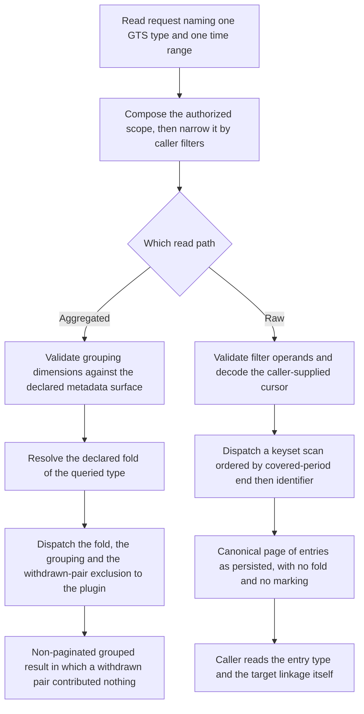

Created:  2026-09-25 by Virtuozzo International GmbH
Updated:  2026-09-25 by Virtuozzo International GmbH

# Feature: Usage Query — Raw & Aggregated

- [ ] `p1` - **ID**: `cpt-cf-usage-collector-featstatus-usage-query-implemented`

- [ ] `p1` - `cpt-cf-usage-collector-feature-usage-query`

Delivers the gear's two consumer read surfaces over accepted ledger entries — a
cursor-paginated raw read that returns persisted fact, and an aggregated read
that serves the queried meter's declared fold — together with the point lookup
that reads one entry by its identifier.

<!-- toc -->

- [1. Feature Context](#1-feature-context)
  - [1.1 Overview](#11-overview)
  - [1.2 Purpose](#12-purpose)
  - [1.3 Actors](#13-actors)
  - [1.4 References](#14-references)
- [2. Actor Flows (CDSL)](#2-actor-flows-cdsl)
  - [Aggregate One Meter Over a Closed Period](#aggregate-one-meter-over-a-closed-period)
  - [Page the Raw Ledger for an Audit](#page-the-raw-ledger-for-an-audit)
  - [Find the Withdrawal of a Known Record](#find-the-withdrawal-of-a-known-record)
  - [Read One Entry by Its Identifier](#read-one-entry-by-its-identifier)
  - [Reconcile an Aggregate Against a Locally Folded Raw Read](#reconcile-an-aggregate-against-a-locally-folded-raw-read)
- [3. Processes / Business Logic (CDSL)](#3-processes--business-logic-cdsl)
  - [Admit a Read Request](#admit-a-read-request)
  - [Select Entries by Covered-Period End](#select-entries-by-covered-period-end)
  - [Validate the Names a Caller Supplies](#validate-the-names-a-caller-supplies)
  - [Apply the Declared Fold on the Aggregated Path](#apply-the-declared-fold-on-the-aggregated-path)
  - [Push the Withdrawn-Pair Exclusion Down to the Plugin](#push-the-withdrawn-pair-exclusion-down-to-the-plugin)
  - [Project a Ledger Read Without a Fold](#project-a-ledger-read-without-a-fold)
  - [Own the Raw-Path Cursor End to End](#own-the-raw-path-cursor-end-to-end)
  - [Resolve a Point Lookup Under the Compiled Scope](#resolve-a-point-lookup-under-the-compiled-scope)
- [4. States (CDSL)](#4-states-cdsl)
- [5. Definitions of Done](#5-definitions-of-done)
  - [Mandatory Single Meter and Time Range](#mandatory-single-meter-and-time-range)
  - [Covered-Period End as the Sole Selection Rule](#covered-period-end-as-the-sole-selection-rule)
  - [No Aggregation Parameter on Any Surface](#no-aggregation-parameter-on-any-surface)
  - [Withdrawn Pairs Excluded by the Plugin, Not by the Gear](#withdrawn-pairs-excluded-by-the-plugin-not-by-the-gear)
  - [Raw Reads Return Withdrawn Pairs as Persisted](#raw-reads-return-withdrawn-pairs-as-persisted)
  - [Unstripped Field Set on Every Ledger Read](#unstripped-field-set-on-every-ledger-read)
  - [Caller-Supplied Names Validated Before Dispatch](#caller-supplied-names-validated-before-dispatch)
  - [Authorized Scope Composed Ahead of Caller Filters](#authorized-scope-composed-ahead-of-caller-filters)
  - [Gateway-Owned Cursor on the Raw Path](#gateway-owned-cursor-on-the-raw-path)
  - [Canonical Page on Raw, Non-Paginated Body on Aggregate](#canonical-page-on-raw-non-paginated-body-on-aggregate)
  - [Point Lookup Returns the Exact Persisted Fact](#point-lookup-returns-the-exact-persisted-fact)
  - [An Empty Selection Still Answers](#an-empty-selection-still-answers)
  - [Read Paths Bound by the Published Consistency Floor](#read-paths-bound-by-the-published-consistency-floor)
- [6. Acceptance Criteria](#6-acceptance-criteria)

<!-- /toc -->

## 1. Feature Context

### 1.1 Overview

A consumer reads the Usage Collector for two different reasons, and this feature
serves both. An auditor, a dispute handler, or a debugging engineer needs the
entries themselves, exactly as they were accepted. A dashboard, a quota
evaluator, or a reconciliation job needs one number per group over a period. The
first need is the raw read path. The second is the aggregated read path. A third,
narrower surface belongs here as well: the point lookup that returns one entry by
its identifier.

All three paths share a preamble. Each authorizes at the policy decision point,
composes the returned constraints with whatever the caller asked for, resolves
the queried usage type declaration where it carries one, and dispatches through
the storage plugin. The aggregated and raw paths also share two mandatory
parameters: exactly one GTS type reference — the platform identifier naming a
registry-owned usage type declaration — and one time range.

**The paths then diverge, and the divergence is the whole point of this
feature.** The raw path is a ledger read. It returns a withdrawn record *and* the
invalidation entry that withdraws it, both as persisted. It applies no fold. It
marks nothing, adds no flag, and suppresses nothing. The caller reads `entry_type`
and `invalidates` and draws its own conclusion. The aggregated path is a derived
view. It excludes both entries of every withdrawn pair from the selected set, and
that exclusion travels down to the storage plugin as part of the query. The gear
never fetches rows and filters them in memory.

Everything a read needs before these rules run belongs to another feature. The
authorization decision and the rule that a caller filter can only narrow belong
to `cpt-cf-usage-collector-feature-attribution-authorization`. Resolving the
queried type to its declaration — its fold and its metadata surface — belongs to
`cpt-cf-usage-collector-feature-usage-type-resolution`. Executing the query
belongs to `cpt-cf-usage-collector-feature-pluggable-storage`. The entries being
read were written by
`cpt-cf-usage-collector-feature-usage-record-ingestion`, and the entry type and
target linkage the raw path hands back untouched were established by
`cpt-cf-usage-collector-feature-record-invalidation`.

The component that hosts all of it is
`cpt-cf-usage-collector-component-query-gateway`.

### 1.2 Purpose

The aggregated path exists so that "usage for this period" is one number per
meter rather than a question with several defensible answers. The fold is a
property of the declared type, never a request parameter, so two consumers
reading one range agree by construction. The raw path exists so that a figure a
consumer disputes can be taken apart into the entries that produced it, without
reaching into a storage backend.

The asymmetry between them is deliberate and is the rule this feature guards
most carefully. A ledger read that silently dropped a withdrawn pair would make
correction history unreconstructible: a reader could no longer see what was
withdrawn, or that anything was. A fold that admitted a withdrawn pair would
double-count, because an invalidation echoes its target's quantity rather than
negating it. Each path therefore gets the treatment its purpose demands, and
`cpt-cf-usage-collector-principle-aggregate-asymmetry` names the resulting shape
difference: raw reads are cursor-paginated list reads under the canonical page
envelope, while the aggregate is a body-shaped call returning a non-paginated
typed result bounded by grouping cardinality rather than by row volume.

Pushing the exclusion down to the plugin rather than applying it after the fact
is what makes the aggregate affordable. A plugin that pre-aggregates a meter
serves a range by reading its own rollups, which it can only do if it knows,
while it folds, which entries to leave out. An exclusion applied in the gear
would oblige every aggregate to stream rows.

**Requirements**: `cpt-cf-usage-collector-fr-query-aggregation`,
`cpt-cf-usage-collector-fr-query-raw`,
`cpt-cf-usage-collector-fr-billing-fields-on-read`

**Principles**: `cpt-cf-usage-collector-principle-aggregate-asymmetry`,
`cpt-cf-usage-collector-principle-canonical-page`,
`cpt-cf-usage-collector-principle-cursor-gateway-ownership`

`cpt-cf-usage-collector-principle-cursor-gateway-ownership` is shared with
`cpt-cf-usage-collector-feature-usage-feed`. This feature covers the raw-query
half of it: the gateway mints, decodes and validates the wire cursor, and the
plugin receives a structured keyset instead. The feed half of the same principle
belongs to that feature and is not restated here.

**Constraints**: none of its own. This feature inherits every constraint from
the features it depends on — the authorization gate, the declaration binding,
and the plugin dispatch seam — and adds no design constraint that applies
uniquely to reading.

**Component**: `cpt-cf-usage-collector-component-query-gateway`

**Sequences**: `cpt-cf-usage-collector-seq-query-aggregated`,
`cpt-cf-usage-collector-seq-query-raw`. DESIGN owns both and fixes the call order
across the gateway, the policy decision point, the Type Resolver and the Plugin
Host. This feature defines the behavior of the steps that belong to it and
restates neither sequence.

**Use cases**: `cpt-cf-usage-collector-usecase-query-aggregated`,
`cpt-cf-usage-collector-usecase-query-raw`

**API**: three routes defined in DESIGN §3.3, none of them introduced here.

- `GET /usage-collector/v1/records`, operation
  `usage_collector.list_usage_records` — the raw ledger read.
- `GET /usage-collector/v1/records/{id}`, operation
  `usage_collector.get_usage_record` — the point lookup.
- `POST /usage-collector/v1/records/aggregate`, operation
  `usage_collector.query_aggregated_usage_records` — the aggregated read. It is
  a body-shaped call because its grouping and metadata predicates do not fit a
  query string, not because it changes state.
- SDK: `cpt-cf-usage-collector-interface-sdk-client` carries the in-process
  counterparts of all three, under the same operation names.

**ADRs**: `cpt-cf-usage-collector-adr-declared-fold`,
`cpt-cf-usage-collector-adr-feed-aggregate-split`,
`cpt-cf-usage-collector-adr-window-end-selection`,
`cpt-cf-usage-collector-adr-consistency-contract`

**Entities**: `UsageRecordFilterField`, `AggregationDimension`,
`AggregationResult`, `Keyset`, `MetadataFilter`, `TimeRange`, `MeterTypeId`,
`UsageRecord`

**Data**: none. This feature declares no database or table component identifier.
The ledger is wholly plugin-owned and reached only through the storage plugin
interface, so no read here touches gear-owned schema.

### 1.3 Actors

| Actor | Role in Feature |
|-------|-----------------|
| `cpt-cf-usage-collector-actor-usage-consumer` | Issues aggregated reads for dashboards and quota evaluation, and raw reads for audit and dispute handling. Folds raw entries itself where it needs a shape the aggregate does not serve, and excludes withdrawn pairs when it does so. |
| `cpt-cf-usage-collector-actor-tenant-admin` | Reads raw and aggregated usage for the administered tenant, narrowed by resource, subject and declared metadata, and never beyond the authorized scope. |
| `cpt-cf-usage-collector-actor-platform-developer` | Integrates a calling gear against the in-process read methods, threads an opaque cursor back unchanged, and reads one entry by identifier to confirm what was persisted. |
| `cpt-cf-usage-collector-actor-storage-backend` | Executes the dispatched query. Applies the fold, the grouping and the withdrawn-pair exclusion for the aggregate, and serves the keyset scan for the raw path without widening either result. |
| `cpt-cf-usage-collector-actor-types-registry` | Holds the declaration whose fold the aggregate serves and whose metadata surface both paths validate grouping and filter names against. |
| `cpt-cf-usage-collector-actor-platform-operator` | Reads the same surfaces while diagnosing a deployment, and configures the storage plugin whose lag the read paths inherit. Operator-only reconciliation counters are a different read path and are not served here. |
| `cpt-cf-usage-collector-actor-usage-source` | Reads back an entry it emitted, by identifier or by raw query, to recover the caller-supplied fields a later withdrawal must copy. |

### 1.4 References

- **PRD**: [PRD.md](../PRD.md) — §5 aggregated usage query, raw usage query, and
  billing fields on read paths; §7 the aggregated-query and raw-query use cases
  and the downstream reader contract.
- **Design**: [DESIGN.md](../DESIGN.md) — §2.1 the aggregate asymmetry, canonical
  page and cursor gateway ownership principles; §3.1 the entity table with the
  admissible filter field set, the admissible grouping set, the keyset and the
  aggregation result, plus the order admissibility and scope intersection
  invariants; §3.2 the Query Gateway; §3.3 the endpoint list, the cursor and
  pagination rules, and the plugin obligations on an empty selection; §3.6 the
  aggregated-query and raw-query sequences; §3.10 the consistency contract.
- **ADRs**:
  [0009](../ADR/0009-cpt-cf-usage-collector-adr-declared-fold.md),
  [0011](../ADR/0011-cpt-cf-usage-collector-adr-feed-aggregate-split.md),
  [0014](../ADR/0014-cpt-cf-usage-collector-adr-window-end-selection.md),
  [0006](../ADR/0006-cpt-cf-usage-collector-adr-consistency-contract.md)
- **Dependencies**:
  `cpt-cf-usage-collector-feature-usage-record-ingestion`,
  `cpt-cf-usage-collector-feature-record-invalidation`,
  `cpt-cf-usage-collector-feature-attribution-authorization`,
  `cpt-cf-usage-collector-feature-usage-type-resolution`, and
  `cpt-cf-usage-collector-feature-pluggable-storage`. This feature is in turn
  consumed by `cpt-cf-usage-collector-feature-rate-limiting-reconciliation`,
  `cpt-cf-usage-collector-feature-throughput-latency-availability`,
  `cpt-cf-usage-collector-feature-operational-visibility`,
  `cpt-cf-usage-collector-feature-consistency-freshness-contract`, and
  `cpt-cf-usage-collector-feature-contract-stability`.

**Owned elsewhere, referenced here.** Four seams are worth naming precisely,
because each is easy to absorb into this feature by mistake.

- The authorized scope is compiled and composed by
  `cpt-cf-usage-collector-algo-read-scope-composition`, owned by
  `cpt-cf-usage-collector-feature-attribution-authorization`. Every flow below
  treats that composition as a single step. This feature owns only the
  validation of the names a caller supplies, which that routine deliberately
  leaves to the read path.
- The declared fold and the declared metadata surface are resolved by
  `cpt-cf-usage-collector-algo-resolve-declaration`, owned by
  `cpt-cf-usage-collector-feature-usage-type-resolution`, and reach this feature
  through `cpt-cf-usage-collector-flow-resolve-for-read`.
- Dispatch and plugin-error classification belong to
  `cpt-cf-usage-collector-algo-plugin-dispatch` and
  `cpt-cf-usage-collector-algo-plugin-error-classification`, owned by
  `cpt-cf-usage-collector-feature-pluggable-storage`.
- **Reconciliation metadata is the Query Gateway's fourth read path and is not
  this feature.** It is operator-only, carries no filter, no grouping and no
  paging, and belongs to
  `cpt-cf-usage-collector-feature-rate-limiting-reconciliation`, which depends on
  this feature. This document states the seam and specifies nothing about that
  path.
- The staleness floor and the per-plugin ceiling that bound how stale a read may
  be belong to `cpt-cf-usage-collector-feature-consistency-freshness-contract`,
  which also depends on this feature. This document states that every read path
  here is bound by that contract and names no number of its own.

## 2. Actor Flows (CDSL)

Each flow enters through one of the three read routes and reaches this feature's
rules only after authorization and scope composition have run. Those steps appear
as single steps, because the features that own them define their behavior.

### Aggregate One Meter Over a Closed Period

- [ ] `p1` - **ID**: `cpt-cf-usage-collector-flow-query-aggregated-usage`

**Actor**: `cpt-cf-usage-collector-actor-usage-consumer`

**Success Scenarios**:
- A consumer names one meter and one closed range, groups by tenant and
  resource, and receives one folded quantity per group, with every withdrawn
  pair having contributed nothing.
- A consumer groups by a metadata property the queried type declares, and the
  grouping is admitted because the resolved declaration names that property.
- A consumer narrows by origin to separate imported history from live
  consumption, issuing one call per origin value, because origin is filterable
  and not groupable.
- A range in which every selected entry is part of a withdrawn pair returns the
  ungrouped bucket with a zero total under an accruing fold, and an absent value
  under an observation fold.

**Error Scenarios**:
- The request carries no time range, or names more than one meter. It is
  rejected before authorization runs.
- The request carries an aggregation parameter of its own. It is rejected with a
  validation error, because the fold is declared rather than chosen.
- The queried type does not resolve. The read is rejected and never reaches the
  storage plugin.
- A grouping dimension names neither a fixed dimension nor a property the
  resolved declaration declares. It is rejected before dispatch rather than
  silently yielding an absent dimension.
- The caller holds no read permission for the meter, or the decision point
  returns an empty constraint set. The read fails closed.
- The result would exceed the aggregation result limit the public contract
  fixes. The request is rejected rather than truncated.

**Steps**:
1. [ ] - `p1` - Usage consumer submits an aggregated read naming one GTS type reference, one time range, optional filters and an optional grouping list - `inst-agg-submit`
2. [ ] - `p1` - Gateway runs `cpt-cf-usage-collector-algo-query-request-admission` over the request - `inst-agg-admit`
3. [ ] - `p1` - **IF** the request names no range, more than one meter, or an aggregation parameter - `inst-agg-admit-bad`
   1. [ ] - `p1` - **RETURN** a validation rejection naming the offending parameter, with nothing dispatched - `inst-agg-admit-return`
4. [ ] - `p1` - Gateway authorizes the read and composes the returned constraints with the caller filters through `cpt-cf-usage-collector-algo-read-scope-composition` - `inst-agg-scope`
5. [ ] - `p1` - **IF** the decision denies, or the composed scope is empty - `inst-agg-denied`
   1. [ ] - `p1` - **RETURN** the fail-closed outcome that gate produced, with nothing dispatched - `inst-agg-denied-return`
6. [ ] - `p1` - Gateway resolves the queried type through `cpt-cf-usage-collector-flow-resolve-for-read`, obtaining the declared fold and the declared metadata surface - `inst-agg-resolve`
7. [ ] - `p1` - **IF** the type does not resolve - `inst-agg-unresolved`
   1. [ ] - `p1` - **RETURN** the resolution failure, with nothing dispatched to the storage plugin - `inst-agg-unresolved-return`
8. [ ] - `p1` - Gateway runs `cpt-cf-usage-collector-algo-query-field-validation` over every filter operand, metadata predicate key and grouping dimension - `inst-agg-fields`
9. [ ] - `p1` - **IF** any name lies outside the set its surface admits - `inst-agg-fields-bad`
   1. [ ] - `p1` - **RETURN** a validation rejection naming that single name, before dispatch - `inst-agg-fields-return`
10. [ ] - `p1` - Gateway applies `cpt-cf-usage-collector-algo-period-end-selection` to turn the range into the selection predicate - `inst-agg-range`
11. [ ] - `p1` - Gateway assembles the dispatch through `cpt-cf-usage-collector-algo-query-fold-application` and `cpt-cf-usage-collector-algo-withdrawn-pair-exclusion-pushdown` - `inst-agg-assemble`
12. [ ] - `p1` - Gateway dispatches the assembled query through `cpt-cf-usage-collector-algo-plugin-dispatch` - `inst-agg-dispatch`
13. [ ] - `p1` - Storage backend folds the selected entries per group and returns the grouped buckets - `inst-agg-fold`
14. [ ] - `p1` - **RETURN** the non-paginated grouped result, each bucket carrying its dimension values in the requested order and one folded quantity - `inst-agg-return`

### Page the Raw Ledger for an Audit

- [ ] `p1` - **ID**: `cpt-cf-usage-collector-flow-query-raw-ledger-page`

**Actor**: `cpt-cf-usage-collector-actor-tenant-admin`

**Success Scenarios**:
- An administrator reads a closed month for one meter and walks it page by page,
  threading back the opaque cursor each page returns until no further page
  remains.
- A page holding a withdrawn record also holds the invalidation that withdraws
  it, because both entries carry one covered period and one page boundary rule
  applies to both.
- Every returned entry carries the full unstripped field set, so the
  administrator can rebuild a target's identity offline without a second call.
- An administrator supplies an order of its own on the first page, and later
  pages keep that order because the cursor carries it.

**Error Scenarios**:
- The request carries no time range, or names more than one meter. It is
  rejected before authorization runs.
- The cursor is malformed, was minted under a different filter, or arrives
  alongside a fresh order. Each case is rejected with its own actionable reason
  naming the cursor.
- A filter operand names a field outside the fixed filter set, or a metadata
  predicate names a property the resolved declaration does not declare. The
  request is rejected before dispatch.
- A caller asks for an offset instead of threading the cursor. No such parameter
  exists on the surface, so the request does not parse.
- The storage plugin is unavailable. The read surfaces a retryable
  unavailability outcome rather than a partial page.

**Steps**:
1. [ ] - `p1` - Tenant administrator submits a raw read naming one GTS type reference, one time range, optional filters, an optional order and an optional cursor - `inst-raw-submit`
2. [ ] - `p1` - Gateway runs `cpt-cf-usage-collector-algo-query-request-admission` over the request - `inst-raw-admit`
3. [ ] - `p1` - **IF** admission rejects the request - `inst-raw-admit-bad`
   1. [ ] - `p1` - **RETURN** the validation rejection naming the offending parameter - `inst-raw-admit-return`
4. [ ] - `p1` - Gateway authorizes the read and composes the constraints with the caller filters through `cpt-cf-usage-collector-algo-read-scope-composition` - `inst-raw-scope`
5. [ ] - `p1` - **IF** the decision denies, or the composed scope is empty - `inst-raw-denied`
   1. [ ] - `p1` - **RETURN** the fail-closed outcome, with nothing dispatched - `inst-raw-denied-return`
6. [ ] - `p1` - Gateway resolves the queried type through `cpt-cf-usage-collector-flow-resolve-for-read`, obtaining the declared metadata surface - `inst-raw-resolve`
7. [ ] - `p1` - Gateway runs `cpt-cf-usage-collector-algo-query-field-validation` over the filter operands and metadata predicate keys - `inst-raw-fields`
8. [ ] - `p1` - Gateway runs `cpt-cf-usage-collector-algo-query-cursor-lifecycle` to decode and validate the supplied cursor, or to establish the first page - `inst-raw-cursor-in`
9. [ ] - `p1` - **IF** the cursor is malformed, bound to a different filter, or accompanied by a fresh order - `inst-raw-cursor-bad`
   1. [ ] - `p1` - **RETURN** a validation rejection carrying the cursor reason, with nothing dispatched - `inst-raw-cursor-return`
10. [ ] - `p1` - Gateway applies `cpt-cf-usage-collector-algo-period-end-selection` to turn the range into the selection predicate - `inst-raw-range`
11. [ ] - `p1` - Gateway dispatches a keyset scan through `cpt-cf-usage-collector-algo-plugin-dispatch`, passing the structured keyset rather than any wire token - `inst-raw-dispatch`
12. [ ] - `p1` - Gateway projects the returned entries through `cpt-cf-usage-collector-algo-raw-ledger-projection`, applying no fold and marking nothing - `inst-raw-project`
13. [ ] - `p1` - Gateway mints the next cursor from the last row's keyset through `cpt-cf-usage-collector-algo-query-cursor-lifecycle` - `inst-raw-cursor-out`
14. [ ] - `p1` - **RETURN** the canonical page holding the entries as persisted and the next cursor where one exists - `inst-raw-return`

### Find the Withdrawal of a Known Record

- [ ] `p1` - **ID**: `cpt-cf-usage-collector-flow-find-withdrawal-of-record`

**Actor**: `cpt-cf-usage-collector-actor-usage-consumer`

**Success Scenarios**:
- A consumer holding a record narrows a raw read on the target-reference field
  over the period that record covers, and finds the invalidation withdrawing it
  where one exists.
- The same read over a record never withdrawn returns an empty page, which the
  consumer reads as the absence of a withdrawal rather than as an error.
- The consumer reaches the answer in one call, because the invalidation copies
  the target's covered period and therefore falls in the same range.

**Error Scenarios**:
- The consumer expects a reverse link on the record itself. No read path carries
  one, so the search is the only available route.
- The consumer searches a range that excludes the target's covered-period end.
  The read returns nothing, because selection reads the period end and not the
  period start.
- The consumer narrows on the target reference but omits the mandatory range.
  The request is rejected on admission.
- The withdrawal lies outside the consumer's authorized scope. It is absent from
  the page, and the composed scope, not the filter, is what excluded it.

**Steps**:
1. [ ] - `p1` - Usage consumer takes the identifier and the covered period of the record it holds - `inst-find-take`
2. [ ] - `p1` - Usage consumer issues a raw read over that record's meter, with a range holding the record's covered-period end - `inst-find-range`
3. [ ] - `p1` - Usage consumer narrows the read on the target-reference filter field, set to the record's identifier - `inst-find-filter`
4. [ ] - `p1` - Gateway serves the read through `cpt-cf-usage-collector-flow-query-raw-ledger-page`, unchanged - `inst-find-serve`
5. [ ] - `p1` - **IF** the page holds an entry - `inst-find-hit`
   1. [ ] - `p1` - **RETURN** that invalidation entry with its reason code, naming the record it withdraws - `inst-find-hit-return`
6. [ ] - `p1` - **ELSE** - `inst-find-miss`
   1. [ ] - `p1` - **RETURN** an empty page, which states that no withdrawal of that record is readable in the caller's scope - `inst-find-miss-return`

### Read One Entry by Its Identifier

- [ ] `p1` - **ID**: `cpt-cf-usage-collector-flow-lookup-entry-by-identifier`

**Actor**: `cpt-cf-usage-collector-actor-platform-developer`

**Success Scenarios**:
- A developer reads back an entry it emitted and receives the exact persisted
  fact, with every server-assigned field as stored.
- The lookup carries neither a meter nor a range, so the composed authorized
  scope is the whole filter applied to it.
- A withdrawn record and the invalidation that withdraws it are each readable by
  their own identifier, and neither read reveals anything about the other beyond
  the linkage the entries already carry.

**Error Scenarios**:
- The identifier names no entry. The read answers not found.
- The identifier names an entry outside the caller's authorized scope. The read
  answers not found in exactly the same way, so the surface is no oracle for the
  existence of entries a caller may not read.
- The caller expects the lookup to reflect an acknowledgement issued moments
  earlier. The consistency contract makes no such promise on any read path here.

**Steps**:
1. [ ] - `p1` - Platform developer submits a point lookup carrying one entry identifier - `inst-point-submit`
2. [ ] - `p1` - Gateway authorizes the read and compiles the scope through `cpt-cf-usage-collector-algo-read-scope-composition`, with no caller filter to compose - `inst-point-scope`
3. [ ] - `p1` - Gateway runs `cpt-cf-usage-collector-algo-point-lookup-resolution` under that scope - `inst-point-resolve`
4. [ ] - `p1` - **IF** no entry is readable under that scope for the identifier - `inst-point-miss`
   1. [ ] - `p1` - **RETURN** a not-found outcome that is identical whether the entry is absent or merely unauthorized - `inst-point-miss-return`
5. [ ] - `p1` - Gateway projects the entry through `cpt-cf-usage-collector-algo-raw-ledger-projection` - `inst-point-project`
6. [ ] - `p1` - **RETURN** the exact persisted fact, with the unstripped field set intact - `inst-point-return`

### Reconcile an Aggregate Against a Locally Folded Raw Read

- [ ] `p1` - **ID**: `cpt-cf-usage-collector-flow-reconcile-aggregate-against-raw`

**Actor**: `cpt-cf-usage-collector-actor-usage-consumer`

**Success Scenarios**:
- A consumer aggregates a closed range, then pages the same range raw, discards
  every withdrawn pair itself, folds the remainder, and the two figures agree.
- The consumer identifies a withdrawn pair from the raw page alone, by reading
  the entry type of one entry and the target reference it carries.
- A consumer needing a per-period series pages the range raw and folds each
  sub-period itself, because the aggregate divides a range into no sub-periods.

**Error Scenarios**:
- The consumer folds the raw page without discarding withdrawn pairs. Its total
  exceeds the aggregate, because an invalidation echoes its target's quantity
  rather than negating it, so each withdrawn measurement is counted twice.
- The consumer expects the raw page to mark a withdrawn entry. Nothing on the
  page is marked, and the entry type together with the target reference is the
  whole signal available.
- The consumer compares the two figures over an open-ended or very recent range.
  They may differ because the paths can observe different replicas, and the
  consistency contract permits that.
- The consumer pages the raw read as though it were a change feed and treats a
  late arrival as a defect. Raw tailing is best-effort, and a consumer that must
  miss nothing reads the feed instead.

**Steps**:
1. [ ] - `p1` - Usage consumer aggregates a closed range through `cpt-cf-usage-collector-flow-query-aggregated-usage` and records the returned figure - `inst-recon-agg`
2. [ ] - `p1` - Usage consumer pages the identical meter, range and filters through `cpt-cf-usage-collector-flow-query-raw-ledger-page` - `inst-recon-raw`
3. [ ] - `p1` - **FOR EACH** entry on the returned pages - `inst-recon-loop`
   1. [ ] - `p1` - Usage consumer reads the entry type, and the target reference where the entry declares the invalidation type - `inst-recon-read-type`
   2. [ ] - `p1` - **IF** the entry declares the invalidation type - `inst-recon-is-inval`
      1. [ ] - `p1` - Usage consumer discards that entry and the entry its target reference names - `inst-recon-discard`
4. [ ] - `p1` - Usage consumer folds the surviving quantities with the fold the queried meter declares - `inst-recon-fold`
5. [ ] - `p1` - **RETURN** the locally folded figure, which equals the aggregate over the same closed range once both reads observe the same converged entries - `inst-recon-return`

## 3. Processes / Business Logic (CDSL)

### Admit a Read Request

- [ ] `p1` - **ID**: `cpt-cf-usage-collector-algo-query-request-admission`

**Input**: an aggregated or raw read request, before any authorization runs

**Output**: an admitted request, or one deterministic validation rejection

**Steps**:
1. [ ] - `p1` - Require exactly one GTS type reference on the request, supplied as the typed parameter and never as a filter conjunct - `inst-adm-one-type`
2. [ ] - `p1` - **IF** the type reference is absent, or more than one is named - `inst-adm-type-bad`
   1. [ ] - `p1` - **RETURN** a validation rejection naming the type parameter - `inst-adm-type-return`
3. [ ] - `p1` - Require a time range as a typed parameter, and reject a range expressed as a filter conjunct - `inst-adm-range`
4. [ ] - `p1` - **IF** the range is absent, or its start is later than its end - `inst-adm-range-bad`
   1. [ ] - `p1` - **RETURN** a validation rejection naming the range parameter - `inst-adm-range-return`
5. [ ] - `p1` - **IF** the request supplies any parameter that would select an aggregation of its own - `inst-adm-fold-param`
   1. [ ] - `p1` - **RETURN** a validation rejection stating that the fold is declared by the queried type and cannot be chosen - `inst-adm-fold-return`
6. [ ] - `p1` - Reject any request carrying a numeric row offset, since neither paginated path admits an offset scan - `inst-adm-no-offset`
7. [ ] - `p1` - **RETURN** the admitted request - `inst-adm-return`

### Select Entries by Covered-Period End

- [ ] `p1` - **ID**: `cpt-cf-usage-collector-algo-period-end-selection`

**Input**: an admitted time range

**Output**: the single selection predicate every read path uses

**Steps**:
1. [ ] - `p1` - Take the range start as inclusive and the range end as exclusive - `inst-sel-bounds`
2. [ ] - `p1` - Select an entry when the end of its covered period falls at or after the range start and strictly before the range end - `inst-sel-predicate`
3. [ ] - `p1` - Read the covered-period end alone, and read the covered-period start for no selection purpose - `inst-sel-one-column`
4. [ ] - `p1` - Apply no separate case for a zero-length covered period, since such an entry has one instant that the same predicate reads - `inst-sel-point-event`
5. [ ] - `p1` - Apply the identical predicate on the aggregated path and the raw path, so two consumers reading one range select one set of entries - `inst-sel-uniform`
6. [ ] - `p1` - Apply no predicate at all on the point lookup, which carries no range - `inst-sel-point-lookup`
7. [ ] - `p1` - **RETURN** the selection predicate for dispatch - `inst-sel-return`

### Validate the Names a Caller Supplies

- [ ] `p1` - **ID**: `cpt-cf-usage-collector-algo-query-field-validation`

**Input**: the caller's filter operands, metadata predicate keys and grouping
dimensions, plus the resolved declaration

**Output**: a validated name set, or one rejection naming a single offending name

**Steps**:
1. [ ] - `p1` - **FOR EACH** filter operand the caller supplied - `inst-fld-filter-loop`
   1. [ ] - `p1` - **IF** the operand is not a member of the fixed filter field set the public contract defines - `inst-fld-filter-bad`
      1. [ ] - `p1` - **RETURN** a validation rejection naming that operand - `inst-fld-filter-return`
2. [ ] - `p1` - **FOR EACH** metadata predicate key the caller supplied on the side channel - `inst-fld-meta-loop`
   1. [ ] - `p1` - **IF** the resolved declaration declares no property under that key - `inst-fld-meta-bad`
      1. [ ] - `p1` - **RETURN** a validation rejection naming that key - `inst-fld-meta-return`
3. [ ] - `p1` - **FOR EACH** grouping dimension the caller supplied, on the aggregated path only - `inst-fld-group-loop`
   1. [ ] - `p1` - **IF** the dimension is neither one of the five fixed dimensions nor a property the resolved declaration declares - `inst-fld-group-bad`
      1. [ ] - `p1` - **RETURN** a validation rejection naming that dimension - `inst-fld-group-return`
   2. [ ] - `p1` - **IF** the same dimension already appears in the list - `inst-fld-group-dup`
      1. [ ] - `p1` - **RETURN** a validation rejection naming the repeated dimension - `inst-fld-group-dup-return`
4. [ ] - `p1` - Admit any combination of admissible dimensions in any order, and impose no ceiling on how many one request carries - `inst-fld-arity`
5. [ ] - `p1` - Validate every caller order key on the raw path against the order key set the public contract defines, and admit one sort direction across the whole order - `inst-fld-order`
6. [ ] - `p1` - Perform all of the above before dispatch, so the storage plugin never receives an unrecognized name - `inst-fld-before-dispatch`
7. [ ] - `p1` - **RETURN** the validated name set - `inst-fld-return`

### Apply the Declared Fold on the Aggregated Path

- [ ] `p1` - **ID**: `cpt-cf-usage-collector-algo-query-fold-application`

**Input**: the resolved declaration, the composed filter set, the selection
predicate and the validated grouping list

**Output**: an aggregated query carrying exactly one fold, ready for dispatch

**Steps**:
1. [ ] - `p1` - Read the fold from the resolved declaration of the queried type, and from nowhere else - `inst-fold-read`
2. [ ] - `p1` - Attach that fold to the dispatched query, so the storage backend folds rather than the gear - `inst-fold-pushdown`
3. [ ] - `p1` - Attach the validated grouping list in the order the caller gave, so each returned bucket carries its dimension values in that order - `inst-fold-grouping`
4. [ ] - `p1` - Exclude an entry that carries no value at a selected grouping dimension, rather than collecting it under an absent value - `inst-fold-absent-dimension`
5. [ ] - `p1` - Divide the range into no sub-periods, since one range yields one value per group - `inst-fold-no-buckets`
6. [ ] - `p1` - Expect an accruing fold and a counting fold to answer over an empty selection with a zero, and an observation fold to answer with an absent value - `inst-fold-empty`
7. [ ] - `p1` - Expect no bucket at all for a group in which no entry survived - `inst-fold-empty-group`
8. [ ] - `p1` - Carry neither the fold nor the queried type onto the returned result, both being inputs to the call - `inst-fold-not-on-result`
9. [ ] - `p1` - **RETURN** the assembled aggregated query - `inst-fold-return`

### Push the Withdrawn-Pair Exclusion Down to the Plugin

- [ ] `p1` - **ID**: `cpt-cf-usage-collector-algo-withdrawn-pair-exclusion-pushdown`

**Input**: an assembled aggregated query

**Output**: the same query, carrying the exclusion the storage backend applies

**Steps**:
1. [ ] - `p1` - Attach the withdrawn-pair exclusion to the aggregated query itself, as part of what the storage backend receives - `inst-excl-attach`
2. [ ] - `p1` - Exclude both entries of the pair: the withdrawn record and the invalidation entry that withdraws it - `inst-excl-both`
3. [ ] - `p1` - Rely on the two entries sharing one covered period, so no requested range selects one of the pair without the other - `inst-excl-shared-period`
4. [ ] - `p1` - Fetch no entry into the gear for the purpose of excluding it, and filter no returned bucket after the fact - `inst-excl-no-in-memory`
5. [ ] - `p1` - Oblige a storage backend holding a pre-computed aggregate to recompute over the affected range when an invalidation is accepted, rather than adding a further contribution to it - `inst-excl-recompute`
6. [ ] - `p1` - Leave the ungrouped bucket present but empty where every selected entry belongs to a withdrawn pair, since the exclusion empties a selection rather than removing a bucket - `inst-excl-empty-bucket`
7. [ ] - `p1` - Apply this exclusion on the aggregated path only, and on no ledger read path - `inst-excl-aggregate-only`
8. [ ] - `p1` - **RETURN** the query carrying the exclusion - `inst-excl-return`

### Project a Ledger Read Without a Fold

- [ ] `p1` - **ID**: `cpt-cf-usage-collector-algo-raw-ledger-projection`

**Input**: the entries the storage backend returned for a raw page or a point
lookup

**Output**: the same entries as persisted, ready to serve

**Steps**:
1. [ ] - `p1` - Return a withdrawn record and the invalidation entry that withdraws it exactly as each was persisted - `inst-proj-both`
2. [ ] - `p1` - Apply no fold, since a ledger read derives nothing and therefore has nothing to correct - `inst-proj-no-fold`
3. [ ] - `p1` - Add no marker, flag or derived field that states an entry has been withdrawn - `inst-proj-no-marking`
4. [ ] - `p1` - Suppress neither entry of a pair, and reorder neither relative to the page's keyset order - `inst-proj-no-suppression`
5. [ ] - `p1` - Carry the entry type on every entry, and the target reference with its reason code on every entry declaring the invalidation type - `inst-proj-linkage`
6. [ ] - `p1` - Carry the identifier, the idempotency key, the type reference, the covered period, the acceptance instant, the declared metadata, the signed quantity and the origin marker on every entry, unstripped - `inst-proj-fields`
7. [ ] - `p1` - Carry no reverse link from a record to a withdrawal of it, since such a link would depend on entries accepted later - `inst-proj-no-reverse`
8. [ ] - `p1` - Carry neither the metering unit nor the fold per entry, both being resolved from the declaration - `inst-proj-no-type-attrs`
9. [ ] - `p1` - Leave the interpretation of the entry type and the target reference to the caller - `inst-proj-caller-interprets`
10. [ ] - `p1` - **RETURN** the projected entries - `inst-proj-return`

### Own the Raw-Path Cursor End to End

- [ ] `p1` - **ID**: `cpt-cf-usage-collector-algo-query-cursor-lifecycle`

**Input**: an optional caller-supplied cursor, the validated filter set and
order, and the last row of a served page

**Output**: a structured keyset for dispatch, and the next opaque cursor

**Steps**:
1. [ ] - `p1` - **IF** the request carries no cursor - `inst-cur-first`
   1. [ ] - `p1` - Begin at the first page of the composed selection, in the effective order - `inst-cur-first-page`
2. [ ] - `p1` - **ELSE** - `inst-cur-resume`
   1. [ ] - `p1` - Decode the opaque token in the gateway, and reject a token that does not decode - `inst-cur-decode`
   2. [ ] - `p1` - Compare the filter binding the token carries against the request's filter set, and reject a mismatch - `inst-cur-filter-check`
   3. [ ] - `p1` - Reject a request that supplies an order alongside a cursor, and a request whose order contradicts the one the token binds - `inst-cur-order-check`
3. [ ] - `p1` - Append the covered-period end and the entry identifier to the caller's order, in the caller's direction, so the effective order is gap-free, uniform in direction and never absent a value - `inst-cur-keyset`
4. [ ] - `p1` - Treat that appended pair as the whole order where the caller supplied none - `inst-cur-default-order`
5. [ ] - `p1` - Pass the storage backend a structured keyset of the last row's sort values, never the wire token - `inst-cur-structured`
6. [ ] - `p1` - Mint the next token from the last row of the served page, binding the effective order and a digest of the filter set it was minted under - `inst-cur-mint`
7. [ ] - `p1` - Bind no part of the authorized scope into the token, since the scope is platform state evaluated per request - `inst-cur-no-scope`
8. [ ] - `p1` - Keep the token inside the length bound the public contract states - `inst-cur-bounded`
9. [ ] - `p1` - **RETURN** the structured keyset and the next opaque cursor - `inst-cur-return`

### Resolve a Point Lookup Under the Compiled Scope

- [ ] `p1` - **ID**: `cpt-cf-usage-collector-algo-point-lookup-resolution`

**Input**: one entry identifier and the compiled authorized scope

**Output**: the exact persisted entry, or a not-found outcome

**Steps**:
1. [ ] - `p1` - Accept the identifier as the whole request, with no type reference, no range, no filter and no paging - `inst-pt-input`
2. [ ] - `p1` - Treat the compiled scope as the entire filter of the read, there being no caller filter to narrow it - `inst-pt-scope-is-filter`
3. [ ] - `p1` - Dispatch the lookup to the storage backend under that scope - `inst-pt-dispatch`
4. [ ] - `p1` - **IF** the backend holds no entry under the identifier - `inst-pt-absent`
   1. [ ] - `p1` - **RETURN** a not-found outcome - `inst-pt-absent-return`
5. [ ] - `p1` - **IF** the entry exists but lies outside the compiled scope - `inst-pt-unauthorized`
   1. [ ] - `p1` - **RETURN** the identical not-found outcome, distinguishable from the absent case in no observable way - `inst-pt-unauthorized-return`
6. [ ] - `p1` - Resolve a withdrawn record and an invalidation entry alike, since the lookup filters on no entry type - `inst-pt-either-kind`
7. [ ] - `p1` - **RETURN** the entry exactly as persisted - `inst-pt-return`

## 4. States (CDSL)

**Not applicable.** This feature introduces no lifecycle, for three structural
reasons.

A read performs no transition. Every path here is a pure read over an
append-only ledger with no status field and no lifecycle flag, so there is no
entity whose state a query could advance.

Withdrawal, which is the one condition these paths treat differently, is a
property of a pair of entries as read, not a state either entry occupies. The
aggregated path excludes the pair and the raw path returns it; neither changes
anything about either entry.

The cursor is not state either. It is an opaque token the caller holds between
requests, carrying an order binding, a filter digest and a keyset. The gateway
retains nothing between two pages, so there is no session to model. The one
lifecycle these paths depend on is the dedup identity convergence already
modelled in `cpt-cf-usage-collector-state-dedup-identity`, owned by
`cpt-cf-usage-collector-feature-usage-record-ingestion`.

## 5. Definitions of Done

### Mandatory Single Meter and Time Range

- [ ] `p1` - **ID**: `cpt-cf-usage-collector-dod-mandatory-type-and-range`

The system **MUST** require exactly one GTS type reference and one time range on
the aggregated read path and on the raw read path. Both **MUST** arrive as typed
parameters, and the range **MUST NOT** be expressible as a filter conjunct. A
request omitting either, or naming more than one meter, **MUST** be rejected with
an actionable validation error naming the parameter, before authorization runs
and before any dispatch. The point lookup **MUST** carry neither parameter. A
request naming a meter whose declaration does not resolve **MUST** be rejected
rather than dispatched to the storage plugin.

**Implements**:
- `cpt-cf-usage-collector-algo-query-request-admission`
- `cpt-cf-usage-collector-flow-query-aggregated-usage`
- `cpt-cf-usage-collector-flow-query-raw-ledger-page`

**Touches**:
- API: `GET /usage-collector/v1/records`,
  `POST /usage-collector/v1/records/aggregate`
- Component: `cpt-cf-usage-collector-component-query-gateway`
- Entities: `MeterTypeId`, `TimeRange`

### Covered-Period End as the Sole Selection Rule

- [ ] `p1` - **ID**: `cpt-cf-usage-collector-dod-period-end-selection`

The system **MUST** select an entry for a requested range when the end of its
covered period falls at or after the range start and strictly before the range
end. This **MUST** be the only comparison of a covered period against a range on
every read path this feature owns. The implementation **MUST NOT** offer interval
overlap, containment of the whole period, or selection on the period start, and
**MUST NOT** carry a separate case for a zero-length covered period. The
aggregated and raw paths **MUST** apply the identical predicate, so two
consumers reading one range select one set of entries.

**Implements**:
- `cpt-cf-usage-collector-algo-period-end-selection`

**Touches**:
- API: `GET /usage-collector/v1/records`,
  `POST /usage-collector/v1/records/aggregate`
- Component: `cpt-cf-usage-collector-component-query-gateway`
- Entities: `TimeRange`

### No Aggregation Parameter on Any Surface

- [ ] `p1` - **ID**: `cpt-cf-usage-collector-dod-no-aggregation-parameter`

The system **MUST** serve the aggregated path with the fold declared by the
queried GTS type and with no other. No public surface — REST, in-process trait,
or storage plugin interface — **MUST** accept a parameter by which a caller
selects a fold. A request carrying one **MUST** be rejected with an actionable
validation error stating that the fold is a property of the meter. The fold
**MUST** be read from the resolved declaration on every request and **MUST NOT**
be inferred from the shape of a type identifier, pinned at acceptance, or carried
on an entry. Neither the fold nor the queried type **MUST** appear on the
returned result, both being inputs to the call.

**Implements**:
- `cpt-cf-usage-collector-algo-query-fold-application`
- `cpt-cf-usage-collector-flow-query-aggregated-usage`

**Touches**:
- API: `POST /usage-collector/v1/records/aggregate`
- Component: `cpt-cf-usage-collector-component-query-gateway`
- Entities: `AggregationResult`

### Withdrawn Pairs Excluded by the Plugin, Not by the Gear

- [ ] `p1` - **ID**: `cpt-cf-usage-collector-dod-aggregate-withdrawn-pair-exclusion`

The system **MUST** exclude both entries of every withdrawn pair — the withdrawn
record and the invalidation entry that withdraws it — from the set an aggregation
folds. That exclusion **MUST** be pushed down to the storage plugin as part of
the dispatched query. The gear **MUST NOT** fetch entries in order to exclude
them, and **MUST NOT** filter returned buckets after the fact. A storage plugin
holding a pre-computed or materialised aggregate **MUST** recompute over the
affected range when an invalidation is accepted, rather than adding a further
contribution to it. The exclusion **MUST** apply on the aggregated path only.

**Implements**:
- `cpt-cf-usage-collector-algo-withdrawn-pair-exclusion-pushdown`
- `cpt-cf-usage-collector-flow-query-aggregated-usage`

**Touches**:
- API: `POST /usage-collector/v1/records/aggregate`
- Component: `cpt-cf-usage-collector-component-query-gateway`
- Entities: `AggregationResult`

### Raw Reads Return Withdrawn Pairs as Persisted

- [ ] `p1` - **ID**: `cpt-cf-usage-collector-dod-raw-returns-persisted-pair`

The system **MUST** return a withdrawn record and the invalidation entry that
withdraws it on the raw read path and on the point lookup, each exactly as
persisted. The implementation **MUST NOT** apply a fold on either path, **MUST
NOT** add a marker, flag or derived field indicating withdrawal, and **MUST NOT**
suppress, reorder or merge either entry of a pair. Interpreting the entry type
and the target reference **MUST** be left to the caller. A range-scoped raw read
that returns a withdrawn record **MUST** also return the invalidation that
withdraws it, and so **MUST** a read narrowed or grouped by any declared metadata
property that selected the target, because the invalidation copies the target's
period and metadata.

**Implements**:
- `cpt-cf-usage-collector-algo-raw-ledger-projection`
- `cpt-cf-usage-collector-flow-query-raw-ledger-page`
- `cpt-cf-usage-collector-flow-find-withdrawal-of-record`

**Touches**:
- API: `GET /usage-collector/v1/records`,
  `GET /usage-collector/v1/records/{id}`
- Component: `cpt-cf-usage-collector-component-query-gateway`
- Entities: `UsageRecord`

### Unstripped Field Set on Every Ledger Read

- [ ] `p1` - **ID**: `cpt-cf-usage-collector-dod-unstripped-ledger-fields`

The system **MUST** return, unstripped, on the raw read path and the point
lookup: the entry identifier, the idempotency key, the GTS type reference, the
covered period, the acceptance instant, the declared metadata values, the signed
quantity, the entry type, the origin marker, and — on an entry declaring the
invalidation type — the identifier of the record it withdraws together with its
reason code. No field of that set **MUST** be omitted, truncated or masked on
either path. The metering unit and the fold **MUST NOT** be carried per entry,
being resolved from the declaration. No read path **MUST** carry a reverse link
from a record to a withdrawal of it; a reader finds one with a single raw read
narrowed on the target-reference field over the period the record covers. The
aggregated path is outside this field set and **MUST** carry no part of it.

**Implements**:
- `cpt-cf-usage-collector-algo-raw-ledger-projection`
- `cpt-cf-usage-collector-flow-lookup-entry-by-identifier`

**Touches**:
- API: `GET /usage-collector/v1/records`,
  `GET /usage-collector/v1/records/{id}`
- Component: `cpt-cf-usage-collector-component-query-gateway`
- Entities: `UsageRecord`

### Caller-Supplied Names Validated Before Dispatch

- [ ] `p1` - **ID**: `cpt-cf-usage-collector-dod-query-field-validation`

The system **MUST** validate every name a caller supplies against the set the
surface it arrived on admits, before dispatching anything to the storage plugin.
A filter operand **MUST** be a member of the fixed filter field set. A metadata
predicate key **MUST** be a property the resolved declaration declares. A
grouping dimension **MUST** be one of the five fixed dimensions or a declared
property, **MUST** appear at most once, and **MUST** be admitted in any
combination and any order with no ceiling on count. An order key on the raw path
**MUST** belong to the published order key set, and one sort direction **MUST**
apply across the whole order. A name outside its set **MUST** draw an actionable
validation error naming that name, rather than an empty result or an absent
dimension.

**Implements**:
- `cpt-cf-usage-collector-algo-query-field-validation`

**Touches**:
- API: `GET /usage-collector/v1/records`,
  `POST /usage-collector/v1/records/aggregate`
- Component: `cpt-cf-usage-collector-component-query-gateway`
- Entities: `UsageRecordFilterField`, `AggregationDimension`, `MetadataFilter`

### Authorized Scope Composed Ahead of Caller Filters

- [ ] `p1` - **ID**: `cpt-cf-usage-collector-dod-scope-precedes-user-filter`

The system **MUST** authorize every read at the policy decision point and
**MUST** apply the returned constraints as filters before any caller-supplied
filter narrows the result. A caller filter **MUST** only intersect with that
scope and **MUST NOT** widen it, including a filter naming a tenant the scope
excludes. A denial, or an empty compiled constraint set, **MUST** fail closed
with nothing dispatched. This feature **MUST** reuse
`cpt-cf-usage-collector-algo-read-scope-composition` for the composition itself
and **MUST NOT** implement a second composition rule; it owns only the validation
of the names the caller supplied, which that routine leaves to the read path.

**Implements**:
- `cpt-cf-usage-collector-flow-query-aggregated-usage`
- `cpt-cf-usage-collector-flow-query-raw-ledger-page`

**Touches**:
- API: `GET /usage-collector/v1/records`,
  `GET /usage-collector/v1/records/{id}`,
  `POST /usage-collector/v1/records/aggregate`
- Component: `cpt-cf-usage-collector-component-query-gateway`

### Gateway-Owned Cursor on the Raw Path

- [ ] `p1` - **ID**: `cpt-cf-usage-collector-dod-gateway-owned-cursor`

The system **MUST** mint, decode and validate every raw-path continuation token
in the Query Gateway. The storage plugin **MUST** receive a structured keyset of
the last row's sort values and **MUST NOT** mint, encode or interpret a wire
token. The gateway **MUST** append the covered-period end and the entry
identifier to the caller's order in the caller's direction, and that pair
**MUST** be the whole order where the caller supplied none, so the plugin always
receives a gap-free keyset of uniform direction whose values are always present.
The token **MUST** bind the effective order and a digest of the filter set it was
minted under, and **MUST NOT** bind any part of the authorized scope, which is
evaluated per request. A malformed token, a filter mismatch, an order supplied
alongside a token, and an order contradicting the bound one **MUST** each be
rejected with its own actionable reason naming the cursor. The token **MUST**
stay within the published length bound. Offset scans **MUST NOT** exist on this
path.

**Implements**:
- `cpt-cf-usage-collector-algo-query-cursor-lifecycle`
- `cpt-cf-usage-collector-flow-query-raw-ledger-page`

**Touches**:
- API: `GET /usage-collector/v1/records`
- Component: `cpt-cf-usage-collector-component-query-gateway`
- Entities: `Keyset`

### Canonical Page on Raw, Non-Paginated Body on Aggregate

- [ ] `p1` - **ID**: `cpt-cf-usage-collector-dod-canonical-page-envelope`

The system **MUST** return raw reads in the platform's canonical page envelope
and **MUST** define no paging schema of its own. The aggregated read **MUST**
return a non-paginated typed body, because its size is bounded by grouping
cardinality rather than by row volume, and **MUST NOT** carry a cursor, a page
size, or a continuation of any kind. A result that would exceed the aggregation
result limit the public contract fixes **MUST** be refused with an actionable
error rather than truncated silently. Errors on all three paths **MUST** use the
platform's canonical error envelope.

**Implements**:
- `cpt-cf-usage-collector-flow-query-raw-ledger-page`
- `cpt-cf-usage-collector-flow-query-aggregated-usage`

**Touches**:
- API: `GET /usage-collector/v1/records`,
  `POST /usage-collector/v1/records/aggregate`
- Component: `cpt-cf-usage-collector-component-query-gateway`
- Entities: `AggregationResult`

### Point Lookup Returns the Exact Persisted Fact

- [ ] `p1` - **ID**: `cpt-cf-usage-collector-dod-point-lookup-exact-fact`

The system **MUST** return the exact persisted entry for a point lookup by
identifier, with the unstripped field set intact and no derived field added. The
lookup **MUST** carry no type reference, no time range, no filter and no paging,
so the compiled authorized scope is the whole filter applied to it. An entry
outside that scope **MUST** produce the identical not-found outcome an absent
identifier produces, with no observable difference, so the surface is no oracle
for the existence of entries a caller may not read. The lookup **MUST** resolve a
record and an invalidation entry alike, filtering on no entry type.

**Implements**:
- `cpt-cf-usage-collector-algo-point-lookup-resolution`
- `cpt-cf-usage-collector-flow-lookup-entry-by-identifier`

**Touches**:
- API: `GET /usage-collector/v1/records/{id}`
- Component: `cpt-cf-usage-collector-component-query-gateway`
- Entities: `UsageRecord`

### An Empty Selection Still Answers

- [ ] `p1` - **ID**: `cpt-cf-usage-collector-dod-empty-selection-answer`

The system **MUST** answer an aggregated read whose selection is empty rather
than failing it. An accruing fold and a counting fold **MUST** report zero, and
an observation fold **MUST** report an absent value. This **MUST** hold both for
a query matching no entry at all and for a range in which every selected entry
belongs to a withdrawn pair, because the exclusion empties a selection rather
than removing a bucket. A grouped query **MUST** yield no bucket for a group in
which nothing survived, and an entry carrying no value at a selected dimension
**MUST** be excluded from the grouping rather than collected under an absent
value.

**Implements**:
- `cpt-cf-usage-collector-algo-query-fold-application`
- `cpt-cf-usage-collector-algo-withdrawn-pair-exclusion-pushdown`

**Touches**:
- API: `POST /usage-collector/v1/records/aggregate`
- Component: `cpt-cf-usage-collector-component-query-gateway`
- Entities: `AggregationResult`

### Read Paths Bound by the Published Consistency Floor

- [ ] `p1` - **ID**: `cpt-cf-usage-collector-dod-read-consistency-posture`

The system **MUST** expose all three read paths under the gear's published
consistency floor: eventually consistent relative to an ingestion
acknowledgement, with no monotonic-reads guarantee and no ordering claim. The
implementation **MUST NOT** add a read-after-write guarantee of its own, **MUST
NOT** retry a read to hide replica lag, and **MUST NOT** present the raw path as
a change feed. The documented surface **MUST** direct a consumer that must miss
no entry to the feed instead. The numeric floor and the per-plugin ceiling
**MUST** be taken from
`cpt-cf-usage-collector-feature-consistency-freshness-contract`, and this feature
**MUST** state none of its own.

**Implements**:
- `cpt-cf-usage-collector-flow-reconcile-aggregate-against-raw`

**Touches**:
- API: `GET /usage-collector/v1/records`,
  `GET /usage-collector/v1/records/{id}`,
  `POST /usage-collector/v1/records/aggregate`
- Component: `cpt-cf-usage-collector-component-query-gateway`

## 6. Acceptance Criteria

- [ ] An aggregated read naming one meter and one range returns one folded quantity per group, with each bucket carrying its dimension values in the order the request listed them.
- [ ] An aggregated or raw read omitting the time range, or naming two meters, is rejected with a validation error naming the parameter, and the policy decision point is never called.
- [ ] A time range supplied as a filter conjunct rather than as the typed parameter is rejected, on both the aggregated and the raw path.
- [ ] An aggregated request carrying any parameter that would select a fold is rejected with a validation error, and no such parameter exists on the REST contract, the in-process trait, or the storage plugin interface.
- [ ] The fold a result is computed with equals the fold the queried type's declaration carries, verified by aggregating one range against two types that differ only in their declared fold.
- [ ] An aggregated read naming a type that does not resolve is rejected and no query reaches the storage plugin, verified by asserting the plugin recorded no call.
- [ ] Entries are selected when the end of their covered period falls at or after the range start and strictly before the range end, verified by ranges that hold, exclude and abut a known entry's period end.
- [ ] An entry whose covered period is zero-length is selected by exactly the same predicate, with no separate case in the implementation.
- [ ] An aggregated read and a raw read over one range select the same entries, verified by folding the raw page locally after discarding withdrawn pairs.
- [ ] A withdrawn record and its invalidation each contribute nothing to any aggregation that selects them, verified over ranges that hold, exclude and abut the withdrawn period.
- [ ] The withdrawn-pair exclusion is visible in the query the storage plugin receives, and the gear performs no post-dispatch filtering, verified by a plugin test double asserting on the dispatched query and by the absence of any in-memory exclusion path.
- [ ] A plugin that materialises an aggregate recomputes the affected range after an invalidation is accepted, and the recomputed figure matches a figure computed from entries directly.
- [ ] A range in which every selected entry belongs to a withdrawn pair returns the ungrouped bucket with a zero under an accruing or counting fold and an absent value under an observation fold, rather than no bucket.
- [ ] A grouped aggregation yields no bucket for a group in which no entry survived, and an entry carrying no value at a selected dimension is excluded from the grouping rather than collected under an absent value.
- [ ] A raw read returns both entries of a withdrawn pair as persisted, and a field-by-field comparison against the persisted entries shows no added marker, no flag and no derived field.
- [ ] A raw page holding a withdrawn record also holds the invalidation withdrawing it, and so does a page narrowed or grouped by a declared metadata property that selected the target.
- [ ] Raw reads and the point lookup return the identifier, idempotency key, type reference, covered period, acceptance instant, declared metadata, signed quantity, entry type, origin marker, and the target reference with its reason code on an invalidation, with no field omitted or masked.
- [ ] No read path returns a reverse link from a record to a withdrawal of it, and a single raw read narrowed on the target-reference field over the record's covered period finds the withdrawal where one exists.
- [ ] The same raw read over a record that was never withdrawn returns an empty page rather than an error.
- [ ] The aggregated result carries no identifier, covered period, quantity or correction linkage, and carries neither the fold nor the queried type.
- [ ] A filter operand outside the fixed filter field set, a metadata predicate key the declaration does not declare, and a grouping dimension outside the admissible set are each rejected with a validation error naming that single name, before any dispatch.
- [ ] A grouping list repeating one dimension is rejected, while a list naming every admissible dimension once, in an arbitrary order, is admitted.
- [ ] A raw-path order naming a key outside the published order key set, or mixing sort directions, is rejected.
- [ ] Policy-returned constraints are applied as filters ahead of every caller filter, verified by a caller filter naming a tenant the scope excludes returning nothing rather than that tenant's entries.
- [ ] A denial, and a permit with an empty compiled constraint set, each fail closed on all three read paths with nothing dispatched.
- [ ] The storage plugin never receives a wire cursor: a plugin test double asserts it received a structured keyset of sort values on every paged call.
- [ ] Walking a stable range page by page returns each entry exactly once with no gaps and no repeats, verified across page boundaries where several entries share one covered-period end.
- [ ] A malformed cursor, a cursor minted under a different filter set, an order supplied alongside a cursor, and an order contradicting the one a cursor binds are each rejected with their own reason naming the cursor.
- [ ] A change to the caller's authorized scope invalidates no cursor and never surfaces as a filter mismatch, verified by editing policy between two pages of one scan.
- [ ] Every minted cursor stays within the published length bound, including for the widest filter set the surface admits.
- [ ] Raw reads arrive in the canonical page envelope, the aggregated read returns a non-paginated typed body carrying no cursor or page size, and no bespoke paging schema appears on any surface.
- [ ] An aggregated result that would exceed the published aggregation result limit is refused with an actionable error rather than truncated.
- [ ] A point lookup returns the exact persisted entry, and a lookup of an entry outside the caller's scope returns a not-found outcome byte-identical to the one an unknown identifier returns.
- [ ] A point lookup resolves an invalidation entry by its own identifier just as it resolves a record.
- [ ] A consumer folding a raw page without discarding withdrawn pairs obtains a figure that exceeds the aggregate by exactly twice each withdrawn quantity under an accruing fold, confirming that an invalidation echoes rather than negates.
- [ ] No read path offers a row offset parameter, on REST or in process.
- [ ] Reconciliation counters and watermarks are served by no route this feature defines, and the aggregated, raw and point-lookup handlers contain no counter or watermark logic.
- [ ] No read path publishes a staleness bound of its own, and the documented posture on all three paths points at the gear's published consistency contract.
