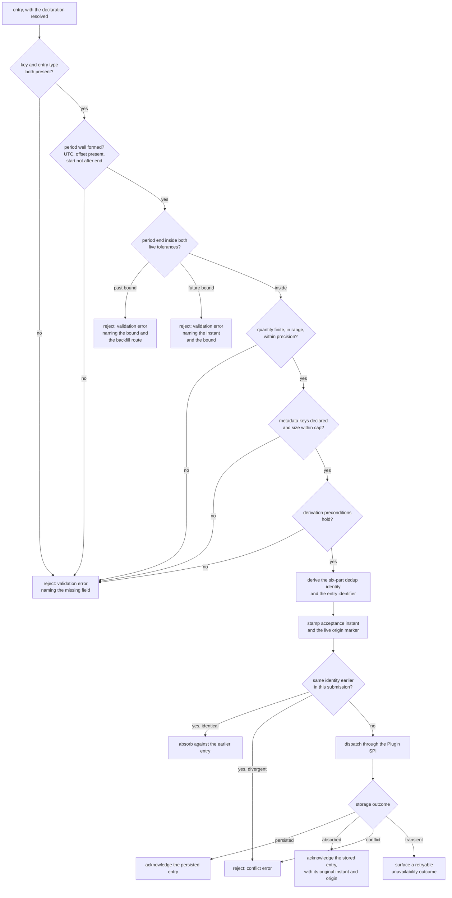

Created:  2026-09-25 by Virtuozzo International GmbH
Updated:  2026-09-25 by Virtuozzo International GmbH

# Feature: Usage Record Ingestion & Identity

- [ ] `p1` - **ID**: `cpt-cf-usage-collector-featstatus-usage-record-ingestion-implemented`

- [ ] `p1` - `cpt-cf-usage-collector-feature-usage-record-ingestion`

Accepts a **Usage Record** on the live ingestion path: validates its covered
period, its signed quantity and its per-type metadata, derives the
server-assigned identity every downstream surface references, and resolves a
repeated idempotency key into an absorbed retry or a fail-closed conflict.

<!-- toc -->

- [1. Feature Context](#1-feature-context)
  - [1.1 Overview](#11-overview)
  - [1.2 Purpose](#12-purpose)
  - [1.3 Actors](#13-actors)
  - [1.4 References](#14-references)
- [2. Actor Flows (CDSL)](#2-actor-flows-cdsl)
  - [Emit a Usage Record on the Live Path](#emit-a-usage-record-on-the-live-path)
  - [Retry a Submission After an Uncertain Outcome](#retry-a-submission-after-an-uncertain-outcome)
  - [Report a Decrease in Measured Consumption](#report-a-decrease-in-measured-consumption)
  - [Reproduce an Entry Identifier Offline](#reproduce-an-entry-identifier-offline)
- [3. Processes / Business Logic (CDSL)](#3-processes--business-logic-cdsl)
  - [Admit an Ingestion Submission](#admit-an-ingestion-submission)
  - [Validate an Entry Against Its Declaration](#validate-an-entry-against-its-declaration)
  - [Validate the Covered Period](#validate-the-covered-period)
  - [Validate the Quantity](#validate-the-quantity)
  - [Validate the Metadata Against the Closed Surface](#validate-the-metadata-against-the-closed-surface)
  - [Derive the Dedup Identity and the Entry Identifier](#derive-the-dedup-identity-and-the-entry-identifier)
  - [Stamp the Server-Assigned Fields](#stamp-the-server-assigned-fields)
  - [Resolve a Repeated Dedup Identity](#resolve-a-repeated-dedup-identity)
- [4. States (CDSL)](#4-states-cdsl)
  - [Dedup Identity State Machine](#dedup-identity-state-machine)
- [5. Definitions of Done](#5-definitions-of-done)
  - [Ingestion Gateway as the Single Write Choke Point](#ingestion-gateway-as-the-single-write-choke-point)
  - [Mandatory Client-Provided Idempotency Key](#mandatory-client-provided-idempotency-key)
  - [Six-Part Dedup Identity and Derived Entry Identifier](#six-part-dedup-identity-and-derived-entry-identifier)
  - [Split Same-Key Outcomes](#split-same-key-outcomes)
  - [Half-Open UTC Covered Period](#half-open-utc-covered-period)
  - [Two-Sided Live Time Bound](#two-sided-live-time-bound)
  - [Exact Signed Decimal Quantity](#exact-signed-decimal-quantity)
  - [Closed Per-Type Metadata Surface](#closed-per-type-metadata-surface)
  - [Server-Assigned Fields Stamped Once](#server-assigned-fields-stamped-once)
  - [Per-Entry Batch Outcome Model](#per-entry-batch-outcome-model)
  - [No Business Logic on the Write Path](#no-business-logic-on-the-write-path)
  - [Per-Entry Ingestion Telemetry](#per-entry-ingestion-telemetry)
- [6. Acceptance Criteria](#6-acceptance-criteria)

<!-- /toc -->

## 1. Feature Context

### 1.1 Overview

This feature is the ledger's write path. A usage source submits one or more
entries, and the Ingestion Gateway decides, per entry, whether the entry is
admitted, absorbed as a repeat, or rejected. Three things happen here and
nowhere else: structural validation of the caller-supplied measurement, the
derivation of the entry's identifier from its dedup identity, and the resolution
of a repeated dedup identity into an outcome the caller can act on.

The feature owns the ordinary **Usage Record** path — an entry whose entry type
is `record` — on the live route, `POST /usage-collector/v1/records` and its SDK
counterpart. It also owns the identity derivation itself, which is shared
machinery: `cpt-cf-usage-collector-feature-record-invalidation` reuses it to
find an invalidation's target, and
`cpt-cf-usage-collector-feature-backfill-retention` reuses the whole validation
chain with one bound replaced.

Everything the entry needs before validation is another feature's work. The PDP
decision and the attribution check belong to
`cpt-cf-usage-collector-feature-attribution-authorization`. Resolving the GTS
type reference to its declaration belongs to
`cpt-cf-usage-collector-feature-usage-type-resolution`. Writing the entry
belongs to `cpt-cf-usage-collector-feature-pluggable-storage`. This feature is
what sits between them.

The component that owns all of it is
`cpt-cf-usage-collector-component-ingestion-gateway`, the single synchronous
choke point every submission passes through.

### 1.2 Purpose

A metering ledger is only as trustworthy as its write path. Two failures matter
most, and both are silent: a retried submission counted twice, and a caller
reusing one key for two different measurements losing the second one without a
signal. Charging pipelines cannot detect either after the fact, because the
ledger looks consistent in both cases. Requiring a client-provided idempotency
key on every entry, and splitting the same-key outcome into a silent absorption
and a loud conflict, is what removes both failures at the emitter.

The identity derivation exists for a second reason. A correction must name
exactly one entry, and the attribution tuple cannot do it: several accepted
entries can share tenant, resource, subject and GTS type while differing only in
period and quantity. Deriving the identifier from the dedup identity — rather
than minting a random one — also lets an emitter compute an entry's identifier
before it submits, with no round-trip, and lets it compute the identifier of
that entry's withdrawal at the same time.

The validation rules exist so that a measurement is uninterpretable in no way a
consumer has to guard against. A quantity is a finite decimal inside a published
range, a covered period is a half-open UTC interval whose end falls inside the
live path's two-sided bound, and a metadata key is one the GTS type declares.
None of these is negotiable to protect ingestion availability.

**Requirements**: `cpt-cf-usage-collector-fr-ingestion`,
`cpt-cf-usage-collector-fr-idempotency`,
`cpt-cf-usage-collector-fr-record-identity`,
`cpt-cf-usage-collector-fr-record-metadata`,
`cpt-cf-usage-collector-fr-usage-windows`,
`cpt-cf-usage-collector-fr-live-future-time-bound`,
`cpt-cf-usage-collector-fr-record-quantity`,
`cpt-cf-usage-collector-fr-canonical-units`,
`cpt-cf-usage-collector-fr-quantity-semantics`

**Principles**: `cpt-cf-usage-collector-principle-idempotency-by-key`,
`cpt-cf-usage-collector-principle-canonical-errors`

**Constraints**: `cpt-cf-usage-collector-constraint-no-business-logic`

**Component**: `cpt-cf-usage-collector-component-ingestion-gateway`

**Sequences**: `cpt-cf-usage-collector-seq-emit-usage`. DESIGN owns that
sequence and states the call order across the gateway, the PDP, the Type
Resolver and the Plugin Host. This feature defines the behavior of the steps
that belong to it, and restates no part of the sequence.

**Use cases**: `cpt-cf-usage-collector-usecase-emit`,
`cpt-cf-usage-collector-usecase-report-decrease`

**API**:

- REST: `POST /usage-collector/v1/records`, operation
  `usage_collector.create_usage_records`. Batch only — REST has no single-entry
  ingestion route.
- SDK: `cpt-cf-usage-collector-interface-sdk-client`, the in-process
  single-entry and batch submission methods.
- The backfill route, `POST /usage-collector/v1/records/backfill`, is the same
  contract under workload isolation and belongs to
  `cpt-cf-usage-collector-feature-backfill-retention`.

**ADRs**: `cpt-cf-usage-collector-adr-mandatory-idempotency`,
`cpt-cf-usage-collector-adr-record-identity-derivation`,
`cpt-cf-usage-collector-adr-quantity-precision`,
`cpt-cf-usage-collector-adr-window-end-selection`

**Entities**: `UsageRecord`, `CreateUsageRecord`, `EntryType`, `RecordOrigin`,
`IdempotencyKey`, `RecordMetadata`

**Data**: none. The gear declares no `db` or `dbtable` component identifier for
this feature. The entry ledger is wholly plugin-owned and reached only through
the Plugin SPI, so nothing on this path writes gear-owned schema.

### 1.3 Actors

| Actor | Role in Feature |
|-------|-----------------|
| `cpt-cf-usage-collector-actor-usage-source` | Submits entries, supplies the idempotency key, and repeats that key exactly on a retry. Reads the per-entry acknowledgement to learn which of its entries were accepted. |
| `cpt-cf-usage-collector-actor-platform-developer` | Integrates a calling gear against the SDK trait or the REST route, chooses the key construction, and reproduces an entry identifier offline. |
| `cpt-cf-usage-collector-actor-storage-backend` | Persists each dispatched entry, enforces the dedup identity at its declared level, and round-trips quantity and server-assigned fields without alteration. |
| `cpt-cf-usage-collector-actor-platform-operator` | Sets the two live time tolerances, the per-request entry cap and the metadata size cap, and watches the per-entry ingestion counters. |

### 1.4 References

- **PRD**: [PRD.md](../PRD.md) — §5.1 ingestion, idempotency and per-record
  metadata; §5.9 usage windows, record identity, live-path time bounds,
  canonical units, quantity and quantity semantics; §7.3 the emit use case.
- **Design**: [DESIGN.md](../DESIGN.md) — §2.1 idempotency-by-key and the
  canonical error envelope; §2.2 no business logic in collector; §3.1 the entity
  table, field ownership, and the invariants from Dedup identity through
  Idempotency horizon; §3.2 the Ingestion Gateway; §3.3 the SDK trait, the
  endpoints overview, and the error contract; §3.6 the emit-usage sequence;
  §3.8 the ingestion configuration values; §3.10 the consistency floor; §3.11
  the per-entry ingestion instruments.
- **ADRs**:
  [0004](../ADR/0004-cpt-cf-usage-collector-adr-mandatory-idempotency.md),
  [0007](../ADR/0007-cpt-cf-usage-collector-adr-record-identity-derivation.md),
  [0013](../ADR/0013-cpt-cf-usage-collector-adr-quantity-precision.md),
  [0014](../ADR/0014-cpt-cf-usage-collector-adr-window-end-selection.md)
- **Dependencies**: `cpt-cf-usage-collector-feature-attribution-authorization`,
  `cpt-cf-usage-collector-feature-usage-type-resolution`, and
  `cpt-cf-usage-collector-feature-pluggable-storage`. This feature is in turn
  consumed by `cpt-cf-usage-collector-feature-record-invalidation`,
  `cpt-cf-usage-collector-feature-usage-query`,
  `cpt-cf-usage-collector-feature-usage-feed`,
  `cpt-cf-usage-collector-feature-backfill-retention`,
  `cpt-cf-usage-collector-feature-rate-limiting-reconciliation`,
  `cpt-cf-usage-collector-feature-throughput-latency-availability` and
  `cpt-cf-usage-collector-feature-operational-visibility`.

## 2. Actor Flows (CDSL)

Every flow below enters through the live ingestion route. The authorization
steps and the type-resolution step appear as single steps, because the features
that own them define their behavior.

### Emit a Usage Record on the Live Path

- [ ] `p1` - **ID**: `cpt-cf-usage-collector-flow-emit-usage-record`

**Actor**: `cpt-cf-usage-collector-actor-usage-source`

**Success Scenarios**:
- A single well-formed entry is validated, given a derived identifier, stamped
  with an acceptance instant and a live origin, persisted, and returned to the
  caller as the persisted entry.
- A batch of entries is decided per entry, and the acknowledgements come back in
  the same order the entries were submitted.
- A batch in which some entries are rejected still accepts the rest, and each
  rejection names its own cause.

**Error Scenarios**:
- The submission carries no entries, or more than the configured per-request
  cap. It is rejected whole, before any entry is validated.
- An entry carries no idempotency key, or no entry type. It is rejected with a
  validation error naming the missing field.
- An entry's covered period ends further ahead than the future tolerance, or
  further back than the past tolerance. The rejection names the offending
  instant and the bound, and the past-bound rejection names the backfill route.
- An entry's quantity is absent, non-numeric, non-finite, or outside the
  published range or precision. It is rejected with a validation error.
- An entry carries a metadata key the GTS type does not declare, or metadata
  larger than the configured cap. It is rejected with a validation error.
- The entry repeats a dedup identity that has already converged on a divergent
  entry. It is rejected with a conflict error naming the stored entry.

**Steps**:
1. [ ] - `p1` - Usage source submits one entry, or a batch of them, on the live ingestion route - `inst-emit-submit`
2. [ ] - `p1` - Gateway runs `cpt-cf-usage-collector-algo-ingestion-request-admission` over the submission as a whole - `inst-emit-admission`
3. [ ] - `p1` - **IF** the submission is empty, over the entry cap, or over the caller's ingestion allowance - `inst-emit-request-reject`
   1. [ ] - `p1` - **RETURN** a request-wide rejection, with no entry validated and none persisted - `inst-emit-request-return`
4. [ ] - `p1` - Gateway authorizes the attribution tuple through `cpt-cf-usage-collector-flow-authorize-ingestion` - `inst-emit-authorize`
5. [ ] - `p1` - Gateway resolves the GTS type reference through `cpt-cf-usage-collector-algo-resolve-declaration` - `inst-emit-resolve`
6. [ ] - `p1` - **FOR EACH** entry of the submission, in input order - `inst-emit-foreach`
   1. [ ] - `p1` - Run `cpt-cf-usage-collector-algo-entry-structural-validation` over the entry against the resolved declaration - `inst-emit-validate`
   2. [ ] - `p1` - **IF** validation rejects the entry - `inst-emit-invalid`
      1. [ ] - `p1` - Record a per-entry validation outcome naming the offending field, and continue with the next entry - `inst-emit-invalid-outcome`
   3. [ ] - `p1` - Run `cpt-cf-usage-collector-algo-entry-identity-derivation` to obtain the dedup identity and the derived identifier - `inst-emit-derive`
   4. [ ] - `p1` - Run `cpt-cf-usage-collector-algo-server-field-stamping` to stamp the acceptance instant and the live origin marker - `inst-emit-stamp`
   5. [ ] - `p1` - Run `cpt-cf-usage-collector-algo-idempotency-outcome` against entries earlier in the same submission - `inst-emit-intra-batch`
   6. [ ] - `p1` - Dispatch the entry through `cpt-cf-usage-collector-algo-plugin-dispatch` - `inst-emit-dispatch`
   7. [ ] - `p1` - Map the storage outcome to a per-entry acknowledgement through `cpt-cf-usage-collector-algo-idempotency-outcome` - `inst-emit-outcome`
7. [ ] - `p1` - **RETURN** the per-entry acknowledgements in input order, each carrying either the persisted entry or its own error - `inst-emit-return`

### Retry a Submission After an Uncertain Outcome

- [ ] `p1` - **ID**: `cpt-cf-usage-collector-flow-retry-ingestion-submission`

**Actor**: `cpt-cf-usage-collector-actor-usage-source`

**Success Scenarios**:
- The first submission was persisted but its response was lost. The retry
  repeats every field, is absorbed, and returns the stored entry with the
  original acceptance instant and the original origin marker.
- The first submission never reached storage. The retry is a first write, and
  the caller cannot tell the two cases apart from the response shape, which is
  the intent.
- The retry lands on a plugin that declares a `linearizable` dedup level, so the
  decision is made as the write commits.

**Error Scenarios**:
- The retry changes one field — a corrected quantity, an added metadata key, a
  different resource. It is rejected with a conflict error naming the stored
  entry, and the changed content is never silently dropped.
- The retry is issued under a fresh idempotency key. It is a new entry rather
  than a duplicate, and the ledger now holds two measurements.
- The retry reaches a plugin declaring an `eventual` dedup level before the
  identity has converged. It can be acknowledged and then discarded, and a later
  retry of the discarded divergent content draws the conflict error.

**Steps**:
1. [ ] - `p1` - Usage source receives no response, or a retryable error, for a submission it has already sent - `inst-retry-uncertain`
2. [ ] - `p1` - Usage source resubmits the identical entry, repeating the idempotency key and the covered period exactly - `inst-retry-resubmit`
3. [ ] - `p1` - Gateway derives the same dedup identity and the same identifier, because every derivation input is unchanged - `inst-retry-derive`
4. [ ] - `p1` - Storage plugin compares the entry against the converged entry under that identity, where one exists - `inst-retry-compare`
5. [ ] - `p1` - **IF** every caller-supplied field matches - `inst-retry-equal`
   1. [ ] - `p1` - **RETURN** the stored entry as an acceptance, carrying its original acceptance instant and origin marker, with no second entry created - `inst-retry-absorb`
6. [ ] - `p1` - **ELSE** - `inst-retry-diverge`
   1. [ ] - `p1` - **RETURN** a conflict error naming the stored entry's identifier, with the submitted content not persisted - `inst-retry-conflict`
7. [ ] - `p1` - **IF** no entry exists under the identity yet - `inst-retry-fresh`
   1. [ ] - `p1` - Treat the submission as a first write and follow `cpt-cf-usage-collector-flow-emit-usage-record` from its dispatch step - `inst-retry-first-write`

### Report a Decrease in Measured Consumption

- [ ] `p1` - **ID**: `cpt-cf-usage-collector-flow-emit-negative-measurement`

**Actor**: `cpt-cf-usage-collector-actor-platform-developer`

**Success Scenarios**:
- A genuine decrease is submitted as an ordinary entry whose quantity is
  negative, under a fresh idempotency key, carrying no reason code, and is
  accepted on exactly the terms a positive measurement is.
- A meter declaring the `COUNT` fold accepts an entry with any quantity value,
  because the ingestion path never reads the declared fold.

**Error Scenarios**:
- The submission carries a reason code while declaring the `record` entry type.
  It is rejected, because a reason code accompanies an invalidation alone.
- The negative quantity falls outside the published range or precision. It is
  rejected exactly as an out-of-range positive quantity is.
- The caller intends to withdraw a measurement rather than record a decrease.
  That is an invalidation entry, owned by
  `cpt-cf-usage-collector-feature-record-invalidation`, and the two cases stay
  distinguishable by the declared entry type.

**Steps**:
1. [ ] - `p1` - Platform developer submits an entry with entry type `record` and a negative quantity - `inst-decrease-submit`
2. [ ] - `p1` - Gateway validates the quantity against the published range and precision, applying no rule to its sign - `inst-decrease-validate`
3. [ ] - `p1` - Gateway rejects the entry when a reason code is present, since that field belongs to the invalidation entry type alone - `inst-decrease-reason`
4. [ ] - `p1` - Gateway derives identity and stamps the server-assigned fields exactly as for a positive measurement - `inst-decrease-derive`
5. [ ] - `p1` - Gateway dispatches the entry without consulting the declared aggregation fold at any point - `inst-decrease-dispatch`
6. [ ] - `p1` - **RETURN** the persisted entry, whose quantity is read back digit for digit including its sign - `inst-decrease-return`

### Reproduce an Entry Identifier Offline

- [ ] `p1` - **ID**: `cpt-cf-usage-collector-flow-reproduce-identity-offline`

**Actor**: `cpt-cf-usage-collector-actor-platform-developer`

**Success Scenarios**:
- The emitter computes an entry's identifier from its own fields, before it
  submits, and the identifier the gear returns equals the computed one.
- The emitter computes, from the same fields, the identifier the entry's future
  withdrawal will carry, without reading either entry back.
- Two emitters computing the identifier for one submission agree, because the
  canonical form of every input is fixed.

**Error Scenarios**:
- The idempotency key or the GTS type reference carries an ASCII control
  character. The submission is rejected, because the derivation joins its inputs
  with a control-character separator.
- A covered-period bound carries a precision finer than one microsecond. The
  submission is rejected rather than truncated, since a truncated bound would
  re-derive a different identifier on read-back.
- The emitter recomputes its period bounds on retry instead of repeating them.
  It derives a different identifier and creates a second entry, which is an
  emitter obligation rather than a gear behavior.

**Steps**:
1. [ ] - `p1` - Platform developer assembles the six derivation inputs from the entry it is about to send - `inst-offline-assemble`
2. [ ] - `p1` - Platform developer renders each input in its canonical form, as `cpt-cf-usage-collector-adr-record-identity-derivation` fixes it - `inst-offline-canonical`
3. [ ] - `p1` - Platform developer computes the identifier with the fixed namespace constant and the fixed input order - `inst-offline-compute`
4. [ ] - `p1` - Platform developer submits the entry through `cpt-cf-usage-collector-flow-emit-usage-record` - `inst-offline-submit`
5. [ ] - `p1` - **IF** the returned identifier differs from the computed one - `inst-offline-mismatch`
   1. [ ] - `p1` - The gear has broken the derivation contract, and the difference is a defect rather than a caller error - `inst-offline-defect`
6. [ ] - `p1` - Platform developer repeats the same derivation with the entry type set to the invalidation literal, obtaining the identifier a future withdrawal will carry - `inst-offline-pair`
7. [ ] - `p1` - **RETURN** both identifiers, usable as reference keys with no read of the ledger - `inst-offline-return`

## 3. Processes / Business Logic (CDSL)

The gateway's per-entry work has a fixed order, and the order is load-bearing in
three places. Validation runs before derivation, because two derivation inputs
have preconditions validation enforces. Derivation runs before dispatch, because
the plugin deduplicates on an identity the gateway computed. Stamping runs
before dispatch, because the plugin persists the stamped values rather than
producing its own.

The diagram below states the whole per-entry path, from the point where the
resolved declaration is in hand to the point where an acknowledgement is
produced.

### Admit an Ingestion Submission

- [ ] `p1` - **ID**: `cpt-cf-usage-collector-algo-ingestion-request-admission`

**Input**: one submission — a batch of ingestion shapes on the REST route, one
or a batch on the SDK trait — and the caller's security context.

**Output**: either a request-wide rejection, or a submission admitted to
per-entry processing.

**Steps**:
1. [ ] - `p1` - Reject an empty submission whole, before any entry is read - `inst-admit-empty`
2. [ ] - `p1` - Reject a submission carrying more entries than the configured per-request cap, naming the cap in the error - `inst-admit-cap`
3. [ ] - `p1` - Apply the cap on both ingestion routes, so a caller cannot widen it by choosing the backfill route - `inst-admit-cap-both`
4. [ ] - `p1` - Charge the caller's ingestion allowance after the cap and before the authorization call. That charge belongs to `cpt-cf-usage-collector-feature-rate-limiting-reconciliation` - `inst-admit-quota`
5. [ ] - `p1` - **IF** the allowance is exhausted - `inst-admit-throttled`
   1. [ ] - `p1` - **RETURN** a request-wide throttle outcome carrying a retry delay, with no entry of the submission accepted - `inst-admit-throttle-return`
6. [ ] - `p1` - Run authorization once per distinct attribution tuple, through `cpt-cf-usage-collector-algo-pdp-scope-evaluation` - `inst-admit-authorize`
7. [ ] - `p1` - Resolve each distinct GTS type reference once, through `cpt-cf-usage-collector-algo-resolve-declaration` - `inst-admit-resolve`
8. [ ] - `p1` - Stamp the origin marker from the route the submission arrived on, never from the age of any period it carries - `inst-admit-origin`
9. [ ] - `p1` - **RETURN** the admitted submission, with per-entry processing to follow in input order - `inst-admit-return`

### Validate an Entry Against Its Declaration

- [ ] `p1` - **ID**: `cpt-cf-usage-collector-algo-entry-structural-validation`

**Input**: one ingestion shape and the resolved declaration of its GTS type.

**Output**: an accept verdict, or a rejection naming the offending field and its
reason.

**Steps**:
1. [ ] - `p1` - Require an idempotency key. A missing key is a rejection, never a server-generated substitute - `inst-validate-key`
2. [ ] - `p1` - Require an entry type. It has no default, and it is never inferred from another field or from the sign of the quantity - `inst-validate-entry-type`
3. [ ] - `p1` - Require a reason code when the entry type is the invalidation one, and reject a reason code on an ordinary entry - `inst-validate-reason`
4. [ ] - `p1` - Run `cpt-cf-usage-collector-algo-covered-period-validation` over the period bounds - `inst-validate-period`
5. [ ] - `p1` - Run `cpt-cf-usage-collector-algo-quantity-validation` over the quantity - `inst-validate-quantity`
6. [ ] - `p1` - Run `cpt-cf-usage-collector-algo-metadata-validation` over the metadata against the declaration's closed surface - `inst-validate-metadata`
7. [ ] - `p1` - Reject an entry whose idempotency key or GTS type reference contains an ASCII control character, before any derivation runs - `inst-validate-control-chars`
8. [ ] - `p1` - Consult the declared aggregation fold nowhere. No outcome of this algorithm depends on it - `inst-validate-no-fold`
9. [ ] - `p1` - Report every rejection through the canonical error envelope, in the validation category, with a typed reason on the field violation - `inst-validate-envelope`
10. [ ] - `p1` - **RETURN** the verdict, together with the field and reason on a rejection - `inst-validate-return`

### Validate the Covered Period

- [ ] `p1` - **ID**: `cpt-cf-usage-collector-algo-covered-period-validation`

**Input**: the entry's period start and period end, the current instant, and the
two configured live tolerances.

**Output**: a normalized half-open UTC period, or a rejection naming the
offending instant and the bound it broke.

**Steps**:
1. [ ] - `p1` - Require exactly one emitter-supplied time attribution, the covered period. Reject any second one - `inst-period-single`
2. [ ] - `p1` - Reject a timestamp carrying no offset information, since its instant is undetermined - `inst-period-offset`
3. [ ] - `p1` - Normalize a non-UTC offset to UTC before any further check - `inst-period-normalize`
4. [ ] - `p1` - Treat the period as half-open: the start is inclusive and the end is exclusive - `inst-period-half-open`
5. [ ] - `p1` - Require that the start is not later than the end. Equal bounds mark a point event and are valid - `inst-period-order`
6. [ ] - `p1` - Reject a bound whose precision is finer than one microsecond, and truncate no such value - `inst-period-precision`
7. [ ] - `p1` - Reject a second value of sixty, so no leap second enters the derivation - `inst-period-leap`
8. [ ] - `p1` - **IF** the period end is further ahead of the current instant than the configured future tolerance - `inst-period-future`
   1. [ ] - `p1` - **RETURN** a rejection naming the offending instant and the future bound - `inst-period-future-reject`
9. [ ] - `p1` - **IF** the period end is further behind the current instant than the configured past tolerance - `inst-period-past`
   1. [ ] - `p1` - **RETURN** a rejection naming the offending instant, the past bound, and the backfill route as the path such a submission belongs on - `inst-period-past-reject`
10. [ ] - `p1` - Read the period end for both bounds and read the period start for neither, since no read path selects on the start - `inst-period-end-only`
11. [ ] - `p1` - Admit a period of any length whose end falls inside the past tolerance, so a month-long accrual emitted at its close is live data - `inst-period-any-length`
12. [ ] - `p1` - **RETURN** the normalized period - `inst-period-return`

### Validate the Quantity

- [ ] `p1` - **ID**: `cpt-cf-usage-collector-algo-quantity-validation`

**Input**: the entry's quantity as submitted, and the published range and
precision of the ingestion contract.

**Output**: an accepted quantity, carried forward unaltered, or a rejection.

**Steps**:
1. [ ] - `p1` - Require exactly one quantity on every entry, of either entry type - `inst-quantity-present`
2. [ ] - `p1` - Reject an absent, non-numeric or non-finite value, so no such value can propagate into a later fold - `inst-quantity-finite`
3. [ ] - `p1` - Reject a value outside the published range or beyond the published decimal precision, naming both in the error - `inst-quantity-range`
4. [ ] - `p1` - Enforce the published significant-digit bound at ingestion, because the wire pattern bounds the integer and fraction parts separately and cannot express it - `inst-quantity-significant`
5. [ ] - `p1` - Apply no rule to the sign. A negative measurement is an ordinary entry, and the negative half of the range is admissible in full - `inst-quantity-sign`
6. [ ] - `p1` - Convert, scale, round and truncate the value nowhere between acceptance and read - `inst-quantity-no-alter`
7. [ ] - `p1` - Carry the quantity in the canonical metering unit the GTS type binds, and accept no per-entry unit - `inst-quantity-unit`
8. [ ] - `p1` - Interpret the quantity against its period nowhere: the relation is the declared fold's, and the write path never reads it - `inst-quantity-no-semantics`
9. [ ] - `p1` - Integrate, differentiate, interpolate, re-window and synthesize nothing, and act on a declared nominal sampling interval nowhere - `inst-quantity-no-integration`
10. [ ] - `p1` - **RETURN** the quantity exactly as submitted - `inst-quantity-return`

### Validate the Metadata Against the Closed Surface

- [ ] `p1` - **ID**: `cpt-cf-usage-collector-algo-metadata-validation`

**Input**: the entry's metadata map, the declaration's metadata surface, and the
configured per-entry size cap.

**Output**: an accepted metadata map, or a rejection naming the offending key or
the cap.

**Steps**:
1. [ ] - `p1` - Recompute the admissible key set per request from the resolved declaration, so a freshly declared property is usable on the next request - `inst-metadata-recompute`
2. [ ] - `p1` - **FOR EACH** key present on the entry - `inst-metadata-foreach`
   1. [ ] - `p1` - **IF** the declaration does not declare the key - `inst-metadata-undeclared`
      1. [ ] - `p1` - **RETURN** a rejection naming the key. There is no free-form remainder and no open-extras escape hatch - `inst-metadata-reject-key`
3. [ ] - `p1` - Treat every value as a string in this contract version, whatever richer typing the declaration is capable of expressing - `inst-metadata-string-values`
4. [ ] - `p1` - Measure the serialized metadata against the configured size cap, and reject an entry above it with an actionable error - `inst-metadata-size`
5. [ ] - `p1` - Apply the size cap alongside the declared-shape check rather than instead of it - `inst-metadata-both-checks`
6. [ ] - `p1` - Interpret no value. The gateway checks admissibility and size, and reads no meaning from the content - `inst-metadata-no-interpretation`
7. [ ] - `p1` - Preserve no undeclared key silently, and drop none without an error - `inst-metadata-no-silent-drop`
8. [ ] - `p1` - **RETURN** the accepted metadata map - `inst-metadata-return`

### Derive the Dedup Identity and the Entry Identifier

- [ ] `p1` - **ID**: `cpt-cf-usage-collector-algo-entry-identity-derivation`

**Input**: a validated entry — its tenant, GTS type reference, idempotency key,
normalized period bounds and entry type.

**Output**: the six-part dedup identity and the derived entry identifier.

This algorithm is shared machinery. `cpt-cf-usage-collector-feature-record-invalidation`
runs the same function over an invalidation's own fields, with the entry type
set to the record literal, to obtain the identifier of the entry being withdrawn.

**Steps**:
1. [ ] - `p1` - Form the dedup identity from six values: the tenant, the GTS type reference, the idempotency key, the period start, the period end, and the entry type - `inst-identity-six`
2. [ ] - `p1` - Include neither the resource nor the subject in the identity. Both are compared on a collision, and neither is a component of it - `inst-identity-exclusions`
3. [ ] - `p1` - Render each input in the canonical form `cpt-cf-usage-collector-adr-record-identity-derivation` fixes, applying no case folding, no Unicode normalization, no trimming and no escaping - `inst-identity-canonical`
4. [ ] - `p1` - Render each period bound in the fixed-width microsecond form, so equivalent spellings of one instant reach one pre-image - `inst-identity-timestamps`
5. [ ] - `p1` - Render the entry type as its lowercase wire literal - `inst-identity-entry-type`
6. [ ] - `p1` - Join the six values in that order with the ASCII unit separator, which the control-character precondition keeps out of every input - `inst-identity-join`
7. [ ] - `p1` - Derive the identifier as the version-5 UUID of that pre-image under the fixed namespace constant, which admits no rotation and no per-deployment value - `inst-identity-uuid`
8. [ ] - `p1` - Derive the identifier at this one choke point for every surface, live and backfill, single and batched - `inst-identity-choke-point`
9. [ ] - `p1` - Accept no client-supplied identifier on any surface, and handle no derivation collision at run time - `inst-identity-server-only`
10. [ ] - `p1` - Include the identifier of a withdrawn entry nowhere in the derivation, since it adds nothing the six inputs do not already fix - `inst-identity-no-target`
11. [ ] - `p1` - **RETURN** the dedup identity and the derived identifier - `inst-identity-return`

### Stamp the Server-Assigned Fields

- [ ] `p1` - **ID**: `cpt-cf-usage-collector-algo-server-field-stamping`

**Input**: a validated entry carrying its derived identifier, and the route it
arrived on.

**Output**: the entry as it will be handed to the storage plugin.

**Steps**:
1. [ ] - `p1` - Stamp the derived identifier. It is a server-assigned field and never a caller-supplied one - `inst-stamp-id`
2. [ ] - `p1` - Stamp a UTC acceptance instant recording when the gear accepted the entry - `inst-stamp-accepted-at`
3. [ ] - `p1` - Reject any caller attempt to set or override the acceptance instant, since late arrival is measured against it - `inst-stamp-no-override`
4. [ ] - `p1` - Stamp the origin marker from the route, setting the live value on this feature's route - `inst-stamp-origin`
5. [ ] - `p1` - Stamp every server-assigned field once, at this single choke point, and never again on any later path - `inst-stamp-once`
6. [ ] - `p1` - Copy no declared attribute onto the entry — not the fold, not the unit, not the metadata schema, not the retention - `inst-stamp-no-denorm`
7. [ ] - `p1` - Require the storage plugin to persist the stamped values as handed to it, re-deriving, defaulting and refreshing none of them - `inst-stamp-plugin-fidelity`
8. [ ] - `p1` - Keep the stored acceptance instant and origin marker on an absorbed repeat, whichever route the repeat arrived on - `inst-stamp-absorbed-keeps`
9. [ ] - `p1` - **RETURN** the stamped entry - `inst-stamp-return`

### Resolve a Repeated Dedup Identity

- [ ] `p1` - **ID**: `cpt-cf-usage-collector-algo-idempotency-outcome`

**Input**: a stamped entry, the entries earlier in the same submission, and the
storage plugin's outcome for the dispatched entry.

**Output**: one per-entry acknowledgement — an acceptance carrying a persisted
entry, or a typed error.

**Steps**:
1. [ ] - `p1` - Compare the entry against any earlier entry of the same submission sharing its full dedup identity, deciding the later against the earlier - `inst-dedup-intra-batch`
2. [ ] - `p1` - **IF** an earlier entry shares the identity and every caller-supplied field matches - `inst-dedup-intra-equal`
   1. [ ] - `p1` - Absorb the later entry, dispatch it nowhere, and acknowledge it against the earlier one - `inst-dedup-intra-absorb`
3. [ ] - `p1` - **IF** an earlier entry shares the identity and any caller-supplied field differs - `inst-dedup-intra-diverge`
   1. [ ] - `p1` - **RETURN** a conflict error for the later entry, leaving the earlier one's outcome untouched - `inst-dedup-intra-conflict`
4. [ ] - `p1` - Dispatch the entry and read the plugin's outcome, since the plugin enforces the identity and the gear keeps no dedup table - `inst-dedup-dispatch`
5. [ ] - `p1` - **IF** the plugin absorbed the entry against a converged stored entry - `inst-dedup-absorbed`
   1. [ ] - `p1` - **RETURN** an acceptance carrying the stored entry, so a caller telling a replay from a first write reads the returned acceptance instant - `inst-dedup-absorbed-return`
6. [ ] - `p1` - **IF** the plugin reported a conflict - `inst-dedup-conflict`
   1. [ ] - `p1` - **RETURN** a conflict error naming the stored entry's identifier, in the canonical conflict category, with the submitted content not persisted - `inst-dedup-conflict-return`
7. [ ] - `p1` - Treat a metadata-only difference as a conflict, exactly as a differing quantity, resource or subject is - `inst-dedup-metadata-diff`
8. [ ] - `p1` - Compare the entry type nowhere on a collision, since it is a component of the identity rather than a compared field - `inst-dedup-no-entry-type-compare`
9. [ ] - `p1` - Let the plugin's declared dedup level decide a race before the identity converges, and claim no gear-side ordering of concurrent submissions - `inst-dedup-level`
10. [ ] - `p1` - Surface a plugin transient failure as a retryable unavailability outcome carrying a delay, rather than as any dedup outcome - `inst-dedup-transient`
11. [ ] - `p1` - Emit one per-entry counter observation, labelled with the outcome, the entry type and the origin - `inst-dedup-count`
12. [ ] - `p1` - **RETURN** the acknowledgement, aligned to the entry's position in the submission - `inst-dedup-return`

## 4. States (CDSL)

### Dedup Identity State Machine

- [ ] `p2` - **ID**: `cpt-cf-usage-collector-state-dedup-identity`

An accepted entry has no lifecycle: the ledger is append-only, there is no
status field, and no surface rewrites a stored entry. A **dedup identity** does
have one, and it is load-bearing. The outcome of a repeated submission depends
on which state the identity is in, and two downstream features read that state
directly — `cpt-cf-usage-collector-feature-record-invalidation` looks its target
up converged-only, and
`cpt-cf-usage-collector-feature-consistency-freshness-contract` publishes the
bound on how long the unsettled state can last.

The states below describe one identity in one deployment, not one submission.

**States**: `Unused`, `Acknowledged`, `Converged`, `Released`

**Initial State**: `Unused`

**Transitions**:
1. [ ] - `p1` - **FROM** `Unused` **TO** `Acknowledged` **WHEN** the plugin accepts a first submission under the identity but cannot yet rule out an earlier one in commit order - `inst-state-first-write`
2. [ ] - `p1` - **FROM** `Unused` **TO** `Converged` **WHEN** the plugin declares a `linearizable` dedup level, so its convergence bound is zero and the write is decided as it commits - `inst-state-linearizable`
3. [ ] - `p1` - **FROM** `Acknowledged` **TO** `Converged` **WHEN** no earlier write can still become visible, the survivor is visible to every dedup check, and no persist call that missed it is still to return - `inst-state-converge`
4. [ ] - `p1` - **FROM** `Acknowledged` **TO** `Acknowledged` **WHEN** a further submission is acknowledged before convergence, which the plugin may later discard - `inst-state-racing`
5. [ ] - `p1` - **FROM** `Converged` **TO** `Converged` **WHEN** an identical submission arrives and is absorbed against the survivor - `inst-state-absorb`
6. [ ] - `p1` - **FROM** `Converged` **TO** `Converged` **WHEN** a divergent submission arrives and is rejected with the conflict error, displacing nothing - `inst-state-conflict`
7. [ ] - `p1` - **FROM** `Converged` **TO** `Released` **WHEN** plugin retention frees the identity, never earlier than the declared retention of its GTS type measured from the period end - `inst-state-retention`
8. [ ] - `p1` - **FROM** `Released` **TO** `Unused` **WHEN** the identity is free again, which no admissible submission can reach, because the window bound refuses an over-aged period first - `inst-state-unreachable`

The last transition is stated so that the machine is closed, not because an
emitter can drive it. The retention floor keeps the backfill window strictly
inside retention, so a submission old enough to have outlived its counterpart is
refused on the period bound before deduplication is consulted.

## 5. Definitions of Done

### Ingestion Gateway as the Single Write Choke Point

- [ ] `p1` - **ID**: `cpt-cf-usage-collector-dod-ingestion-choke-point`

The system **MUST** route every submission — REST or SDK, live or backfill,
single or batched, record or invalidation — through one Ingestion Gateway
component. That component **MUST** be the only place that validates an entry,
derives its identity and stamps its server-assigned fields. It **MUST NOT**
persist directly, and **MUST NOT** keep a parallel local write path. It **MUST**
fail closed on any dependency unavailability, accepting nothing it could not
fully validate.

**Implements**:
- `cpt-cf-usage-collector-flow-emit-usage-record`
- `cpt-cf-usage-collector-algo-ingestion-request-admission`

**Constraints**: `cpt-cf-usage-collector-constraint-no-business-logic`

**Touches**:
- API: `POST /usage-collector/v1/records`
- Component: `cpt-cf-usage-collector-component-ingestion-gateway`
- Entities: `CreateUsageRecord`, `UsageRecord`

### Mandatory Client-Provided Idempotency Key

- [ ] `p1` - **ID**: `cpt-cf-usage-collector-dod-mandatory-idempotency-key`

The system **MUST** require a client-provided idempotency key on every entry,
and **MUST** reject a keyless entry with an actionable validation error naming
the field. It **MUST NOT** generate, default or substitute a key. It **MUST**
reserve no key prefix, so every key a caller may construct stays available for
either entry type. The published contract **MUST** state the caller's
obligation: the key distinguishes what the dedup identity omits — resource,
subject, and a second entry covering one period — and a retry repeats it
exactly.

**Implements**:
- `cpt-cf-usage-collector-algo-entry-structural-validation`
- `cpt-cf-usage-collector-flow-retry-ingestion-submission`

**Constraints**: `cpt-cf-usage-collector-constraint-no-business-logic`

**Touches**:
- API: `POST /usage-collector/v1/records`
- Entities: `IdempotencyKey`

### Six-Part Dedup Identity and Derived Entry Identifier

- [ ] `p1` - **ID**: `cpt-cf-usage-collector-dod-dedup-identity-derivation`

The system **MUST** form each entry's dedup identity from exactly six values:
tenant, GTS type reference, idempotency key, period start, period end, and entry
type. It **MUST** derive the entry identifier as a version-5 UUID over those six
values in that order, under a fixed namespace constant, with each value in its
fixed canonical form. The derivation **MUST** be reproducible offline by an
emitter from the entry's own fields, with no round-trip. The system **MUST**
reject a submission whose idempotency key or GTS type reference carries an ASCII
control character, and one whose period bound carries a precision finer than one
microsecond, in both cases before the derivation runs and without truncating any
value. The identifier **MUST NOT** be client-supplied on any surface, and the
identifier of a withdrawn entry **MUST NOT** be an input.

**Implements**:
- `cpt-cf-usage-collector-algo-entry-identity-derivation`
- `cpt-cf-usage-collector-flow-reproduce-identity-offline`

**Constraints**: `cpt-cf-usage-collector-constraint-no-business-logic`

**Touches**:
- API: `POST /usage-collector/v1/records`, and the point-lookup route that
  resolves against the derived identifier
- Component: `cpt-cf-usage-collector-component-ingestion-gateway`
- Entities: `EntryType`, `IdempotencyKey`

### Split Same-Key Outcomes

- [ ] `p1` - **ID**: `cpt-cf-usage-collector-dod-idempotency-outcomes`

The system **MUST** absorb a submission that matches a converged entry on the
dedup identity and on every caller-supplied field, returning the stored entry as
an acceptance with no duplicate created and no error. It **MUST** reject a
submission matching on the identity but differing in any caller-supplied field —
a metadata-only difference included — with a conflict error naming the stored
entry, and **MUST NOT** silently drop that second write. Two entries sharing one
identity inside one submission **MUST** resolve the same way, the later against
the earlier. The system **MUST NOT** expose a separate duplicate outcome on any
surface, so a caller distinguishes a replay by the returned acceptance instant.
Deduplication **MUST** be enforced by the storage plugin at its declared dedup
level, and the gear **MUST NOT** keep a dedup table of its own.

**Implements**:
- `cpt-cf-usage-collector-algo-idempotency-outcome`
- `cpt-cf-usage-collector-state-dedup-identity`
- `cpt-cf-usage-collector-flow-retry-ingestion-submission`

**Constraints**: `cpt-cf-usage-collector-constraint-no-business-logic`

**Touches**:
- API: `POST /usage-collector/v1/records`
- Component: `cpt-cf-usage-collector-component-ingestion-gateway`

### Half-Open UTC Covered Period

- [ ] `p1` - **ID**: `cpt-cf-usage-collector-dod-covered-period-validation`

The system **MUST** accept exactly one emitter-supplied time attribution per
entry — the half-open covered period, start inclusive and end exclusive — and
**MUST** carry no second one. It **MUST** reject a timestamp with no offset
information and **MUST** normalize a non-UTC offset to UTC before any further
check. It **MUST** require that the period start is not later than the period
end, and **MUST** treat equal bounds as a valid point event rather than an
error. Selection on read compares the period end alone, so the system **MUST
NOT** introduce any validation that reads the period start for admissibility.

**Implements**:
- `cpt-cf-usage-collector-algo-covered-period-validation`
- `cpt-cf-usage-collector-flow-emit-usage-record`

**Constraints**: `cpt-cf-usage-collector-constraint-no-business-logic`

**Touches**:
- API: `POST /usage-collector/v1/records`
- Entities: `UsageRecord`

### Two-Sided Live Time Bound

- [ ] `p1` - **ID**: `cpt-cf-usage-collector-dod-live-time-bounds`

The system **MUST** bound the covered period on both sides on the live route,
with both bounds configurable and both enforced before persistence. It **MUST**
reject an entry whose period ends further ahead than the configured future
tolerance, naming the offending instant and the bound. It **MUST** reject an
entry whose period ends further back than the configured past tolerance, naming
the offending instant, the bound, and the backfill route as the path such a
submission belongs on. Both bounds **MUST** read the period end and neither
**MUST** read the period start, so a long accrual emitted at its close is
admitted as live data. Startup validation **MUST** refuse a configuration whose
backfill window is shorter than the live past tolerance, since the live
rejection would otherwise name a route that refuses the same entry. The
backfill route's replacement of the past bound belongs to
`cpt-cf-usage-collector-feature-backfill-retention`.

**Implements**:
- `cpt-cf-usage-collector-algo-covered-period-validation`
- `cpt-cf-usage-collector-flow-emit-usage-record`

**Touches**:
- API: `POST /usage-collector/v1/records`
- Component: `cpt-cf-usage-collector-component-ingestion-gateway`

### Exact Signed Decimal Quantity

- [ ] `p1` - **ID**: `cpt-cf-usage-collector-dod-quantity-contract`

The system **MUST** require exactly one quantity on every entry, as a finite
signed decimal, and **MUST** reject an absent, non-numeric, non-finite,
out-of-range or over-precise value with an actionable error. It **MUST** publish
the range and precision as part of its public contract, and **MUST** enforce the
significant-digit bound at ingestion, because the wire pattern cannot express
it. It **MUST NOT** constrain the sign, and **MUST NOT** convert, scale, round
or truncate a quantity between acceptance and read, so a quantity reads back
digit for digit on every path. The quantity **MUST** be carried in the canonical
metering unit the GTS type binds, and no unit **MUST** be accepted or stored per
entry. The gear **MUST NOT** interpret a quantity against its period, integrate,
differentiate, interpolate, re-window or synthesize a sample, or act on a
declared nominal sampling interval.

**Implements**:
- `cpt-cf-usage-collector-algo-quantity-validation`
- `cpt-cf-usage-collector-flow-emit-negative-measurement`

**Constraints**: `cpt-cf-usage-collector-constraint-no-business-logic`

**Touches**:
- API: `POST /usage-collector/v1/records`
- Entities: `UsageRecord`

### Closed Per-Type Metadata Surface

- [ ] `p1` - **ID**: `cpt-cf-usage-collector-dod-closed-metadata-surface`

The system **MUST** accept only metadata keys the referenced GTS type declares,
and **MUST** reject an entry carrying any undeclared key with an actionable
validation error naming the key. There **MUST** be no free-form remainder, no
open-extras escape hatch and no silently preserved undeclared property. The
system **MUST** enforce a configurable per-entry serialized size cap alongside
the declared-shape check rather than instead of it, rejecting an entry above the
cap. Admissibility **MUST** be recomputed per request from the resolved
declaration, so a newly declared property is usable on the next request. Values
**MUST** be treated as strings in this contract version, and the gateway **MUST
NOT** interpret metadata content.

**Implements**:
- `cpt-cf-usage-collector-algo-metadata-validation`
- `cpt-cf-usage-collector-flow-emit-usage-record`

**Constraints**: `cpt-cf-usage-collector-constraint-no-business-logic`

**Touches**:
- API: `POST /usage-collector/v1/records`
- Entities: `RecordMetadata`

### Server-Assigned Fields Stamped Once

- [ ] `p1` - **ID**: `cpt-cf-usage-collector-dod-server-assigned-fields`

The system **MUST** stamp the entry identifier, the acceptance instant and the
origin marker at the Ingestion Gateway, once per entry, and **MUST NOT** let a
caller set or override any of them. The acceptance instant **MUST** be a
gear-assigned UTC instant exposed on read, since late arrival is evaluated
against it. The origin marker **MUST** record the route the entry arrived on
rather than the age of its period, and an absorbed repeat **MUST** keep the
stored marker and the stored instant. The storage plugin **MUST** persist the
stamped values as handed to it and **MUST NOT** re-derive, default or refresh
one. No declared attribute — fold, unit, metadata schema or retention — **MUST**
be copied onto a persisted entry.

**Implements**:
- `cpt-cf-usage-collector-algo-server-field-stamping`
- `cpt-cf-usage-collector-flow-emit-usage-record`

**Constraints**: `cpt-cf-usage-collector-constraint-no-business-logic`

**Touches**:
- API: `POST /usage-collector/v1/records`
- Component: `cpt-cf-usage-collector-component-ingestion-gateway`
- Entities: `RecordOrigin`, `UsageRecord`

### Per-Entry Batch Outcome Model

- [ ] `p1` - **ID**: `cpt-cf-usage-collector-dod-batch-outcome-model`

The system **MUST** enforce a configurable per-request entry cap on both
ingestion routes, and **MUST** reject an empty or over-cap submission whole,
before any entry is validated. Within an admitted submission it **MUST** decide
each entry independently and **MUST** return per-entry acknowledgements aligned
to input order, so a partially rejected batch still accepts its valid entries.
Each rejection **MUST** carry its own typed reason. A request-wide rejection —
the cap, the caller's exhausted ingestion allowance, a denied authorization, or
an unresolvable GTS type — **MUST** accept no entry of the submission. All
outcomes **MUST** travel through the canonical error envelope, with no bespoke
problem schema and no private status table.

**Implements**:
- `cpt-cf-usage-collector-algo-ingestion-request-admission`
- `cpt-cf-usage-collector-algo-idempotency-outcome`
- `cpt-cf-usage-collector-flow-emit-usage-record`

**Constraints**: `cpt-cf-usage-collector-constraint-no-business-logic`

**Touches**:
- API: `POST /usage-collector/v1/records`
- Component: `cpt-cf-usage-collector-component-ingestion-gateway`

### No Business Logic on the Write Path

- [ ] `p1` - **ID**: `cpt-cf-usage-collector-dod-write-path-neutrality`

The system **MUST** record what a caller submits rather than compute anything
from it. It **MUST NOT** consult the declared aggregation fold anywhere on the
ingestion path, so no ingestion outcome depends on the fold and a `COUNT`
meter's entry is accepted on exactly the terms any other entry is. It **MUST
NOT** price, rate, invoice, or decide a quota from an entry's content, and
**MUST NOT** carry commercial identity such as subscription, product code, payer
or seller. It **MUST NOT** mutate an accepted entry on any surface, and **MUST
NOT** expose an update or delete operation for one.

**Implements**:
- `cpt-cf-usage-collector-algo-entry-structural-validation`
- `cpt-cf-usage-collector-algo-quantity-validation`
- `cpt-cf-usage-collector-flow-emit-negative-measurement`

**Constraints**: `cpt-cf-usage-collector-constraint-no-business-logic`

**Touches**:
- API: `POST /usage-collector/v1/records`
- Component: `cpt-cf-usage-collector-component-ingestion-gateway`

### Per-Entry Ingestion Telemetry

- [ ] `p1` - **ID**: `cpt-cf-usage-collector-dod-ingestion-telemetry`

The system **MUST** emit one counter observation per entry, labelled with the
outcome as accepted, duplicate or rejected, with the entry type, with the origin
marker, and with an error category on a rejection. It **MUST** emit one counter
observation per submission request, labelled with a request-wide outcome and a
request-wide error category. It **MUST** emit an ingestion duration histogram
labelled by origin, so the live and backfill routes are separable. The per-entry
counter **MUST** carry the throughput measurement, because the published
envelope is stated in entries rather than requests. Dashboards, thresholds and
alert routing over these instruments belong to
`cpt-cf-usage-collector-feature-operational-visibility`.

**Implements**:
- `cpt-cf-usage-collector-algo-idempotency-outcome`
- `cpt-cf-usage-collector-algo-ingestion-request-admission`

**Touches**:
- API: `POST /usage-collector/v1/records`
- Component: `cpt-cf-usage-collector-component-ingestion-gateway`

## 6. Acceptance Criteria

- [ ] A well-formed single entry submitted on the live route is persisted and returned carrying a derived identifier, a gear-assigned acceptance instant and the live origin marker.
- [ ] An entry submitted without an idempotency key is rejected with a validation error naming the field, and no key is generated for it.
- [ ] An entry submitted without an entry type is rejected, and no entry type is inferred from any other field or from the sign of the quantity.
- [ ] An entry declaring the record entry type while carrying a reason code is rejected with a validation error.
- [ ] Resubmitting a byte-identical entry returns the stored entry as an acceptance, creates no second entry, and returns the original acceptance instant and origin marker.
- [ ] Resubmitting the same dedup identity with one changed metadata value is rejected with a conflict error naming the stored entry's identifier, and the changed content is not persisted.
- [ ] Two entries sharing one dedup identity inside one submission resolve the later against the earlier: identical content is absorbed and divergent content draws a conflict for the later entry alone.
- [ ] Submitting one key with two different resources over one period yields a conflict, confirming that resource is compared on a collision but is not a component of the identity.
- [ ] Two entries that share a key but cover different periods are both accepted as distinct entries.
- [ ] The identifier returned by the gear equals an identifier computed offline from the entry's six derivation inputs, verified against pinned golden vectors on the REST route and the SDK trait alike.
- [ ] Period bounds spelled as a zero-digit fraction, a three-digit fraction, a six-digit fraction, and an equivalent non-UTC offset all derive one identifier.
- [ ] An entry whose idempotency key or GTS type reference carries an ASCII control character is rejected before any derivation runs.
- [ ] An entry whose period bound carries nanosecond precision is rejected rather than truncated to microseconds.
- [ ] An entry whose period end lies further ahead than the configured future tolerance is rejected with an error naming the instant and the bound.
- [ ] An entry whose period end lies further back than the configured past tolerance is rejected with an error naming the instant, the bound and the backfill route.
- [ ] A month-long covered period whose end falls inside the past tolerance is accepted on the live route and stamped with the live origin marker.
- [ ] A point event whose period start equals its period end is accepted, and derives the same identifier a zero-length interval would.
- [ ] A timestamp carrying no offset information is rejected, and a non-UTC offset is normalized to UTC before the bound checks run.
- [ ] A quantity that is absent, non-numeric, non-finite, beyond the published range, or beyond the published precision is rejected in each case with a validation error.
- [ ] A negative quantity at the published magnitude ceiling is accepted, persisted and read back digit for digit on every read path.
- [ ] An entry naming a metadata key the declaration does not declare is rejected with an error naming the key, and no partial metadata map is stored.
- [ ] Metadata larger than the configured size cap is rejected even when every key it names is declared.
- [ ] Declaring a new metadata property makes it usable on the very next submission, with no gear restart and no cache flush.
- [ ] An entry for a meter declaring the `COUNT` fold is accepted with any quantity value, confirming the ingestion path never consults the declared fold.
- [ ] A caller-supplied acceptance instant, origin marker or identifier on the wire is ignored or rejected, and never reaches a persisted entry.
- [ ] An empty submission and an over-cap submission are each rejected whole, and instrumenting the validation step shows zero entries validated.
- [ ] A batch mixing valid and invalid entries accepts the valid ones and returns per-entry acknowledgements aligned to input order, each rejection carrying its own reason.
- [ ] A request-wide rejection — over-cap, over-allowance, denied authorization, or unresolvable type — persists no entry of the submission.
- [ ] Against a plugin declaring a `linearizable` dedup level, a divergent concurrent pair on one identity yields exactly one acceptance and one conflict.
- [ ] Against a plugin declaring an `eventual` dedup level, only the first write in commit order appears on any read path, and a later retry of the discarded divergent content draws a conflict.
- [ ] A plugin transient failure surfaces as a retryable unavailability outcome carrying a delay, and is never reported as a dedup outcome.
- [ ] Every ingestion error reaching the REST surface uses the canonical problem envelope with a typed reason, and the gear registers no bespoke problem schema.
- [ ] No stored entry carries an aggregation fold, a metering unit, a metadata schema or a retention value, verified against the persisted entry shape.
- [ ] No REST route, SDK trait method or Plugin SPI method updates or deletes an accepted entry.
- [ ] Each accepted, duplicate and rejected entry increments the per-entry counter exactly once under the matching labels, and a request-wide throttle rejection leaves that counter untouched.
