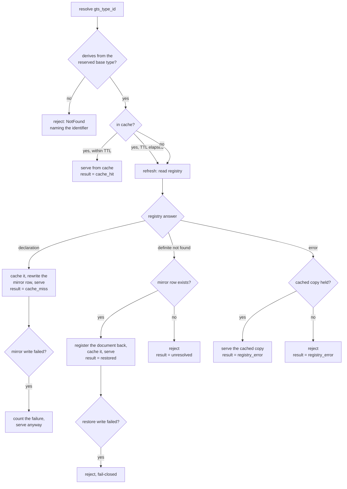

Created:  2026-09-25 by Virtuozzo International GmbH
Updated:  2026-09-25 by Virtuozzo International GmbH

# Feature: GTS Usage Type Resolution & Declaration Binding

- [ ] `p1` - **ID**: `cpt-cf-usage-collector-featstatus-usage-type-resolution-implemented`

- [ ] `p1` - `cpt-cf-usage-collector-feature-usage-type-resolution`

Resolves a GTS type reference to its `types-registry`-owned declaration on the
ingestion and query paths, fail-closed, serving the steady state from a local
cache and recovering a declaration the registry has lost.

<!-- toc -->

- [1. Feature Context](#1-feature-context)
  - [1.1 Overview](#11-overview)
  - [1.2 Purpose](#12-purpose)
  - [1.3 Actors](#13-actors)
  - [1.4 References](#14-references)
- [2. Actor Flows (CDSL)](#2-actor-flows-cdsl)
  - [Resolve a Meter on First Reference](#resolve-a-meter-on-first-reference)
  - [Serve a Typed Read](#serve-a-typed-read)
  - [Keep Ingesting Through a Registry Restart](#keep-ingesting-through-a-registry-restart)
- [3. Processes / Business Logic (CDSL)](#3-processes--business-logic-cdsl)
  - [Resolve a Declaration](#resolve-a-declaration)
  - [Meter Admissibility](#meter-admissibility)
  - [Maintain the Declaration Cache](#maintain-the-declaration-cache)
  - [Mirror and Restore a Declaration](#mirror-and-restore-a-declaration)
  - [Expose Declared Attributes](#expose-declared-attributes)
- [4. States (CDSL)](#4-states-cdsl)
  - [Cached Declaration State Machine](#cached-declaration-state-machine)
- [5. Definitions of Done](#5-definitions-of-done)
  - [Type Resolver Component](#type-resolver-component)
  - [Fail-Closed Resolution](#fail-closed-resolution)
  - [Declaration Cache](#declaration-cache)
  - [Declared Fold Binding](#declared-fold-binding)
  - [Metering Unit Binding](#metering-unit-binding)
  - [Declaration Mirror and Restore](#declaration-mirror-and-restore)
  - [Resolution Telemetry](#resolution-telemetry)
- [6. Acceptance Criteria](#6-acceptance-criteria)

<!-- /toc -->

## 1. Feature Context

### 1.1 Overview

Every entry and every typed read names a GTS type — a platform type identifier
whose declaration `types-registry` owns. This feature turns that reference into
the declaration behind it: the aggregation fold, the canonical metering unit,
and the metadata surface the write and read paths need. It serves the steady
state from an in-memory cache, refreshes that cache on a fixed interval, mirrors
each declaration it reads into one gear-owned table, and puts a declaration back
when the registry has lost it. A reference that resolves nowhere is rejected,
and nothing is admitted unvalidated.

The component that owns all of this is
`cpt-cf-usage-collector-component-type-resolver`. It is an in-process component
with no wire surface of its own.

### 1.2 Purpose

Resolution is the one step that gives a persisted entry its meaning. A stored
quantity carries no unit and no fold, so the only place those attributes exist
is the declaration. If the gear guessed at them, or copied them onto entries, a
later declaration read and a stored entry could disagree about what a number
means. Registry-owned typing avoids that by keeping one declaration per meter
for the whole platform.

Resolution also sits on the ingestion hot path, and `types-registry` publishes no
latency or availability obligation of its own. A per-entry registry call would
make this gear's ingestion targets depend on a second gear. The cache is
therefore a requirement rather than an optimization, and the mirror exists
because the registry surface this gear resolves through keeps declarations in
memory and loses them on restart.

**Requirements**: `cpt-cf-usage-collector-fr-usage-type-declaration`,
`cpt-cf-usage-collector-fr-usage-type-resolution`,
`cpt-cf-usage-collector-fr-aggregation-fold`,
`cpt-cf-usage-collector-fr-metering-unit-binding`

**Principles**: `cpt-cf-usage-collector-principle-registry-owned-typing`,
`cpt-cf-usage-collector-principle-declared-fold`

**Constraints**: `cpt-cf-usage-collector-constraint-no-type-catalog`

**Component**: `cpt-cf-usage-collector-component-type-resolver`

**ADRs**: `cpt-cf-usage-collector-adr-registry-owned-typing`,
`cpt-cf-usage-collector-adr-declared-fold`,
`cpt-cf-usage-collector-adr-declaration-rehydration`

**Entities**: `AggregationFold`, `MeterTypeId`

**API**: none. GTS type declarations have no endpoint, read or write, on the
REST surface, the SDK trait, or the Plugin SPI (PRD §7.1). Resolution is
internal to the ingestion and query paths, and it is published as no operation.
A caller that wants to read a declaration goes to `types-registry`.

**Sequences**: none. Resolution is one step inside the emit, invalidate, and
query sequences that other features own. This feature defines the behavior of
that step rather than a sequence of its own.

**Data**: none. The gear declares no `db` or `dbtable` component identifier, and
the entry ledger is wholly plugin-owned. The declaration mirror of DESIGN §3.7
is a recovery cache described in §3 below, not ledger data.

### 1.3 Actors

| Actor | Role in Feature |
|-------|-----------------|
| `cpt-cf-usage-collector-actor-types-registry` | Holds every declaration and owns its lifecycle. Answers a cold-path lookup, and accepts the one write the restore path makes. |
| `cpt-cf-usage-collector-actor-usage-source` | Emits entries naming a GTS type. Each entry's reference is resolved before the entry is validated or persisted. |
| `cpt-cf-usage-collector-actor-usage-consumer` | Reads usage by GTS type. An aggregation read needs the declared fold, and both typed read paths need the metadata surface. |
| `cpt-cf-usage-collector-actor-platform-operator` | Sets the cache lifetime and capacity, and watches the resolution counters that show whether the cache and the registry are healthy. |

### 1.4 References

- **PRD**: [PRD.md](../PRD.md) — §5.3 GTS type declaration, resolution, fold,
  and metering unit binding; §7.1 on the absence of any type endpoint.
- **Design**: [DESIGN.md](../DESIGN.md) — §2.1 registry-owned typing and
  declared fold; §2.2 no type catalog; §3.1 `AggregationFold`, `MeterTypeId`,
  fail-closed resolution, declaration immutability; §3.2 Type Resolver; §3.5
  Types Registry dependency; §3.6 emit, invalidate, and query sequences; §3.7
  the declaration mirror; §3.8 `type_cache_ttl_secs` and `type_cache_capacity`;
  §3.11 the resolution instruments.
- **ADRs**:
  [0008](../ADR/0008-cpt-cf-usage-collector-adr-registry-owned-typing.md),
  [0009](../ADR/0009-cpt-cf-usage-collector-adr-declared-fold.md),
  [0015](../ADR/0015-cpt-cf-usage-collector-adr-declaration-rehydration.md)
- **Dependencies**: none. This is a tier-0 feature. It is consumed by
  `cpt-cf-usage-collector-feature-usage-record-ingestion`,
  `cpt-cf-usage-collector-feature-record-invalidation`,
  `cpt-cf-usage-collector-feature-usage-query`,
  `cpt-cf-usage-collector-feature-backfill-retention`, and
  `cpt-cf-usage-collector-feature-operational-visibility`.

## 2. Actor Flows (CDSL)

These flows start with an actor, but none of them adds an endpoint. Each one
enters through a surface another feature owns, and stops at the point where the
resolved declaration is handed back. What the caller does with the declaration
afterwards — validating metadata, folding a result — belongs to the owning
feature.

### Resolve a Meter on First Reference

- [ ] `p1` - **ID**: `cpt-cf-usage-collector-flow-resolve-on-first-reference`

**Actor**: `cpt-cf-usage-collector-actor-usage-source`

**Success Scenarios**:
- The type is declared in `types-registry`, the resolver caches and mirrors the
  declaration, and the ingestion path continues with fold, unit, and metadata
  surface available.
- A second entry naming the same type within the cache lifetime is served from
  memory, with no registry call and no table access.

**Error Scenarios**:
- The registry answers a definite not found and no mirror row exists — the entry
  is rejected with an error naming the unresolved identifier.
- The registry answers an error, the cache is cold, and the entry is rejected
  fail-closed even where a mirror row exists.
- The identifier does not derive from the reserved base type, so it names no
  meter this gear serves, and the entry is rejected.
- The mirror write fails. The entry is still accepted, and the failure is
  counted.

**Steps**:
1. [ ] - `p1` - Usage source submits an entry naming `gts_type_id` on an ingestion path owned by `cpt-cf-usage-collector-feature-usage-record-ingestion` - `inst-resolve-first-submit`
2. [ ] - `p1` - The ingestion gateway calls the resolver after the PDP decision and before any validation - `inst-resolve-first-call`
3. [ ] - `p1` - Resolver runs `cpt-cf-usage-collector-algo-resolve-declaration` for the identifier - `inst-resolve-first-algo`
4. [ ] - `p1` - **IF** the identifier fails the admissibility check of `cpt-cf-usage-collector-algo-meter-admissibility` - `inst-resolve-first-admissible`
   1. [ ] - `p1` - **RETURN** `NotFound` naming the identifier, before any registry call - `inst-resolve-first-reject-base`
5. [ ] - `p1` - **IF** the resolution answers a declaration - `inst-resolve-first-hit`
   1. [ ] - `p1` - Expose fold, canonical unit, metadata schema, and nominal sampling interval per `cpt-cf-usage-collector-algo-expose-declared-attributes` - `inst-resolve-first-expose`
   2. [ ] - `p1` - **RETURN** the declaration to the ingestion gateway - `inst-resolve-first-return`
6. [ ] - `p1` - **ELSE** - `inst-resolve-first-miss`
   1. [ ] - `p1` - **RETURN** `NotFound` naming the identifier, with the entry not persisted - `inst-resolve-first-reject`

### Serve a Typed Read

- [ ] `p1` - **ID**: `cpt-cf-usage-collector-flow-resolve-for-read`

**Actor**: `cpt-cf-usage-collector-actor-usage-consumer`

**Success Scenarios**:
- An aggregation read receives the declared fold of the queried type, which the
  query gateway then pushes to the storage plugin.
- A raw read receives the metadata surface it needs to check a metadata filter
  and to resolve a grouping dimension.

**Error Scenarios**:
- The queried type does not resolve, so the read is rejected and never reaches
  the storage plugin.
- The request carries an aggregation function of its own. It is rejected by the
  query surface, because the fold is declared rather than chosen.

**Steps**:
1. [ ] - `p1` - Usage consumer issues a typed read on a surface owned by `cpt-cf-usage-collector-feature-usage-query` - `inst-read-request`
2. [ ] - `p1` - Query gateway calls the resolver with the required single `gts_type_id` - `inst-read-call`
3. [ ] - `p1` - Resolver runs `cpt-cf-usage-collector-algo-resolve-declaration` - `inst-read-algo`
4. [ ] - `p1` - **IF** the identifier does not resolve - `inst-read-unresolved`
   1. [ ] - `p1` - **RETURN** `NotFound` naming the identifier, with no dispatch to the storage plugin - `inst-read-reject`
5. [ ] - `p1` - Expose the declared fold and the metadata surface to the query gateway, and expose no retention value - `inst-read-expose`
6. [ ] - `p1` - **RETURN** the declaration. Applying the fold to the result belongs to `cpt-cf-usage-collector-feature-usage-query` - `inst-read-return`

### Keep Ingesting Through a Registry Restart

- [ ] `p1` - **ID**: `cpt-cf-usage-collector-flow-survive-registry-loss`

**Actor**: `cpt-cf-usage-collector-actor-types-registry`

**Success Scenarios**:
- The registry is unreachable and the declaration is cached, so ingestion of
  that meter continues without interruption.
- The registry has restarted and lost the declaration, the cache is cold, a
  mirror row exists, and the resolver registers the stored document back and
  serves the entry.

**Error Scenarios**:
- The registry has lost the declaration and no mirror row exists, because the
  meter never carried traffic or its mirror write failed. Resolution fails
  closed.
- The registry answers an error rather than a definite not found. The resolver
  cannot tell loss from unavailability, so it does not restore, and a cold cache
  fails closed.
- The restore itself fails against the registry. The operation that needed the
  declaration is rejected.

**Steps**:
1. [ ] - `p1` - `types-registry` restarts and drops declarations registered at run time - `inst-survive-restart`
2. [ ] - `p1` - **IF** the resolver still holds the declaration in cache - `inst-survive-cached`
   1. [ ] - `p1` - Serve it unchanged, including past its refresh interval, and count the refresh attempt as a registry error - `inst-survive-serve-cached`
3. [ ] - `p1` - **ELSE** - `inst-survive-cold`
   1. [ ] - `p1` - Run `cpt-cf-usage-collector-algo-mirror-and-restore` for the identifier - `inst-survive-restore-algo`
   2. [ ] - `p1` - **IF** the registry answered a definite not found and a mirror row exists - `inst-survive-row`
      1. [ ] - `p1` - Register the stored document back, cache it, count the result as `restored`, and serve - `inst-survive-restore`
   3. [ ] - `p1` - **ELSE** - `inst-survive-norow`
      1. [ ] - `p1` - **RETURN** `NotFound` naming the identifier - `inst-survive-reject`
4. [ ] - `p1` - **RETURN** the declaration, or the rejection, to the calling path - `inst-survive-return`

## 3. Processes / Business Logic (CDSL)

The resolver is reached only in process. The algorithms below are its whole
behavior.

The resolve path branches on four independent conditions — cache presence,
refresh age, the registry's answer, and the presence of a mirror row — and the
branches do not compose linearly. The diagram below states the whole decision
shape in one place, so an implementer does not have to reconstruct it from the
step lists.

### Resolve a Declaration

- [ ] `p1` - **ID**: `cpt-cf-usage-collector-algo-resolve-declaration`

**Input**: a `gts_type_id` reference carried by an entry or a typed read.

**Output**: a resolved declaration exposing fold, canonical unit, metadata
schema, and optional nominal sampling interval, or a fail-closed rejection that
names the identifier.

**Steps**:
1. [ ] - `p1` - Check admissibility with `cpt-cf-usage-collector-algo-meter-admissibility`; reject without any registry call where it fails - `inst-resolve-admissible`
2. [ ] - `p1` - Look the identifier up in the in-memory declaration cache - `inst-resolve-lookup`
3. [ ] - `p1` - **IF** a cached declaration exists and its age is below `type_cache_ttl_secs` - `inst-resolve-fresh`
   1. [ ] - `p1` - Count `result = cache_hit`, perform no registry call, no table read, and no table write - `inst-resolve-count-hit`
   2. [ ] - `p1` - **RETURN** the cached declaration - `inst-resolve-return-hit`
4. [ ] - `p1` - **TRY** read the declaration from `types-registry` by identifier - `inst-resolve-registry-read`
   1. [ ] - `p1` - On a declaration, run `cpt-cf-usage-collector-algo-mirror-and-restore` in mirror mode, insert into the cache, count `result = cache_miss`, and **RETURN** it - `inst-resolve-registry-hit`
   2. [ ] - `p1` - On a definite not-found answer, run `cpt-cf-usage-collector-algo-mirror-and-restore` in restore mode - `inst-resolve-registry-notfound`
5. [ ] - `p1` - **CATCH** a registry error, which is any answer that is not a declaration and not a definite not found - `inst-resolve-registry-error`
   1. [ ] - `p1` - Count `result = registry_error`. Serve the cached copy where one is held, however old it is, and reject fail-closed where none is - `inst-resolve-error-branch`
6. [ ] - `p1` - **IF** the restore returned a declaration - `inst-resolve-restored`
   1. [ ] - `p1` - Insert it into the cache, count `result = restored`, and **RETURN** it - `inst-resolve-return-restored`
7. [ ] - `p1` - **RETURN** a fail-closed rejection naming the identifier, counted as `result = unresolved`, substituting no default fold, unit, or metadata surface - `inst-resolve-return-reject`

### Meter Admissibility

- [ ] `p1` - **ID**: `cpt-cf-usage-collector-algo-meter-admissibility`

**Input**: a `gts_type_id` string, and optionally a declaration already read from
the registry.

**Output**: an accept or reject verdict, with the reason named on a rejection.

**Steps**:
1. [ ] - `p1` - Check that the identifier is a GTS type identifier and derives from `gts.cf.core.uc.usage_record.v1~` with exactly one further segment, which is what `MeterTypeId` means - `inst-admit-base`
2. [ ] - `p1` - **IF** the identifier sits under any other base - `inst-admit-wrong-base`
   1. [ ] - `p1` - **RETURN** reject. It names no meter this gear serves, and no registry call is made - `inst-admit-reject-base`
3. [ ] - `p1` - **IF** a declaration was supplied - `inst-admit-have-decl`
   1. [ ] - `p1` - Check that it carries exactly one aggregation fold from the closed set `SUM`, `COUNT`, `MAX`, `MIN`, `LATEST`, never inferred from the identifier's shape - `inst-admit-fold`
   2. [ ] - `p1` - Check that it binds one canonical metering unit. Absence, or a unit outside the canonical list, is refused at registration by `types-registry`, so the resolver treats either as a declaration it does not serve - `inst-admit-unit`
   3. [ ] - `p1` - Check that it carries a metadata surface, the closed set of properties an entry of this meter may name - `inst-admit-metadata`
   4. [ ] - `p1` - **IF** any of the three is missing or outside its closed set - `inst-admit-bad`
      1. [ ] - `p1` - **RETURN** reject, naming the identifier and the attribute at fault - `inst-admit-reject-attr`
4. [ ] - `p1` - **RETURN** accept - `inst-admit-accept`

### Maintain the Declaration Cache

- [ ] `p1` - **ID**: `cpt-cf-usage-collector-algo-maintain-declaration-cache`

**Input**: resolution outcomes, the configured `type_cache_ttl_secs` and
`type_cache_capacity`, and the passage of time.

**Output**: a bounded in-memory map from identifier to declaration, plus the
resolution counters and the age reading the staleness alert consumes.

**Steps**:
1. [ ] - `p1` - Hold one entry per meter, not per usage entry, capped at `type_cache_capacity` - `inst-cache-capacity`
2. [ ] - `p1` - Record the instant of the registry read each cached declaration came from, and derive its age from that instant - `inst-cache-age`
3. [ ] - `p1` - Treat a declaration older than `type_cache_ttl_secs` as due for refresh rather than as unusable - `inst-cache-ttl`
4. [ ] - `p1` - **IF** a refresh reads a declaration successfully - `inst-cache-refresh-ok`
   1. [ ] - `p1` - Replace the cached copy and reset its age - `inst-cache-replace`
5. [ ] - `p1` - **IF** a refresh fails with a registry error - `inst-cache-refresh-fail`
   1. [ ] - `p1` - Keep serving the existing copy. Fold, unit, and metadata surface are immutable, so an aged copy cannot have silently changed meaning - `inst-cache-keep`
6. [ ] - `p1` - **FOR EACH** eviction forced by capacity - `inst-cache-evict`
   1. [ ] - `p1` - Drop the least recently resolved declaration, so the next reference to it takes the cold path - `inst-cache-evict-lru`
7. [ ] - `p1` - Build the cache empty at process start, holding no durable state and needing no warm-up step - `inst-cache-cold-start`
8. [ ] - `p1` - Cache no retention value. The storage plugin reads declared retention from `types-registry` itself - `inst-cache-no-retention`
9. [ ] - `p1` - **RETURN** the maintained cache and its published age and counters - `inst-cache-return`

### Mirror and Restore a Declaration

- [ ] `p1` - **ID**: `cpt-cf-usage-collector-algo-mirror-and-restore`

**Input**: a `gts_type_id`, a mode of mirror or restore, and on mirror the
declaration document the registry just returned.

**Output**: on mirror, a written or failed row and a counter increment. On
restore, a re-registered declaration or a fail-closed rejection.

The mirror table is the only durable table this gear owns, and it is explicitly
temporary. It holds one row per resolved meter: the type identifier, the
declaration document as registered, and first-seen and last-seen timestamps.
Declarations are platform-global, so the table is not tenant-scoped. It is a
recovery mirror and not a catalog of record: nothing resolves through it, no
entry references it, it enforces no referential integrity, and only the restore
path reads it. It exists because the registry surface this gear resolves through
stores declarations in memory, and it is deleted when that changes.

**Steps**:
1. [ ] - `p1` - **IF** the mode is mirror - `inst-mirror-mode`
   1. [ ] - `p1` - **TRY** upsert the row for the identifier with the document as returned, setting first-seen once and last-seen on every write - `inst-mirror-write`
   2. [ ] - `p1` - **CATCH** a write failure - `inst-mirror-catch`
      1. [ ] - `p1` - Count the failure and **RETURN** success. A failed mirror write never rejects the operation that triggered it - `inst-mirror-swallow`
   3. [ ] - `p1` - **RETURN** success. The row is rewritten on the cold miss and on every refresh, so it tracks the registry rather than freezing at first resolution - `inst-mirror-return`
2. [ ] - `p1` - **IF** the mode is restore - `inst-restore-mode`
   1. [ ] - `p1` - Require that the registry gave a definite not-found answer. On any other answer, **RETURN** no declaration - `inst-restore-definite`
   2. [ ] - `p1` - Read the row for the identifier. Where none exists, **RETURN** no declaration - `inst-restore-read`
   3. [ ] - `p1` - Apply no lifecycle test. While the restore is live, a not-found answer is always loss, because the resolution surface carries no removal operation and no lifecycle status - `inst-restore-no-lifecycle`
   4. [ ] - `p1` - **TRY** register the stored document back to `types-registry`, under the gear's own identity and never the calling caller's - `inst-restore-register`
   5. [ ] - `p1` - **CATCH** a registration failure - `inst-restore-catch`
      1. [ ] - `p1` - **RETURN** no declaration, so the operation is rejected fail-closed - `inst-restore-fail`
   6. [ ] - `p1` - **RETURN** the restored declaration, replaying only a document the registry itself returned earlier - `inst-restore-return`

### Expose Declared Attributes

- [ ] `p1` - **ID**: `cpt-cf-usage-collector-algo-expose-declared-attributes`

**Input**: a resolved declaration.

**Output**: the attribute view the write and read paths consume.

**Steps**:
1. [ ] - `p1` - Expose the `AggregationFold` as a read-only, per-type property. No path accepts it as a request parameter, and no path infers it from the identifier - `inst-expose-fold`
2. [ ] - `p1` - Expose the canonical metering unit as a property of the type, resolved through the reference and never carried on an entry - `inst-expose-unit`
3. [ ] - `p1` - Expose the metadata schema, so the ingestion and query paths can recompute admissible keys per request - `inst-expose-metadata`
4. [ ] - `p1` - Expose the nominal sampling interval where the declaration carries one, and act on it nowhere - `inst-expose-interval`
5. [ ] - `p1` - Expose no retention value on any path. Retention is the one mutable attribute, and the storage plugin reads it directly - `inst-expose-no-retention`
6. [ ] - `p1` - Copy no exposed attribute onto a persisted entry, and persist no declaration outside the mirror row - `inst-expose-no-denorm`
7. [ ] - `p1` - **RETURN** the attribute view - `inst-expose-return`

## 4. States (CDSL)

### Cached Declaration State Machine

- [ ] `p2` - **ID**: `cpt-cf-usage-collector-state-cached-declaration`

A cached declaration has a real lifecycle, because age changes how the resolver
treats it and a failed refresh has to leave it usable. The states below are
per replica and per identifier. They describe the cache slot, not the
declaration itself, which `types-registry` owns.

**States**: `Absent`, `Fresh`, `DueForRefresh`, `Retained`

**Initial State**: `Absent`

**Transitions**:
1. [ ] - `p1` - **FROM** `Absent` **TO** `Fresh` **WHEN** a cold-path registry read returns a declaration and the resolver caches it - `inst-state-miss-to-fresh`
2. [ ] - `p1` - **FROM** `Absent` **TO** `Fresh` **WHEN** a restore re-registers a mirrored document and the resolver caches it - `inst-state-restore-to-fresh`
3. [ ] - `p1` - **FROM** `Absent` **TO** `Absent` **WHEN** resolution fails, since a rejection caches nothing, not even the negative answer - `inst-state-no-negative-cache`
4. [ ] - `p1` - **FROM** `Fresh` **TO** `DueForRefresh` **WHEN** the cached copy's age reaches `type_cache_ttl_secs` - `inst-state-fresh-to-due`
5. [ ] - `p1` - **FROM** `DueForRefresh` **TO** `Fresh` **WHEN** the next reference reads the declaration again and the row is rewritten - `inst-state-due-to-fresh`
6. [ ] - `p1` - **FROM** `DueForRefresh` **TO** `Retained` **WHEN** the refresh fails with a registry error and the aged copy keeps being served - `inst-state-due-to-retained`
7. [ ] - `p1` - **FROM** `Retained` **TO** `Fresh` **WHEN** a later reference reaches the registry and reads the declaration - `inst-state-retained-to-fresh`
8. [ ] - `p1` - **FROM** `Fresh`, `DueForRefresh`, or `Retained` **TO** `Absent` **WHEN** capacity eviction drops the slot or the process restarts - `inst-state-any-to-absent`

A declaration never enters a withdrawn or invalid state here. Fold, unit, and
metadata surface are immutable for the life of a meter, so a cached copy cannot
change meaning while it is held. Only additions and losses propagate.

## 5. Definitions of Done

### Type Resolver Component

- [ ] `p1` - **ID**: `cpt-cf-usage-collector-dod-type-resolver-component`

The system **MUST** provide the Type Resolver as an in-process component that
exposes one resolution operation to the ingestion, invalidation, backfill, and
query paths. It **MUST** add no REST route, no SDK trait method, and no Plugin
SPI method for reading or writing a declaration. It **MUST** hold the only
`types-registry` declaration client in the gear, so no other component repairs
or reads the registry's declarations.

**Implements**:
- `cpt-cf-usage-collector-flow-resolve-on-first-reference`
- `cpt-cf-usage-collector-flow-resolve-for-read`
- `cpt-cf-usage-collector-algo-resolve-declaration`

**Constraints**: `cpt-cf-usage-collector-constraint-no-type-catalog`

**Touches**:
- API: none — no type operation exists on any of the three public surfaces
- Component: `cpt-cf-usage-collector-component-type-resolver`
- Entities: `MeterTypeId`

### Fail-Closed Resolution

- [ ] `p1` - **ID**: `cpt-cf-usage-collector-dod-fail-closed-resolution`

The system **MUST** reject any operation whose GTS type reference does not
resolve, and **MUST** name the unresolved identifier in the error. It **MUST
NOT** substitute a default fold, unit, or metadata surface, and **MUST NOT**
relax validation to protect availability. The rule **MUST** hold identically on
the write paths and the read paths, and the rejection **MUST** happen before any
dispatch to the storage plugin. Entries already accepted under a declaration
that no longer resolves **MUST** stay persisted and unmodified.

**Implements**:
- `cpt-cf-usage-collector-flow-resolve-on-first-reference`
- `cpt-cf-usage-collector-flow-resolve-for-read`
- `cpt-cf-usage-collector-algo-resolve-declaration`

**Constraints**: `cpt-cf-usage-collector-constraint-no-type-catalog`

**Touches**:
- API: none — the rejection surfaces through the ingestion and query endpoints
  other features own
- Component: `cpt-cf-usage-collector-component-type-resolver`

### Declaration Cache

- [ ] `p1` - **ID**: `cpt-cf-usage-collector-dod-declaration-cache`

The system **MUST** serve steady-state resolution from an in-memory cache, with
no registry round-trip, no table read, and no table write on a hit. The cache
**MUST** hold one entry per meter, honor `type_cache_capacity` as a hard
ceiling, and refresh an entry once its age reaches `type_cache_ttl_secs`. Where
a refresh fails, the cache **MUST** keep serving the aged copy, so a registry
outage degrades the introduction of new meters rather than ingestion of existing
ones. The cache **MUST** be reconstructible on restart and **MUST** persist
nothing.

**Implements**:
- `cpt-cf-usage-collector-algo-maintain-declaration-cache`
- `cpt-cf-usage-collector-state-cached-declaration`

**Constraints**: `cpt-cf-usage-collector-constraint-no-type-catalog`

**Touches**:
- API: none
- Component: `cpt-cf-usage-collector-component-type-resolver`

### Declared Fold Binding

- [ ] `p1` - **ID**: `cpt-cf-usage-collector-dod-declared-fold-binding`

The system **MUST** read the aggregation fold from the resolved declaration as a
closed, immutable, per-type property drawn from `SUM`, `COUNT`, `MAX`, `MIN`,
and `LATEST`. It **MUST NOT** infer the fold from the identifier's shape, accept
it as a request parameter, or store it on an entry. The ingestion path **MUST
NOT** consult the fold at all, so no ingestion outcome depends on it and no
quantity sign is constrained by it. Applying the fold to a query result belongs
to `cpt-cf-usage-collector-feature-usage-query`.

**Implements**:
- `cpt-cf-usage-collector-algo-expose-declared-attributes`
- `cpt-cf-usage-collector-flow-resolve-for-read`

**Constraints**: `cpt-cf-usage-collector-constraint-no-type-catalog`

**Touches**:
- API: none — the aggregate request carries no aggregation parameter
- Entities: `AggregationFold`

### Metering Unit Binding

- [ ] `p1` - **ID**: `cpt-cf-usage-collector-dod-metering-unit-binding`

The system **MUST** resolve the canonical metering unit through the type
reference and **MUST NOT** accept or store a unit per entry. A declaration
binding no unit, or one outside the canonical list published in the base type's
trait schema, is refused when it is registered, so the resolver **MUST** treat
such a declaration as one it does not serve and reject the reference. The gear
**MUST NOT** convert, scale, or round a quantity on any path, and **MUST NOT**
restate the canonical list anywhere in its own code or contracts.

**Implements**:
- `cpt-cf-usage-collector-algo-meter-admissibility`
- `cpt-cf-usage-collector-algo-expose-declared-attributes`

**Constraints**: `cpt-cf-usage-collector-constraint-no-type-catalog`

**Touches**:
- API: none
- Entities: `MeterTypeId`

### Declaration Mirror and Restore

- [ ] `p1` - **ID**: `cpt-cf-usage-collector-dod-declaration-mirror-restore`

The system **MUST** keep one gear-owned table holding one row per resolved
meter, carrying the identifier, the declaration document as registered, and
first-seen and last-seen timestamps. It **MUST** rewrite the row on every
successful registry read, cold miss and refresh alike. It **MUST** restore a
declaration only where the registry gives a definite not-found answer and a row
exists, registering the stored document back under the gear's own identity. A
failed mirror write **MUST** be counted and **MUST NOT** reject the operation. A
failed restore **MUST** reject it. The table **MUST** be reachable from one
place in the code, so its removal is a single deletion when the registry gains
persistent storage.

**Implements**:
- `cpt-cf-usage-collector-algo-mirror-and-restore`
- `cpt-cf-usage-collector-flow-survive-registry-loss`

**Constraints**: `cpt-cf-usage-collector-constraint-no-type-catalog`

**Touches**:
- API: none
- DB: the declaration mirror of DESIGN §3.7. DESIGN defines no `db` or
  `dbtable` identifier for it, because it is a recovery cache rather than gear
  schema, and the entry ledger stays wholly plugin-owned
- Component: `cpt-cf-usage-collector-component-type-resolver`

### Resolution Telemetry

- [ ] `p1` - **ID**: `cpt-cf-usage-collector-dod-resolution-telemetry`

The system **MUST** emit one counter observation per resolution, labelled with
the result as `cache_hit`, `cache_miss`, `restored`, `unresolved`, or
`registry_error`, and **MUST** emit a duration histogram for the hit and miss
paths. It **MUST** count a failed mirror write separately, since that failure
changes no caller-visible outcome. It **MUST** publish the age of the oldest
served declaration, so cache staleness is measurable. Dashboards, thresholds,
and alert routing over these instruments belong to
`cpt-cf-usage-collector-feature-operational-visibility`.

**Implements**:
- `cpt-cf-usage-collector-algo-resolve-declaration`
- `cpt-cf-usage-collector-algo-maintain-declaration-cache`

**Touches**:
- API: none
- Component: `cpt-cf-usage-collector-component-type-resolver`

## 6. Acceptance Criteria

- [ ] A cache hit performs no `types-registry` call, no mirror-table read, and no mirror-table write, verified by instrumenting all three and asserting zero calls on the second reference to one meter.
- [ ] A cold reference to a declared meter resolves, is served, is cached, and writes a mirror row carrying the document as the registry returned it.
- [ ] A reference to an identifier that is registered nowhere and mirrored nowhere is rejected with an error naming the identifier, and the entry is not persisted.
- [ ] An identifier that does not derive from `gts.cf.core.uc.usage_record.v1~` with exactly one further segment is rejected before any registry call is made.
- [ ] Resolution fails closed on the read paths too: an aggregation query naming an unresolvable type is rejected and never dispatched to the storage plugin.
- [ ] After a registry restart clears a declaration, and after the resolver cache is evicted, the next reference restores the declaration from the mirror row and serves the operation, counting `result = restored`.
- [ ] With a cold cache and the registry answering an error rather than a definite not found, resolution fails closed even though a mirror row exists, and the row is not served.
- [ ] Ingestion succeeds while the mirror table is unwritable, and the failed mirror write is counted.
- [ ] A declaration whose mirror write failed is not restored after a registry reset and a cache eviction, and every later reference to it is rejected.
- [ ] With the registry unreachable and a declaration already cached, ingestion for that meter continues past `type_cache_ttl_secs` with no rejection attributable to resolution.
- [ ] Amending a resolved meter's retention, letting the refresh interval pass, then clearing the registry and evicting the cache, yields a restored declaration carrying the amended retention.
- [ ] The resolver exposes no retention value to any caller, verified by asserting the resolved-declaration view carries no retention field.
- [ ] The declared fold reaches the query path from the declaration alone: a request carrying an aggregation function of its own is rejected, and two meters sharing a name prefix but declaring different folds each resolve to their own.
- [ ] The ingestion path accepts a `COUNT` meter's entry with any quantity value, confirming that ingestion never consults the fold.
- [ ] No REST route, SDK trait method, or Plugin SPI method reads or writes a GTS type declaration, verified by inspecting the published contract for all three surfaces.
- [ ] No persisted entry carries a fold, a unit, a metadata schema, or a retention value, verified against the stored entry shape.
- [ ] Filling the cache past `type_cache_capacity` evicts the least recently resolved meter, and the next reference to it takes the cold path rather than failing.
- [ ] Every resolution increments the resolution counter exactly once, under the label matching the path taken, across all five results.
