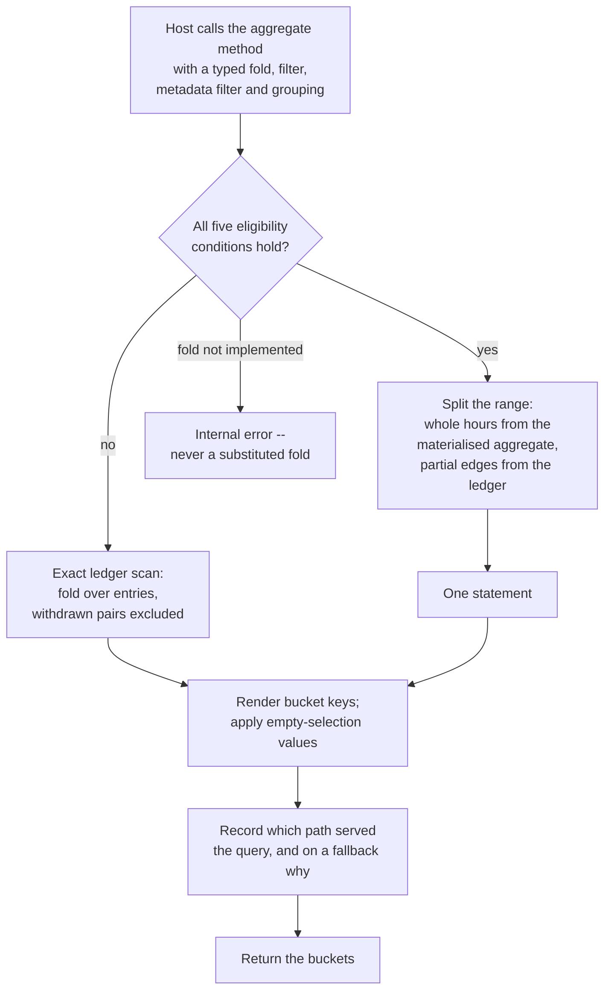

Created:  2026-09-26 by Virtuozzo International GmbH
Updated:  2026-09-26 by Virtuozzo International GmbH

# Feature: Aggregated Query & Rollup

- [ ] `p1` - **ID**: `cpt-cf-uc-plugin-featstatus-aggregated-query-rollup-implemented`

- [ ] `p1` - `cpt-cf-uc-plugin-feature-aggregated-query-rollup`

Executes the host-supplied aggregation fold inside the backend, with grouping,
filtering and scope pushed down, and serves eligible queries from an hourly
materialised aggregate instead of scanning the ledger. Covers the five
eligibility conditions, the withdrawn-pair exclusion, the total order behind the
latest fold, bucket-key rendering, empty-selection values, and the refresh
policies that keep the aggregate current.

<!-- toc -->

- [1. Feature Context](#1-feature-context)
  - [1.1 Overview](#11-overview)
  - [1.2 Purpose](#12-purpose)
  - [1.3 Actors](#13-actors)
  - [1.4 References](#14-references)
- [2. Actor Flows (CDSL)](#2-actor-flows-cdsl)
  - [Host Runs an Aggregated Query](#host-runs-an-aggregated-query)
- [3. Processes / Business Logic (CDSL)](#3-processes--business-logic-cdsl)
  - [Rollup Eligibility](#rollup-eligibility)
  - [Exact Scan Fold](#exact-scan-fold)
  - [Bucket Key Rendering and Empty-Selection Values](#bucket-key-rendering-and-empty-selection-values)
  - [Metadata Filter Composition](#metadata-filter-composition)
  - [Rollup Refresh Policy Application and Health Sampling](#rollup-refresh-policy-application-and-health-sampling)
- [4. States (CDSL)](#4-states-cdsl)
  - [Rollup Refresh Policy State Machine](#rollup-refresh-policy-state-machine)
- [5. Definitions of Done](#5-definitions-of-done)
  - [The Fold Is Pushed Down and Never Chosen](#the-fold-is-pushed-down-and-never-chosen)
  - [A Withdrawn Pair Leaves Every Fold Together](#a-withdrawn-pair-leaves-every-fold-together)
  - [The Latest Fold Uses a Total Order](#the-latest-fold-uses-a-total-order)
  - [Metadata Filters OR Within a Key and AND Across Keys](#metadata-filters-or-within-a-key-and-and-across-keys)
  - [Bucket Keys Render Identically on Both Paths](#bucket-keys-render-identically-on-both-paths)
  - [Empty-Selection Values Are Defined per Fold](#empty-selection-values-are-defined-per-fold)
  - [An Unimplemented Fold Is an Error, Never a Substitution](#an-unimplemented-fold-is-an-error-never-a-substitution)
  - [Rollup Eligibility and Path Reporting](#rollup-eligibility-and-path-reporting)
  - [Refresh Policies Are Applied Idempotently and Commit in Batches](#refresh-policies-are-applied-idempotently-and-commit-in-batches)
  - [Aggregate Visibility and Propagation Bounds Are Published](#aggregate-visibility-and-propagation-bounds-are-published)
  - [The Latest Fold's Memory Bound Is Published](#the-latest-folds-memory-bound-is-published)
- [6. Acceptance Criteria](#6-acceptance-criteria)

<!-- /toc -->

## 1. Feature Context

### 1.1 Overview

This is the plugin's answer to a question that would otherwise scan a month of
entries per dashboard refresh. Two paths serve it. The exact path folds the
ledger directly and always yields the right answer. The rollup path reads an
hourly materialised aggregate and is faster, but it can only serve a query whose
shape it can represent.

Five conditions decide which path runs, all of them required. When they hold,
whole hours come from the materialised aggregate and the partial hours at either
end come from the ledger, in one statement. When any fails, the whole query takes
the exact scan, and the plugin records which path served it and why.

**Traces to**: `cpt-cf-uc-plugin-fr-aggregated-query`,
`cpt-cf-uc-plugin-fr-rollup-aggregation`

### 1.2 Purpose

The plugin never chooses a fold. `cpt-cf-usage-collector-adr-declared-fold`
binds the fold to the type's declaration, so it reaches the SPI as a typed
parameter that the plugin applies and does not interpret. That is why an
unimplemented fold is answered as an error rather than by substituting a similar
one: substituting would produce a defensible-looking number that no declaration
stands behind.

Every range predicate selects on the covered-period end alone, per
`cpt-cf-usage-collector-adr-window-end-selection`. Containment and overlap are
not offered, so two readers asking for the same period cannot select different
entries.

The materialised aggregate exists because
`cpt-cf-usage-collector-adr-feed-aggregate-split` makes the aggregate a derived
view a plugin may materialise, while a charging consumer reads the entry feed
instead. That split is what permits an aggregate to lag at all: nothing that
issues a charge depends on it.

The exclusion of a withdrawn pair is load-bearing arithmetic rather than
tidiness. A fold that admitted the withdrawal alone would subtract a quantity
nothing added; one that admitted the record alone would keep a retracted charge.
Both entries leave every fold together.

**Requirements**: `cpt-cf-uc-plugin-fr-aggregated-query`,
`cpt-cf-uc-plugin-fr-rollup-aggregation`,
`cpt-cf-uc-plugin-nfr-query-latency`,
`cpt-cf-uc-plugin-nfr-aggregate-freshness`

**Principles**: none. The aggregate path adds no principle beyond the
pure-persistence rule
`cpt-cf-uc-plugin-feature-record-ingestion-idempotency` carries, which is why the
fold arrives as a parameter rather than being resolved here.

**Constraints**: `cpt-cf-uc-plugin-constraint-rollup-ledger-coupling`

**Components**: `cpt-cf-uc-plugin-component-query`,
`cpt-cf-uc-plugin-component-rollup`

**Scope boundary.** Resolving which fold a type declares belongs to the gear
core. Raw row retrieval and point lookup belong to
`cpt-cf-uc-plugin-feature-raw-query-converged-lookup`. Dropping rollup rows
during a retention sweep belongs to
`cpt-cf-uc-plugin-feature-per-type-retention`, which performs the drop using the
materialisation-table name this feature resolves. The refresh policies are
applied during startup by the component
`cpt-cf-uc-plugin-feature-registration-schema-provisioning` invokes; their
content and their health sampling are this feature's.

### 1.3 Actors

| Actor | Role in Feature |
|-------|-----------------|
| `cpt-cf-uc-plugin-actor-plugin-host` | The Usage Collector gear core. Resolves the type's declared fold, compiles the scope, and passes the fold, filter, metadata filter and grouping down as typed parameters |
| `cpt-cf-usage-collector-actor-usage-consumer` | Reads aggregated figures through the gear's query surface. It never reaches the SPI, and it is the reader whose latency budget this feature is the allocation target for |
| `cpt-cf-usage-collector-actor-platform-operator` | Sets the refresh-policy configuration that fixes how far behind the materialised aggregate may run, and is obliged to tighten it where a consumer acts on aggregate figures |

### 1.4 References

- **PRD**: [PRD.md](../PRD.md) -- section 5.2 Pushed-Down Aggregation
  (`cpt-cf-uc-plugin-fr-aggregated-query`) and Rollup-Backed Aggregation
  (`cpt-cf-uc-plugin-fr-rollup-aggregation`); section 6.1 Aggregation Query
  Latency (`cpt-cf-uc-plugin-nfr-query-latency`) and Aggregate Freshness
  (`cpt-cf-uc-plugin-nfr-aggregate-freshness`)
- **Design**: [DESIGN.md](../DESIGN.md) -- section 3.6 Aggregated query and
  Rollup refresh; section 3.7 `usage_rollup_1h`, including why the signed netting
  is exact; section 2.2 Rollup/Ledger Coupling; section 4.1 item 4, the published
  visibility and propagation bounds and their two documented imprecisions;
  section 4.2 Published Limits, the memory bound on the latest fold
- **ADR**:
  [ADR-0009](../../../../docs/ADR/0009-cpt-cf-usage-collector-adr-declared-fold.md)
  (`cpt-cf-usage-collector-adr-declared-fold`) -- the fold is declared on the
  type, not chosen per query;
  [ADR-0011](../../../../docs/ADR/0011-cpt-cf-usage-collector-adr-feed-aggregate-split.md)
  (`cpt-cf-usage-collector-adr-feed-aggregate-split`) -- the aggregate is a
  derived view a plugin may materialise, while a charging consumer reads the
  feed;
  [ADR-0014](../../../../docs/ADR/0014-cpt-cf-usage-collector-adr-window-end-selection.md)
  (`cpt-cf-usage-collector-adr-window-end-selection`) -- selection by the
  covered-period end;
  [ADR-0010](../../../../docs/ADR/0010-cpt-cf-usage-collector-adr-append-only-invalidation.md)
  (`cpt-cf-usage-collector-adr-append-only-invalidation`) -- why the exclusion
  rule is stated over both entries of a withdrawn pair
- **Decomposition**: [DECOMPOSITION.md](../DECOMPOSITION.md) -- entry 2.4
- **Entities**: the aggregation request, its result, and the fold itself. All
  three arrive from the SDK and none is minted here
- **Sequences**: `cpt-cf-uc-plugin-seq-query-aggregated`,
  `cpt-cf-uc-plugin-seq-rollup-refresh`
- **Dependencies**: `cpt-cf-uc-plugin-feature-record-ingestion-idempotency` and
  `cpt-cf-uc-plugin-feature-invalidation-persistence`. This feature folds stored
  entries, and its exclusion rule and the rollup's signed netting are both
  defined over a record and the withdrawal that removed it. Neither can be tested
  until both kinds of entry can be persisted

**Data**: none. The ledger table and the hourly continuous aggregate this
feature reads and refreshes are provisioned by
`cpt-cf-uc-plugin-feature-registration-schema-provisioning`.

## 2. Actor Flows (CDSL)

One flow. The branch inside it is the whole feature: a query either fits the
materialised aggregate's shape or it does not, and the answer must be the same
either way.

### Host Runs an Aggregated Query

- [ ] `p1` - **ID**: `cpt-cf-uc-plugin-flow-run-aggregated-query`

**Actor**: `cpt-cf-uc-plugin-actor-plugin-host`

**Success Scenarios**:
- A summing query over whole hours for one tenant, with no metadata filter and
  no grouping beyond the tenant, reads the materialised aggregate for the whole
  hours and the ledger for the partial hours at either end.
- The same query with a metadata filter takes the exact scan instead, and returns
  the same figure the aggregate path would have, up to the aggregate's refresh
  watermark.
- A latest-value query returns the entry chosen by the greatest covered-period
  end, then the latest acceptance instant, then the greatest identifier in byte
  order -- a total order that holds across tenants.
- An ungrouped query over an empty selection returns one bucket with an empty
  key, carrying zero under the summing and counting folds and an absent value
  under the others.

**Error Scenarios**:
- The host passes a fold the plugin does not implement. The call is answered as
  internal, and no other fold is substituted.
- A group is requested on the subject identifier or subject type. Entries without
  a subject are excluded, so no bucket carries an absent key.
- A group whose entries are all withdrawn pairs yields no bucket at all, rather
  than a bucket reading zero.
- A latest-value query over a very wide covered period materialises the largest
  group before picking one value. The memory cost is bounded by the caller's
  period alone, which is a request parameter and is published rather than capped.

**Steps**:
1. [ ] - `p1` - Host resolves the type's declared fold and passes it down as a typed parameter, together with the covered-period range, the compiled scope, any caller filter, any metadata filter and the requested grouping - `inst-agg-host-params`
2. [ ] - `p1` - Plugin evaluates `cpt-cf-uc-plugin-algo-rollup-eligibility` over the fold, the composed filter, the metadata filter, the grouping and the range - `inst-agg-eligibility`
3. [ ] - `p1` - **IF** every condition holds, **DB**: read whole hours from `cpt-cf-uc-plugin-dbtable-usage-rollup-1h` and the partial edge hours from `cpt-cf-uc-plugin-dbtable-usage-records`, in one statement - `inst-agg-rollup-path`
4. [ ] - `p1` - **ELSE DB**: fold over `cpt-cf-uc-plugin-dbtable-usage-records` with `cpt-cf-uc-plugin-algo-exact-scan-fold`, excluding every withdrawn pair - `inst-agg-scan-path`
5. [ ] - `p1` - Render each bucket's key with `cpt-cf-uc-plugin-algo-bucket-key-rendering` - `inst-agg-render`
6. [ ] - `p1` - Apply the defined empty-selection value per fold, and drop a group nothing survives in - `inst-agg-empty-selection`
7. [ ] - `p1` - Record which path served the query and, on a fallback, the reason - `inst-agg-record-path`
8. [ ] - `p1` - **RETURN** the buckets; no raw rows are returned for the host to aggregate itself - `inst-agg-return`

## 3. Processes / Business Logic (CDSL)

Five processes: the eligibility gate, the exact fold behind it, the two rendering
rules that make results comparable, and the policy application that keeps the
materialised aggregate current.

### Rollup Eligibility

- [ ] `p1` - **ID**: `cpt-cf-uc-plugin-algo-rollup-eligibility`

**Input**: the fold, the composed filter, the metadata filter, the grouping and
the covered-period range.

**Output**: the rollup path, or the exact scan with a fallback reason.

**Steps**:
1. [ ] - `p1` - **IF** the fold is neither the summing nor the counting one, take the exact scan; the materialised aggregate stores only those two - `inst-elig-fold`
2. [ ] - `p1` - **IF** a metadata filter is present, take the exact scan; the aggregate's grain carries no metadata to filter on - `inst-elig-metadata`
3. [ ] - `p1` - **IF** the grouping is anything other than empty or the tenant alone, take the exact scan; the aggregate's grain has no other leaf to group by - `inst-elig-grouping`
4. [ ] - `p1` - **IF** the composed filter -- the caller's filter together with the compiled scope -- names any field other than the tenant, take the exact scan - `inst-elig-filter-fields`
5. [ ] - `p1` - **IF** the range covers no whole hour, take the exact scan; there is no materialised bucket to read - `inst-elig-range`
6. [ ] - `p1` - Require all five to hold; any one failing sends the whole query to the exact scan rather than splitting it by condition - `inst-elig-all-required`
7. [ ] - `p1` - Treat a filter on the ingestion origin, the entry type or the withdrawal reference as ineligible on the same terms, since such a filter can select one entry of a withdrawn pair and not the other, which the aggregate's netting cannot represent - `inst-elig-pair-splitting-filters`
8. [ ] - `p1` - On the rollup path, split the range: whole hours from the materialised aggregate and the partial hours at either end from the ledger, in one statement - `inst-elig-split-range`
9. [ ] - `p1` - Record the path taken and, on a fallback, which condition sent it there - `inst-elig-record-reason`
10. [ ] - `p1` - **RETURN** the chosen path; the rollup path's result is numerically identical to the scan's up to the aggregate's refresh watermark, fully withdrawn groups included - `inst-elig-return`

### Exact Scan Fold

- [ ] `p1` - **ID**: `cpt-cf-uc-plugin-algo-exact-scan-fold`

**Input**: the fold, the composed filter, the metadata filter, the grouping and
the covered-period range.

**Output**: one bucket per surviving group.

**Steps**:
1. [ ] - `p1` - Select on the covered-period end alone for the range bound, never by containment or overlap - `inst-scan-window-end`
2. [ ] - `p1` - Exclude a withdrawn entry and the withdrawal that removed it from every fold, reading the pairs through the withdrawal-reference index - `inst-scan-exclude-pairs`
3. [ ] - `p1` - Treat the exclusion as covering both entries of the pair rather than the withdrawn one alone, because admitting the withdrawal alone would subtract a quantity nothing added - `inst-scan-why-both`
4. [ ] - `p1` - Apply the summing, counting, minimum, maximum or latest fold as the host declared it, and never choose among them - `inst-scan-apply-fold`
5. [ ] - `p1` - **IF** the fold is the latest one, order by the greatest covered-period end, then the latest acceptance instant, then the greatest identifier in byte order, which is total across tenants - `inst-scan-latest-order`
6. [ ] - `p1` - **IF** the fold is one the plugin does not implement, **RETURN** an internal error rather than substituting a similar fold - `inst-scan-unimplemented-fold`
7. [ ] - `p1` - Group over the requested dimensions and return no raw rows for the host to aggregate itself - `inst-scan-group`
8. [ ] - `p1` - Bound the number of groups returned, and note that no bound applies to the rows within one group - `inst-scan-bound-groups`
9. [ ] - `p1` - **RETURN** the buckets - `inst-scan-return`

### Bucket Key Rendering and Empty-Selection Values

- [ ] `p1` - **ID**: `cpt-cf-uc-plugin-algo-bucket-key-rendering`

**Input**: the grouped rows and the fold.

**Output**: rendered bucket keys and the value each bucket carries.

**Steps**:
1. [ ] - `p1` - Render a tenant dimension as the lowercase hyphenated identifier form, so two readers grouping by tenant get comparable keys - `inst-key-tenant-render`
2. [ ] - `p1` - Render every other dimension verbatim, with no case folding and no normalization - `inst-key-other-verbatim`
3. [ ] - `p1` - **IF** grouping on the subject identifier or the subject type, exclude entries that carry no subject, so no bucket carries an absent key - `inst-key-subject-exclusion`
4. [ ] - `p1` - Give an empty selection the value zero under the summing and counting folds, which are defined over an empty set - `inst-key-empty-zero`
5. [ ] - `p1` - Give an empty selection an absent value under the minimum, maximum and latest folds, which are not defined over an empty set - `inst-key-empty-absent`
6. [ ] - `p1` - Apply the same empty-selection rule to the single empty-key bucket of an ungrouped query over no entries and to a bucket whose entries are all withdrawn pairs - `inst-key-empty-both-cases`
7. [ ] - `p1` - Yield no bucket at all for a group nothing survives in, which is distinct from a bucket whose value is the empty-selection one - `inst-key-no-bucket`
8. [ ] - `p1` - Render the same values on both paths, so a query's answer does not depend on which path served it - `inst-key-path-agnostic`
9. [ ] - `p1` - **RETURN** the rendered buckets - `inst-key-return`

### Metadata Filter Composition

- [ ] `p1` - **ID**: `cpt-cf-uc-plugin-algo-metadata-filter-composition`

**Input**: the host-supplied metadata filter.

**Output**: a predicate composed onto the query's existing filter.

**Steps**:
1. [ ] - `p1` - Combine the values supplied for one key with a disjunction, so an entry matching any of them is admitted - `inst-mf-or-within-key`
2. [ ] - `p1` - Combine distinct keys with a conjunction, so an entry must match every named key - `inst-mf-and-across-keys`
3. [ ] - `p1` - Compose the result onto the filter the host already supplied rather than replacing it - `inst-mf-compose-onto-filter`
4. [ ] - `p1` - Bind both the metadata key and each compared value as parameters, per the translation rule the error-and-transport feature states - `inst-mf-bind-both`
5. [ ] - `p1` - Do not check the supplied key against the type's declared metadata fields; that validation stays upstream - `inst-mf-no-shape-check`
6. [ ] - `p1` - Send every query carrying a metadata filter to the exact scan, since the aggregate's grain holds no metadata - `inst-mf-forces-scan`
7. [ ] - `p1` - **RETURN** the composed predicate - `inst-mf-return`

### Rollup Refresh Policy Application and Health Sampling

- [ ] `p1` - **ID**: `cpt-cf-uc-plugin-algo-rollup-policy-application`

**Input**: the refresh configuration, applied during startup.

**Output**: two applied refresh policies, and gauges describing their health.

**Steps**:
1. [ ] - `p1` - Remove the existing refresh policies on the materialised aggregate, then add them afresh, so the step is idempotent across restarts - `inst-pol-reapply`
2. [ ] - `p1` - Add the live policy, which refreshes the recent window on the short interval - `inst-pol-live`
3. [ ] - `p1` - Add the history policy, which refreshes everything older on the long interval - `inst-pol-history`
4. [ ] - `p1` - Leave both policies a materialisation lag, so buckets newer than the lag are never materialised and are answered by real-time aggregation over the ledger instead of waiting on a refresh - `inst-pol-materialization-lag`
5. [ ] - `p1` - Bound each run's batch size so every batch commits in its own transaction - `inst-pol-batch-commit`
6. [ ] - `p1` - Treat that batching as load-bearing for the feed: a refresh that held one long transaction would hold the feed's settled horizon back for its whole run - `inst-pol-why-batch`
7. [ ] - `p1` - Resolve the aggregate's materialisation table name, which the retention sweep needs to cut rollup rows in the same transaction as a chunk drop - `inst-pol-materialization-table`
8. [ ] - `p1` - Sample each policy's last-run status and its age since the last success on a periodic loop, and publish both as gauges - `inst-pol-sample-health`
9. [ ] - `p1` - Leave the age gauge unset until a policy first succeeds, so an absent series says the policy has never run rather than reporting a stale value - `inst-pol-absent-until-success`
10. [ ] - `p1` - **RETURN** once the policies are applied; the sampling loop continues for the life of the background task - `inst-pol-return`

## 4. States (CDSL)

### Rollup Refresh Policy State Machine

- [ ] `p2` - **ID**: `cpt-cf-uc-plugin-state-rollup-refresh-policy`

**States**: Unapplied, NeverSucceeded, Succeeding, Failing

**Initial State**: Unapplied

Each of the two policies carries this lifecycle independently. It is modelled
because the operator-visible difference between NeverSucceeded and Failing is the
presence or absence of an age series rather than a value, and conflating the two
hides a policy that has never run at all.

**Transitions**:
1. [ ] - `p1` - **FROM** Unapplied **TO** NeverSucceeded **WHEN** startup applies the policy; it exists but has produced no successful run yet - `inst-rps-applied`
2. [ ] - `p1` - **FROM** NeverSucceeded **TO** Succeeding **WHEN** the policy's first run succeeds and the age-since-success gauge begins reporting - `inst-rps-first-success`
3. [ ] - `p1` - **FROM** Succeeding **TO** Failing **WHEN** a sampled run reports a failure; the age gauge keeps reporting and grows, which is what makes the failure legible - `inst-rps-to-failing`
4. [ ] - `p1` - **FROM** Failing **TO** Succeeding **WHEN** a later run succeeds and the age since success falls back - `inst-rps-recover`
5. [ ] - `p1` - **FROM** NeverSucceeded **TO** NeverSucceeded **WHEN** runs keep failing or never start, for instance because the database's background workers are disabled; the age series stays absent rather than reporting a value - `inst-rps-never-runs`
6. [ ] - `p1` - **FROM** any state **TO** Unapplied **WHEN** a restart removes the policies before re-adding them; the removal and the re-add are one idempotent step, so the state is not observable between them - `inst-rps-restart`

## 5. Definitions of Done

### The Fold Is Pushed Down and Never Chosen

- [ ] `p1` - **ID**: `cpt-cf-uc-plugin-dod-pushed-down-fold`

The system **MUST** execute the host-supplied fold -- summing, counting, minimum,
maximum or latest -- inside the backend, with grouping over the requested
dimensions, applying the host-supplied filter, compiled scope and metadata
filter. It **MUST NOT** return raw rows for the host to aggregate itself, and
**MUST NOT** resolve or choose a fold: the fold arrives as a typed parameter
because it is declared on the type. Every range predicate **MUST** select on the
covered-period end alone, never by containment or overlap.

**Implements**:
- `cpt-cf-uc-plugin-flow-run-aggregated-query`
- `cpt-cf-uc-plugin-algo-exact-scan-fold`

**Requirements**: `cpt-cf-uc-plugin-fr-aggregated-query`,
`cpt-cf-uc-plugin-nfr-query-latency`

**Touches**:
- API: `query_aggregated_usage_records` (SPI)
- DB Table: `cpt-cf-uc-plugin-dbtable-usage-records`
- Component: `cpt-cf-uc-plugin-component-query`
- Entities: `AggregationSpec`, `AggregationFold`, `AggregationResult`

### A Withdrawn Pair Leaves Every Fold Together

- [ ] `p1` - **ID**: `cpt-cf-uc-plugin-dod-withdrawn-pair-exclusion`

The system **MUST** exclude a withdrawn entry and the withdrawal that removed it
from every fold, on both paths. The exclusion **MUST** cover both entries of the
pair rather than the withdrawn one alone, because admitting the withdrawal alone
would subtract a quantity nothing added and admitting the record alone would keep
a retracted figure. On the materialised path the same outcome **MUST** be reached
through the signed netting the aggregate stores, and the two paths **MUST** agree
numerically up to the aggregate's refresh watermark, fully withdrawn groups
included.

**Implements**:
- `cpt-cf-uc-plugin-algo-exact-scan-fold`
- `cpt-cf-uc-plugin-algo-rollup-eligibility`

**Requirements**: `cpt-cf-uc-plugin-fr-aggregated-query`

**Touches**:
- API: `query_aggregated_usage_records` (SPI)
- DB Table: `cpt-cf-uc-plugin-dbtable-usage-records`
- DB Table: `cpt-cf-uc-plugin-dbtable-usage-rollup-1h`
- Component: `cpt-cf-uc-plugin-component-query`

### The Latest Fold Uses a Total Order

- [ ] `p1` - **ID**: `cpt-cf-uc-plugin-dod-latest-total-order`

The system **MUST** resolve the latest fold by the greatest covered-period end,
then the latest acceptance instant, then the greatest entry identifier in byte
order. The order **MUST** be total and **MUST** hold across tenants, so the same
selection yields the same entry on every evaluation and on every replica. No tie
**MAY** be left to the store's row order.

**Implements**:
- `cpt-cf-uc-plugin-algo-exact-scan-fold`

**Requirements**: `cpt-cf-uc-plugin-fr-aggregated-query`

**Touches**:
- API: `query_aggregated_usage_records` (SPI)
- DB Table: `cpt-cf-uc-plugin-dbtable-usage-records`
- Component: `cpt-cf-uc-plugin-component-query`

### Metadata Filters OR Within a Key and AND Across Keys

- [ ] `p1` - **ID**: `cpt-cf-uc-plugin-dod-metadata-filter-semantics`

The system **MUST** combine the values supplied for one metadata key with a
disjunction and distinct keys with a conjunction, and **MUST** compose the result
onto the filter the host already supplied rather than replacing it. Both the
metadata key and each compared value **MUST** be bound as parameters. The plugin
**MUST NOT** validate a supplied key against the type's declared metadata fields.
Any query carrying a metadata filter **MUST** take the exact scan, because the
materialised aggregate's grain holds no metadata.

**Implements**:
- `cpt-cf-uc-plugin-algo-metadata-filter-composition`

**Requirements**: `cpt-cf-uc-plugin-fr-aggregated-query`

**Touches**:
- API: `query_aggregated_usage_records` (SPI)
- DB Table: `cpt-cf-uc-plugin-dbtable-usage-records`
- Component: `cpt-cf-uc-plugin-component-query`

### Bucket Keys Render Identically on Both Paths

- [ ] `p1` - **ID**: `cpt-cf-uc-plugin-dod-bucket-key-rendering`

The system **MUST** render a tenant dimension in a bucket key as the lowercase
hyphenated identifier form, and every other dimension verbatim with no case
folding and no normalization. Grouping on the subject identifier or the subject
type **MUST** exclude entries that carry no subject, so no bucket key is absent.
Rendering **MUST** be identical on the materialised and the exact path, so a
query's answer does not depend on which path served it.

**Implements**:
- `cpt-cf-uc-plugin-algo-bucket-key-rendering`

**Requirements**: `cpt-cf-uc-plugin-fr-aggregated-query`

**Touches**:
- API: `query_aggregated_usage_records` (SPI)
- Component: `cpt-cf-uc-plugin-component-query`
- Entities: `AggregationResult`

### Empty-Selection Values Are Defined per Fold

- [ ] `p1` - **ID**: `cpt-cf-uc-plugin-dod-empty-selection-values`

The system **MUST** give a bucket whose selection is empty the value zero under
the summing and counting folds, which are defined over an empty set, and an
absent value under the minimum, maximum and latest folds, which are not. The rule
**MUST** apply alike to the single empty-key bucket of an ungrouped query over no
entries and to a bucket whose entries are all withdrawn pairs. A group nothing
survives in **MUST** yield no bucket at all, which is distinct from a bucket
carrying the empty-selection value.

**Implements**:
- `cpt-cf-uc-plugin-algo-bucket-key-rendering`

**Requirements**: `cpt-cf-uc-plugin-fr-aggregated-query`

**Touches**:
- API: `query_aggregated_usage_records` (SPI)
- Component: `cpt-cf-uc-plugin-component-query`
- Entities: `AggregationResult`

### An Unimplemented Fold Is an Error, Never a Substitution

- [ ] `p1` - **ID**: `cpt-cf-uc-plugin-dod-unimplemented-fold-internal`

The system **MUST** answer a fold it does not implement as an internal error, and
**MUST NOT** substitute another fold, approximate the requested one, or fall back
to returning raw rows. A substituted fold would produce a defensible-looking
figure that no type declaration stands behind, which is worse than a refusal.

**Implements**:
- `cpt-cf-uc-plugin-algo-exact-scan-fold`

**Requirements**: `cpt-cf-uc-plugin-fr-aggregated-query`

**Touches**:
- API: `query_aggregated_usage_records` (SPI)
- Interface: `cpt-cf-uc-plugin-interface-spi`
- Component: `cpt-cf-uc-plugin-component-query`

### Rollup Eligibility and Path Reporting

- [ ] `p1` - **ID**: `cpt-cf-uc-plugin-dod-rollup-eligibility-and-path-reporting`

The system **MUST** serve a query from the materialised aggregate only when all
five conditions hold: the fold is the summing or counting one; there is no
metadata filter; the grouping is empty or the tenant alone; the composed filter
names only the tenant; and the range covers at least one whole hour. Any one
condition failing **MUST** send the whole query to the exact scan rather than
splitting it. On the materialised path the whole hours **MUST** come from the
aggregate and the partial hours at either end from the ledger, in one statement.
A filter that can select one entry of a withdrawn pair and not the other **MUST**
be treated as ineligible. The plugin **MUST** record which path served each query
and, on a fallback, the reason.

**Implements**:
- `cpt-cf-uc-plugin-algo-rollup-eligibility`
- `cpt-cf-uc-plugin-flow-run-aggregated-query`

**Requirements**: `cpt-cf-uc-plugin-fr-rollup-aggregation`

**Constraints**: `cpt-cf-uc-plugin-constraint-rollup-ledger-coupling`

**Touches**:
- API: `query_aggregated_usage_records` (SPI)
- DB Table: `cpt-cf-uc-plugin-dbtable-usage-rollup-1h`
- Component: `cpt-cf-uc-plugin-component-query`
- Component: `cpt-cf-uc-plugin-component-rollup`

### Refresh Policies Are Applied Idempotently and Commit in Batches

- [ ] `p1` - **ID**: `cpt-cf-uc-plugin-dod-rollup-refresh-policies`

The system **MUST** apply both refresh policies -- the live one over the recent
window and the history one over everything older -- idempotently at startup, by
removing the existing policies and adding them afresh. Both **MUST** leave a
materialisation lag, so buckets newer than the lag are answered by real-time
aggregation over the ledger rather than waiting on a refresh. Each run **MUST**
commit batch by batch, so no refresh holds the feed's settled horizon for longer
than one batch. The plugin **MUST** resolve the aggregate's materialisation table
name, which the retention sweep uses to cut rollup rows in the same transaction
as a chunk drop. It **MUST** sample each policy's last-run status and age since
success and publish both, leaving the age series absent until a policy first
succeeds.

**Implements**:
- `cpt-cf-uc-plugin-algo-rollup-policy-application`
- `cpt-cf-uc-plugin-state-rollup-refresh-policy`

**Requirements**: `cpt-cf-uc-plugin-fr-rollup-aggregation`

**Touches**:
- DB Table: `cpt-cf-uc-plugin-dbtable-usage-rollup-1h`
- Component: `cpt-cf-uc-plugin-component-rollup`

### Aggregate Visibility and Propagation Bounds Are Published

- [ ] `p1` - **ID**: `cpt-cf-uc-plugin-dod-aggregate-freshness-publication`

The system **MUST** publish a finite acceptance-to-aggregate visibility bound and,
separately, a withdrawal-propagation bound, both derived from the refresh
configuration rather than measured, and **MUST** label them as derived. It
**MUST** state the deployment rule for a consumer that acts on aggregate figures
over older periods, namely that the history refresh interval must be tightened
and that tightening it is necessary rather than sufficient, since refresh runtime
adds to it. It **MUST** publish the two documented imprecisions -- an orphan
withdrawal left by a sweep that drops an expired target's chunk first, which
cannot arise in a conforming deployment, and a decimal-scale difference between
the two paths -- as known and non-defect.

**Implements**:
- `cpt-cf-uc-plugin-algo-rollup-policy-application`

**Requirements**: `cpt-cf-uc-plugin-nfr-aggregate-freshness`

**Touches**:
- API: `query_aggregated_usage_records` (SPI)
- Component: `cpt-cf-uc-plugin-component-rollup`

### The Latest Fold's Memory Bound Is Published

- [ ] `p1` - **ID**: `cpt-cf-uc-plugin-dod-latest-memory-bound-publication`

The system **MUST** publish that peak memory under the latest fold grows with the
row count of the largest group rather than with the number of groups, and that
the group-count bound does not limit rows within one group. It **MUST** state
that the caller's covered period is the only thing bounding that row count, and
that the period is a request parameter. The bound **MUST** be published as an
analysis rather than as a measurement. The other folds **MUST** be stated as
carrying no such cost.

**Implements**:
- `cpt-cf-uc-plugin-algo-exact-scan-fold`

**Requirements**: `cpt-cf-uc-plugin-nfr-query-latency`

**Touches**:
- API: `query_aggregated_usage_records` (SPI)
- Component: `cpt-cf-uc-plugin-component-query`

## 6. Acceptance Criteria

- [ ] A summing query over whole hours for one tenant, with no metadata filter and no grouping beyond the tenant, is served from the materialised aggregate, and the recorded path says so.
- [ ] The same query with a metadata filter added takes the exact scan, and the recorded fallback reason names the metadata filter.
- [ ] A minimum, maximum or latest query takes the exact scan whatever else holds.
- [ ] A query grouped on anything other than the tenant alone takes the exact scan.
- [ ] A query whose composed filter names a field other than the tenant takes the exact scan.
- [ ] A query whose range covers no whole hour takes the exact scan.
- [ ] A query failing one condition takes the exact scan for the whole range rather than being split by condition.
- [ ] A query filtering on the ingestion origin, the entry type or the withdrawal reference takes the exact scan.
- [ ] On the materialised path the whole hours read the aggregate and the partial edge hours read the ledger, in one statement.
- [ ] The materialised path and the exact path return numerically identical figures over the same data, once the aggregate's refresh has caught up.
- [ ] A withdrawn record and the withdrawal that removed it are both excluded from an exact-scan fold.
- [ ] The materialised path reaches the same exclusion through signed netting, verified against the exact path over the same withdrawn data.
- [ ] A group whose entries are all withdrawn pairs yields no bucket on either path.
- [ ] A latest query with two entries sharing a covered-period end resolves by the later acceptance instant.
- [ ] A latest query with two entries sharing both a covered-period end and an acceptance instant resolves by the greater identifier in byte order, deterministically across repeated runs.
- [ ] The latest order holds across tenants, verified by a selection spanning more than one tenant.
- [ ] A metadata filter naming one key with several values admits an entry matching any of them.
- [ ] A metadata filter naming two keys admits only entries matching both.
- [ ] A metadata filter composes onto a caller filter rather than replacing it, verified by a query carrying both.
- [ ] A metadata key not among the type's declared fields is executed rather than rejected.
- [ ] A tenant dimension in a bucket key renders as the lowercase hyphenated form on both paths.
- [ ] A non-tenant dimension renders verbatim, with a value differing only in case producing two distinct buckets.
- [ ] Grouping on the subject identifier excludes entries without a subject, and no returned bucket carries an absent key.
- [ ] An ungrouped summing or counting query over an empty selection returns one empty-key bucket carrying zero.
- [ ] An ungrouped minimum, maximum or latest query over an empty selection returns one empty-key bucket carrying an absent value.
- [ ] A group nothing survives in yields no bucket, which is distinguishable from a bucket carrying zero.
- [ ] A fold the plugin does not implement is answered as internal, and no other fold is substituted and no raw rows are returned.
- [ ] No aggregate call returns raw rows for the host to fold itself.
- [ ] Restarting the plugin reapplies both refresh policies and leaves exactly two policies on the aggregate.
- [ ] Buckets newer than the materialisation lag are answered by real-time aggregation over the ledger rather than by waiting on a refresh.
- [ ] A refresh run commits batch by batch, verified by observing more than one commit within one run.
- [ ] The materialisation table name resolves, and the retention sweep can use it to cut rollup rows.
- [ ] Each policy's last-run status and age-since-success are sampled and published, and the age series is absent until that policy first succeeds.
- [ ] The published acceptance-to-aggregate and withdrawal-propagation bounds are both present and both labelled derived.
- [ ] The deployment rule for a consumer acting on aggregate figures over older periods is stated, including that tightening the history interval is necessary rather than sufficient.
- [ ] Both documented imprecisions are published as known and non-defect, with the orphan-withdrawal case stated as unreachable in a conforming deployment.
- [ ] The latest fold's memory bound is published as an analysis, naming the largest group's row count as the driver and the caller's covered period as its only bound.
