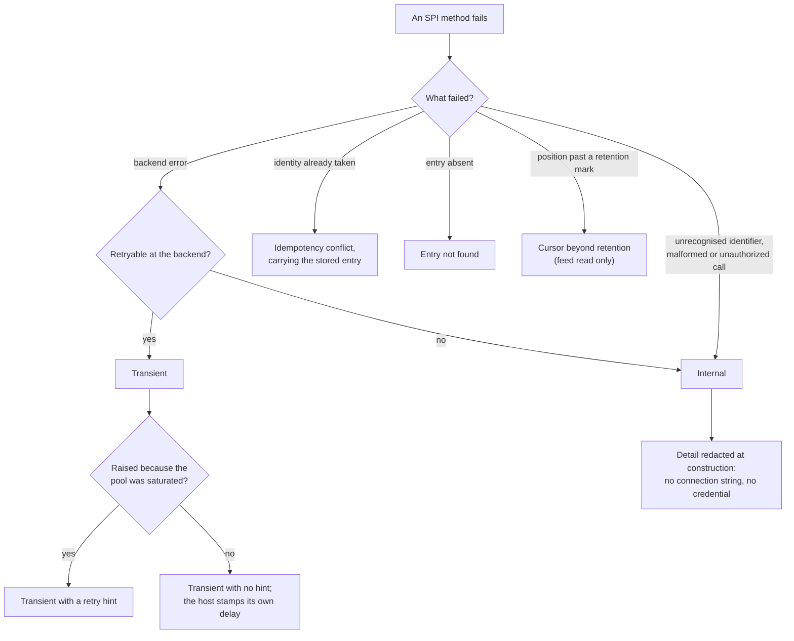

Created:  2026-09-26 by Virtuozzo International GmbH
Updated:  2026-09-26 by Virtuozzo International GmbH

# Feature: Error Classification & Transport Security

- [ ] `p2` - **ID**: `cpt-cf-uc-plugin-featstatus-error-classification-transport-security-implemented`

- [ ] `p2` - `cpt-cf-uc-plugin-feature-error-classification-transport-security`

Owns the boundary every SPI call crosses: the adapter that translates backend
failures into the SPI's six-variant error vocabulary, and the two security
obligations that fall to this plugin alone. Covers the transient-or-internal
classification and its retry hint, transport confidentiality on every database
connection, credential non-disclosure, and injection-safe translation of the
host-supplied query.

<!-- toc -->

- [1. Feature Context](#1-feature-context)
  - [1.1 Overview](#11-overview)
  - [1.2 Purpose](#12-purpose)
  - [1.3 Actors](#13-actors)
  - [1.4 References](#14-references)
- [2. Actor Flows (CDSL)](#2-actor-flows-cdsl)
  - [Host Receives a Classified Failure From the SPI](#host-receives-a-classified-failure-from-the-spi)
  - [Operator Chooses the Database Transport Mode](#operator-chooses-the-database-transport-mode)
- [3. Processes / Business Logic (CDSL)](#3-processes--business-logic-cdsl)
  - [Backend Error Classification](#backend-error-classification)
  - [SSL Mode Resolution](#ssl-mode-resolution)
  - [Credential Redaction](#credential-redaction)
  - [Injection-Safe Query Translation](#injection-safe-query-translation)
- [4. States (CDSL)](#4-states-cdsl)
- [5. Definitions of Done](#5-definitions-of-done)
  - [The Six-Variant Error Vocabulary on Every SPI Method](#the-six-variant-error-vocabulary-on-every-spi-method)
  - [A Retry Hint Only Where Saturation Caused the Transient](#a-retry-hint-only-where-saturation-caused-the-transient)
  - [Typed Domain Variants Raised Only Where They Are Meaningful](#typed-domain-variants-raised-only-where-they-are-meaningful)
  - [A Host-Contract Breach Surfaces as Internal](#a-host-contract-breach-surfaces-as-internal)
  - [TLS by Default on Every Database Connection](#tls-by-default-on-every-database-connection)
  - [The Connection Credential Never Reaches a Diagnostic](#the-connection-credential-never-reaches-a-diagnostic)
  - [Bound Values and Allowlisted Identifiers Cover the Whole Translation](#bound-values-and-allowlisted-identifiers-cover-the-whole-translation)
  - [Metadata Predicates Parameterize Both the Key and the Value](#metadata-predicates-parameterize-both-the-key-and-the-value)
- [6. Acceptance Criteria](#6-acceptance-criteria)

<!-- /toc -->

## 1. Feature Context

### 1.1 Overview

A cross-cutting boundary feature. Every one of the plugin's seven SPI methods
returns through it, and every database connection the plugin opens is built under
it. It owns no read path and no write path of its own: it owns what those paths
are allowed to say when they fail, and what the connection under them is allowed
to carry.

The error vocabulary is small on purpose. Six variants, each with a fixed
meaning, so the host can decide between retry and fail-closed without parsing a
backend message. The security obligations are narrow for the same reason: the
plugin does not authenticate or authorize anyone, but it is the only component
that holds a database credential, opens a connection, and turns an untrusted
query shape into SQL.

**Traces to**: `cpt-cf-uc-plugin-fr-error-classification`,
`cpt-cf-uc-plugin-nfr-transport-security`

### 1.2 Purpose

`cpt-cf-usage-collector-adr-pluggable-storage` makes the SPI (Service Provider
Interface -- the in-process trait the gear dispatches through) the single seam to
storage. Two consequences follow, and this feature is both of them.

The first is the error contract. The host binds whichever backend an operator
configured, so it cannot know that backend's failure surface. If a plugin leaked
raw backend errors, the host would have to parse them to decide whether to retry,
and that parsing would be backend-specific -- exactly what the seam exists to
prevent. A stable classified vocabulary is what lets retry and fail-closed
behavior live in the host and stay the same across backends. That is
`cpt-cf-usage-collector-nfr-plugin-contract-stability` realized at the storage
tier.

The second is security. In the gear-plus-plugin split this plugin is the only
component that holds a database credential, opens the connection to the store,
and translates a caller-supplied filter into query text. Transport
confidentiality, credential non-disclosure and injection safety are therefore
its obligations and nobody else's. Caller authentication and authorization stay
with the gear core, which settles both before every SPI call.

Transport defaults matter because the failure is silent. Several PostgreSQL SSL
modes fall back to plaintext without signalling it, so a deployment can believe
it is encrypted while it is not. This feature raises those modes rather than
trusting operator convention, preserves a stronger choice the operator actually
made, and treats an explicit disable as the one deliberate plaintext path -- with
a warning, so the choice is visible in the record.

**Requirements**: `cpt-cf-uc-plugin-fr-error-classification`,
`cpt-cf-uc-plugin-nfr-transport-security`

**Principles**: none. The SPI-conformance principle that fixes the error
vocabulary is carried by
`cpt-cf-uc-plugin-feature-registration-schema-provisioning`, which gates release
on the contract suite. This feature implements the classification behind it.

**Constraints**: `cpt-cf-uc-plugin-constraint-injection-safe-translation`

**Component**: `cpt-cf-uc-plugin-component-adapter`. The claim covers the
adapter's error-translation and transport responsibilities. Each SPI method arm
the adapter carries is delivered by the feature that owns that method, so this
feature does not wait on them.

**Scope boundary.** Caller authentication, authorization and attribution
enforcement are performed by the gear core before every SPI call and are never
repeated here. At-rest encryption, key management and masking are delegated to
the operator's database deployment. Closed-shape metadata validation stays
upstream: this feature parameterizes whatever metadata key the caller supplies
and does not check it against the type's declared fields. The connection pool
itself is built by
`cpt-cf-uc-plugin-feature-registration-schema-provisioning`; this feature decides
how the connection under it is secured. The handling of a start mode a later
gear version adds -- a wildcard arm that fails loudly rather than guessing --
follows from the SPI-conformance principle that feature carries; what this
feature supplies is the internal variant such an arm returns. The security and
error-rate instruments are declared by
`cpt-cf-uc-plugin-feature-observability-metrics`; this feature records through
them.

### 1.3 Actors

| Actor | Role in Feature |
|-------|-----------------|
| `cpt-cf-uc-plugin-actor-plugin-host` | The Usage Collector gear core. Receives every classified error and applies retry or fail-closed behavior from the variant alone, without parsing a backend message |
| `cpt-cf-usage-collector-actor-platform-operator` | Chooses the database connection's SSL mode and supplies the credential inside it, and is the recipient of the warning a deliberate plaintext connection emits |

### 1.4 References

- **PRD**: [PRD.md](../PRD.md) -- section 5.5 Typed Error Classification
  (`cpt-cf-uc-plugin-fr-error-classification`); section 6.1 Transport & Query
  Security (`cpt-cf-uc-plugin-nfr-transport-security`); section 6.2 NFR
  Exclusions, which places authentication, authorization and data protection
  outside the plugin; section 3.1 Gear-Specific Environment Constraints, for the
  TLS-capable endpoint requirement
- **Design**: [DESIGN.md](../DESIGN.md) -- section 2.2 Injection-Safe Query
  Translation; section 3.2 SPI Storage Adapter; section 3.3 API Contracts, for
  the six variants and the retry-hint rule; section 3.5 External Dependencies,
  for the SSL-mode resolution and the redacted connection secret; section 4.4
  Non-Applicable Design Domains, for what is delegated to the operator
- **ADR**:
  [ADR-0002](../../../../docs/ADR/0002-cpt-cf-usage-collector-adr-pluggable-storage.md)
  (`cpt-cf-usage-collector-adr-pluggable-storage`) -- the seam that makes the
  plugin the sole credential holder and query translator, and that requires a
  backend-neutral error vocabulary across it
- **Decomposition**: [DECOMPOSITION.md](../DECOMPOSITION.md) -- entry 2.10
- **Interfaces**: `cpt-cf-uc-plugin-interface-spi`. The error contract applies to
  all seven of its methods
- **Contracts**: `cpt-cf-uc-plugin-contract-timescaledb`, whose transport is the
  database wire protocol secured under this feature
- **Entities**: the plugin error type, the redacted connection secret, and the
  storage-typed bind value. All three are plugin-local rather than SPI-visible,
  apart from the error type itself
- **Sequences**: none. Error translation and parameter binding are steps inside
  every sequence the other features own rather than a flow of their own
- **Dependencies**: `cpt-cf-uc-plugin-feature-registration-schema-provisioning`.
  The SSL-mode resolution and the redacted connection secret are properties of
  the pool that feature builds, and the column allowlist is defined over the
  schema it provisions. This feature does not depend on the read and write paths
  whose errors it classifies: the translation is written against the backend's
  error surface, not against any one path

**Data**: none. The schema, and the column allowlist's source of truth, are
provisioned by
`cpt-cf-uc-plugin-feature-registration-schema-provisioning`; this feature adds no
schema object.

## 2. Actor Flows (CDSL)

Two flows. One is the host's: receive a failure it can act on without knowing
what backend produced it. The other is the operator's: choose a transport mode
and have the plugin either honour it or raise it.

### Host Receives a Classified Failure From the SPI

- [ ] `p2` - **ID**: `cpt-cf-uc-plugin-flow-host-receives-classified-failure`

**Actor**: `cpt-cf-uc-plugin-actor-plugin-host`

**Success Scenarios**:
- A backend failure that will clear on its own arrives as a transient, and the
  host retries without inspecting any message text.
- A transient raised because the pool was saturated carries a retry hint, so the
  host can back off rather than retry immediately into the same saturation.
- A duplicate identity arrives as an idempotency conflict carrying the stored
  entry, which is what the host needs to report an already-withdrawn target.
- A feed position that retention has passed arrives as the cursor-beyond-retention
  variant, distinct from every other refusal, so the host can tell a consumer to
  restart rather than retry.

**Error Scenarios**:
- A backend failure that will not clear arrives as internal, and the host fails
  closed rather than retrying.
- A malformed or unauthorized call reaches the SPI. It is a host-contract breach,
  surfaced as internal, because every such check was settled before dispatch.
- A query names an identifier the column allowlist does not carry. It is rejected
  as internal rather than emitted into query text.
- A failure detail would otherwise carry the connection string. It is redacted at
  its construction site, so no caller and no log ever sees it.

**Steps**:
1. [ ] - `p2` - Host invokes any of the seven SPI methods through the registered scoped client - `inst-cls-invoke`
2. [ ] - `p2` - Plugin executes the call and, on failure, classifies it with `cpt-cf-uc-plugin-algo-backend-error-classification` - `inst-cls-classify`
3. [ ] - `p2` - **IF** the outcome is transient, attach a retry hint only when the cause was pool saturation, and leave it unset otherwise - `inst-cls-hint`
4. [ ] - `p2` - **IF** the outcome is internal, build its detail through `cpt-cf-uc-plugin-algo-credential-redaction` so no credential can travel with it - `inst-cls-redact`
5. [ ] - `p2` - Record the outcome on the backend error counter under its classification label, so a retryable failure is distinguishable from a non-retryable one - `inst-cls-record`
6. [ ] - `p2` - **RETURN** exactly one of the six declared variants; no backend error reaches the host unclassified - `inst-cls-return`

### Operator Chooses the Database Transport Mode

- [ ] `p2` - **ID**: `cpt-cf-uc-plugin-flow-operator-selects-transport-mode`

**Actor**: `cpt-cf-usage-collector-actor-platform-operator`

**Success Scenarios**:
- The operator leaves the SSL mode unspecified. The plugin raises it to a
  required-TLS mode, so the default is encrypted rather than opportunistic.
- The operator sets a verifying mode. The plugin preserves it unchanged, because
  it is stronger than the floor this feature enforces.
- The operator sets an explicit disable for a non-production deployment. The
  plugin honours it and emits one warning per pool built, so the choice is
  visible in the record rather than silent.

**Error Scenarios**:
- The operator sets a mode that can fall back to plaintext without signalling it.
  The plugin raises it to a required-TLS mode rather than honouring the fallback,
  because the fallback is undetectable from inside the deployment.
- The database endpoint is not TLS-capable while a required mode is in force.
  The connection fails, and the failure is visible as a handshake failure rather
  than as a silent downgrade to plaintext.
- The connection string would otherwise appear in a log line, an error message or
  debug output. It cannot, because it is held redacted from the moment it is
  read.

**Steps**:
1. [ ] - `p2` - Operator supplies the database connection string, including any SSL mode, through the gear's configuration surface - `inst-tls-operator-sets`
2. [ ] - `p2` - Plugin holds the connection string in a redacted secret wrapper from the moment it is read - `inst-tls-wrap`
3. [ ] - `p2` - Plugin resolves the effective SSL mode with `cpt-cf-uc-plugin-algo-ssl-mode-resolution` before the pool is built - `inst-tls-resolve`
4. [ ] - `p2` - **IF** the resolved mode is the explicit plaintext one, emit one warning for this pool build and proceed - `inst-tls-warn-once`
5. [ ] - `p2` - Plugin builds every connection in the pool under the resolved mode, so no connection in the pool is weaker than another - `inst-tls-uniform-pool`
6. [ ] - `p2` - Count a failed handshake on the security counter, so a rejected connection is distinguishable from a rejected query - `inst-tls-count-handshake`
7. [ ] - `p2` - **RETURN** a pool whose transport mode is at least the configured one and never silently weaker - `inst-tls-return`

## 3. Processes / Business Logic (CDSL)

Four processes. The first fixes the error vocabulary; the next two secure the
connection and the credential inside it; the last secures the translation from a
host-supplied query shape into SQL.

### Backend Error Classification

- [ ] `p2` - **ID**: `cpt-cf-uc-plugin-algo-backend-error-classification`

**Input**: a failure raised anywhere inside an SPI method -- a backend error, a
translation refusal, or a domain outcome the store determined.

**Output**: exactly one of the SPI's six error variants.

**Steps**:
1. [ ] - `p2` - **IF** the store reported a duplicate identity whose caller-supplied fields diverge, **RETURN** the idempotency-conflict variant carrying the idempotency key and the stored entry - `inst-err-conflict`
2. [ ] - `p2` - **IF** the store found no entry for a point read under the caller's scope, **RETURN** the entry-not-found variant - `inst-err-not-found`
3. [ ] - `p2` - **IF** a feed read found a retention mark standing above the presented position, **RETURN** the cursor-beyond-retention variant; no other method may raise it - `inst-err-cursor-retention`
4. [ ] - `p2` - Declare the not-converged variant unreachable at this plugin's level, because the declared dedup level converges every identity at commit; keep it in the vocabulary, and never return it - `inst-err-not-converged-unreachable`
5. [ ] - `p2` - **IF** the backend failure will clear on its own -- a connection loss, a deadlock-victim abort, a serialization failure, a lock or statement timeout, a pool acquire timeout -- **RETURN** the transient variant - `inst-err-transient`
6. [ ] - `p2` - **IF** the transient was raised because the pool was saturated, attach a fixed short retry hint, because the plugin cannot know when a connection frees and a precise figure would imply precision it does not have - `inst-err-saturation-hint`
7. [ ] - `p2` - **ELSE** leave a transient's hint unset, so the host stamps its own configured delay and the caller is never left without one - `inst-err-no-hint`
8. [ ] - `p2` - **IF** the call was malformed or unauthorized, **RETURN** the internal variant; it is a host-contract breach, because both were settled before dispatch - `inst-err-host-breach`
9. [ ] - `p2` - **IF** translation rejected an identifier the column allowlist does not carry, **RETURN** the internal variant - `inst-err-unknown-identifier`
10. [ ] - `p2` - **ELSE RETURN** the internal variant for any unclassified backend failure, with its detail built through `cpt-cf-uc-plugin-algo-credential-redaction` - `inst-err-internal`
11. [ ] - `p2` - Record every outcome on the backend error counter under its transient-or-internal label - `inst-err-record`
12. [ ] - `p2` - **RETURN** the variant; classify by cause rather than by which method was called, so the same backend failure maps the same way on every path - `inst-err-return`

### SSL Mode Resolution

- [ ] `p2` - **ID**: `cpt-cf-uc-plugin-algo-ssl-mode-resolution`

**Input**: the connection string as the operator supplied it.

**Output**: the effective SSL mode every connection in the pool is built under.

**Steps**:
1. [ ] - `p2` - Read the SSL mode out of the connection options rather than trusting the deployment's convention - `inst-ssl-read-mode`
2. [ ] - `p2` - **IF** the mode is unspecified, or is one of the modes that can fall back to plaintext without signalling it, raise it to the required-TLS mode - `inst-ssl-raise-silent-fallbacks`
3. [ ] - `p2` - Raise rather than reject, because a silent fallback is undetectable from inside the deployment and a raised mode fails visibly instead - `inst-ssl-why-raise`
4. [ ] - `p2` - **IF** the mode is a verifying one, preserve it unchanged; it is stronger than the floor and the operator chose it deliberately - `inst-ssl-preserve-stronger`
5. [ ] - `p2` - **IF** the mode is the explicit disable, honour it as the single plaintext path and emit one warning for this pool build - `inst-ssl-honour-explicit-disable`
6. [ ] - `p2` - Emit that warning once per pool built rather than once per connection, so a deliberate choice is recorded without flooding the log - `inst-ssl-warn-cadence`
7. [ ] - `p2` - Apply the resolved mode to every connection the pool creates, so no connection is weaker than the pool's stated mode - `inst-ssl-apply-uniform`
8. [ ] - `p2` - **RETURN** the effective mode - `inst-ssl-return`

### Credential Redaction

- [ ] `p2` - **ID**: `cpt-cf-uc-plugin-algo-credential-redaction`

**Input**: the connection string, and any diagnostic the plugin is about to
construct.

**Output**: a value that cannot render the credential, whatever it is formatted
into.

**Steps**:
1. [ ] - `p2` - Hold the connection string in a secret wrapper whose debug rendering is redacted, from the moment it is read out of configuration - `inst-red-wrap-at-read`
2. [ ] - `p2` - Rely on the wrapper rather than on discipline at each call site, so a future log line added elsewhere cannot leak it by accident - `inst-red-why-wrapper`
3. [ ] - `p2` - Build every internal error's detail at its construction site with the connection string excluded, not filtered out afterwards - `inst-red-construct-clean`
4. [ ] - `p2` - Keep the credential out of logs, error messages, panic output and debug rendering alike; a panic is a diagnostic path like any other - `inst-red-all-paths`
5. [ ] - `p2` - **RETURN** the redacted value - `inst-red-return`

### Injection-Safe Query Translation

- [ ] `p2` - **ID**: `cpt-cf-uc-plugin-algo-injection-safe-translation`

**Input**: the host-supplied filter, aggregation and pagination shape.

**Output**: a statement in which no caller-supplied string appears in the query
text.

**Steps**:
1. [ ] - `p2` - Split the translation surface in two: things that are values and things that are SQL identifiers; each has its own mechanism and neither covers the other - `inst-inj-two-mechanisms`
2. [ ] - `p2` - Convert every comparison value from the host-supplied query -- the scope and tenant predicate, the covered-period range, the cursor seek key -- into a storage-typed bind value - `inst-inj-values-typed`
3. [ ] - `p2` - Pass every such value as a bound parameter and never concatenate one into the statement text - `inst-inj-bind-never-concat`
4. [ ] - `p2` - **FOR EACH** identifier that must appear as a SQL identifier -- a filterable or orderable column -- map it through a closed allowlist of ledger columns - `inst-inj-allowlist-identifiers`
5. [ ] - `p2` - **IF** an identifier is not in the allowlist, reject the call as internal rather than emitting it into the statement - `inst-inj-reject-unknown`
6. [ ] - `p2` - Compile a metadata predicate so that both the metadata key and the compared value are bound parameters, since a metadata key is a value rather than an identifier and needs no allowlist - `inst-inj-metadata-both-bound`
7. [ ] - `p2` - Do not check the supplied metadata key against the usage type's declared fields; closed-shape validation stays upstream and this step only parameterizes whatever key arrives - `inst-inj-no-shape-validation`
8. [ ] - `p2` - Treat the two mechanisms together as covering the whole translation surface, so no third path exists in which a caller string could reach query text - `inst-inj-surface-complete`
9. [ ] - `p2` - **RETURN** the statement and its bound parameters - `inst-inj-return`

## 4. States (CDSL)

**Not applicable.** Neither half of this feature carries a lifecycle. An error
classification is a pure function of one failure: the same cause maps to the same
variant on every call, nothing is carried between calls, and there is no
degraded, tripped or recovering mode to keep consistent -- the plugin opens no
circuit breaker and retains no memory of a previous failure. The transport side
is settled once, before the pool is built: the effective SSL mode is resolved
from configuration, applied to every connection the pool creates, and never
renegotiated at runtime, so there is no upgraded or downgraded state to
transition between. The one signal that does have a lifecycle -- backend
readiness -- is modelled in
`cpt-cf-uc-plugin-feature-observability-metrics`, whose gauge it is. Modelling a
state machine here would introduce states the implementation must then keep in
step with facts it recomputes per call.

## 5. Definitions of Done

### The Six-Variant Error Vocabulary on Every SPI Method

- [ ] `p2` - **ID**: `cpt-cf-uc-plugin-dod-six-variant-error-vocabulary`

The system **MUST** return one of the SPI's six declared error variants from
every one of its seven methods, and **MUST NOT** let any backend error reach the
host unclassified. Each backend failure **MUST** be classified either as
transient and retryable or as internal and non-retryable, so the host can apply
retry and fail-closed behavior from the variant alone without backend-specific
parsing. Classification **MUST** be made from the cause rather than from which
method was called, so one backend failure maps the same way on every path. Every
outcome **MUST** be recorded on the backend error counter under its
classification.

**Implements**:
- `cpt-cf-uc-plugin-flow-host-receives-classified-failure`
- `cpt-cf-uc-plugin-algo-backend-error-classification`

**Requirements**: `cpt-cf-uc-plugin-fr-error-classification`

**Touches**:
- API: All seven `UsageCollectorPluginV1` methods (error contract applies to each)
- Interface: `cpt-cf-uc-plugin-interface-spi`
- Component: `cpt-cf-uc-plugin-component-adapter`
- Entities: `UsageCollectorPluginError`

### A Retry Hint Only Where Saturation Caused the Transient

- [ ] `p2` - **ID**: `cpt-cf-uc-plugin-dod-transient-retry-hint`

The system **MUST** attach a retry hint to a transient raised because the
connection pool was saturated, so a caller can tell a busy backend from a failed
one and back off rather than retry straight back into the saturation. The hint
**MUST** be a fixed short delay rather than a computed one, because the plugin
cannot know when a connection frees and a computed figure would imply a precision
it does not have. A transient from any other cause **MUST** leave the hint unset,
so the host stamps its own configured delay and no caller is left without one.

**Implements**:
- `cpt-cf-uc-plugin-algo-backend-error-classification`

**Requirements**: `cpt-cf-uc-plugin-fr-error-classification`

**Touches**:
- API: All seven `UsageCollectorPluginV1` methods (error contract applies to each)
- Interface: `cpt-cf-uc-plugin-interface-spi`
- Component: `cpt-cf-uc-plugin-component-adapter`

### Typed Domain Variants Raised Only Where They Are Meaningful

- [ ] `p2` - **ID**: `cpt-cf-uc-plugin-dod-typed-domain-variants`

The system **MUST** raise the cursor-beyond-retention variant from the feed read
alone, so the host can distinguish a consumer that has fallen behind retention
from every other refusal. It **MUST** declare the not-converged variant
unreachable at this plugin's level and never return it, because the declared
dedup level converges every identity at commit; the variant **MUST** remain in
the vocabulary, since it is the gear's to define. The idempotency-conflict
variant **MUST** carry the idempotency key and the stored entry, and the
entry-not-found variant **MUST** be raised only where a point read under the
caller's scope found nothing.

**Implements**:
- `cpt-cf-uc-plugin-algo-backend-error-classification`

**Requirements**: `cpt-cf-uc-plugin-fr-error-classification`

**Touches**:
- API: All seven `UsageCollectorPluginV1` methods (error contract applies to each)
- Interface: `cpt-cf-uc-plugin-interface-spi`
- Entities: `UsageCollectorPluginError`

### A Host-Contract Breach Surfaces as Internal

- [ ] `p2` - **ID**: `cpt-cf-uc-plugin-dod-host-contract-breach-internal`

The system **MUST** surface a malformed or unauthorized call that reaches the SPI
as internal, and **MUST NOT** carve a validation or authorization variant for it.
Both were settled by the gear core before dispatch, so a call that arrives
malformed is a breach of the host's contract rather than a caller mistake the
plugin can report usefully. The plugin **MUST NOT** re-validate attribution,
metadata shape, idempotency-key presence or authorization in order to produce a
better-shaped error.

**Implements**:
- `cpt-cf-uc-plugin-algo-backend-error-classification`

**Requirements**: `cpt-cf-uc-plugin-fr-error-classification`

**Touches**:
- API: All seven `UsageCollectorPluginV1` methods (error contract applies to each)
- Component: `cpt-cf-uc-plugin-component-adapter`
- Interface: `cpt-cf-uc-plugin-interface-spi`

### TLS by Default on Every Database Connection

- [ ] `p2` - **ID**: `cpt-cf-uc-plugin-dod-tls-by-default`

The system **MUST** resolve the database connection's SSL mode before the pool is
built, rather than trusting operator convention. An unspecified mode and every
mode that can fall back to plaintext without signalling it **MUST** be raised to
a required-TLS mode. A stronger, verifying operator choice **MUST** be preserved
unchanged. An explicit disable **MUST** be honoured as the single plaintext path,
reserved for non-production use, and **MUST** emit exactly one warning per pool
built. The resolved mode **MUST** apply to every connection the pool creates, so
no connection is weaker than the pool's stated mode, and no connection **MAY**
reach plaintext without that explicit disable.

**Implements**:
- `cpt-cf-uc-plugin-flow-operator-selects-transport-mode`
- `cpt-cf-uc-plugin-algo-ssl-mode-resolution`

**Requirements**: `cpt-cf-uc-plugin-nfr-transport-security`

**Touches**:
- API: Database connection over the PostgreSQL wire protocol, TLS by default
- Contract: `cpt-cf-uc-plugin-contract-timescaledb`
- Component: `cpt-cf-uc-plugin-component-adapter`

### The Connection Credential Never Reaches a Diagnostic

- [ ] `p2` - **ID**: `cpt-cf-uc-plugin-dod-credential-non-disclosure`

The system **MUST** hold the database connection string in a secret wrapper whose
debug rendering is redacted, from the moment it is read out of configuration, so
that no log line, error message, panic output or debug rendering can disclose the
credential it embeds. Internal error details **MUST** be built free of the
connection string at their construction site rather than filtered afterwards. The
guarantee **MUST** rest on the wrapper rather than on discipline at each call
site, so a diagnostic added later cannot leak it by accident.

**Implements**:
- `cpt-cf-uc-plugin-algo-credential-redaction`

**Requirements**: `cpt-cf-uc-plugin-nfr-transport-security`

**Touches**:
- API: Database connection over the PostgreSQL wire protocol, TLS by default
- Component: `cpt-cf-uc-plugin-component-adapter`
- Entities: `Redacted connection secret`

### Bound Values and Allowlisted Identifiers Cover the Whole Translation

- [ ] `p2` - **ID**: `cpt-cf-uc-plugin-dod-bound-values-allowlisted-identifiers`

The system **MUST** build every statement without interpolating a caller-supplied
string into the query text, using exactly two mechanisms that together cover the
whole translation surface. Every comparison value from the host-supplied query --
the scope and tenant predicate, the covered-period range, the cursor seek key --
**MUST** be converted to a storage-typed bind value and passed as a bound
parameter. Every string that must appear as a SQL identifier **MUST** be mapped
through a closed allowlist of ledger columns, and an identifier outside that
allowlist **MUST** be rejected as internal rather than emitted. No third path
**MAY** exist by which a caller-supplied string reaches query text.

**Implements**:
- `cpt-cf-uc-plugin-algo-injection-safe-translation`

**Requirements**: `cpt-cf-uc-plugin-nfr-transport-security`

**Constraints**: `cpt-cf-uc-plugin-constraint-injection-safe-translation`

**Touches**:
- API: All seven `UsageCollectorPluginV1` methods (error contract applies to each)
- Component: `cpt-cf-uc-plugin-component-adapter`
- DB Table: `cpt-cf-uc-plugin-dbtable-usage-records`
- Entities: `SqlBind`

### Metadata Predicates Parameterize Both the Key and the Value

- [ ] `p2` - **ID**: `cpt-cf-uc-plugin-dod-metadata-predicate-parameterization`

The system **MUST** compile a metadata predicate so that both the metadata key
and the compared value are bound parameters. A metadata key is a value rather
than a SQL identifier, so it needs no allowlist, and binding it is what keeps the
predicate injection-safe. The plugin **MUST NOT** validate the supplied key
against the usage type's declared metadata fields: closed-shape validation stays
upstream, and this path only parameterizes whatever key the caller supplied.

**Implements**:
- `cpt-cf-uc-plugin-algo-injection-safe-translation`

**Requirements**: `cpt-cf-uc-plugin-nfr-transport-security`

**Constraints**: `cpt-cf-uc-plugin-constraint-injection-safe-translation`

**Touches**:
- API: All seven `UsageCollectorPluginV1` methods (error contract applies to each)
- Component: `cpt-cf-uc-plugin-component-adapter`
- DB Table: `cpt-cf-uc-plugin-dbtable-usage-records`

## 6. Acceptance Criteria

- [ ] Every SPI method returns only the six declared error variants, verified by a test per method per reachable variant.
- [ ] A connection loss, a deadlock-victim abort, a serialization failure, a lock timeout, a statement timeout and a pool acquire timeout each classify as transient.
- [ ] An unclassified backend failure classifies as internal rather than being passed through in any raw form.
- [ ] The same backend failure raised under two different SPI methods classifies to the same variant, which shows classification is by cause rather than by method.
- [ ] A transient raised because the pool was saturated carries a retry hint, and the hint is a fixed short delay rather than a computed one.
- [ ] A transient from any other cause leaves the retry hint unset.
- [ ] The cursor-beyond-retention variant is raised by the feed read and by no other method, verified by exercising every other method against the conditions that would otherwise resemble it.
- [ ] The not-converged variant is never returned by any method, while remaining present in the vocabulary the plugin compiles against.
- [ ] An idempotency conflict carries the idempotency key and the stored entry.
- [ ] A point read that finds nothing under the caller's scope returns entry-not-found rather than internal.
- [ ] A malformed call that reaches the SPI returns internal, and the plugin performs no re-validation of attribution, metadata shape, idempotency-key presence or authorization in producing it.
- [ ] Every error outcome increments the backend error counter under a label matching its classification.
- [ ] A connection string with no SSL mode set builds a pool whose connections use a required-TLS mode.
- [ ] A connection string set to a mode that can fall back to plaintext builds a pool whose connections use a required-TLS mode.
- [ ] A connection string set to a verifying mode builds a pool that preserves that mode unchanged.
- [ ] A connection string with an explicit disable builds a plaintext pool and emits exactly one warning for that pool build, not one per connection.
- [ ] No pool built without an explicit disable produces a plaintext connection, verified against a server that would accept one.
- [ ] A failed handshake against a non-TLS endpoint under a required mode fails the connection and increments the handshake-failure counter, rather than downgrading.
- [ ] Rendering the configuration value that holds the connection string produces a redacted value and never the credential.
- [ ] No log line, error message, panic output or debug rendering produced anywhere in the crate contains the connection string, verified by driving each failure path with a credential-bearing connection string.
- [ ] Internal error details produced at the adapter boundary contain no connection string or credential fragment.
- [ ] Every comparison value in a translated statement arrives as a bound parameter, verified by inspecting the generated statement text for the absence of caller-supplied literals.
- [ ] A filter naming a column outside the allowlist is rejected as internal, and the rejected identifier never appears in any emitted statement.
- [ ] An order-by naming a column outside the allowlist is rejected on the same terms.
- [ ] A metadata predicate binds both the metadata key and the compared value as parameters.
- [ ] A metadata key that is not among the usage type's declared fields is parameterized and executed rather than rejected, which shows closed-shape validation is not performed here.
- [ ] A filter value containing SQL syntax is stored and compared as data, and changes nothing about the shape of the executed statement.
