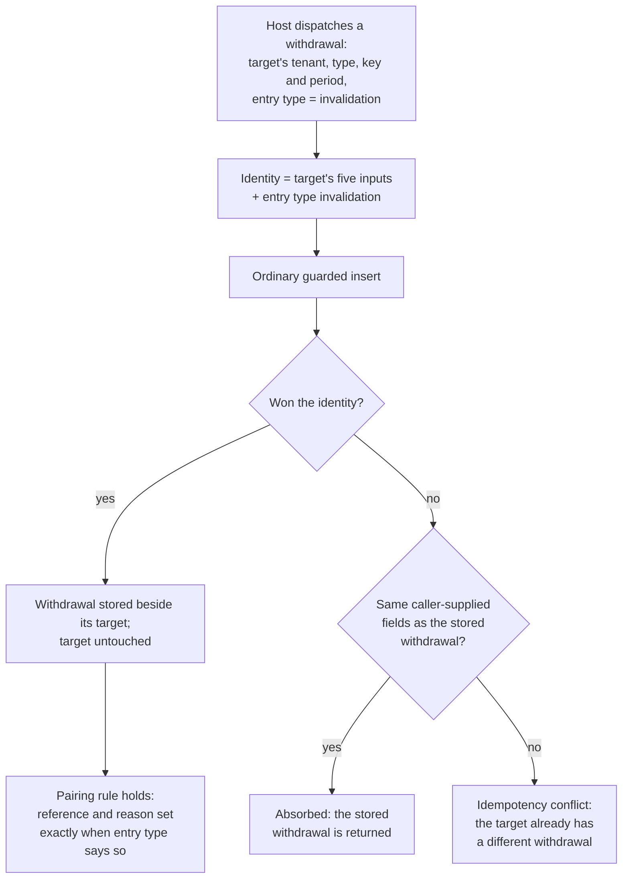

Created:  2026-09-26 by Virtuozzo International GmbH
Updated:  2026-09-26 by Virtuozzo International GmbH

# Feature: Invalidation Persistence

- [ ] `p1` - **ID**: `cpt-cf-uc-plugin-featstatus-invalidation-persistence-implemented`

- [ ] `p1` - `cpt-cf-uc-plugin-feature-invalidation-persistence`

Persists a withdrawal as an ordinary appended entry that names the entry it
withdraws and carries a reason code, never rewriting the withdrawn entry, and
admits at most one withdrawal per target. Covers the shared dedup identity every
withdrawal of one target carries, the storage-enforced pairing rule, and the
lookup index the aggregate fold's exclusion rule reads.

<!-- toc -->

- [1. Feature Context](#1-feature-context)
  - [1.1 Overview](#11-overview)
  - [1.2 Purpose](#12-purpose)
  - [1.3 Actors](#13-actors)
  - [1.4 References](#14-references)
- [2. Actor Flows (CDSL)](#2-actor-flows-cdsl)
  - [Host Persists a Withdrawal](#host-persists-a-withdrawal)
- [3. Processes / Business Logic (CDSL)](#3-processes--business-logic-cdsl)
  - [Withdrawal Identity Derivation](#withdrawal-identity-derivation)
  - [Withdrawal Pairing Enforcement](#withdrawal-pairing-enforcement)
  - [Withdrawal Reference Lookup](#withdrawal-reference-lookup)
- [4. States (CDSL)](#4-states-cdsl)
  - [Entry Withdrawal State Machine](#entry-withdrawal-state-machine)
- [5. Definitions of Done](#5-definitions-of-done)
  - [A Withdrawal Is an Appended Entry](#a-withdrawal-is-an-appended-entry)
  - [At Most One Withdrawal per Target, by Shared Identity](#at-most-one-withdrawal-per-target-by-shared-identity)
  - [The Storage-Enforced Pairing Rule](#the-storage-enforced-pairing-rule)
  - [A Record and Its Withdrawal Coexist as Two Entries](#a-record-and-its-withdrawal-coexist-as-two-entries)
  - [The Withdrawn Entry Is Never Mutated or Deleted](#the-withdrawn-entry-is-never-mutated-or-deleted)
  - [Withdrawal-Reference Lookups Are Served by Their Index](#withdrawal-reference-lookups-are-served-by-their-index)
- [6. Acceptance Criteria](#6-acceptance-criteria)

<!-- /toc -->

## 1. Feature Context

### 1.1 Overview

A narrow feature on purpose. It writes nothing through a path of its own: a
withdrawal rides the same guarded insert statement every other entry does. What
makes it a feature is its correctness rule, which is separate from ingestion's
and has its own tests.

That rule is a single identity. Every withdrawal of one target carries the
target's tenant, GTS (Global Type System) type, idempotency key and covered
period, with the entry type set to a withdrawal. Two withdrawals of one entry
therefore collide as duplicates of each other, which is what bounds a target to
one withdrawal. Nothing in the store enforces that bound separately, and nothing
needs to.

**Traces to**: `cpt-cf-uc-plugin-fr-invalidation-persistence`

### 1.2 Purpose

`cpt-cf-usage-collector-adr-append-only-invalidation` makes a correction a new
fact rather than a mutation of history. A withdrawal is appended; the entry it
withdraws is never rewritten, flagged or deleted. Two things depend on that.

The first is auditability. Both the original measurement and its withdrawal stay
readable, so a reader can reconstruct what was claimed and what was retracted
rather than only the net result.

The second is the feed's snapshot guarantee. A status flip written onto a row
already delivered would be a mutation a paginated scan could observe, which is
exactly what a replay-safe feed may not have. Appending instead means a scan sees
only arrivals ahead of its position.

The at-most-one bound matters to arithmetic. The aggregate fold nets a withdrawn
pair out, and the materialised aggregate stores that netting as a signed sum and
a signed count. If a target could carry two withdrawals, the netting would
subtract twice and the stored aggregate would be wrong, with no row left to
contradict it. The dedup identity is what makes the second withdrawal impossible
rather than merely unlikely.

This feature mirrors the parent gear's record-invalidation feature at the storage
tier, and realizes the write side of its requirement.

**Requirements**: `cpt-cf-uc-plugin-fr-invalidation-persistence`

**Principles**: none. The write path's pure-persistence principle is carried by
`cpt-cf-uc-plugin-feature-record-ingestion-idempotency`, whose insert path this
feature reuses unchanged.

**Constraints**: none. The dedup-key constraint that produces the at-most-one
bound is carried by
`cpt-cf-uc-plugin-feature-record-ingestion-idempotency`; this feature applies it
to the withdrawal identity rather than restating it.

**Component**: none. The withdrawal rides the Record Store insert path claimed by
`cpt-cf-uc-plugin-feature-record-ingestion-idempotency`. This feature adds
behavior to that path rather than a component of its own.

**Scope boundary.** Validating that a withdrawal is a faithful copy of its target
is performed by the gear core before dispatch, and is never repeated here.
Resolving the target by lookup belongs to
`cpt-cf-uc-plugin-feature-raw-query-converged-lookup`. Excluding a withdrawn pair
from a fold belongs to
`cpt-cf-uc-plugin-feature-aggregated-query-rollup`, and ordering a withdrawal
after its target in the feed belongs to
`cpt-cf-uc-plugin-feature-usage-feed`. This feature's assertions land in the same
target ingest test suite as ingestion's; the split is by correctness rule and
review ownership, not by test binary.

### 1.3 Actors

| Actor | Role in Feature |
|-------|-----------------|
| `cpt-cf-uc-plugin-actor-plugin-host` | The Usage Collector gear core. Resolves the target, validates the faithful copy, derives the withdrawal's identifier and its reference to the target, then dispatches it through the ordinary persist methods |

### 1.4 References

- **PRD**: [PRD.md](../PRD.md) -- section 5.1 Invalidation Persistence
  (`cpt-cf-uc-plugin-fr-invalidation-persistence`); section 5.1 Idempotent
  Deduplication, from which the at-most-one bound follows; section 1.4 Glossary,
  for the entry and dedup-key definitions this feature turns on
- **Design**: [DESIGN.md](../DESIGN.md) -- section 3.1 Domain Model, for the
  withdrawal carried on the entry it belongs to and the relationship rule;
  section 3.7 `usage_records`, for the withdrawal reference and reason columns,
  the pairing check constraint and the withdrawal-reference index; section 2.2
  Dedup-Key Identity & Retention-Bounded Preservation; section 3.6 Ingest with
  idempotency dedup, whose read-back rule exists because of this feature
- **ADR**:
  [ADR-0010](../../../../docs/ADR/0010-cpt-cf-usage-collector-adr-append-only-invalidation.md)
  (`cpt-cf-usage-collector-adr-append-only-invalidation`) -- invalidation as the
  single correction primitive on an append-only ledger, with a withdrawal as an
  appended entry rather than a rewrite
- **Decomposition**: [DECOMPOSITION.md](../DECOMPOSITION.md) -- entry 2.3
- **Entities**: the withdrawal carried on its entry, the withdrawal entry itself,
  and the reason code. The withdrawal is not a separate stored entity: it is
  carried on the entry that declares itself one
- **Sequences**: none. A withdrawal follows the ingest sequences
  `cpt-cf-uc-plugin-feature-record-ingestion-idempotency` owns. Its distinguishing
  rule is the shared dedup identity described in DESIGN section 3.1, not a
  separate flow
- **Dependencies**: `cpt-cf-uc-plugin-feature-record-ingestion-idempotency`. A
  withdrawal is inserted through the same guarded statement, and its at-most-one
  bound is the dedup identity that feature establishes, applied with the entry
  type set to a withdrawal. It is separated out because the shared-identity rule
  is its own correctness property, not because it needs a second write path

**Data**: none. The ledger table, its pairing check constraint and its
withdrawal-reference index are provisioned by
`cpt-cf-uc-plugin-feature-registration-schema-provisioning`.

## 2. Actor Flows (CDSL)

One flow. It is the ordinary persist call with the entry type set to a
withdrawal, and the whole of this feature is what that difference implies.

### Host Persists a Withdrawal

- [ ] `p1` - **ID**: `cpt-cf-uc-plugin-flow-persist-withdrawal`

**Actor**: `cpt-cf-uc-plugin-actor-plugin-host`

**Success Scenarios**:
- A target with no withdrawal receives one. It is stored as a second entry under
  the same idempotency key and covered period as its target, distinguished by
  entry type, and the target row is not touched.
- The host retries a withdrawal after a lost acknowledgement. The retry is
  absorbed against the stored withdrawal and returns it, exactly as a retry of an
  ordinary entry is absorbed against its own row.
- A batch carries a record and its withdrawal together. They are two identities,
  so each is resolved against its own row and both persist.
- A batch carries retries of both a stored record and its stored withdrawal. Each
  absorbs against its own row.

**Error Scenarios**:
- A second, different withdrawal of the same target arrives. It collides with the
  first on their shared identity and returns an idempotency conflict carrying the
  stored withdrawal, which is how the host reports an already-withdrawn target.
- A withdrawal arrives with its reference or its reason code missing while its
  entry type declares it a withdrawal. The ledger's pairing check rejects it, so
  the declared kind and the withdrawal fields cannot disagree in storage.
- An ordinary measurement arrives carrying a withdrawal reference or a reason
  code. The same pairing check rejects it.
- The withdrawal's acceptance instant is outside the configured slack. It is
  refused as a retryable transient on the ordinary terms, since the guard runs
  ahead of every identity outcome.

**Steps**:
1. [ ] - `p1` - Host resolves the target, validates the withdrawal is a faithful copy of it, and derives the withdrawal's identifier and its reference to the target; none of this is repeated by the plugin - `inst-inv-host-prepares`
2. [ ] - `p1` - Host dispatches the withdrawal through the ordinary single or batch persist method, with the entry type declaring it a withdrawal - `inst-inv-dispatch`
3. [ ] - `p1` - Plugin derives no identity of its own; the withdrawal's identity follows from its fields per `cpt-cf-uc-plugin-algo-withdrawal-identity-derivation` - `inst-inv-identity`
4. [ ] - `p1` - **DB**: insert through the same guarded statement the ordinary write path uses, against `cpt-cf-uc-plugin-dbtable-usage-records` - `inst-inv-insert`
5. [ ] - `p1` - **DB**: the ledger's pairing rule of `cpt-cf-uc-plugin-algo-withdrawal-pairing-enforcement` admits the row only when its declared kind and its withdrawal fields agree - `inst-inv-pairing`
6. [ ] - `p1` - **IF** the row won its identity, **RETURN** the stored withdrawal; the withdrawn entry is neither updated nor deleted - `inst-inv-won`
7. [ ] - `p1` - **ELSE** resolve against the stored withdrawal on the ordinary duplicate terms: absorbed when identical, an idempotency conflict when divergent - `inst-inv-duplicate`
8. [ ] - `p1` - **RETURN** the outcome; a second, different withdrawal of one target is exactly the conflict case - `inst-inv-return`

## 3. Processes / Business Logic (CDSL)

Three processes. The first is where the at-most-one bound comes from, the second
is what keeps storage self-consistent, and the third is the read the fold's
exclusion rule depends on.

### Withdrawal Identity Derivation

- [ ] `p1` - **ID**: `cpt-cf-uc-plugin-algo-withdrawal-identity-derivation`

**Input**: a withdrawal entry as the gateway dispatched it.

**Output**: the dedup identity under which it is written.

**Steps**:
1. [ ] - `p1` - Take the tenant, the GTS type, the idempotency key and the covered period from the entry as supplied; a faithful copy carries its target's values in all four - `inst-wid-copy-four`
2. [ ] - `p1` - Take the entry type from the entry's own declared kind, never derived from whether a withdrawal reference happens to be present - `inst-wid-declared-kind`
3. [ ] - `p1` - Compose the identity from those inputs, which gives every withdrawal of one target the same identity - `inst-wid-compose`
4. [ ] - `p1` - Treat that shared identity as the source of the at-most-one bound: a second withdrawal of one target collides with the first as an ordinary duplicate - `inst-wid-at-most-one`
5. [ ] - `p1` - Add no store-side uniqueness rule over the withdrawal reference; a separate rule would be a second source of truth that could disagree with the dedup constraint - `inst-wid-no-second-rule`
6. [ ] - `p1` - Note that the identity differs from its target's in the entry type alone, so the pair are two rows sharing five columns - `inst-wid-pair-shape`
7. [ ] - `p1` - **RETURN** the identity; the plugin mints nothing, since the gateway already derived the entry identifier over these same inputs - `inst-wid-return`

### Withdrawal Pairing Enforcement

- [ ] `p1` - **ID**: `cpt-cf-uc-plugin-algo-withdrawal-pairing-enforcement`

**Input**: any entry offered to the ledger.

**Output**: an admitted row whose declared kind and withdrawal fields agree, or a
rejection.

**Steps**:
1. [ ] - `p1` - **DB**: evaluate the ledger's pairing check on every insert, ordinary measurements included - `inst-pair-evaluate`
2. [ ] - `p1` - Admit a row declaring itself a withdrawal only when both its withdrawal reference and its reason code are set - `inst-pair-withdrawal-both-set`
3. [ ] - `p1` - Admit a row declaring itself an ordinary measurement only when it carries neither - `inst-pair-measurement-neither`
4. [ ] - `p1` - Reject any other combination, so the declared kind and the withdrawal fields cannot disagree in storage - `inst-pair-reject-mismatch`
5. [ ] - `p1` - Store the withdrawal reference and the reason code exactly as the gateway supplied them, with no normalization of either - `inst-pair-store-verbatim`
6. [ ] - `p1` - Keep the check in the schema rather than in plugin code, so a write that bypassed the store's own path could not defeat it - `inst-pair-in-schema`
7. [ ] - `p1` - **RETURN** the admitted row, or the rejection - `inst-pair-return`

### Withdrawal Reference Lookup

- [ ] `p1` - **ID**: `cpt-cf-uc-plugin-algo-withdrawal-reference-lookup`

**Input**: a set of entry identifiers whose withdrawals are being sought, within
a covered-period range and a type partition.

**Output**: the withdrawals that name them.

**Steps**:
1. [ ] - `p1` - **DB**: read the ledger's withdrawal-reference index, which covers only rows that carry a reference - `inst-ref-index-read`
2. [ ] - `p1` - Match on the withdrawal reference together with the covered-period end and the type key, so the read prunes to the same partitions the fold is already scanning - `inst-ref-match-keys`
3. [ ] - `p1` - Treat the index as a lookup structure rather than a constraint: the at-most-one bound comes from the dedup identity and not from this index - `inst-ref-not-a-constraint`
4. [ ] - `p1` - Rely on a withdrawal sharing its target's covered-period end and type, which is what puts the pair in one chunk and lets retention drop them together - `inst-ref-same-chunk`
5. [ ] - `p1` - **RETURN** the withdrawals found; what the caller does with them, including excluding the pair from a fold, belongs to the feature that owns that read - `inst-ref-return`

## 4. States (CDSL)

### Entry Withdrawal State Machine

- [ ] `p2` - **ID**: `cpt-cf-uc-plugin-state-entry-withdrawal`

**States**: Standing, Withdrawn

**Initial State**: Standing

The state is modelled because its representation is the whole point of this
feature. It is **derived**, never stored: no column on the entry records it, and
no write ever changes the entry's own row. An entry is Withdrawn exactly when a
second entry exists that names it, and that is the only evidence there is.

**Transitions**:
1. [ ] - `p1` - **FROM** Standing **TO** Withdrawn **WHEN** a withdrawal naming this entry commits; the transition is the appearance of a new row, not a change to this one - `inst-ews-to-withdrawn`
2. [ ] - `p1` - **FROM** Withdrawn **TO** Withdrawn **WHEN** an identical withdrawal is re-submitted; it is absorbed against the stored one and nothing changes - `inst-ews-absorb`
3. [ ] - `p1` - **FROM** Withdrawn **TO** Withdrawn **WHEN** a divergent second withdrawal arrives; it collides on the shared identity and is refused, so the state cannot be reached twice - `inst-ews-second-refused`
4. [ ] - `p1` - **FROM** Withdrawn **TO** Standing never; there is no un-withdraw operation, and the store offers no way to delete the withdrawal that produced the state - `inst-ews-no-reversal`
5. [ ] - `p1` - **FROM** Withdrawn **TO** Withdrawn **WHEN** retention drops the chunk; the pair shares a covered-period end and a type, so both rows leave together and neither outlives the other - `inst-ews-retention-together`

## 5. Definitions of Done

### A Withdrawal Is an Appended Entry

- [ ] `p1` - **ID**: `cpt-cf-uc-plugin-dod-withdrawal-as-appended-entry`

The system **MUST** persist a withdrawal through the ordinary insert path as an
entry that names the entry it withdraws and carries a reason code, both stored
exactly as the gateway supplied them. It **MUST NOT** open a second write path
for withdrawals, and **MUST NOT** treat a withdrawal differently from any other
entry with respect to the admission guard, the durable acknowledgement, or the
batch result alignment.

**Implements**:
- `cpt-cf-uc-plugin-flow-persist-withdrawal`
- `cpt-cf-uc-plugin-algo-withdrawal-identity-derivation`

**Requirements**: `cpt-cf-uc-plugin-fr-invalidation-persistence`

**Touches**:
- API: `create_usage_record` (SPI, entry type `invalidation`), `create_usage_records` (SPI, entry type `invalidation`)
- DB Table: `cpt-cf-uc-plugin-dbtable-usage-records`
- Entities: `Invalidation`, `ReasonCode`

### At Most One Withdrawal per Target, by Shared Identity

- [ ] `p1` - **ID**: `cpt-cf-uc-plugin-dod-at-most-one-withdrawal`

The system **MUST** give every withdrawal of one target the same dedup identity
-- the target's tenant, GTS type, idempotency key and covered period, with the
entry type declaring a withdrawal -- so a second, divergent withdrawal collides
with the first and is refused as an idempotency conflict carrying the stored
withdrawal. The bound **MUST** follow from that identity and **MUST NOT** be
enforced by a separate store-side uniqueness rule over the withdrawal reference,
because a second rule could disagree with the dedup constraint. An identical
re-submission **MUST** be absorbed and return the stored withdrawal.

**Implements**:
- `cpt-cf-uc-plugin-algo-withdrawal-identity-derivation`
- `cpt-cf-uc-plugin-state-entry-withdrawal`

**Requirements**: `cpt-cf-uc-plugin-fr-invalidation-persistence`

**Touches**:
- API: `create_usage_record` (SPI, entry type `invalidation`), `create_usage_records` (SPI, entry type `invalidation`)
- DB Table: `cpt-cf-uc-plugin-dbtable-usage-records`
- Entities: `Invalidation`

### The Storage-Enforced Pairing Rule

- [ ] `p1` - **ID**: `cpt-cf-uc-plugin-dod-withdrawal-pairing-rule`

The system **MUST** admit a row whose withdrawal reference and reason code are
both set exactly when that row's entry type declares it a withdrawal, and
**MUST** reject every other combination. The entry type **MUST** be written from
the dispatched entry's declared kind and **MUST NOT** be derived from whether a
withdrawal reference is present. The rule **MUST** live in the schema rather than
in plugin code, so the declared kind and the withdrawal fields cannot disagree in
storage by any route.

**Implements**:
- `cpt-cf-uc-plugin-algo-withdrawal-pairing-enforcement`

**Requirements**: `cpt-cf-uc-plugin-fr-invalidation-persistence`

**Touches**:
- API: `create_usage_record` (SPI, entry type `invalidation`), `create_usage_records` (SPI, entry type `invalidation`)
- DB Table: `cpt-cf-uc-plugin-dbtable-usage-records`

### A Record and Its Withdrawal Coexist as Two Entries

- [ ] `p1` - **ID**: `cpt-cf-uc-plugin-dod-record-and-withdrawal-coexist`

The system **MUST** persist a record and its withdrawal as two distinct entries
under the same idempotency key and covered period, differing in entry type, and
**MUST** absorb a retry of either against its own stored row. A batch carrying
both **MUST** resolve each against its own row and **MUST NOT** treat them as a
collision. Every read-back of a conflicting row **MUST** key on the entry
identifier rather than on the five columns the pair shares, because a read by
those columns could return the withdrawal for a record retry or the record for a
withdrawal retry.

**Implements**:
- `cpt-cf-uc-plugin-flow-persist-withdrawal`
- `cpt-cf-uc-plugin-algo-withdrawal-identity-derivation`

**Requirements**: `cpt-cf-uc-plugin-fr-invalidation-persistence`

**Touches**:
- API: `create_usage_record` (SPI, entry type `invalidation`), `create_usage_records` (SPI, entry type `invalidation`)
- DB Table: `cpt-cf-uc-plugin-dbtable-usage-records`
- Entities: `UsageRecord`, `Invalidation`

### The Withdrawn Entry Is Never Mutated or Deleted

- [ ] `p1` - **ID**: `cpt-cf-uc-plugin-dod-no-mutation-of-target`

The system **MUST NOT** update, flag, tombstone or delete the entry a withdrawal
withdraws. Withdrawal status **MUST** remain derived from the presence of the
withdrawing entry and **MUST NOT** be stored on the withdrawn row, so that a
paginated scan observes no entry changing behind its position and the ledger
stays auditable in both directions. The store **MUST** offer no operation that
reverses a withdrawal.

**Implements**:
- `cpt-cf-uc-plugin-state-entry-withdrawal`

**Requirements**: `cpt-cf-uc-plugin-fr-invalidation-persistence`

**Touches**:
- DB Table: `cpt-cf-uc-plugin-dbtable-usage-records`
- Entities: `UsageRecord`

### Withdrawal-Reference Lookups Are Served by Their Index

- [ ] `p1` - **ID**: `cpt-cf-uc-plugin-dod-withdrawal-reference-index`

The system **MUST** serve withdrawal-reference lookups from the ledger's
withdrawal-reference index, matching on the reference together with the
covered-period end and the type key so the read prunes to the partitions the
calling read already scans. The index **MUST** be treated as a lookup structure
and **MUST NOT** be relied on as the source of the at-most-one bound. Because a
withdrawal copies its target's covered-period end and type, the pair **MUST**
land in one chunk, so retention removes both together and never one alone.

**Implements**:
- `cpt-cf-uc-plugin-algo-withdrawal-reference-lookup`

**Requirements**: `cpt-cf-uc-plugin-fr-invalidation-persistence`

**Touches**:
- DB Table: `cpt-cf-uc-plugin-dbtable-usage-records`

## 6. Acceptance Criteria

- [ ] Persisting a withdrawal of an entry that has none stores a second row and leaves the withdrawn row byte-for-byte unchanged.
- [ ] The stored withdrawal carries the withdrawal reference and the reason code exactly as dispatched, with no normalization of either.
- [ ] A second withdrawal of the same target, differing in any caller-supplied field, returns an idempotency conflict carrying the stored withdrawal.
- [ ] An identical re-submission of a stored withdrawal is absorbed and returns the stored withdrawal.
- [ ] The at-most-one bound is produced by the dedup identity: the ledger's dedup unique constraint includes the entry-type column, and a schema inspection finds no separate unique index over the withdrawal reference.
- [ ] A record and its withdrawal under the same idempotency key and covered period both persist as two rows.
- [ ] A retry of the record is absorbed against the record's row, and a retry of the withdrawal against the withdrawal's row.
- [ ] A batch carrying a record and its withdrawal stores both, and a batch carrying retries of both absorbs each against its own row.
- [ ] A row declaring itself a withdrawal with its reference missing is rejected by the ledger, not by plugin code.
- [ ] A row declaring itself a withdrawal with its reason code missing is rejected the same way.
- [ ] An ordinary measurement carrying a withdrawal reference or a reason code is rejected the same way.
- [ ] The entry type stored on a withdrawal comes from the dispatched entry's declared kind: dispatching an ordinary measurement that happens to carry no reference stores it as a measurement, and no column is inferred from another.
- [ ] A withdrawal whose acceptance instant lies outside the configured slack is refused as a retryable transient, on the same terms as any other entry.
- [ ] No operation on the SPI updates, flags or deletes a withdrawn entry, verified by reading the withdrawn row back after the withdrawal commits.
- [ ] Withdrawal status is not stored on the withdrawn row: the row carries no status, flag or tombstone column.
- [ ] A withdrawal-reference lookup is served by the ledger's withdrawal-reference index, verified by the query plan.
- [ ] A withdrawal and its target share a covered-period end and a type key, so both fall in the same chunk and retention removes them together.
