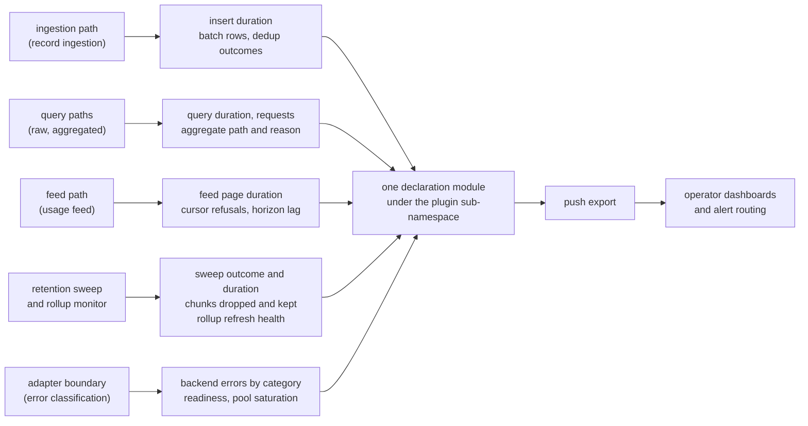

Created:  2026-09-26 by Virtuozzo International GmbH
Updated:  2026-09-26 by Virtuozzo International GmbH

# Feature: Observability & Metrics

- [ ] `p2` - **ID**: `cpt-cf-uc-plugin-featstatus-observability-metrics-implemented`

- [ ] `p2` - `cpt-cf-uc-plugin-feature-observability-metrics`

Provides the one OpenTelemetry instrument inventory every other component of the
plugin records through, under the plugin's own metric sub-namespace. Covers the
declaration of every counter, gauge and histogram the backend emits, the closed
label vocabularies that keep their cardinality bounded, the backend-readiness
gauge, and the rule that tests read instrument names from the declarations rather
than from copied strings.

<!-- toc -->

- [1. Feature Context](#1-feature-context)
  - [1.1 Overview](#11-overview)
  - [1.2 Purpose](#12-purpose)
  - [1.3 Actors](#13-actors)
  - [1.4 References](#14-references)
- [2. Actor Flows (CDSL)](#2-actor-flows-cdsl)
  - [Operator Diagnoses a Degraded Backend From the Emitted Series](#operator-diagnoses-a-degraded-backend-from-the-emitted-series)
- [3. Processes / Business Logic (CDSL)](#3-processes--business-logic-cdsl)
  - [Instrument Declaration](#instrument-declaration)
  - [Label Cardinality Admission](#label-cardinality-admission)
  - [Backend Readiness Gauge Transition](#backend-readiness-gauge-transition)
  - [Declared-Name Test Binding](#declared-name-test-binding)
- [4. States (CDSL)](#4-states-cdsl)
  - [Backend Readiness Signal State Machine](#backend-readiness-signal-state-machine)
- [5. Definitions of Done](#5-definitions-of-done)
  - [One Declaration Module Under the Plugin's Sub-Namespace](#one-declaration-module-under-the-plugins-sub-namespace)
  - [The Minimum Signal Set Is Declared](#the-minimum-signal-set-is-declared)
  - [The Backend-Specific Series the Other Features Feed](#the-backend-specific-series-the-other-features-feed)
  - [Bounded Label Cardinality](#bounded-label-cardinality)
  - [Instrument Names Are a Stable Rendered Contract](#instrument-names-are-a-stable-rendered-contract)
  - [Backend Readiness Means Reachable, Not Idle](#backend-readiness-means-reachable-not-idle)
  - [Every Published Service-Level Indicator Has a Backing Instrument](#every-published-service-level-indicator-has-a-backing-instrument)
  - [Tests Read Instrument Names From the Declarations](#tests-read-instrument-names-from-the-declarations)
- [6. Acceptance Criteria](#6-acceptance-criteria)

<!-- /toc -->

## 1. Feature Context

### 1.1 Overview

A cross-cutting contract feature. It owns the instrument set as a set: each
instrument's name, what it observes, its closed label vocabulary, and the
sub-namespace they all share. It owns no SPI method, no query path and no table.

The code paths that produce the underlying events belong elsewhere. Ingestion
times and counts its own writes, the query paths record which aggregate path
served them, the retention sweep counts its own drops, and the feed counts its
own refusals. What this feature adds is that each of those series exists exactly
once, under one name, with labels that cannot grow without bound.

**Traces to**: `cpt-cf-uc-plugin-nfr-operational-visibility`

### 1.2 Purpose

`cpt-cf-usage-collector-adr-pluggable-storage` puts the whole backend behind the
SPI (Service Provider Interface -- the in-process trait the gear dispatches
through). The gear can see that a call was slow or that it failed. It cannot see
why, because everything that would explain it is on the other side of the seam:
how long the insert took, whether a deduplication absorbed or conflicted, whether
a query read the materialised aggregate or scanned the ledger, how saturated the
pool is, how far the feed's settled horizon lags, and whether the backend is
reachable at all. Those series exist nowhere else, so if this plugin does not
emit them nothing does.

Two failure modes are being prevented. The first is a blind spot: a component
ships a failure path, nobody declares the instrument that carries it, and the gap
surfaces during an incident when the dashboard has no series to draw. The second
is unbounded label cardinality: one well-meant tenant label turns a bounded
counter into a series per tenant, degrades the metric pipeline, and turns an
opaque identifier into a permanent data point in a telemetry store.

The plugin's series sit under their own sub-namespace, below the gear's
request-path signals. The separation is deliberate: the gear owns what a caller
experienced, and an active plugin owns what its backend did. Nothing here renames
or re-scopes a gear signal.

**Requirements**: `cpt-cf-uc-plugin-nfr-operational-visibility`

**Principles**: none. Emitting a measurement states no design principle of its
own; it observes the paths the other features define. The principles that bind
those paths stay with them.

**Constraints**: none. No constraint in DESIGN section 2.2 binds the instrument
inventory. The rule that keeps labels bounded is stated in DESIGN section 4.3 and
is carried below as a definition of done rather than as a design constraint.

**Component**: `cpt-cf-uc-plugin-component-metrics`

**Design**: `cpt-cf-uc-plugin-design-metric-inventory` is the normative
instrument table this feature binds to.

**Scope boundary.** This feature defines what is declared and what is
observable. It does not define when a metric fires: that is each calling
component's responsibility, defined in the feature that owns the path. It also
adds no threshold judgement of its own. Where DESIGN section 4.3 states an alert
threshold, the numeric target belongs to the requirement it serves; this feature
owns only the obligation that a backing series exists to evaluate it against.

**Open in the design.** The histogram bucket layouts for the feed-page duration
and reconciliation duration histograms are recorded as still open in DESIGN
section 4.5. Both instruments are declared here with their names and labels
fixed; their bucket layouts are settled with the design rather than chosen in
this feature, and an implementation must not invent one to close the gap.

### 1.3 Actors

| Actor | Role in Feature |
|-------|-----------------|
| `cpt-cf-usage-collector-actor-platform-operator` | The central actor. Reads the dashboards these series feed, receives the routed alerts, and diagnoses a degraded backend from the emitted signals alone, without database or shell access to the process |
| `cpt-cf-uc-plugin-actor-plugin-host` | Hosts the process that exports the series, and carries its own request-path signals above this plugin's sub-namespace. It reads none of these series to make a decision |

### 1.4 References

- **PRD**: [PRD.md](../PRD.md) -- section 6.1 Operational Visibility
  (`cpt-cf-uc-plugin-nfr-operational-visibility`), which names the minimum
  signal set and the sub-namespace; section 6.2 NFR Exclusions, for the
  availability position the readiness gauge is bounded by
- **Design**: [DESIGN.md](../DESIGN.md) -- section 4.3 Metric Inventory
  (`cpt-cf-uc-plugin-design-metric-inventory`), the normative instrument table,
  its SLO summary and its label-cardinality rule; section 3.2 Metrics, for the
  component's responsibility boundary; section 4.1 items 2 and 9, for the two
  gauges whose meaning is defined outside the inventory; section 4.5, which
  records the two open bucket layouts
- **ADR**:
  [ADR-0002](../../../../docs/ADR/0002-cpt-cf-usage-collector-adr-pluggable-storage.md)
  (`cpt-cf-usage-collector-adr-pluggable-storage`) -- the seam that makes these
  backend-internal series unobservable from the gear, and therefore the plugin's
  to emit
- **Decomposition**: [DECOMPOSITION.md](../DECOMPOSITION.md) -- entry 2.9
- **Entities**: the instrument inventory itself and the backend readiness signal.
  Neither is a domain entity: telemetry is emitted about operations rather than
  modelled as stored state, so this feature adds no persisted shape
- **Sequences**: none. Recording an instrument is a step inside the sequences the
  other entries own rather than a flow of its own
- **Dependencies**: `cpt-cf-uc-plugin-feature-registration-schema-provisioning`.
  The inventory is created during startup and the readiness gauge is a property
  of the pool that feature builds. It depends on nothing else, because it records
  what it is told and never decides when a metric fires

**Data**: none. Metrics are exported, not stored. The schema is provisioned by
`cpt-cf-uc-plugin-feature-registration-schema-provisioning` and this feature adds
no table.

## 2. Actor Flows (CDSL)

One flow. It starts with the operator, adds no SPI surface, and stops where a
threshold judgement begins. It is included because it is the acceptance test for
the inventory as a whole: if an operator cannot reach the responsible component
from the series alone, the set has a gap.

### Operator Diagnoses a Degraded Backend From the Emitted Series

- [ ] `p2` - **ID**: `cpt-cf-uc-plugin-flow-diagnose-backend-from-metrics`

**Actor**: `cpt-cf-usage-collector-actor-platform-operator`

**Success Scenarios**:
- Aggregated query latency rises. The operator reads the aggregate path counter,
  sees the rollup share collapse with a fallback reason attached, and reaches the
  responsible path without opening a database session.
- Ingestion throughput drops. The operator reads the batch row histogram's sum
  beside the insert duration histogram's count and can tell a shrinking batch
  from a real throughput loss.
- Feed consumers start falling behind. The operator reads the cursor-refusal
  counter beside the horizon-lag gauge and can tell consumers lagging behind
  retention from a long transaction holding the settled horizon back.
- A sustained rate of retained chunks appears under an unresolved-retention
  reason. The operator reads the reason label and acts on the registry rather
  than on the plugin.

**Error Scenarios**:
- The readiness gauge reads zero. The backend is unreachable, and every SPI call
  is failing for that reason rather than for a query-shape reason.
- Pool connections sit at the configured maximum with acquire duration rising,
  while readiness stays at one. That is saturation rather than unreachability,
  and the two must not be confused.
- A rollup refresh age series is absent entirely. The policy has never succeeded
  -- for instance because the database's background workers are disabled -- which
  an absent series says and a stale value would not.
- A signal the operator needs has no declared instrument. That is a gap in this
  feature, not in the component whose path it would have observed.

**Steps**:
1. [ ] - `p2` - Operator observes a degraded symptom on a dashboard fed by the plugin's exported series - `inst-diag-observe`
2. [ ] - `p2` - Operator narrows the symptom to a path using the series grouped by architecture driver: performance, efficiency, reliability, security, retention and rollup - `inst-diag-narrow`
3. [ ] - `p2` - Operator distinguishes unreachability from saturation by reading the readiness gauge beside the pool gauges and the acquire duration histogram - `inst-diag-ready-vs-saturated`
4. [ ] - `p2` - **IF** the symptom is a latency one, the operator reads the duration histogram of the path and the counter that names which sub-path served it - `inst-diag-latency`
5. [ ] - `p2` - **IF** the symptom is a correctness one, the operator reads the outcome counters -- deduplication absorbs, idempotency conflicts, stale-acceptance rejections, backend errors by category - `inst-diag-correctness`
6. [ ] - `p2` - Operator stops at the responsible component; deciding whether the number is acceptable is a threshold judgement this feature does not make - `inst-diag-stop-at-threshold`
7. [ ] - `p2` - **RETURN** the responsible path, reached from the emitted series alone - `inst-diag-return`

## 3. Processes / Business Logic (CDSL)

Four processes. The first declares the inventory, the second guards its
cardinality, the third fixes what the readiness gauge means, and the fourth binds
the tests to the declarations so a rename cannot pass silently.

### Instrument Declaration

- [ ] `p2` - **ID**: `cpt-cf-uc-plugin-algo-instrument-declaration`

**Input**: the instrument set the design's metric inventory fixes.

**Output**: one module in which every counter, gauge and histogram the plugin
emits is declared exactly once.

**Steps**:
1. [ ] - `p2` - Declare every push-based instrument in one module, so each one has exactly one name and one definition site - `inst-decl-one-module`
2. [ ] - `p2` - Prefix every instrument with the plugin's own metric sub-namespace, kept below and distinct from the gear's request-path namespace - `inst-decl-subnamespace`
3. [ ] - `p2` - Use the full literal metric name at the declaration -- lowercase with underscores, a total suffix on a counter, a seconds suffix on a duration histogram - `inst-decl-literal-names`
4. [ ] - `p2` - Attach no unit hint to an instrument, so the rendered name is the same whether or not the collector appends unit suffixes - `inst-decl-no-unit-hint`
5. [ ] - `p2` - Declare the minimum signal set the requirement names: ingestion latency, deduplication outcomes, query latency, connection-pool saturation, backend error rate by classification, and backend readiness - `inst-decl-minimum-set`
6. [ ] - `p2` - Declare the backend-specific series the other features feed: stale-acceptance rejections, aggregate path with its fallback reason, rollup refresh status and age since success, retention drops, drop failures, chunks kept for an unresolved type, feed cursor refusals, and the settled-horizon lag gauge - `inst-decl-backend-series`
7. [ ] - `p2` - Group the declarations by the architecture driver each serves -- performance, efficiency, reliability, security, retention and rollup -- so a reader can tell which vector is thinly covered - `inst-decl-grouping`
8. [ ] - `p2` - Declare the two histograms whose bucket layouts the design records as still open with their names and labels fixed, and leave the layout to the design rather than choosing one here - `inst-decl-open-buckets`
9. [ ] - `p2` - Export through the push path only; expose no scrape endpoint, since the plugin opens no network listener - `inst-decl-push-only`
10. [ ] - `p2` - **RETURN** the declared inventory; recording a value is the calling component's act, never this module's decision - `inst-decl-return`

### Label Cardinality Admission

- [ ] `p2` - **ID**: `cpt-cf-uc-plugin-algo-label-cardinality-admission`

**Input**: a label proposed for an instrument.

**Output**: an admitted label with a closed value set, or a refusal.

**Steps**:
1. [ ] - `p2` - **IF** the proposed label's value set is a fixed enumeration written at the declaration, admit it - `inst-lbl-closed-set`
2. [ ] - `p2` - **IF** the proposed label carries an identifier whose values are open -- a tenant, a GTS type, an entry identifier, an idempotency key, a withdrawal reference, a request identifier or a trace identifier -- refuse it - `inst-lbl-refuse-identifiers`
3. [ ] - `p2` - Refuse on the label's value set rather than on its current population, since a label that is small today grows with the deployment - `inst-lbl-why-refuse`
4. [ ] - `p2` - Route a refused identifier to a structured log entry or a trace, where a human reads it under access control rather than as a permanent time series - `inst-lbl-route-elsewhere`
5. [ ] - `p2` - Record no plugin-opened root span; the plugin's work is recorded under the ambient span the host opened, so backend latency stays attributable end to end - `inst-lbl-ambient-span`
6. [ ] - `p2` - **RETURN** the admitted label set for the instrument - `inst-lbl-return`

### Backend Readiness Gauge Transition

- [ ] `p2` - **ID**: `cpt-cf-uc-plugin-algo-backend-readiness-gauge`

**Input**: the outcome of a pool build, a migration run, and each later
connection acquire.

**Output**: the readiness gauge's current value.

**Steps**:
1. [ ] - `p2` - Set the gauge once the pool is built and the migrations have applied; before that there is nothing to be ready for - `inst-rdy-set-after-startup`
2. [ ] - `p2` - Clear the gauge when the backend is unreachable, meaning a connection cannot be established at all - `inst-rdy-clear-unreachable`
3. [ ] - `p2` - Re-arm the gauge on the next successful acquire, so recovery is observable without a separate probe - `inst-rdy-rearm`
4. [ ] - `p2` - **IF** an acquire times out while the pool stands at its configured maximum, leave the gauge set: that is saturation, not unreachability - `inst-rdy-saturation-not-unready`
5. [ ] - `p2` - Treat saturation as visible through the pool gauges and the acquire duration histogram instead, since clearing readiness under load would flap the gauge and fire the readiness alert for a healthy but busy backend - `inst-rdy-why-not-flap`
6. [ ] - `p2` - Keep the gauge distinct from the host-computed structural readiness signal the gear publishes; this one is a backend-health fact, not a binding fact - `inst-rdy-distinct-from-host`
7. [ ] - `p2` - Drive the gauge from observed connection outcomes rather than from a background probe, so it never reports health the plugin has not actually seen - `inst-rdy-no-probe`
8. [ ] - `p2` - **RETURN** the gauge value - `inst-rdy-return`

### Declared-Name Test Binding

- [ ] `p2` - **ID**: `cpt-cf-uc-plugin-algo-instrument-name-assertion`

**Input**: a test that asserts on an emitted series.

**Output**: an assertion that fails when the instrument is renamed.

**Steps**:
1. [ ] - `p2` - Read the instrument name from the declaration module rather than writing the name out again in the test - `inst-name-read-declaration`
2. [ ] - `p2` - **FOR EACH** suite that drives a counter series it asserts on, bind every asserted name the same way - `inst-name-each-suite`
3. [ ] - `p2` - Treat a hand-copied name as a defect even when it currently matches, because it will keep matching a name that no longer exists - `inst-name-no-copies`
4. [ ] - `p2` - Fail the assertion loudly on a rename, rather than reading back a stale name that silently observes nothing - `inst-name-fail-loud`
5. [ ] - `p2` - **RETURN** the bound assertion - `inst-name-return`

## 4. States (CDSL)

### Backend Readiness Signal State Machine

- [ ] `p2` - **ID**: `cpt-cf-uc-plugin-state-backend-readiness`

**States**: Unready, Ready, Unreachable

**Initial State**: Unready

The signal is modelled because its two failure-shaped states are easy to
conflate. A backend that cannot be reached and a backend that is merely busy
produce similar caller-visible symptoms, and only one of them should clear this
gauge.

**Transitions**:
1. [ ] - `p2` - **FROM** Unready **TO** Ready **WHEN** the pool has been built and the migrations have applied - `inst-rst-to-ready`
2. [ ] - `p2` - **FROM** Ready **TO** Unreachable **WHEN** a connection cannot be established at all - `inst-rst-to-unreachable`
3. [ ] - `p2` - **FROM** Unreachable **TO** Ready **WHEN** the next connection acquire succeeds - `inst-rst-rearm`
4. [ ] - `p2` - **FROM** Ready **TO** Ready **WHEN** an acquire times out while the pool stands at its configured maximum; saturation leaves the state unchanged - `inst-rst-saturation-stays-ready`
5. [ ] - `p2` - **FROM** Unready **TO** Unready **WHEN** startup fails before the pool and migrations complete; nothing was published, so no readiness is claimed - `inst-rst-startup-failed`

## 5. Definitions of Done

### One Declaration Module Under the Plugin's Sub-Namespace

- [ ] `p2` - **ID**: `cpt-cf-uc-plugin-dod-single-instrument-inventory`

The system **MUST** declare every push-based counter, gauge and histogram the
plugin emits in one module, so each instrument has exactly one name and one
definition site. Every name **MUST** carry the plugin's own metric
sub-namespace, kept distinct from the gear's request-path signals and from the
shared namespace above it. The plugin **MUST NOT** rename, re-scope or duplicate
a gear-owned signal. Emission **MUST** be push-based, with no scrape surface,
because the plugin opens no network listener.

**Implements**:
- `cpt-cf-uc-plugin-algo-instrument-declaration`

**Requirements**: `cpt-cf-uc-plugin-nfr-operational-visibility`

**Touches**:
- API: Push-based OpenTelemetry export under the plugin's metric sub-namespace; no SPI method
- Component: `cpt-cf-uc-plugin-component-metrics`
- Entities: `Metric instrument inventory`

### The Minimum Signal Set Is Declared

- [ ] `p2` - **ID**: `cpt-cf-uc-plugin-dod-minimum-signal-set`

The system **MUST** declare, at minimum, ingestion latency, deduplication
outcomes, query latency, connection-pool saturation, backend error rate by
classification, and backend readiness. Each **MUST** exist as a declared
instrument whether or not any component has yet recorded through it, so the gap
between a path and its observability is visible in the declaration rather than
only during an incident. The backend error rate **MUST** be keyed on the SPI's
own transient-or-internal classification, so a retryable backend failure is
distinguishable from a non-retryable one without parsing a message.

**Implements**:
- `cpt-cf-uc-plugin-algo-instrument-declaration`
- `cpt-cf-uc-plugin-flow-diagnose-backend-from-metrics`

**Requirements**: `cpt-cf-uc-plugin-nfr-operational-visibility`

**Touches**:
- API: Push-based OpenTelemetry export under the plugin's metric sub-namespace; no SPI method
- Component: `cpt-cf-uc-plugin-component-metrics`

### The Backend-Specific Series the Other Features Feed

- [ ] `p2` - **ID**: `cpt-cf-uc-plugin-dod-backend-specific-series`

The system **MUST** declare the series that exist only because the backend is
behind the SPI seam: stale-acceptance rejections; the aggregate path taken with
its fallback reason; each rollup refresh policy's status and age since success;
retention chunk drops, drop failures, and chunks kept for a type whose retention
could not be resolved, carried with a reason; feed cursor refusals; and the
feed's settled-horizon lag gauge. Each **MUST** be declared here once, and
**MUST NOT** be re-declared in the feature that records through it. When a metric
fires **MUST** remain the responsibility of the component that owns the path.

**Implements**:
- `cpt-cf-uc-plugin-algo-instrument-declaration`

**Requirements**: `cpt-cf-uc-plugin-nfr-operational-visibility`

**Touches**:
- API: Push-based OpenTelemetry export under the plugin's metric sub-namespace; no SPI method
- Component: `cpt-cf-uc-plugin-component-metrics`

### Bounded Label Cardinality

- [ ] `p2` - **ID**: `cpt-cf-uc-plugin-dod-bounded-label-cardinality`

The system **MUST** bound every label to a fixed value set written at the
declaration, and **MUST NOT** use an unbounded identifier as a metric label --
tenant, GTS type, entry identifier, idempotency key, withdrawal reference,
request identifier and trace identifier included. The refusal **MUST** be made
against the label's value set rather than its current population. An identifier
needed for diagnosis **MUST** go into a structured log entry or a trace instead.
The plugin **MUST** record its work under the host's ambient tracing span and
**MUST NOT** open a root span of its own, so backend latency stays attributable
through the caller's trace.

**Implements**:
- `cpt-cf-uc-plugin-algo-label-cardinality-admission`

**Requirements**: `cpt-cf-uc-plugin-nfr-operational-visibility`

**Touches**:
- API: Push-based OpenTelemetry export under the plugin's metric sub-namespace; no SPI method
- Component: `cpt-cf-uc-plugin-component-metrics`

### Instrument Names Are a Stable Rendered Contract

- [ ] `p2` - **ID**: `cpt-cf-uc-plugin-dod-instrument-name-contract`

The system **MUST** declare each instrument under its full literal rendered name,
lowercase with underscores, with a total suffix on a counter and a seconds suffix
on a duration histogram, and **MUST NOT** attach a unit hint. The rendered name
**MUST** therefore be identical whether or not the collector appends unit
suffixes. Histogram bucket layouts **MUST** be treated as part of the contract
rather than as an implementation choice. The two histograms whose layouts DESIGN
section 4.5 records as open **MUST** be declared with their names and labels
fixed, and their layouts **MUST** be settled in the design rather than chosen
during implementation.

**Implements**:
- `cpt-cf-uc-plugin-algo-instrument-declaration`

**Requirements**: `cpt-cf-uc-plugin-nfr-operational-visibility`

**Touches**:
- API: Push-based OpenTelemetry export under the plugin's metric sub-namespace; no SPI method
- Component: `cpt-cf-uc-plugin-component-metrics`

### Backend Readiness Means Reachable, Not Idle

- [ ] `p2` - **ID**: `cpt-cf-uc-plugin-dod-readiness-gauge-semantics`

The system **MUST** set the readiness gauge after a successful pool build and
migration run, clear it when the backend cannot be reached at all, and re-arm it
on the next successful acquire. An acquire timeout while the pool stands at its
configured maximum **MUST** leave the gauge set, because that is saturation
rather than unreachability; saturation **MUST** be visible instead through the
pool gauges and the acquire duration histogram. The gauge **MUST NOT** be driven
by a background probe, and **MUST** stay distinct from the host-computed
structural readiness signal the gear publishes.

**Implements**:
- `cpt-cf-uc-plugin-algo-backend-readiness-gauge`
- `cpt-cf-uc-plugin-state-backend-readiness`

**Requirements**: `cpt-cf-uc-plugin-nfr-operational-visibility`

**Touches**:
- API: Push-based OpenTelemetry export under the plugin's metric sub-namespace; no SPI method
- Component: `cpt-cf-uc-plugin-component-metrics`
- Entities: `Backend readiness signal`

### Every Published Service-Level Indicator Has a Backing Instrument

- [ ] `p2` - **ID**: `cpt-cf-uc-plugin-dod-slo-series-backing`

The system **MUST** declare a backing instrument for every service-level
indicator the design's metric inventory publishes, so each stated objective can
be evaluated against an emitted series rather than against an absent one. A
counter that never fires under the plugin's declared behavior **MUST** still be
recorded once at zero during startup, so the series exports and a dashboard can
distinguish "never happened" from "not instrumented". This feature **MUST NOT**
set or revise a threshold; the numeric target belongs to the requirement it
serves.

**Implements**:
- `cpt-cf-uc-plugin-algo-instrument-declaration`
- `cpt-cf-uc-plugin-flow-diagnose-backend-from-metrics`

**Requirements**: `cpt-cf-uc-plugin-nfr-operational-visibility`

**Touches**:
- API: Push-based OpenTelemetry export under the plugin's metric sub-namespace; no SPI method
- Component: `cpt-cf-uc-plugin-component-metrics`

### Tests Read Instrument Names From the Declarations

- [ ] `p2` - **ID**: `cpt-cf-uc-plugin-dod-declared-name-test-binding`

The system **MUST** bind every test assertion on an emitted series to the
instrument name as the declaration module states it, and **MUST NOT** hand-copy a
name into a test. A rename **MUST** therefore fail those assertions loudly rather
than let them read back a name that no longer exists and silently observe
nothing.

**Implements**:
- `cpt-cf-uc-plugin-algo-instrument-name-assertion`

**Requirements**: `cpt-cf-uc-plugin-nfr-operational-visibility`

**Touches**:
- Component: `cpt-cf-uc-plugin-component-metrics`

## 6. Acceptance Criteria

- [ ] Every instrument the plugin emits is declared in one module, and a source scan finds no instrument created anywhere else.
- [ ] Every declared name carries the plugin's metric sub-namespace, and none collides with or re-declares a gear request-path signal.
- [ ] Ingestion latency, deduplication outcomes, query latency, connection-pool saturation, backend error rate by classification, and backend readiness all exist as declared instruments.
- [ ] The backend error counter is keyed on the transient-or-internal classification, and a transient failure is distinguishable from an internal one without parsing a message.
- [ ] Stale-acceptance rejections, aggregate path with fallback reason, rollup refresh status and age since success, retention drops, drop failures, chunks kept for an unresolved type with a reason, feed cursor refusals, and the settled-horizon lag gauge are all declared.
- [ ] No instrument is declared twice: the features that record through these series reference the declarations rather than creating their own.
- [ ] Every label on every instrument has a fixed value set written at the declaration.
- [ ] No instrument carries a tenant, GTS type, entry identifier, idempotency key, withdrawal reference, request identifier or trace identifier as a label.
- [ ] Each declared name renders identically with the collector's unit-suffix option on and off, which shows no unit hint is attached.
- [ ] Counter names end in a total suffix and duration histogram names end in a seconds suffix.
- [ ] The feed-page duration and reconciliation duration histograms are declared with their names and labels fixed, and the implementation invents no bucket layout for either.
- [ ] After a successful start, the readiness gauge reads one.
- [ ] Making the backend unreachable clears the readiness gauge, and restoring it sets the gauge again on the next successful acquire.
- [ ] Saturating the pool to its configured maximum until acquires time out leaves the readiness gauge set, while the pool gauges and the acquire duration histogram move.
- [ ] The readiness gauge is driven by observed connection outcomes and not by any background probe or timer.
- [ ] The readiness gauge is a separate series from the host-computed structural readiness signal, and neither is derived from the other.
- [ ] Every service-level indicator the design's metric inventory publishes resolves to a declared instrument.
- [ ] A counter that never fires under the plugin's declared behavior still exports, having been recorded once at zero during startup.
- [ ] Renaming any instrument in the declaration module fails the tests that assert on it, rather than leaving them passing against an absent series.
- [ ] A source scan of the test suites finds no hand-copied instrument name.
- [ ] Metrics are exported over the push path, and the plugin exposes no scrape endpoint.
- [ ] A trace of one SPI call shows the plugin's backend work recorded under the host's ambient span, with no plugin-opened root span.
