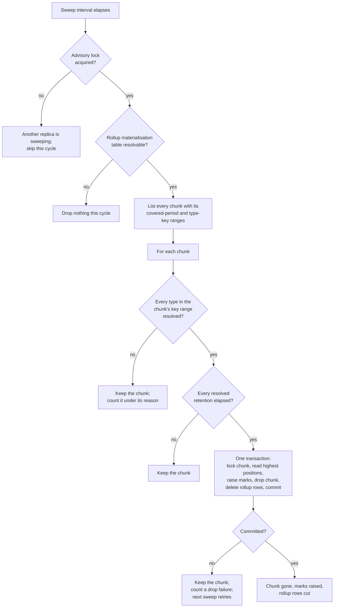

Created:  2026-09-26 by Virtuozzo International GmbH
Updated:  2026-09-26 by Virtuozzo International GmbH

# Feature: Per-Type Retention

- [x] `p1` - **ID**: `cpt-cf-uc-plugin-featstatus-per-type-retention-implemented`

- [x] `p1` - `cpt-cf-uc-plugin-feature-per-type-retention`

Enforces retention per GTS type from each type's current declared retention
policy, measured from the end of the covered period, by a background sweep that
drops whole storage chunks and raises the feed's retention marks in the same
transaction. Covers the sweep's single-replica admission, the registry read that
is never cached, the pure drop decision, the two permitted over-retention
effects, and the bounded drop transaction.

<!-- toc -->

- [1. Feature Context](#1-feature-context)
  - [1.1 Overview](#11-overview)
  - [1.2 Purpose](#12-purpose)
  - [1.3 Actors](#13-actors)
  - [1.4 References](#14-references)
- [2. Actor Flows (CDSL)](#2-actor-flows-cdsl)
  - [Operator Declares a Type's Retention](#operator-declares-a-types-retention)
  - [The Sweep Drops an Expired Chunk](#the-sweep-drops-an-expired-chunk)
- [3. Processes / Business Logic (CDSL)](#3-processes--business-logic-cdsl)
  - [Sweep Admission](#sweep-admission)
  - [Retention Resolution](#retention-resolution)
  - [Chunk Drop Decision](#chunk-drop-decision)
  - [Drop Transaction](#drop-transaction)
- [4. States (CDSL)](#4-states-cdsl)
  - [Ledger Chunk Retention State Machine](#ledger-chunk-retention-state-machine)
- [5. Definitions of Done](#5-definitions-of-done)
  - [One Sweeper at a Time, on a Detached Connection](#one-sweeper-at-a-time-on-a-detached-connection)
  - [Retention Is Resolved From the Registry on Every Sweep](#retention-is-resolved-from-the-registry-on-every-sweep)
  - [The Drop Decision Is Pure and Measured From the Covered-Period End](#the-drop-decision-is-pure-and-measured-from-the-covered-period-end)
  - [An Unresolvable Type Keeps Its Chunk and Is Counted](#an-unresolvable-type-keeps-its-chunk-and-is-counted)
  - [Two Permitted Over-Retention Effects, No Under-Retention](#two-permitted-over-retention-effects-no-under-retention)
  - [The Mark, the Drop and the Rollup Cut Commit Together](#the-mark-the-drop-and-the-rollup-cut-commit-together)
  - [Every Lock Wait in the Drop Is Bounded](#every-lock-wait-in-the-drop-is-bounded)
  - [A Failed Drop Keeps the Chunk and Is Retried](#a-failed-drop-keeps-the-chunk-and-is-retried)
  - [Nothing Drops Without the Rollup's Materialisation Table](#nothing-drops-without-the-rollups-materialisation-table)
  - [Disposal Is the Chunk Drop Alone](#disposal-is-the-chunk-drop-alone)
  - [Every Sweep Attempt Is Observable](#every-sweep-attempt-is-observable)
- [6. Acceptance Criteria](#6-acceptance-criteria)

<!-- /toc -->

## 1. Feature Context

### 1.1 Overview

The only feature in the plugin that deletes anything. It runs as a background
sweep rather than on a request path, and it decides one chunk at a time: resolve
the declared retention of every GTS (Global Type System) type whose entries the
chunk holds, and drop the chunk only once every one of them has passed.

No declarative database policy can express this. A table-wide retention setting
knows only the table's own time column, while the retention that governs an entry
is declared on its type and lives in `types-registry`. That is why startup
removes any table-wide policy an earlier build may have left, and why this sweep
exists instead.

The drop is not the whole of the transaction. Before the chunk goes, the sweep
records how far the feed had reached in each type the chunk holds, and commits
that mark together with the deletion. Without the mark, a consumer resuming after
the drop would be served a range with a hole in it and would never know.

**Traces to**: `cpt-cf-uc-plugin-fr-per-type-retention`

### 1.2 Purpose

`cpt-cf-usage-collector-fr-billing-retention-floor` gives the gear a minimum
retention. Enforcing it per type rather than per table is what lets one
deployment host meters with different obligations -- a meter a regulator requires
for years beside one a dashboard needs for a month -- without holding everything
to the longest of them.

Retention is read from the registry on every sweep and never cached.
`cpt-cf-usage-collector-adr-registry-owned-typing` keeps the retention trait off
the cacheable part of a declaration precisely because it is mutable: an operator
who extends a type's retention expects the next sweep to honour it, and a cached
value would delete entries the current declaration says to keep.

Retention is measured from the covered period's end, per
`cpt-cf-usage-collector-adr-window-end-selection` -- the same column every
read-path range predicate already selects on. Measuring from acceptance instead
would let a backfilled entry covering an old period be dropped later than one
covering the same period that arrived on time.

The asymmetry between the two error directions is deliberate and absolute.
Holding an entry longer than its retention is permitted and happens for two
structural reasons. Dropping one early is never permitted, because the entry is
gone and no later sweep can recover it. That is also why an unresolvable type
keeps its chunk: guessing would risk the one error that cannot be undone.

**Requirements**: `cpt-cf-uc-plugin-fr-per-type-retention`

**Principles**: none. The sweep is a lifecycle process rather than a request
path, and no design principle in DESIGN section 2.1 binds it beyond what
`cpt-cf-uc-plugin-feature-record-ingestion-idempotency` already carries.

**Constraints**: `cpt-cf-uc-plugin-constraint-retention`

**Component**: `cpt-cf-uc-plugin-component-retention`

**Scope boundary.** Per-entry purge and erasure are not offered: disposal is the
chunk drop alone, and a data-subject erasure is an operator database action
outside the SPI. Refusing a feed position belongs to
`cpt-cf-uc-plugin-feature-usage-feed`, which reads the mark this feature raises.
Assigning and caching a type's partitioning key belongs to
`cpt-cf-uc-plugin-feature-record-ingestion-idempotency`, because it runs on the
write path, even though DESIGN section 3.2 lists the assignment under the
Retention component this feature claims. Checking that a deployment declared
enough retention for replay and dedup preservation is a deployer obligation the
plugin does not verify.

### 1.3 Actors

| Actor | Role in Feature |
|-------|-----------------|
| `cpt-cf-usage-collector-actor-platform-operator` | Declares each type's retention through the registry, sizes the sweep interval and the chunk width, and acts on a sustained rate of chunks kept for an unresolvable type |
| `cpt-cf-usage-collector-actor-types-registry` | Holds the retention trait the sweep resolves on every cycle. Its unavailability is a reason to keep a chunk, never a reason to drop one |
| `cpt-cf-uc-plugin-actor-plugin-host` | Hosts the lifecycle hooks that start and stop the sweep. It never invokes the sweep, which no SPI method reaches |

### 1.4 References

- **PRD**: [PRD.md](../PRD.md) -- section 5.4 Per-Type Retention
  (`cpt-cf-uc-plugin-fr-per-type-retention`), including its note that every type
  must declare at least the backfill window plus the replay horizon plus the
  acceptance-order slack, which is a deployer obligation the plugin does not
  check; section 6.2 NFR Exclusions, for the data-protection and disposal
  position; section 12 Risks, for the retention-shorter-than-replay risk
- **Design**: [DESIGN.md](../DESIGN.md) -- section 2.2 Data Retention, the
  normative rule and the two permitted over-retention effects; section 2.2
  Rollup/Ledger Coupling; section 3.2 Retention; section 3.6 Retention sweep,
  for the six-step drop transaction; section 3.4, for the registry read; section
  4.1 item 6, for the feed-readiness retention rule this sweep operates under
- **ADR**:
  [ADR-0008](../../../../docs/ADR/0008-cpt-cf-usage-collector-adr-registry-owned-typing.md)
  (`cpt-cf-usage-collector-adr-registry-owned-typing`) -- declarations are owned
  by the registry, which is why retention is resolved per sweep and never
  cached;
  [ADR-0014](../../../../docs/ADR/0014-cpt-cf-usage-collector-adr-window-end-selection.md)
  (`cpt-cf-usage-collector-adr-window-end-selection`) -- measurement from the
  covered period's end;
  [ADR-0011](../../../../docs/ADR/0011-cpt-cf-usage-collector-adr-feed-aggregate-split.md)
  (`cpt-cf-usage-collector-adr-feed-aggregate-split`) -- the cursor zones and the
  one refusal the mark this sweep raises drives
- **Decomposition**: [DECOMPOSITION.md](../DECOMPOSITION.md) -- entry 2.7
- **Entities**: the declared retention policy, the per-chunk drop decision, and
  the feed retention mark. The drop decision is a pure value computed from the
  chunk's ranges and the resolved retentions
- **Sequences**: `cpt-cf-uc-plugin-seq-retention-sweep`
- **Dependencies**: `cpt-cf-uc-plugin-feature-usage-feed`. This is the one
  dependency that runs against intuition, since deletion looks independent of
  reading. It does not hold in the other direction either: the drop transaction
  reads each type's highest feed position from the feed index and raises a
  retention mark in the same transaction that drops the chunk, and that mark
  exists only so the feed can refuse a position. The feed defines both the order
  the sweep reads and the refusal the mark drives, so retention is built on top
  of it

**Data**: none. The ledger chunks, the rollup's materialisation table and the
retention-marks table the sweep operates on are provisioned by
`cpt-cf-uc-plugin-feature-registration-schema-provisioning`.

## 2. Actor Flows (CDSL)

Two flows. The first is the operator's: declare a retention and have it honoured
on the next cycle. The second is the sweep itself, which no caller invokes.

### Operator Declares a Type's Retention

- [x] `p1` - **ID**: `cpt-cf-uc-plugin-flow-declare-type-retention`

**Actor**: `cpt-cf-usage-collector-actor-platform-operator`

**Success Scenarios**:
- The operator declares a retention on a type in the registry. The next sweep
  reads it and applies it, with no plugin restart and no database change.
- The operator extends a type's retention. Entries that would have been dropped
  under the old value are kept, because the sweep resolved the current value
  rather than a cached one.
- The operator shortens a type's retention. The next sweep applies the shorter
  value to chunks that have now passed it.

**Error Scenarios**:
- The operator declares a retention shorter than the deployment's replay horizon
  plus the acceptance-order slack. The plugin does not check this and does not
  refuse it. The consequence surfaces elsewhere: feed consumers are refused more
  often, and a dedup identity dropped early admits a duplicate on replay.
- The type is not registered, or its retention trait is missing or invalid. Every
  chunk holding it is kept and counted, rather than dropped on a guess.
- The registry is unreachable during a sweep. The same outcome follows for every
  type the sweep could not resolve.

**Steps**:
1. [x] - `p1` - Operator declares or amends the retention trait on a GTS type in the registry - `inst-decl-set-retention`
2. [x] - `p1` - Operator sizes the sweep interval and the chunk width, knowing both bound how promptly and how precisely retention takes effect - `inst-decl-size-cadence`
3. [x] - `p1` - Operator accepts the deployer obligation that every type declares at least the backfill window plus the replay horizon plus the acceptance-order slack; the plugin does not verify it - `inst-decl-deployer-obligation`
4. [x] - `p1` - **ON** the next sweep, the plugin resolves the current value from the registry rather than a cached one - `inst-decl-next-sweep`
5. [x] - `p1` - Operator watches the chunks-kept-unresolved counter by reason, which is the signal that a type cannot be resolved and is holding storage - `inst-decl-watch-unresolved`
6. [x] - `p1` - **RETURN** retention enforced from the current declaration, without a plugin restart or a database policy change - `inst-decl-return`

### The Sweep Drops an Expired Chunk

- [x] `p1` - **ID**: `cpt-cf-uc-plugin-flow-sweep-expired-chunk`

**Actor**: `cpt-cf-uc-plugin-actor-plugin-host`

**Success Scenarios**:
- The sweep acquires the advisory lock, finds a chunk every one of whose types
  has passed its retention, and drops it together with its rollup rows and the
  marks it raised, in one transaction.
- Another replica holds the lock. This sweep skips the cycle entirely rather than
  contending, and the outcome is counted as a skip rather than a failure.
- A chunk holds several types with different retentions. It is held to the
  longest of them, so nothing in it is dropped before its own retention elapses.

**Error Scenarios**:
- The chunk lock wait times out because a transaction is writing into the chunk.
  The transaction rolls back, the chunk is kept, a drop failure is counted, and
  the next sweep retries it.
- The drop transaction is aborted as a deadlock victim. The same outcome follows.
- The rollup's materialisation table cannot be resolved. The sweep drops nothing
  at all that cycle rather than cutting a chunk whose rollup rows it has no table
  to cut, which would leave the aggregate stating more than the ledger holds.
- The sweep process stops mid-cycle. Nothing is half-dropped, because each chunk's
  drop is one transaction.

**Steps**:
1. [x] - `p1` - Host's background task fires the sweep on its configured interval - `inst-swp-fire`
2. [x] - `p1` - Plugin admits one sweeper with `cpt-cf-uc-plugin-algo-sweep-admission`, skipping the cycle when another replica holds the lock - `inst-swp-admission`
3. [x] - `p1` - **DB**: resolve the rollup's materialisation table; **IF** it cannot be found, drop nothing this cycle - `inst-swp-materialization-table`
4. [x] - `p1` - **DB**: list every chunk of `cpt-cf-uc-plugin-dbtable-usage-records` with its covered-period and type-key ranges - `inst-swp-list-chunks`
5. [x] - `p1` - **FOR EACH** chunk, resolve every type in its key range with `cpt-cf-uc-plugin-algo-retention-resolution` and decide it with `cpt-cf-uc-plugin-algo-chunk-drop-decision` - `inst-swp-decide`
6. [x] - `p1` - **IF** the decision is to drop, run `cpt-cf-uc-plugin-algo-drop-transaction` - `inst-swp-drop`
7. [x] - `p1` - **ELSE** keep the chunk, and count it when the reason was an unresolvable type - `inst-swp-keep`
8. [x] - `p1` - Record the sweep's outcome and duration once per attempt, whatever that outcome was - `inst-swp-record-outcome`
9. [x] - `p1` - Release the advisory lock by closing the detached connection, whatever the outcome - `inst-swp-release`
10. [x] - `p1` - **RETURN** a completed cycle; every chunk it could not drop is reconsidered on the next one - `inst-swp-return`

## 3. Processes / Business Logic (CDSL)

Four processes: admission, resolution, the pure decision, and the one
transaction in which everything a drop changes commits together.

### Sweep Admission

- [x] `p1` - **ID**: `cpt-cf-uc-plugin-algo-sweep-admission`

**Input**: a sweep cycle beginning on a replica.

**Output**: permission to sweep, or a skip.

**Steps**:
1. [x] - `p1` - **DB**: attempt the sweep's advisory lock without waiting, so a replica that cannot have it proceeds immediately to skip rather than queueing - `inst-adm-try-lock`
2. [x] - `p1` - **IF** the lock is held elsewhere, skip this cycle and record the skip as its own outcome, distinct from a failure - `inst-adm-skip`
3. [x] - `p1` - Hold the lock on a connection detached from the request pool, so it releases when that connection closes whatever the sweep's outcome - `inst-adm-detached-connection`
4. [x] - `p1` - Keep that connection out of the request pool for the sweep's duration, which is why the deployment must budget one database connection beyond the pool maximum per replica - `inst-adm-extra-connection`
5. [x] - `p1` - Admit exactly one sweeper at a time across every replica, so two sweeps cannot decide the same chunk concurrently - `inst-adm-one-at-a-time`
6. [x] - `p1` - **RETURN** permission or the skip - `inst-adm-return`

### Retention Resolution

- [x] `p1` - **ID**: `cpt-cf-uc-plugin-algo-retention-resolution`

**Input**: the GTS types whose keys fall in a chunk's type-key range.

**Output**: each type's currently declared retention, or an unresolved marker
with a reason.

**Steps**:
1. [x] - `p1` - Read each type's current declared retention trait from the registry on this sweep - `inst-res-read-registry`
2. [x] - `p1` - Cache nothing across sweeps, because retention is mutable and a cached value would delete entries the current declaration says to keep - `inst-res-never-cache`
3. [x] - `p1` - Treat an unreachable registry as leaving every type it was asked about unresolved, rather than as a reason to fall back on a previous answer - `inst-res-registry-down`
4. [x] - `p1` - Treat a type that is not registered as unresolved - `inst-res-unregistered`
5. [x] - `p1` - Treat a type whose retention trait is missing or invalid as unresolved - `inst-res-missing-trait`
6. [x] - `p1` - Carry a reason alongside each unresolved type, so the counter can distinguish the causes - `inst-res-carry-reason`
7. [x] - `p1` - **RETURN** the resolved retentions and the unresolved types with their reasons - `inst-res-return`

### Chunk Drop Decision

- [x] `p1` - **ID**: `cpt-cf-uc-plugin-algo-chunk-drop-decision`

**Input**: a chunk's covered-period upper bound, and the resolution outcome for
every type in its key range.

**Output**: drop, or keep with a reason.

**Steps**:
1. [x] - `p1` - Decide each chunk from the values handed in and nothing else, with no database access and no clock read beyond the one instant the sweep passes in, so every case can be tested without a store - `inst-dec-pure`
2. [x] - `p1` - **IF** any type in the chunk's key range is unresolved, **RETURN** keep, and mark the chunk as kept for an unresolvable type - `inst-dec-unresolved-keeps`
3. [x] - `p1` - Treat that as the deliberate asymmetry: holding an entry too long is recoverable, deleting one early is not - `inst-dec-why-asymmetric`
4. [x] - `p1` - Measure each type's elapsed retention from the chunk's covered-period upper bound, never from an acceptance instant - `inst-dec-measure-from-window-end`
5. [x] - `p1` - **IF** any resolved type has not yet passed its retention, **RETURN** keep - `inst-dec-not-yet-expired`
6. [x] - `p1` - Accept whole-chunk granularity as the first permitted over-retention effect: a chunk drops as a unit, so an entry can be held up to one chunk width past its own retention - `inst-dec-granularity-effect`
7. [x] - `p1` - Accept a shared chunk held to the longest retention among its types as the second, which arises when the type-key slice width puts several types in one slice - `inst-dec-shared-slice-effect`
8. [x] - `p1` - Permit neither effect to drop an entry early; under-retention is never permitted in any configuration - `inst-dec-no-under-retention`
9. [x] - `p1` - **RETURN** drop only when every type in the chunk resolved and every one of them has passed its retention - `inst-dec-return`

### Drop Transaction

- [x] `p1` - **ID**: `cpt-cf-uc-plugin-algo-drop-transaction`

**Input**: a chunk decided for dropping, and the rollup's resolved
materialisation table.

**Output**: a committed drop with its marks raised, or a rolled-back attempt the
next sweep retries.

**Steps**:
1. [x] - `p1` - **DB**: open the drop transaction at read-committed isolation and set a short lock timeout on it - `inst-drp-begin`
2. [x] - `p1` - Fix that timeout in the design rather than in configuration, and apply it to every lock wait in the transaction rather than to the chunk lock alone, so a sweep waiting on a busy chunk does not hold feed pages and other reads queued behind its request - `inst-drp-lock-timeout`
3. [x] - `p1` - **DB**: lock the chunk in the mode that excludes every other access - `inst-drp-lock-chunk`
4. [x] - `p1` - Rely on a transaction writing into the chunk holding a lock on it until it ends, so once the lock returns no such transaction is running and none can start - `inst-drp-no-concurrent-writers`
5. [x] - `p1` - **DB**: read the highest feed position per GTS type in the chunk, from the chunk's feed index - `inst-drp-read-highest-positions`
6. [x] - `p1` - Take that read after the lock, so its snapshot sees every row the drop is about to remove - `inst-drp-read-after-lock`
7. [x] - `p1` - **DB**: raise each type's row in `cpt-cf-uc-plugin-dbtable-usage-feed-retention-marks` to the greater of the stored position and the one just read, never lowering a mark - `inst-drp-raise-marks`
8. [x] - `p1` - **DB**: drop the chunk and delete the rollup rows it fed, in this same transaction - `inst-drp-drop-and-cut`
9. [x] - `p1` - **DB**: commit, so the mark becomes visible exactly when the entries it covers are gone and never before or after - `inst-drp-commit`
10. [x] - `p1` - Keep the chunk's rollup rows in the same transaction as its drop, so the materialised aggregate never states more than the ledger entries that remain - `inst-drp-rollup-coupling`
11. [x] - `p1` - **IF** a lock wait times out or the transaction aborts as a deadlock victim, roll back, keep the chunk and count a drop failure - `inst-drp-failure`
12. [x] - `p1` - Treat a counted drop failure as an expired chunk the next sweep retries, rather than as a permanent condition - `inst-drp-retry-next-sweep`
13. [x] - `p1` - Count each dropped chunk and each deleted rollup row set, so disposal is observable - `inst-drp-count-success`
14. [x] - `p1` - **RETURN** the committed drop, or the rolled-back attempt - `inst-drp-return`

## 4. States (CDSL)

### Ledger Chunk Retention State Machine

- [x] `p2` - **ID**: `cpt-cf-uc-plugin-state-chunk-retention`

**States**: Live, Expired, KeptUnresolved, DropFailed, Dropped

**Initial State**: Live

The state is **derived on each sweep** from the chunk's covered-period bound and
the retentions resolved that cycle; nothing is stored on the chunk. It is
modelled because three of the five states look alike from outside -- the chunk is
still there -- while each means something different to an operator, and only one
of them is terminal.

**Transitions**:
1. [x] - `p1` - **FROM** Live **TO** Expired **WHEN** a sweep resolves every type in the chunk and finds all of their retentions elapsed, measured from the chunk's covered-period upper bound - `inst-crs-to-expired`
2. [x] - `p1` - **FROM** Live **TO** KeptUnresolved **WHEN** a sweep cannot resolve a type in the chunk's key range; the chunk is kept and counted under its reason - `inst-crs-to-unresolved`
3. [x] - `p1` - **FROM** KeptUnresolved **TO** Live **WHEN** a later sweep resolves every type and at least one retention has not elapsed - `inst-crs-unresolved-to-live`
4. [x] - `p1` - **FROM** KeptUnresolved **TO** Expired **WHEN** a later sweep resolves every type and all of their retentions have elapsed - `inst-crs-unresolved-to-expired`
5. [x] - `p1` - **FROM** Expired **TO** Dropped **WHEN** the drop transaction commits, taking the chunk, its rollup rows and the raised marks together - `inst-crs-to-dropped`
6. [x] - `p1` - **FROM** Expired **TO** DropFailed **WHEN** a lock wait times out or the transaction aborts; the chunk is kept and a drop failure is counted - `inst-crs-to-dropfailed`
7. [x] - `p1` - **FROM** DropFailed **TO** Expired **WHEN** the next sweep reconsiders it and the decision is still to drop - `inst-crs-dropfailed-retry`
8. [x] - `p1` - **FROM** DropFailed **TO** KeptUnresolved **WHEN** the next sweep cannot resolve a type it resolved before, for instance because the registry became unreachable - `inst-crs-dropfailed-to-unresolved`
9. [x] - `p1` - **FROM** Expired **TO** Expired **WHEN** the rollup's materialisation table cannot be resolved; the whole cycle drops nothing and the chunk waits - `inst-crs-no-materialization-table`
10. [x] - `p1` - **FROM** Dropped **TO** Dropped; the state is terminal, since no later sweep can recover a dropped chunk - `inst-crs-dropped-terminal`

## 5. Definitions of Done

### One Sweeper at a Time, on a Detached Connection

- [x] `p1` - **ID**: `cpt-cf-uc-plugin-dod-sweep-admission`

The system **MUST** admit exactly one sweeper at a time across every replica,
through an advisory lock attempted without waiting, so a replica that cannot have
it skips the cycle rather than queueing. A skip **MUST** be recorded as its own
outcome, distinct from a failure. The lock **MUST** be held on a connection
detached from the request pool, so it releases when that connection closes
whatever the sweep's outcome. The deployment **MUST** be told to budget one
database connection beyond the pool maximum per replica for it. The sweep
**MUST** run only as a background task started and stopped by the gear
lifecycle, and **MUST NOT** be reachable through any SPI method.

**Implements**:
- `cpt-cf-uc-plugin-flow-sweep-expired-chunk`
- `cpt-cf-uc-plugin-algo-sweep-admission`

**Requirements**: `cpt-cf-uc-plugin-fr-per-type-retention`

**Touches**:
- API: Background retention sweep, started and stopped by the gear lifecycle; no SPI method
- Component: `cpt-cf-uc-plugin-component-retention`

### Retention Is Resolved From the Registry on Every Sweep

- [x] `p1` - **ID**: `cpt-cf-uc-plugin-dod-retention-resolution-uncached`

The system **MUST** resolve each type's current declared retention from the
registry on every sweep and **MUST NOT** cache a retention value across sweeps,
because retention is mutable and a cached value would delete entries the current
declaration says to keep. An amended retention **MUST** take effect on the next
sweep with no plugin restart and no database policy change. An unreachable
registry, an unregistered type, and a missing or invalid retention trait
**MUST** each leave the type unresolved, each carrying its own reason, and
**MUST NOT** fall back on a previous answer.

**Implements**:
- `cpt-cf-uc-plugin-flow-declare-type-retention`
- `cpt-cf-uc-plugin-algo-retention-resolution`

**Requirements**: `cpt-cf-uc-plugin-fr-per-type-retention`

**Constraints**: `cpt-cf-uc-plugin-constraint-retention`

**Touches**:
- API: Background retention sweep, started and stopped by the gear lifecycle; no SPI method
- Component: `cpt-cf-uc-plugin-component-retention`
- Entities: `Retention policy`

### The Drop Decision Is Pure and Measured From the Covered-Period End

- [x] `p1` - **ID**: `cpt-cf-uc-plugin-dod-pure-drop-decision`

The system **MUST** decide each chunk from three inputs and nothing else: the
chunk's covered-period upper bound, the resolution outcome for every type in its
key range, and the one instant the sweep passes in. The decision **MUST NOT**
reach the database or read a clock of its own, so every case can be tested
without a store. Retention **MUST** be measured from the covered period's end rather than
from an acceptance instant, so a backfilled entry and an on-time entry covering
the same period expire together. A chunk **MUST** drop only once every type in it
resolved and every one of those retentions elapsed.

**Implements**:
- `cpt-cf-uc-plugin-algo-chunk-drop-decision`
- `cpt-cf-uc-plugin-state-chunk-retention`

**Requirements**: `cpt-cf-uc-plugin-fr-per-type-retention`

**Constraints**: `cpt-cf-uc-plugin-constraint-retention`

**Touches**:
- API: Background retention sweep, started and stopped by the gear lifecycle; no SPI method
- Component: `cpt-cf-uc-plugin-component-retention`
- Entities: `Chunk drop decision`

### An Unresolvable Type Keeps Its Chunk and Is Counted

- [x] `p1` - **ID**: `cpt-cf-uc-plugin-dod-unresolved-type-keeps-chunk`

The system **MUST** keep every chunk holding a type whose retention could not be
resolved, and **MUST** count it under the reason resolution failed. It **MUST
NOT** drop such a chunk on a default, a previous value, or any other guess,
because holding an entry too long is recoverable while deleting one early is not.
The counter **MUST** be the operator's signal to act, and a sustained rate past
the burst that follows a restart **MUST** be treated as a condition to
investigate rather than as normal.

**Implements**:
- `cpt-cf-uc-plugin-algo-chunk-drop-decision`
- `cpt-cf-uc-plugin-state-chunk-retention`

**Requirements**: `cpt-cf-uc-plugin-fr-per-type-retention`

**Constraints**: `cpt-cf-uc-plugin-constraint-retention`

**Touches**:
- API: Background retention sweep, started and stopped by the gear lifecycle; no SPI method
- Component: `cpt-cf-uc-plugin-component-retention`

### Two Permitted Over-Retention Effects, No Under-Retention

- [x] `p1` - **ID**: `cpt-cf-uc-plugin-dod-over-retention-only`

The system **MAY** hold an entry longer than its own retention for exactly two
reasons: whole-chunk granularity, so an entry can be held up to one chunk width
past its retention, and a shared chunk slice, so several types in one slice hold
that chunk to the longest retention among them. Both **MUST** be documented as
permitted. Neither effect, nor any configuration of the chunk width or the slice
width, **MAY** drop an entry before its own retention elapses. Under-retention
**MUST NOT** be permitted in any configuration.

**Implements**:
- `cpt-cf-uc-plugin-algo-chunk-drop-decision`

**Requirements**: `cpt-cf-uc-plugin-fr-per-type-retention`

**Constraints**: `cpt-cf-uc-plugin-constraint-retention`

**Touches**:
- API: Background retention sweep, started and stopped by the gear lifecycle; no SPI method
- DB Table: `cpt-cf-uc-plugin-dbtable-usage-records`
- Component: `cpt-cf-uc-plugin-component-retention`

### The Mark, the Drop and the Rollup Cut Commit Together

- [x] `p1` - **ID**: `cpt-cf-uc-plugin-dod-atomic-drop-transaction`

The system **MUST** run each chunk's drop as one read-committed transaction that
locks the chunk in the mode excluding every other access, reads the highest feed
position per GTS type in the chunk after taking that lock, raises each type's
retention mark to the greater of the stored and the read position, drops the
chunk, deletes the rollup rows it fed, and commits. The read **MUST** follow the
lock, so its snapshot sees every row the drop removes and the mark commits
exactly when the entries it covers are gone. A mark **MUST** be raised and
**MUST NOT** be lowered. The rollup rows **MUST** be cut in the same transaction,
so the materialised aggregate never states more than the ledger entries that
remain.

**Implements**:
- `cpt-cf-uc-plugin-flow-sweep-expired-chunk`
- `cpt-cf-uc-plugin-algo-drop-transaction`

**Requirements**: `cpt-cf-uc-plugin-fr-per-type-retention`

**Constraints**: `cpt-cf-uc-plugin-constraint-rollup-ledger-coupling`

**Touches**:
- API: Background retention sweep, started and stopped by the gear lifecycle; no SPI method
- DB Table: `cpt-cf-uc-plugin-dbtable-usage-records`
- DB Table: `cpt-cf-uc-plugin-dbtable-usage-feed-retention-marks`
- DB Table: `cpt-cf-uc-plugin-dbtable-usage-rollup-1h`
- Component: `cpt-cf-uc-plugin-component-retention`
- Entities: `Feed retention mark`

### Every Lock Wait in the Drop Is Bounded

- [x] `p1` - **ID**: `cpt-cf-uc-plugin-dod-bounded-lock-waits`

The system **MUST** set a short lock timeout on the drop transaction, fixed in
the design rather than exposed as configuration, and **MUST** apply it to every
lock wait in that transaction rather than to the chunk lock alone. The bound
exists so a sweep waiting on a busy chunk does not hold feed pages and other
reads queued behind its lock request. The drop transaction **MUST** also be
bounded by the configured transaction timeout, so it cannot hold the feed's
settled horizon back indefinitely.

**Implements**:
- `cpt-cf-uc-plugin-algo-drop-transaction`

**Requirements**: `cpt-cf-uc-plugin-fr-per-type-retention`

**Touches**:
- API: Background retention sweep, started and stopped by the gear lifecycle; no SPI method
- Component: `cpt-cf-uc-plugin-component-retention`

### A Failed Drop Keeps the Chunk and Is Retried

- [x] `p1` - **ID**: `cpt-cf-uc-plugin-dod-drop-failure-retry`

The system **MUST** roll back, keep the chunk and count a drop failure when a
lock wait times out or the drop transaction aborts as a deadlock victim, and the
next sweep **MUST** reconsider that chunk. A counted drop failure **MUST** mean
an expired chunk awaiting retry rather than a permanent condition. No chunk
**MAY** be left half-dropped, since each chunk's drop is one transaction, and a
sweep stopping mid-cycle **MUST** leave every undropped chunk intact. A sustained
drop-failure rate **MUST** be treated as a signal of lock contention on the
ledger.

**Implements**:
- `cpt-cf-uc-plugin-algo-drop-transaction`
- `cpt-cf-uc-plugin-state-chunk-retention`

**Requirements**: `cpt-cf-uc-plugin-fr-per-type-retention`

**Touches**:
- API: Background retention sweep, started and stopped by the gear lifecycle; no SPI method
- DB Table: `cpt-cf-uc-plugin-dbtable-usage-records`
- Component: `cpt-cf-uc-plugin-component-retention`

### Nothing Drops Without the Rollup's Materialisation Table

- [x] `p1` - **ID**: `cpt-cf-uc-plugin-dod-no-drop-without-materialisation-table`

The system **MUST** resolve the rollup's materialisation table before dropping
anything in a cycle, and **MUST** drop nothing at all that cycle when it cannot
be found. It **MUST NOT** drop a chunk whose rollup rows it has no table to cut,
because the materialised aggregate would then state more than the ledger entries
that remain, with no row left to contradict it. The chunk **MUST** simply wait
for a later cycle.

**Implements**:
- `cpt-cf-uc-plugin-flow-sweep-expired-chunk`
- `cpt-cf-uc-plugin-state-chunk-retention`

**Requirements**: `cpt-cf-uc-plugin-fr-per-type-retention`

**Constraints**: `cpt-cf-uc-plugin-constraint-rollup-ledger-coupling`

**Touches**:
- API: Background retention sweep, started and stopped by the gear lifecycle; no SPI method
- DB Table: `cpt-cf-uc-plugin-dbtable-usage-rollup-1h`
- Component: `cpt-cf-uc-plugin-component-retention`

### Disposal Is the Chunk Drop Alone

- [x] `p1` - **ID**: `cpt-cf-uc-plugin-dod-disposal-is-chunk-drop-only`

The system **MUST** treat the chunk drop as the whole of its disposal mechanism
and **MUST NOT** offer a per-entry purge or erasure, on the SPI or anywhere else.
A data-subject erasure **MUST** be stated as an operator database action outside
the SPI. No table-wide declarative retention policy **MAY** be registered on the
ledger, since per-type retention is this sweep's and a table-wide policy would
drop chunks the sweep is still holding for an unresolvable type. The plugin
**MUST NOT** verify that a deployment declared enough retention for replay and
dedup preservation; that obligation is the deployer's and is documented rather
than enforced.

**Implements**:
- `cpt-cf-uc-plugin-flow-declare-type-retention`
- `cpt-cf-uc-plugin-algo-chunk-drop-decision`

**Requirements**: `cpt-cf-uc-plugin-fr-per-type-retention`

**Constraints**: `cpt-cf-uc-plugin-constraint-retention`

**Touches**:
- API: Background retention sweep, started and stopped by the gear lifecycle; no SPI method
- DB Table: `cpt-cf-uc-plugin-dbtable-usage-records`
- Component: `cpt-cf-uc-plugin-component-retention`

### Every Sweep Attempt Is Observable

- [x] `p1` - **ID**: `cpt-cf-uc-plugin-dod-sweep-observability`

The system **MUST** record the sweep's outcome and its duration once per attempt,
whatever that outcome was, distinguishing a completed sweep from one skipped for
the lock and from one that failed. It **MUST** count chunks dropped, chunks kept
for an unresolvable type by reason, drop failures, and rollup rows deleted, and
**MUST** publish the current chunk count. The chunk-count gauge **MUST** be
documented as set by whichever replica's sweep last held the lock, so it is read
as the most recent value rather than as a maximum across replicas. The
instruments themselves are declared by
`cpt-cf-uc-plugin-feature-observability-metrics`; this feature decides when each
one fires.

**Implements**:
- `cpt-cf-uc-plugin-flow-sweep-expired-chunk`
- `cpt-cf-uc-plugin-algo-drop-transaction`

**Requirements**: `cpt-cf-uc-plugin-fr-per-type-retention`

**Touches**:
- API: Background retention sweep, started and stopped by the gear lifecycle; no SPI method
- Component: `cpt-cf-uc-plugin-component-retention`

## 6. Acceptance Criteria

- [ ] Two replicas sweeping at once result in one sweep running and the other skipping, and the skip is recorded as a skip rather than a failure.
- [ ] The advisory lock is attempted without waiting, so a replica that cannot take it returns immediately rather than queueing.
- [ ] The advisory lock is held on a connection outside the request pool, and killing the sweep releases it when that connection closes.
- [ ] A sweep never leaves the advisory lock held after it ends, whether it completed, skipped or failed.
- [ ] Amending a type's retention in the registry changes the next sweep's behavior with no plugin restart and no database policy change.
- [ ] Extending a type's retention between two sweeps keeps a chunk the earlier value would have dropped.
- [ ] Shortening a type's retention between two sweeps drops a chunk the earlier value would have kept.
- [ ] No retention value is reused from a previous sweep, verified by a stub registry whose values a test amends between cycles.
- [ ] An unreachable registry leaves every type unresolved for that sweep and drops nothing.
- [ ] An unregistered type leaves its chunk kept and counted.
- [ ] A type whose retention trait is missing leaves its chunk kept and counted, and one whose trait is invalid does the same, each under its own reason.
- [ ] The drop decision is exercised exhaustively as a pure function, with no database and no clock of its own.
- [ ] Retention is measured from the chunk's covered-period upper bound: a backfilled entry and an on-time entry covering the same period expire on the same sweep.
- [ ] A chunk holding one unresolvable type among several resolved and expired ones is kept.
- [ ] A chunk holding one type whose retention has not elapsed among several that have is kept.
- [ ] A chunk drops only when every type in its key range resolved and every one of those retentions elapsed.
- [ ] An entry is held up to one chunk width past its own retention and no longer, which is whole-chunk granularity.
- [ ] With a slice width above one, a chunk shared by several types is held to the longest retention among them.
- [ ] No configuration of the chunk width or the slice width causes an entry to be dropped before its own retention elapses.
- [ ] The drop transaction locks the chunk before reading its highest feed positions, verified by the statement order.
- [ ] Each type's retention mark is raised to the greater of the stored and the read position, and a mark is never lowered by any sweep.
- [ ] The mark raise, the chunk drop and the rollup-row deletion commit in one transaction: a feed position covered by the drop is refused from the moment the entries are gone, and not before.
- [ ] No insert into the chunk commits between the highest-position read and the drop.
- [ ] A lock wait that times out rolls the transaction back, keeps the chunk and counts a drop failure.
- [ ] A drop transaction aborted as a deadlock victim produces the same outcome.
- [ ] A chunk that failed to drop is reconsidered and dropped on a later sweep once the contention clears.
- [ ] The lock timeout applies to every lock wait in the drop transaction, not only the chunk lock.
- [ ] The lock timeout is fixed in the implementation and is not exposed as a configuration field.
- [ ] Stopping the sweep mid-cycle leaves every chunk either fully dropped or fully intact.
- [ ] A cycle in which the rollup's materialisation table cannot be resolved drops nothing at all, including chunks that were otherwise expired.
- [ ] After any drop, the materialised aggregate holds no row fed by an entry the ledger no longer has.
- [ ] No per-entry purge or erasure operation exists on the SPI or elsewhere in the crate.
- [ ] No table-wide declarative retention policy exists on the ledger after any sweep.
- [ ] A type declared with less retention than the replay horizon plus the acceptance-order slack is accepted without complaint, which confirms the plugin does not verify the deployer obligation.
- [ ] Every sweep attempt records exactly one outcome and one duration observation, whether it completed, skipped or failed.
- [ ] Chunks dropped, chunks kept for an unresolvable type by reason, drop failures and rollup rows deleted are each counted.
- [ ] The chunk-count gauge is documented as the most recent sweeping replica's value rather than a maximum across replicas.
