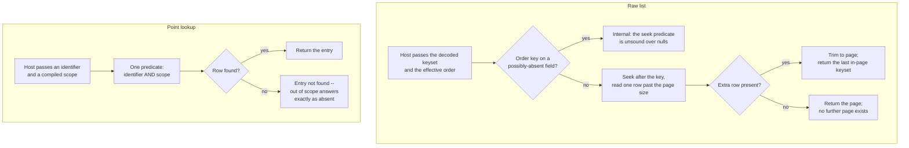

Created:  2026-09-26 by Virtuozzo International GmbH
Updated:  2026-09-26 by Virtuozzo International GmbH

# Feature: Raw Query & Converged Lookup

- [ ] `p1` - **ID**: `cpt-cf-uc-plugin-featstatus-raw-query-converged-lookup-implemented`

- [ ] `p1` - `cpt-cf-uc-plugin-feature-raw-query-converged-lookup`

Serves the two exact read paths over the ledger: keyset-paginated raw pages over
the host-supplied order, and a scoped point lookup by entry identifier that the
gateway uses to resolve a withdrawal's target before accepting a correction.
Covers the seek protocol, the next-page probe, converged-only semantics, and the
publication of the backend's nine-item consistency profile.

<!-- toc -->

- [1. Feature Context](#1-feature-context)
  - [1.1 Overview](#11-overview)
  - [1.2 Purpose](#12-purpose)
  - [1.3 Actors](#13-actors)
  - [1.4 References](#14-references)
- [2. Actor Flows (CDSL)](#2-actor-flows-cdsl)
  - [Host Reads a Page of Raw Entries](#host-reads-a-page-of-raw-entries)
  - [Host Resolves a Withdrawal Target Before Accepting a Correction](#host-resolves-a-withdrawal-target-before-accepting-a-correction)
- [3. Processes / Business Logic (CDSL)](#3-processes--business-logic-cdsl)
  - [Keyset Seek Page](#keyset-seek-page)
  - [Scoped Point Lookup](#scoped-point-lookup)
  - [Consistency Profile Publication](#consistency-profile-publication)
- [4. States (CDSL)](#4-states-cdsl)
- [5. Definitions of Done](#5-definitions-of-done)
  - [Keyset Seek Pagination Over the Host-Supplied Order](#keyset-seek-pagination-over-the-host-supplied-order)
  - [Next-Page Detection Without a Second Query](#next-page-detection-without-a-second-query)
  - [No Filter Widening and No Offset Scan](#no-filter-widening-and-no-offset-scan)
  - [An Order Key on a Possibly-Absent Field Is Refused](#an-order-key-on-a-possibly-absent-field-is-refused)
  - [Entries Are Returned as Persisted](#entries-are-returned-as-persisted)
  - [Scope Is Applied in the Same Predicate as the Identifier](#scope-is-applied-in-the-same-predicate-as-the-identifier)
  - [Converged-Only Semantics Answer Immediately](#converged-only-semantics-answer-immediately)
  - [The Nine-Item Consistency Profile Is Published](#the-nine-item-consistency-profile-is-published)
- [6. Acceptance Criteria](#6-acceptance-criteria)

<!-- /toc -->

## 1. Feature Context

### 1.1 Overview

Both paths return what is stored, with no derived view in between. The raw list
walks the ledger in the order the host supplied, seeking from a structured keyset
rather than counting rows. The point lookup resolves one entry by identifier with
the caller's scope applied in the same predicate.

The lookup carries more weight than its size suggests. The gateway calls it to
resolve a withdrawal's target, and validates the withdrawal is a faithful copy of
what comes back. A lookup that answered from a write later discarded, or that
reported a real target missing, would admit or refuse corrections wrongly.

**Traces to**: `cpt-cf-uc-plugin-fr-raw-query`,
`cpt-cf-uc-plugin-fr-converged-lookup`

### 1.2 Purpose

`cpt-cf-usage-collector-adr-consistency-contract` sets a floor and obliges every
plugin to publish its own ceiling, its dedup level and its convergence bound. On
this plugin's single transactional primary both the convergence bound and the
query-path lag bound are zero: a committed entry is visible to the next read, and
an identity is decided at the commit that wrote it. A converged-only read
therefore answers immediately, and the not-converged outcome never occurs here.
That is a ceiling worth publishing precisely because the floor permits so much
less.

Keyset pagination rather than offsets is a cost decision that becomes a
correctness one. An offset scan re-reads everything it skips, so page cost grows
with depth at exactly the point in the throughput envelope where it must not. It
is also unstable under concurrent ingest: rows arriving behind the offset shift
the window and a reader can miss or repeat entries. Seeking from the last row's
key has neither problem.

The paths return entries as persisted. A withdrawn record and the withdrawal that
removed it both appear, because this is the ledger itself and not a folded view.
The pair shares a covered-period end but not an identifier, so nothing guarantees
they land on one page -- a caller reconstructing net state reads the aggregate
path instead.

**Requirements**: `cpt-cf-uc-plugin-fr-raw-query`,
`cpt-cf-uc-plugin-fr-converged-lookup`,
`cpt-cf-uc-plugin-nfr-consistency-profile`

**Principles**: none. Both read paths run under the pure-persistence principle
`cpt-cf-uc-plugin-feature-record-ingestion-idempotency` carries; neither adds a
principle of its own.

**Constraints**: none. The gateway-owned-cursor constraint that governs the
keyset handoff is carried by `cpt-cf-uc-plugin-feature-usage-feed`, which owns
the feed's position issuance as well. This feature consumes the rule rather than
stating it twice.

**Component**: none. The seek and point-read statements are built by the Query
component that `cpt-cf-uc-plugin-feature-aggregated-query-rollup` claims and
executed by the Record Store that
`cpt-cf-uc-plugin-feature-record-ingestion-idempotency` claims. This feature
defines their semantics.

**Scope boundary.** Encoding, decoding, signing or validating a wire cursor is
the gateway's, and this plugin never touches one. Aggregation over raw rows
belongs to `cpt-cf-uc-plugin-feature-aggregated-query-rollup`. Deriving the
per-path bounds the consistency profile carries belongs elsewhere too: the dedup
level and convergence bound to
`cpt-cf-uc-plugin-feature-record-ingestion-idempotency`, the aggregate bounds to
`cpt-cf-uc-plugin-feature-aggregated-query-rollup`, and the feed's
settled-horizon bound to `cpt-cf-uc-plugin-feature-usage-feed`. This feature
assembles the published nine-item profile from them rather than deriving any
of them.

**Open question carried forward.** The raw-list SPI return type is unsettled and
belongs to the gateway. The gear's trait returns a page envelope while this
plugin's raw-query sequence returns a keyset. This feature follows the sequence.
The reconciliation of the two shapes is recorded in PRD section 13 and is not
settled here; an implementation must not pick one shape over the other as though
the question were closed.

### 1.3 Actors

| Actor | Role in Feature |
|-------|-----------------|
| `cpt-cf-uc-plugin-actor-plugin-host` | The Usage Collector gear core. Compiles the scope, validates and extends the effective order, decodes the wire cursor into the structured keyset it passes down, and calls the lookup to resolve a withdrawal's target before accepting a correction |
| `cpt-cf-usage-collector-actor-usage-consumer` | Reads raw entries through the gear's query surface. It never reaches the SPI itself, and the page shape it sees is minted by the gateway from what this feature returns |

### 1.4 References

- **PRD**: [PRD.md](../PRD.md) -- section 5.2 Keyset-Paginated Raw Query
  (`cpt-cf-uc-plugin-fr-raw-query`) and Converged-Only Lookup
  (`cpt-cf-uc-plugin-fr-converged-lookup`); section 6.1 Backend Consistency
  Profile (`cpt-cf-uc-plugin-nfr-consistency-profile`); section 13, which
  records the raw-list return-type question this feature carries forward
- **Design**: [DESIGN.md](../DESIGN.md) -- section 3.6 Keyset-paginated raw list
  and Converged-only lookup; section 2.2 Gateway-Owned Cursors; section 4.1, the
  nine-item consistency profile, and items 1, 5 and 9 in particular; section 3.7,
  for the time-windowed read indexes both paths use
- **ADR**:
  [ADR-0006](../../../../docs/ADR/0006-cpt-cf-usage-collector-adr-consistency-contract.md)
  (`cpt-cf-usage-collector-adr-consistency-contract`) -- floor-and-ceiling
  consistency, with each plugin publishing its ceiling, dedup level and
  convergence bound;
  [ADR-0014](../../../../docs/ADR/0014-cpt-cf-usage-collector-adr-window-end-selection.md)
  (`cpt-cf-usage-collector-adr-window-end-selection`) -- entries are selected by
  the end of their covered period, never by containment or overlap;
  [ADR-0007](../../../../docs/ADR/0007-cpt-cf-usage-collector-adr-record-identity-derivation.md)
  (`cpt-cf-usage-collector-adr-record-identity-derivation`) -- why an identifier
  resolves at most one row
- **Decomposition**: [DECOMPOSITION.md](../DECOMPOSITION.md) -- entry 2.5
- **Entities**: the gateway-parsed query and its decoded keyset, the page
  envelope, and the entry itself. None is minted here
- **Sequences**: `cpt-cf-uc-plugin-seq-list-keyset`,
  `cpt-cf-uc-plugin-seq-converged-lookup`
- **Dependencies**: `cpt-cf-uc-plugin-feature-record-ingestion-idempotency`. Both
  paths read the entries that feature writes, and the lookup's converged-only
  semantics are stated against the dedup level it declares. Neither path depends
  on `cpt-cf-uc-plugin-feature-invalidation-persistence`, because the raw path
  returns the ledger as persisted and applies no withdrawal rule

**Data**: none. The ledger table and the indexes both paths read are provisioned
by `cpt-cf-uc-plugin-feature-registration-schema-provisioning`.

## 2. Actor Flows (CDSL)

Two flows, one per SPI method. They share a store and share nothing else: one
walks a range in order, the other resolves a single identifier.

### Host Reads a Page of Raw Entries

- [ ] `p1` - **ID**: `cpt-cf-uc-plugin-flow-read-raw-page`

**Actor**: `cpt-cf-uc-plugin-actor-plugin-host`

**Success Scenarios**:
- A first page arrives with no seek key. The page reads from the start of the
  selected range in the effective order and returns the keyset of its last row.
- A continuation arrives with the keyset the previous page returned. The page
  begins strictly after that row, with no gap and no repeat.
- The caller ordered by a field of their own. The gateway appended the
  covered-period end and the identifier to make the order total, and both the
  seek predicate and the ordering read that same order rather than assuming a
  position for either key.
- A withdrawn record and the withdrawal that removed it both appear, because the
  path returns the ledger rather than a folded view.

**Error Scenarios**:
- An order key names a field that may be absent. The seek predicate is a
  row-value comparison, which is sound only over columns that cannot be null, so
  the call is answered as internal rather than silently dropping matching
  entries.
- A filter arrives that the plugin would have to widen to serve. It is never
  widened; the host's filter is authoritative and the plugin may only narrow.
- The backend fails transiently mid-page. The call returns a transient and no
  partial page.

**Steps**:
1. [ ] - `p1` - Host decodes its wire cursor into the structured keyset and passes it down; the plugin never sees the cursor itself - `inst-raw-host-decodes`
2. [ ] - `p1` - Host passes the typed GTS type, the covered-period range, the compiled scope, any metadata filter, the effective order and the page limit - `inst-raw-host-params`
3. [ ] - `p1` - Plugin translates the filter and the scope without widening either, and builds the seek from `cpt-cf-uc-plugin-algo-keyset-seek-page` - `inst-raw-translate`
4. [ ] - `p1` - **IF** the effective order names a field that may be absent, **RETURN** an internal error; it is a host-contract breach - `inst-raw-nullable-order`
5. [ ] - `p1` - **DB**: select over `cpt-cf-uc-plugin-dbtable-usage-records`, bounded by the covered-period end alone, seeking after the keyset, ordered by the effective order, reading one row past the page size - `inst-raw-select`
6. [ ] - `p1` - Trim the extra row, which tells the caller whether a further page exists without a second query - `inst-raw-trim`
7. [ ] - `p1` - **RETURN** the page's rows together with the keyset of its last in-page row, from which the gateway mints the next cursor - `inst-raw-return`

### Host Resolves a Withdrawal Target Before Accepting a Correction

- [ ] `p1` - **ID**: `cpt-cf-uc-plugin-flow-resolve-target-by-lookup`

**Actor**: `cpt-cf-uc-plugin-actor-plugin-host`

**Success Scenarios**:
- The target exists and falls inside the caller's compiled scope. It is returned,
  and the gateway validates the proposed withdrawal against it.
- The host asked for a converged-only read. The answer is the same and is
  immediate, because on this backend every visible entry has already converged.
- The target was acknowledged moments earlier. It is returned rather than
  reported absent, because the query-path lag bound is zero.

**Error Scenarios**:
- No entry carries the identifier. The entry-not-found variant is returned.
- The entry exists but falls outside the caller's compiled scope. It answers
  exactly as an absent one, so the lookup discloses nothing about entries the
  caller may not see.
- A deployment routes this read to a replica. That is outside the supported
  posture, and both published bounds must be restated before it serves traffic;
  nothing in the plugin detects or compensates for it.

**Steps**:
1. [ ] - `p1` - Host calls the point lookup with the entry identifier, the compiled scope and its converged-only request - `inst-look-call`
2. [ ] - `p1` - **DB**: select over `cpt-cf-uc-plugin-dbtable-usage-records` with `cpt-cf-uc-plugin-algo-scoped-point-lookup`, applying the identifier and the scope in one predicate - `inst-look-select`
3. [ ] - `p1` - Rely on the identifier resolving at most one row, since the gateway derives it deterministically from the six-part dedup identity - `inst-look-at-most-one`
4. [ ] - `p1` - **IF** a row is found, **RETURN** the entry with its quantity round-tripped digit for digit - `inst-look-found`
5. [ ] - `p1` - **ELSE RETURN** the entry-not-found variant, whether the entry is absent or merely out of scope - `inst-look-not-found`
6. [ ] - `p1` - Never return the not-converged variant; it is unreachable at this plugin's declared level - `inst-look-never-not-converged`
7. [ ] - `p1` - **RETURN** a definite answer within the convergence bound plus the published query-path lag bound, both of which are zero here - `inst-look-return`

## 3. Processes / Business Logic (CDSL)

Three processes: the seek that makes paging stable, the point read that makes
scope indistinguishable from absence, and the publication that tells a consumer
what this backend actually guarantees.

### Keyset Seek Page

- [ ] `p1` - **ID**: `cpt-cf-uc-plugin-algo-keyset-seek-page`

**Input**: the typed GTS type and covered-period range, the compiled scope, the
gateway-decoded keyset where one is present, the effective order, and the page
limit.

**Output**: the page's rows and the keyset of its last in-page row.

**Steps**:
1. [ ] - `p1` - Select on the covered-period end alone for the range bound, inclusive at the lower end and exclusive at the upper, never by containment or overlap - `inst-seek-window-end-only`
2. [ ] - `p1` - Read the effective order from the host's query rather than assuming a position for the covered-period end or the identifier within it - `inst-seek-order-from-host`
3. [ ] - `p1` - Build the seek predicate as a row-value comparison over exactly the columns of that effective order, in the same sequence - `inst-seek-row-value`
4. [ ] - `p1` - **IF** any order column may be absent, reject the call as internal; a row-value comparison over a nullable column silently drops matching entries rather than ordering them - `inst-seek-reject-nullable`
5. [ ] - `p1` - Omit the seek predicate entirely when no keyset was supplied, so a first page starts at the beginning of the selected range - `inst-seek-first-page`
6. [ ] - `p1` - Use the page limit floored to one, and read one row beyond it - `inst-seek-limit-plus-one`
7. [ ] - `p1` - **IF** the extra row came back, drop it and record that a further page exists; **ELSE** record that this page is the last - `inst-seek-detect-next`
8. [ ] - `p1` - Never use an offset scan, whose cost grows with depth and whose window shifts under concurrent ingest - `inst-seek-no-offset`
9. [ ] - `p1` - Apply the host's filter and compiled scope as given; narrow where the store must, never widen - `inst-seek-no-widening`
10. [ ] - `p1` - Return the ledger's rows as persisted, applying no withdrawal rule, so a withdrawn record and its withdrawal both appear and may fall on different pages - `inst-seek-as-persisted`
11. [ ] - `p1` - **RETURN** the rows and the last in-page row's keyset, for the gateway to mint its next cursor from - `inst-seek-return`

### Scoped Point Lookup

- [ ] `p1` - **ID**: `cpt-cf-uc-plugin-algo-scoped-point-lookup`

**Input**: an entry identifier, the compiled scope, and the host's converged-only
request.

**Output**: the entry, or the entry-not-found variant.

**Steps**:
1. [ ] - `p1` - **DB**: match the identifier and the compiled scope in one predicate rather than reading first and filtering afterwards - `inst-pt-one-predicate`
2. [ ] - `p1` - Treat the single predicate as the reason an out-of-scope entry is indistinguishable from an absent one, which is what keeps the lookup from disclosing existence - `inst-pt-why-one-predicate`
3. [ ] - `p1` - Expect at most one row, because the identifier is derived deterministically from the six-part dedup identity - `inst-pt-at-most-one`
4. [ ] - `p1` - Treat the converged-only request as changing nothing: on a single transactional primary every visible entry has converged - `inst-pt-converged-noop`
5. [ ] - `p1` - Never report an acknowledged, retained entry as absent - `inst-pt-no-false-absence`
6. [ ] - `p1` - Reach a definite answer within the convergence bound plus the published query-path lag bound, both zero on the supported posture - `inst-pt-definite-answer`
7. [ ] - `p1` - **RETURN** the entry or the not-found variant, and never the not-converged variant - `inst-pt-return`

### Consistency Profile Publication

- [ ] `p1` - **ID**: `cpt-cf-uc-plugin-algo-consistency-profile-publication`

**Input**: the per-path bounds the other features derive.

**Output**: the backend's published nine-item consistency profile.

**Steps**:
1. [ ] - `p1` - Assemble all nine items the gear requires of every backend's deployment guide, rather than a subset - `inst-prof-nine-items`
2. [ ] - `p1` - Carry the dedup level and the convergence bound from the write path that declares them, without restating their derivation - `inst-prof-dedup-from-write`
3. [ ] - `p1` - Carry the aggregate visibility and withdrawal-propagation bounds from the aggregate path, and the acceptance-to-feed-visibility bound from the feed path - `inst-prof-bounds-from-paths`
4. [ ] - `p1` - State the query-path lag bound as zero for the ledger read paths on the supported single-primary posture, and keep the feed's bound separate from it - `inst-prof-lag-zero`
5. [ ] - `p1` - Publish the workload-isolation shortfall rather than omitting it: one pool serves every path, so a burst on one can contend with another - `inst-prof-publish-shortfall`
6. [ ] - `p1` - Label every figure as a target, a derived value or a measured one, and label nothing measured that no test has produced - `inst-prof-label-provenance`
7. [ ] - `p1` - Name the supported posture explicitly, and oblige a deployment outside it to republish the affected items before serving traffic - `inst-prof-posture-obligation`
8. [ ] - `p1` - **RETURN** the profile as documentation the deployment carries; no code path reads it and no gate depends on it - `inst-prof-return`

## 4. States (CDSL)

**Not applicable.** Neither read path carries a lifecycle. A page is computed
entirely from its inputs -- the range, the scope, the effective order and the
seek key -- and the plugin retains nothing between pages: there is no open
cursor, no server-side scroll and no session to expire, which is precisely what
keyset pagination buys over an offset scan. The point lookup is a single
predicate evaluated once. The one lifecycle adjacent to this feature belongs to
the entries themselves: whether an identity has converged is modelled in
`cpt-cf-uc-plugin-feature-record-ingestion-idempotency`, and whether an entry has
been withdrawn in `cpt-cf-uc-plugin-feature-invalidation-persistence`. Both are
read here and neither is owned here. Modelling a state machine would introduce
states the implementation would then have to keep in step with facts it
recomputes per call.

## 5. Definitions of Done

### Keyset Seek Pagination Over the Host-Supplied Order

- [ ] `p1` - **ID**: `cpt-cf-uc-plugin-dod-keyset-seek-pagination`

The system **MUST** page raw entries by seeking from the structured keyset the
gateway decoded, over the effective order the host supplied, and **MUST** return
the page's rows together with the keyset of its last in-page row. Both the seek
predicate and the ordering **MUST** read that order from the host's query rather
than assume a position for the covered-period end or the identifier within it.
The range **MUST** select on the covered-period end alone, inclusive at the lower
bound and exclusive at the upper, never by containment or overlap. Where no
keyset was supplied, the seek predicate **MUST** be omitted so the page starts at
the beginning of the selected range.

**Implements**:
- `cpt-cf-uc-plugin-flow-read-raw-page`
- `cpt-cf-uc-plugin-algo-keyset-seek-page`

**Requirements**: `cpt-cf-uc-plugin-fr-raw-query`

**Touches**:
- API: `list_usage_records` (SPI)
- DB Table: `cpt-cf-uc-plugin-dbtable-usage-records`
- Entities: `ODataQuery`, `Page`

### Next-Page Detection Without a Second Query

- [ ] `p1` - **ID**: `cpt-cf-uc-plugin-dod-next-page-detection`

The system **MUST** read one row beyond the page limit, floored to one, and
**MUST** use the presence of that extra row to determine whether a further page
exists. The extra row **MUST** be trimmed before the page is returned, and
**MUST NOT** appear in the page or contribute its keyset. No second query
**MAY** be issued to answer the same question.

**Implements**:
- `cpt-cf-uc-plugin-algo-keyset-seek-page`

**Requirements**: `cpt-cf-uc-plugin-fr-raw-query`

**Touches**:
- API: `list_usage_records` (SPI)
- DB Table: `cpt-cf-uc-plugin-dbtable-usage-records`

### No Filter Widening and No Offset Scan

- [ ] `p1` - **ID**: `cpt-cf-uc-plugin-dod-no-filter-widening-no-offset`

The system **MUST** apply the host-supplied filter and compiled scope as given.
It **MAY** narrow a result set and **MUST NOT** widen one, so tenant scoping
survives the translation intact. It **MUST NOT** use an offset-based scan on this
path, because offset cost grows with page depth and the window shifts under
concurrent ingest. The plugin **MUST NOT** encode, decode, sign or validate a
wire cursor; it receives the structured keyset and returns one.

**Implements**:
- `cpt-cf-uc-plugin-algo-keyset-seek-page`

**Requirements**: `cpt-cf-uc-plugin-fr-raw-query`

**Touches**:
- API: `list_usage_records` (SPI)
- DB Table: `cpt-cf-uc-plugin-dbtable-usage-records`
- Entities: `ODataQuery`

### An Order Key on a Possibly-Absent Field Is Refused

- [ ] `p1` - **ID**: `cpt-cf-uc-plugin-dod-nullable-order-key-refusal`

The system **MUST** answer as internal any raw-list call whose effective order
names a field that may be absent, because the seek predicate is a row-value
comparison and is sound only over columns that cannot be null. The refusal
**MUST** be explicit rather than a silent fallback to another order or another
pagination scheme, so no matching entry is quietly dropped from a page. Such a
call **MUST** be treated as a host-contract breach.

**Implements**:
- `cpt-cf-uc-plugin-algo-keyset-seek-page`

**Requirements**: `cpt-cf-uc-plugin-fr-raw-query`

**Touches**:
- API: `list_usage_records` (SPI)
- DB Table: `cpt-cf-uc-plugin-dbtable-usage-records`

### Entries Are Returned as Persisted

- [ ] `p1` - **ID**: `cpt-cf-uc-plugin-dod-entries-as-persisted`

The system **MUST** return raw entries exactly as stored, applying no withdrawal
rule and no folding of any kind, because this path is the ledger itself rather
than a derived view. A withdrawn record and the withdrawal that removed it
**MUST** both appear where the selection admits them, and the two **MUST NOT** be
guaranteed to land on one page: they share a covered-period end but not an
identifier. Quantities **MUST** round-trip digit for digit on this path as on
every other read path.

**Implements**:
- `cpt-cf-uc-plugin-flow-read-raw-page`
- `cpt-cf-uc-plugin-algo-keyset-seek-page`

**Requirements**: `cpt-cf-uc-plugin-fr-raw-query`

**Touches**:
- API: `list_usage_records` (SPI)
- DB Table: `cpt-cf-uc-plugin-dbtable-usage-records`
- Entities: `UsageRecord`

### Scope Is Applied in the Same Predicate as the Identifier

- [ ] `p1` - **ID**: `cpt-cf-uc-plugin-dod-scoped-point-lookup`

The system **MUST** resolve a point lookup by matching the entry identifier and
the compiled scope in one predicate, so an out-of-scope entry answers exactly as
an absent one and the lookup discloses nothing about entries the caller may not
see. It **MUST NOT** read the entry first and filter afterwards. The identifier
**MUST** be relied on to resolve at most one row, since the gateway derives it
deterministically from the six-part dedup identity.

**Implements**:
- `cpt-cf-uc-plugin-flow-resolve-target-by-lookup`
- `cpt-cf-uc-plugin-algo-scoped-point-lookup`

**Requirements**: `cpt-cf-uc-plugin-fr-converged-lookup`

**Touches**:
- API: `get_usage_record` (SPI)
- DB Table: `cpt-cf-uc-plugin-dbtable-usage-records`
- Entities: `UsageRecord`

### Converged-Only Semantics Answer Immediately

- [ ] `p1` - **ID**: `cpt-cf-uc-plugin-dod-converged-only-semantics`

The system **MUST** return the surviving entry once its identity has converged,
**MUST NOT** report an acknowledged, retained entry as absent, and **MUST** reach
a definite answer -- the entry or not-found -- within its convergence bound plus
its published query-path lag bound. At this plugin's declared level both bounds
are zero, so the converged-only request **MUST** change nothing about the
behavior and the answer **MUST** be immediate. The not-converged variant
**MUST NOT** be returned by this path.

**Implements**:
- `cpt-cf-uc-plugin-algo-scoped-point-lookup`

**Requirements**: `cpt-cf-uc-plugin-fr-converged-lookup`

**Touches**:
- API: `get_usage_record` (SPI)
- Interface: `cpt-cf-uc-plugin-interface-spi`
- Entities: `UsageRecord`

### The Nine-Item Consistency Profile Is Published

- [ ] `p1` - **ID**: `cpt-cf-uc-plugin-dod-consistency-profile-publication`

The system **MUST** publish all nine items the gear requires of a backend's
consistency profile, including the dedup level, the convergence bound and the
query-path lag bound, so consumers couple to this backend's actual ceiling rather
than to the gear's eventual floor. Every figure **MUST** be labelled as a target,
a derived value or a measured one, and **MUST NOT** be labelled measured when no
test has produced it. The workload-isolation shortfall **MUST** be published
rather than omitted. A deployment outside the supported single-primary posture
**MUST** republish the affected items before serving traffic. The profile
**MUST** be assembled from the bounds the owning features derive, and this
feature **MUST NOT** derive any of them itself.

**Implements**:
- `cpt-cf-uc-plugin-algo-consistency-profile-publication`

**Requirements**: `cpt-cf-uc-plugin-nfr-consistency-profile`

**Touches**:
- API: `list_usage_records` (SPI), `get_usage_record` (SPI)
- Interface: `cpt-cf-uc-plugin-interface-spi`

## 6. Acceptance Criteria

- [ ] A first raw page with no keyset starts at the beginning of the selected range in the effective order, and the generated statement carries no seek predicate.
- [ ] A continuation seeded with the previous page's keyset begins strictly after that row, with no entry skipped and none repeated.
- [ ] Walking a range page by page returns every entry in the range exactly once, verified against the same range read in one unpaginated query.
- [ ] With no caller order supplied, the effective order is the covered-period end followed by the identifier, and both the seek predicate and the ordering use that pair.
- [ ] With a caller order supplied, the seek predicate's columns and their sequence match the effective order exactly, rather than assuming a fixed position for the covered-period end or the identifier.
- [ ] The range bound selects on the covered-period end alone, inclusive at the lower bound and exclusive at the upper, verified by an entry whose covered period straddles the boundary.
- [ ] A page reads exactly one row beyond the limit, and that row does not appear in the returned page nor contribute the returned keyset.
- [ ] A page that fills exactly to the limit with no further entries reports no further page.
- [ ] A page limit of zero is floored to one rather than returning an empty page or an error.
- [ ] No raw-list statement contains an offset clause.
- [ ] A raw-list call whose effective order names the subject identifier is answered as internal, and no page is returned.
- [ ] A raw-list call whose effective order names the subject type is answered the same way.
- [ ] The host-supplied filter appears in the generated statement unwidened, and a test that supplies a narrow scope never sees an entry outside it.
- [ ] A withdrawn record and the withdrawal that removed it both appear in a raw page whose selection admits them.
- [ ] A withdrawn pair is not guaranteed to share a page: a page boundary placed between them is served without error and without reordering.
- [ ] A quantity read back through the raw path matches the stored digits and scale exactly.
- [ ] The plugin neither receives nor produces a wire cursor on this path: the generated statement and the returned value carry only the structured keyset.
- [ ] A point lookup for an existing in-scope entry returns it.
- [ ] A point lookup for an entry that exists but falls outside the compiled scope returns entry-not-found, and the response is indistinguishable from the absent case.
- [ ] A point lookup for an identifier no entry carries returns entry-not-found.
- [ ] The point-lookup statement applies the identifier and the scope in one predicate, verified by inspecting the generated statement.
- [ ] A point lookup issued immediately after a persist call returns the entry rather than reporting it absent.
- [ ] Setting and clearing the converged-only request produces identical results on every input.
- [ ] The not-converged variant is never returned by the point lookup, under any input.
- [ ] The published consistency profile carries all nine required items.
- [ ] The profile states the dedup level, the convergence bound and the query-path lag bound explicitly, and the feed's lag bound is stated separately from the ledger read paths' zero bound.
- [ ] Each figure in the profile is labelled a target, a derived value or a measured one, and no figure is labelled measured.
- [ ] The profile publishes the workload-isolation shortfall rather than omitting it.
- [ ] The profile names the supported posture and states the obligation on a deployment outside it to republish the affected items before serving traffic.
