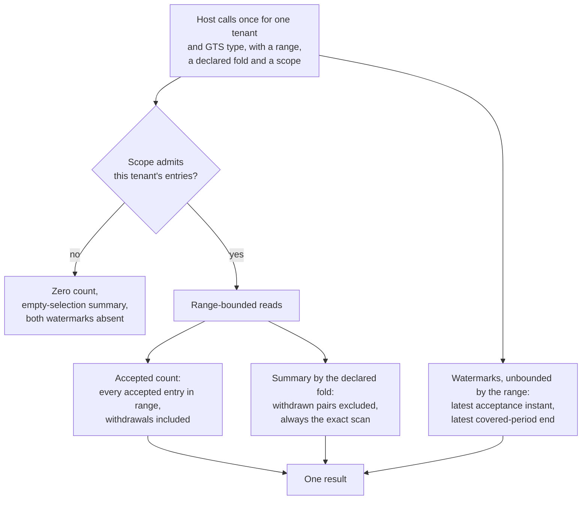

Created:  2026-09-26 by Virtuozzo International GmbH
Updated:  2026-09-26 by Virtuozzo International GmbH

# Feature: Reconciliation Metadata

- [ ] `p2` - **ID**: `cpt-cf-uc-plugin-featstatus-reconciliation-metadata-implemented`

- [ ] `p2` - `cpt-cf-uc-plugin-feature-reconciliation-metadata`

Reports, for one tenant and GTS type per call, the count of accepted entries in
the requested range, a fold-appropriate quantity summary over the same selection,
and two watermarks the range does not bound. Covers the deliberate asymmetry
between the count and the summary, the empty-selection values, and the rule that
a scope outside the caller's answers exactly as one holding no entries.

<!-- toc -->

- [1. Feature Context](#1-feature-context)
  - [1.1 Overview](#11-overview)
  - [1.2 Purpose](#12-purpose)
  - [1.3 Actors](#13-actors)
  - [1.4 References](#14-references)
- [2. Actor Flows (CDSL)](#2-actor-flows-cdsl)
  - [Host Reads Reconciliation Figures for One Scope](#host-reads-reconciliation-figures-for-one-scope)
- [3. Processes / Business Logic (CDSL)](#3-processes--business-logic-cdsl)
  - [Accepted Count](#accepted-count)
  - [Fold-Appropriate Summary](#fold-appropriate-summary)
  - [Watermark Reads](#watermark-reads)
- [4. States (CDSL)](#4-states-cdsl)
- [5. Definitions of Done](#5-definitions-of-done)
  - [The Accepted Count Includes Withdrawals](#the-accepted-count-includes-withdrawals)
  - [The Summary Excludes Withdrawn Pairs and Follows the Declared Fold](#the-summary-excludes-withdrawn-pairs-and-follows-the-declared-fold)
  - [Both Watermarks Are Unbounded by the Range](#both-watermarks-are-unbounded-by-the-range)
  - [Scope Is Applied First](#scope-is-applied-first)
  - [Empty-Selection Figures Are Defined per Fold](#empty-selection-figures-are-defined-per-fold)
  - [One Scope per Call, Always the Exact Scan](#one-scope-per-call-always-the-exact-scan)
  - [These Figures Make No Claim About Feed Completeness](#these-figures-make-no-claim-about-feed-completeness)
- [6. Acceptance Criteria](#6-acceptance-criteria)

<!-- /toc -->

## 1. Feature Context

### 1.1 Overview

Four figures, one scope, one call. The count reports ingestion activity and
therefore includes withdrawals. The summary reports quantity and therefore
excludes withdrawn pairs. The two watermarks report the latest acceptance instant
and the latest covered-period end, and neither is bounded by the requested range.

That asymmetry between count and summary is the feature. It looks like an
inconsistency and is not: the two figures answer different questions, and making
them agree would break whichever one was bent to match.

**Traces to**: `cpt-cf-uc-plugin-fr-reconciliation-metadata`

### 1.2 Purpose

Revenue assurance compares three totals: what an emitter believes it sent, what
the gear accepted, and what a consumer charged for. A gap between the first two
means submissions were lost or rejected; a gap between the last two means the
consumer is behind or has mis-derived. These figures are what make the middle
term readable.

The counters live in the plugin because the gear is stateless. There is nowhere
else for them to live, and deriving them at read time from the ledger is both
cheaper and more honest than maintaining a second tally that could drift from
what the store holds.

The summary follows whichever fold the host passes, never one the plugin picks,
per `cpt-cf-usage-collector-adr-declared-fold`. The range selects on the
covered-period end, per
`cpt-cf-usage-collector-adr-window-end-selection`, exactly as every other read
path does, so the same period means the same selection across the plugin.

The watermarks are deliberately unbounded by the range. Their job is to answer
"has anything arrived lately", and a watermark clipped to the requested range
could not distinguish a quiet period from a stalled emitter -- which is the one
thing revenue assurance most needs to see.

These figures prove nothing about feed completeness, and this document does not
let them be read that way.

**Requirements**: `cpt-cf-uc-plugin-fr-reconciliation-metadata`

**Principles**: none. The reconciliation read runs under the pure-persistence
principle `cpt-cf-uc-plugin-feature-record-ingestion-idempotency` carries and
adds none of its own.

**Constraints**: none. No constraint in DESIGN section 2.2 binds this read beyond
the injection-safe translation that
`cpt-cf-uc-plugin-feature-error-classification-transport-security` states for
every host-supplied filter.

**Component**: none. The reconciliation statements are built by the Query
component that `cpt-cf-uc-plugin-feature-aggregated-query-rollup` claims and
executed by the Record Store that
`cpt-cf-uc-plugin-feature-record-ingestion-idempotency` claims.

**Scope boundary.** No claim about feed completeness follows from these figures,
and none may be made from them. Paging is not offered and is not needed, since
the gear serves one scope per call. The summary always takes the exact scan and
is never served from the materialised aggregate, whose grain and refresh
watermark would make it disagree with a figure meant for reconciliation.

### 1.3 Actors

| Actor | Role in Feature |
|-------|-----------------|
| `cpt-cf-uc-plugin-actor-plugin-host` | The Usage Collector gear core. Resolves the type's declared fold, compiles the scope, and calls once per tenant and type; it is the SPI's sole caller |
| `cpt-cf-usage-collector-actor-platform-operator` | Runs the revenue-assurance comparison these figures feed, and is the reader for whom a stalled emitter must be distinguishable from a quiet one |

### 1.4 References

- **PRD**: [PRD.md](../PRD.md) -- section 5.3 Reconciliation Metadata
  (`cpt-cf-uc-plugin-fr-reconciliation-metadata`), including its note on why the
  count and the summary treat withdrawals differently and on the empty-selection
  renderings
- **Design**: [DESIGN.md](../DESIGN.md) -- section 3.6 Reconciliation; section
  3.3 Signature, which fixes the parameters and the one-scope-per-call shape;
  section 3.7, for the watermark and time-windowed indexes the two watermarks
  read through; section 3.1, for the reconciliation entity
- **ADR**:
  [ADR-0009](../../../../docs/ADR/0009-cpt-cf-usage-collector-adr-declared-fold.md)
  (`cpt-cf-usage-collector-adr-declared-fold`) -- the summary follows the
  declared fold the host passes, never one the plugin picks;
  [ADR-0014](../../../../docs/ADR/0014-cpt-cf-usage-collector-adr-window-end-selection.md)
  (`cpt-cf-usage-collector-adr-window-end-selection`) -- the range selects on the
  covered-period end
- **Decomposition**: [DECOMPOSITION.md](../DECOMPOSITION.md) -- entry 2.8
- **Entities**: the reconciliation result and the fold. Both arrive from the SDK
  and neither is minted here
- **Sequences**: `cpt-cf-uc-plugin-seq-reconciliation`
- **Dependencies**: `cpt-cf-uc-plugin-feature-record-ingestion-idempotency` and
  `cpt-cf-uc-plugin-feature-invalidation-persistence`. The accepted count
  includes withdrawals while the summary excludes withdrawn pairs, so the figures
  are only well-defined once both kinds of entry exist

**Data**: none. The ledger table and the watermark indexes this read uses are
provisioned by
`cpt-cf-uc-plugin-feature-registration-schema-provisioning`.

## 2. Actor Flows (CDSL)

One flow. It is a single scoped read that produces four figures, two of which
obey the requested range and two of which do not.

### Host Reads Reconciliation Figures for One Scope

- [ ] `p2` - **ID**: `cpt-cf-uc-plugin-flow-read-reconciliation-figures`

**Actor**: `cpt-cf-uc-plugin-actor-plugin-host`

**Success Scenarios**:
- The scope holds entries in the requested range. The count reports every
  accepted entry in it, the summary reports quantity with withdrawn pairs
  excluded, and both watermarks report the latest values across all of the
  scope's entries.
- The type declares a summing fold. The summary is the accrued sum, computed by
  the same exact-scan fold the aggregate path uses.
- The type declares any other fold. The summary is the count of surviving
  observations together with the latest observation, chosen by the same total
  order the aggregate path uses.
- The scope holds entries of the type but none in the requested range. The count
  is zero and the summary is the empty-selection value, while both watermarks are
  unaffected, because neither is bounded by the range.

**Error Scenarios**:
- The requested tenant falls outside the compiled scope. It answers exactly as a
  tenant holding no entries: a zero count, an empty-selection summary, and both
  watermarks absent. Nothing distinguishes the two cases.
- A caller reads these figures as evidence that the feed delivered everything.
  They are not evidence of that, and the document says so rather than leaving the
  inference available.
- The backend fails transiently. The call returns a transient and no partial
  result.

**Steps**:
1. [ ] - `p2` - Host resolves the type's declared fold and compiles the scope, then calls once for one tenant and GTS type - `inst-rec-host-params`
2. [ ] - `p2` - Plugin applies the compiled scope alongside the type as a predicate, deciding first whether the tenant's entries are visible at all - `inst-rec-scope-first`
3. [ ] - `p2` - **DB**: compute the accepted count over `cpt-cf-uc-plugin-dbtable-usage-records` with `cpt-cf-uc-plugin-algo-accepted-count` - `inst-rec-count`
4. [ ] - `p2` - **DB**: compute the summary with `cpt-cf-uc-plugin-algo-fold-appropriate-summary`, always by exact scan - `inst-rec-summary`
5. [ ] - `p2` - **DB**: read both watermarks with `cpt-cf-uc-plugin-algo-watermark-reads`, unbounded by the requested range - `inst-rec-watermarks`
6. [ ] - `p2` - **RETURN** one result for the requested scope, with no paging, since the gear serves one scope per call - `inst-rec-return`

## 3. Processes / Business Logic (CDSL)

Three processes, one per figure group. Each states what it counts and, where the
choice is surprising, why.

### Accepted Count

- [ ] `p2` - **ID**: `cpt-cf-uc-plugin-algo-accepted-count`

**Input**: the tenant, the GTS type, the covered-period range and the compiled
scope.

**Output**: the count of accepted entries the range selects.

**Steps**:
1. [ ] - `p2` - Apply the compiled scope alongside the type before anything is counted - `inst-cnt-scope-first`
2. [ ] - `p2` - Select entries whose covered-period end falls in the requested range, inclusive at the lower bound and exclusive at the upper - `inst-cnt-range`
3. [ ] - `p2` - Count every accepted entry the selection admits, withdrawals included - `inst-cnt-include-withdrawals`
4. [ ] - `p2` - Do not net withdrawals out of the count, because the figure reports ingestion activity rather than quantity, and a withdrawal was itself an accepted submission - `inst-cnt-why-no-netting`
5. [ ] - `p2` - Count one entry per dedup identity, which holds without extra work at this plugin's declared dedup level - `inst-cnt-one-per-identity`
6. [ ] - `p2` - **RETURN** the count; zero over an empty selection, which is defined - `inst-cnt-return`

### Fold-Appropriate Summary

- [ ] `p2` - **ID**: `cpt-cf-uc-plugin-algo-fold-appropriate-summary`

**Input**: the same selection, plus the fold the host declared.

**Output**: the accrued sum, or the observation count with the latest
observation.

**Steps**:
1. [ ] - `p2` - Take the fold from the host as a typed parameter and never choose one - `inst-sum-fold-from-host`
2. [ ] - `p2` - Exclude a withdrawn entry and the withdrawal that removed it from every figure in this summary - `inst-sum-exclude-pairs`
3. [ ] - `p2` - Treat that exclusion as the right asymmetry against the count: quantity must reflect what stands, while activity must reflect what arrived - `inst-sum-why-asymmetric`
4. [ ] - `p2` - **IF** the fold is the summing one, report the accrued sum, using the same exact-scan fold the aggregate path uses - `inst-sum-accrued`
5. [ ] - `p2` - **ELSE** report the count of surviving observations together with the latest observation, chosen by the same total order the aggregate path uses - `inst-sum-observations`
6. [ ] - `p2` - Never serve the summary from the materialised aggregate, whose grain and refresh watermark would let a reconciliation figure disagree with the ledger - `inst-sum-never-rollup`
7. [ ] - `p2` - Report zero for an accrual over an empty selection, because an accrual over an empty set is defined - `inst-sum-empty-accrual`
8. [ ] - `p2` - Report a zero observation count and an absent latest observation over an empty selection, because an observation over an empty set is not defined - `inst-sum-empty-observation`
9. [ ] - `p2` - **RETURN** the summary - `inst-sum-return`

### Watermark Reads

- [ ] `p2` - **ID**: `cpt-cf-uc-plugin-algo-watermark-reads`

**Input**: the tenant, the GTS type and the compiled scope.

**Output**: the latest acceptance instant and the latest covered-period end, or
both absent.

**Steps**:
1. [ ] - `p2` - Apply the compiled scope alongside the type, exactly as the range-bounded figures do - `inst-wm-scope-first`
2. [ ] - `p2` - Read the latest acceptance instant through the ledger's watermark index - `inst-wm-acceptance`
3. [ ] - `p2` - Read the latest covered-period end through the ledger's time-windowed read index - `inst-wm-window-end`
4. [ ] - `p2` - Leave both unbounded by the requested range - `inst-wm-unbounded`
5. [ ] - `p2` - Treat that as load-bearing: a watermark clipped to the range could not distinguish a quiet period from a stalled emitter, which is the comparison these figures exist for - `inst-wm-why-unbounded`
6. [ ] - `p2` - Report both absent when the scope holds no entries of the type at all - `inst-wm-absent`
7. [ ] - `p2` - Leave both unaffected when the scope holds entries of the type but none in the requested range - `inst-wm-unaffected-by-empty-range`
8. [ ] - `p2` - **RETURN** the two watermarks - `inst-wm-return`

## 4. States (CDSL)

**Not applicable.** The read carries no lifecycle. Every figure is computed from
the ledger at the moment of the call and nothing is stored, accumulated or
carried between calls: there is no running tally to advance, no checkpoint to
keep, and no reconciliation session to open or close. Deriving the figures at
read time rather than maintaining them is itself the design choice -- a
maintained tally would be a second source of truth that could drift from the
entries it summarises, and reconciliation is precisely the place where such a
drift would be invisible. The two watermarks are the nearest thing to state here,
and they are maximum values read from the ledger's own indexes rather than
positions the plugin advances. The lifecycles these figures read over belong
elsewhere: convergence to
`cpt-cf-uc-plugin-feature-record-ingestion-idempotency`, and withdrawal to
`cpt-cf-uc-plugin-feature-invalidation-persistence`.

## 5. Definitions of Done

### The Accepted Count Includes Withdrawals

- [ ] `p2` - **ID**: `cpt-cf-uc-plugin-dod-accepted-count-includes-withdrawals`

The system **MUST** count every accepted entry whose covered-period end falls in
the requested range, withdrawals included, and **MUST NOT** net withdrawals out
of that count. The figure reports ingestion activity rather than quantity, and a
withdrawal was itself an accepted submission. The range **MUST** select on the
covered-period end alone. Every figure **MUST** reflect one entry per dedup
identity.

**Implements**:
- `cpt-cf-uc-plugin-flow-read-reconciliation-figures`
- `cpt-cf-uc-plugin-algo-accepted-count`

**Requirements**: `cpt-cf-uc-plugin-fr-reconciliation-metadata`

**Touches**:
- API: `get_reconciliation_metadata` (SPI)
- DB Table: `cpt-cf-uc-plugin-dbtable-usage-records`
- Entities: `ReconciliationMetadata`

### The Summary Excludes Withdrawn Pairs and Follows the Declared Fold

- [ ] `p2` - **ID**: `cpt-cf-uc-plugin-dod-summary-excludes-withdrawn-pairs`

The system **MUST** exclude a withdrawn entry and the withdrawal that removed it
from the quantity summary, while the count includes both. The asymmetry **MUST**
be preserved rather than reconciled: quantity reflects what stands, activity
reflects what arrived. The summary **MUST** follow the fold the host passes and
**MUST NOT** choose one: a summing fold yields the accrued sum by the same
exact-scan fold the aggregate path uses, and any other fold yields the count of
surviving observations together with the latest observation by the same total
order the aggregate path uses.

**Implements**:
- `cpt-cf-uc-plugin-algo-fold-appropriate-summary`

**Requirements**: `cpt-cf-uc-plugin-fr-reconciliation-metadata`

**Touches**:
- API: `get_reconciliation_metadata` (SPI)
- DB Table: `cpt-cf-uc-plugin-dbtable-usage-records`
- Entities: `AggregationFold`, `ReconciliationMetadata`

### Both Watermarks Are Unbounded by the Range

- [ ] `p2` - **ID**: `cpt-cf-uc-plugin-dod-unbounded-watermarks`

The system **MUST** report the latest acceptance instant and the latest
covered-period end without bounding either by the requested range, reading each
through its dedicated index. A scope holding entries of the type but none in the
requested range **MUST** leave both watermarks unaffected. The watermarks
**MUST NOT** be clipped to the range, because a clipped watermark could not
distinguish a quiet period from a stalled emitter, which is the comparison these
figures exist to support.

**Implements**:
- `cpt-cf-uc-plugin-algo-watermark-reads`

**Requirements**: `cpt-cf-uc-plugin-fr-reconciliation-metadata`

**Touches**:
- API: `get_reconciliation_metadata` (SPI)
- DB Table: `cpt-cf-uc-plugin-dbtable-usage-records`
- Entities: `ReconciliationMetadata`

### Scope Is Applied First

- [ ] `p2` - **ID**: `cpt-cf-uc-plugin-dod-scope-applied-first`

The system **MUST** apply the host-supplied compiled scope alongside the GTS type
before any figure is computed, so a tenant outside it answers exactly as one
holding no entries: a zero count, an empty-selection summary, and both watermarks
absent. Nothing in the response **MAY** distinguish an out-of-scope tenant from
an empty one, so the endpoint discloses no existence.

**Implements**:
- `cpt-cf-uc-plugin-flow-read-reconciliation-figures`
- `cpt-cf-uc-plugin-algo-accepted-count`
- `cpt-cf-uc-plugin-algo-watermark-reads`

**Requirements**: `cpt-cf-uc-plugin-fr-reconciliation-metadata`

**Touches**:
- API: `get_reconciliation_metadata` (SPI)
- DB Table: `cpt-cf-uc-plugin-dbtable-usage-records`

### Empty-Selection Figures Are Defined per Fold

- [ ] `p2` - **ID**: `cpt-cf-uc-plugin-dod-empty-selection-figures`

The system **MUST** report zero for an accrual over an empty selection, because
an accrual over an empty set is defined, and **MUST** report a zero observation
count with an absent latest observation over an empty selection, because an
observation over an empty set is not. The count over an empty selection **MUST**
be zero. These values **MUST** match the empty-selection rule the aggregate path
applies, so the two surfaces do not disagree over the same absence.

**Implements**:
- `cpt-cf-uc-plugin-algo-fold-appropriate-summary`
- `cpt-cf-uc-plugin-algo-accepted-count`

**Requirements**: `cpt-cf-uc-plugin-fr-reconciliation-metadata`

**Touches**:
- API: `get_reconciliation_metadata` (SPI)
- Entities: `ReconciliationMetadata`

### One Scope per Call, Always the Exact Scan

- [ ] `p2` - **ID**: `cpt-cf-uc-plugin-dod-no-paging-no-rollup`

The system **MUST** serve one tenant and GTS type per call and **MUST NOT** offer
paging, since the gear narrowed the endpoint to one scope per call and the
parameters carry no paging arguments. The summary **MUST** always take the exact
scan and **MUST NOT** be served from the materialised aggregate, whose grain and
refresh watermark would let a reconciliation figure disagree with the entries it
is meant to reconcile against.

**Implements**:
- `cpt-cf-uc-plugin-flow-read-reconciliation-figures`
- `cpt-cf-uc-plugin-algo-fold-appropriate-summary`

**Requirements**: `cpt-cf-uc-plugin-fr-reconciliation-metadata`

**Touches**:
- API: `get_reconciliation_metadata` (SPI)
- Interface: `cpt-cf-uc-plugin-interface-spi`
- DB Table: `cpt-cf-uc-plugin-dbtable-usage-records`

### These Figures Make No Claim About Feed Completeness

- [ ] `p2` - **ID**: `cpt-cf-uc-plugin-dod-no-completeness-claim`

The system **MUST NOT** present or document these figures as evidence that the
feed delivered everything, and **MUST NOT** derive any feed guarantee from them.
They describe what the ledger holds for one scope; feed completeness is a
property of the feed's page protocol and is owned by
`cpt-cf-uc-plugin-feature-usage-feed`. Any surface exposing these figures
**MUST** keep that boundary visible.

**Implements**:
- `cpt-cf-uc-plugin-flow-read-reconciliation-figures`

**Requirements**: `cpt-cf-uc-plugin-fr-reconciliation-metadata`

**Touches**:
- API: `get_reconciliation_metadata` (SPI)
- Entities: `ReconciliationMetadata`

## 6. Acceptance Criteria

- [ ] A scope holding records and withdrawals in range reports a count that includes both.
- [ ] Withdrawing an entry increases the accepted count rather than decreasing it.
- [ ] The count selects on the covered-period end alone, verified with an entry whose covered period straddles the range boundary.
- [ ] The count reflects one entry per dedup identity, verified by submitting a retry that is absorbed.
- [ ] A summing fold reports the accrued sum with the withdrawn pair excluded, and the figure matches the aggregate path's exact scan over the same selection.
- [ ] A non-summing fold reports the count of surviving observations and the latest observation.
- [ ] The latest observation is chosen by the same total order the aggregate path uses, verified against entries tied on covered-period end and acceptance instant.
- [ ] The count and the summary disagree on a withdrawn pair by design: the count includes both entries while the summary excludes both, verified in one call.
- [ ] The summary is never served from the materialised aggregate, verified by confirming the generated statement reads the ledger.
- [ ] The summary follows the fold the host passed, and passing a different fold over the same data changes the summary shape accordingly.
- [ ] Both watermarks report the latest values across the scope's entries regardless of the requested range.
- [ ] A scope holding entries of the type but none in the requested range reports a zero count and an empty-selection summary while both watermarks still report values.
- [ ] Narrowing the requested range does not change either watermark.
- [ ] The acceptance watermark is served by the ledger's watermark index, verified by the query plan.
- [ ] The covered-period-end watermark is served by the time-windowed read index, verified by the query plan.
- [ ] A tenant outside the compiled scope reports a zero count, an empty-selection summary and both watermarks absent.
- [ ] The response for an out-of-scope tenant is byte-for-byte indistinguishable from the response for a tenant holding no entries.
- [ ] An accrual over an empty selection reports zero rather than an absent value.
- [ ] An observation summary over an empty selection reports a zero observation count and an absent latest observation.
- [ ] A scope holding no entries at all reports both watermarks absent.
- [ ] The empty-selection values match those the aggregate path returns over the same absence.
- [ ] The call takes one tenant and one GTS type and offers no paging parameter.
- [ ] Documentation and any surface exposing these figures state that they make no claim about feed completeness.
