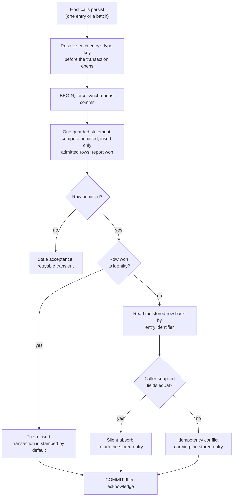

Created:  2026-09-26 by Virtuozzo International GmbH
Updated:  2026-09-26 by Virtuozzo International GmbH

# Feature: Record Ingestion & Idempotency

- [ ] `p1` - **ID**: `cpt-cf-uc-plugin-featstatus-record-ingestion-idempotency-implemented`

- [ ] `p1` - `cpt-cf-uc-plugin-feature-record-ingestion-idempotency`

One definition of done below stays unchecked,
`cpt-cf-uc-plugin-dod-durable-acknowledgement`: neither write transaction forces
`synchronous_commit`, so a server-level setting can still weaken an
acknowledgement, and DESIGN section 3.5 requires that it cannot. The feature and
status boxes above close with it, and with the throughput rate no suite in this
repository measures (`cpt-cf-uc-plugin-nfr-ingestion-throughput`).

Delivers the plugin's write path: single and batch persistence of usage entries,
deduplicated in the backend on the gear's six-part identity, acknowledged only
once durable, with every caller-supplied value stored verbatim. Covers the
guarded insert statement, duplicate resolution, the acceptance-slack refusal, the
declared dedup level, and the per-type key assignment that runs ahead of the
write transaction.

<!-- toc -->

- [1. Feature Context](#1-feature-context)
  - [1.1 Overview](#11-overview)
  - [1.2 Purpose](#12-purpose)
  - [1.3 Actors](#13-actors)
  - [1.4 References](#14-references)
- [2. Actor Flows (CDSL)](#2-actor-flows-cdsl)
  - [Host Persists a Single Usage Entry](#host-persists-a-single-usage-entry)
  - [Host Persists a Batch of Usage Entries](#host-persists-a-batch-of-usage-entries)
- [3. Processes / Business Logic (CDSL)](#3-processes--business-logic-cdsl)
  - [Guarded Insert Statement](#guarded-insert-statement)
  - [Duplicate Identity Resolution](#duplicate-identity-resolution)
  - [In-Batch Identity Resolution](#in-batch-identity-resolution)
  - [Per-Type Key Resolution](#per-type-key-resolution)
  - [Bounded Batch Retry on a Transient Abort](#bounded-batch-retry-on-a-transient-abort)
- [4. States (CDSL)](#4-states-cdsl)
  - [Dedup Identity State Machine](#dedup-identity-state-machine)
- [5. Definitions of Done](#5-definitions-of-done)
  - [Single-Entry Persistence Through One Guarded Statement](#single-entry-persistence-through-one-guarded-statement)
  - [Batch Persistence With Positionally Aligned Per-Entry Results](#batch-persistence-with-positionally-aligned-per-entry-results)
  - [Deduplication on the Gear's Six-Part Identity](#deduplication-on-the-gears-six-part-identity)
  - [Duplicate Resolution: Silent Absorb or Idempotency Conflict](#duplicate-resolution-silent-absorb-or-idempotency-conflict)
  - [Acceptance-Slack Refusal Takes Precedence](#acceptance-slack-refusal-takes-precedence)
  - [Linearizable Dedup Level With a Convergence Bound of Zero](#linearizable-dedup-level-with-a-convergence-bound-of-zero)
  - [Durable Acknowledgement on Every Write Transaction](#durable-acknowledgement-on-every-write-transaction)
  - [Digit-for-Digit Quantity Round-Trip](#digit-for-digit-quantity-round-trip)
  - [Per-Type Key Assigned on First Write](#per-type-key-assigned-on-first-write)
- [6. Acceptance Criteria](#6-acceptance-criteria)

<!-- /toc -->

## 1. Feature Context

### 1.1 Overview

Everything the plugin later reads comes through this path. One insert shape
serves both SPI methods: a single statement that computes its own admission
verdict, inserts only an admitted row, and reports whether that row won its
identity. The batch method runs the same statement over an unnested input set and
returns one result per input entry, positionally aligned to input order.

Deduplication happens in the store, not in the caller and not in the gear. The
ledger's unique constraint is the authority, and the conflict target is the same
column set, so two submissions of one identity cannot both land whatever their
timing.

**Traces to**: `cpt-cf-uc-plugin-fr-record-persistence`,
`cpt-cf-uc-plugin-fr-idempotent-dedup`

### 1.2 Purpose

`cpt-cf-usage-collector-adr-mandatory-idempotency` puts deduplication at the
storage boundary. Callers emit at least once, which means a retry after a lost
acknowledgement is normal traffic rather than an error, and the only place that
can settle a retry against its original is the store that holds the original.
Putting the check anywhere upstream would need a second source of truth that
could disagree with the ledger.

The identity the plugin deduplicates on is the gear's, not its own. It is the
tenant, the GTS (Global Type System) type, the caller's idempotency key, the
covered period and the entry type. The entry type has to be part of it: a record
and its withdrawal share the first four inputs and the covered period, so an
identity without the entry type would read every withdrawal as a collision with
the entry it withdraws.

The entry identifier the plugin stores is derived by the gateway as a version-5
UUID over that same identity, per
`cpt-cf-usage-collector-adr-record-identity-derivation`. The plugin mints no
identity of its own; it stores what it is handed and keys its read-backs on that
identifier, which covers all six inputs in one column.

An acknowledgement is the one surface the gear's consistency floor binds for
write-derived state. That is why this feature forces synchronous commit on every
write transaction and buffers nothing that has been acknowledged.

**Requirements**: `cpt-cf-uc-plugin-fr-record-persistence`,
`cpt-cf-uc-plugin-fr-idempotent-dedup`, `cpt-cf-uc-plugin-fr-durable-ack`,
`cpt-cf-uc-plugin-fr-quantity-fidelity`, `cpt-cf-uc-plugin-fr-dedup-level`,
`cpt-cf-uc-plugin-nfr-ingestion-throughput`

**Principles**: `cpt-cf-uc-plugin-principle-pure-persistence`

**Constraints**: `cpt-cf-uc-plugin-constraint-dedup-key-preservation`

**Component**: `cpt-cf-uc-plugin-component-record-store`

**Scope boundary.** Idempotency-key presence, attribution and metadata shape are
validated by the gear core before the call reaches the SPI, and are never
re-checked here. Persisting a withdrawal and its at-most-one rule belong to
`cpt-cf-uc-plugin-feature-invalidation-persistence`, which reuses this write path
unchanged. Preserving a dedup identity beyond the referenced type's declared
retention is bounded by
`cpt-cf-uc-plugin-feature-per-type-retention`. The startup durability checks that
refuse an unsafe server setting belong to
`cpt-cf-uc-plugin-feature-registration-schema-provisioning`;
`cpt-cf-uc-plugin-fr-durable-ack` is split between the two, and this feature owns
the per-transaction commit guarantee alone.

### 1.3 Actors

| Actor | Role in Feature |
|-------|-----------------|
| `cpt-cf-uc-plugin-actor-plugin-host` | The Usage Collector gear core. Derives each entry's identifier, authorizes and validates the call, then invokes the persist method and interprets the per-entry outcome it returns |

### 1.4 References

- **PRD**: [PRD.md](../PRD.md) -- section 5.1 Record Persistence, Idempotent
  Deduplication, Dedup Level, Durable Acknowledgement and Quantity Fidelity;
  section 6.1 Ingestion Throughput
  (`cpt-cf-uc-plugin-nfr-ingestion-throughput`); section 8 Ingest a Usage Record
  with Idempotent Dedup (`cpt-cf-uc-plugin-usecase-ingest-dedup`)
- **Design**: [DESIGN.md](../DESIGN.md) -- section 2.2 Dedup-Key Identity &
  Retention-Bounded Preservation; section 3.1 Domain Model, for the transaction
  identifier and the type key; section 3.2 Record Store; section 3.6 Ingest with
  idempotency dedup and Batch ingest with per-record results; section 3.7
  `usage_records`; section 4.1 item 9, the declared dedup level
- **ADR**:
  [ADR-0004](../../../../docs/ADR/0004-cpt-cf-usage-collector-adr-mandatory-idempotency.md)
  (`cpt-cf-usage-collector-adr-mandatory-idempotency`) -- every record carries a
  client idempotency key and dedup is the plugin's responsibility;
  [ADR-0007](../../../../docs/ADR/0007-cpt-cf-usage-collector-adr-record-identity-derivation.md)
  (`cpt-cf-usage-collector-adr-record-identity-derivation`) -- the gateway
  derives the entry identifier from the same six inputs;
  [ADR-0013](../../../../docs/ADR/0013-cpt-cf-usage-collector-adr-quantity-precision.md)
  (`cpt-cf-usage-collector-adr-quantity-precision`) -- the published quantity
  range and precision this feature round-trips
- **Decomposition**: [DECOMPOSITION.md](../DECOMPOSITION.md) -- entry 2.2
- **Sequences**: `cpt-cf-uc-plugin-seq-ingest-dedup`,
  `cpt-cf-uc-plugin-seq-ingest-batch`
- **Entities**: `UsageRecord`, `UsageRecordRow`, the inserting transaction
  identifier, and the per-type key. None is minted here except the transaction
  identifier and the type key, both of which the store assigns
- **Dependencies**: `cpt-cf-uc-plugin-feature-registration-schema-provisioning`.
  The write path inserts into the ledger hypertable, resolves a key from the
  type-key table, and relies on the dedup unique constraint. All three are
  schema objects that feature provisions, so there is nothing to write into
  before it has run

**Data**: none. The ledger and type-key tables this feature writes are
provisioned by
`cpt-cf-uc-plugin-feature-registration-schema-provisioning`; this feature adds no
schema object of its own.

## 2. Actor Flows (CDSL)

Two flows, both driven by the gear core. They differ in arity and in nothing
else: the same guarded statement runs under both, and the batch flow adds only
the per-row result assembly and the bounded retry.

### Host Persists a Single Usage Entry

- [ ] `p1` - **ID**: `cpt-cf-uc-plugin-flow-persist-single-entry`

Open on `inst-single-begin` alone: the write transaction does not force
synchronous commit.

**Actor**: `cpt-cf-uc-plugin-actor-plugin-host`

**Success Scenarios**:
- The identity is new. The entry is inserted, its transaction identifier is
  stamped by the column default, and the stored entry is returned after the
  commit.
- The identity exists and every caller-supplied field matches. The stored entry
  is returned unchanged, which is the silent absorb an at-least-once caller
  relies on.
- The same idempotency key arrives over a different covered period. That is a
  different identity, so the entry is inserted rather than absorbed.
- The same key and covered period arrive with the entry type set to a withdrawal.
  That is also a different identity, and both entries persist.

**Error Scenarios**:
- The entry's acceptance instant differs from the store's own clock, in either
  direction, by more than the configured acceptance slack. The write is refused
  as a retryable transient and counted, so the caller's retry is stamped afresh.
- The identity exists with differing caller-supplied fields. An idempotency
  conflict is returned, carrying the idempotency key and the stored entry, which
  the host needs to report an already-withdrawn target.
- Retention drops the conflicting row's chunk between the failed insert and the
  read-back. The call returns a retryable transient rather than a conflict about
  a row that no longer exists.
- The backend fails transiently. The transaction rolls back and nothing is
  acknowledged.

**Steps**:
1. [x] - `p1` - Host calls the single-entry persist method on the SPI, passing an entry that is already authorized and structurally valid - `inst-single-call`
2. [x] - `p1` - **DB**: resolve the entry's type key with `cpt-cf-uc-plugin-algo-type-key-resolution`, outside the write transaction - `inst-single-type-key`
3. [ ] - `p1` - **DB**: open the write transaction and force synchronous commit on it, so the acknowledgement cannot be weakened by a server-level setting - `inst-single-begin`
4. [x] - `p1` - **DB**: run the guarded insert of `cpt-cf-uc-plugin-algo-guarded-insert-statement` over `cpt-cf-uc-plugin-dbtable-usage-records`, which returns the row's admitted and won flags - `inst-single-guarded-insert`
5. [x] - `p1` - **IF** the row was not admitted, roll back and **RETURN** a retryable transient naming stale acceptance - `inst-single-not-admitted`
6. [x] - `p1` - **IF** the row was admitted and won, commit and **RETURN** the stored entry with its stamped transaction identifier - `inst-single-won`
7. [x] - `p1` - **ELSE** resolve the duplicate with `cpt-cf-uc-plugin-algo-duplicate-identity-resolution` - `inst-single-duplicate`
8. [x] - `p1` - **RETURN** the stored entry on a silent absorb, or an idempotency conflict carrying it - `inst-single-return`

### Host Persists a Batch of Usage Entries

- [ ] `p1` - **ID**: `cpt-cf-uc-plugin-flow-persist-entry-batch`

Open on `inst-batch-begin` alone, for the same reason
`cpt-cf-uc-plugin-flow-persist-single-entry` is.

**Actor**: `cpt-cf-uc-plugin-actor-plugin-host`

**Success Scenarios**:
- Every entry carries a new identity. All are inserted in one multi-row write,
  they share one transaction identifier, and the results come back in input
  order.
- Some entries are retries and some are new. Each retry is absorbed against its
  own stored row and each new entry is inserted; neither outcome affects the
  other entries.
- Two entries in one batch carry the same identity. The later resolves against
  the earlier: absorbed when identical, an idempotency conflict when divergent.
- A batch holds a record and its withdrawal. They are two identities, so each is
  resolved against its own row and both persist.

**Error Scenarios**:
- One entry conflicts and the rest do not. Only that entry's result carries the
  conflict; the batch does not fail.
- One entry's acceptance instant is outside the slack. Only that entry's result
  carries the stale-acceptance transient.
- The whole transaction aborts as a deadlock victim or on a serialization
  failure. The call retries up to its bounded attempt limit on a fresh connection
  and transaction, and each retry is counted.
- The attempt limit is exhausted. A transient is returned for the whole call, and
  nothing from the abandoned attempts remains in the ledger.

**Steps**:
1. [x] - `p1` - Host calls the batch persist method with an ordered list of entries - `inst-batch-call`
2. [x] - `p1` - **DB**: resolve every entry's type key with `cpt-cf-uc-plugin-algo-type-key-resolution` before the transaction opens - `inst-batch-type-keys`
3. [ ] - `p1` - **DB**: open the write transaction on a fresh connection and force synchronous commit - `inst-batch-begin`
4. [x] - `p1` - **DB**: run the guarded insert of `cpt-cf-uc-plugin-algo-guarded-insert-statement` over the unnested input set, one statement for the whole batch - `inst-batch-guarded-insert`
5. [x] - `p1` - **DB**: read back the admitted, not-won rows by entry identifier in one statement, and classify each with `cpt-cf-uc-plugin-algo-duplicate-identity-resolution` - `inst-batch-read-back`
6. [x] - `p1` - Resolve any two same-identity entries inside the batch with `cpt-cf-uc-plugin-algo-in-batch-identity-resolution` - `inst-batch-in-batch`
7. [x] - `p1` - **DB**: commit; every entry inserted by this call shares the transaction's identifier, and feed order inside it falls back to the entry identifier - `inst-batch-commit`
8. [x] - `p1` - **ON** an outer transient, apply `cpt-cf-uc-plugin-algo-batch-transient-retry`; per-entry transients inside a successful batch are the host's to handle and are never retried here - `inst-batch-retry`
9. [x] - `p1` - **RETURN** one result per input entry, positionally aligned to input order - `inst-batch-return`

## 3. Processes / Business Logic (CDSL)

Five processes. The first is the write itself; the next two settle what a
duplicate means; the fourth prepares the partition key the write needs; the last
bounds in-process recovery.

### Guarded Insert Statement

- [x] `p1` - **ID**: `cpt-cf-uc-plugin-algo-guarded-insert-statement`

**Input**: one or more entries with their resolved type keys, inside an open
write transaction.

**Output**: per input row, whether it was admitted and whether it won its
identity.

**Steps**:
1. [x] - `p1` - Build one statement whose input stage computes each row's admission verdict from that statement's own timestamp - `inst-guard-input-stage`
2. [x] - `p1` - Admit a row when its acceptance instant lies within the configured acceptance slack of that timestamp, in either direction - `inst-guard-admission-rule`
3. [x] - `p1` - Compute the verdict inside the statement and nowhere else, because a separate earlier or later statement would evaluate it under a different timestamp - `inst-guard-single-statement`
4. [x] - `p1` - **DB**: insert only the admitted rows into `cpt-cf-uc-plugin-dbtable-usage-records`, with the conflict target naming the dedup identity plus the type key and doing nothing on conflict - `inst-guard-insert-admitted`
5. [x] - `p1` - Leave the transaction identifier to the column default, so it is the identifier of the transaction that actually inserted the row and is never set by the store's own code - `inst-guard-xact-default`
6. [x] - `p1` - Return each input row joined to its inserted row on the entry identifier, so the caller learns both the admitted flag and the won flag per row - `inst-guard-outer-select`
7. [x] - `p1` - Give the admission verdict precedence over the identity outcome: a row that was not admitted is a stale-acceptance transient even when its identity already exists - `inst-guard-verdict-precedence`
8. [x] - `p1` - **RETURN** the per-row flags; this is the only statement in either flow that writes to the ledger - `inst-guard-return`

### Duplicate Identity Resolution

- [x] `p1` - **ID**: `cpt-cf-uc-plugin-algo-duplicate-identity-resolution`

**Input**: an admitted row that did not win its identity, plus the submitted
entry.

**Output**: the stored entry on a silent absorb, or an idempotency conflict
carrying it.

**Steps**:
1. [x] - `p1` - **DB**: read the stored row back by entry identifier, never by the tenant, type, key and covered period alone - `inst-dup-read-by-id`
2. [x] - `p1` - Treat the identifier as the correct key because, once an entry is withdrawn, two rows share those first columns, so a read by them could return the withdrawal for a record retry or the record for a withdrawal retry - `inst-dup-why-id`
3. [x] - `p1` - **IF** the read finds nothing because retention dropped the row's chunk in between, **RETURN** a retryable transient - `inst-dup-retention-race`
4. [x] - `p1` - Compare every caller-supplied field of the submission against the stored entry by value - `inst-dup-compare-fields`
5. [x] - `p1` - Compare metadata as a parsed document rather than as bytes, so key order, insignificant whitespace and a duplicate key's earlier occurrence do not register as a difference the store could not substantiate on read-back - `inst-dup-metadata-semantic`
6. [x] - `p1` - Exclude the server-assigned ingestion origin and acceptance instant from the comparison, so a retry that arrives over the other ingestion path still absorbs and returns the stored origin - `inst-dup-exclude-server-fields`
7. [x] - `p1` - **IF** every compared field is equal, **RETURN** the stored entry as a silent absorb and count the absorb - `inst-dup-absorb`
8. [x] - `p1` - **ELSE RETURN** an idempotency conflict carrying the idempotency key and the stored entry, and count the conflict - `inst-dup-conflict`

### In-Batch Identity Resolution

- [x] `p1` - **ID**: `cpt-cf-uc-plugin-algo-in-batch-identity-resolution`

**Input**: the batch's input rows and their per-row admitted and won flags.

**Output**: a per-entry outcome for the entries that share an identity with an
earlier entry in the same batch.

**Steps**:
1. [x] - `p1` - Recognise two same-identity entries by equal entry identifiers, which is equivalent to equality across all six identity inputs - `inst-inb-recognise`
2. [x] - `p1` - Treat the earlier position in input order as the original and the later as the retry - `inst-inb-order`
3. [x] - `p1` - **IF** the two are identical on every compared field, mark the later absorbed against the earlier - `inst-inb-absorb`
4. [x] - `p1` - **ELSE** mark the later an idempotency conflict carrying the earlier - `inst-inb-conflict`
5. [x] - `p1` - Resolve a record and its withdrawal in one batch as two identities, each against its own row, never against each other - `inst-inb-record-and-withdrawal`
6. [x] - `p1` - **RETURN** the outcomes without failing any other entry in the batch - `inst-inb-return`

### Per-Type Key Resolution

- [x] `p1` - **ID**: `cpt-cf-uc-plugin-algo-type-key-resolution`

**Input**: the GTS type identifiers of the entries about to be written.

**Output**: one small integer key per type, from the cache or newly assigned.

**Steps**:
1. [x] - `p1` - **IF** the process-wide cache holds the type's key, return it; a key never changes once assigned, so the cache never goes stale - `inst-key-cache-hit`
2. [x] - `p1` - **ELSE DB**: assign or read the key in `cpt-cf-uc-plugin-dbtable-usage-type-key`, whose key column is generated once per type - `inst-key-assign`
3. [x] - `p1` - Perform this outside the write transaction, so the guarded insert is that transaction's first write - `inst-key-before-transaction`
4. [x] - `p1` - Treat that ordering as load-bearing: the feed's settled-horizon reasoning depends on the insert being the transaction's first write - `inst-key-why-before`
5. [x] - `p1` - Cache the key for the process and use it as the ledger's type partition column, never as a declared attribute of the type - `inst-key-cache-store`
6. [x] - `p1` - **RETURN** the keys; resolving one assigns nothing about the type beyond its partitioning integer - `inst-key-return`

### Bounded Batch Retry on a Transient Abort

- [x] `p1` - **ID**: `cpt-cf-uc-plugin-algo-batch-transient-retry`

**Input**: a batch call whose transaction aborted with an outer transient.

**Output**: a completed batch result, or a transient for the whole call.

**Steps**:
1. [x] - `p1` - **TRY** the whole batch write - `inst-retry-try`
2. [x] - `p1` - **CATCH** an outer transient such as a deadlock-victim abort or a serialization failure - `inst-retry-catch`
3. [x] - `p1` - Take a fresh connection and a fresh transaction for each attempt, so a rolled-back attempt leaves nothing behind - `inst-retry-fresh-transaction`
4. [x] - `p1` - Treat re-running as safe, because the write is idempotent on the same identities - `inst-retry-safe-rerun`
5. [x] - `p1` - Count each retry, so a write that recovered in process is distinguishable from one that surfaced a transient to the host - `inst-retry-count`
6. [x] - `p1` - **IF** the bounded attempt limit is reached, **RETURN** the transient to the host - `inst-retry-exhausted`
7. [x] - `p1` - Never retry a per-entry transient inside a successful batch; those belong to the host - `inst-retry-not-per-entry`
8. [x] - `p1` - **RETURN** the batch result - `inst-retry-return`

## 4. States (CDSL)

### Dedup Identity State Machine

- [x] `p2` - **ID**: `cpt-cf-uc-plugin-state-dedup-identity`

**States**: Absent, Converged, RetentionDropped

**Initial State**: Absent

The identity, not the entry, is what carries a lifecycle here. It is modelled
because the meaning of a submission depends entirely on which state its identity
is in, and because the last transition is what makes preservation
retention-bounded rather than permanent.

**Transitions**:
1. [x] - `p1` - **FROM** Absent **TO** Converged **WHEN** a write under this identity commits; the first commit is the survivor and convergence is established at that commit, never from elapsed time - `inst-id-to-converged`
2. [x] - `p1` - **FROM** Absent **TO** Absent **WHEN** a submission is refused for stale acceptance; a refused write inserts nothing, so the identity is untouched - `inst-id-stale-no-change`
3. [x] - `p1` - **FROM** Converged **TO** Converged **WHEN** a later identical submission arrives; it is absorbed and returns the stored entry - `inst-id-absorb`
4. [x] - `p1` - **FROM** Converged **TO** Converged **WHEN** a later divergent submission arrives; it is rejected as an idempotency conflict and changes nothing - `inst-id-conflict`
5. [x] - `p1` - **FROM** Converged **TO** Converged **WHEN** a write whose caller was already answered reaches the store; it is discarded by the conflict rule rather than decided afresh - `inst-id-late-discard`
6. [x] - `p1` - **FROM** Converged **TO** RetentionDropped **WHEN** retention drops the chunk holding the entry, because the dedup index rides the chunk lifecycle and there is no separate dedup table to outlive it - `inst-id-to-dropped`
7. [x] - `p1` - **FROM** RetentionDropped **TO** Converged **WHEN** a submission under the same identity arrives afterwards; it is accepted as a fresh insert, which is the gear's adopted floor rather than a narrowing of it - `inst-id-fresh-after-drop`

## 5. Definitions of Done

### Single-Entry Persistence Through One Guarded Statement

- [x] `p1` - **ID**: `cpt-cf-uc-plugin-dod-single-entry-persistence`

The system **MUST** persist a single entry through one guarded statement that
computes its own admission verdict from that statement's timestamp, inserts only
an admitted row, and reports whether the row won its identity. The verdict
**MUST NOT** be computed by any statement before or after it. Caller- and
gateway-supplied values, metadata included, **MUST** be stored verbatim with no
transformation or interpretation. The inserting transaction's identifier **MUST**
come from the column default rather than from plugin code.

**Implements**:
- `cpt-cf-uc-plugin-flow-persist-single-entry`
- `cpt-cf-uc-plugin-algo-guarded-insert-statement`

**Requirements**: `cpt-cf-uc-plugin-fr-record-persistence`

**Principles**: `cpt-cf-uc-plugin-principle-pure-persistence`

**Touches**:
- API: `create_usage_record` (SPI)
- Component: `cpt-cf-uc-plugin-component-record-store`
- DB Table: `cpt-cf-uc-plugin-dbtable-usage-records`
- Entities: `UsageRecord`, `UsageRecordRow`

### Batch Persistence With Positionally Aligned Per-Entry Results

- [x] `p1` - **ID**: `cpt-cf-uc-plugin-dod-batch-positional-results`

The system **MUST** persist a batch through the same guarded statement shape over
an unnested input set, in one multi-row write, and **MUST** return one result per
input entry positionally aligned to input order. A conflict or a rejection on one
entry **MUST NOT** fail the others. Every entry inserted by one call **MUST**
share that call's transaction identifier, with the entry identifier breaking ties
within it. The whole call **MUST** be wrapped in a bounded retry on an outer
transient, each attempt on a fresh connection and transaction, and each retry
**MUST** be counted. Per-entry transients inside a successful batch **MUST NOT**
be retried in process.

**Implements**:
- `cpt-cf-uc-plugin-flow-persist-entry-batch`
- `cpt-cf-uc-plugin-algo-batch-transient-retry`

**Requirements**: `cpt-cf-uc-plugin-fr-record-persistence`,
`cpt-cf-uc-plugin-nfr-ingestion-throughput`

**Touches**:
- API: `create_usage_records` (SPI)
- Component: `cpt-cf-uc-plugin-component-record-store`
- DB Table: `cpt-cf-uc-plugin-dbtable-usage-records`

### Deduplication on the Gear's Six-Part Identity

- [x] `p1` - **ID**: `cpt-cf-uc-plugin-dod-dedup-identity-enforcement`

The system **MUST** deduplicate on the tenant, the GTS type, the idempotency
key, the covered period and the entry type, enforced by the ledger's unique
constraint with the same columns as its conflict target. The entry type **MUST**
be part of the identity, so a record and its withdrawal are two identities rather
than a collision. The type key carried alongside them **MUST** be treated as a
partition column only, never as an identity input, since a hypertable's unique
constraint has to contain every partition column and a type's key never changes.
Every place keyed on identity -- the conflict target, the read-back of a
conflicting row, the join between input and inserted rows, and the in-batch
comparison -- **MUST** key on the entry identifier or on all six inputs, never on
the first five alone.

**Implements**:
- `cpt-cf-uc-plugin-algo-guarded-insert-statement`
- `cpt-cf-uc-plugin-state-dedup-identity`

**Requirements**: `cpt-cf-uc-plugin-fr-idempotent-dedup`

**Constraints**: `cpt-cf-uc-plugin-constraint-dedup-key-preservation`

**Touches**:
- API: `create_usage_record` (SPI), `create_usage_records` (SPI)
- DB Table: `cpt-cf-uc-plugin-dbtable-usage-records`
- Component: `cpt-cf-uc-plugin-component-record-store`

### Duplicate Resolution: Silent Absorb or Idempotency Conflict

- [x] `p1` - **ID**: `cpt-cf-uc-plugin-dod-duplicate-resolution`

The system **MUST** resolve a duplicate identity by reading the stored row back
by entry identifier and comparing the submission's caller-supplied fields against
it. Identical fields **MUST** return the stored entry as a silent absorb;
divergent fields **MUST** return an idempotency conflict carrying the idempotency
key and the stored entry. Metadata **MUST** compare as a parsed document rather
than as bytes, and the server-assigned ingestion origin and acceptance instant
**MUST** take no part in the comparison. The read-back **MUST NOT** key on the
tenant, type, key and covered period alone, because a withdrawn entry leaves two
rows sharing those columns. A read-back that finds nothing because retention
dropped the row's chunk in between **MUST** return a retryable transient rather
than a conflict.

**Implements**:
- `cpt-cf-uc-plugin-algo-duplicate-identity-resolution`
- `cpt-cf-uc-plugin-algo-in-batch-identity-resolution`

**Requirements**: `cpt-cf-uc-plugin-fr-idempotent-dedup`

**Touches**:
- API: `create_usage_record` (SPI), `create_usage_records` (SPI)
- Component: `cpt-cf-uc-plugin-component-record-store`
- Entities: `UsageRecord`

### Acceptance-Slack Refusal Takes Precedence

- [x] `p1` - **ID**: `cpt-cf-uc-plugin-dod-acceptance-slack-refusal`

The system **MUST** refuse, as a retryable error, an entry whose acceptance
instant differs from the store's clock at insertion by more than the configured
acceptance slack, in either direction. The check **MUST** run inside the same
statement that performs the insert, against that statement's own timestamp. The
refusal **MUST** take precedence over the identity outcome, so a row outside the
slack is refused even when its identity already exists, which is what enforces
the acceptance-order slack the feed depends on. Each refusal **MUST** be counted.

**Implements**:
- `cpt-cf-uc-plugin-algo-guarded-insert-statement`

**Requirements**: `cpt-cf-uc-plugin-fr-record-persistence`

**Touches**:
- API: `create_usage_record` (SPI), `create_usage_records` (SPI)
- Component: `cpt-cf-uc-plugin-component-record-store`

### Linearizable Dedup Level With a Convergence Bound of Zero

- [x] `p1` - **ID**: `cpt-cf-uc-plugin-dod-linearizable-dedup-level`

The system **MUST** declare the dedup level `linearizable` with a convergence
bound of zero, and **MUST** meet it. Every submission under one identity **MUST**
be decided against every earlier one in the store's own commit order as it
commits, and convergence **MUST** be established from that commit state rather
than from elapsed time. The first write to commit **MUST** be the survivor. A
write whose caller was already answered and that reaches the store after the
identity converged **MUST** be discarded rather than decided afresh, and the
counter for that case **MUST** export at zero from startup so the series exists
even though it never fires at this level. The not-converged error variant
**MUST NOT** be returned by this path.

**Implements**:
- `cpt-cf-uc-plugin-state-dedup-identity`
- `cpt-cf-uc-plugin-algo-guarded-insert-statement`

**Requirements**: `cpt-cf-uc-plugin-fr-dedup-level`

**Touches**:
- API: `create_usage_record` (SPI), `create_usage_records` (SPI)
- Component: `cpt-cf-uc-plugin-component-record-store`

### Durable Acknowledgement on Every Write Transaction

- [ ] `p1` - **ID**: `cpt-cf-uc-plugin-dod-durable-acknowledgement`

Open. A persist call does return only after its commit and buffers nothing, but
nothing forces `synchronous_commit` on the write transaction, so the guarantee
rests on the server's own setting.

The system **MUST** force synchronous commit on every write transaction, so an
operator-level setting cannot weaken an acknowledgement, and **MUST** return from
a persist call only after every entry it reports accepted is durable. It **MUST
NOT** buffer acknowledged entries in memory and **MUST NOT** offer a flush call
on shutdown as a substitute for per-transaction durability. The startup checks
that refuse an unsafe server-wide durability setting belong to
`cpt-cf-uc-plugin-feature-registration-schema-provisioning`; this feature owns
the per-transaction guarantee.

**Implements**:
- `cpt-cf-uc-plugin-flow-persist-single-entry`
- `cpt-cf-uc-plugin-flow-persist-entry-batch`

**Requirements**: `cpt-cf-uc-plugin-fr-durable-ack`

**Touches**:
- API: `create_usage_record` (SPI), `create_usage_records` (SPI)
- Component: `cpt-cf-uc-plugin-component-record-store`

### Digit-for-Digit Quantity Round-Trip

- [x] `p1` - **ID**: `cpt-cf-uc-plugin-dod-quantity-round-trip`

The system **MUST** round-trip every quantity in the gear's published range and
precision digit for digit, the negative half included, on every read path that
returns an entry. It **MUST NOT** convert, scale, round, truncate or
sign-constrain a stored quantity. The submitted digits and scale **MUST** survive
the store unchanged, which requires the ledger's quantity column to carry no
precision or scale modifier.

**Implements**:
- `cpt-cf-uc-plugin-flow-persist-single-entry`

**Requirements**: `cpt-cf-uc-plugin-fr-quantity-fidelity`

**Touches**:
- API: `create_usage_record` (SPI)
- DB Table: `cpt-cf-uc-plugin-dbtable-usage-records`
- Entities: `UsageRecord`

### Per-Type Key Assigned on First Write

- [x] `p1` - **ID**: `cpt-cf-uc-plugin-dod-type-key-assignment`

The system **MUST** assign a type's key on the first write of that type, cache it
for the process, and never change it. Resolution **MUST** happen before the write
transaction opens, so the guarded insert is that transaction's first write. The
key **MUST** be used as the ledger's type partition column and **MUST NOT** carry
any declared attribute of the type, since declarations belong to the registry and
never reach this plugin.

**Implements**:
- `cpt-cf-uc-plugin-algo-type-key-resolution`

**Requirements**: `cpt-cf-uc-plugin-fr-record-persistence`

**Touches**:
- API: `create_usage_record` (SPI), `create_usage_records` (SPI)
- DB Table: `cpt-cf-uc-plugin-dbtable-usage-type-key`
- Component: `cpt-cf-uc-plugin-component-record-store`
- Entities: `Type key`

## 6. Acceptance Criteria

These are the feature's own release gate rather than traceability identifiers,
and they close with the feature ID box at the head of this document.

- [ ] Persisting an entry whose identity is new stores it and returns it with a transaction identifier the store stamped rather than the caller.
- [ ] Re-submitting an entry with identical caller-supplied fields returns the stored entry and creates no second row.
- [ ] Re-submitting an entry whose caller-supplied fields differ returns an idempotency conflict carrying the idempotency key and the stored entry.
- [ ] Two submissions differing only in metadata key order, in insignificant whitespace, or in a duplicate key's earlier occurrence are absorbed rather than reported as a conflict.
- [ ] A retry arriving over the other ingestion path is absorbed and returns the stored entry with its stored origin, which shows origin and acceptance instant take no part in the comparison.
- [ ] The same idempotency key over a different covered period is stored as a distinct entry.
- [ ] The same idempotency key and covered period with the entry type set to a withdrawal is stored as a distinct entry, and a retry of either is absorbed against its own row.
- [ ] The ledger's dedup unique constraint includes the entry-type column alongside tenant, GTS type, idempotency key and covered period, which is what keeps a withdrawal from colliding with its target under the same key and period.
- [ ] A conflicting-row read-back keyed on tenant, type, key and covered period alone returns the wrong row once an entry has been withdrawn, which shows the read-back must key on the entry identifier.
- [ ] An entry whose acceptance instant is earlier than the store's clock by more than the configured slack is refused as a retryable transient and counted.
- [ ] An entry whose acceptance instant is later than the store's clock by more than the configured slack is refused the same way.
- [ ] An entry outside the slack whose identity already exists is refused for stale acceptance rather than absorbed, which shows the admission verdict takes precedence.
- [ ] A batch returns exactly one result per input entry, in input order, when the batch mixes fresh entries, retries and conflicts.
- [ ] A batch in which one entry conflicts stores every other entry.
- [ ] A batch in which one entry is refused for stale acceptance stores every other entry.
- [ ] Two same-identity entries inside one batch resolve the later against the earlier: absorbed when identical, conflicting when divergent.
- [ ] A batch holding a record and its withdrawal stores both, each resolved against its own row.
- [ ] A batch holding retries of both a stored record and its stored withdrawal absorbs each against its own row.
- [ ] Every entry written by one batch call carries the same transaction identifier.
- [ ] A batch whose transaction aborts as a deadlock victim retries on a fresh connection, succeeds, and counts the retry.
- [ ] A batch that exhausts its attempt limit returns a transient and leaves no rows from the abandoned attempts.
- [ ] Concurrent submissions of one identity leave exactly one row, and the first to commit is the one that survives.
- [ ] A write that reaches the store after the identity converged is discarded rather than decided afresh, and the late-convergence counter stays at zero.
- [ ] The late-convergence counter exports at zero from startup, so the series exists without ever firing.
- [ ] The not-converged error variant is never returned from either persist method.
- [ ] A persist call returns only after a commit, and an entry reported accepted survives an immediate process kill.
- [ ] A write transaction forces synchronous commit even when the server's own setting is weaker.
- [ ] A quantity at each end of the published range, and one with trailing fractional digits, reads back with the same digits and the same scale.
- [ ] A negative quantity is stored and read back unchanged.
- [ ] The first write of a GTS type assigns its key, a second write of the same type reuses it without a further assignment, and the key never changes.
- [ ] Type-key resolution happens before the write transaction opens, so the guarded insert is that transaction's first write.
- [ ] The type-key table holds no declared attribute of any type and no foreign key to a catalog.
- [ ] After retention drops an entry's chunk, a submission under the same identity is accepted as a fresh insert.
