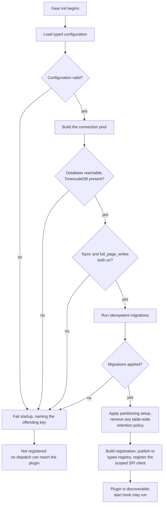

Created:  2026-09-26 by Virtuozzo International GmbH
Updated:  2026-09-26 by Virtuozzo International GmbH

# Feature: Registration & Schema Provisioning

- [ ] `p1` - **ID**: `cpt-cf-uc-plugin-featstatus-registration-schema-provisioning-implemented`

- [ ] `p1` - `cpt-cf-uc-plugin-feature-registration-schema-provisioning`

Two definitions of done below stay unchecked and both are slice 3's, the plugin
feed page and retention interlock: `cpt-cf-uc-plugin-dod-background-task-lifecycle`
waits on the background loop sampling the feed's settled-horizon lag, and
`cpt-cf-uc-plugin-dod-spi-conformance-release-gate` waits on the rows
`NOT_YET_CONFORMING` declares in `tests/contract_conformance_pg.rs`, every one
of which names slice 3. The count is left to the constant, which is expected to
shrink as they are paid off. The feature and status boxes above close with
them.

Brings the TimescaleDB backend into existence and makes it discoverable. Covers
the typed configuration load, the connection pool and its startup durability
checks, the idempotent schema migrations that build the whole ledger schema, the
configuration-driven partitioning setup, and the GTS handshake that publishes the
plugin and registers its scoped SPI client.

<!-- toc -->

- [1. Feature Context](#1-feature-context)
  - [1.1 Overview](#11-overview)
  - [1.2 Purpose](#12-purpose)
  - [1.3 Actors](#13-actors)
  - [1.4 References](#14-references)
- [2. Actor Flows (CDSL)](#2-actor-flows-cdsl)
  - [Operator Supplies the Backend Configuration](#operator-supplies-the-backend-configuration)
  - [Plugin Provisions Its Schema and Publishes Itself at Startup](#plugin-provisions-its-schema-and-publishes-itself-at-startup)
- [3. Processes / Business Logic (CDSL)](#3-processes--business-logic-cdsl)
  - [Typed Configuration Load and Validation](#typed-configuration-load-and-validation)
  - [Connection Pool Build and Startup Durability Checks](#connection-pool-build-and-startup-durability-checks)
  - [Idempotent Schema Provisioning](#idempotent-schema-provisioning)
  - [Configuration-Driven Post-Migration Setup](#configuration-driven-post-migration-setup)
  - [GTS Registration Handshake](#gts-registration-handshake)
- [4. States (CDSL)](#4-states-cdsl)
  - [Plugin Startup Lifecycle State Machine](#plugin-startup-lifecycle-state-machine)
- [5. Definitions of Done](#5-definitions-of-done)
  - [Typed Configuration Is Loaded Once and Validated Before Anything Is Wired](#typed-configuration-is-loaded-once-and-validated-before-anything-is-wired)
  - [Connection Pool and Startup Durability Gate](#connection-pool-and-startup-durability-gate)
  - [Idempotent Schema Provisioning at Startup](#idempotent-schema-provisioning-at-startup)
  - [Configuration-Driven Partitioning Setup](#configuration-driven-partitioning-setup)
  - [GTS-Scoped Registration After Provisioning](#gts-scoped-registration-after-provisioning)
  - [Background Task Lifecycle](#background-task-lifecycle)
  - [Vendor Isolation of Every Backend-Specific Dependency](#vendor-isolation-of-every-backend-specific-dependency)
  - [SPI Conformance as the Release Gate](#spi-conformance-as-the-release-gate)
- [6. Acceptance Criteria](#6-acceptance-criteria)

<!-- /toc -->

## 1. Feature Context

### 1.1 Overview

This is the plugin's foundation feature. Nothing else in the crate can run until
it has run: there is no table to write into, no pool to write through, and no
registration for the host to find. It executes entirely inside the gear's `init`
lifecycle hook, in one fixed order -- load configuration, build the pool, check
the server's durability settings, run the migrations, apply the partitioning
setup, then register -- and it owns the plugin's `start` and `stop` hooks for the
one background task the crate runs.

It also owns every data identifier the plugin declares. The schema is provisioned
here, once, as one idempotent migration set, so every other feature reads and
writes tables it does not create.

**Traces to**: `cpt-cf-uc-plugin-fr-registration`,
`cpt-cf-uc-plugin-fr-schema-provisioning`

### 1.2 Purpose

The Usage Collector gear reaches durable state only through its storage SPI
(Service Provider Interface -- the in-process Rust trait
`UsageCollectorPluginV1` a storage extension implements). That seam is what
`cpt-cf-usage-collector-adr-pluggable-storage` establishes, and it has two
halves. The gear owns selection: which vendor's plugin is bound, and when. The
plugin owns discovery: publishing itself under a GTS (Global Type System)
instance identifier so a selector can find it at all. This feature is the
discovery half.

Provisioning belongs in the same feature as registration because the ordering is
a correctness rule, not a convenience. The plugin registers itself only after its
schema exists and its durability checks have passed. A backend that published
itself first would be reachable while it still had no ledger to write into, and
every dispatch that arrived in that window would fail for a reason the host
cannot distinguish from a real backend outage.

The schema deliberately holds no usage-type catalog and no foreign key to one.
`cpt-cf-usage-collector-adr-registry-owned-typing` keeps type declarations in
`types-registry`, so they never reach this plugin. The one type-shaped table this
feature creates, `usage_type_key`, stores a partitioning integer per type and no
declared attribute at all.

**Requirements**: `cpt-cf-uc-plugin-fr-registration`,
`cpt-cf-uc-plugin-fr-schema-provisioning`, `cpt-cf-uc-plugin-fr-durable-ack`,
`cpt-cf-uc-plugin-nfr-spi-stability`

**Principles**: `cpt-cf-uc-plugin-principle-spi-conformance`

**Constraints**: `cpt-cf-uc-plugin-constraint-vendor-isolation`

**Components**: `cpt-cf-uc-plugin-component-gear`,
`cpt-cf-uc-plugin-component-migrations`

**Scope boundary.** The durable-acknowledgement requirement
`cpt-cf-uc-plugin-fr-durable-ack` is split across two features. This one owns the
startup check that refuses to run against a server whose `fsync` or
`full_page_writes` is off. The per-transaction commit guarantee belongs to
`cpt-cf-uc-plugin-feature-record-ingestion-idempotency`. Transport security on
the same pool -- the SSL-mode resolution and the redacted connection secret --
belongs to `cpt-cf-uc-plugin-feature-error-classification-transport-security`;
this feature builds the pool, that one decides how the connection is secured. The
rollup's refresh policies are applied during `init` by the Schema Migrations
component, but their content and their health sampling belong to
`cpt-cf-uc-plugin-feature-aggregated-query-rollup`.

### 1.3 Actors

| Actor | Role in Feature |
|-------|-----------------|
| `cpt-cf-uc-plugin-actor-plugin-host` | The Usage Collector gear core. Hosts the plugin's lifecycle hooks, runs the selector that later finds the published instance, and is the sole caller of the SPI this feature registers |
| `cpt-cf-usage-collector-actor-platform-operator` | Supplies the plugin's typed configuration through the gear's configuration surface, provisions the PostgreSQL database with the TimescaleDB extension, and owns the server settings the startup checks read |

### 1.4 References

- **PRD**: [PRD.md](../PRD.md) -- section 5.4 Self-Provisioned Schema
  (`cpt-cf-uc-plugin-fr-schema-provisioning`); section 5.5 GTS-Scoped Backend
  Registration (`cpt-cf-uc-plugin-fr-registration`); section 5.1 Durable
  Acknowledgement (`cpt-cf-uc-plugin-fr-durable-ack`); section 6.1 SPI
  Conformance & Contract Stability (`cpt-cf-uc-plugin-nfr-spi-stability`);
  section 7 for the public surface and the two external contracts; section 8
  Register the Backend at Plugin Startup
  (`cpt-cf-uc-plugin-usecase-bind-startup`)
- **Design**: [DESIGN.md](../DESIGN.md) -- section 3.2 Gear and Schema
  Migrations; section 3.3 API Contracts and the contract suite; section 3.5
  External Dependencies, which carries the configuration table and the
  durability rules; section 3.7 Database schemas & tables, the target schema
  this feature builds; section 2.2 Vendor Isolation and Data Retention
- **ADR**:
  [ADR-0002](../../../../docs/ADR/0002-cpt-cf-usage-collector-adr-pluggable-storage.md)
  (`cpt-cf-usage-collector-adr-pluggable-storage`) -- storage behind an SPI, with
  operator configuration binding the active backend;
  [ADR-0008](../../../../docs/ADR/0008-cpt-cf-usage-collector-adr-registry-owned-typing.md)
  (`cpt-cf-usage-collector-adr-registry-owned-typing`) -- type declarations stay
  in `types-registry`, which is why the provisioned schema carries no catalog
- **Decomposition**: [DECOMPOSITION.md](../DECOMPOSITION.md) -- entry 2.1
- **Interfaces**: `cpt-cf-uc-plugin-interface-storage-spi`, the plugin's sole
  public surface, realized as `cpt-cf-uc-plugin-interface-spi`
- **Contracts**: `cpt-cf-uc-plugin-contract-timescaledb`, required from the
  operator-provisioned database; `cpt-cf-uc-plugin-contract-gts-registration`,
  provided to the platform registry and realizing the gear's
  `cpt-cf-usage-collector-contract-gts-registry`
- **Sequences**: none. Startup is the Gear component's `init` and is described as
  a component responsibility in DESIGN section 3.2 rather than as a numbered
  sequence, so this feature specifies it through the flows and processes below
- **Entities**: `TimescaleDbPluginConfig`, `TypeKeyCache`, `Connection pool
  handle`
- **Dependencies**: none. This is the plugin's tier-0 foundation feature. Every
  one of the other nine features depends on it, directly or transitively

**Data**: this feature owns all five of the plugin's data identifiers. It is the
only feature that provisions a schema object; every other one states `Data: None`
because it reads or writes what this feature created.

- `cpt-cf-uc-plugin-db-schema` -- the plugin's whole database schema
- `cpt-cf-uc-plugin-dbtable-usage-records` -- the ledger hypertable
- `cpt-cf-uc-plugin-dbtable-usage-type-key` -- the per-type partitioning key
- `cpt-cf-uc-plugin-dbtable-usage-rollup-1h` -- the hourly continuous aggregate
- `cpt-cf-uc-plugin-dbtable-usage-feed-retention-marks` -- the feed's per-type
  retention marks

## 2. Actor Flows (CDSL)

Two flows. The first is the operator's: supply a configuration the plugin will
accept, on a database it can use. The second is the plugin's own startup, which
is the whole of this feature's runtime behavior.

### Operator Supplies the Backend Configuration

- [x] `p1` - **ID**: `cpt-cf-uc-plugin-flow-backend-configuration`

**Actor**: `cpt-cf-usage-collector-actor-platform-operator`

**Success Scenarios**:
- The operator sets `database_url` and `feed_replay_horizon_secs`, leaves the
  rest at their defaults, and the plugin starts. Every other field has a default
  that is a working value.
- The operator widens `chunk_time_interval_secs` or `type_key_slice_width` on a
  running deployment and restarts. The new values apply to chunks created
  afterwards; chunks that already exist keep the shape they were created with.
- The operator raises `transaction_timeout_secs` above `statement_timeout_secs`
  and the plugin accepts the pair, because the transaction bound must be the
  wider of the two.

**Error Scenarios**:
- `database_url` is absent or empty. Configuration validation fails and startup
  aborts, naming the field. No pool is built.
- `feed_replay_horizon_secs` is absent. Startup aborts the same way. The value is
  required because the SPI does not carry the replay horizon, so configuration
  is the only channel that delivers it.
- `transaction_timeout_secs` is at or below `statement_timeout_secs`.
  Configuration load rejects the pair, because a transaction bound narrower than
  its own statement bound cannot hold.
- `pool_size_max` is below 2. Validation rejects it: the retention sweep holds a
  detached connection while it runs, so a single-connection pool cannot serve a
  request during a sweep.
- `chunk_time_interval_secs` is not a multiple of 3600. Validation rejects it,
  because an hourly continuous aggregate cannot align to a chunk boundary that is
  not a whole number of hours.
- The database has no TimescaleDB extension, or the server has `fsync` or
  `full_page_writes` off. Startup aborts; these are the operator's to fix on the
  database rather than in the plugin's configuration.

**Steps**:
1. [x] - `p1` - Operator provisions a PostgreSQL database with the TimescaleDB extension and a TLS-capable endpoint, as `cpt-cf-uc-plugin-contract-timescaledb` requires - `inst-prov-database`
2. [x] - `p1` - Operator sets the plugin's typed configuration through the gear's configuration surface, supplying at minimum `database_url` and `feed_replay_horizon_secs` - `inst-prov-config-set`
3. [x] - `p1` - Operator sizes the database for the deployment's throughput and retention, and budgets `max_connections` for `pool_size_max` plus one per replica, since the retention sweep holds one extra detached connection - `inst-prov-size-connections`
4. [x] - `p1` - Operator declares retention on every GTS type at least the backfill window plus the replay horizon plus the acceptance-order slack; the plugin does not check this and the deployment carries the obligation - `inst-prov-retention-rule`
5. [x] - `p1` - Operator starts the gear; configuration is read once during `init`, so a later edit has no effect until the next restart - `inst-prov-restart-semantics`
6. [x] - `p1` - **IF** validation rejects any field, startup aborts naming the offending key and the plugin does not register - `inst-prov-validation-abort`
7. [x] - `p1` - **RETURN** a started plugin whose schema exists and whose SPI client is registered, or an aborted startup that published nothing - `inst-prov-return`

### Plugin Provisions Its Schema and Publishes Itself at Startup

- [ ] `p1` - **ID**: `cpt-cf-uc-plugin-flow-startup-provision-register`

Open on `inst-start-background` alone, which is slice 3's: the loop sweeps
retention and samples rollup health, and samples no feed horizon because no feed
read path exists to have one.

**Actor**: `cpt-cf-uc-plugin-actor-plugin-host`

**Success Scenarios**:
- A first start against an empty database creates the whole schema, applies the
  partitioning setup, and registers the plugin. The host's first dispatch that
  needs storage can then resolve it.
- A restart against the same database re-runs every migration as a no-op,
  re-applies the partitioning setup idempotently, and registers again. Nothing in
  the ledger changes.
- Several replicas start at once. The post-migration partitioning setup is
  serialized by an advisory lock, so one replica applies it and the others
  observe the applied state.

**Error Scenarios**:
- The database is unreachable when the pool is built. Startup fails fast and the
  plugin does not register, so no dispatch can reach a backend with no
  connection.
- A migration fails. Startup aborts, `uc_timescaledb_migration_failures_total`
  records the failure, and registration does not run.
- An earlier build left a table-wide declarative retention policy on the ledger.
  Post-migration setup removes it, because per-type retention is the plugin's own
  sweep and a table-wide policy would drop chunks the sweep is still holding.
- The registry publish or the `ClientHub` registration fails. Startup aborts. A
  plugin that provisioned a schema but published nothing is unreachable, and
  reporting that at startup is clearer than failing every later dispatch.

**Steps**:
1. [x] - `p1` - Host invokes the plugin's `init` lifecycle hook - `inst-start-init-hook`
2. [x] - `p1` - Plugin loads and validates its typed configuration with `cpt-cf-uc-plugin-algo-config-load-validate` - `inst-start-config`
3. [x] - `p1` - Plugin builds the connection pool and runs the startup durability checks with `cpt-cf-uc-plugin-algo-pool-build-durability-check` - `inst-start-pool`
4. [x] - `p1` - **DB**: run the migration set over `cpt-cf-uc-plugin-db-schema` with `cpt-cf-uc-plugin-algo-schema-migration`, building the ledger hypertable, the type-key table, the feed retention marks table and the hourly continuous aggregate - `inst-start-migrate`
5. [x] - `p1` - **DB**: apply the configuration-driven post-migration setup with `cpt-cf-uc-plugin-algo-post-migration-setup` on `cpt-cf-uc-plugin-dbtable-usage-records` - `inst-start-post-migration`
6. [x] - `p1` - Plugin performs the GTS handshake with `cpt-cf-uc-plugin-algo-gts-registration`, carrying its configured vendor and priority - `inst-start-register`
7. [x] - `p1` - **IF** any step above fails, abort startup without registering; a partially provisioned backend is never published - `inst-start-fail-closed`
8. [ ] - `p1` - Host invokes `start`, which runs the single background loop that sweeps retention, samples rollup health and samples the feed's settled-horizon lag - `inst-start-background`
9. [x] - `p1` - **ON** `stop`, cancel the background loop and let the pool close; no flush call and no readiness probe is offered to the host - `inst-start-stop`
10. [x] - `p1` - **RETURN** a registered, dispatchable plugin whose schema matches the target design - `inst-start-return`

## 3. Processes / Business Logic (CDSL)

Five processes, run in the order given. Each one is a gate: a failure in any of
them aborts startup rather than degrading into a partially usable backend.

### Typed Configuration Load and Validation

- [x] `p1` - **ID**: `cpt-cf-uc-plugin-algo-config-load-validate`

**Input**: the plugin's configuration as the gear's configuration surface
delivers it.

**Output**: a validated typed configuration value, or a startup failure naming
the offending field.

**Steps**:
1. [x] - `p1` - Deserialize the configuration into the typed struct, applying the declared default for every field the operator left out - `inst-cfg-deserialize`
2. [x] - `p1` - **IF** `database_url` is absent or empty, **RETURN** a startup failure naming it; there is no default connection string - `inst-cfg-require-dsn`
3. [x] - `p1` - **IF** `feed_replay_horizon_secs` is absent, **RETURN** a startup failure naming it; the SPI does not carry the replay horizon, so configuration is its only source - `inst-cfg-require-horizon`
4. [x] - `p1` - **IF** `transaction_timeout_secs` is not greater than `statement_timeout_secs`, **RETURN** a startup failure naming both - `inst-cfg-timeout-ordering`
5. [x] - `p1` - **IF** `pool_size_max` is below 2, **RETURN** a startup failure; the retention sweep's detached connection needs room beside a request-path connection - `inst-cfg-pool-min-two`
6. [x] - `p1` - **IF** `chunk_time_interval_secs` is not a whole multiple of 3600, **RETURN** a startup failure; hourly aggregate buckets must align to chunk boundaries - `inst-cfg-chunk-hour-multiple`
7. [x] - `p1` - Hold `database_url` in a debug-redacted secret wrapper from the moment it is read, so no later diagnostic can print it - `inst-cfg-redact-dsn`
8. [x] - `p1` - **RETURN** the validated configuration; every field consumed later in startup is read from this one value and never re-read from the environment - `inst-cfg-return`

### Connection Pool Build and Startup Durability Checks

- [x] `p1` - **ID**: `cpt-cf-uc-plugin-algo-pool-build-durability-check`

**Input**: the validated configuration.

**Output**: a live connection pool over a server whose durability settings cannot
lose a committed write, or a startup failure.

**Steps**:
1. [x] - `p1` - Build one connection pool over `database_url`, bounded by `pool_size_min` and `pool_size_max`, with `connection_timeout_secs` as its acquire timeout - `inst-pool-build`
2. [x] - `p1` - Apply `statement_timeout_secs` and `transaction_timeout_secs` to every pool connection, so no request-path statement or transaction outlives its bound - `inst-pool-timeouts`
3. [x] - `p1` - Note that this one pool serves ingestion, query, feed and reconciliation alike; the paths are not isolated, and that shortfall is published rather than hidden - `inst-pool-single`
4. [x] - `p1` - **DB**: verify the TimescaleDB extension is available, since hypertables and continuous aggregates are what the schema is built on - `inst-pool-extension`
5. [x] - `p1` - **DB**: read `current_setting('fsync')`; **IF** it is not `on`, **RETURN** a startup failure - `inst-pool-fsync`
6. [x] - `p1` - **DB**: read `current_setting('full_page_writes')`; **IF** it is not `on`, **RETURN** a startup failure - `inst-pool-full-page-writes`
7. [x] - `p1` - Treat both settings as server-wide and unforceable per transaction, which is exactly why they are checked once at startup rather than set per write - `inst-pool-why-startup-check`
8. [x] - `p1` - **RETURN** the pool; a failure here leaves the plugin unregistered rather than running against a server that can lose an acknowledged write - `inst-pool-return`

### Idempotent Schema Provisioning

- [x] `p1` - **ID**: `cpt-cf-uc-plugin-algo-schema-migration`

**Input**: the built pool.

**Output**: a database holding the target schema, or a startup failure.

**Steps**:
1. [x] - `p1` - Run the migration set through the migrator, which records what it has applied so a restart re-runs nothing it has already done - `inst-mig-run-set`
2. [x] - `p1` - **DB**: create `cpt-cf-uc-plugin-dbtable-usage-records` as a hypertable partitioned on `window_end` and on `type_key`, with its primary key covering both partition columns - `inst-mig-ledger`
3. [x] - `p1` - **DB**: create the ledger's dedup unique constraint over tenant, GTS type, idempotency key, covered period, entry type and type key, which is the store's dedup authority - `inst-mig-dedup-uniq`
4. [x] - `p1` - **DB**: create the ledger's check constraints -- covered-period ordering, the invalidation pairing rule that ties the withdrawal reference and reason code to the declared entry type, and the subject pairing rule - `inst-mig-checks`
5. [x] - `p1` - **DB**: create the ledger's indexes -- the withdrawal-reference lookup index, the two time-windowed read indexes, the feed-order index, and the reconciliation watermark index - `inst-mig-indexes`
6. [x] - `p1` - **DB**: create `cpt-cf-uc-plugin-dbtable-usage-type-key`, whose key is generated once per GTS type and never changes, carrying no declared attribute and no foreign key to any catalog - `inst-mig-type-key`
7. [x] - `p1` - Construct the process-wide `TypeKeyCache` empty during `init`; this feature owns only its construction, and its population on an entry's first write belongs to `cpt-cf-uc-plugin-feature-record-ingestion-idempotency` - `inst-mig-type-key-cache-empty`
8. [x] - `p1` - **DB**: create `cpt-cf-uc-plugin-dbtable-usage-feed-retention-marks`, one row per GTS type that has lost an entry to retention - `inst-mig-retention-marks`
9. [x] - `p1` - **DB**: create `cpt-cf-uc-plugin-dbtable-usage-rollup-1h` as a real-time hourly continuous aggregate over the ledger, keyed on bucket, tenant, GTS type and type key - `inst-mig-rollup`
10. [x] - `p1` - **IF** any statement fails, record `uc_timescaledb_migration_failures_total` and **RETURN** a startup failure - `inst-mig-failure`
11. [x] - `p1` - Keep every statement idempotent, so a restart re-runs provisioning as a no-op - `inst-mig-idempotent`
12. [x] - `p1` - **RETURN** a provisioned schema; the crate is pre-release, so the migration set is edited in place to the target shape rather than extended with a data migration - `inst-mig-return`

### Configuration-Driven Post-Migration Setup

- [x] `p1` - **ID**: `cpt-cf-uc-plugin-algo-post-migration-setup`

**Input**: the provisioned schema and the validated configuration.

**Output**: a ledger whose partitioning matches the configuration and carries no
table-wide retention policy.

**Steps**:
1. [x] - `p1` - Take an advisory lock, so replicas starting together serialize this step instead of racing on the same DDL - `inst-post-advisory-lock`
2. [x] - `p1` - Take that lock on a connection whose lifetime this step controls, and release it before the connection returns to the pool, so no later borrower inherits it - `inst-post-lock-hygiene`
3. [x] - `p1` - **DB**: set the ledger's chunk time interval from `chunk_time_interval_secs`; the value applies to chunks created afterwards and does not reshape existing ones - `inst-post-chunk-interval`
4. [x] - `p1` - **DB**: set the type-key partition's slice width from `type_key_slice_width`, on the same forward-only terms - `inst-post-slice-width`
5. [x] - `p1` - **DB**: remove any table-wide declarative retention policy on the ledger; per-type retention is the plugin's own sweep, and a table-wide policy would drop chunks the sweep is still holding for an unresolved type - `inst-post-drop-table-policy`
6. [x] - `p1` - Delegate the rollup's live and history refresh-policy application, which this step invokes but does not define - `inst-post-delegate-rollup`
7. [x] - `p1` - **RETURN** once the setup is applied; re-running it against an already-configured database changes nothing - `inst-post-return`

### GTS Registration Handshake

- [x] `p1` - **ID**: `cpt-cf-uc-plugin-algo-gts-registration`

**Input**: the provisioned backend, plus the configured vendor and priority.

**Output**: a published GTS instance and a registered scoped SPI client, or a
startup failure.

**Steps**:
1. [x] - `p1` - Build the plugin registration for the usage-collector plugin specification type, carrying the configured `vendor` and `priority` as its selection metadata - `inst-reg-build`
2. [x] - `p1` - **API**: publish the registration to `types-registry`, which is what makes the plugin visible to the host's selector - `inst-reg-publish`
3. [x] - `p1` - Register the plugin's SPI client on `ClientHub`, scoped to the GTS instance identifier just published, so the host's per-call scoped lookup resolves it - `inst-reg-client-hub`
4. [x] - `p1` - Use the published instance identifier as the client's scope and nothing else; a client registered under a different scope is a packaging defect that makes every dispatch miss - `inst-reg-scope-match`
5. [x] - `p1` - Decide nothing about whether this plugin is the active backend; vendor and priority are selection inputs the host reads, not a claim the plugin makes - `inst-reg-no-self-selection`
6. [x] - `p1` - **IF** either the publish or the client registration fails, **RETURN** a startup failure rather than a running but unreachable plugin - `inst-reg-fail-closed`
7. [x] - `p1` - **RETURN** a discoverable, dispatchable plugin; the host resolves its binding lazily on its own first dispatch, so nothing here waits on the host - `inst-reg-return`

## 4. States (CDSL)

### Plugin Startup Lifecycle State Machine

- [x] `p2` - **ID**: `cpt-cf-uc-plugin-state-startup-lifecycle`

**States**: Unstarted, Configured, Pooled, Provisioned, Registered, Running,
Stopped, StartupFailed

**Initial State**: Unstarted

The lifecycle is modelled because the ordering between its states is a
correctness rule rather than an implementation detail. Registration must follow
provisioning, and every failure path leads to the same terminal state, in which
nothing was published.

**Transitions**:
1. [x] - `p1` - **FROM** Unstarted **TO** Configured **WHEN** the typed configuration loads and every validation rule passes - `inst-state-to-configured`
2. [x] - `p1` - **FROM** Configured **TO** Pooled **WHEN** the pool is built, the TimescaleDB extension is present, and both durability settings read `on` - `inst-state-to-pooled`
3. [x] - `p1` - **FROM** Pooled **TO** Provisioned **WHEN** every migration has applied and the post-migration partitioning setup has run - `inst-state-to-provisioned`
4. [x] - `p1` - **FROM** Provisioned **TO** Registered **WHEN** the registration is published and the scoped SPI client is registered - `inst-state-to-registered`
5. [x] - `p1` - **FROM** Registered **TO** Running **WHEN** the host invokes `start` and the background loop begins - `inst-state-to-running`
6. [x] - `p1` - **FROM** Running **TO** Stopped **WHEN** the host invokes `stop` and the background loop is cancelled - `inst-state-to-stopped`
7. [x] - `p1` - **FROM** Configured **TO** StartupFailed **WHEN** the pool cannot be built, the extension is missing, or either durability setting is off - `inst-state-configured-failed`
8. [x] - `p1` - **FROM** Pooled **TO** StartupFailed **WHEN** a migration or the post-migration setup fails - `inst-state-pooled-failed`
9. [x] - `p1` - **FROM** Provisioned **TO** StartupFailed **WHEN** the registry publish or the scoped client registration fails - `inst-state-provisioned-failed`
10. [x] - `p1` - **FROM** Unstarted **TO** StartupFailed **WHEN** configuration validation rejects a field - `inst-state-unstarted-failed`
11. [x] - `p1` - **FROM** StartupFailed **TO** StartupFailed **WHEN** anything else is attempted; the state is terminal for the process, and nothing was published from it - `inst-state-failed-terminal`

## 5. Definitions of Done

### Typed Configuration Is Loaded Once and Validated Before Anything Is Wired

- [x] `p1` - **ID**: `cpt-cf-uc-plugin-dod-typed-configuration`

The system **MUST** load the plugin's configuration into a typed value during
`init`, before the pool is built, and **MUST** fail startup naming the offending
field when validation rejects it. `database_url` and `feed_replay_horizon_secs`
**MUST** be required with no default. `transaction_timeout_secs` **MUST** be
greater than `statement_timeout_secs`, `pool_size_max` **MUST** be at least 2,
and `chunk_time_interval_secs` **MUST** be a whole multiple of 3600.
Configuration **MUST** be read once, so an edit to a running deployment takes
effect only on restart. Every other field **MUST** carry a working default, so a
deployment that sets only the two required fields starts.

**Implements**:
- `cpt-cf-uc-plugin-flow-backend-configuration`
- `cpt-cf-uc-plugin-algo-config-load-validate`

**Requirements**: `cpt-cf-uc-plugin-fr-registration`

**Touches**:
- API: Gear `init` lifecycle hook
- Component: `cpt-cf-uc-plugin-component-gear`

### Connection Pool and Startup Durability Gate

- [x] `p1` - **ID**: `cpt-cf-uc-plugin-dod-connection-pool-durability-gate`

The system **MUST** create one connection pool over the operator-provisioned
database, bounded by the configured pool sizes and acquire timeout, and **MUST**
apply the configured statement and transaction timeouts to every pool
connection. It **MUST** verify that the TimescaleDB extension is available and
that the server reports `fsync` and `full_page_writes` both `on`, and **MUST**
refuse to start otherwise, because neither setting can be forced per transaction
and either one off can lose a committed write. The single pool serving every path
**MUST** be documented as a known workload-isolation shortfall rather than
presented as isolation. Operators **MUST** be told to budget database connections
for the pool maximum plus one per replica, since the retention sweep holds a
detached connection while it runs.

**Implements**:
- `cpt-cf-uc-plugin-flow-startup-provision-register`
- `cpt-cf-uc-plugin-algo-pool-build-durability-check`

**Requirements**: `cpt-cf-uc-plugin-fr-durable-ack`

**Touches**:
- API: Gear `init` lifecycle hook
- Component: `cpt-cf-uc-plugin-component-gear`
- Entities: `TimescaleDbPluginConfig`, `Connection pool handle`

### Idempotent Schema Provisioning at Startup

- [x] `p1` - **ID**: `cpt-cf-uc-plugin-dod-idempotent-schema-provisioning`

The system **MUST** provision its whole schema during `init`, before
registration, and **MUST** make every statement idempotent so a restart re-runs
provisioning as a no-op. The migration set **MUST** build the ledger hypertable
with its dedup unique constraint, its covered-period, invalidation-pairing and
subject-pairing check constraints, and its withdrawal-reference, time-windowed,
feed-order and watermark indexes; the type-key table; the feed retention marks
table; and the hourly real-time continuous aggregate. The schema **MUST** carry
no usage-type catalog and no foreign key to one. A failed migration **MUST**
abort startup and **MUST** be counted, and the plugin **MUST NOT** register.
Deployment **MUST** require no manual database setup beyond provisioning the
database itself.

**Implements**:
- `cpt-cf-uc-plugin-flow-startup-provision-register`
- `cpt-cf-uc-plugin-algo-schema-migration`

**Requirements**: `cpt-cf-uc-plugin-fr-schema-provisioning`

**Touches**:
- API: Gear `init` lifecycle hook
- DB: `cpt-cf-uc-plugin-db-schema`
- DB Table: `cpt-cf-uc-plugin-dbtable-usage-records`
- DB Table: `cpt-cf-uc-plugin-dbtable-usage-type-key`
- DB Table: `cpt-cf-uc-plugin-dbtable-usage-feed-retention-marks`
- DB Table: `cpt-cf-uc-plugin-dbtable-usage-rollup-1h`
- Component: `cpt-cf-uc-plugin-component-migrations`

### Configuration-Driven Partitioning Setup

- [x] `p1` - **ID**: `cpt-cf-uc-plugin-dod-partitioning-setup`

The system **MUST** apply the configured chunk time interval and type-key slice
width to the ledger after the migrations run, and **MUST** treat both as
forward-only: they shape chunks created afterwards and do not reshape existing
ones. It **MUST** remove any table-wide declarative retention policy left on the
ledger, because per-type retention is the plugin's own sweep and a table-wide
policy would drop chunks the sweep is still holding. The step **MUST** serialize
across replicas with an advisory lock taken and released within the step, so no
pooled connection is handed back still holding it. Re-running the step against an
already-configured database **MUST** change nothing.

**Implements**:
- `cpt-cf-uc-plugin-algo-post-migration-setup`

**Constraints**: `cpt-cf-uc-plugin-constraint-retention`

**Touches**:
- API: Gear `init` lifecycle hook
- DB Table: `cpt-cf-uc-plugin-dbtable-usage-records`
- Component: `cpt-cf-uc-plugin-component-migrations`

### GTS-Scoped Registration After Provisioning

- [x] `p1` - **ID**: `cpt-cf-uc-plugin-dod-gts-scoped-registration`

The system **MUST** publish its plugin registration to `types-registry` and
register its SPI client on `ClientHub` scoped to that published instance
identifier, carrying the configured vendor and priority. Registration **MUST**
run only after the pool, the durability checks, the migrations and the
partitioning setup have all succeeded, so a published plugin always has a schema
to serve from. The client's scope **MUST** be the published instance identifier,
since any other scope makes every host lookup miss. The plugin **MUST NOT**
decide whether it is the active backend: vendor and priority are inputs to the
host's selection, not a claim. A failed publish or registration **MUST** abort
startup rather than leave a provisioned but unreachable backend running.

**Implements**:
- `cpt-cf-uc-plugin-flow-startup-provision-register`
- `cpt-cf-uc-plugin-algo-gts-registration`
- `cpt-cf-uc-plugin-state-startup-lifecycle`

**Requirements**: `cpt-cf-uc-plugin-fr-registration`

**Touches**:
- API: `UsageCollectorPluginV1` registration under the GTS instance scope
- Contract: `cpt-cf-uc-plugin-contract-gts-registration`
- Component: `cpt-cf-uc-plugin-component-gear`

### Background Task Lifecycle

- [ ] `p1` - **ID**: `cpt-cf-uc-plugin-dod-background-task-lifecycle`

Open on the feed's settled-horizon sampling, which is slice 3's.

The system **MUST** own exactly one background task, started by the gear's
`start` hook and cancelled by its `stop` hook, that runs the retention sweep,
samples rollup health and samples the feed's settled-horizon lag. The task
**MUST NOT** start before registration has succeeded, and **MUST** be cancelled
on shutdown so no sweep outlives the process. The plugin **MUST** offer the host
no flush call and no readiness probe on these hooks; acknowledgement durability
is a property of each write transaction, not of shutdown.

**Implements**:
- `cpt-cf-uc-plugin-flow-startup-provision-register`
- `cpt-cf-uc-plugin-state-startup-lifecycle`

**Requirements**: `cpt-cf-uc-plugin-fr-registration`

**Touches**:
- API: Gear `start` / `stop` lifecycle hooks
- Component: `cpt-cf-uc-plugin-component-gear`

### Vendor Isolation of Every Backend-Specific Dependency

- [x] `p1` - **ID**: `cpt-cf-uc-plugin-dod-vendor-isolation`

The system **MUST** keep every backend-specific dependency, SQL statement and
schema object inside this crate. The crate **MUST** depend on the storage SDK and
the registry SDK alone and **MUST NOT** carry a compile-time dependency on the
host gear crate, so the binding is established at runtime through the registry
and the client hub rather than at link time. No TimescaleDB-specific type,
statement or licensing assumption may appear outside this crate.

**Implements**:
- `cpt-cf-uc-plugin-algo-gts-registration`

**Constraints**: `cpt-cf-uc-plugin-constraint-vendor-isolation`

**Touches**:
- Contract: `cpt-cf-uc-plugin-contract-timescaledb`

### SPI Conformance as the Release Gate

- [ ] `p1` - **ID**: `cpt-cf-uc-plugin-dod-spi-conformance-release-gate`

Open on the rows `NOT_YET_CONFORMING` declares, every one of which names slice
3. The compile-time half holds: the SPI is the SDK trait's seven methods, and
the adapter implements all seven and adds no method of its own beyond its
constructor.

The system **MUST** implement the storage SPI's seven methods exactly as the gear
declares them, verified at compile time against the SDK trait, and **MUST** pass
the gear's full SPI contract suite before release. Which checks run **MUST** be
read off the suite itself rather than off a count written in a document, and a
blocked or unimplemented check **MUST** be treated as a release blocker rather
than an accepted gap. Changes within a major SPI version **MUST** be additive
only. Compilation alone **MUST NOT** be accepted as conformance. The behavioural
assertions the suite makes belong to the features that define those behaviours;
this feature owns the obligation to run the suite green as the gate.

**Implements**:
- `cpt-cf-uc-plugin-flow-startup-provision-register`

**Requirements**: `cpt-cf-uc-plugin-nfr-spi-stability`

**Principles**: `cpt-cf-uc-plugin-principle-spi-conformance`

**Touches**:
- Interface: `cpt-cf-uc-plugin-interface-spi`
- Interface: `cpt-cf-uc-plugin-interface-storage-spi`

## 6. Acceptance Criteria

These are the feature's own release gate rather than traceability identifiers,
and they close with the feature ID box at the head of this document.

- [ ] Starting with `database_url` and `feed_replay_horizon_secs` set and every other field absent succeeds, which shows each remaining field carries a working default.
- [ ] Starting with `database_url` absent or empty fails, naming the field, and no pool is built.
- [ ] Starting with `feed_replay_horizon_secs` absent fails, naming the field.
- [ ] A configuration whose `transaction_timeout_secs` is at or below `statement_timeout_secs` is rejected at load, naming both fields.
- [ ] A configuration whose `pool_size_max` is below 2 is rejected at load.
- [ ] A configuration whose `chunk_time_interval_secs` is not a whole multiple of 3600 is rejected at load.
- [ ] Editing configuration on a running deployment changes nothing until the process restarts.
- [ ] Starting against a server reporting `fsync = off` fails, and the plugin does not register.
- [ ] Starting against a server reporting `full_page_writes = off` fails, and the plugin does not register.
- [ ] Starting against a database without the TimescaleDB extension fails, and the plugin does not register.
- [ ] A first start against an empty database creates the ledger hypertable, the type-key table, the feed retention marks table and the hourly continuous aggregate, and the schema read back from the live database matches the target design table by table, column by column.
- [ ] The ledger's dedup unique constraint exists over tenant, GTS type, idempotency key, covered-period start, covered-period end, entry type and type key.
- [ ] The ledger carries the covered-period ordering check, the invalidation-pairing check, and the subject-pairing check.
- [ ] The ledger carries the withdrawal-reference lookup index, both time-windowed read indexes, the feed-order index and the reconciliation watermark index.
- [ ] No table in the provisioned schema holds a usage-type declaration, and no foreign key points at a type catalog.
- [ ] Restarting against the already-provisioned database applies no migration, changes no schema object, and still registers.
- [ ] A migration failure aborts startup, increments the migration-failure counter, and leaves the plugin unregistered.
- [ ] After startup the ledger's chunk time interval and type-key slice width match the configured values, and changing either and restarting affects only chunks created afterwards.
- [ ] Startup removes a table-wide declarative retention policy placed on the ledger beforehand, and leaves none behind.
- [ ] Two replicas starting simultaneously apply the post-migration setup once between them, and neither returns a pooled connection that still holds the advisory lock.
- [ ] After a successful start, the published GTS instance is discoverable by the specification's schema identifier plus the configured vendor, and carries the configured priority.
- [ ] The registered SPI client is reachable by a scoped lookup on exactly the published instance identifier, and is not reachable under any other scope.
- [ ] Registration happens after the migrations: a run in which migrations fail publishes no instance and registers no client.
- [ ] A failed registry publish or a failed scoped-client registration aborts startup rather than leaving a running unregistered plugin.
- [ ] The plugin makes no decision about which backend is active: changing only `vendor` and restarting changes the published selection metadata and nothing about the plugin's own behavior.
- [ ] The `start` hook runs exactly one background task and the `stop` hook cancels it, with no sweep left running after shutdown.
- [ ] A dependency check shows the crate depends on the storage SDK and the registry SDK and not on the host gear crate.
- [ ] A source scan finds no TimescaleDB-specific SQL, schema object or client dependency outside this crate.
- [ ] The crate compiles against the SDK's seven-method SPI trait with no method missing and no extra method on the public surface.
- [ ] The gear's full SPI contract suite runs against a live backend and every check it carries passes, with none blocked or skipped.
