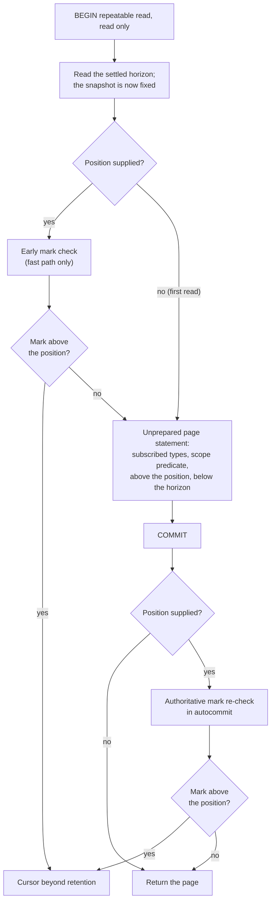

Created:  2026-09-26 by Virtuozzo International GmbH
Updated:  2026-09-26 by Virtuozzo International GmbH

# Feature: Usage Feed

- [ ] `p1` - **ID**: `cpt-cf-uc-plugin-featstatus-usage-feed-implemented`

- [ ] `p1` - `cpt-cf-uc-plugin-feature-usage-feed`

Serves replay-safe feed pages over a subscription of GTS types under the
host-supplied compiled scope, in the plugin's own deterministic order below the
instance-wide settled horizon. Covers the page protocol and its completeness
argument, the named start, the live head position, the retention refusal read
from per-type marks, and the freshness and replay-rate bounds the feed path
publishes.

<!-- toc -->

- [1. Feature Context](#1-feature-context)
  - [1.1 Overview](#11-overview)
  - [1.2 Purpose](#12-purpose)
  - [1.3 Actors](#13-actors)
  - [1.4 References](#14-references)
- [2. Actor Flows (CDSL)](#2-actor-flows-cdsl)
  - [Host Reads a Feed Page](#host-reads-a-feed-page)
  - [Consumer Resumes After Retention Removed an Entry](#consumer-resumes-after-retention-removed-an-entry)
- [3. Processes / Business Logic (CDSL)](#3-processes--business-logic-cdsl)
  - [Feed Page Protocol](#feed-page-protocol)
  - [Retention Mark Check](#retention-mark-check)
  - [Next Position Selection](#next-position-selection)
  - [Acceptance-Order Slack Derivation](#acceptance-order-slack-derivation)
- [4. States (CDSL)](#4-states-cdsl)
  - [Feed Position State Machine](#feed-position-state-machine)
- [5. Definitions of Done](#5-definitions-of-done)
  - [Feed Order Is Transaction Identifier Then Entry Identifier](#feed-order-is-transaction-identifier-then-entry-identifier)
  - [The Settled Page Protocol Runs in Its Fixed Step Order](#the-settled-page-protocol-runs-in-its-fixed-step-order)
  - [Completeness Under Any Concurrency](#completeness-under-any-concurrency)
  - [Snapshot Consistency and Bounded Replay](#snapshot-consistency-and-bounded-replay)
  - [A Live Head Position](#a-live-head-position)
  - [A Named Start, With the Oldest Start Beginning at the Oldest Retained Entry](#a-named-start-with-the-oldest-start-beginning-at-the-oldest-retained-entry)
  - [Retention Refusal Reads Marks, Never Age](#retention-refusal-reads-marks-never-age)
  - [The Plugin Issues Only Its Own Opaque Position](#the-plugin-issues-only-its-own-opaque-position)
  - [Acceptance-to-Feed-Visibility Is Bounded and Its Deployment Rule Published](#acceptance-to-feed-visibility-is-bounded-and-its-deployment-rule-published)
  - [Sustained Replay Read Rate](#sustained-replay-read-rate)
- [6. Acceptance Criteria](#6-acceptance-criteria)

<!-- /toc -->

## 1. Feature Context

### 1.1 Overview

A charging consumer reads this feed and derives charges from the entries it
returns. That makes the guarantees rather than the throughput the hard part: a
scan that silently skips an entry under-charges, and one that silently repeats
an entry double-charges, and neither is visible to the consumer at the time.

The order is the inserting transaction's identifier, then the entry identifier.
A page reads only entries below the instance-wide settled horizon -- the oldest
transaction still holding an identifier -- so every transaction that could still
add an entry at or before a returned position has already finished. That one
property is what makes the feed complete under any concurrency, commit order or
number of gateway replicas.

**Traces to**: `cpt-cf-uc-plugin-fr-usage-feed`

### 1.2 Purpose

`cpt-cf-usage-collector-adr-feed-aggregate-split` decides that a charging
consumer reads the entry feed rather than an aggregate. It also fixes three
things this feature implements: the gateway owns the wire cursor, pages come in a
deterministic order the plugin chooses, and a withdrawal follows the entry it
withdraws.

The order deliberately does not rest on the gateway-stamped acceptance instant.
Replica clock skew can stamp a withdrawal earlier than its target, and a feed
ordered on that instant would deliver the correction before the thing it
corrects. Transaction identifiers cannot misorder them: the gateway accepts a
withdrawal only after its target has converged, so the withdrawal's transaction
is assigned its identifier after the target's committed.

Refusal is read from what the store still holds, never from a position's age.
`cpt-cf-usage-collector-adr-consistency-contract` states the snapshot guarantee
the append-only ledger purchases, and the gateway's rule is that a position after
which retention has removed an entry of a subscribed type must be refused rather
than served as a silently truncated range. A position whose continuation is
intact is therefore served however old it is.

**Requirements**: `cpt-cf-uc-plugin-fr-usage-feed`,
`cpt-cf-uc-plugin-nfr-feed-freshness`,
`cpt-cf-uc-plugin-nfr-replay-throughput`

**Principles**: none. The feed reads the ledger under the pure-persistence
principle `cpt-cf-uc-plugin-feature-record-ingestion-idempotency` carries and
adds no principle of its own.

**Constraints**: `cpt-cf-uc-plugin-constraint-gateway-owned-cursors`

**Component**: none. Feed pages are read through the Record Store that
`cpt-cf-uc-plugin-feature-record-ingestion-idempotency` claims, and their
statements are built by the Query component that
`cpt-cf-uc-plugin-feature-aggregated-query-rollup` claims. This feature defines
the page protocol and its guarantees.

**Scope boundary.** Deleting entries and raising the retention marks the refusal
reads belong to `cpt-cf-uc-plugin-feature-per-type-retention`. Minting, encoding
or interpreting a wire cursor belongs to the gateway; the plugin issues only its
own opaque position.

**Two gateway-side items are recorded here, not resolved.** Both are in PRD
section 13 and neither may be closed by an implementation.

First, the deployment supplies the replay horizon as plugin configuration,
because the SPI does not carry it. Whether it should reach the plugin through the
SPI instead is an open question for the gateway. This feature reads it from
configuration and states the dependency plainly rather than treating the choice
as settled.

Second, a known shortfall stands against the gateway's cursor zones. The mark
check reads settled entries only, so a transaction that holds an identifier open
for at least the replay horizon can leave a position polled at the head
refusable. Nothing is silently truncated: a mark still refuses the position after
any deletion. The horizon-lag gauge surfaces such a transaction on a best-effort
basis. This feature documents the shortfall and its bound; it does not repair it.

### 1.3 Actors

| Actor | Role in Feature |
|-------|-----------------|
| `cpt-cf-uc-plugin-actor-plugin-host` | The Usage Collector gear core. Compiles the scope, names the start, decodes and mints the wire cursor on its own side of the seam, and passes down only the opaque position this plugin issued |
| `cpt-cf-usage-collector-actor-usage-consumer` | The charging consumer whose replay safety these guarantees exist for. It never reaches the SPI, and it is the party a refused position sends back to a first read |
| `cpt-cf-usage-collector-actor-platform-operator` | Owns the deployment rule the freshness bound rests on -- that the database instance hosts no long-running write transaction outside the plugin's own -- and receives the horizon-lag alert when it is broken |

### 1.4 References

- **PRD**: [PRD.md](../PRD.md) -- section 5.3 Usage Feed
  (`cpt-cf-uc-plugin-fr-usage-feed`), which enumerates the seven guarantees;
  section 6.1 Feed Freshness (`cpt-cf-uc-plugin-nfr-feed-freshness`) and Replay
  Throughput (`cpt-cf-uc-plugin-nfr-replay-throughput`); section 8 Read a Feed
  Page (`cpt-cf-uc-plugin-usecase-read-feed-page`) and Refuse a Stale Cursor
  (`cpt-cf-uc-plugin-usecase-refuse-stale-cursor`); section 11 Assumptions, for
  the replay-horizon and long-transaction assumptions; section 13, for the two
  items this feature carries forward
- **Design**: [DESIGN.md](../DESIGN.md) -- section 3.6 Feed page, the whole of
  it: the six-step protocol, Completeness, Snapshot and replay, Correction
  order, Head position, Precondition, First read, Retention refusal with its
  mark check and known shortfall, the acceptance-order slack derivation, and
  Scope; section 2.2 Gateway-Owned Cursors; section 3.1, for the feed position
  and the settled horizon; section 3.7, for the feed index and the retention
  marks table; section 4.1 items 2, 3, 6 and 7
- **ADR**:
  [ADR-0011](../../../../docs/ADR/0011-cpt-cf-usage-collector-adr-feed-aggregate-split.md)
  (`cpt-cf-usage-collector-adr-feed-aggregate-split`) -- a charging consumer
  reads the entry feed, with the two cursor zones and one refusal;
  [ADR-0006](../../../../docs/ADR/0006-cpt-cf-usage-collector-adr-consistency-contract.md)
  (`cpt-cf-usage-collector-adr-consistency-contract`) -- the snapshot guarantee
  the append-only ledger purchases
- **Decomposition**: [DECOMPOSITION.md](../DECOMPOSITION.md) -- entry 2.6
- **Entities**: the feed position, the feed page, the named start, and the
  settled horizon. The position is issued and interpreted by this plugin alone
- **Sequences**: `cpt-cf-uc-plugin-seq-feed-page`
- **Dependencies**: `cpt-cf-uc-plugin-feature-record-ingestion-idempotency` and
  `cpt-cf-uc-plugin-feature-invalidation-persistence`. Feed order is keyed on the
  inserting transaction identifier the write path stamps, and the guarantee that
  a withdrawal follows the entry it withdraws holds only because the gateway
  accepts a withdrawal after its target has converged, so the withdrawal's
  transaction identifier is larger

**Data**: none. The ledger table, its feed index and the retention-marks table
are provisioned by
`cpt-cf-uc-plugin-feature-registration-schema-provisioning`.

## 2. Actor Flows (CDSL)

Two flows: the ordinary page, and the refusal that sends a consumer back to a
first read. They are one code path with two outcomes, separated here because the
refusal carries its own obligations.

### Host Reads a Feed Page

- [x] `p1` - **ID**: `cpt-cf-uc-plugin-flow-read-feed-page`

**Actor**: `cpt-cf-uc-plugin-actor-plugin-host`

**Success Scenarios**:
- A continuation from a position the feed issued returns the settled, in-scope
  entries of the subscribed types after it, in feed order, up to the limit, with
  the next position taken from the last entry.
- A first read naming the oldest start begins at the oldest entry the
  subscription retains, not at the head, so a new consumer replays the history
  the deployment still holds.
- A page reaches the settled head with fewer entries than the limit. It returns a
  position at the head even when it carries no entries, so a regularly polled
  position stays current.
- A replay bounded by a later position returns the same entries in the same order
  and returns no next position once the bound is reached.

**Error Scenarios**:
- A start mode a later gear version adds reaches this plugin. The wildcard arm
  returns internal, so an unknown start fails loudly rather than being read as
  one of the two this version declares.
- The position lies after an entry retention has removed from a subscribed type.
  The page is refused with the cursor-beyond-retention error, and any page
  already read is discarded.
- A chunk drop commits while the planner waits for its lock. The statement either
  skips the chunk, which the refusal argument covers, or raises an error
  surfaced as a transient, which serves no page.
- A long-running write transaction anywhere in the database instance holds the
  settled horizon back. Pages stay correct but grow stale, and the horizon-lag
  gauge surfaces it on a best-effort basis.

**Steps**:
1. [ ] - `p1` - Host compiles the scope, names the start, and passes the subscription, the scope, the start, any bounding position and the page limit - `inst-feed-host-params`
2. [ ] - `p1` - Adapter matches the named start: a continuation supplies a position, the oldest start supplies none, and any other start mode returns internal - `inst-feed-match-start`
3. [ ] - `p1` - Plugin runs the page protocol of `cpt-cf-uc-plugin-algo-feed-page-protocol` against `cpt-cf-uc-plugin-dbtable-usage-records` - `inst-feed-protocol`
4. [ ] - `p1` - **IF** a position was supplied, run `cpt-cf-uc-plugin-algo-retention-mark-check` and refuse when a mark of a subscribed type stands above it - `inst-feed-mark-check`
5. [ ] - `p1` - Choose the next position with `cpt-cf-uc-plugin-algo-next-position-selection` - `inst-feed-next-position`
6. [ ] - `p1` - Issue only the plugin's own opaque position; never encode, decode, sign or validate a wire cursor - `inst-feed-opaque-position`
7. [ ] - `p1` - **RETURN** the page's entries and its next position, or the refusal - `inst-feed-return`

### Consumer Resumes After Retention Removed an Entry

- [x] `p2` - **ID**: `cpt-cf-uc-plugin-flow-resume-after-retention`

**Actor**: `cpt-cf-usage-collector-actor-usage-consumer`

**Success Scenarios**:
- The consumer's position is intact: nothing of a subscribed type after it has
  been deleted. The page is served, however old the position is.
- The consumer's position lies within the replay horizon. In a conforming
  deployment it is served, because an entry retention deletes was accepted at
  least the horizon plus the acceptance-order slack before its drop.
- The consumer is refused, restarts from the oldest start, and replays the
  history the deployment still retains. Nothing was silently skipped in between.

**Error Scenarios**:
- The consumer replays a long history and holds its position while the sweep
  drops a chunk behind it. Its next page is refused. That is the gateway's rule
  applied, not a departure from it, and the consumer restarts.
- The refusal names a removed entry the consumer's own scope excluded. The mark
  is per type and ignores the compiled scope, which is the granularity the
  gateway's rule names. The refusal is conservative and never serves a truncated
  range.
- A consumer polling at the head is refused while a long transaction has been
  open for at least the replay horizon less the time between its pages. That is
  the known shortfall, recorded in PRD section 13.

**Steps**:
1. [ ] - `p2` - Consumer presents its position through the gear, which passes down the opaque position the plugin issued - `inst-res-present`
2. [ ] - `p2` - **DB**: check `cpt-cf-uc-plugin-dbtable-usage-feed-retention-marks` for a mark of any subscribed type above the position - `inst-res-check-marks`
3. [ ] - `p2` - **IF** a mark stands above it, **RETURN** the cursor-beyond-retention error and count the refusal; the page already read is discarded - `inst-res-refuse`
4. [ ] - `p2` - Decide on the mark alone and never on the position's own age, so an intact continuation is served whatever its age - `inst-res-never-on-age`
5. [ ] - `p2` - Consumer restarts from the oldest start, which carries no position and so cannot be refused - `inst-res-restart`
6. [ ] - `p2` - **RETURN** a replay of the retained history; the consumer absorbs the overlap by the deduplication every replay already obliges - `inst-res-return`

## 3. Processes / Business Logic (CDSL)

Four processes. The first is the page protocol whose step order is the
completeness argument; the second is the refusal; the third chooses what position
to hand back; the fourth derives the ordering bound the refusal argument rests
on.

### Feed Page Protocol

- [x] `p1` - **ID**: `cpt-cf-uc-plugin-algo-feed-page-protocol`

**Input**: the subscription, the compiled scope, the position where one is
supplied, any bounding position, and the page limit.

**Output**: the page's entries, or a refusal.

**Steps**:
1. [ ] - `p1` - **DB**: open a read-only repeatable-read transaction for the page - `inst-fpp-begin`
2. [ ] - `p1` - **DB**: read the settled horizon inside that transaction, which also fixes its snapshot - `inst-fpp-read-horizon`
3. [ ] - `p1` - Treat steps one and two as establishing the horizon before anything is planned; this ordering is the completeness argument and is not an optimisation - `inst-fpp-why-order`
4. [ ] - `p1` - **DB**: with a position supplied, optionally check the retention marks under this snapshot as a fast path only, since it can miss a drop committing after the snapshot - `inst-fpp-early-check`
5. [ ] - `p1` - **DB**: run the page statement selecting the subscribed types, applying the compiled scope as a bound predicate, above the position when one was supplied, below the horizon, and optionally at or below the bounding position, ordered by transaction identifier then entry identifier, limited to the page size - `inst-fpp-page-statement`
6. [ ] - `p1` - Send the page statement unprepared, so its plan is built against a catalog no older than the snapshot and includes every chunk holding a settled entry that retention has not dropped - `inst-fpp-unprepared`
7. [ ] - `p1` - Never reuse a cached generic plan on the pooled connection, which could have been built before a chunk existed and would silently skip that chunk's rows - `inst-fpp-no-cached-plan`
8. [ ] - `p1` - Omit the position lower bound entirely on a first read, so the page begins at the oldest entry the subscription retains - `inst-fpp-first-read`
9. [ ] - `p1` - **DB**: commit the page transaction - `inst-fpp-commit`
10. [ ] - `p1` - **DB**: with a position supplied, run the authoritative mark re-check after the commit, in autocommit - `inst-fpp-recheck`
11. [ ] - `p1` - Serve entries only below the horizon, so no entry can later become visible at or before a returned position, whatever the concurrency, the commit order or the number of gateway replicas - `inst-fpp-completeness`
12. [ ] - `p1` - Hold completeness for an unchanged compiled scope; entries a widened scope admits behind a returned position are not delivered - `inst-fpp-scope-caveat`
13. [ ] - `p1` - **RETURN** the entries, or the refusal the re-check produced - `inst-fpp-return`

### Retention Mark Check

- [x] `p1` - **ID**: `cpt-cf-uc-plugin-algo-retention-mark-check`

**Input**: the presented position and the subscription's GTS types.

**Output**: serve, or refuse with the cursor-beyond-retention error.

**Steps**:
1. [ ] - `p1` - **DB**: read the per-type marks, each holding the highest feed position retention has deleted for that type - `inst-mrk-read`
2. [ ] - `p1` - Refuse when any subscribed type's mark is greater than the presented position, because a mark above it names a deleted entry after it and the range may therefore be incomplete - `inst-mrk-refuse-rule`
3. [ ] - `p1` - Treat the post-commit re-check as authoritative and the pre-statement check as a fast path only - `inst-mrk-authoritative`
4. [ ] - `p1` - Rely on the page statement holding a lock on every chunk it planned until commit, so no chunk the page read is dropped before then - `inst-mrk-locks-held`
5. [ ] - `p1` - Rely on the sweep raising a type's marks in the same transaction that drops the chunk, so a chunk whose drop committed before planning has already left its marks visible to the re-check - `inst-mrk-marks-atomic`
6. [ ] - `p1` - Treat a chunk excluded at plan time as holding no row the page's predicate admits, so its drop removes nothing the page could have read - `inst-mrk-excluded-chunk`
7. [ ] - `p1` - Discard a page already read when the re-check refuses, rather than returning it with a warning - `inst-mrk-discard-page`
8. [ ] - `p1` - Never refuse on the position's own age; a position whose continuation is intact is served however old it is - `inst-mrk-never-age`
9. [ ] - `p1` - Keep the mark per GTS type and ignore the compiled scope, which is the granularity the gateway's rule names: removal and age are both read over the subscription's types - `inst-mrk-per-type-granularity`
10. [ ] - `p1` - Accept that the refusal is therefore conservative -- it can refuse a position whose own scope lost nothing -- and never serves a truncated range - `inst-mrk-conservative`
11. [ ] - `p1` - Skip the check entirely on a first read, which carries no position for a mark to stand above - `inst-mrk-first-read-never-refused`
12. [ ] - `p1` - Count every refusal, so a sustained rate shows consumers falling behind what the deployment retains - `inst-mrk-count`
13. [ ] - `p1` - **RETURN** serve or refuse - `inst-mrk-return`

### Next Position Selection

- [x] `p1` - **ID**: `cpt-cf-uc-plugin-algo-next-position-selection`

**Input**: the page's entries, the page limit, the horizon, and any bounding
position.

**Output**: the position the page hands back, or none.

**Steps**:
1. [ ] - `p1` - **IF** the page reached its bounding position, **RETURN** no next position; a bounded replay ends there - `inst-npos-bounded`
2. [ ] - `p1` - **IF** the page filled to its limit, **RETURN** the last entry's position - `inst-npos-filled`
3. [ ] - `p1` - **ELSE** the page is short, which means it read every settled, in-scope entry after the position, or every one the subscription retains on a first read - `inst-npos-short`
4. [ ] - `p1` - Build the head position from the horizon, placing it just below the horizon so that every settled position is at or below it and a transaction at exactly the horizon sorts strictly after it - `inst-npos-head-construction`
5. [ ] - `p1` - Return the head position even when the page carries no entries, so a regularly polled position stays current - `inst-npos-empty-page-head`
6. [ ] - `p1` - Treat a head position as current when issued, since nothing settled follows it, and read no age for it - `inst-npos-head-current`
7. [ ] - `p1` - Judge entries that settle after a head position only when that position is presented again - `inst-npos-later-arrivals`
8. [ ] - `p1` - **RETURN** the position - `inst-npos-return`

### Acceptance-Order Slack Derivation

- [x] `p2` - **ID**: `cpt-cf-uc-plugin-algo-acceptance-order-slack`

**Input**: the configured acceptance slack and statement timeout.

**Output**: the ordering bound the retention-refusal argument rests on.

**Steps**:
1. [ ] - `p2` - Take the write path's precondition: the admission guard bounds an entry's acceptance instant against its own insert statement's timestamp, and that insert is its transaction's first write because type keys resolve before the transaction opens - `inst-slk-precondition`
2. [ ] - `p2` - Bound how far the transaction identifier's assignment can lag that statement's timestamp by the configured statement timeout, since assignment happens while the statement runs and can wait on a concurrent inserter - `inst-slk-assign-lag`
3. [ ] - `p2` - Derive the slack as twice the acceptance slack plus the statement timeout - `inst-slk-compose`
4. [ ] - `p2` - Conclude the ordering bound: for two entries where the second's position is at or after the first's, the second's acceptance instant is no earlier than the first's less the slack - `inst-slk-ordering-bound`
5. [ ] - `p2` - Treat the acceptance slack as enforced at write time rather than merely budgeted, which is what makes the bound hold rather than merely be assumed - `inst-slk-enforced-not-budgeted`
6. [ ] - `p2` - Use the bound to conclude that an entry retention deletes was accepted at least the replay horizon plus the slack before its drop, in a deployment whose types declare the required retention - `inst-slk-deletion-age`
7. [ ] - `p2` - Conclude that a mark therefore never refuses a position within the replay horizon, outside the long-transaction shortfall - `inst-slk-within-horizon`
8. [ ] - `p2` - **RETURN** the bound; it is an argument the design carries, not a value the plugin computes at runtime - `inst-slk-return`

## 4. States (CDSL)

### Feed Position State Machine

- [x] `p2` - **ID**: `cpt-cf-uc-plugin-state-feed-position`

**States**: Current, Continuable, Refusable

**Initial State**: Current

A position's state is **derived at the moment it is presented**, never stored on
it. The position itself is immutable -- a transaction identifier and an entry
identifier -- and carries no age and no status. It is modelled because a consumer
holding one position can find it in any of the three states depending only on
what has happened in the store since, and because the transition into Refusable
is the one the gateway's rule turns on.

**Transitions**:
1. [ ] - `p1` - **FROM** Current **TO** Continuable **WHEN** entries of a subscribed type settle after the position; the position now has a continuation to serve - `inst-fps-entries-arrive`
2. [ ] - `p1` - **FROM** Continuable **TO** Current **WHEN** a page consumes every settled entry after it and returns a head position; the returned head is Current when issued - `inst-fps-caught-up`
3. [ ] - `p1` - **FROM** Continuable **TO** Refusable **WHEN** retention deletes an entry of a subscribed type after the position and raises that type's mark above it - `inst-fps-to-refusable`
4. [ ] - `p1` - **FROM** Current **TO** Refusable **WHEN** entries settle after the position unseen behind a long-running transaction and retention later deletes one of them; this is the known shortfall, and the position was never served a truncated range - `inst-fps-shortfall`
5. [ ] - `p1` - **FROM** Refusable **TO** Refusable **WHEN** presented again; a mark is raised and never lowered, so the state does not recover - `inst-fps-terminal`
6. [ ] - `p1` - **FROM** Refusable **TO** none **WHEN** the consumer restarts from the oldest start; that start carries no position, so it has no state here and cannot be refused - `inst-fps-restart-has-no-position`

## 5. Definitions of Done

### Feed Order Is Transaction Identifier Then Entry Identifier

- [x] `p1` - **ID**: `cpt-cf-uc-plugin-dod-feed-order`

The system **MUST** order feed pages by the inserting transaction's identifier
and then by the entry identifier, served from the ledger's feed index, with the
compiled scope applied as a bound predicate so an entry outside it is absent. The
order **MUST NOT** rest on the gateway-stamped acceptance instant, because
replica clock skew can stamp a withdrawal earlier than its target while
transaction identifiers cannot misorder them. A withdrawal **MUST** follow the
entry it withdraws, which holds because the gateway accepts a withdrawal only
after its target has converged. Entries written by one batch share a transaction
identifier, and the entry identifier **MUST** break ties within it.

**Implements**:
- `cpt-cf-uc-plugin-flow-read-feed-page`
- `cpt-cf-uc-plugin-algo-feed-page-protocol`

**Requirements**: `cpt-cf-uc-plugin-fr-usage-feed`

**Touches**:
- API: `read_feed_page` (SPI)
- DB Table: `cpt-cf-uc-plugin-dbtable-usage-records`
- Entities: `FeedPosition`

### The Settled Page Protocol Runs in Its Fixed Step Order

- [x] `p1` - **ID**: `cpt-cf-uc-plugin-dod-settled-page-protocol`

The system **MUST** run each page as a read-only repeatable-read transaction that
reads the settled horizon before the page statement is planned, then runs the
page statement below that horizon, then commits. The page statement **MUST** be
sent unprepared, so its plan is built against a catalog no older than the
snapshot and includes every chunk holding a settled entry that retention has not
dropped. A cached generic plan **MUST NOT** be reused for it, since a plan built
before a chunk existed would silently skip that chunk's rows. The step order
**MUST** be treated as the completeness argument rather than as an optimisation,
and **MUST NOT** be rearranged.

**Implements**:
- `cpt-cf-uc-plugin-algo-feed-page-protocol`

**Requirements**: `cpt-cf-uc-plugin-fr-usage-feed`

**Touches**:
- API: `read_feed_page` (SPI)
- DB Table: `cpt-cf-uc-plugin-dbtable-usage-records`
- Entities: `Settled horizon`

### Completeness Under Any Concurrency

- [x] `p1` - **ID**: `cpt-cf-uc-plugin-dod-feed-completeness`

The system **MUST** guarantee that no entry becomes visible at or before a
position it has returned, whatever the concurrency, the commit order or the
number of gateway replicas. The guarantee **MUST** rest on serving only entries
below the settled horizon, so every transaction that could still add such an
entry has finished. It **MUST** hold for an unchanged compiled scope, and the
plugin **MUST** state plainly that entries a widened scope admits behind a
returned position are not delivered.

**Implements**:
- `cpt-cf-uc-plugin-algo-feed-page-protocol`

**Requirements**: `cpt-cf-uc-plugin-fr-usage-feed`

**Touches**:
- API: `read_feed_page` (SPI)
- DB Table: `cpt-cf-uc-plugin-dbtable-usage-records`
- Entities: `FeedPage`

### Snapshot Consistency and Bounded Replay

- [x] `p1` - **ID**: `cpt-cf-uc-plugin-dod-snapshot-and-bounded-replay`

The system **MUST** ensure a paginated scan observes no entry appearing,
disappearing or changing, except arrivals ahead of its position. Positions
**MUST** be immutable and entries **MUST NOT** be mutated, which is what makes
the guarantee hold. A replay bounded by a later position **MUST** return the same
entries in the same order on every run and **MUST** return no next position once
that bound is reached.

**Implements**:
- `cpt-cf-uc-plugin-algo-feed-page-protocol`
- `cpt-cf-uc-plugin-algo-next-position-selection`

**Requirements**: `cpt-cf-uc-plugin-fr-usage-feed`

**Touches**:
- API: `read_feed_page` (SPI)
- Entities: `FeedPage`, `FeedPosition`

### A Live Head Position

- [x] `p1` - **ID**: `cpt-cf-uc-plugin-dod-live-head-position`

The system **MUST** return a position at the settled head from any page that
reaches it, including a page carrying no entries, so a regularly polled position
stays current. The head position **MUST** be constructed from the horizon so that
every settled position is at or below it while a transaction at exactly the
horizon sorts strictly after it. A head position **MUST** be current when issued,
since nothing settled follows it, and the page **MUST NOT** read an age for it.
Entries settling after it **MUST** be judged only when that position is presented
again.

**Implements**:
- `cpt-cf-uc-plugin-algo-next-position-selection`
- `cpt-cf-uc-plugin-state-feed-position`

**Requirements**: `cpt-cf-uc-plugin-fr-usage-feed`

**Touches**:
- API: `read_feed_page` (SPI)
- Entities: `FeedPosition`, `FeedPage`

### A Named Start, With the Oldest Start Beginning at the Oldest Retained Entry

- [x] `p1` - **ID**: `cpt-cf-uc-plugin-dod-named-start`

The system **MUST** take the start as a named argument rather than inferring it
from an absent position. The oldest start **MUST** begin at the oldest entry the
subscription retains and **MUST NOT** begin at the head, so a new consumer
replays the history the deployment still holds; there **MUST** be no start lookup
and no age threshold. A continuation start **MUST** resume from a position this
plugin issued. A start mode a later gear version adds **MUST** fail loudly as an
internal error rather than being read as one of the two this version declares. A
first read **MUST NOT** be refused, because it carries no position for a mark to
stand above.

**Implements**:
- `cpt-cf-uc-plugin-flow-read-feed-page`
- `cpt-cf-uc-plugin-algo-feed-page-protocol`

**Requirements**: `cpt-cf-uc-plugin-fr-usage-feed`

**Touches**:
- API: `read_feed_page` (SPI)
- Interface: `cpt-cf-uc-plugin-interface-spi`
- Entities: `FeedStart`

### Retention Refusal Reads Marks, Never Age

- [x] `p1` - **ID**: `cpt-cf-uc-plugin-dod-retention-refusal`

The system **MUST** refuse a position after which retention has removed an entry
of a subscribed type, with the cursor-beyond-retention error, rather than serving
a silently truncated range. The decision **MUST** be read from the per-type
retention marks and **MUST NOT** be read from the position's own age, so a
position whose continuation is intact is served however old it is and a position
within the replay horizon is served. The post-commit re-check **MUST** be
authoritative and any page already read **MUST** be discarded when it refuses;
the pre-statement check **MUST** be a fast path only. Removal **MUST** be read
over the subscription's GTS types rather than over the caller's compiled scope,
which makes the refusal conservative by design: it **MAY** refuse a position
whose own scope lost nothing, and it **MUST NOT** ever serve a truncated range.
Every refusal **MUST** be counted.

**Implements**:
- `cpt-cf-uc-plugin-flow-resume-after-retention`
- `cpt-cf-uc-plugin-algo-retention-mark-check`
- `cpt-cf-uc-plugin-state-feed-position`

**Requirements**: `cpt-cf-uc-plugin-fr-usage-feed`

**Touches**:
- API: `read_feed_page` (SPI)
- DB Table: `cpt-cf-uc-plugin-dbtable-usage-feed-retention-marks`
- Entities: `FeedPosition`

### The Plugin Issues Only Its Own Opaque Position

- [x] `p1` - **ID**: `cpt-cf-uc-plugin-dod-gateway-owned-position`

The system **MUST** issue and accept only its own opaque feed position, and
**MUST NOT** encode, decode, sign or validate a wire cursor on this path. The
position **MUST** travel through the SPI only as the value this plugin issued:
out in a page, back in as a bounding position or inside a continuation start. No
offset-based scan **MAY** be used on this path.

**Implements**:
- `cpt-cf-uc-plugin-flow-read-feed-page`

**Requirements**: `cpt-cf-uc-plugin-fr-usage-feed`

**Constraints**: `cpt-cf-uc-plugin-constraint-gateway-owned-cursors`

**Touches**:
- API: `read_feed_page` (SPI)
- Interface: `cpt-cf-uc-plugin-interface-spi`
- Entities: `FeedPosition`

### Acceptance-to-Feed-Visibility Is Bounded and Its Deployment Rule Published

- [x] `p1` - **ID**: `cpt-cf-uc-plugin-dod-feed-freshness-bound`

The system **MUST** publish that acceptance-to-feed-visibility is bounded by the
longest-running write transaction in the whole database instance rather than by
any refresh schedule, because transaction identifiers and the snapshot horizon
are instance-wide. It **MUST** bound its own write transactions -- the request
path and the retention drop by the configured transaction timeout, and a rollup
refresh by one committed batch -- and **MUST** state that anything else in the
instance is outside the plugin's control. The derived bound **MUST** be labelled
conditional rather than guaranteed, since the refresh-batch runtime is unmeasured.
The deployment rule **MUST** be published: the instance hosts no long-running
write transaction outside the plugin's own. The horizon-lag gauge **MUST** be
published as best-effort, since it sees only the sessions the plugin's database
role can see and misses a prepared transaction. The measurement that would
confirm the bound **MUST** be named rather than assumed.

**Implements**:
- `cpt-cf-uc-plugin-algo-feed-page-protocol`

**Requirements**: `cpt-cf-uc-plugin-nfr-feed-freshness`

**Touches**:
- API: `read_feed_page` (SPI)
- DB Table: `cpt-cf-uc-plugin-dbtable-usage-records`

### Sustained Replay Read Rate

- [ ] `p1` - **ID**: `cpt-cf-uc-plugin-dod-replay-read-rate`

The system **MUST** read the feed as an index-ordered merge over the ledger's
feed index across the chunks retention keeps, with the compiled scope applied as
a filter on that merge. It **MUST** be stated that a consumer whose scope admits
a small share of a subscription still reads the whole subscription's index range
to fill a page, and the confirming test **MUST** measure a narrow scope as well
as a full one. A first read **MUST** read the same index range as any other page,
from the first chunk retention keeps rather than from a looked-up start. The
replay-rate target **MUST** be published as unmeasured, with the test that would
produce it named. A deployment outside the documented posture **MUST** republish
the affected consistency-profile items against a measurement before feeding a
charging consumer.

**Implements**:
- `cpt-cf-uc-plugin-algo-feed-page-protocol`

**Requirements**: `cpt-cf-uc-plugin-nfr-replay-throughput`

**Touches**:
- API: `read_feed_page` (SPI)
- DB Table: `cpt-cf-uc-plugin-dbtable-usage-records`

## 6. Acceptance Criteria

- [ ] Feed pages come back ordered by transaction identifier then entry identifier, verified against entries written by interleaved concurrent writers.
- [ ] A withdrawal always follows the entry it withdraws in feed order, even when the withdrawal's acceptance instant is stamped earlier than its target's.
- [ ] No feed statement orders on the acceptance instant.
- [ ] Entries written by one batch share a transaction identifier, and their relative order within the page is by entry identifier.
- [ ] An entry outside the compiled scope is absent from every page and from every returned position.
- [ ] Each page reads the settled horizon inside its own read-only repeatable-read transaction, before the page statement is planned.
- [ ] The page statement is sent unprepared, verified by observing that no generic plan is cached for it on a pooled connection.
- [ ] A chunk created after a connection's earlier statements were planned is still included in a later page on that same connection.
- [ ] No entry ever becomes visible at or before a position already returned, verified under concurrent ingest from several writers with interleaved commit orders.
- [ ] Walking a subscription page by page to the head returns every settled in-scope entry exactly once.
- [ ] A paginated scan observes no entry appearing, disappearing or changing behind its position while ingest continues ahead of it.
- [ ] A replay bounded by a later position returns the same entries in the same order on repeated runs.
- [ ] A bounded replay returns no next position once it reaches its bound.
- [ ] A page shorter than the limit returns a position at the settled head.
- [ ] A page carrying no entries at all still returns a head position.
- [ ] A head position is at or above every settled position and strictly below a position from a transaction at exactly the horizon.
- [ ] Polling a head position repeatedly keeps returning a head position and never a refusal, absent a retention mark.
- [ ] A first read with the oldest start begins at the oldest entry the subscription retains, not at the head, verified against a subscription holding older entries.
- [ ] A first read over a subscription retaining no entries returns no entries and a head position.
- [ ] A first read is never refused, whatever marks exist.
- [ ] A continuation start resumes from the position the plugin issued and skips nothing between it and the previous page.
- [ ] An unrecognised start mode is answered as internal rather than treated as either declared start.
- [ ] A position after which retention has deleted an entry of a subscribed type is refused with the cursor-beyond-retention error.
- [ ] A refusal produced by the post-commit re-check discards the page already read, which is not returned in any form.
- [ ] A position whose continuation is intact is served however old it is, verified with a position far older than the replay horizon.
- [ ] A position within the replay horizon is served in a deployment whose types declare the required retention.
- [ ] A position is refused for a removed entry its own compiled scope excluded, which confirms the mark's per-type granularity.
- [ ] No feed statement or refusal path reads a position's age.
- [ ] Every refusal increments the cursor-refusal counter.
- [ ] The plugin neither encodes, decodes, signs nor validates a wire cursor on this path, and the values crossing the SPI are only the positions it issued.
- [ ] No feed statement contains an offset clause.
- [ ] The published freshness bound names the longest-running write transaction in the instance as the bound, and is labelled conditional rather than guaranteed.
- [ ] The plugin's own request-path and retention-drop transactions are bounded by the configured transaction timeout, and a rollup refresh commits per batch.
- [ ] The deployment rule that the instance hosts no long-running write transaction outside the plugin's own is published.
- [ ] The horizon-lag gauge is published as best-effort, stating that it sees only sessions the plugin's role can see and misses a prepared transaction.
- [ ] A feed page is served by an index-ordered merge over the feed index, verified by the query plan across more than one chunk.
- [ ] A page filled under a narrow compiled scope over a busy subscription completes within the configured statement timeout.
- [ ] The replay-rate figure is published as unmeasured, and the test that would produce it is named.
- [ ] The long-transaction shortfall is documented with its bound, and the documentation states that nothing is silently truncated because a mark still refuses the position after any deletion.
- [ ] The dependency on configuration for the replay horizon is stated as such, with the open question about delivering it through the SPI recorded rather than resolved.
